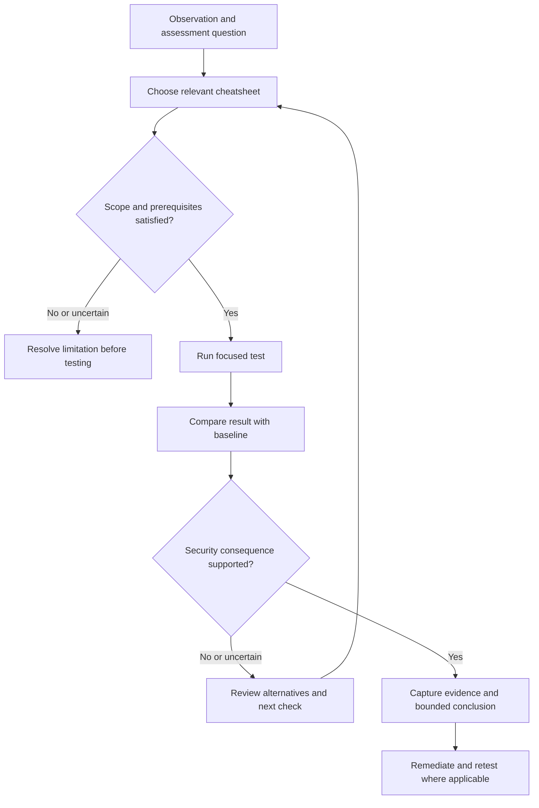

# Cheatsheets

Quick operational references for authorised security assessments: commands, focused workflows, validation steps, troubleshooting and result interpretation.

Use these pages when you need to answer:

- What should I check?
- When does this command or technique apply?
- What prerequisites must be satisfied?
- What should the result look like?
- What does the result actually establish?
- What should I validate next?

The catalogue below links to all 29 dedicated cheatsheets. Use the detailed topic notes when you need background, protocol internals, a fuller testing method or remediation guidance.

**Observation -> Candidate -> Validation -> Evidence -> Security Conclusion**

!!! warning "Authorised security testing"
    Use these references only within the approved scope and Rules of Engagement. Check targets, accounts, privileges, operational impact and cleanup requirements before execution. A command appearing in a cheatsheet does not make it appropriate for every environment.

## Start Here

<div class="grid cards" markdown>

-   **Host Assessment**

    ---

    Establish identity, permissions, services, scheduled execution, security controls and privilege-escalation candidates.

    [Linux](linux.md) · [Windows](windows.md) · [PowerShell](powershell.md)

-   **Networking and Traffic**

    ---

    Investigate interfaces, routes, DNS, service exposure, connectivity and packet evidence.

    [Networking](networking.md) · [Nmap](nmap.md) · [Wireshark and tshark](wireshark-tshark.md)

-   **Web Assessment and Tooling**

    ---

    Map the application, capture a baseline, discover relevant content and reproduce focused requests.

    [Web](web.md) · [Burp Suite](burp-suite.md) · [curl](curl.md) · [Content Discovery](content-discovery.md)

-   **Authentication and Access Control**

    ---

    Review identities, sessions, resource permissions, tokens and federated login flows.

    [Authentication and Sessions](authentication-session-testing.md) · [Authorisation, IDOR and BOLA](authorization-access-control.md)

    [JWT](jwt.md) · [OAuth 2.0 and OpenID Connect](oauth-oidc.md)

-   **Active Directory**

    ---

    Connect domain context, protocol access and directory relationships to candidate attack paths.

    [Active Directory](active-directory.md) · [NetExec](netexec.md) · [BloodHound](bloodhound.md) · [Impacket](impacket.md)

-   **Source Code and Repositories**

    ---

    Search code, inspect changes and trace candidate security checks before selecting a validation method.

    [Git and ripgrep](git-ripgrep.md)

</div>

## Complete Cheatsheet Catalogue

Choose a reference according to the question being investigated. These categories organise the pages; they are not a mandatory testing sequence.

### Operating Systems and Shells

| Cheatsheet | Use it for |
|---|---|
| [Linux](linux.md) | Identity, groups, sudo, permissions, SUID/SGID, capabilities, services, scheduled jobs, containers and host assessment |
| [Windows](windows.md) | Identity, privileges, services, scheduled tasks, filesystem and registry permissions, execution controls and host assessment |
| [PowerShell](powershell.md) | Syntax, configuration queries, files, ACLs, registry, networking, remoting, language modes and evidence collection |

### Networking and Traffic

| Cheatsheet | Use it for |
|---|---|
| [Networking](networking.md) | Interfaces, addresses, routes, DNS, sockets, connectivity, TLS, tunnels, proxies, VPNs and pivoting context |
| [Nmap](nmap.md) | Approved host and service discovery, scan selection, output interpretation and focused follow-up |
| [Wireshark and tshark](wireshark-tshark.md) | Packet capture, traffic filtering, protocol inspection and network evidence |

### Web Assessment and Tooling

| Cheatsheet | Use it for |
|---|---|
| [Web Application Security](web.md) | The overall web assessment workflow and routing into specific tests |
| [Burp Suite](burp-suite.md) | Request interception, manual testing, comparison and application-testing workflows |
| [curl](curl.md) | Focused HTTP requests, headers, cookies, request bodies, proxies and response inspection |
| [Content Discovery](content-discovery.md) | Identifying routes, files and application content while accounting for baseline responses and filtering |

### Authentication, Sessions and Identity

| Cheatsheet | Use it for |
|---|---|
| [Authentication and Session Testing](authentication-session-testing.md) | Login, session state, logout, recovery and identity-related validation |
| [Authorisation, IDOR and BOLA](authorization-access-control.md) | Role, object, operation and tenant access checks using controlled identities |
| [JWT Security Testing](jwt.md) | Token structure, validation assumptions, claims and application acceptance behaviour |
| [OAuth 2.0 and OpenID Connect](oauth-oidc.md) | Authorisation flows, redirects, tokens and identity-provider integration |

### Browser Security

| Cheatsheet | Use it for |
|---|---|
| [CORS and CSRF](cors-csrf.md) | Cross-origin data access and cross-site request behaviour under relevant browser and session conditions |

### Injection

| Cheatsheet | Use it for |
|---|---|
| [SQL Injection](sql-injection.md) | Database-input candidates, controlled comparisons and validation |
| [Cross-Site Scripting](xss.md) | Reflection, storage, DOM behaviour, execution context and browser evidence |
| [OS Command Injection](command-injection.md) | Input reaching operating-system command handling and bounded validation of execution |

### Server-Side Processing and File Handling

| Cheatsheet | Use it for |
|---|---|
| [SSRF](ssrf.md) | Server-side request behaviour, controlled callbacks and destination restrictions |
| [XXE](xxe.md) | XML-processing candidates, entity handling and controlled validation |
| [SSTI](ssti.md) | Template-processing behaviour and evidence of server-side evaluation |
| [Insecure Deserialization](deserialization.md) | Serialised-input handling, reachable processing and security-relevant effects |
| [Path Traversal and File Inclusion](path-traversal-file-inclusion.md) | Path processing, file access, inclusion behaviour and boundary validation |
| [File Upload Security](file-upload.md) | Acceptance, storage, naming, retrieval, permissions and downstream processing |

### Source Code and Repositories

| Cheatsheet | Use it for |
|---|---|
| [Git and ripgrep](git-ripgrep.md) | Repository history, diffs, source searches and locating candidate data flows or security checks |

### Active Directory and Protocol Tools

| Cheatsheet | Use it for |
|---|---|
| [Active Directory](active-directory.md) | Domain context, authentication, permissions, delegation, AD CS, trusts and assessment sequencing |
| [NetExec](netexec.md) | Approved protocol, authentication and access checks across relevant services |
| [Impacket](impacket.md) | Focused SMB, RPC, Kerberos, ticket and remote-administration operations |
| [BloodHound](bloodhound.md) | Collection context, graph relationships, queries, candidate paths and validation |

## How to Use a Cheatsheet

Start with a question, not a list of commands.

1. **Establish context.** Identify the target, account, platform and current access.
2. **Choose the reference.** Select the page that addresses the observed behaviour.
3. **Check prerequisites.** Confirm tool version, permissions, authentication, dependencies and scope.
4. **Review the action.** Understand its traffic, data access, changes and cleanup requirements.
5. **Run a focused test.** Use the smallest useful target set and a known baseline.
6. **Interpret the result.** Separate observations from assumptions and alternative explanations.
7. **Validate the consequence.** Establish the relevant security boundary or control outcome.
8. **Record evidence.** State what was demonstrated and what remains uncertain.



A successful command does not automatically demonstrate a vulnerability. A failed command does not automatically demonstrate an effective security control.

A missing utility, permission error or empty result may limit visibility. Record that limitation rather than assuming the resource or control is absent.

## Practical Assessment Routes

### Host Assessment

Begin with [Linux](linux.md) or [Windows](windows.md), then use [PowerShell](powershell.md) where it supports the Windows investigation.

Establish:

- Identity, groups, privileges and session context.
- Host role, platform and relevant configuration.
- Services, scheduled execution and their dependencies.
- Effective permissions on resources of interest.
- Credential exposure within the authorised scope.
- Applicable security controls.
- Network position and accessible services.

Use [Networking](networking.md) for connectivity questions and [PrivEsc Explorer](../privesc/index.md) for candidate privilege mechanisms.

A writable resource becomes an escalation candidate when it connects to a relevant privileged operation. Establish that relationship before claiming elevated execution.

### Active Directory Assessment

Use the references together according to the current question:

| Question | Reference |
|---|---|
| What domain and identity context should I establish? | [Active Directory](active-directory.md) |
| Which approved services accept this authentication or permit this operation? | [NetExec](netexec.md) |
| Which directory relationships suggest a path? | [BloodHound](bloodhound.md) |
| Which focused protocol operation can validate the candidate? | [Impacket](impacket.md) |
| What does the resulting host access permit? | [Windows](windows.md) and [PowerShell](powershell.md) |
| Why does the connection or protocol exchange fail? | [Networking](networking.md) and [Wireshark and tshark](wireshark-tshark.md) |

This is a selection model, not a requirement to run every tool.

Keep authentication success, resource access, administrative rights and code execution separate. A valid credential does not authorise testing every system where it might work.

For Kerberos, NTLM, ACLs, delegation, AD CS and trusts, continue into the detailed [Active Directory notes](../active-directory/index.md).

### Web Application Assessment

Start with [Web](web.md) and establish the application, roles, sessions, endpoints and intended behaviour.

Use:

- [Burp Suite](burp-suite.md) to inspect and compare requests.
- [curl](curl.md) for focused reproduction outside the browser.
- [Content Discovery](content-discovery.md) to investigate relevant routes and files.
- [Authentication and Sessions](authentication-session-testing.md) to establish identity state.
- [Authorisation](authorization-access-control.md) to compare permitted and prohibited operations.
- The relevant injection, token, browser or server-side cheatsheet for the candidate under investigation.

Keep the original request and a known-good response. Change one relevant condition at a time where practical.

APIs, business logic, request smuggling, GraphQL and other broader subjects remain accessible through [Web](web.md) and the detailed [Web Application Security section](../web/index.md).

### Network Troubleshooting

Use [Networking](networking.md) to establish the source context, interface, route, DNS result, destination and expected protocol.

Use [Nmap](nmap.md) for an approved exposure check and [Wireshark and tshark](wireshark-tshark.md) when packet evidence can resolve what happened.

Distinguish:

- Name resolution from reachability.
- A listening service from end-to-end accessibility.
- A connection from successful application communication.
- Authentication from authorisation.
- A tunnel or proxy route from permission to assess the destination.

### Source Review and Research

Use [Git and ripgrep](git-ripgrep.md) to locate candidate functions, checks and changes.

Then follow [Source Code Review](../source-code-review/index.md) to trace the relevant data flow and [Vulnerability Research](../vulnerability-research/index.md) for reproduction, root-cause analysis and impact validation.

A search match, changed line or dangerous-looking function name is a candidate, not a finding.

## Before Copying a Command

Check the command in the context of your actual environment.

| Check | Why it matters |
|---|---|
| Target and scope | A placeholder, range or wildcard may affect more systems than intended |
| Current identity | Permissions and authentication state influence the result |
| Shell and platform | Quoting, variables, paths and line continuation differ between shells |
| Tool version | Options, defaults and output may differ from the reference |
| Authentication context | Local and domain accounts, tickets and tokens are not interchangeable |
| Operational effect | Some commands change state, access sensitive material or create significant traffic |
| Baseline | Without expected behaviour, an unusual result is difficult to interpret |
| Output handling | Credentials and sensitive data may appear in logs or terminal captures |
| Cleanup | Files, sessions, jobs or configuration changes may require restoration |

Read the explanation around a command before running it. Replace example values deliberately and preserve the exact command used in your evidence.

## From Output to Evidence

The examples below illustrate the interpretation model used throughout the cheatsheets.

### Example: Windows Service Permissions

Suppose enumeration identifies:

```text
Service:
ExampleService

Executable:
C:\Program Files\Example\Service.exe
```

An ACL entry shows:

```text
BUILTIN\Users Allow ReadAndExecute
```

That entry grants read and execute permissions. It does not itself grant modification or replacement rights.

Assess the complete effective permission context, including other entries and relevant parent-directory permissions, before drawing a broader conclusion.

If an applicable entry instead grants:

```text
BUILTIN\Users Allow Modify
```

there is a candidate worth investigating:

- Does the current user's effective access permit the relevant modification?
- Is this the executable actually used by the service?
- Which identity runs the service?
- What starts or reloads it?
- Is the trigger available during the authorised test?
- Would applicable controls prevent the proposed behaviour?

The evidence may establish a writable privileged dependency even if active execution testing is outside scope. Report that distinction explicitly.

Continue with [Windows](windows.md), [PowerShell](powershell.md) and the detailed [Windows notes](../windows/index.md).

### Example: BloodHound Relationships

Suppose the collected graph contains:

| Source | Relationship | Destination |
|---|---|---|
| Test user | MemberOf | HELPDESK |
| HELPDESK | GenericAll | SERVER-ADMINS |

Treat this as a candidate path.

Validate:

1. Collection time, source and relevant coverage limitations.
2. Current membership and the identity being assessed.
3. The applicable permissions on the destination object.
4. What control those permissions provide in this context.
5. What access the destination group actually has.
6. Which restrictions and scope boundaries affect further validation.

The name `SERVER-ADMINS` does not prove administrative rights. The graph alone does not prove that a privilege transition was performed.

Use the [BloodHound cheatsheet](bloodhound.md) and the documented [GenericAll relationship](https://bloodhound.specterops.io/resources/edges/generic-all){ target="_blank" rel="noopener noreferrer" } to interpret the candidate.

### Example: Web Object Access

Suppose changing:

```text
GET /api/orders/1001
```

to:

```text
GET /api/orders/1002
```

returns another object.

Before reporting IDOR/BOLA, establish:

- Which account made the request.
- Who owns object `1002`.
- Whether it is private, shared or publicly accessible.
- Whether the current account should be permitted access.
- What protected information or action was exposed.
- Whether controlled accounts reproduce the result.
- Whether caching or an existing privileged session explains it.

A defensible conclusion would state:

> With two dedicated accounts and verified private-object ownership, Account A retrieved Account B's order through the tested endpoint. The expected access restriction was not enforced for this request.

Use [Authorisation, IDOR and BOLA](authorization-access-control.md) for the testing reference. The relevant failure is access beyond the intended permissions, as explained in [PortSwigger's access-control guidance](https://portswigger.net/web-security/access-control){ target="_blank" rel="noopener noreferrer" }.

## Evidence Collection

For meaningful tests, preserve enough information to reproduce the action and assess the conclusion.

```text
Test identifier:
Timestamp and timezone:
Target:
Source:
Account and session context:
Platform / relevant configuration:
Tool and version:

Question or candidate:
Prerequisites:
Command or request:
Expected result:
Observed result:
Evidence references:

Interpretation:
Alternative explanations checked:
Demonstrated security consequence:
Limitations:
Next validation step:

Changes introduced:
Cleanup:
Remediation:
Retest result:
```

Protect sensitive originals and redact unnecessary credentials, tokens, personal data and internal details from sharing copies.

Distinguish evidence that a condition exists from evidence that it was successfully used. Record prevented, inconclusive and untested outcomes as well as successful tests.

## Cheatsheets, Detailed Notes and Tools

| Resource | Use it when you need |
|---|---|
| Cheatsheets | Fast lookup, focused procedures, expected output, interpretation and troubleshooting |
| Detailed topic notes | Background, protocol behaviour, prerequisites, deeper validation and remediation |
| Tools section | Tool purpose, selection, setup, workflow and limitations |
| PrivEsc Explorer | Navigation from an observed host condition to a candidate privilege mechanism |

The same assessment may move between all four.

For example, use the Windows cheatsheet to inspect a service, the detailed service notes to understand the permission relationship, and the Tools section when selecting an enumeration utility.

Avoid treating either a cheatsheet or a tool's output as a substitute for understanding the security condition.

## Quick Review Before Reporting

- [ ] The target and action were authorised.
- [ ] The identity and environment are recorded.
- [ ] Relevant prerequisites were satisfied.
- [ ] Expected behaviour is understood.
- [ ] The result is reproducible or its reliability is documented.
- [ ] Alternative explanations were considered.
- [ ] The security boundary or control outcome is explicit.
- [ ] The conclusion matches the demonstrated evidence.
- [ ] Sensitive evidence is handled appropriately.
- [ ] Changes and cleanup are recorded.
- [ ] Remediation and retesting follow the underlying cause.

## Related Knowledge Base Sections

- [Web Application Security](../web/index.md)
- [Source Code Review](../source-code-review/index.md)
- [Active Directory](../active-directory/index.md)
- [Windows](../windows/index.md)
- [Linux](../linux/index.md)
- [PrivEsc Explorer](../privesc/index.md)
- [Red Teaming](../red-teaming/index.md)
- [Purple Teaming](../purple-teaming/index.md)
- [Vulnerability Research](../vulnerability-research/index.md)
- [Tools](../tools/index.md)

## References

- [OWASP Web Security Testing Guide](https://owasp.org/www-project-web-security-testing-guide/){ target="_blank" rel="noopener noreferrer" }
- [OWASP Cheat Sheet Series](https://cheatsheetseries.owasp.org/){ target="_blank" rel="noopener noreferrer" }
- [MITRE ATT&CK](https://attack.mitre.org/){ target="_blank" rel="noopener noreferrer" }
- [PortSwigger Web Security Academy](https://portswigger.net/web-security){ target="_blank" rel="noopener noreferrer" }
- [BloodHound Documentation](https://bloodhound.specterops.io/){ target="_blank" rel="noopener noreferrer" }
- [NetExec Documentation](https://www.netexec.wiki/){ target="_blank" rel="noopener noreferrer" }
- [Impacket GitHub](https://github.com/fortra/impacket){ target="_blank" rel="noopener noreferrer" }
- [Microsoft Learn - Windows Security](https://learn.microsoft.com/en-us/windows/security/){ target="_blank" rel="noopener noreferrer" }
- [Microsoft Learn - Active Directory Domain Services](https://learn.microsoft.com/en-us/windows-server/identity/ad-ds/get-started/virtual-dc/active-directory-domain-services-overview){ target="_blank" rel="noopener noreferrer" }
