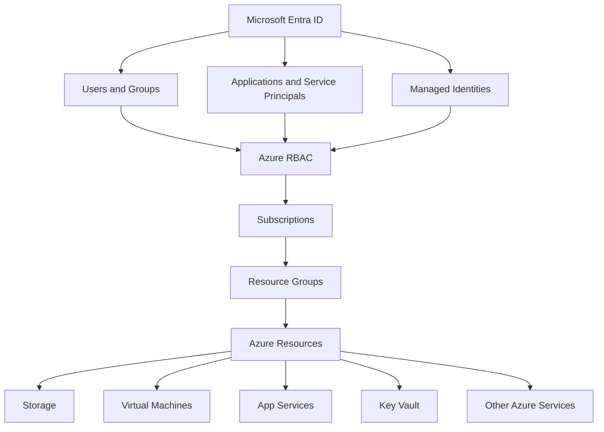
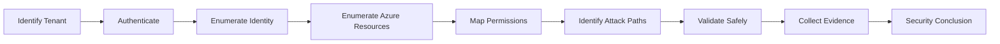
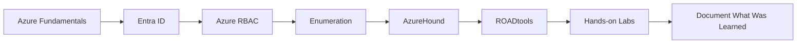

# Azure Security

Microsoft Azure security testing combines **cloud infrastructure**, **identity**, **permissions**, **applications**, and **Microsoft Entra ID**.

Unlike a traditional Active Directory assessment, an Azure assessment is not limited to hosts and domain relationships. Identity and access decisions can span tenants, subscriptions, resource groups, applications, service principals, managed identities, Azure resources, and Microsoft 365 services.

These notes provide a foundation for Azure security testing and will be expanded as practical experience with Azure environments and labs grows.

!!! note
    This section intentionally focuses on core concepts and repeatable assessment methodology rather than attempting to document every Azure attack technique.

---

## Azure Security Model

A useful starting point is to separate the major layers of an Azure environment.



The important security question is not simply:

> What resources exist?

It is:

> Which identities can influence which resources, through which permissions, and what security boundary can that access cross?

---

## Core Terminology

Understanding Azure terminology is important before attempting enumeration or attack-path analysis.

| Term | Description |
|---|---|
| Tenant | An organisation's Microsoft Entra ID directory |
| Entra ID | Microsoft's cloud identity and access management service |
| User | Human identity within the tenant |
| Group | Collection of identities used for access and administration |
| Application | Application definition registered in Entra ID |
| Service Principal | Tenant-specific identity representing an application or service |
| Managed Identity | Azure-managed identity that allows a resource to authenticate to other services |
| Subscription | Administrative and billing boundary containing Azure resources |
| Resource Group | Logical container for Azure resources |
| Resource | Azure object such as a VM, Key Vault, Storage Account, or App Service |
| Azure RBAC | Role-based access control used to authorise access to Azure resources |
| Role Assignment | Association between an identity, role, and scope |
| Scope | Level at which permissions apply |
| Access Token | Token used to access a particular API or resource |
| Refresh Token | Token that may be used to obtain new access tokens |

---

## Resource Hierarchy

Azure resources are organised hierarchically.

```text
Tenant
└── Management Groups
    └── Subscriptions
        └── Resource Groups
            └── Resources
```

Permissions assigned at a higher scope may be inherited by objects below it.

For example:

```text
Subscription
    |
    | Contributor
    v
User
```

may give the user significant control over resources throughout the subscription.

Always determine both:

```text
Permission
+
Scope
```

A powerful role at a narrow scope may have limited impact, while the same role at subscription scope can have much greater consequences.

---

## Identity Is Central

Azure assessments are heavily identity-driven.

Important identity objects include:

- users;
- groups;
- service principals;
- applications;
- managed identities;
- devices;
- administrative roles.

A useful mental model is:

```text
Identity
   ↓
Authentication
   ↓
Token
   ↓
Permission
   ↓
Resource
   ↓
Security Impact
```

Possession of valid credentials does not automatically mean administrative access.

Similarly:

```text
Authentication Success
!=
Authorisation
!=
Administrative Rights
```

The permissions associated with the authenticated identity still need to be established.

---

## Microsoft Entra ID

Microsoft Entra ID is the identity layer used by Azure and many Microsoft cloud services.

During an authorised assessment, relevant areas may include:

- users and groups;
- directory roles;
- applications;
- service principals;
- enterprise applications;
- OAuth permissions;
- managed identities;
- devices;
- Conditional Access;
- authentication methods;
- tenant relationships.

Entra ID should not be treated as simply "Active Directory in the cloud".

Traditional Active Directory and Entra ID have different protocols, objects, trust models, authentication flows, and administrative boundaries.

---

## Azure RBAC

Azure Role-Based Access Control determines what identities can perform against Azure resources.

A role assignment can be viewed as:

```text
Security Principal
        +
Role Definition
        +
Scope
        =
Effective Access
```

Common built-in roles include:

| Role | General Meaning |
|---|---|
| Reader | View resources |
| Contributor | Manage resources but generally cannot assign Azure RBAC roles |
| Owner | Full resource management including access delegation |
| User Access Administrator | Manage user access to Azure resources |

Custom roles may also exist.

Do not infer impact from the role name alone. Review the actual permissions and scope.

---

## Assessment Workflow

A basic Azure assessment can follow:



The same reasoning model used throughout these notes applies:

**Observation → Candidate → Validation → Evidence → Security Conclusion**

---

## 1. Identify the Tenant

Start by understanding the Microsoft cloud environment being assessed.

Identify:

- tenant ID;
- tenant domain;
- verified domains;
- subscription IDs where available;
- accessible Microsoft cloud services;
- current identity;
- assessment scope.

Avoid assuming that discovering a tenant automatically means the associated resources are within scope.

---

## 2. Establish the Current Identity

When authenticated, determine:

- username or service identity;
- tenant;
- object ID;
- groups;
- directory roles;
- Azure RBAC assignments;
- accessible subscriptions;
- token context.

The objective is to understand:

```text
Who am I?
        ↓
What can I access?
        ↓
What can I modify?
```

---

## 3. Enumerate the Environment

Initial enumeration should build an inventory of:

```text
Users
Groups
Applications
Service Principals
Managed Identities
Subscriptions
Resource Groups
Resources
Role Assignments
```

Enumeration should be treated as discovery.

Finding an interesting object or permission does not automatically demonstrate a vulnerability.

---

## 4. Map Relationships

The next step is understanding how identities and resources are connected.

For example:

```text
User
  ↓
Group
  ↓
Role Assignment
  ↓
Subscription
  ↓
Resource
```

or:

```text
User
  ↓
Application
  ↓
Service Principal
  ↓
Permission
  ↓
Azure Resource
```

Complex environments are easier to analyse when relationships are represented as attack paths rather than isolated objects.

---

## 5. Validate Effective Access

Permissions should be validated carefully.

Distinguish between:

```text
Permission Exists
```

and:

```text
Permission Produces Security Impact
```

Questions include:

- What action does the permission allow?
- At what scope?
- Can the identity actually perform the action?
- Is another control preventing it?
- Can the action influence another identity or resource?
- Does it cross a security boundary?

---

## 6. Collect Evidence

Useful evidence may include:

- tenant information;
- current identity;
- role assignments;
- resource scope;
- relevant application permissions;
- Azure CLI output;
- Microsoft Graph output;
- Azure Resource Manager output;
- AzureHound relationships;
- ROADtools enumeration;
- screenshots;
- controlled validation results.

Evidence should demonstrate the reasoning chain rather than simply contain large tool dumps.

---

# Basic Tooling

Several tools are useful when learning and assessing Azure environments.

---

## Azure CLI

Azure CLI is Microsoft's command-line interface for Azure.

Check the current account:

```bash
az account show
```

List available subscriptions:

```bash
az account list -o table
```

Show the active subscription:

```bash
az account show --query "{name:name,id:id,tenantId:tenantId,user:user.name}" -o json
```

List resource groups:

```bash
az group list -o table
```

List resources:

```bash
az resource list -o table
```

!!! note
    The resources returned depend on the permissions of the authenticated identity.

---

## AzureHound

[AzureHound](https://github.com/SpecterOps/AzureHound){ target="_blank" rel="noopener noreferrer" } is the Azure data collector used with BloodHound.

It can help collect Azure and Entra-related information so relationships can be analysed as a graph.

The conceptual workflow is:

```text
Azure / Entra ID
       ↓
AzureHound
       ↓
Collected Relationships
       ↓
BloodHound
       ↓
Attack Path Analysis
```

AzureHound is particularly useful when many identity and permission relationships make manual analysis difficult.

Typical questions include:

- Which users have privileged relationships?
- Which groups influence privileged resources?
- Which service principals have interesting permissions?
- Which identities can reach higher-privileged objects?
- What attack paths exist between the current identity and sensitive resources?

!!! important
    A BloodHound path is a **candidate attack path**. Validate whether the permissions and relationships are actually usable in the assessed environment before reporting impact.

---

## ROADtools

[ROADtools](https://github.com/dirkjanm/ROADtools){ target="_blank" rel="noopener noreferrer" } is a framework for interacting with and exploring Microsoft Entra ID.

The project includes several components.

### ROADrecon

ROADrecon focuses on collecting and exploring Entra ID information.

A simplified workflow is:

```text
Authenticate
    ↓
Gather
    ↓
Store
    ↓
Analyse
```

The collected data can be analysed locally, which is useful for understanding:

- users;
- groups;
- applications;
- service principals;
- directory relationships;
- policies;
- tenant configuration.

### ROADlib

ROADlib provides reusable authentication and Entra ID functionality used by the ROADtools ecosystem.

### roadtx

`roadtx` focuses on Microsoft identity authentication and token-related workflows.

Because tokens can provide access to different resources and APIs, always identify:

```text
Identity
+
Client
+
Resource / Scope
+
Token
```

before drawing conclusions about what a token permits.

---

## AzureHound vs ROADtools

The tools overlap in the broader goal of understanding Microsoft cloud environments but serve different purposes.

| Tool | Primary Use |
|---|---|
| Azure CLI | Interacting with Azure resources and subscriptions |
| AzureHound | Collecting relationships for BloodHound attack-path analysis |
| ROADrecon | Detailed Entra ID enumeration and offline exploration |
| ROADlib | Authentication and reusable Entra ID functionality |
| roadtx | Authentication and token-oriented workflows |

They should be treated as complementary rather than competing tools.

---

# Areas to Learn

As this section expands, useful Azure security topics include:

### Identity

- Microsoft Entra ID;
- users and groups;
- directory roles;
- applications;
- service principals;
- managed identities.

### Authentication

- OAuth 2.0;
- OpenID Connect;
- access tokens;
- refresh tokens;
- device authentication;
- Conditional Access.

### Authorisation

- Azure RBAC;
- role assignments;
- scopes;
- custom roles;
- resource permissions.

### Azure Resources

- Storage Accounts;
- Key Vault;
- Virtual Machines;
- App Services;
- Function Apps;
- Azure SQL;
- networking.

### Security Testing

- tenant enumeration;
- identity enumeration;
- permission analysis;
- attack-path analysis;
- exposed resources;
- application misconfiguration;
- dangling DNS;
- subdomain takeover.

The notes can be expanded topic by topic as practical experience grows.

---

# Current Azure Notes

## Subdomain Takeover

Azure services can become part of a subdomain takeover condition when organisational DNS continues to reference a deleted or otherwise unavailable cloud resource.

The important distinction is:

```text
Dangling DNS
!=
Confirmed Subdomain Takeover
```

Resource claimability must be validated before describing the issue as a confirmed takeover.

[Azure Subdomain Takeover](subdomain-takeover.md)

---

# Learning Resources

These notes are intended to complement hands-on Azure practice rather than replace it.

## Pwned Labs

[Pwned Labs Microsoft Cloud Red Team Professional Bootcamp](https://pwnedlabs.io/bootcamps/mcrtp-bootcamp){ target="_blank" rel="noopener noreferrer" }

The Microsoft cloud training path provides hands-on Azure and Microsoft 365 attack and defence scenarios and leads toward the MCRTP certification.

This can be used later as a structured practical path once deeper Azure study begins.

---

## PWNCLOUDOS

[PWNCLOUDOS](https://pwnedlabs.io/pwncloudos){ target="_blank" rel="noopener noreferrer" }

PWNCLOUDOS is a cloud-focused security operating system containing tooling for Azure, AWS, and GCP.

It can provide a dedicated environment for cloud security labs instead of manually building a large cloud tooling environment.

---

## HackTricks Cloud

[HackTricks - Azure Security](https://cloud.hacktricks.wiki/en/pentesting-cloud/azure-security/index.html){ target="_blank" rel="noopener noreferrer" }

HackTricks provides a broad Azure security reference covering enumeration, identity, permissions, services, and security testing techniques.

It is useful as a technical reference while working through labs, but findings should always be validated against current Microsoft behaviour and the actual environment.

---

## AzureHound

[AzureHound - GitHub](https://github.com/SpecterOps/AzureHound){ target="_blank" rel="noopener noreferrer" }

Use AzureHound when learning Azure and Entra ID attack-path analysis with BloodHound.

---

## ROADtools

[ROADtools - GitHub](https://github.com/dirkjanm/ROADtools){ target="_blank" rel="noopener noreferrer" }

ROADtools is useful for deeper Entra ID enumeration, authentication research, and token-oriented workflows.

---

# Learning Approach

A practical progression for these notes is:



Rather than documenting advanced techniques before using them, new Azure pages should be added after the underlying concept has been studied or validated in a lab.

This keeps the notes practical and experience-driven.

---

## Related Notes

- [Azure Subdomain Takeover](subdomain-takeover.md)
- [OAuth 2.0 and OpenID Connect](../../web/oauth-oidc.md)
- [Active Directory](../../active-directory/index.md)
- [BloodHound](../../active-directory/bloodhound.md)
