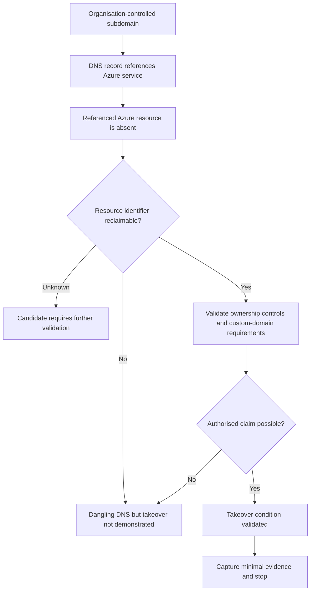

# Azure Subdomain Takeover

Azure subdomain takeover occurs when an organisation's DNS record continues to reference an Azure resource that has been deleted, decommissioned, renamed, or otherwise released, and the referenced resource identifier can subsequently be claimed by another Azure tenant or subscription.

A common pattern is a custom subdomain using a `CNAME` record:

```text
portal.example.com
        |
        v
CNAME
        |
        v
example-app.azurewebsites.net
```

If the Azure resource behind `example-app.azurewebsites.net` is removed while the organisation leaves the DNS record in place, the custom domain may become a **dangling DNS record**.

The security question is not simply whether the Azure hostname returns `NXDOMAIN`.

The important question is:

> Can an unauthorised party claim the referenced Azure resource and cause the organisation-controlled hostname to serve content or interact with a service under their control?

This distinction is important because Azure resource naming, custom-domain validation, resource-reuse protections, and provider behaviour can change.

!!! warning "Authorised testing only"

```
Only validate takeover conditions for domains and Azure resources that are explicitly in scope.

Do not claim third-party resources, attach production domains, or publish content through an organisation's hostname unless the rules of engagement explicitly permit that validation method.
```

---

## Security Model

A typical Azure subdomain takeover condition involves several independent prerequisites.



The assessment model should therefore be:

```text
DNS observation
      |
      v
Azure service identified
      |
      v
Dangling resource suspected
      |
      v
Resource claimability checked
      |
      v
Domain-binding requirements checked
      |
      v
Controlled validation
      |
      v
Evidence
      |
      v
Security conclusion
```

Not:

```text
NXDOMAIN
   |
   v
Confirmed takeover
```

---

# Why Subdomain Takeovers Occur

Cloud infrastructure changes frequently.

Applications may be:

* migrated;
* renamed;
* rebuilt;
* moved between subscriptions;
* replaced by another platform;
* removed after testing;
* decommissioned after a project ends.

DNS records are often managed separately from the underlying Azure resources.

This creates a common lifecycle problem:

```text
Create Azure resource
        |
        v
Create DNS record
        |
        v
Use application
        |
        v
Delete Azure resource
        |
        v
DNS record accidentally remains
        |
        v
Dangling reference
```

The safest decommissioning sequence is normally to remove or update the external DNS dependency before releasing the resource identifier.

---

# CNAME and DNS Relationship

A `CNAME` record aliases one hostname to another hostname.

Example:

```text
blog.example.com.  CNAME  example-blog.azurewebsites.net.
```

The organisation controls:

```text
blog.example.com
```

Azure controls the parent service namespace:

```text
azurewebsites.net
```

The organisation controls or previously controlled a resource underneath that namespace:

```text
example-blog.azurewebsites.net
```

If the Azure resource disappears but the `CNAME` remains, the DNS relationship becomes potentially dangerous.

---

# Discovery

Start with normal subdomain enumeration.

Possible sources include:

* certificate transparency;
* DNS enumeration;
* historical DNS;
* passive DNS;
* search engines;
* asset inventories;
* application documentation;
* source-code references;
* infrastructure-as-code;
* archived URLs.

A discovered hostname is only an **observation**.

For example:

```text
legacy.example.com
```

The next step is to understand its DNS configuration.

---

# Inspect DNS Records

## dig

Query the hostname:

```bash
dig legacy.example.com
```

Request the CNAME directly:

```bash
dig CNAME legacy.example.com
```

Use a short response:

```bash
dig +short legacy.example.com
```

Follow the DNS chain:

```bash
dig +trace legacy.example.com
```

A possible result might resemble:

```text
legacy.example.com.
    CNAME
old-application.azurewebsites.net.
```

Now inspect the Azure destination:

```bash
dig old-application.azurewebsites.net
```

An absent destination might return:

```text
status: NXDOMAIN
```

!!! warning "NXDOMAIN is not proof"

```
`NXDOMAIN` can indicate that the referenced resource no longer exists, but it does not prove that the resource name can be registered by another party.

Treat it as a candidate condition requiring provider-specific validation.
```

---

# Additional DNS Tools

## host

```bash
host legacy.example.com
```

## nslookup

```bash
nslookup legacy.example.com
```

## Resolve-DnsName

From Windows PowerShell:

```powershell
Resolve-DnsName legacy.example.com
```

Query specifically for a CNAME:

```powershell
Resolve-DnsName legacy.example.com -Type CNAME
```

---

# Follow the Complete DNS Chain

Do not stop after identifying the first CNAME.

A DNS relationship can contain multiple layers:

```text
app.example.com
        |
        v
edge.example.net
        |
        v
service.azureedge.net
```

Record:

* the original hostname;
* record type;
* intermediate aliases;
* final destination;
* DNS response;
* TTL;
* Azure service family.

This helps distinguish an Azure dependency from unrelated DNS behaviour.

---

# Identify the Azure Service

Azure uses different service namespaces.

Examples historically associated with Azure-hosted resources include:

| Azure service family                    | Example namespace                 |
| --------------------------------------- | --------------------------------- |
| App Service                             | `*.azurewebsites.net`             |
| Traffic Manager                         | `*.trafficmanager.net`            |
| Azure CDN / Front Door related services | Azure-managed CDN/edge namespaces |
| Virtual machine public DNS              | `*.cloudapp.azure.com`            |
| Blob Storage                            | `*.blob.core.windows.net`         |
| API Management                          | `*.azure-api.net`                 |
| Azure SQL                               | `*.database.windows.net`          |
| Azure AI Search                         | `*.search.windows.net`            |
| Container Registry                      | `*.azurecr.io`                    |
| Container Instances                     | `*.azurecontainer.io`             |
| Azure Cache for Redis                   | `*.redis.cache.windows.net`       |
| Service Bus                             | `*.servicebus.windows.net`        |

!!! note "Service behaviour changes"

```
The presence of an Azure namespace does not mean the service is currently vulnerable to subdomain takeover.

Microsoft can introduce ownership verification, scoped name reuse, reservation mechanisms, custom-domain validation, or other protections.

Historical takeover behaviour must therefore be separated from current claimability.
```

---

# Candidate Identification

A strong candidate usually contains several signals.

For example:

```text
subdomain.example.com
        |
        v
CNAME
        |
        v
resource.azure-service.example
        |
        v
Resource absent
```

Useful observations include:

* organisation-controlled DNS record still exists;
* destination belongs to an external/cloud service;
* referenced resource appears absent;
* HTTP response resembles an unconfigured/deleted resource;
* DNS destination returns `NXDOMAIN`;
* provider-specific error page indicates missing configuration;
* resource identifier appears potentially reusable.

These observations increase confidence but do not independently prove takeover.

---

# HTTP and HTTPS Validation

DNS should be correlated with application behaviour.

Check HTTP:

```bash
curl -i http://legacy.example.com/
```

Check HTTPS:

```bash
curl -ik https://legacy.example.com/
```

Follow redirects where appropriate:

```bash
curl -ikL https://legacy.example.com/
```

Useful observations include:

* provider-specific error messages;
* default Azure pages;
* missing-site responses;
* certificate behaviour;
* redirect behaviour;
* CDN or proxy headers;
* unexpected application content.

Do not treat an error page alone as confirmation.

---

# Azure App Service Example

Consider:

```text
legacy.example.com
        |
        v
old-example-app.azurewebsites.net
```

Query the custom hostname:

```bash
dig CNAME legacy.example.com
```

Possible result:

```text
legacy.example.com.  CNAME  old-example-app.azurewebsites.net.
```

Then query the destination:

```bash
dig old-example-app.azurewebsites.net
```

If the destination does not exist, the DNS record is dangling.

At this stage the correct conclusion is:

```text
Dangling Azure App Service reference identified
```

Not:

```text
Subdomain takeover confirmed
```

The remaining question is whether Azure currently permits an unauthorised tenant to obtain the required resource identifier and associate the custom hostname.

---

# Resource Claimability

Resource claimability is the critical validation boundary.

The assessment should determine:

1. Does the referenced Azure resource still exist?
2. Is the identifier reusable?
3. Is reuse globally available or restricted?
4. Does Azure require proof of custom-domain ownership?
5. Is a verification record already present?
6. Does Azure protect previously used names?
7. Is the resource namespace scoped to a subscription, tenant, region, or reuse policy?
8. Can the organisation-controlled hostname actually be bound to the new resource?

Only after these conditions are understood can takeover likelihood be assessed accurately.

---

# Azure Portal Validation

For an authorised assessment, the Azure portal can sometimes be used to determine whether a candidate resource identifier is available.

For example, when creating an applicable resource, Azure may indicate whether the requested name is:

```text
Available
```

or:

```text
Unavailable
```

This can provide stronger evidence than DNS alone.

However:

```text
Resource name available
        !=
Custom domain takeover confirmed
```

The service may still enforce domain ownership verification or other controls.

---

# Controlled Proof of Concept

The preferred validation method is the **least invasive evidence necessary** to prove the security condition.

Depending on the rules of engagement, evidence may stop at:

```text
Dangling DNS
+
Azure service identified
+
Resource identifier shown as available
+
Domain-binding requirements understood
```

If explicit authorisation permits resource creation, a controlled validation may go further.

Use:

* a dedicated testing subscription;
* a clearly identifiable test resource;
* minimal configuration;
* no credential collection;
* no user tracking;
* no production data;
* no persistent content;
* immediate cleanup.

A suitable proof page might contain only:

```text
Authorised security validation
```

Stop as soon as the agreed security consequence has been demonstrated.

---

# Evidence

Useful evidence includes:

## DNS

Capture:

```bash
dig CNAME legacy.example.com
```

and:

```bash
dig <azure-target>
```

Record:

* timestamp;
* source hostname;
* CNAME target;
* DNS response;
* relevant TTL values.

## HTTP

Capture the provider response:

```bash
curl -ik https://legacy.example.com/
```

## Azure

Where authorised, record evidence showing:

* resource type;
* resource identifier;
* region where relevant;
* availability status;
* custom-domain requirement;
* ownership-verification requirement.

## Validation

If a controlled claim is explicitly authorised, capture the minimum evidence demonstrating that requests for the organisation-controlled hostname reached the authorised test resource.

---

# Evidence Strength

| Observation                                             | Confidence | Interpretation                    |
| ------------------------------------------------------- | ---------- | --------------------------------- |
| Azure CNAME discovered                                  | Low        | Azure dependency identified       |
| Azure target returns NXDOMAIN                           | Medium     | Dangling resource candidate       |
| Provider-specific missing-resource response             | Medium     | Candidate strengthened            |
| Resource identifier appears available                   | High       | Claimability likely               |
| Custom domain can be associated by authorised tester    | Very high  | Takeover condition validated      |
| Controlled content served through organisation hostname | Confirmed  | Security consequence demonstrated |

The exact evidence required depends on the provider and rules of engagement.

---

# False Positives

Subdomain takeover scanners commonly produce false positives.

Possible causes include:

* Azure resource still exists but has no active endpoint;
* resource is temporarily unavailable;
* service requires ownership verification;
* resource name cannot be reused;
* Azure reserves previously used names;
* resource identifier is scoped rather than globally reusable;
* DNS behaviour differs between regions;
* CDN configuration exists without an active origin;
* application is intentionally disabled;
* scanner fingerprint is outdated;
* provider behaviour changed after the fingerprint was created.

Therefore:

```text
Scanner match
    !=
Confirmed takeover
```

---

# Tool-Assisted Discovery

Automated tools can help identify candidate dangling DNS records.

Examples include:

* Nuclei;
* Subfinder combined with DNS resolution;
* dnsx;
* httpx;
* purpose-built takeover scanners.

A typical workflow is:

```text
Subdomain enumeration
        |
        v
DNS resolution
        |
        v
Cloud-service classification
        |
        v
Fingerprint / anomaly detection
        |
        v
Candidate
        |
        v
Manual validation
```

Automation should prioritize investigation, not replace validation.

---

# Nuclei

Nuclei includes templates that may identify takeover candidates.

Example:

```bash
nuclei -l subdomains.txt -tags takeover
```

Results should be manually verified.

A template match means:

```text
Known fingerprint observed
```

It does not necessarily mean:

```text
Resource currently claimable
```

---

# can-i-take-over-xyz

The `can-i-take-over-xyz` project maintains community research about services associated with subdomain takeover.

It can help with:

* identifying provider fingerprints;
* understanding known service behaviour;
* researching historical takeover conditions;
* identifying services requiring additional investigation.

Because cloud-provider behaviour changes, treat the repository as a research reference rather than an absolute source of truth.

Always validate current provider behaviour independently.

---

# Azure-Specific Considerations

Azure deserves particular care because different services implement resource naming differently.

Consider:

## Global vs regional names

Some Azure resource identifiers may incorporate a region:

```text
<name>.<region>.cloudapp.azure.com
```

The region may therefore be part of the claimability analysis.

## Custom-domain verification

Some Azure services require verification before accepting a custom hostname.

This can prevent a dangling DNS record from becoming a practical takeover.

## Resource-name reuse

Azure may restrict reuse of names after deletion or apply scoped reuse protections.

## Legacy services

Older Azure services may behave differently from modern replacements.

Do not assume that a technique documented for a legacy Azure service still applies to its successor.

## DNS aliases

Azure services may use intermediate aliases.

Follow the complete DNS chain before determining which Azure service owns the final destination.

---

# Impact

A validated subdomain takeover can allow an attacker to control content delivered through an organisation-trusted hostname.

Potential consequences include:

* phishing from a trusted organisational domain;
* brand impersonation;
* malicious content hosting;
* abuse of existing links;
* abuse of search-engine reputation;
* security-policy trust abuse;
* exposure of traffic intended for the retired service;
* impact to applications that still reference the hostname;
* cookie exposure in specific application configurations;
* OAuth or redirect-related risk where the hostname remains trusted;
* content injection into applications consuming the hostname;
* supply-chain consequences where automation references a reclaimable service.

Impact must be demonstrated based on the actual application architecture.

Do not automatically assign maximum severity simply because takeover is technically possible.

---

# Cookie Considerations

A takeover does not automatically expose cookies from the parent domain.

Cookie impact depends on attributes such as:

* `Domain`;
* `Path`;
* `Secure`;
* `HttpOnly`;
* `SameSite`;
* host-only cookie behaviour.

For example, a broadly scoped cookie may create additional risk:

```text
Domain=.example.com
```

A host-only cookie for:

```text
www.example.com
```

would not automatically be sent to:

```text
legacy.example.com
```

Validate actual browser behaviour before including cookie theft in the impact statement.

---

# OAuth and Trusted Redirects

A retired subdomain may remain referenced by:

* OAuth redirect URI allowlists;
* SAML configurations;
* CORS allowlists;
* CSP directives;
* API allowlists;
* mobile deep links;
* webhook destinations;
* password-reset workflows.

A takeover may therefore have greater impact than simply hosting content.

Search application configuration for references to the affected hostname.

Again:

```text
Takeover
    +
Trusted application relationship
    =
Potential additional impact
```

The trusted relationship must be independently demonstrated.

---

# Detection

Defenders can identify takeover risk through continuous DNS and cloud-resource inventory.

Monitor for:

* CNAME records pointing to nonexistent destinations;
* Azure resources removed while DNS remains active;
* unexpected `NXDOMAIN` responses;
* cloud resources without known owners;
* stale test and development environments;
* DNS records referencing deprecated services;
* unexpected custom-domain changes;
* resource deletion events followed by unresolved DNS cleanup.

Cloud and DNS inventories should be reconciled regularly.

---

# Prevention

## Remove DNS Before Deleting Resources

Where operationally possible:

```text
Remove or update DNS
        |
        v
Verify traffic migration
        |
        v
Remove custom-domain binding
        |
        v
Delete Azure resource
```

This reduces the period in which a dangling reference can exist.

---

## Maintain Asset Ownership

Track:

* hostname;
* DNS record;
* Azure subscription;
* resource group;
* Azure resource;
* business owner;
* technical owner;
* environment;
* lifecycle status;
* decommission date.

---

## Monitor Dangling Records

Continuously identify:

```text
DNS records
        |
        v
External/cloud targets
        |
        v
Missing resources
        |
        v
Investigation
```

---

## Decommission as One Workflow

DNS cleanup should be part of the resource-decommissioning process rather than a separate optional task.

For example:

* remove public DNS;
* remove custom-domain associations;
* remove certificates;
* update application references;
* remove trusted redirect URIs;
* update monitoring;
* delete the cloud resource;
* verify the hostname no longer references the retired service.

---

# Remediation

For a confirmed or suspected Azure subdomain takeover condition:

1. Determine whether the DNS record is still required.
2. If it is not required, remove it.
3. If the hostname is required, restore or replace the legitimate Azure resource.
4. Verify custom-domain ownership.
5. Review related DNS aliases.
6. Review certificates associated with the hostname.
7. Search application configurations for references to the hostname.
8. Review OAuth, SAML, CORS, CSP and webhook trust relationships.
9. Review historical logs for unexpected use.
10. Verify that the retired resource identifier cannot be abused.
11. Add the hostname to continuous asset monitoring.

---

# Retesting

After remediation:

```bash
dig CNAME legacy.example.com
```

Confirm that the stale record is gone or points to the intended controlled resource.

Then:

```bash
curl -ik https://legacy.example.com/
```

Verify that the previous provider fingerprint or unclaimed-resource behaviour is no longer present.

Where appropriate, confirm that the old Azure resource identifier can no longer create a security consequence for the organisation-controlled hostname.

---

# Assessment Checklist

## Discovery

* [ ] Enumerate organisation-owned subdomains.
* [ ] Resolve CNAME records.
* [ ] Follow complete DNS chains.
* [ ] Identify Azure service namespaces.
* [ ] Record unresolved or suspicious destinations.

## Candidate Analysis

* [ ] Confirm the organisation controls the source hostname.
* [ ] Confirm the DNS record still exists.
* [ ] Confirm the Azure destination appears absent.
* [ ] Identify the Azure service.
* [ ] Research current service behaviour.
* [ ] Check whether the resource identifier appears reusable.
* [ ] Determine custom-domain verification requirements.

## Validation

* [ ] Confirm testing is explicitly authorised.
* [ ] Use the least invasive validation method.
* [ ] Do not rely solely on scanner fingerprints.
* [ ] Do not rely solely on `NXDOMAIN`.
* [ ] Validate actual resource claimability.
* [ ] Validate domain-binding requirements.
* [ ] Stop once the agreed proof has been obtained.

## Evidence

* [ ] Capture DNS records.
* [ ] Capture provider response.
* [ ] Record timestamps.
* [ ] Record Azure service type.
* [ ] Record resource availability evidence where authorised.
* [ ] Distinguish observation from demonstrated consequence.

## Impact

* [ ] Determine whether trusted links reference the hostname.
* [ ] Review cookie scope.
* [ ] Review OAuth/SAML trust.
* [ ] Review CORS/CSP configuration.
* [ ] Review webhook/API dependencies.
* [ ] Base severity on demonstrated impact.

## Remediation

* [ ] Remove stale DNS.
* [ ] Restore required resources.
* [ ] Remove stale custom-domain associations.
* [ ] Review related application configuration.
* [ ] Add lifecycle controls.
* [ ] Retest.

---

# Security Conclusion

The strongest conclusion should describe exactly what was demonstrated.

For example:

```text
A DNS CNAME for legacy.example.com referenced a deleted Azure-hosted
resource. The Azure resource identifier was confirmed to be available
for registration during the authorised assessment, and the service's
domain-binding controls did not prevent association of the
organisation-controlled hostname.

This demonstrated a subdomain takeover condition.
```

If claimability was not demonstrated:

```text
A dangling Azure DNS reference was identified. The referenced resource
was unavailable, but unauthorised resource claimability and custom-domain
association were not demonstrated.

The condition should therefore be reported as a dangling DNS
configuration requiring remediation rather than a confirmed subdomain
takeover.
```

This distinction keeps the finding technically defensible.

---

# Related Notes

* [Subdomain Enumeration](../../web/reconnaissance/subdomain-enumeration.md)
* [Attack Surface Analysis](../../web/attack-surface-analysis.md)
* [Information Disclosure](../../web/information-disclosure.md)
* [OAuth 2.0 and OpenID Connect](../../web/oauth-oidc.md)
* [Cross-Origin Resource Sharing](../../web/cors.md)
* [HTTP Security Headers](../../web/http-security-headers.md)

---

# References

* [Subdomain takeover: A deep dive into a common but overlooked cloud vulnerability - Asif Nawaz Minhas](https://www.asifnawazminhas.com/posts/Subdomain-takeover/){ target="_blank" rel="noopener noreferrer" }
* [Can I Take Over XYZ? - EdOverflow](https://github.com/EdOverflow/can-i-take-over-xyz){ target="_blank" rel="noopener noreferrer" }
* [Microsoft Azure Subdomain Takeover Guide - Stratus Security](https://www.stratussecurity.com/post/azure-subdomain-takeover-guide){ target="_blank" rel="noopener noreferrer" }

!!! note "Reference freshness"

```
Cloud-provider behaviour changes over time. Provider-specific fingerprints and claimability information should be checked against current Azure behaviour before reaching a security conclusion.
```
