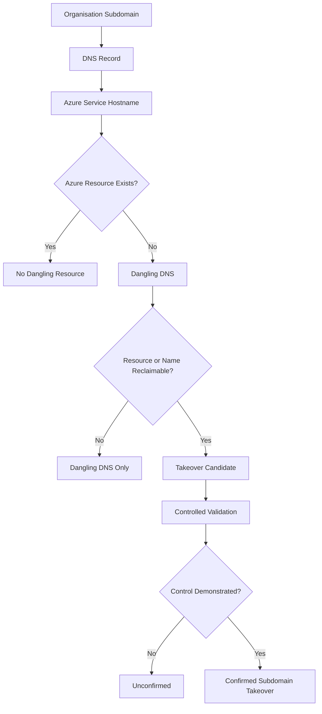

# Azure Subdomain Takeover

Azure subdomain takeover can occur when an organisation's DNS record continues to reference an Azure resource that no longer exists, while the referenced resource name or endpoint can still be registered or controlled by another party.

This creates a **dangling DNS record**.

A dangling DNS record is an important indicator, but it does not automatically mean that a subdomain takeover is possible. The referenced Azure resource must also be reclaimable or otherwise controllable by an unauthorised party.

---

## Security Model

The key distinction during testing is between identifying a dangling dependency and demonstrating that the dependency can actually cross a security boundary.



!!! important
    An `NXDOMAIN` response, Azure error page, or known service fingerprint identifies a **candidate condition**, not a confirmed vulnerability. Confirmation requires evidence that the referenced resource can actually be controlled by an unauthorised party.

The assessment should therefore follow:

**Observation → Candidate → Validation → Evidence → Security Conclusion**

---

## How Azure Subdomain Takeover Happens

A typical configuration looks like:

```text
app.example.com
        |
        | CNAME
        v
example-app.azurewebsites.net
```

While the Azure resource exists, requests to:

```text
app.example.com
```

are routed to:

```text
example-app.azurewebsites.net
```

The risk appears when the Azure resource is deleted but the organisation leaves the DNS record in place.

The resulting state may look like:

```text
app.example.com
        |
        | CNAME
        v
example-app.azurewebsites.net
        |
        v
Azure resource no longer exists
```

If another party can legitimately register or control the referenced Azure resource or equivalent namespace, traffic intended for the organisation's subdomain may be directed to infrastructure outside the organisation's control.

---

## Conditions Required

A potential Azure subdomain takeover generally requires several conditions:

1. The organisation controls a DNS name.

2. The DNS record references an Azure-managed hostname or service.

3. The original Azure resource has been deleted, removed, or otherwise become unavailable.

4. The DNS record remains configured.

5. The referenced Azure resource name, endpoint, or equivalent namespace can be controlled by another party.

6. Requests for the organisation's subdomain can subsequently reach that resource.

The presence of only the first four conditions generally indicates **dangling DNS**, not necessarily a confirmed takeover.

---

## Discovery

Subdomain takeover testing normally begins with the organisation's known subdomains.

Potential sources include:

- passive DNS data;
- certificate transparency logs;
- DNS enumeration;
- asset inventories;
- historical DNS records;
- search engines;
- archived URLs;
- application JavaScript;
- source code and configuration;
- cloud asset inventories.

For general subdomain discovery methodology, see:

[Subdomain Enumeration](../../web/reconnaissance/subdomain-enumeration.md)

---

## Inspect DNS Records

Start by resolving the candidate hostname.

### dig

```bash
dig app.example.com
```

Query the CNAME directly:

```bash
dig CNAME app.example.com
```

Short output:

```bash
dig +short app.example.com
```

Follow the complete resolution:

```bash
dig app.example.com +trace
```

---

### host

```bash
host app.example.com
```

---

### nslookup

```bash
nslookup app.example.com
```

---

### PowerShell

```powershell
Resolve-DnsName app.example.com
```

Query specifically for CNAME records:

```powershell
Resolve-DnsName app.example.com -Type CNAME
```

---

## Follow the Entire CNAME Chain

Do not stop after discovering the first alias.

For example:

```text
app.example.com
        |
        v
service.example.net
        |
        v
example-app.azurewebsites.net
```

The Azure dependency may only become visible after following multiple aliases.

The complete DNS chain should therefore be documented.

---

## Azure Service Namespaces

Azure uses many service-specific DNS namespaces.

Examples that may appear during an assessment include:

| Azure Service | Example Namespace |
|---|---|
| Azure App Service | `*.azurewebsites.net` |
| Azure Traffic Manager | `*.trafficmanager.net` |
| Azure Storage | `*.blob.core.windows.net` |
| Azure API Management | `*.azure-api.net` |
| Azure SQL Database | `*.database.windows.net` |
| Azure AI Search | `*.search.windows.net` |
| Azure Container Registry | `*.azurecr.io` |
| Azure Container Instances | `*.azurecontainer.io` |
| Azure Cache for Redis | `*.redis.cache.windows.net` |
| Azure Service Bus | `*.servicebus.windows.net` |
| Azure VM Public DNS | Azure regional cloud hostnames |
| Azure CDN / Front Door | Azure-managed delivery hostnames |

!!! warning
    The presence of an Azure hostname does **not** mean that the associated subdomain is vulnerable to takeover.

Azure service behaviour changes over time. Microsoft may introduce custom-domain verification, resource-name reservation, ownership validation, namespace restrictions, or other protections.

Always validate the current behaviour of the specific Azure service.

---

## Candidate Identification

Suppose DNS shows:

```text
portal.example.com. 300 IN CNAME example-portal.azurewebsites.net.
```

The next step is to determine whether:

```text
example-portal.azurewebsites.net
```

still represents an active resource.

Query the Azure hostname directly:

```bash
dig example-portal.azurewebsites.net
```

or:

```bash
host example-portal.azurewebsites.net
```

A failure to resolve can indicate that the original Azure resource no longer exists.

However:

```text
NXDOMAIN != confirmed takeover
```

It only establishes part of the required condition.

---

## HTTP and HTTPS Validation

Check the organisation-controlled hostname:

```bash
curl -I https://portal.example.com
```

Follow redirects:

```bash
curl -IL https://portal.example.com
```

Inspect the response:

```bash
curl -i https://portal.example.com
```

Then compare it with the referenced Azure hostname:

```bash
curl -i https://example-portal.azurewebsites.net
```

Look for:

- Azure-specific error pages;
- missing-site responses;
- unresolved hostnames;
- service-specific error messages;
- TLS certificate behaviour;
- redirects;
- HTTP status codes;
- evidence that the backend resource is absent.

These observations help identify a candidate but should not independently be treated as proof of takeover.

---

## Example: Azure App Service

Consider:

```text
shop.example.com
        |
        | CNAME
        v
company-shop.azurewebsites.net
```

The original Azure App Service is later deleted.

The DNS record remains:

```text
shop.example.com CNAME company-shop.azurewebsites.net
```

An assessment may show:

```bash
dig CNAME shop.example.com
```

with output similar to:

```text
shop.example.com. 300 IN CNAME company-shop.azurewebsites.net.
```

But:

```bash
dig company-shop.azurewebsites.net
```

may return:

```text
NXDOMAIN
```

At this point the correct conclusion is:

> The organisation has a dangling DNS record referencing an unavailable Azure resource.

The next question is:

> Can the referenced Azure resource or equivalent endpoint actually be controlled by another Azure tenant?

Only after that question has been safely validated should the issue be described as a confirmed subdomain takeover.

---

## Resource Claimability

Resource claimability is the critical validation stage.

Questions to investigate include:

1. Does the Azure resource still exist?

2. Is the resource name globally unique or scoped to a subscription, tenant, region, or service?

3. Can the same resource name currently be created?

4. Does Azure reserve deleted resource names?

5. Does the service require custom-domain ownership verification?

6. Does Azure prevent another tenant from binding the organisation's domain?

7. Are there service-specific takeover protections?

8. Has the behaviour changed since older takeover research was published?

A known historical fingerprint should therefore be treated as a research lead, not as permanent proof of exploitability.

---

## Azure Portal Validation

Where authorised, the Azure Portal can help determine whether a candidate resource name is currently available.

The objective is to determine whether the Azure dependency can be legitimately created or controlled.

Do not create resources against third-party domains unless the assessment scope explicitly permits controlled validation.

!!! warning
    Avoid causing disruption, serving arbitrary content, intercepting user traffic, collecting credentials, or interacting with real users.

The objective is to establish the minimum evidence necessary to prove or disprove the security condition.

---

## Controlled Proof of Concept

Where explicit authorisation permits resource creation, use the least invasive validation possible.

A controlled proof may demonstrate only that:

- the Azure resource name can be registered;
- the resource is under tester control;
- the organisation's DNS record references that resource;
- the custom domain can be associated where required;
- a harmless marker can be returned.

For example, a harmless validation response could contain:

```text
Security validation - authorised assessment
```

Do not reproduce the legitimate application or impersonate the organisation unnecessarily.

---

## Evidence

Good evidence should demonstrate the complete chain.

For example:

```text
Organisation Subdomain
        ↓
DNS CNAME
        ↓
Azure Resource
        ↓
Resource Absent
        ↓
Resource Reclaimable
        ↓
Controlled Validation
        ↓
Confirmed Security Impact
```

Capture:

- affected subdomain;
- DNS record type;
- complete CNAME chain;
- Azure service;
- Azure resource hostname;
- DNS response;
- HTTP response;
- resource availability;
- custom-domain verification requirements;
- controlled proof, if authorised;
- timestamp;
- remediation status.

---

## Evidence Strength

Not all observations provide the same level of confidence.

| Observation | Evidence Strength |
|---|---|
| Azure hostname discovered | Informational |
| Azure-specific error response | Weak |
| Azure hostname returns NXDOMAIN | Candidate |
| Dangling CNAME confirmed | Candidate |
| Historical takeover fingerprint matches | Candidate |
| Azure resource name appears available | Strong candidate |
| Resource can be controlled | Strong |
| Organisation subdomain resolves to controlled resource | Confirmed |

This distinction is important when writing findings.

---

## False Positives

Common false positives include:

### Deleted but Protected Resource

The original Azure resource is gone, but Azure prevents the resource name from being reused.

### Custom-Domain Verification

The resource name can be registered, but Azure requires proof of domain ownership before the organisation's hostname can be attached.

### Reserved Names

Azure may reserve or protect previously used names.

### Service Behaviour Changed

A service that historically allowed takeover may no longer permit it.

### Temporary DNS Failure

An Azure endpoint may temporarily fail to resolve without the underlying resource being permanently deleted.

### Incorrect Fingerprint

An error page may resemble a known takeover fingerprint but represent a different condition.

---

## Tool-Assisted Discovery

Automated tools can help identify takeover candidates.

They should be used for discovery and prioritisation, not as the sole evidence for a finding.

---

### Nuclei

A list of subdomains can be scanned using takeover-related templates:

```bash
nuclei -l subdomains.txt -tags takeover
```

A positive result should be manually validated.

The correct workflow is:

```text
Scanner Match
     ↓
Candidate
     ↓
Manual DNS Validation
     ↓
Service Validation
     ↓
Claimability Validation
     ↓
Evidence
     ↓
Security Conclusion
```

---

### can-i-take-over-xyz

The `can-i-take-over-xyz` project documents known service fingerprints and historical takeover behaviour.

It is useful for identifying:

- service-specific fingerprints;
- vulnerable service patterns;
- known error messages;
- historical takeover conditions;
- provider-specific notes.

However, cloud providers continuously change their protections.

Always verify the current status of the relevant Azure service instead of assuming that an older fingerprint remains exploitable.

---

## Azure-Specific Considerations

### Global and Regional Names

Some Azure resource names are globally unique while others may be scoped differently.

Determine the actual namespace rules before concluding that a resource can be reclaimed.

---

### Custom-Domain Verification

Some Azure services require domain ownership verification before accepting a custom hostname.

This can prevent a dangling DNS condition from becoming a practical takeover.

---

### Resource Name Reuse

Deleted Azure resources may not always become immediately available for reuse.

Resource-name protection can significantly change takeover feasibility.

---

### Legacy Services

Older Azure services may behave differently from newer services.

Documentation and takeover research should therefore be checked against current service behaviour.

---

### DNS Aliases

Complex DNS chains can hide the Azure dependency.

For example:

```text
portal.example.com
        ↓
app.cdn.example.net
        ↓
service.azureedge.net
```

Follow the chain until the actual service dependency is understood.

---

## Potential Impact

A confirmed subdomain takeover may allow an attacker to serve attacker-controlled content from a hostname trusted by users and applications.

Potential impact can include:

- phishing;
- malicious content hosting;
- reputation abuse;
- trust abuse;
- security-policy bypasses;
- cookie exposure in certain configurations;
- OAuth redirect abuse;
- CORS trust abuse;
- application integration abuse;
- bypass of hostname-based allowlists.

The actual impact depends on how the affected subdomain is used.

---

## Cookie Considerations

Review cookies scoped broadly to the parent domain.

For example:

```text
Domain=.example.com
```

A controlled subdomain may interact with application trust assumptions differently from a completely unrelated domain.

Cookie impact depends on:

- `Domain`;
- `Path`;
- `Secure`;
- `HttpOnly`;
- `SameSite`;
- browser behaviour;
- application architecture.

Do not automatically claim session compromise simply because a subdomain takeover exists.

Validate the actual cookie configuration.

---

## OAuth and Trusted Redirects

Check whether the affected hostname appears in:

- OAuth redirect URI allowlists;
- OpenID Connect configuration;
- SAML endpoints;
- application callback URLs;
- trusted origin lists;
- CORS allowlists;
- webhook destinations;
- API allowlists.

A seemingly low-value abandoned hostname may have greater impact if another system continues to trust it.

See:

[OAuth 2.0 and OpenID Connect](../../web/oauth-oidc.md)

and:

[Cross-Origin Resource Sharing](../../web/cors.md)

---

## Detection

Organisations should continuously compare DNS records with active cloud resources.

Useful detection approaches include:

- DNS inventory monitoring;
- Azure resource inventory;
- certificate transparency monitoring;
- cloud asset management;
- DNS change monitoring;
- external attack-surface management;
- scheduled takeover scanning;
- decommissioning reviews.

The objective is to detect:

```text
DNS Reference Exists
        +
Cloud Resource Does Not Exist
```

before the abandoned dependency becomes externally controllable.

---

## Prevention

### Remove DNS Before Deleting Resources

Where operationally possible, remove the public DNS dependency before deleting the Azure resource.

Preferred sequence:

```text
Identify Dependencies
        ↓
Remove DNS Reference
        ↓
Verify DNS Propagation
        ↓
Remove Azure Resource
        ↓
Verify External State
```

---

### Maintain Asset Ownership

Track:

- DNS records;
- Azure resources;
- subscriptions;
- resource groups;
- service owners;
- application owners;
- business owners;
- decommission dates.

---

### Monitor Dangling DNS

Regularly identify records pointing to resources that no longer exist.

---

### Review Custom Domains

Maintain an inventory of Azure services with custom domains attached.

---

### Include DNS in Decommissioning

Deleting a cloud resource should never be treated as an isolated task.

The decommissioning process should include:

```text
Application
DNS
Certificates
CDN
Cloud Resources
OAuth Integrations
Monitoring
Secrets
External Dependencies
```

---

## Remediation

For a confirmed or suspected dangling Azure dependency:

1. Identify the DNS record.

2. Confirm whether the record is still required.

3. Determine the associated Azure resource.

4. If the service is no longer required, remove the DNS record.

5. If the service is required, restore or correctly configure the Azure resource.

6. Review other DNS records for the same service or application.

7. Review certificates and application integrations.

8. Verify that the hostname no longer references an unowned resource.

9. Retest externally.

---

## Retesting

After remediation:

```bash
dig CNAME app.example.com
```

Confirm that the vulnerable or obsolete alias has been removed or updated.

Then:

```bash
dig app.example.com
```

and:

```bash
curl -I https://app.example.com
```

Confirm that the hostname either:

- resolves to an organisation-controlled service; or
- no longer resolves if the service has been retired.

---

## Assessment Checklist

- [ ] Enumerate organisation subdomains
- [ ] Resolve CNAME records
- [ ] Follow complete CNAME chains
- [ ] Identify Azure-managed hostnames
- [ ] Determine whether the Azure resource exists
- [ ] Inspect HTTP and HTTPS behaviour
- [ ] Identify service-specific fingerprints
- [ ] Determine current Azure service behaviour
- [ ] Check resource-name availability
- [ ] Check custom-domain verification requirements
- [ ] Distinguish dangling DNS from confirmed takeover
- [ ] Perform controlled validation only when authorised
- [ ] Capture evidence
- [ ] Review cookies and trusted integrations
- [ ] Document actual impact
- [ ] Retest after remediation

---

## Security Conclusion

The conclusion should reflect what was actually demonstrated.

### Confirmed Takeover

Use wording such as:

> The affected subdomain referenced an Azure resource that no longer existed. During controlled validation, the referenced resource could be brought under tester control and the organisation's subdomain resolved to the controlled resource. This confirms that the dangling DNS configuration resulted in a subdomain takeover condition.

### Dangling DNS Only

If claimability was not demonstrated:

> The affected subdomain contains a dangling DNS record referencing an Azure resource that no longer appears to exist. Resource claimability was not demonstrated; therefore, the condition should be reported as dangling DNS or a potential subdomain takeover rather than a confirmed takeover.

This distinction prevents an observation from being overstated as proven impact.

---

## Related Notes

- [Subdomain Enumeration](../../web/reconnaissance/subdomain-enumeration.md)
- [Attack Surface Analysis](../../web/attack-surface-analysis.md)
- [Information Disclosure](../../web/information-disclosure.md)
- [OAuth 2.0 and OpenID Connect](../../web/oauth-oidc.md)
- [Cross-Origin Resource Sharing](../../web/cors.md)
- [HTTP Security Headers](../../web/http-security-headers.md)

---

## References

- [Asif Nawaz Minhas - Subdomain Takeover](https://www.asifnawazminhas.com/posts/Subdomain-takeover/){ target="_blank" rel="noopener noreferrer" }
- [EdOverflow - can-i-take-over-xyz](https://github.com/EdOverflow/can-i-take-over-xyz){ target="_blank" rel="noopener noreferrer" }
- [Stratus Security - Azure Subdomain Takeover Guide](https://www.stratussecurity.com/post/azure-subdomain-takeover-guide){ target="_blank" rel="noopener noreferrer" }
