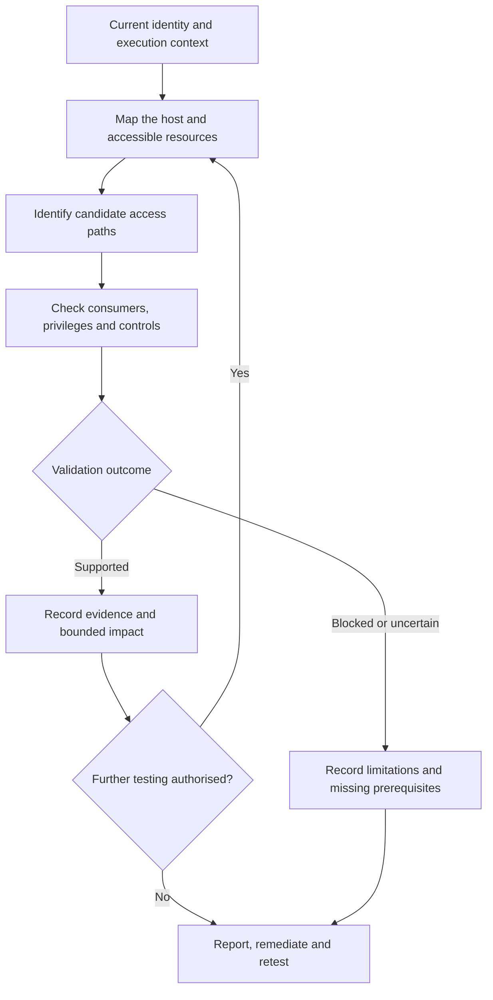

# Linux Security Testing

Linux security testing connects identities, permissions, services, scheduled jobs, credentials and security controls to determine whether an unintended security boundary can be crossed.

This section covers authorised assessments of Linux servers, workstations, appliances, development systems and container hosts. Use this page to choose an investigation route, then follow the dedicated notes for commands and detailed procedures.

The central questions are:

- What can the current principal access or control?
- Which process, service or identity trusts that resource?
- Under which UID, GID, capabilities and confinement does it operate?
- What security impact does the evidence support?

!!! warning "Authorised Security Testing"

    Assess only systems and resources within the agreed scope. Prefer read-only enumeration and the least intrusive validation necessary. Changes to services, scheduled jobs, permissions, credentials, containers or security controls require appropriate authorisation and a cleanup plan.

## Start Here

<div class="grid cards" markdown>

-   :material-magnify:{ .lg .middle } **Linux Enumeration**

    ---

    Establish identity, distribution, kernel, packages, host role, network, processes and session context.

    [:octicons-arrow-right-24: Linux Enumeration](enumeration.md)

-   :material-cog:{ .lg .middle } **Linux Services**

    ---

    Trace services through their execution identities, unit definitions, executables, configuration and dependencies.

    [:octicons-arrow-right-24: Linux Services](services.md)

-   :material-calendar-clock:{ .lg .middle } **Scheduled Jobs**

    ---

    Review cron, anacron, systemd timers, scheduled scripts, execution environments and privileged automation.

    [:octicons-arrow-right-24: Scheduled Jobs](scheduled-jobs.md)

-   :material-folder-lock:{ .lg .middle } **Filesystem Permissions**

    ---

    Understand ownership, mode bits, ACLs, parent directories, symlinks, writable resources and mount context.

    [:octicons-arrow-right-24: Filesystem Permissions](filesystem-permissions.md)

-   :material-shield-account:{ .lg .middle } **sudo Security**

    ---

    Review permitted commands, target identities, arguments, authentication requirements and environment handling.

    [:octicons-arrow-right-24: sudo Security](sudo.md)

-   :material-file-key:{ .lg .middle } **SUID and SGID**

    ---

    Assess privileged executables, their origin, effective identities, functionality and execution restrictions.

    [:octicons-arrow-right-24: SUID and SGID](suid-sgid.md)

-   :material-security:{ .lg .middle } **Linux Capabilities**

    ---

    Examine file and process capabilities and determine which privileged operations are actually reachable.

    [:octicons-arrow-right-24: Linux Capabilities](capabilities.md)

-   :material-key:{ .lg .middle } **Linux Credentials**

    ---

    Review authorised configuration, history, SSH material, environment variables, backups and application secrets.

    [:octicons-arrow-right-24: Linux Credentials](credentials.md)

-   :material-shield-check:{ .lg .middle } **Linux Security Controls**

    ---

    Assess SELinux, AppArmor, firewall rules, kernel protections, audit logging and endpoint security.

    [:octicons-arrow-right-24: Linux Security Controls](security-controls.md)

-   :material-arrow-up-bold-circle:{ .lg .middle } **Privilege Escalation**

    ---

    Correlate observations into candidate paths and validate the resulting access, restrictions and impact.

    [:octicons-arrow-right-24: Linux Privilege Escalation](privilege-escalation.md)

</div>

## Host Assessment Model

An assessment should connect observations rather than treat each command result independently.



A privileged consumer is important for paths involving writable scripts, services or configuration. Other findings, such as exposed credentials or unauthorised data access, may be significant without privileged execution.

Root access is not the only meaningful outcome. Access to another user's secrets, modification of application data or control over a deployment process may also matter.

## Establish the Starting Context

Interpret every later result in relation to the actual session.

| Context | Establish | Why it matters |
|---|---|---|
| Identity | Real and effective UID/GID, supplementary groups and account source | Determines applicable permissions and identity transitions |
| Session | SSH, console, application shell, service process or container session | Changes available environment, authentication and restrictions |
| Delegated access | Effective sudo rules and privileged group access | Defines permitted administration and potential misuse |
| Host | Distribution, release, architecture, hostname and workload | Determines relevant tools, services and business impact |
| Software | Installed package revisions, kernel and vendor patch information | Prevents conclusions based on upstream version numbers alone |
| Isolation | Host, container, namespace and exposed mounts | Establishes which system and boundary the result belongs to |
| Controls | Mandatory access controls, capabilities, mount restrictions and logging | Determines whether an apparent path is usable or observable |

Start with a small baseline:

```bash
id
hostname
cat /etc/os-release
uname -r
uname -m
```

Expect identity and platform information, not a vulnerability report. Use it to select the relevant checks in [Linux Enumeration](enumeration.md).

!!! note "Record visibility limits"

    A permission error, missing utility or empty result does not establish that a control or resource is absent. Record what could be inspected, the current privilege level and any collection limitations.

## Practical Methodology

| Phase | What to do | Expected result | What follows |
|---|---|---|---|
| Establish scope | Confirm hosts, accounts, permitted techniques and stopping conditions | A defined starting position | Select proportionate checks |
| Enumerate | Map identities, processes, services, packages, network and mounts | Host and access context | Prioritise sensitive resources |
| Review privilege mechanisms | Inspect sudo, SUID/SGID, capabilities and management access | Candidate privileged operations | Check exact functionality and constraints |
| Trace dependencies | Identify scripts, binaries, configuration, environment and search paths | Relationships between resources and consumers | Verify effective permissions |
| Review credentials and controls | Assess approved secret sources and applicable protection | Exposure and enforcement context | Form a specific testable hypothesis |
| Validate | Test only the necessary capability under the relevant identity | Supported, disproved or untested candidate | Preserve evidence and limitations |
| Report and retest | Explain impact, fix the root cause and repeat the relevant test | A defensible conclusion and remediation result | Confirm legitimate operations still work |

Keep the distinction between an observed configuration weakness and demonstrated exploitation. Where active validation is prohibited, report the verified configuration and remaining assumptions explicitly.

## Main Investigation Routes

### Identity, Groups and Environment

Review local and externally resolved accounts, supplementary groups, account purpose, login context and delegated administration.

Groups such as `sudo`, `wheel`, `docker`, `lxd`, `disk`, `adm` and `systemd-journal` warrant contextual review. Their names alone do not determine the effective access or whether that access is inappropriate.

Environment variables can expose operational context or secrets. Review relevant values selectively and avoid including credentials in terminal captures.

For PATH-related candidates, establish:

- which privileged process invokes a command;
- whether it uses an absolute path;
- which search path that process actually uses;
- whether the current principal controls a directory searched before the intended executable;
- which policy or execution restrictions apply.

The interactive user's PATH does not prove that a service, cron job or sudo command uses the same environment.

Continue with [Enumeration](enumeration.md), [sudo Security](sudo.md) and [Filesystem Permissions](filesystem-permissions.md).

### Network, Processes and Services

Correlate interfaces, routes, DNS, listeners and connections with their owning processes and service identities.

A locally bound service may still be reachable from an existing local session. A listener on an external interface does not prove that remote clients can reach it through the complete network path.

For services, review:

- systemd unit files, overrides and drop-ins where applicable;
- legacy init configuration on systems using another service manager;
- execution identity and actual running process;
- executable, arguments, working directory and environment files;
- scripts, libraries and configuration consumed;
- permissions on dependencies and parent directories;
- startup, reload and restart conditions.

A root-owned unit file does not by itself prove that its process runs as root. Confirm the configured and effective identity.

Continue with [Linux Services](services.md) and [Linux Enumeration](enumeration.md).

### Scheduled Jobs and Automatic Execution

Review cron, anacron, systemd timers and application-specific schedulers.

Important locations and relationships include:

- `/etc/crontab`, `/etc/cron.d/` and periodic cron directories;
- user crontabs accessible within scope;
- timer units and the service units they activate;
- scheduled scripts, arguments and configuration;
- execution identity, PATH and working directory;
- file ownership, ACLs and replacement opportunities;
- whether the schedule is enabled and the referenced resource is actually used.

The presence of a privileged scheduled job is not a finding. Establish whether a lower-privileged principal can influence its behaviour.

Continue with [Scheduled Jobs](scheduled-jobs.md).

### Filesystem Permissions, Mounts and Remote Storage

Review ownership, mode bits, ACLs, parent-directory traversal and write permissions, symlinks and mount context.

Distinguish between modifying an existing file and replacing a directory entry. Those operations can depend on different permissions and restrictions.

Retain visibility of:

- world-writable files and directories;
- expected temporary locations such as `/tmp` and `/var/tmp`;
- sticky-bit behaviour;
- privileged scripts, executables and configuration;
- local, bind and container mounts;
- NFS, SMB/CIFS and other remote storage;
- client and server permissions, identity mapping and trust;
- relevant `nosuid`, `nodev`, `noexec` and read-only settings.

A missing mount option is not automatically a vulnerability. Evaluate the workload, required functionality and specific action the option would restrict.

Continue with [Filesystem Permissions](filesystem-permissions.md) and [Linux PrivEsc Explorer](../privesc/linux.md).

### sudo Security

Assess the exact effective rule rather than only the presence of sudo access.

Review the permitted command, target user and group, password requirement, argument matching, environment handling, referenced scripts and writable dependencies.

Use the permitted listing operation where authorised:

```bash
sudo -l
```

It may prompt for authentication and generate audit events. Do not repeatedly guess credentials.

Expected output identifies delegated operations. The next question is whether those operations permit access or behaviour beyond the intended administrative task.

Continue with [sudo Security](sudo.md).

### SUID, SGID and Capabilities

These mechanisms expose different forms of privilege and should be analysed separately.

| Mechanism | Review | Avoid assuming |
|---|---|---|
| SUID executable | File owner, effective UID behaviour, functionality and privilege dropping | Every SUID executable provides root access |
| SGID executable | File group, effective GID behaviour and accessible resources | SGID always grants administrative privilege |
| File capabilities | Capability assignment, executable functionality and execution conditions | A capability name proves an exploitable path |
| Process capabilities | Effective and permitted sets, bounding restrictions and namespace context | Every process with UID 0 has unrestricted host authority |

For unusual binaries, establish package origin, version, intended purpose, dependencies and whether the current principal can invoke the relevant functionality.

Account for restrictions such as `nosuid`, `no_new_privs` and mandatory access controls. Linux also ignores SUID/SGID bits on interpreter scripts; a script executed by an already privileged service is a different relationship.

Continue with [SUID and SGID](suid-sgid.md) and [Linux Capabilities](capabilities.md).

### Credentials, SSH, Configuration and Backups

Use targeted review based on the identified workload.

Potential sources include:

- shell history;
- application configuration under relevant `/etc`, `/opt`, `/srv` or `/var/www` locations;
- environment variables and deployment configuration;
- backup archives, old configuration and editor temporary files;
- SSH private keys, client configuration and authentication settings;
- service, database, API and cloud credentials.

SSH review should distinguish private keys from public keys, `authorized_keys` and `known_hosts`. Their presence has different implications.

For each candidate, establish who can read it, which identity it represents, its intended scope and the evidence supporting its sensitivity. Credential use requires its own scope check.

Do not copy unrelated private keys or test discovered credentials against additional systems without authorisation.

Continue with [Linux Credentials](credentials.md). Use [Linux Services](services.md) and [Security Controls](security-controls.md) for the surrounding SSH service and protection context.

### Containers and Management Interfaces

Preserve the distinction between the current container, its runtime and the underlying host.

Review:

- Docker, Podman, containerd, Kubernetes and LXC/LXD indicators;
- accessible runtime sockets and management APIs;
- effective group permissions;
- rootless versus privileged runtime operation;
- exposed host mounts and devices;
- namespaces, capabilities and confinement;
- which operations the current identity is actually authorised to perform.

Container software being installed is not a finding. UID 0 inside a container does not by itself demonstrate host-level root access.

Continue with [Linux Enumeration](enumeration.md), [Linux Privilege Escalation](privilege-escalation.md) and [Linux PrivEsc Explorer](../privesc/linux.md).

### Kernel, Packages and Security Controls

Keep kernel and package analysis tied to the distribution's security updates and actual configuration.

Review the distribution release, full package revision, installed and running kernel, vendor fixes, architecture and relevant feature prerequisites. An upstream-looking version may already contain a backported fix.

Security-control review includes:

- SELinux state and the applicable process domain;
- AppArmor profile coverage and enforcement mode;
- relevant kernel parameters and process restrictions;
- host firewall policy;
- audit configuration and log access;
- EDR, antivirus, integrity monitoring and forwarding agents.

A loaded security framework does not establish that the target process is confined. Conversely, the absence of one framework does not prove an exploitable condition.

Continue with [Linux Security Controls](security-controls.md) and [Enumeration](enumeration.md).

### Firewall, Logging and Detection

Firewall interpretation must connect policy with actual reachability. Review interfaces, direction, source, destination, protocol, port and default action.

Different hosts may use nftables, iptables, UFW or firewalld. Use the relevant management interface and record permission limitations; do not change rules simply to inspect them.

For logging, determine whether relevant events are:

- generated;
- retained;
- protected against inappropriate access or modification;
- forwarded where required;
- monitored and acted upon.

A log file existing does not prove detection coverage. During an agreed detection test, correlate the action and timestamp with endpoint events, forwarded records and alerts.

Continue with [Linux Security Controls](security-controls.md) and the [Networking Cheatsheet](../cheatsheets/networking.md).

## Linux Resources Across the Site

The Linux section provides detailed assessment notes. The supporting pages serve different purposes.

| Resource | Use it for |
|---|---|
| [Linux Privilege Escalation](privilege-escalation.md) | Correlating conditions into privilege paths |
| [Linux PrivEsc Explorer](../privesc/linux.md) | Navigating candidate mechanisms and follow-up checks |
| [Privilege Escalation Tools](../tools/privilege-escalation/index.md) | Selecting tools and interpreting their output |
| [LinPEAS](../tools/privilege-escalation/linpeas.md) | Broad automated Linux enumeration |
| [linux-smart-enumeration](../tools/privilege-escalation/linux-smart-enumeration.md) | Structured enumeration and candidate prioritisation |
| [Linux Cheatsheet](../cheatsheets/linux.md) | Quick command reference |
| [Networking Cheatsheet](../cheatsheets/networking.md) | Network and connectivity reference |

LinEnum and GTFOBins are additional external references listed below. No separate internal tool page is assumed for them.

!!! note "A tool result is a candidate"

    LinPEAS, LinEnum and linux-smart-enumeration can improve coverage, but a highlighted result still requires interpretation. A GTFOBins entry describes functionality under particular conditions; the binary's presence alone is not a vulnerability.

## From Observation to Security Conclusion

Use the same sequence throughout the site:

`Observation -> Candidate -> Validation -> Evidence -> Security Conclusion`

| Observation | Candidate | What must be checked |
|---|---|---|
| Writable script | Another identity may execute user-controlled content | Effective write access, active consumer, execution identity, trigger and controls |
| SUID custom binary | Privileged functionality may be exposed | Ownership, actual identity transition, reachable behaviour and restrictions |
| sudo rule | Delegated functionality may exceed its intended scope | Command, arguments, target identity, environment and dependencies |
| Capability assignment | A sensitive operation may be reachable | Effective capability context, executable functionality and relevant target |
| Accessible runtime socket | Container administration may affect host resources | Runtime privileges, permitted operations, mounts and isolation |
| Old-looking package | A known vulnerability may apply | Distribution revision, backports, configuration and prerequisites |
| Readable backup | Sensitive data may be exposed | Actual content sensitivity, authorised readers and affected systems |

Classify the result honestly:

- **Validated:** the evidence supports the stated capability or impact.
- **Not reproduced:** the attempted test did not demonstrate the expected result.
- **Blocked:** a specific control or missing prerequisite prevented the tested path.
- **Not tested:** scope, safety or access restrictions prevented validation.

A failed test is not proof that every alternative path is impossible.

## Worked Example: Writable Scheduled Script

Suppose `/opt/vendor/backup.sh` appears writable by the current user.

Start with read-only inspection:

```bash
id
ls -l /opt/vendor/backup.sh
stat /opt/vendor/backup.sh
getfacl /opt/vendor/backup.sh
namei -l /opt/vendor/backup.sh
```

Use the available commands for the distribution. Mode bits, ACL entries and path traversal provide supporting evidence, but must be interpreted together.

Then establish:

1. Which active service or scheduled job references the script?
2. Under which UID/GID does it execute?
3. Can the current user modify the script or replace its path?
4. Which environment, mount and confinement restrictions apply?
5. When is it consumed, and can that be confirmed safely?

If active proof is authorised, agree a minimal test and cleanup procedure. Do not replace a production backup script merely to prove write access.

A configuration-based report might state:

> The assessed user can modify `/opt/vendor/backup.sh`, which is referenced by a scheduled job configured to run as root. This creates a path for lower-privileged modification of privileged job instructions. Active execution validation was not performed, so runtime restrictions and execution impact remain untested.

If execution is demonstrated, report the actual identity and result separately. Do not present a configured root consumer as observed root execution.

## Compact Assessment Checklist

Use this as a coverage check, not a requirement to run every technique.

- [ ] Confirm authorised hosts, accounts, techniques and stopping conditions.
- [ ] Record UID/GID, effective identity, groups and session context.
- [ ] Review accounts, delegated administration and relevant environment variables.
- [ ] Identify distribution, architecture, kernel, packages and backport context.
- [ ] Establish the workload and host/container boundary.
- [ ] Map interfaces, routes, DNS, listeners and connections.
- [ ] Correlate processes with services and execution identities.
- [ ] Review service definitions, overrides, scripts and dependencies.
- [ ] Review cron, anacron, timers and other automatic execution.
- [ ] Review ownership, permissions, ACLs, parent directories and symlinks.
- [ ] Review temporary locations, mounts and remote filesystem trust.
- [ ] Review exact sudo rules and command restrictions.
- [ ] Assess unusual SUID/SGID executables and capability assignments.
- [ ] Review authorised credential, SSH, history, configuration and backup sources.
- [ ] Assess runtime sockets, container-management access and exposed host resources.
- [ ] Review applicable SELinux/AppArmor confinement and kernel restrictions.
- [ ] Correlate firewall policy with reachable services.
- [ ] Review audit, logging and endpoint protection visibility.
- [ ] Validate candidates and record alternative explanations.
- [ ] Preserve evidence, redact secrets and document cleanup.
- [ ] Define root-cause remediation and a reproducible retest.

## Evidence, Remediation and Retesting

Record the host, timestamp, current principal, exact resource, ownership, effective permissions, consumer, execution identity, applicable controls, action performed and observed result.

Also preserve limitations: inaccessible files, incomplete collection, inactive schedules and prohibited tests all affect the conclusion.

Remediation should address the relationship responsible for the exposure:

- narrow sudo rules and privileged group membership;
- remove unnecessary SUID/SGID bits or capabilities;
- protect service definitions, scripts, configuration and parent directories;
- correct inappropriate access to credentials, backups and SSH material;
- restrict container-management interfaces and unnecessary host-resource exposure;
- apply relevant vendor updates and workload-appropriate confinement;
- limit unnecessary network access;
- protect and monitor security telemetry.

For the writable-script example, retest the same user's effective rights, parent directories, service or job configuration and execution identity. Confirm that the original modification path is removed and the legitimate backup still functions.

Do not mark a finding resolved solely because an automated tool stops highlighting it.

## Suggested Reading Routes

- **First host assessment:** [Enumeration](enumeration.md), [Services](services.md), [Filesystem Permissions](filesystem-permissions.md), then the relevant privilege and control pages.
- **Privileged automation:** [Services](services.md), [Scheduled Jobs](scheduled-jobs.md), [Filesystem Permissions](filesystem-permissions.md).
- **Delegated or executable privilege:** [sudo](sudo.md), [SUID/SGID](suid-sgid.md), [Capabilities](capabilities.md), [Privilege Escalation](privilege-escalation.md).
- **Secrets and remote administration:** [Credentials](credentials.md), [Services](services.md), [Security Controls](security-controls.md).
- **Candidate triage:** [Linux PrivEsc Explorer](../privesc/linux.md), followed by the relevant detailed Linux note.
- **Quick commands:** [Linux Cheatsheet](../cheatsheets/linux.md) and [Networking Cheatsheet](../cheatsheets/networking.md).

## References

- [Linux Kernel Documentation](https://docs.kernel.org/){ target="_blank" rel="noopener noreferrer" }
- [Linux man-pages Project](https://www.kernel.org/doc/man-pages/){ target="_blank" rel="noopener noreferrer" }
- [Linux capabilities manual](https://man7.org/linux/man-pages/man7/capabilities.7.html){ target="_blank" rel="noopener noreferrer" }
- [Linux execve manual](https://man7.org/linux/man-pages/man2/execve.2.html){ target="_blank" rel="noopener noreferrer" }
- [systemd Documentation](https://systemd.io/){ target="_blank" rel="noopener noreferrer" }
- [sudo Documentation](https://www.sudo.ws/docs/){ target="_blank" rel="noopener noreferrer" }
- [Red Hat - SELinux](https://docs.redhat.com/en/documentation/red_hat_enterprise_linux/9/html/using_selinux/){ target="_blank" rel="noopener noreferrer" }
- [Ubuntu - AppArmor](https://documentation.ubuntu.com/server/how-to/security/apparmor/){ target="_blank" rel="noopener noreferrer" }
- [nftables Wiki](https://wiki.nftables.org/){ target="_blank" rel="noopener noreferrer" }
- [GTFOBins](https://gtfobins.github.io/){ target="_blank" rel="noopener noreferrer" }
- [PEASS-ng](https://github.com/peass-ng/PEASS-ng){ target="_blank" rel="noopener noreferrer" }
- [LinEnum](https://github.com/rebootuser/LinEnum){ target="_blank" rel="noopener noreferrer" }
- [linux-smart-enumeration](https://github.com/diego-treitos/linux-smart-enumeration){ target="_blank" rel="noopener noreferrer" }
- [MITRE ATT&CK - Linux](https://attack.mitre.org/matrices/enterprise/linux/){ target="_blank" rel="noopener noreferrer" }
