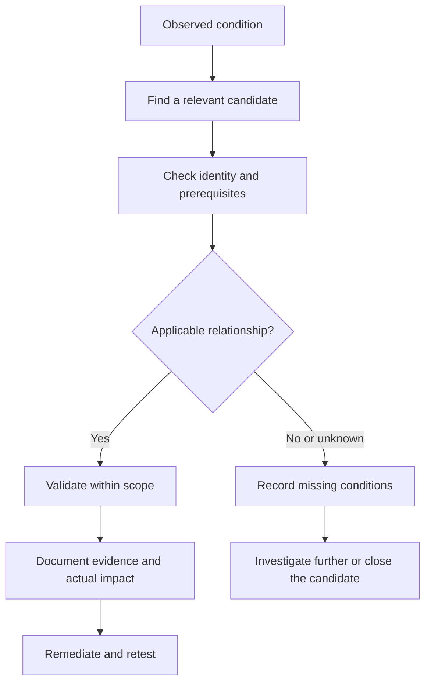

# PrivEsc Explorer

PrivEsc Explorer helps answer a practical assessment question:

> What did I find, what must be true for it to matter, and how should I validate it?

Start with an observation such as `writable service`, `SeImpersonatePrivilege`, `sudo`, `SUID`, `CAP_SETUID`, `cron` or `docker.sock`. Use the relevant explorer to identify candidate techniques, review prerequisites and choose the next investigation step.

The explorers complement the detailed Windows and Linux notes. They are references for interpreting observations, not scanners or automatic vulnerability verdicts.

!!! warning "Authorised security testing"

    Use these notes only within an agreed assessment scope. Prefer read-only inspection and proportionate validation. Changes to privileged resources, services, tasks, containers, credentials or security controls require appropriate authorisation and a cleanup plan.

## Start Here

-   :material-microsoft-windows:{ .lg .middle } **Windows PrivEsc Explorer**

    ---

    Investigate services, scheduled tasks, permissions, privileges, tokens, DLL loading, credentials, application control, applications and drivers.

    [:octicons-arrow-right-24: Open Windows PrivEsc Explorer](windows.md)

-   :material-linux:{ .lg .middle } **Linux PrivEsc Explorer**

    ---

    Investigate sudo, SUID/SGID, capabilities, services, scheduled jobs, permissions, credentials, containers, sockets, NFS and kernel candidates.

    [:octicons-arrow-right-24: Open Linux PrivEsc Explorer](linux.md)

-   :material-book-open-page-variant:{ .lg .middle } **Detailed Assessment Notes**

    ---

    Start with the host methodology when you need to establish context or understand a technique before using the explorer.

    [:octicons-arrow-right-24: Windows Security Testing](../windows/index.md)

    [:octicons-arrow-right-24: Linux Security Testing](../linux/index.md)

-   :material-tools:{ .lg .middle } **Privilege Escalation Tools**

    ---

    Choose enumeration tools, understand their coverage and interpret their output before forming conclusions.

    [:octicons-arrow-right-24: Privilege Escalation Tools](../tools/privilege-escalation/index.md)

## How to Use the Explorer

The detailed notes support learning from a topic. The explorers support investigating from an observation.

| Starting point | Best route |
|---|---|
| I have a new host session | Establish identity and context in the Windows or Linux enumeration notes |
| A command returned an interesting permission or privilege | Search the relevant platform explorer |
| An automated tool highlighted a condition | Use the explorer to identify prerequisites, then inspect the target manually |
| I understand the candidate but need detailed procedures | Follow the related platform notes |
| I need a command quickly | Use the platform cheatsheet |
| I have sufficient evidence | Document the supported impact, limitations, remediation and retest |

A practical workflow is:

1. Record the current identity and execution context.
2. Search using the observation you actually obtained.
3. Read the candidate's prerequisites and validation guidance.
4. Confirm the relevant resource, permissions and privilege relationship.
5. Perform only the authorised validation necessary.
6. Record what was established, what remains uncertain and what follows.

## Search by Observation

You do not need to know an internal technique ID. Begin with a distinctive term, then try a broader category or alternative wording if necessary.

| Platform | Example searches | Investigation direction |
|---|---|---|
| Windows | `service`, `writable`, `scheduled task` | Privileged execution and referenced resources |
| Windows | `SeImpersonate`, `SeBackup`, `SeDebug` | Token privileges and required conditions |
| Windows | `DLL`, `PATH`, `registry` | Dependencies, configuration and execution resolution |
| Windows | `AppLocker`, `PowerShell`, `UAC` | Effective controls and intended restrictions |
| Windows | `credential`, `AlwaysInstallElevated`, `driver` | Authentication material, installer policy or driver candidates |
| Linux | `sudo`, `NOPASSWD`, `SETENV` | Delegated commands and their restrictions |
| Linux | `SUID`, `SGID`, `CAP_SETUID`, `CAP_SYS_ADMIN` | Privileged executable functionality |
| Linux | `systemd`, `cron`, `PATH`, `writable` | Privileged automation and dependencies |
| Linux | `Docker`, `docker.sock`, `LXD`, `socket` | Runtime and management-interface access |
| Linux | `NFS`, `no_root_squash`, `kernel` | Remote filesystem trust or platform-specific conditions |

Search terms help locate relevant reference material. A search match does not establish that the technique applies to the assessed host.

Likewise, no results do not prove that a condition is safe. Try another term and consult the detailed notes.

## From Observation to Security Conclusion

The shared assessment model is:

`Observation -> Candidate -> Validation -> Evidence -> Security Conclusion`

For a writable-resource path, establish:

- the current principal;
- the exact resource and effective permission;
- the process or service consuming it;
- the consumer's execution identity;
- when and how the resource is consumed;
- the restrictions that affect the proposed action;
- the resulting capability or impact.

Not every significant issue requires a privileged consumer. Exposed credentials or unauthorised access to sensitive data may be reportable in their own right. Do not describe them as privilege escalation unless the additional privilege relationship is supported.

## Platform Investigation Routes

### Windows

Use the Windows explorer to identify candidates, then follow the detailed notes for target-specific assessment.

| Area | Relevant questions | Detailed notes |
|---|---|---|
| Identity and token | Which user, groups, privileges, integrity level and elevation state apply? | [Enumeration](../windows/enumeration.md), [UAC](../windows/uac.md) |
| Services | Can the current principal control the service or resources it consumes? | [Services](../windows/services.md) |
| Scheduled execution | Who executes the task and who controls its actions and dependencies? | [Scheduled Tasks](../windows/scheduled-tasks.md) |
| Files and registry | Which effective rights apply to the object and surrounding configuration? | [Filesystem Permissions](../windows/filesystem-permissions.md), [Registry](../windows/registry.md) |
| Credentials | Which identity does exposed material represent and what access does it support? | [Credentials](../windows/credentials.md) |
| Execution controls | What policy is effective for the current user, file and process? | [Application Control](../windows/application-control.md), [PowerShell](../windows/powershell.md), [Defender](../windows/defender.md) |
| Applications and drivers | Which vulnerable behaviour, version and prerequisites actually apply? | [Privilege Escalation](../windows/privilege-escalation.md) |

An allowed executable or application-control gap does not automatically provide higher privilege. Establish the resulting execution identity and the specific boundary affected.

[Open Windows PrivEsc Explorer](windows.md)

### Linux

Linux candidates require the actual UID/GID, delegated rights, executable behaviour and isolation context.

| Area | Relevant questions | Detailed notes |
|---|---|---|
| Identity and host | Which identity, groups, session and host/container context apply? | [Enumeration](../linux/enumeration.md) |
| Delegated commands | What command, target identity, arguments and environment are permitted? | [sudo](../linux/sudo.md) |
| Privileged executables | What effective privilege is obtained and what functionality exposes it? | [SUID/SGID](../linux/suid-sgid.md), [Capabilities](../linux/capabilities.md) |
| Services and jobs | Which identity consumes the script, executable or configuration? | [Services](../linux/services.md), [Scheduled Jobs](../linux/scheduled-jobs.md) |
| Filesystem and dependencies | Can the relevant file, parent directory, library or search path be influenced? | [Filesystem Permissions](../linux/filesystem-permissions.md) |
| Credentials | Which secrets are exposed to the current principal and why does that matter? | [Credentials](../linux/credentials.md) |
| Containers, sockets and NFS | Which operations and host resources are reachable through the interface? | [Privilege Escalation](../linux/privilege-escalation.md), [Filesystem Permissions](../linux/filesystem-permissions.md) |
| Kernel and controls | Do patch state, namespaces, confinement and other restrictions affect the candidate? | [Enumeration](../linux/enumeration.md), [Security Controls](../linux/security-controls.md) |

A SUID bit, capability assignment or container-management group name is an observation. It does not establish the complete impact without its surrounding conditions.

[Open Linux PrivEsc Explorer](linux.md)

## Reading Technique Cards

Use the fields available on each card to guide investigation.

| Card information | How to use it |
|---|---|
| Name, platform and category | Identify the mechanism and relevant operating system |
| Summary and observed condition | Compare the reference scenario with the actual observation |
| Preconditions | Identify what must be true before the candidate applies |
| Enumeration commands | Collect context after checking scope and command behaviour |
| Validation | Determine the minimum evidence needed |
| Confidence | Understand the entry's qualification, not the status of your assessment |
| Severity | Use as an initial prioritisation aid |
| Detection | Identify telemetry to review with defenders |
| Remediation | Find the relationship or root cause to address |
| ATT&CK, tags and related notes | Connect the candidate to supporting knowledge |

Read prerequisites before commands. A command appropriate for one configuration may be irrelevant, intrusive or unavailable in another.

## Confidence and Assessment Status

A reference card's confidence label is not a live measurement of the assessed system.

| Label | Assessment interpretation |
|---|---|
| Candidate | An observation may be relevant, but applicability and prerequisites need investigation |
| Likely | Several important conditions are supported, but practical impact or remaining restrictions are unresolved |
| Confirmed | The stated condition or capability has sufficient evidence; specify exactly what was confirmed |

Keep these two conclusions separate:

- **Configuration confirmed:** effective write access and a configured privileged consumer were established.
- **Execution confirmed:** controlled validation demonstrated execution under the stated privileged identity.

The first can support a configuration finding without changing production resources. It must not be presented as proof that privileged execution occurred.

Also record candidates that were not tested, blocked, not reproduced or outside scope. Do not force every observation into a positive finding.

## Severity Is Contextual

Determine severity from the assessed environment, not solely from the card's label.

Consider:

- required starting access;
- prerequisites and user interaction;
- reliability and triggering conditions;
- additional privilege or sensitive access obtained;
- affected systems, identities and data;
- applicable controls;
- operational and business impact.

A confirmed observation can have limited impact. A potentially severe path can remain unvalidated. Confidence and severity answer different questions.

ATT&CK mappings describe behaviour; they do not determine exploitability or the final risk rating.

## Safe Validation and Evidence

Prefer inspection of identity, ownership, effective permissions, service or job configuration, delegated rules and execution restrictions before making changes.

Do not replace production binaries, modify privileged scripts, restart critical services, load drivers or kernel modules, establish persistence or disable controls unless explicitly required and authorised.

For each significant candidate, record:

- host, time and current principal;
- relevant platform and execution context;
- exact resource, owner and effective rights;
- consumer or privileged operation;
- configured and observed execution identity;
- triggering conditions and controls;
- command or action performed;
- observed result and evidence location;
- limitations, cleanup and retest requirements.

### Example: Writable Scheduled Script

Suppose an unprivileged Linux user can modify `/opt/example/backup.sh`, and a root-configured scheduled job references it.

That supports investigation of a privileged-script modification path. Confirm that the job is active, the path is actually used and the current user has effective control.

If execution was not tested, say so:

> The assessed user can modify a script referenced by a scheduled job configured to run as root. The configuration creates a candidate privileged execution path. Active execution validation was not performed, and runtime restrictions remain untested.

If controlled execution is demonstrated, report the observed identity and result separately.

The same reasoning applies to a writable Windows resource consumed by a service running as LocalSystem.

## Detection, Remediation and Retesting

Use the candidate's behaviour to identify relevant telemetry.

Examples include process creation, service and scheduled-job changes, sudo use, filesystem or registry changes, capability assignments, driver loading, container API activity and sensitive authentication events.

Distinguish:

- an event being generated;
- that event being collected;
- a detection rule producing an alert;
- an analyst or response workflow acting on it.

Remediation should remove the unsafe relationship, for example by narrowing delegated rights, protecting dependencies, restricting runtime access, correcting configuration or protecting exposed secrets.

Retest under the original principal and comparable conditions. Verify the relevant permissions, consumer, controls and outcome, while confirming legitimate functionality still works.

A changed tool result alone does not establish that the underlying issue is resolved.

## Tools and Quick Reference

The explorer interprets observations. Enumeration tools collect them. Detailed notes explain them.

| Purpose | Existing resources |
|---|---|
| Windows automated enumeration | [WinPEAS](../tools/privilege-escalation/winpeas.md), [PowerUp](../tools/privilege-escalation/powerup.md), [PrivescCheck](../tools/privilege-escalation/privesccheck.md) |
| Linux automated enumeration | [LinPEAS](../tools/privilege-escalation/linpeas.md), [linux-smart-enumeration](../tools/privilege-escalation/linux-smart-enumeration.md) |
| Tool selection and interpretation | [Privilege Escalation Tools](../tools/privilege-escalation/index.md) |
| Windows commands | [Windows Cheatsheet](../cheatsheets/windows.md), [PowerShell Cheatsheet](../cheatsheets/powershell.md) |
| Linux commands | [Linux Cheatsheet](../cheatsheets/linux.md) |
| Networking context | [Networking Cheatsheet](../cheatsheets/networking.md) |
| Domain-level relationships | [Active Directory](../active-directory/index.md) |

Native commands and focused utilities remain useful for manual validation. Choose them according to the question rather than running every available tool.

## Compact Workflow Checklist

- [ ] Establish the current principal and execution context.
- [ ] Record the original observation.
- [ ] Select the relevant platform explorer.
- [ ] Review the candidate's prerequisites.
- [ ] Identify the actual controlled resource or privileged operation.
- [ ] Verify effective permissions and consumer identity.
- [ ] Check triggers, dependencies and security controls.
- [ ] Select a proportionate, authorised validation method.
- [ ] Separate confirmed configuration from demonstrated execution.
- [ ] Record evidence, limitations and cleanup.
- [ ] Assess actual impact and contextual severity.
- [ ] Review detection, remediation and retest requirements.

## Maintainer Notes

The documented explorer design separates the platform pages from structured technique data:

- `docs/privesc/windows.md`
- `docs/privesc/linux.md`
- `docs/data/privesc/windows.json`
- `docs/data/privesc/linux.json`

The JSON files are supporting data, not additional platform landing pages.

The documented fields include:

| Field group | Fields |
|---|---|
| Identity and classification | `id`, `name`, `platform`, `category` |
| Assessment metadata | `severity`, `confidence`, `summary` |
| Observation and applicability | `found`, `requires` |
| Testing guidance | `commands`, `validation` |
| Defensive guidance | `detection`, `remediation` |
| Relationships | `mitre`, `tags`, `related` |

The documented search flow matches query terms against technique data, applies available filters and sorting, and renders result cards.

When maintaining entries:

- keep identifiers stable and unique;
- distinguish prerequisites from observations;
- make commands and validation guidance consistent;
- qualify static confidence and severity labels;
- use existing related-note destinations;
- check ATT&CK mappings against the behaviour described;
- validate JSON and test the actual search interface after data changes.

Editing this landing page does not change search behaviour, card data or platform-page functionality.

## References

- [GTFOBins](https://gtfobins.org/){ target="_blank" rel="noopener noreferrer" }
- [LOLBAS](https://lolbas-project.github.io/){ target="_blank" rel="noopener noreferrer" }
- [MITRE ATT&CK - Privilege Escalation](https://attack.mitre.org/tactics/TA0004/){ target="_blank" rel="noopener noreferrer" }
- [PEASS-ng](https://github.com/peass-ng/PEASS-ng){ target="_blank" rel="noopener noreferrer" }
- [Microsoft Windows Documentation](https://learn.microsoft.com/windows/){ target="_blank" rel="noopener noreferrer" }
- [sudo Documentation](https://www.sudo.ws/docs/){ target="_blank" rel="noopener noreferrer" }
- [systemd Documentation](https://systemd.io/){ target="_blank" rel="noopener noreferrer" }
- [Docker Security](https://docs.docker.com/engine/security/){ target="_blank" rel="noopener noreferrer" }
