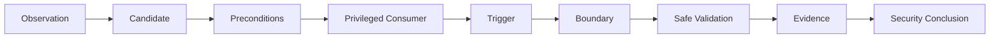

# PrivEsc Explorer

Observation-led assessment workflow

<h2>From an observation to a defensible security conclusion</h2>

PrivEsc Explorer turns host-enumeration results into structured investigation paths.
Start with what you actually observed, identify a candidate mechanism, verify the privilege
relationship, choose proportionate validation, and record evidence without treating tool
output as an automatic vulnerability verdict.

Observation<b>→</b>Candidate<b>→</b>Preconditions<b>→</b>Privileged Consumer<b>→</b>Trigger<b>→</b>Boundary<b>→</b>Evidence<b>→</b>Conclusion

!!! warning "Authorised security testing"

    Use these notes only within an agreed assessment scope. Prefer read-only inspection and proportionate validation. Changes to privileged resources, services, tasks, containers, credentials or security controls require appropriate authorisation and a cleanup plan.

## Choose a Platform

W

### Windows

Investigate services, scheduled tasks, token privileges, filesystem and registry ACLs, DLL loading, credentials, application control, UAC, applications and drivers.

ServicesTokensACLsDLLsCredentials

[Open Windows Explorer](windows.md){ .md-button .md-button--primary }

L

### Linux

Investigate sudo, SUID/SGID, capabilities, systemd, cron, writable resources, credentials, groups, containers, sockets, NFS and kernel candidates.

sudoSUIDCapabilitiessystemdContainers

[Open Linux Explorer](linux.md){ .md-button .md-button--primary }

## Investigation Model

The Explorer deliberately separates an interesting condition from a confirmed privilege boundary. A writable object, token privilege, SUID bit, capability, sudo rule, service, task, socket or application-control gap is a starting point for investigation, not proof by itself.

## How to Use the Explorer

The detailed notes support learning from a topic. The Explorer supports investigating from an observation.

| Starting point | Best route |
|---|---|
| I have a new host session | Establish identity and context in the Windows or Linux enumeration notes |
| A command returned an interesting permission or privilege | Search the relevant platform Explorer |
| An automated tool highlighted a condition | Identify prerequisites, then inspect the target manually |
| I understand the candidate but need detailed procedures | Follow the related platform notes |
| I need a command quickly | Use the platform cheatsheet |
| I have sufficient evidence | Document supported impact, limitations, remediation and retest |

A practical workflow is:

1. Record the current identity and execution context.
2. Search using the observation you actually obtained.
3. Read the candidate's prerequisites before using commands.
4. Identify the controlled resource or privileged operation.
5. Identify the privileged consumer and its execution identity.
6. Establish the trigger or consumption path.
7. Check security controls and other restrictions.
8. Perform only the authorised validation necessary.
9. Record what was established, what remains uncertain and what follows.

## Assessment States

The Explorer uses assessment language carefully.

| State | Meaning |
|---|---|
| Candidate | An observation may be relevant, but applicability and prerequisites still require investigation |
| Supported | The important prerequisites and privilege relationship are supported by evidence, but the boundary has not necessarily been exercised |
| Confirmed | Authorised validation demonstrated the stated capability or privilege boundary |

A technique card's static confidence field describes the quality or maturity of the reference entry. It is not a live verdict for the assessed host.

Keep these conclusions separate:

- **Observation confirmed:** the interesting condition exists.
- **Configuration supported:** effective control and the relevant privileged relationship are established.
- **Execution confirmed:** controlled validation demonstrated the resulting execution identity or capability.

## Search by Observation

You do not need to know a technique ID. Start with a term from the output you actually saw.

| Platform | Example searches | Investigation direction |
|---|---|---|
| Windows | `service`, `writable`, `scheduled task` | Privileged execution and referenced resources |
| Windows | `SeImpersonate`, `SeBackup`, `SeDebug` | Token privileges and required conditions |
| Windows | `DLL`, `PATH`, `registry` | Dependencies, configuration and execution resolution |
| Windows | `AppLocker`, `PowerShell`, `UAC` | Effective controls and intended restrictions |
| Linux | `sudo`, `NOPASSWD`, `SETENV` | Delegated commands and restrictions |
| Linux | `SUID`, `SGID`, `CAP_SETUID`, `CAP_SYS_ADMIN` | Privileged executable functionality |
| Linux | `systemd`, `cron`, `PATH`, `writable` | Privileged automation and dependencies |
| Linux | `Docker`, `docker.sock`, `LXD`, `socket` | Runtime and management-interface access |

A search match does not establish applicability. No search result does not prove that an observation is safe.

## From Observation to Security Conclusion

For a writable-resource path, establish:

- the current principal;
- the exact resource and effective permission;
- the process, service or job consuming it;
- the consumer's execution identity;
- when and how the resource is consumed;
- restrictions that affect the proposed action;
- the resulting capability or impact.

Not every significant issue requires a privileged consumer. Exposed credentials or unauthorised sensitive-data access may be reportable in their own right. Do not describe them as privilege escalation unless the additional privilege relationship is supported.

## Platform Investigation Routes

### Windows

| Area | Relevant questions | Detailed notes |
|---|---|---|
| Identity and token | Which user, groups, privileges, integrity level and elevation state apply? | [Enumeration](../windows/enumeration.md), [UAC](../windows/uac.md) |
| Services | Can the current principal control the service or resources it consumes? | [Services](../windows/services.md) |
| Scheduled execution | Who executes the task and who controls its actions and dependencies? | [Scheduled Tasks](../windows/scheduled-tasks.md) |
| Files and registry | Which effective rights apply to the object and configuration? | [Filesystem Permissions](../windows/filesystem-permissions.md), [Registry](../windows/registry.md) |
| Credentials | Which identity does exposed material represent and what access does it support? | [Credentials](../windows/credentials.md) |
| Execution controls | What policy is effective for the current user, file and process? | [Application Control](../windows/application-control.md), [PowerShell](../windows/powershell.md), [Defender](../windows/defender.md) |

[Open Windows PrivEsc Explorer](windows.md)

### Linux

| Area | Relevant questions | Detailed notes |
|---|---|---|
| Identity and host | Which identity, groups, session and host/container context apply? | [Enumeration](../linux/enumeration.md) |
| Delegated commands | What command, target identity, arguments and environment are permitted? | [sudo](../linux/sudo.md) |
| Privileged executables | What effective privilege is obtained and what functionality exposes it? | [SUID/SGID](../linux/suid-sgid.md), [Capabilities](../linux/capabilities.md) |
| Services and jobs | Which identity consumes the script, executable or configuration? | [Services](../linux/services.md), [Scheduled Jobs](../linux/scheduled-jobs.md) |
| Filesystem | Can the relevant file, parent directory, library or search path be influenced? | [Filesystem Permissions](../linux/filesystem-permissions.md) |
| Credentials | Which secrets are exposed and why do they matter? | [Credentials](../linux/credentials.md) |
| Kernel and controls | Do patch state, namespaces or confinement affect the candidate? | [Enumeration](../linux/enumeration.md), [Security Controls](../linux/security-controls.md) |

[Open Linux PrivEsc Explorer](linux.md)

## Safe Validation and Evidence

Prefer inspection of identity, ownership, effective permissions, service or job configuration, delegated rules and execution restrictions before making changes.

For each significant candidate, record:

- host, time and current principal;
- platform and execution context;
- exact resource, owner and effective rights;
- consumer or privileged operation;
- configured and observed execution identity;
- triggering conditions and controls;
- command or action performed;
- observed result and evidence location;
- limitations, cleanup and retest requirements.

## Detection, Remediation and Retesting

Use the candidate's behaviour to identify relevant telemetry. Distinguish an event being generated from it being collected, detected and acted upon.

Remediation should remove the unsafe relationship, for example by narrowing delegated rights, protecting dependencies, restricting runtime access, correcting configuration or protecting exposed secrets.

Retest under the original principal and comparable conditions. A changed tool result alone does not establish that the underlying issue is resolved.

## Tools and Quick Reference

| Purpose | Existing resources |
|---|---|
| Windows automated enumeration | [WinPEAS](../tools/privilege-escalation/winpeas.md), [PowerUp](../tools/privilege-escalation/powerup.md), [PrivescCheck](../tools/privilege-escalation/privesccheck.md) |
| Linux automated enumeration | [LinPEAS](../tools/privilege-escalation/linpeas.md), [linux-smart-enumeration](../tools/privilege-escalation/linux-smart-enumeration.md) |
| Tool selection | [Privilege Escalation Tools](../tools/privilege-escalation/index.md) |
| Windows commands | [Windows Cheatsheet](../cheatsheets/windows.md), [PowerShell Cheatsheet](../cheatsheets/powershell.md) |
| Linux commands | [Linux Cheatsheet](../cheatsheets/linux.md) |

## Compact Workflow Checklist

- [ ] Establish current principal and execution context.
- [ ] Record the original observation.
- [ ] Select the relevant platform Explorer.
- [ ] Review prerequisites.
- [ ] Identify the controlled resource or privileged operation.
- [ ] Verify effective permissions and consumer identity.
- [ ] Establish the trigger or consumption path.
- [ ] Check dependencies and security controls.
- [ ] Select a proportionate authorised validation method.
- [ ] Separate observation, supported configuration and demonstrated execution.
- [ ] Record evidence, limitations and cleanup.
- [ ] Assess actual impact and contextual severity.
- [ ] Review detection, remediation and retest requirements.

## Maintainer Notes

The Explorer separates platform pages from structured technique data:

- `docs/privesc/windows.md`
- `docs/privesc/linux.md`
- `docs/data/privesc/windows.json`
- `docs/data/privesc/linux.json`

The JSON files remain the technique database. The JavaScript provides discovery, filtering and rendering. The Markdown pages provide context and platform methodology.

## References

- [GTFOBins](https://gtfobins.org/){ target="_blank" rel="noopener noreferrer" }
- [LOLBAS](https://lolbas-project.github.io/){ target="_blank" rel="noopener noreferrer" }
- [MITRE ATT&CK - Privilege Escalation](https://attack.mitre.org/tactics/TA0004/){ target="_blank" rel="noopener noreferrer" }
- [PEASS-ng](https://github.com/peass-ng/PEASS-ng){ target="_blank" rel="noopener noreferrer" }
- [Microsoft Windows Documentation](https://learn.microsoft.com/windows/){ target="_blank" rel="noopener noreferrer" }
- [sudo Documentation](https://www.sudo.ws/docs/){ target="_blank" rel="noopener noreferrer" }
- [systemd Documentation](https://systemd.io/){ target="_blank" rel="noopener noreferrer" }
- [Docker Security](https://docs.docker.com/engine/security/){ target="_blank" rel="noopener noreferrer" }
