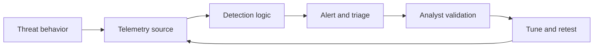

# Detection Engineering for Purple Teaming

Detection engineering is the structured process of designing, implementing, testing, tuning and maintaining security detections.

Within purple teaming, detection engineering connects offensive behaviour with defensive visibility.

```text
Adversary Behaviour
        |
        v
Observable Activity
        |
        v
Telemetry
        |
        v
Detection Hypothesis
        |
        v
Detection Logic
        |
        v
Purple Team Test
        |
        v
Alert
        |
        v
Investigation
        |
        v
Tuning
        |
        v
Retest
        |
        v
Continuous Validation
```

The objective is not simply to make a rule generate an alert.

A useful detection should provide sufficient signal and context for defenders to identify and investigate relevant adversary behaviour.

---

# 1. Detection Engineering Objectives

A purple team detection engineering exercise should answer questions such as:

```text
Does the required telemetry exist?

Is the telemetry collected?

Is it parsed correctly?

Are important fields preserved?

Can the behaviour be distinguished from normal activity?

Does the detection fire?

Does the alert contain useful context?

Can an analyst investigate it?

Does the detection survive realistic variations?

Can the detection be tested again later?
```

These questions represent different layers of the detection lifecycle.

---

# 2. Detection Engineering Lifecycle

A practical lifecycle is:

```text
Threat / Security Objective
        |
        v
Adversary Behaviour
        |
        v
ATT&CK Mapping
        |
        v
Detection Hypothesis
        |
        v
Telemetry Requirements
        |
        v
Telemetry Validation
        |
        v
Detection Development
        |
        v
Baseline Analysis
        |
        v
Purple Team Validation
        |
        v
Tuning
        |
        v
Variant Testing
        |
        v
Deployment
        |
        v
Monitoring
        |
        v
Regression Testing
        |
        v
Maintenance
```

Detection engineering should therefore be treated as an ongoing process rather than a one-time rule-writing activity.

---

# 3. Start With a Security Objective

Avoid beginning with:

```text
We need a rule for T1059.001.
```

Start with the security question.

For example:

```text
Can we identify suspicious PowerShell execution on managed
Windows endpoints with enough context for the SOC to
investigate the activity?
```

Then determine whether ATT&CK provides an appropriate mapping.

This keeps detection engineering connected to security outcomes.

---

# 4. Threat-Informed Detection Engineering

Potential inputs include:

```text
Threat intelligence

Incident investigations

Purple team exercises

Red team operations

Penetration testing

Vulnerability research

SOC observations

Hunting results

Attack-path analysis

Security architecture

Previous detection failures
```

A useful flow is:

```text
Relevant Threat
      |
      v
Relevant Behaviour
      |
      v
Detection Objective
      |
      v
Required Visibility
      |
      v
Detection
```

---

# 5. ATT&CK Mapping

MITRE ATT&CK provides a common language for describing the behaviour being detected.

A detection record might contain:

```text
Detection ID:
DET-WIN-014

ATT&CK:
T1059.001

Technique:
PowerShell

Platform:
Windows

Objective:
Identify suspicious PowerShell execution requiring analyst
investigation.
```

ATT&CK mapping helps organise detections, but it does not prove that the detection works.

See [MITRE ATT&CK for Purple Teaming](mitre-attack.md).

---

# 6. Detection Hypothesis

Before writing a query, define the detection hypothesis.

A detection hypothesis describes:

```text
What behaviour should occur?

Why is it suspicious?

What telemetry should represent it?

What characteristics distinguish it from normal activity?
```

Example:

```text
If suspicious PowerShell execution occurs on a monitored
Windows endpoint, endpoint process telemetry and PowerShell
telemetry should contain characteristics that allow the
activity to be distinguished from expected administrative
usage.
```

This hypothesis can then be tested.

---

# 7. Detection Hypothesis Template

```text
DETECTION HYPOTHESIS

Detection ID:

Security Objective:

Threat Context:

ATT&CK Mapping:

Platform:

Behaviour:

Expected Telemetry:

Important Fields:

Expected Normal Activity:

Suspicious Characteristics:

Known Limitations:

Validation Scenario:
```

A clear hypothesis makes the reasoning behind the detection easier to review.

---

# 8. Behaviour Before Query

Avoid beginning detection engineering with:

```text
index=security EventID=...
```

or another platform-specific query.

First determine:

```text
Behaviour
   |
   v
Observable Activity
   |
   v
Required Telemetry
   |
   v
Required Fields
   |
   v
Detection Logic
```

The query is the implementation of the detection hypothesis.

It should not define the hypothesis.

---

# 9. Observable Behaviour

Translate adversary behaviour into observable system activity.

For example:

```text
Adversary Behaviour
        |
        v
PowerShell Execution
        |
        +---- Process Creation
        |
        +---- Parent/Child Relationship
        |
        +---- Command-Line Activity
        |
        +---- PowerShell Engine Activity
        |
        +---- Network Activity
```

Not every observable is required for every detection.

The purpose is to understand what evidence could exist.

---

# 10. Telemetry Requirements

For each detection, identify the required telemetry.

Examples include:

```text
Process creation

Authentication events

PowerShell logging

File activity

Registry changes

Network connections

DNS queries

Cloud audit logs

Identity events

Application logs

EDR telemetry

Proxy logs
```

Then identify where each event originates.

---

# 11. Telemetry Mapping

A telemetry map might look like:

```text
Endpoint
   |
   +---- Process Telemetry
   |
   +---- PowerShell Telemetry
   |
   +---- File Activity
   |
   v
EDR / Collector
   |
   v
Processing Pipeline
   |
   v
SIEM
   |
   v
Detection
```

This map becomes useful when a detection fails.

---

# 12. Required Fields

A detection should document the fields it depends on.

Example:

```text
host.name

user.name

process.name

process.command_line

process.parent.name

event.code

event.action

@timestamp
```

Different platforms and schemas may use different names.

The important point is to know which data the detection requires.

---

# 13. Field Dependency

Consider a detection that depends on:

```text
process.parent.name
```

If the parser stops populating that field:

```text
Detection Logic
      |
      v
Still Correct
```

but:

```text
Required Data
      |
      v
Missing
```

The detection may stop working even though nobody changed the rule.

This is why telemetry dependencies must be documented.

---

# 14. Telemetry Validation

Before writing or testing the detection, confirm that the required telemetry exists.

Validate:

```text
Event generated?

Sensor receives it?

Collector forwards it?

SIEM receives it?

Parser processes it?

Fields populated?

Timestamp correct?

Data queryable?
```

A useful flow is:

```text
Source Event
    |
    v
Sensor
    |
    v
Collector
    |
    v
Pipeline
    |
    v
Parser
    |
    v
SIEM
    |
    v
Detection
```

---

# 15. Source Versus Collected Telemetry

Distinguish:

```text
Event generated on source
```

from:

```text
Event available to detection platform
```

For example:

```text
Endpoint:
Event exists

Collector:
Event received

SIEM:
Event missing
```

This indicates a collection or processing problem rather than an endpoint logging problem.

---

# 16. Parsing Validation

Check whether the collected event is correctly parsed.

Review:

```text
Timestamp

Hostname

Username

Process

Parent process

Command line

Source address

Destination address

Event type

Action

Outcome
```

Example:

```text
Expected:
user.name

Observed:
user.target.name
```

This may break existing detection logic.

---

# 17. Schema Awareness

Detection engineering often depends on a normalised schema.

Possible examples include:

```text
Elastic Common Schema

Open Cybersecurity Schema Framework

Vendor-specific schemas

Organisation-specific schemas
```

Normalisation can improve portability and consistency, but schema changes create dependencies that must be tested.

---

# 18. Enrichment

Detection logic may depend on enrichment.

Examples:

```text
Asset criticality

User privilege

Department

Hostname classification

Network zone

Threat intelligence

Cloud account

Device ownership

Known administrative systems
```

Document these dependencies.

Example:

```text
Detection:
Suspicious privileged authentication

Dependencies:
Authentication event
User identity
Privileged-user enrichment
```

If enrichment fails, the detection may behave differently.

---

# 19. Baseline Analysis

Before deciding that behaviour is suspicious, understand normal activity.

Questions include:

```text
How frequently does this behaviour occur?

Which users perform it?

Which systems perform it?

At what times?

Which parent processes are normal?

Which command patterns are normal?

Which service accounts generate it?
```

Baseline analysis helps prevent rules from being built around assumptions.

---

# 20. Baseline Example

Suppose the team wants to detect unusual PowerShell activity.

Initial query reveals:

```text
12,000 PowerShell executions per day
```

Most originate from:

```text
Management tooling

Software deployment

Administrative scripts

Monitoring

Automation
```

A rule based only on:

```text
process.name = powershell.exe
```

would generate excessive noise.

The detection needs additional behavioural context.

---

# 21. Detection Signals

Potential detection signals include:

```text
Process relationships

Command-line characteristics

User context

Privilege context

Host context

Network behaviour

File activity

Authentication behaviour

Sequence of events

Rare behaviour

Unusual destinations

Unexpected execution paths
```

The best signal depends on the behaviour and environment.

---

# 22. Indicators Versus Behaviour

Indicator-based detections may use:

```text
IP address

Domain

File hash

Filename

Known command string
```

Behavioural detections may use:

```text
Process relationships

Execution patterns

Authentication patterns

Privilege changes

Network patterns

Sequences
```

Both have value.

Indicator detections can be precise but may age quickly.

Behavioural detections may be more durable but can require more tuning.

---

# 23. Detection Pyramid

A simplified durability model is:

```text
        Behaviour
          /\
         /  \
        /    \
       /      \
      / Tools  \
     /          \
    / Artifacts  \
   /              \
  / Hashes / IOCs  \
 --------------------
```

Signals lower in the model may be easier for adversaries to change.

This is a conceptual model rather than a universal rule.

---

# 24. Single-Event Detection

A simple detection may evaluate one event.

Example concept:

```text
Process Event
     |
     v
Suspicious Characteristics?
     |
     v
Alert
```

Advantages:

```text
Simple

Fast

Easy to understand
```

Limitations:

```text
Limited context

Potential false positives

May miss behavioural sequences
```

---

# 25. Correlation Detection

Correlation combines multiple events.

```text
Event A
   |
   v
Event B
   |
   v
Event C
   |
   v
Correlation
   |
   v
Alert
```

Example concept:

```text
Authentication
      +
Remote Execution
      +
New Process
      =
Potential Lateral Movement
```

Correlation can provide stronger context but introduces more dependencies.

---

# 26. Sequence Detection

Some adversary behaviour is best represented as a sequence.

```text
Event A
    |
Within Time Window
    |
Event B
    |
Within Time Window
    |
Event C
```

The detection should define:

```text
Sequence

Ordering

Time window

Grouping fields

Required events
```

Purple team testing should validate each dependency.

---

# 27. Threshold Detection

Some detections depend on frequency.

Example:

```text
Repeated Authentication Failures
        |
        v
Threshold Reached
        |
        v
Alert
```

Thresholds should be based on:

```text
Environment baseline

Expected behaviour

Risk

False-positive analysis
```

Avoid arbitrary thresholds where possible.

---

# 28. Rare Behaviour Detection

Rare events can be useful signals.

Examples:

```text
Rare parent-child relationship

Rare administrative tool

Rare destination

Rare login location

Rare service creation
```

But:

```text
Rare != Malicious
```

Rarity should contribute to the detection hypothesis rather than automatically define maliciousness.

---

# 29. Allow Lists

Allow lists may reduce noise.

Examples:

```text
Approved management server

Known deployment account

Approved automation script

Expected service account
```

Use them carefully.

An overly broad allow list can create a blind spot.

---

# 30. Exclusions

Before adding an exclusion, ask:

```text
Why is the activity considered safe?

Is the exclusion narrowly scoped?

Could an adversary reproduce the excluded condition?

Does the exclusion remove useful visibility?

How will the exclusion be reviewed?
```

Document exclusions as detection dependencies.

---

# 31. Detection Logic

Detection logic should be:

```text
Understandable

Reviewable

Testable

Maintainable

Versioned

Documented
```

Avoid unnecessary complexity.

Complex rules are not automatically better detections.

---

# 32. Detection Documentation

A detection should ideally include:

```text
Detection ID

Name

Description

Security objective

Threat context

ATT&CK mapping

Platforms

Required data

Required fields

Logic

Severity

Known false positives

Known limitations

Owner

Validation scenarios

Last validated

Version
```

---

# 33. Example Detection Record

```yaml
id: DET-WIN-014
name: Suspicious PowerShell Behaviour

description: >
  Detects selected PowerShell execution characteristics that
  require investigation.

attack:
  - T1059.001

platform:
  - windows

required_data:
  - endpoint_process
  - powershell

required_fields:
  - host.name
  - user.name
  - process.name
  - process.command_line
  - process.parent.name

validation:
  scenarios:
    - PT-EXEC-001
    - PT-EXEC-002

owner: detection-engineering
```

This is an illustrative schema.

---

# 34. Detection-as-Code

Detection-as-code applies software engineering practices to detection content.

Possible practices include:

```text
Version control

Pull requests

Peer review

Automated validation

Testing

Release management

Rollback

Change history
```

Example:

```text
detections/
├── endpoint/
│   ├── DET-WIN-014.yml
│   └── DET-WIN-015.yml
├── identity/
├── cloud/
└── network/
```

---

# 35. Detection Change Workflow

A mature workflow may look like:

```text
Detection Change
       |
       v
Version Control
       |
       v
Pull Request
       |
       v
Peer Review
       |
       v
Static Validation
       |
       v
Purple Test
       |
       v
Approved
       |
       v
Deployment
       |
       v
Monitoring
```

Not every organisation requires exactly this workflow.

The principle is controlled, reviewable change.

---

# 36. Peer Review

Detection review should ask:

```text
Does the logic match the hypothesis?

Are the required data sources available?

Are fields correct?

Is ATT&CK mapping accurate?

Are exclusions justified?

Are known false positives documented?

Is the rule understandable?

Are validation scenarios available?
```

Peer review can catch errors before deployment.

---

# 37. Sigma

Sigma provides a generic format for describing log detections.

A simplified illustrative example is:

```yaml
title: Example Suspicious Process Behaviour
status: experimental

logsource:
  category: process_creation
  product: windows

detection:
  selection:
    Image|endswith: '\example.exe'

  condition: selection
```

Real detection logic should be based on a defensible hypothesis rather than copied blindly from public rules.

---

# 38. Public Detection Rules

Public detections can provide useful starting points.

Before deployment:

```text
Understand the rule

Verify the data source

Verify field mappings

Review ATT&CK mapping

Review environment relevance

Test against normal activity

Execute representative purple tests

Tune carefully
```

Do not assume a public rule works correctly in the local environment.

---

# 39. Detection Portability

A detection may require modification when moving between:

```text
SIEM platforms

EDR platforms

Schemas

Log sources

Operating systems

Cloud providers
```

The detection hypothesis may remain valid while the implementation changes.

This is another reason to document the hypothesis separately from the query.

---

# 40. Purple Team Validation

A detection should be tested against representative behaviour.

```text
Detection Hypothesis
       |
       v
Purple Scenario
       |
       v
Execute
       |
       v
Telemetry
       |
       v
Detection
       |
       v
Alert
       |
       v
Investigation
```

See [Purple Team Exercises](exercises.md).

---

# 41. Confirm Execution First

Before judging the detection:

```text
Did the intended behaviour actually occur?
```

If not:

```text
Detection Result:
INCONCLUSIVE
```

or:

```text
Test Result:
ERROR
```

depending on the situation.

Do not classify:

```text
No Alert
```

as a detection failure if the test never generated the intended behaviour.

---

# 42. Detection Validation States

Useful states include:

```text
PASS

FAIL

PARTIAL

INCONCLUSIVE

ERROR

NOT TESTED

NOT APPLICABLE
```

Define these states consistently across the programme.

---

# 43. PASS

Use `PASS` when:

```text
The representative behaviour occurred

The required telemetry was available

The expected detection fired

The alert met defined success criteria
```

---

# 44. FAIL

Use `FAIL` when:

```text
The representative behaviour occurred

The required telemetry was available

The detection was expected to fire

The detection did not meet the defined success criteria
```

---

# 45. PARTIAL

Example:

```text
Detection fired

but

Required host context was missing
```

or:

```text
Procedure A detected

Procedure B not detected
```

The exact meaning of partial should be defined.

---

# 46. INCONCLUSIVE

Example:

```text
Technique executed

but

Telemetry pipeline experienced an unrelated outage
```

The evidence cannot support a reliable detection conclusion.

---

# 47. Detection Failure Triage

Use a structured failure model:

```text
Did Behaviour Occur?
       |
      No
       |
       v
Test Problem

      Yes
       |
       v
Telemetry Generated?
    /       \
  No         Yes
  |           |
  v           v
Logging     Collected?
Gap         /       \
          No         Yes
          |           |
          v           v
       Pipeline      Parsed?
         Gap        /      \
                  No        Yes
                  |          |
                  v          v
                Schema     Rule Ran?
                  Gap      /      \
                         No        Yes
                         |          |
                         v          v
                     Platform     Matched?
                       Issue      /      \
                                No       Yes
                                |         |
                                v         v
                           Detection    Alert
                              Gap      Routed?
```

This prevents incorrect root-cause assignment.

---

# 48. Detection Did Not Fire

If telemetry exists but the rule does not fire, examine:

```text
Field names

Field values

Data types

Time windows

Rule conditions

Case sensitivity

Normalisation

Sequence logic

Thresholds

Exclusions

Rule state

Index / data source

Query scope
```

Use actual events generated by the purple test when troubleshooting.

---

# 49. Detection Fired Unexpectedly

Sometimes a detection fires for the wrong reason.

Example:

```text
Expected:
Behavioural signal

Actual:
Rule fired only because test filename contained "mimikatz"
```

The test technically generated an alert, but the detection may not validate the intended hypothesis.

Always inspect why the rule matched.

---

# 50. True Positive

A true positive occurs when:

```text
Relevant behaviour occurs
        +
Detection correctly identifies it
```

Purple testing should verify the reasoning behind the alert.

---

# 51. False Positive

A false positive occurs when normal or acceptable activity is incorrectly classified as suspicious under the detection's intended use.

Investigate:

```text
Which condition matched?

Why did legitimate activity satisfy it?

Can the logic be improved?

Can additional context reduce noise?

Would an exclusion create a blind spot?
```

---

# 52. False Negative

A false negative occurs when relevant behaviour happens but the detection fails to identify it.

Possible causes include:

```text
Missing telemetry

Incorrect parser

Different procedure

Different execution path

Overly narrow logic

Exclusion

Threshold

Time-window issue

Environmental difference
```

Purple team variations are particularly useful for finding false negatives.

---

# 53. Detection Precision

For labelled evaluation data:

```text
Precision =
True Positives
/
True Positives + False Positives
```

Precision asks:

```text
When the detection fires, how often is the result actually
relevant under the evaluation criteria?
```

Real SOC data may make precise labels difficult.

Document methodology and assumptions.

---

# 54. Detection Recall

For labelled evaluation data:

```text
Recall =
True Positives
/
True Positives + False Negatives
```

Recall asks:

```text
Of the relevant activity in the evaluation set, how much did
the detection identify?
```

Purple team testing can help estimate behaviour-specific detection performance, but a small number of tests should not be presented as universal recall.

---

# 55. Precision Versus Recall

Detection tuning often involves trade-offs.

```text
Very Broad Detection
       |
       +---- Higher potential recall
       |
       +---- More noise
```

versus:

```text
Very Narrow Detection
       |
       +---- Less noise
       |
       +---- More potential misses
```

The appropriate balance depends on:

```text
Threat

Asset

SOC capacity

Detection purpose

Available context
```

---

# 56. Detection Latency

For a single test:

```text
Time to Detect =
Detection Timestamp - Execution Timestamp
```

Example:

```text
Execution:
14:05:22

Detection:
14:05:31

TTD:
9 seconds
```

Define which timestamps are used.

---

# 57. Pipeline Latency

Detection latency may contain several components.

```text
Activity
   |
   v
Event Generated
   |
   v
Event Collected
   |
   v
Event Ingested
   |
   v
Rule Evaluated
   |
   v
Alert Created
```

Measure these separately when troubleshooting performance.

---

# 58. Alert Quality

A useful alert should contain sufficient context.

Evaluate whether analysts receive:

```text
Host

User

Process

Parent process

Command context

Source

Destination

Timestamp

Detection reason

Relevant related events

Threat context
```

The required fields depend on the detection.

---

# 59. Investigation Quality

A detection is more useful if the analyst can determine:

```text
What happened?

Where?

Which identity?

Which asset?

What occurred before?

What occurred afterwards?

What related activity exists?

Does the event require escalation?
```

Purple testing should validate the analyst workflow where appropriate.

---

# 60. Detection Tuning

Tuning should improve detection quality without destroying the security objective.

A useful cycle is:

```text
Initial Detection
      |
      v
Baseline
      |
      v
Purple Test
      |
      v
False Positives / Misses
      |
      v
Analyse
      |
      v
Tune
      |
      v
Retest
```

---

# 61. Tuning Questions

Before modifying a rule:

```text
Why is the current result wrong?

Which condition caused it?

What normal activity overlaps?

What malicious behaviour must remain visible?

Can additional context distinguish them?

Could the proposed exclusion be abused?

How will the change be retested?
```

---

# 62. Avoid Over-Tuning

A common failure is:

```text
False Positive
      |
      v
Add Exclusion
      |
      v
Another False Positive
      |
      v
Add Exclusion
      |
      v
Large Blind Spot
```

Instead consider whether the underlying detection hypothesis needs improvement.

---

# 63. Variant Testing

After a detection passes the original scenario, test controlled variations.

Example:

```text
Procedure A
   |
   v
PASS
   |
   v
Procedure B
   |
   v
PASS
   |
   v
Procedure C
   |
   v
FAIL
```

The failure defines a detection boundary that should be investigated.

---

# 64. Variation Dimensions

Variations may involve:

```text
Different parent process

Different command structure

Different account

Different host role

Different execution path

Different operating-system version

Different protocol

Different cloud identity

Different destination
```

Only execute variations that are authorised and relevant.

---

# 65. Behavioural Robustness

The goal is not necessarily:

```text
Detect every possible implementation.
```

The goal is to understand:

```text
Which behaviours are detected?

Under which conditions?

Which telemetry is required?

Which variations fail?

What limitations remain?
```

This creates a defensible detection claim.

---

# 66. Detection Boundary Documentation

Example:

```text
Detection:
DET-WIN-014

Validated:
Three representative PowerShell execution scenarios on
managed Windows endpoints.

Dependency:
Endpoint process command-line telemetry.

Known Limitation:
Coverage has not been validated where command-line telemetry
is unavailable.

Cloud:
Not applicable.

Windows Server:
Not yet tested.
```

This is more useful than:

```text
PowerShell:
Covered
```

---

# 67. Detection Regression

A detection that works today may fail later.

Possible causes:

```text
Parser change

Schema change

SIEM migration

EDR upgrade

Log-source change

Rule change

Exclusion change

Operating-system change

Application change

Identity architecture change
```

Regression testing should be part of the detection lifecycle.

---

# 68. Regression Test

A regression test asks:

```text
Did a previously validated detection continue to work after
something changed?
```

Example:

```text
Detection:
DET-WIN-014

Validation Scenario:
PT-EXEC-001

Previous Result:
PASS

Change:
EDR parser upgrade

Retest:
FAIL
```

This provides immediate evidence that the change affected detection capability.

---

# 69. Change-Triggered Validation

Useful triggers include:

```text
Detection rule update

Parser update

SIEM upgrade

EDR upgrade

Logging-policy change

Schema migration

Major endpoint-policy change

Cloud audit change

Identity-policy change
```

Relevant tests can be rerun after these changes.

---

# 70. Continuous Validation

Validated detections can be connected to repeatable purple tests.

```text
Detection
    |
    v
Validation Scenario
    |
    v
Repeatable Test
    |
    v
Scheduled / Change Trigger
    |
    v
Execute
    |
    v
Assertion
    |
    v
PASS / FAIL
```

See [Continuous Validation](continuous-validation.md).

---

# 71. Detection Assertions

A validation test can make several assertions.

```text
Did the test execute?

Did telemetry appear?

Did required fields appear?

Did the detection fire?

Did the alert reach the correct destination?

Did latency remain within the defined threshold?
```

This allows precise failure classification.

---

# 72. Do Not Create False PASS Results

Suppose:

```text
Test Procedure:
FAILED

Detection:
No alert
```

The result is not:

```text
Detection PASS
```

and not necessarily:

```text
Detection FAIL
```

It is:

```text
Test ERROR
```

or:

```text
INCONCLUSIVE
```

depending on the situation.

---

# 73. Detection Test Case

A repeatable test case may contain:

```yaml
test_id: PT-EXEC-001

detection:
  id: DET-WIN-014

attack:
  technique: T1059.001

target:
  platform: windows

expected:
  execution: true
  telemetry: true
  detection: true
  alert: true

required_fields:
  - host.name
  - user.name
  - process.name
  - process.command_line

owner: detection-engineering
```

This is illustrative.

---

# 74. Test Markers

Unique test markers can help identify validation activity.

Example:

```text
PT-DET-2026-001
```

Use markers for correlation where appropriate.

Do not build the detection so that it only fires because the test marker exists.

Otherwise the test validates the marker rather than the adversary behaviour.

---

# 75. Detection Testing in Production

Production validation can reveal:

```text
Real telemetry

Real parsers

Real integrations

Real routing

Real analyst workflows
```

but it also introduces operational risk.

A useful model is:

```text
Develop
   |
   v
Lab Test
   |
   v
Tune
   |
   v
Controlled Production Validation
   |
   v
Operational Monitoring
```

Production testing requires explicit authorisation and appropriate safety controls.

---

# 76. Validation Alert Handling

Purple tests may generate real security alerts.

Decide before testing:

```text
Should analysts know it is a test?

Should the alert be tagged after detection?

Should the test be semi-blind?

Should a dedicated case be created?

How will exercise alerts be distinguished later?
```

Avoid exclusions that prevent the actual detection from being tested.

---

# 77. SOC Coordination

Coordinate validation with the SOC according to the exercise objective.

Possible modes include:

```text
Fully Collaborative

Semi-Blind

Low-Disclosure
```

For detection development:

```text
Fully Collaborative
```

may be most efficient.

For independent SOC validation:

```text
Semi-Blind
```

may provide better evidence.

See [Purple Team Exercises](exercises.md).

---

# 78. Detection Ownership

Every production detection should have an owner or owning function.

Ownership may include responsibility for:

```text
Review

Tuning

Testing

Documentation

ATT&CK mapping

Data dependencies

False-positive analysis

Regression testing

Retirement
```

Unowned detections often become stale.

---

# 79. Detection Review

Review detections when:

```text
Threat relevance changes

Telemetry changes

Schema changes

Environment changes

False positives increase

Detection repeatedly fails

New variants are discovered

Detection logic becomes obsolete
```

---

# 80. Detection Age

Track:

```text
Created

Last Modified

Last Reviewed

Last Validated
```

These dates represent different things.

A rule modified yesterday may not have been validated for months.

---

# 81. Detection Retirement

Retire detections when appropriate.

Reasons may include:

```text
Technology removed

Threat no longer relevant

Detection replaced

Data source removed

Rule duplicated

Control architecture changed

Detection cannot be maintained
```

Retirement should be documented.

---

# 82. Detection Dependencies

A detection may depend on:

```text
Sensor

Logging policy

Collector

Parser

Schema

Enrichment

Threat feed

Reference list

Asset inventory

Identity directory

Time synchronisation
```

Record important dependencies.

They become valuable during incident troubleshooting and regression analysis.

---

# 83. Dependency Map

Example:

```text
DET-WIN-014
     |
     +---- Endpoint Sensor
     |
     +---- Process Telemetry
     |
     +---- PowerShell Telemetry
     |
     +---- SIEM Collector
     |
     +---- Parser
     |
     +---- host.name
     |
     +---- user.name
     |
     +---- process.command_line
```

A change to any dependency may affect the detection.

---

# 84. Detection Metrics

Useful metrics can include:

```text
Detection validation rate

Telemetry validation rate

Detection failure rate

Regression failure rate

Detection latency

Retest completion rate

Validated remediation rate

Stale detection count

Detections without owners

Detections without validation tests
```

See [Metrics and Measurement](metrics-and-measurement.md).

---

# 85. Detection Success Rate

Example:

```text
Detection Success Rate =
Successful Expected Detections
/
Successfully Executed Tests Where Detection Was Expected
```

Define the denominator clearly.

Do not count failed test execution as detection failure without explaining the methodology.

---

# 86. Validation Age

A useful operational measure is:

```text
Current Date - Last Successful Validation
```

This helps identify detections whose effectiveness has not been tested recently.

The appropriate threshold depends on risk and change frequency.

---

# 87. Detection Coverage

Avoid:

```text
Technique mapped to rule = covered
```

Prefer:

```text
Technique
   |
   v
Relevant?
   |
   v
Telemetry Available?
   |
   v
Detection Exists?
   |
   v
Detection Tested?
   |
   v
Variants Tested?
   |
   v
Investigation Validated?
```

Coverage is multidimensional.

---

# 88. Detection Coverage Matrix

Example:

| Technique | Telemetry | Detection | Tested | Variants | Investigation |
|---|---|---|---|---|---|
| T1059.001 | Yes | Yes | Yes | 3 | Yes |
| T1021 | Yes | Yes | Partial | 1 | Partial |
| Selected Technique | No | Planned | No | 0 | No |

This provides more useful information than a single coverage percentage.

---

# 89. Detection Quality Questions

For every important detection ask:

```text
Why does this detection exist?

Which threat or risk does it address?

Which behaviour does it identify?

Which data does it require?

Which fields does it require?

Which scenarios validate it?

When was it last validated?

What are its known limitations?

Who owns it?
```

If these questions cannot be answered, the detection may need documentation or review.

---

# 90. Practical Validation Scenario

Consider an authorised purple team exercise for PowerShell-related execution behaviour.

Detection:

```text
DET-WIN-014
```

ATT&CK:

```text
T1059.001 - PowerShell
```

Objective:

```text
Determine whether representative suspicious PowerShell
execution on the authorised Windows endpoint generates the
expected telemetry, detection and investigation context.
```

---

## Step 1 - Define Required Data

The detection requires:

```text
host.name

user.name

process.name

process.command_line

process.parent.name

timestamp
```

Expected sources:

```text
Endpoint process telemetry

PowerShell telemetry
```

---

## Step 2 - Establish Baseline

Confirm:

```text
Endpoint:
WIN-TEST-01

Sensor:
Healthy

SIEM ingestion:
Healthy

Parser:
Healthy

Detection:
Enabled

Alert queue:
Available

Clock:
Synchronised
```

---

## Step 3 - Execute Representative Scenario

The approved scenario is executed.

Record:

```text
Scenario:
PT-EXEC-001

Target:
WIN-TEST-01

Account:
purple-test-user

Execution:
14:05:22
```

Result:

```text
Execution:
PASS
```

---

## Step 4 - Validate Source Telemetry

Endpoint telemetry contains:

```text
host.name:
WIN-TEST-01

user.name:
purple-test-user

process.name:
powershell.exe

process.parent.name:
example-parent.exe

timestamp:
14:05:22
```

Representative values are illustrative.

Result:

```text
Source Telemetry:
PASS
```

---

## Step 5 - Validate SIEM Telemetry

The event reaches the SIEM.

However:

```text
Expected:
process.parent.name

Observed:
process.parent.executable
```

The expected field is not populated.

Result:

```text
Collection:
PASS

Parsing:
PARTIAL
```

---

## Step 6 - Evaluate Detection

The detection expects:

```text
process.parent.name
```

Because the field is absent:

```text
Detection:
FAIL
```

The test confirms that the behaviour occurred and the telemetry reached the SIEM.

Therefore the result is not a test execution problem.

---

## Step 7 - Root Cause

Investigation determines:

```text
EDR platform updated
        |
        v
Parser changed
        |
        v
Field mapping changed
        |
        v
Detection still references old field
        |
        v
Detection fails
```

Root cause:

```text
The detection dependency was not updated after the parser
schema changed.
```

---

## Step 8 - Improve

The detection engineer updates the detection to use the current normalised field.

The change is peer reviewed.

---

## Step 9 - Retest Original Scenario

The original scenario is executed again.

Observed:

```text
Execution:
PASS

Telemetry:
PASS

Collection:
PASS

Parsing:
PASS

Detection:
PASS

Alert Routing:
PASS
```

---

## Step 10 - Validate Alert Context

The alert contains:

```text
Host:
WIN-TEST-01

User:
purple-test-user

Process:
powershell.exe

Parent:
example-parent.exe

Timestamp:
14:10:03

Detection:
DET-WIN-014
```

Result:

```text
Alert Quality:
PASS
```

---

## Step 11 - Validate Investigation

The analyst can identify:

```text
Affected host

Executing account

Parent process

Command context

Related endpoint events

Relevant timeline
```

Result:

```text
Investigation:
PASS
```

---

## Step 12 - Test Variation

A second authorised procedure representing the same ATT&CK behaviour is executed.

Observed:

```text
Telemetry:
PASS

Detection:
FAIL
```

Analysis shows that the detection depends on an overly specific command pattern.

The detection is tuned again.

---

## Step 13 - Retest Variations

After tuning:

```text
Procedure A:
PASS

Procedure B:
PASS

Procedure C:
PASS
```

The result provides stronger evidence of detection robustness.

It does not prove detection of every possible implementation.

---

## Step 14 - Create Regression Test

The scenario is retained as:

```text
PT-EXEC-001
```

and associated with:

```text
DET-WIN-014
```

The programme defines the test to run after:

```text
Parser changes

EDR upgrades

Detection changes

Schema migrations
```

The original exercise has now become a reusable security validation.

---

# 91. Example Result Record

```text
DETECTION VALIDATION

Detection:
DET-WIN-014

Scenario:
PT-EXEC-001

ATT&CK:
T1059.001

Environment:
Authorised Windows test environment

Execution:
PASS

Telemetry Generation:
PASS

Collection:
PASS

Parsing:
PASS

Detection:
PASS

Alert Routing:
PASS

Investigation:
PASS

Response:
NOT TESTED

Variations:
3

Successful Variations:
3

Known Limitations:
Not validated across all Windows endpoint classes.

Last Validated:
2026-09-09

Regression Test:
Yes
```

---

# 92. Detection Engineering Checklist

## Objective

- [ ] Security objective defined
- [ ] Threat relevance documented
- [ ] ATT&CK mapping reviewed
- [ ] Platform defined
- [ ] Detection hypothesis documented

## Telemetry

- [ ] Required telemetry identified
- [ ] Source identified
- [ ] Sensor identified
- [ ] Collection path understood
- [ ] Parser validated
- [ ] Required fields documented
- [ ] Enrichment dependencies documented
- [ ] Time synchronisation confirmed

## Development

- [ ] Detection logic documented
- [ ] Baseline activity reviewed
- [ ] Known false positives documented
- [ ] Known limitations documented
- [ ] Exclusions reviewed
- [ ] Owner assigned
- [ ] Peer review completed

## Validation

- [ ] Scenario defined
- [ ] Scope authorised
- [ ] Baseline healthy
- [ ] Behaviour executed
- [ ] Execution confirmed
- [ ] Source telemetry confirmed
- [ ] Collection confirmed
- [ ] Parsing confirmed
- [ ] Detection evaluated
- [ ] Alert routing evaluated
- [ ] Alert context evaluated
- [ ] Investigation evaluated

## Tuning

- [ ] False positives reviewed
- [ ] False negatives reviewed
- [ ] Detection boundary understood
- [ ] Exclusions justified
- [ ] Relevant variations tested

## Retest

- [ ] Original scenario repeated
- [ ] Expected result confirmed
- [ ] Variations repeated
- [ ] Evidence captured
- [ ] Limitations updated

## Maintenance

- [ ] Detection versioned
- [ ] Last validation recorded
- [ ] Dependencies recorded
- [ ] Regression test considered
- [ ] Change triggers identified
- [ ] Review schedule defined

---

# 93. Detection Failure Checklist

When a detection does not fire:

- [ ] Confirm the intended behaviour occurred
- [ ] Confirm the test target
- [ ] Confirm the execution timestamp
- [ ] Check source telemetry
- [ ] Check sensor health
- [ ] Check collector health
- [ ] Check SIEM ingestion
- [ ] Check index or data stream
- [ ] Check parser
- [ ] Check field names
- [ ] Check field values
- [ ] Check data types
- [ ] Check time window
- [ ] Check detection state
- [ ] Check detection logic
- [ ] Check exclusions
- [ ] Check thresholds
- [ ] Check correlation dependencies
- [ ] Check alert routing
- [ ] Identify the first failing layer
- [ ] Record root cause
- [ ] Retest after improvement

---

# 94. Detection Review Template

```text
DETECTION

ID:

Name:

Owner:

Version:

Status:


SECURITY OBJECTIVE

Threat Context:

ATT&CK Mapping:

Platform:

Detection Hypothesis:


DATA

Required Data Sources:

Required Fields:

Enrichment:

Collection Dependencies:

Parser Dependencies:


LOGIC

Detection Logic:

Threshold:

Time Window:

Grouping:

Exclusions:

Severity:


BASELINE

Normal Behaviour:

Known Administrative Activity:

Known False Positives:


VALIDATION

Scenario IDs:

Last Test Date:

Execution Result:

Telemetry Result:

Detection Result:

Alert Result:

Investigation Result:

Variants Tested:


LIMITATIONS

Known Blind Spots:

Untested Platforms:

Untested Variations:


MAINTENANCE

Last Modified:

Last Reviewed:

Last Validated:

Next Review:

Regression Test:

Change Triggers:
```

---

# 95. Detection Engineering Decision Tree

```text
DEFINE SECURITY OBJECTIVE
          |
          v
DEFINE BEHAVIOUR
          |
          v
MAP ATT&CK
          |
          v
DEFINE HYPOTHESIS
          |
          v
IDENTIFY TELEMETRY
          |
          v
TELEMETRY AVAILABLE?
       /        \
     No          Yes
     |            |
     v            v
ENGINEER       VALIDATE
TELEMETRY      FIELDS
                  |
                  v
            BUILD DETECTION
                  |
                  v
            BASELINE ANALYSIS
                  |
                  v
             PURPLE TEST
                  |
                  v
           TEST EXECUTED?
             /       \
           No         Yes
           |           |
           v           v
         ERROR      TELEMETRY?
                      /    \
                    No      Yes
                    |        |
                    v        v
                  DATA    DETECTION?
                   GAP      /    \
                          No      Yes
                          |        |
                          v        v
                       ANALYSE   ALERT
                        LOGIC    QUALITY
                          |        |
                          v        v
                         TUNE   INVESTIGATE
                          \        /
                           \      /
                            v    v
                            RETEST
                              |
                              v
                       VARIANT TESTING
                              |
                              v
                           VALIDATE
                              |
                              v
                      REGRESSION TEST
```

---

# 96. Detection Maturity Model

## Level 1 - Reactive

```text
Rules created after incidents

Limited documentation

No consistent testing

Little ownership
```

## Level 2 - Documented

```text
Detection catalogue

ATT&CK mappings

Data-source documentation

Named owners

Basic review
```

## Level 3 - Validated

```text
Purple team scenarios

Detection testing

False-positive analysis

Retesting

Known limitations
```

## Level 4 - Engineered

```text
Detection-as-code

Peer review

Version control

Automated quality checks

Regression tests
```

## Level 5 - Continuous

```text
Threat-informed prioritisation

Change-triggered validation

Continuous regression testing

Dependency monitoring

Metrics

Feedback into security engineering
```

Maturity should be based on demonstrated capability rather than the number of detection rules.

---

# 97. Common Detection Engineering Failures

## Writing Rules Before Understanding Behaviour

Weak:

```text
Find public query
      |
      v
Deploy
```

Better:

```text
Understand Behaviour
      |
      v
Understand Telemetry
      |
      v
Create Hypothesis
      |
      v
Build Detection
      |
      v
Validate
```

---

## Assuming Telemetry Exists

A theoretically correct detection cannot work without the required data.

Always validate telemetry.

---

## Assuming Ingestion Means Parsing Works

An event may exist in the SIEM while required fields are:

```text
Missing

Incorrect

Wrong type

Wrong timestamp

Incorrectly normalised
```

Inspect the actual event.

---

## Mapping Without Testing

```text
Detection mapped to T1059.001
```

does not mean:

```text
T1059.001 detection validated.
```

Mappings describe intent.

Testing provides evidence.

---

## Detecting the Test Marker

If the detection fires because:

```text
command contains PT-TEST-001
```

the exercise may only prove that the test marker is detectable.

Ensure the detection evaluates the intended behaviour.

---

## Overfitting to One Tool

A rule that detects:

```text
ExactToolName.exe
```

may be useful as an indicator detection.

It should not automatically be presented as broad behavioural coverage.

---

## Excessive Exclusions

Too many exclusions can gradually create a blind spot.

Review exclusions as carefully as detection logic.

---

## No Retest

A detection change without retesting remains unvalidated.

```text
Detection Updated
      !=
Detection Validated
```

---

## No Regression Testing

A previously validated detection can silently fail after platform or telemetry changes.

High-value detections should have repeatable validation where practical.

---

# 98. Detection Engineering Mindset

Do not think:

```text
Rule exists = detected

ATT&CK mapped = covered

Alert fired = detection complete

No alert = rule problem

More detections = stronger security

More exclusions = less noise = better

One passing test = universal coverage
```

Think:

```text
What behaviour matters?
        |
        v
What should be observable?
        |
        v
Which telemetry provides that visibility?
        |
        v
Is the telemetry reliable?
        |
        v
What hypothesis are we testing?
        |
        v
Does the detection identify the behaviour?
        |
        v
Why did it match?
        |
        v
Can analysts investigate it?
        |
        v
Which variations work?
        |
        v
Which variations fail?
        |
        v
What dependencies can break it?
        |
        v
How will we test it again?
```

---

# 99. Final Detection Engineering Model

A mature purple team detection engineering process connects:

```text
THREAT
   |
   v
BUSINESS RISK
   |
   v
ADVERSARY BEHAVIOUR
   |
   v
ATT&CK
   |
   v
DETECTION HYPOTHESIS
   |
   v
OBSERVABLE ACTIVITY
   |
   v
TELEMETRY REQUIREMENTS
   |
   v
DATA COLLECTION
   |
   v
PARSING
   |
   v
ENRICHMENT
   |
   v
BASELINE
   |
   v
DETECTION LOGIC
   |
   v
PURPLE TEAM TEST
   |
   v
ALERT
   |
   v
INVESTIGATION
   |
   v
FALSE POSITIVE / NEGATIVE ANALYSIS
   |
   v
TUNING
   |
   v
VARIANT TESTING
   |
   v
RETEST
   |
   v
VALIDATION
   |
   v
VERSION CONTROL
   |
   v
REGRESSION TESTING
   |
   v
CONTINUOUS VALIDATION
```

The final question should not be:

```text
Do we have a detection?
```

It should be:

```text
Can we demonstrate that the relevant adversary behaviour
produces reliable telemetry, triggers an effective detection,
provides sufficient investigation context and continues to
work when the environment changes?
```

That is the purpose of detection engineering within purple teaming.

---



# Related Notes

- [Purple Teaming](index.md)
- [Purple Teaming Methodology](methodology.md)
- [Purple Team Exercises](exercises.md)
- [MITRE ATT&CK for Purple Teaming](mitre-attack.md)
- [Knowledge Transfer](knowledge-transfer.md)
- [Metrics and Measurement](metrics-and-measurement.md)
- [After-Action Review](after-action-review.md)
- [Continuous Validation](continuous-validation.md)
- [Red Team Detection Validation](../red-teaming/detection-validation.md)

---

# References

- [MITRE ATT&CK](https://attack.mitre.org/){ target="_blank" rel="noopener noreferrer" }
- [MITRE ATT&CK Enterprise Matrix](https://attack.mitre.org/matrices/enterprise/){ target="_blank" rel="noopener noreferrer" }
- [MITRE ATT&CK Data Sources](https://attack.mitre.org/datasources/){ target="_blank" rel="noopener noreferrer" }
- [Sigma](https://sigmahq.io/){ target="_blank" rel="noopener noreferrer" }
- [SigmaHQ GitHub](https://github.com/SigmaHQ/sigma){ target="_blank" rel="noopener noreferrer" }
- [MITRE CALDERA](https://caldera.mitre.org/){ target="_blank" rel="noopener noreferrer" }
- [Atomic Red Team](https://github.com/redcanaryco/atomic-red-team){ target="_blank" rel="noopener noreferrer" }
- [NIST Cybersecurity Framework](https://www.nist.gov/cyberframework){ target="_blank" rel="noopener noreferrer" }

!!! tip "Start with a detection hypothesis"

    Define the behaviour, expected telemetry and reason the activity should be detectable before writing platform-specific detection logic.

!!! tip "Validate the data pipeline first"

    A detection cannot work reliably if its required telemetry is missing, delayed, incorrectly parsed or no longer mapped to the expected schema.

!!! tip "Inspect why the detection fired"

    An alert does not automatically validate the intended detection hypothesis. Confirm which events and conditions caused the rule to match.

!!! tip "Test variations"

    A detection that identifies one procedure may still miss another implementation of the same behaviour. Controlled variation testing helps identify the real detection boundary.

!!! tip "Treat detections as maintained security controls"

    Version detections, document dependencies, assign ownership, retest meaningful changes and use regression testing for high-value detections where practical.

!!! warning "Avoid testing the marker instead of the behaviour"

    Unique purple team identifiers can help correlate evidence, but detection logic should not depend solely on those identifiers unless detecting the marker itself is the explicit objective.

!!! warning "Only execute authorised validation"

    Detection validation involving adversary simulation must remain within approved scope and Rules of Engagement, with appropriate safety controls and stop conditions.
