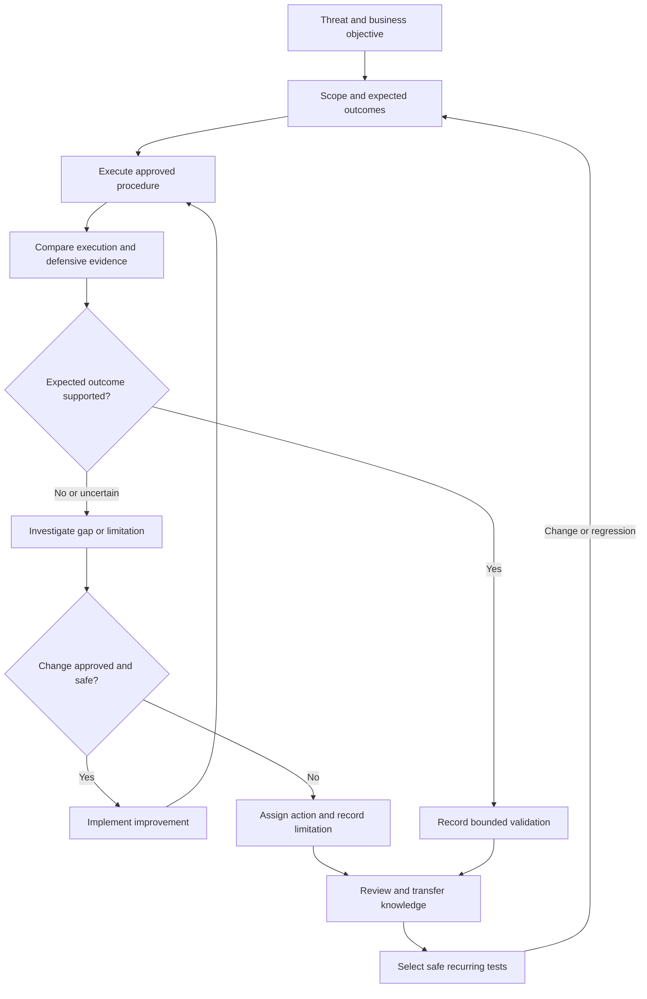

# Purple Teaming

Purple teaming is a structured, collaborative process in which offensive and defensive security teams work together to improve prevention, detection, investigation and response through controlled security testing and shared learning.

Its value comes from connecting technical activity to defensive evidence and organisational improvement:

**What happened? What was visible? What was missed? Why? What changed? Did the change work? Can the organisation retain and repeat that improvement?**

Use this page as the practical overview and navigation map. The eight dedicated pages provide detailed methodology, exercise design, detection engineering, ATT&CK mapping, knowledge transfer, measurement, after-action review and continuous validation.

!!! warning "Authorised security testing"
    Exercises and recurring validation require explicit authorisation, approved systems and accounts, agreed techniques, safety constraints and cleanup requirements. Collaboration between teams does not extend scope or remove change-control requirements. Stop when permission, scope or operational safety becomes uncertain.

## Start Here

<div class="grid cards" markdown>

-   **Methodology**

    ---

    Establish objectives, scope, roles, Rules of Engagement, feedback cycles and evidence requirements.

    [Purple Teaming Methodology](methodology.md)

-   **Exercises**

    ---

    Turn a security question into a controlled scenario with preparation, execution, observation and retesting.

    [Purple Team Exercises](exercises.md)

-   **Detection Engineering**

    ---

    Trace behaviour through telemetry, collection, parsing, detection logic, alerting and investigation.

    [Detection Engineering](detection-engineering.md)

-   **MITRE ATT&CK**

    ---

    Select relevant behaviours, document procedure-level mappings and interpret coverage without overstating it.

    [MITRE ATT&CK](mitre-attack.md)

-   **Knowledge Transfer**

    ---

    Convert participant experience into explanations, reusable artefacts, practice and operational capability.

    [Knowledge Transfer](knowledge-transfer.md)

-   **Metrics and Measurement**

    ---

    Measure technical, operational and learning outcomes using explicit definitions and comparable evidence.

    [Metrics and Measurement](metrics-and-measurement.md)

-   **After-Action Review**

    ---

    Compare expectations with observations, investigate causes and assign improvements with validation criteria.

    [After-Action Review](after-action-review.md)

-   **Continuous Validation**

    ---

    Preserve important tests and detect regressions after changes to systems, telemetry, analytics or processes.

    [Continuous Validation](continuous-validation.md)

</div>

## What Purple Teaming Adds

Purple teaming connects offensive explanation, defensive observation and improvement. It does not require a separate permanent team; it can be a facilitated exercise, a working process or an ongoing programme.

| Approach | Primary focus | Relationship to purple teaming |
|---|---|---|
| Penetration testing | Validate weaknesses and their security impact | Findings can become scenarios for testing prevention, visibility and response |
| Red teaming | Evaluate objective-driven adversary paths and organisational response | Demonstrated paths and defensive gaps can be reproduced collaboratively |
| Purple teaming | Explain, improve and validate security capability through collaboration | Technical results, human decisions and learning are evaluated together |
| Breach and attack simulation | Automate supported security-control tests | Can support repeatability, but does not by itself establish investigation quality or knowledge transfer |

Defender awareness and information sharing depend on the agreed exercise design. A programme may combine an initial baseline attempt with later coached, collaborative attempts.

Keep those results separate. A successful investigation after the facilitator provides the exact query does not demonstrate independent analyst discovery.

See [Red Teaming](../red-teaming/index.md) for objective-driven assessments and [Exercises](exercises.md) for collaborative exercise design.

## Roles and Collaboration

Assign responsibilities before execution. One person may cover several roles, but ownership should remain explicit.

| Role | Main responsibility | Contribution to shared learning |
|---|---|---|
| Exercise sponsor or owner | Approve objectives, resources, boundaries and priorities | Connect technical results to business risk |
| Facilitator | Coordinate timing, communication, safety and feedback | Surface assumptions and keep discussion evidence-led |
| Offensive operator | Execute approved procedures and record actual outcomes | Explain prerequisites, behaviour, artefacts and attack-path relevance |
| Blue team or SOC | Observe, triage and investigate activity | Explain available evidence, analyst decisions and operational constraints |
| Detection engineer | Review telemetry dependencies and analytics | Explain rule behaviour, field mappings, tuning and validation |
| Incident response | Validate escalation, containment and recovery where approved | Explain decision criteria and response dependencies |
| Platform, identity, cloud or application owner | Support context, configuration changes and restoration | Explain intended behaviour and operational impact |
| Evidence or measurement owner | Maintain test records, timestamps and metrics | Make results comparable and traceable |

Use an agreed communication channel and a named stop authority.

A useful working culture is specific and non-punitive: investigate why a system or process behaved as it did rather than treating missed activity as evidence of individual incompetence.

Continue with [Methodology](methodology.md) and [Knowledge Transfer](knowledge-transfer.md).

## The Improvement Lifecycle

Apply the site's evidence model to each technical test:

**Observation -> Candidate -> Validation -> Evidence -> Security Conclusion**

In purple teaming, the resulting conclusion becomes input to improvement, retesting and learning.



Feedback, measurement and knowledge transfer should occur throughout the cycle, not only at the end.

| Stage | What to do | Expected result | What follows |
|---|---|---|---|
| Define | Agree the security question and learning objective | Measurable success criteria | Select a relevant scenario |
| Prepare | Confirm scope, prerequisites, access, telemetry and safety | A controlled, repeatable test | Capture the baseline |
| Execute | Run the agreed procedure and record its actual effect | Evidence of execution, prevention or a test limitation | Inspect defensive records |
| Observe | Trace the result through the defensive process | A supported outcome or a located gap | Investigate causes |
| Improve | Agree and implement the appropriate change | A reviewed configuration, analytic, runbook or process update | Repeat the test |
| Validate | Compare a fresh attempt with the baseline | Evidence of improvement within stated limits | Transfer knowledge and review |
| Sustain | Assign ownership and preserve suitable tests | Reusable checks and operational learning | Detect regression and revisit relevance |

A changed rule is evidence of implementation. A repeated test with the expected result provides evidence of validation.

## Plan a Threat-Informed Exercise

### Define the Question

Choose a question specific enough to answer with observable evidence.

Examples include:

- Can the selected procedure execute under the approved test identity?
- Does the intended preventive control block it?
- Is the required event generated and available to defenders?
- Does the analytic match the relevant behaviour?
- Does the alert reach the correct queue with sufficient context?
- Can an analyst investigate and choose an appropriate response?
- Can another participant repeat the investigation after knowledge transfer?
- Does the improvement continue working after an agreed platform change?

Include both a technical objective and, where relevant, a learning objective.

For example:

> Validate whether a controlled execution procedure produces the expected alert and whether a second analyst can investigate it using the revised runbook without facilitator guidance.

### Select Relevant Behaviour

Use threat intelligence, incident history, red team findings, penetration-test findings, vulnerability assessments, industry threats, critical assets, technology exposure and known control gaps.

For each candidate, explain:

- Why the behaviour matters to this organisation.
- Which asset, identity or business process is relevant.
- Which security assumption the test challenges.
- Which prevention, detection or response capability should be exercised.
- What participants should learn.

Avoid selecting techniques solely because a tool supports them or because they add colour to a coverage matrix.

[MITRE ATT&CK](https://attack.mitre.org/){ target="_blank" rel="noopener noreferrer" } provides a shared vocabulary grounded in observed adversary behaviours. Use the [MITRE ATT&CK notes](mitre-attack.md) to connect the selected procedure to an appropriate mapping.

Record the ATT&CK version or retrieval date used. One successful procedure does not validate every variant of a technique, and a mapping is not evidence that a detection works.

### Confirm Scope and Safety

Document systems, applications, networks, tenants, accounts, tools, techniques, testing windows and exclusions.

Agree:

- Authorised and prohibited activities.
- Dedicated test accounts and validation endpoints where appropriate.
- Known test infrastructure and approved test artefacts.
- Rate limits, resource limits and availability constraints.
- Data access, storage, retention and sharing rules.
- Permitted configuration changes and approval requirements.
- Rollback, cleanup and restoration responsibilities.
- Emergency contacts, stop conditions and restart authority.

Response actions need their own safety review. Isolating a host, disabling an account or blocking a network destination can affect legitimate operations.

Recurring tests require continuing authorisation and maintained safeguards; an earlier exercise approval is not automatically permanent approval.

Continue with [Methodology](methodology.md) and [Exercises](exercises.md).

## Decompose the Technique into a Test

A technique name or tool command is not a complete test specification.

| Component | Record |
|---|---|
| Applicability | Relevant platform, identity, workload and security question |
| Prerequisites | Access, configuration, services, permissions and required telemetry |
| Procedure | Exact approved steps, parameters, tool version and test identity |
| Expected execution | Observable evidence that the intended behaviour occurred |
| Expected prevention | The control expected to block the action, if prevention is the objective |
| Expected telemetry | Source, event characteristics, fields and collection destination |
| Expected detection | Analytic, matching conditions, schedule, suppression and alert destination |
| Expected investigation | Questions the analyst should answer and supporting evidence |
| Expected response | Approved decision or action and its verification criteria |
| Interpretation | What positive, negative and inconclusive results would mean |
| Alternative explanations | Invalid prerequisites, unrelated events, stale alerts or environment differences |
| Cleanup | Artefacts, configuration changes, restoration steps and owner |

For each practical test, make the following clear:

1. When it applies.
2. What to do.
3. What to expect.
4. What the result means.
5. What follows.

Use [Exercises](exercises.md) for scenario records and [Detection Engineering](detection-engineering.md) for telemetry and analytic requirements.

## Validate the Complete Defensive Process

Determine where the process succeeds or fails before deciding what to change.

### Execution and Prevention

Confirm that the procedure was attempted under the intended identity and that its prerequisites were satisfied.

Ask:

- Did the intended behaviour occur?
- Was execution partial, complete or prevented?
- Which control produced the block?
- Is there correlated evidence of that intervention?
- Could an error, missing dependency or incorrect test explain the result?

A failed command is not automatically a prevention success.

If prevention stops the procedure before a later stage occurs, record that downstream behaviour as not exercised. Do not mark it as a detection failure without considering what activity actually happened.

### Telemetry, Collection and Parsing

Check whether relevant evidence was:

- Generated at the source.
- Collected by the expected sensor or service.
- Forwarded to the intended destination.
- Parsed and normalised correctly.
- Populated with the fields required by the analytic.
- Available within the agreed latency and retention window.

Useful sources may include endpoint process events, authentication records, PowerShell logs, service and scheduled-task changes, DNS, proxy, firewall, application, cloud and identity-provider logs.

An event in the endpoint console does not establish that the same information reached the SIEM.

### Detection and Alerting

Inspect whether:

- The analytic was enabled and evaluated the correct data.
- Query logic and field values matched the tested behaviour.
- Scheduling and lookback windows included the event.
- Exceptions, suppression or aggregation affected the result.
- The alert was generated and delivered to the correct destination.
- Severity, entity details and supporting context were useful.

An analytic match, an alert and an analyst investigation are separate outcomes.

Review false positives and expected legitimate behaviour before treating a new or broadened rule as operationally ready. [Sigma documentation](https://sigmahq.io/docs/){ target="_blank" rel="noopener noreferrer" } is a useful reference when working with Sigma-format detections; validate the deployed backend query and local field mappings.

### Investigation and Response

Can the analyst establish:

- What happened and when?
- Which host, account, process or resource was involved?
- What preceded and followed the activity?
- Whether the evidence supports suspicious behaviour.
- What additional information is needed.
- Which escalation or response is appropriate.

Where approved, evaluate containment, evidence preservation, communication, recovery and documentation.

Record whether the result came from independent investigation, a coached walkthrough or a tabletop discussion. These demonstrate different capabilities.

### Use Precise Result Labels

| Result | Meaning |
|---|---|
| Execution confirmed | The intended behaviour occurred and has supporting evidence |
| Prevention confirmed | A specific control blocked the relevant action |
| Telemetry confirmed | Required records were available in the identified source or destination |
| Detection confirmed | The relevant analytic matched the tested activity |
| Alert delivery confirmed | A correlated alert reached the intended workflow |
| Investigation validated | The analyst answered the agreed questions using the available evidence |
| Response validated | The approved response achieved its stated outcome |
| Inconclusive | Available evidence cannot resolve the question |
| Not tested | The relevant stage or behaviour was not exercised |

Tool output is an observation, not automatically a finding. A status should identify the test, environment, evidence and limitations that support it.

## Run Short Feedback Cycles

Use each attempt to resolve a specific uncertainty.

1. Record the baseline conditions and expected outcome.
2. Execute the approved procedure.
3. Confirm the technical result.
4. Review the defensive evidence together.
5. Identify a candidate explanation for any gap.
6. Validate that explanation before changing controls.
7. Approve and implement a targeted improvement.
8. Repeat the procedure and compare fresh evidence.

Weak feedback says:

> The detection did not work.

Useful feedback says:

> The source event reached the SIEM, but the required account field was empty after parsing. The analytic depends on that field, so parsing must be investigated before changing the detection logic.

Improvements may involve telemetry, parsers, analytics, dashboards, SOC queries, runbooks, configuration, training, architecture or workflow. Not every gap requires a new detection rule.

Record what changed between attempts. If several components change together, avoid attributing improvement to one component without supporting evidence.

A replayed historical event can help test analytic logic, but it does not by itself validate fresh event generation, collection or the complete response process.

## Worked Example: Detection Schema Mismatch

### Objective and Baseline

On an approved validation endpoint, test whether a selected execution procedure produces a usable SOC alert.

Before execution, record the procedure, test identity, expected event fields, analytic version, observation window and safety controls.

### First Attempt

The controlled procedure executes. Correlated endpoint and SIEM events exist, but the analytic does not match and no associated alert is found within the agreed window.

This establishes a detection gap for the tested case, not its root cause.

The teams review:

- The source event and parsed representation.
- Required field names and values.
- Analytic logic and deployment status.
- Scheduling and lookback windows.
- Exceptions, suppression and alert routing.

They establish that the analytic expects an older field value that does not match the current event representation.

### Improvement and Retest

Detection Engineering updates the analytic through the agreed review process.

The original procedure is repeated with a new test identifier and timestamp. The teams correlate the new event, rule match, alert and investigation record.

| Stage | Baseline attempt | Retest |
|---|---|---|
| Procedure execution | Confirmed | Confirmed |
| Endpoint telemetry | Available | Available |
| SIEM telemetry | Available | Available |
| Analytic match | No match | Match confirmed |
| Alert delivery | No associated alert | Correlated alert delivered |
| Alert-led investigation | Not exercised | Agreed questions answered |
| Prevention | Not an objective | Not an objective |
| Containment | Not tested | Not tested |

Review representative legitimate activity and selected procedure variations before making broader claims about rule quality.

### Evidence-Based Conclusion

> The selected procedure generated endpoint and SIEM telemetry, but the initial analytic did not match because it expected an outdated field value. After a reviewed analytic change, a fresh execution generated the expected alert and the SOC completed the agreed investigation. Detection and investigation were validated for the tested procedure and environment. Prevention, containment and broader technique coverage were not established by this exercise.

Preserve the procedure, evidence, analytic version, root-cause explanation and investigation guidance.

Continue with [Detection Engineering](detection-engineering.md), [After-Action Review](after-action-review.md) and [Continuous Validation](continuous-validation.md).

## Make Knowledge Transfer Observable

Exercise knowledge should not remain only with the original participants.

Transfer may be needed between offensive operators, the SOC, detection engineers, incident responders, security engineering and platform, identity, cloud or application teams.

| Activity | Practical output | Evidence of learning or transfer |
|---|---|---|
| Explain the behaviour | Preconditions, procedure and expected artefacts | Recipient can explain why the activity matters |
| Explain the evidence | Annotated events and relevant queries | Recipient can locate and interpret the necessary records |
| Demonstrate investigation | Worked case and decision rationale | Recipient understands the sequence and alternatives |
| Practise independently | Repeatable exercise or new example | Recipient completes the task without step-by-step coaching |
| Update operational material | Runbook, test definition, query or checklist | Another operator can use the material successfully |
| Revisit later | Delayed practice or operational review | Knowledge remains usable beyond the initial session |

Useful mechanisms include paired analysis, teach-back, demonstrations, guided practice, independent practice, peer review and handover to another shift or team.

Attendance and document publication are not sufficient evidence of transfer. Confidence questionnaires can be useful, but self-reported confidence should be distinguished from demonstrated task performance.

The [NICE Framework](https://www.nist.gov/itl/applied-cybersecurity/nice/nice-framework-resource-center){ target="_blank" rel="noopener noreferrer" } can help describe relevant tasks, knowledge and skills. It is not, by itself, a test of whether a specific exercise improved those capabilities.

Continue with [Knowledge Transfer](knowledge-transfer.md).

## Measure Capability, Not Activity Alone

Use a balanced view of technical, operational, learning and programme outcomes.

| Dimension | Useful measures | Interpretation requirement |
|---|---|---|
| Technical | Execution, prevention, telemetry, detection and retest results | Separate attempted procedures from valid executions and prevented cases |
| Operational | Detection, triage, investigation and containment times | Define the start event, end event, observation window and clock source |
| Learning | Teach-back quality, independent task completion and later retention | Separate coaching, confidence and demonstrated capability |
| Programme | Action closure, repeated gaps and regression frequency | Distinguish implemented changes from validated improvements |

For percentages, state the numerator, denominator and exclusions.

For example:

> Eight of ten valid executions produced the expected alert. Two additional scheduled tests were inconclusive because their prerequisites were unavailable.

Do not silently count inconclusive tests as passes or omit them from reporting.

For timing:

- Separate event occurrence, ingestion, alert creation and analyst acknowledgement.
- Record timezone and known clock differences.
- Report missed detections separately from timing results.
- Distinguish automated timestamps from observer estimates.
- Keep coached and independent attempts separate.
- Explain material changes in test difficulty or environment.

A shorter investigation time after a walkthrough is useful learning evidence, but it does not alone prove improved performance against unfamiliar activity.

Continue with [Metrics and Measurement](metrics-and-measurement.md).

## After-Action Review and Improvement Ownership

The review should reconstruct what was expected, what occurred and why they differed.

Discuss:

- Which controls and practices worked.
- Which gaps were supported by evidence.
- Which explanations remain uncertain.
- What participants learned.
- What should change.
- Who owns each action.
- What evidence will establish successful validation.

For each action, record an owner, priority, target date, dependencies, acceptance criteria, retest and evidence location.

Distinguish:

- **Observation recorded:** the issue is documented.
- **Action assigned:** responsibility is agreed.
- **Change implemented:** the proposed improvement exists.
- **Improvement validated:** the relevant test supports the expected outcome.
- **Operationally adopted:** the change and associated knowledge are in use.

A report entry is not the same as a learned lesson. A completed ticket is not automatically evidence of a working control.

Continue with [After-Action Review](after-action-review.md).

## Continuous Validation

Preserve important, successfully retested scenarios as reusable checks where execution can remain safe and authorised.

Revalidation may be appropriate after:

- EDR or operating-system upgrades.
- SIEM migrations or configuration changes.
- Parser and field-mapping changes.
- Detection updates, exceptions or suppression changes.
- Logging and collection changes.
- Identity, cloud or application changes.
- New threat information or a relevant incident.
- Runbook, staffing or workflow changes.

A reusable test needs an owner, version, prerequisites, expected outcomes, evidence sources, execution limits, cleanup steps and a failure-handling process.

Not every test should run unattended. Some require a maintenance window, human supervision or a lab environment.

Automation can support execution and comparison, but it does not automatically establish analyst understanding, investigation quality or safe response.

When a recurring test fails, first determine whether the result reflects a control regression, an invalid test, changed prerequisites or missing evidence.

Continue with [Continuous Validation](continuous-validation.md).

## Reusable Exercise Record

Use this compact record as a starting point. Keep sensitive evidence in the approved evidence store rather than copying secrets into the record.

```text
Exercise ID:
Test / Attempt ID:
Date and timezone:
Exercise owner:
Participants and roles:

Business objective:
Technical objective:
Learning objective:
Scope and exclusions:
Authorisation / Rules of Engagement:
Safety and stop conditions:

Scenario:
Technique / procedure:
ATT&CK mapping and version:
Target and test identity:
Prerequisites:
Tool / procedure version:
Relevant control / analytic version:

Expected execution:
Expected prevention:
Expected telemetry and fields:
Expected detection and alert:
Expected investigation:
Expected response:
Observation window:

Actual procedure:
Execution result:
Preventive-control result:
Source telemetry:
Collected / parsed telemetry:
Analytic result:
Alert identifier:
Investigation result:
Response result:
Evidence references:
Limitations and alternative explanations:

Candidate root cause:
Root-cause validation:
Approved improvement:
Change owner:
Change reference:
Rollback / cleanup requirements:

Retest procedure:
Retest result and evidence:
False-positive / variation checks:
Knowledge-transfer activity:
Independent practice / retention evidence:

After-action review:
Outstanding actions:
Action owner and target date:
Acceptance criteria:
Continuous-validation suitability:
Cleanup verification:
Final status:
```

For detailed templates and measurement guidance, use [Exercises](exercises.md) and [Metrics and Measurement](metrics-and-measurement.md).

## Programme Development

The following is an illustrative planning aid, not a validated maturity standard or an official framework. Capabilities can develop in parallel rather than in a strict sequence.

| Stage | Characteristic | Evidence to look for |
|---|---|---|
| 1. Isolated | Teams operate with little shared context | Findings rarely lead to joint analysis |
| 2. Cooperative | Teams exchange selected observations | Findings and explanations are shared |
| 3. Collaborative | Structured joint exercises occur | Roles, scope and feedback cycles are documented |
| 4. Measured | Objectives and outcome measures are defined | Results have clear definitions and evidence |
| 5. Learning | Knowledge transfer and review are systematic | Participants can apply and share what they learned |
| 6. Validated | Improvements require retesting | Before-and-after evidence supports closure |
| 7. Continuous | Suitable scenarios are maintained and repeated | Regressions are identified and assigned to owners |

Use this to identify a useful next capability, not to claim an organisation-wide score from a single exercise.

## Common Mistakes

Avoid:

- Treating purple teaming as only another penetration test.
- Measuring only whether the offensive action succeeded.
- Testing without business, technical or learning objectives.
- Selecting techniques without threat relevance.
- Treating a tool result as a security conclusion.
- Assuming command failure proves prevention.
- Focusing only on detection rules while ignoring telemetry dependencies.
- Confusing analytic matches with delivered alerts.
- Ignoring investigation and response capability.
- Changing controls without repeating the relevant test.
- Reporting metrics without denominators or context.
- Treating coached performance as independent capability.
- Holding a review without assigning actions and acceptance criteria.
- Publishing lessons without validating understanding.
- Assuming one successful test proves permanent or complete effectiveness.
- Running recurring tests without maintained scope, ownership and cleanup.

## Purple Teaming Checklist

### Planning

- [ ] Define business, technical and learning objectives.
- [ ] Define scope, exclusions and success criteria.
- [ ] Assign participants, owners and facilitator responsibilities.
- [ ] Agree Rules of Engagement and safety constraints.
- [ ] Select threat-relevant behaviours.
- [ ] Review ATT&CK mappings where useful.
- [ ] Identify expected telemetry, analytics and alert destinations.
- [ ] Define the investigation or response outcomes being tested.
- [ ] Agree measurement definitions and evidence requirements.

### Preparation

- [ ] Confirm authorisation, targets and test accounts.
- [ ] Confirm prerequisites and relevant configuration versions.
- [ ] Confirm required logging and collection paths.
- [ ] Confirm appropriate SIEM, EDR and supporting access.
- [ ] Confirm communication and escalation channels.
- [ ] Confirm evidence handling and clock references.
- [ ] Confirm stop, rollback and cleanup procedures.
- [ ] Record whether baseline attempts are coached or independent.

### Execution

- [ ] Record attempt identifier, timestamp, target and identity.
- [ ] Execute only the agreed procedure.
- [ ] Confirm actual execution and prevention results.
- [ ] Verify source telemetry.
- [ ] Verify collection, forwarding and parsing.
- [ ] Verify analytic evaluation and alert delivery.
- [ ] Assess investigation and approved response separately.
- [ ] Record inconclusive and untested stages.
- [ ] Track all introduced changes and artefacts.

### Collaboration

- [ ] Share observations and supporting evidence.
- [ ] Explain the offensive behaviour and prerequisites.
- [ ] Explain telemetry, detection logic and analyst decisions.
- [ ] Identify assumptions and alternative explanations.
- [ ] Validate the suspected cause of a gap.
- [ ] Agree the improvement, owner and approval route.

### Retesting

- [ ] Repeat the original procedure with a fresh attempt identifier.
- [ ] Record changes between the baseline and retest.
- [ ] Compare execution and defensive outcomes.
- [ ] Confirm telemetry, detection and investigation where applicable.
- [ ] Check legitimate activity and selected variations where agreed.
- [ ] Capture evidence and state remaining limitations.

### Learning

- [ ] Identify what each relevant audience needs to learn.
- [ ] Explain and demonstrate the important relationships.
- [ ] Update queries, runbooks and test documentation.
- [ ] Use teach-back or independent practice.
- [ ] Distinguish confidence from demonstrated capability.
- [ ] Assign ownership and consider a later retention check.

### After-Action Review

- [ ] Reconstruct the timeline.
- [ ] Compare expected and observed outcomes.
- [ ] Identify strengths as well as gaps.
- [ ] Separate verified causes from hypotheses.
- [ ] Assign actions, owners, target dates and acceptance criteria.
- [ ] Define retests and evidence required for closure.
- [ ] Verify cleanup and document unresolved restoration issues.

### Continuous Improvement

- [ ] Track actions through implementation and validation.
- [ ] Identify repeated findings and systemic dependencies.
- [ ] Preserve suitable scenarios as versioned regression tests.
- [ ] Maintain authorisation, safety controls and test ownership.
- [ ] Review failures and changed prerequisites.
- [ ] Review metrics, learning outcomes and threat relevance.
- [ ] Retire or revise obsolete tests.

## Reading Routes and Related Notes

For a first structured exercise, read:

1. [Methodology](methodology.md)
2. [Exercises](exercises.md)
3. [MITRE ATT&CK](mitre-attack.md)
4. [Detection Engineering](detection-engineering.md)
5. [Knowledge Transfer](knowledge-transfer.md)
6. [Metrics and Measurement](metrics-and-measurement.md)
7. [After-Action Review](after-action-review.md)
8. [Continuous Validation](continuous-validation.md)

For a specific problem:

| Starting point | Continue with |
|---|---|
| An action ran but no alert appeared | [Detection Engineering](detection-engineering.md) |
| A scenario lacks clear purpose or boundaries | [Methodology](methodology.md) and [Exercises](exercises.md) |
| Coverage claims are difficult to justify | [MITRE ATT&CK](mitre-attack.md) and [Metrics and Measurement](metrics-and-measurement.md) |
| Lessons remain with a few participants | [Knowledge Transfer](knowledge-transfer.md) |
| Improvements are documented but not verified | [After-Action Review](after-action-review.md) |
| Previously working controls regress | [Continuous Validation](continuous-validation.md) |

Use the wider site for the behaviour and environment being assessed:

- [Red Teaming](../red-teaming/index.md)
- [Active Directory](../active-directory/index.md)
- [Windows Security](../windows/index.md)
- [Linux Security](../linux/index.md)
- [Web Application Security](../web/index.md)
- [Source Code Review](../source-code-review/index.md)
- [PrivEsc Explorer](../privesc/index.md)
- [Tools](../tools/index.md)
- [Cheatsheets](../cheatsheets/index.md)

Select tools to support the agreed test. Keep scenario design, interpretation and learning objectives independent of any particular framework.

## References

- [MITRE ATT&CK](https://attack.mitre.org/){ target="_blank" rel="noopener noreferrer" }
- [Caldera](https://caldera.mitre.org/){ target="_blank" rel="noopener noreferrer" }
- [MITRE Center for Threat-Informed Defense](https://ctid.mitre.org/){ target="_blank" rel="noopener noreferrer" }
- [Atomic Red Team](https://github.com/redcanaryco/atomic-red-team){ target="_blank" rel="noopener noreferrer" }
- [Sigma Documentation](https://sigmahq.io/docs/){ target="_blank" rel="noopener noreferrer" }
- [NIST Cybersecurity Framework](https://www.nist.gov/cyberframework){ target="_blank" rel="noopener noreferrer" }
- [NICE Workforce Framework for Cybersecurity](https://www.nist.gov/itl/applied-cybersecurity/nice/nice-framework-resource-center){ target="_blank" rel="noopener noreferrer" }
