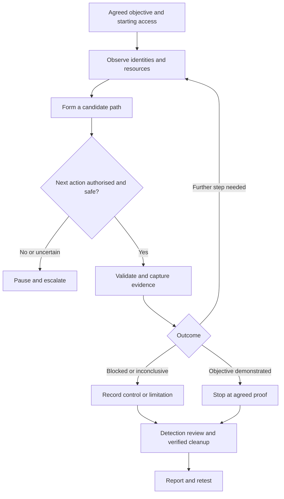

# Red Teaming

Red teaming evaluates whether realistic adversary behaviour can reach agreed business objectives and how effectively an organisation prevents, detects, investigates and responds to that activity.

The central theme is **attack-path analysis**: understanding how exposure, identities, permissions, credentials, applications and trust relationships combine to create meaningful security impact.

Use this page to plan an assessment, choose the appropriate investigation route and connect technical results to defensive outcomes. Follow the dedicated pages for detailed procedures.

An established session, a privileged account or a highlighted tool result is not automatically the final objective or a confirmed finding.

!!! warning "Authorised security testing"
    Perform testing only with explicit written authorisation, an agreed scope and approved Rules of Engagement. Technical reachability, valid credentials and access to a connected system do not extend that authorisation. Stop when scope, safety or permission becomes uncertain.

## Start Here

<div class="grid cards" markdown>

-   **Methodology and Planning**

    ---

    Define objectives, starting access, scope, Rules of Engagement, evidence requirements and decision points.

    [Start with Methodology](methodology.md)

-   **Adversary Emulation**

    ---

    Select relevant behaviours, document threat assumptions and build a scenario that tests meaningful organisational risk.

    [Plan Adversary Emulation](adversary-emulation.md)

-   **Infrastructure and OPSEC**

    ---

    Prepare controlled infrastructure, restrict operator access, protect engagement data and establish operational safeguards.

    [Infrastructure](infrastructure.md) · [Operational Security](opsec.md)

-   **Reconnaissance and Initial Access**

    ---

    Map the authorised attack surface and evaluate permitted routes into the environment.

    [Reconnaissance](reconnaissance.md) · [Initial Access](initial-access.md)

-   **Post-Compromise Investigation**

    ---

    Establish the actual security context, identify candidate paths and determine which next action supports the objective.

    [Discovery](discovery.md) · [Lateral Movement](lateral-movement.md)

-   **Detection and Closeout**

    ---

    Correlate activity with defensive evidence, verify cleanup and explain the demonstrated attack path.

    [Detection Validation](detection-validation.md) · [Cleanup](cleanup.md) · [Reporting](reporting.md)

</div>

## Choose the Assessment Approach

These approaches overlap technically. Their distinction is the question being tested, not a fixed set of tools.

| Approach | Primary question | Typical output |
|---|---|---|
| Penetration testing | Which weaknesses are exploitable, under what conditions and with what impact? | Validated findings, affected assets and remediation |
| Red teaming | Can a relevant attack path reach the agreed objective, and how does the organisation respond? | Attack-path narrative, objective evidence and defensive observations |
| Adversary emulation | How does the environment respond to selected behaviours associated with a relevant threat? | A documented scenario with behaviour-specific results |
| Purple teaming | How can offensive and defensive teams jointly improve and verify security capability? | Reproduced behaviours, improved controls and shared learning |

The engagement agreement determines defender awareness, permitted techniques and collaboration. Neither stealth nor the use of a C2 framework alone makes an assessment a red team engagement.

A red team assessment can lead into a collaborative [Purple Teaming](../purple-teaming/index.md) exercise to reproduce gaps, tune controls and validate improvements.

## Define the Engagement Before Testing

An objective should identify the business concern, starting position, permitted actions and minimum evidence needed to establish an outcome.

For example:

> Starting from a provided standard-user workstation, determine whether that identity can access a designated synthetic finance document on an approved server, and assess whether the activity is detected and investigated.

This tests a bounded access path without requiring unnecessary access to production financial records.

| Planning area | Establish before execution |
|---|---|
| Business objective | Protected asset, risk scenario and success criteria |
| Starting position | External access, provided credentials, workstation access or another agreed assumption |
| Scope | Approved domains, addresses, applications, tenants, identities and physical locations |
| Exclusions | Third parties, sensitive accounts, critical services, safety systems and prohibited actions |
| Rules of Engagement | Testing windows, source infrastructure, permitted techniques, rate limits and change restrictions |
| Human-focused activity | Approved participants, communication channels, pretexts, privacy safeguards and escalation process |
| Data handling | Permitted data, storage, access, retention, redaction and transfer destinations |
| Operational control | Engagement lead, authorised customer contact, emergency channel and stop procedure |
| Evidence and cleanup | Required proof, action logging, change tracking, restoration owners and verification |

Record any assumed or customer-provided access. An assumed-breach exercise does not demonstrate that external initial access was achieved.

Use [Methodology](methodology.md), [Adversary Emulation](adversary-emulation.md) and [OPSEC](opsec.md) for planning detail.

!!! important "Stop conditions"
    Pause affected activity for unexpected production impact, system instability, excluded-system access, unexpected sensitive data, third-party exposure, loss of infrastructure control or uncertain scope. Follow the agreed escalation procedure and obtain clearance before resuming. A genuine incident takes priority over exercise continuity.

## Attack-Path Methodology

Use the same evidence model throughout the site:

**Observation -> Candidate -> Validation -> Evidence -> Security Conclusion**

For every proposed step, ask:

- What identity and access do we actually have?
- What resource, permission or trust relationship may enable the next step?
- Which prerequisites and security controls apply?
- Is the target and action authorised?
- What is the least intrusive test that resolves the question?
- What would support, disprove or limit the conclusion?



An attack path is not a mandatory sequence of tactics. Credential access may precede execution; an existing identity may already have access to the objective; privilege escalation or persistence may be unnecessary.

A failed action is not automatically evidence of effective prevention. Distinguish a verified blocking control from missing prerequisites, an implementation error, insufficient access or an untested assumption.

| Phase | What to do | Expected result | What follows |
|---|---|---|---|
| Prepare | Agree the scenario, controls and evidence requirements | An executable, bounded assessment plan | Prepare infrastructure and starting access |
| Observe | Map relevant exposure, identities, resources and trust | Context and candidate paths | Select an objective-relevant hypothesis |
| Validate | Check prerequisites and perform the approved test | A supported, blocked or inconclusive step | Continue only where justified |
| Demonstrate | Obtain the agreed minimum proof | Evidence of the precise objective outcome | Stop unnecessary access or collection |
| Evaluate | Correlate operator activity with defensive records | Prevention, visibility and response observations | Identify specific improvements |
| Close | Restore changes, report and arrange retesting | Verified closeout and actionable results | Validate remediation |

## Detailed Red Teaming Notes

These routes cover every dedicated page in this section. Select pages according to the objective and current evidence rather than treating them as a compulsory execution checklist.

### Planning and Preparation

| Page | When to use it | Key question |
|---|---|---|
| [Methodology](methodology.md) | Defining or reviewing an engagement | Are objectives, assumptions, boundaries and decision points explicit? |
| [Adversary Emulation](adversary-emulation.md) | Building a threat-informed scenario | Why are these behaviours relevant, and what will their results establish? |
| [Infrastructure](infrastructure.md) | Preparing domains, servers, delivery services and supporting resources | Is the infrastructure controlled, isolated, logged and recoverable? |
| [OPSEC](opsec.md) | Planning operator activity and handling engagement data | What could expose sensitive material or create unintended operational risk? |

### Exposure and Access

| Page | When to use it | Key question |
|---|---|---|
| [Reconnaissance](reconnaissance.md) | Mapping public exposure and candidate entry points | What is exposed, who owns it and is interaction permitted? |
| [Initial Access](initial-access.md) | Evaluating an approved route into the environment | What boundary was crossed and what access was actually obtained? |
| [Social Engineering](social-engineering.md) | Testing authorised human and process interactions | Which process or trust assumption is being evaluated? |
| [Phishing](phishing.md) | Running an explicitly approved messaging scenario | What happened at delivery, interaction, execution and reporting stages? |

Passive information gathering and direct probing have different interaction footprints. Record sources, ownership uncertainty and the permitted level of active testing.

Do not treat a discovered domain, cloud service, employee account or supplier relationship as automatically in scope.

### Execution and Attack-Path Development

| Page | When to use it | Key question |
|---|---|---|
| [Execution](execution.md) | Validating whether an approved action runs | Which process and identity executed it, under which restrictions? |
| [Command and Control](command-and-control.md) | Assessing authorised remote tasking and communication | Was the channel established, usable and visible to defenders? |
| [Discovery](discovery.md) | Understanding the current environment | Which systems, identities and resources are relevant and reachable? |
| [Privilege Escalation](privilege-escalation.md) | Testing a required increase in authority | What specific mechanism crosses the privilege boundary? |
| [Credential Access](credential-access.md) | Reviewing authentication material and secret exposure | What access does the material represent, and is its use permitted? |
| [Lateral Movement](lateral-movement.md) | Validating access to another system or identity | Which credentials, permissions and protocols enable the transition? |
| [Persistence](persistence.md) | Testing explicitly approved access-retention scenarios | What change retains access, and how will removal be verified? |
| [Defence Evasion](defence-evasion.md) | Evaluating controls against approved behaviours | Which protection or visibility assumption is being tested? |

Persistence and defence-evasion testing are not default requirements. Do not disable protections, deploy access-retention mechanisms or increase operational risk merely to complete a list of techniques.

### Objectives, Defensive Evaluation and Closeout

| Page | When to use it | Key question |
|---|---|---|
| [Collection](collection.md) | Demonstrating access to approved information | What minimum data or metadata establishes access? |
| [Exfiltration](exfiltration.md) | Testing an approved transfer scenario | Did the agreed data reach the controlled destination, and what controls responded? |
| [Detection Validation](detection-validation.md) | Comparing activity with defensive evidence | Was the behaviour recorded, alerted on, investigated and contained? |
| [Cleanup](cleanup.md) | Tracking and reversing assessment changes | What was changed, what was restored and what remains outstanding? |
| [Reporting](reporting.md) | Explaining the engagement outcome | Which path was demonstrated, what limited it and what should improve? |

Reading a file does not prove that it can be transferred outside the environment. Likewise, a successful transfer of synthetic data does not establish access to every production dataset.

## Establish Context After Access

Before expanding activity, establish identity, host role, session type, available privileges, network position and applicable controls.

For a Windows baseline:

```cmd
whoami /all
```

For a Linux baseline:

```bash
id
```

These commands provide identity context, not a vulnerability assessment.

Follow with targeted investigation of:

- Operating system, hostname and domain or tenant membership.
- Current process, session restrictions and effective privileges.
- Interfaces, routes, listeners and accessible management services.
- Relevant processes, services, applications and mounted resources.
- Endpoint, application-control, identity and network protections.
- Sensitive systems and data that must be avoided.

Recheck scope when moving to a new host, account, tenant or network segment.

Use [Discovery](discovery.md), [Windows](../windows/index.md) and [Linux](../linux/index.md) for detailed host assessment.

Where Active Directory is relevant, use [Active Directory](../active-directory/index.md) for Kerberos, NTLM, ACLs, delegation, AD CS, trusts and identity attack paths.

Network reachability, successful authentication and permission to perform a particular operation are separate conditions. Pivoting changes the route to a target, not the assessment's authority to access it.

## Tools and Supporting Resources

Choose tools after defining the test, expected evidence and operational constraints.

| Resource | Role in the assessment |
|---|---|
| [Tools](../tools/index.md) | Choose the appropriate tooling category |
| [Red Teaming Tools](../tools/red-teaming/index.md) | Connect operational requirements to supporting tools |
| [C2 Frameworks](../tools/red-teaming/c2-frameworks.md) | Review framework choices and operational considerations |
| [Active Directory Tools](../tools/active-directory/index.md) | Route to identity-focused tooling, including NetExec, Impacket, BloodHound and Certipy |
| [Privilege Escalation Tools](../tools/privilege-escalation/index.md) | Support host enumeration and candidate identification |
| [PrivEsc Explorer](../privesc/index.md) | Investigate Windows and Linux privilege mechanisms |
| [Web Application Security](../web/index.md) | Investigate application-based entry points and trust boundaries |
| [Cheatsheets](../cheatsheets/index.md) | Retrieve commands for an already understood task |

Validate tool behaviour before use, record relevant versions and configuration, and understand expected artefacts, traffic and cleanup requirements.

A framework reporting task completion does not necessarily prove the intended security outcome. Correlate its output with target-side evidence.

For focused defensive testing, [Atomic Red Team](https://github.com/redcanaryco/atomic-red-team){ target="_blank" rel="noopener noreferrer" } provides individual tests mapped to ATT&CK. Review prerequisites and cleanup before running a test; an individual test is not a complete engagement methodology.

## Evidence and Defensive Outcomes

Maintain an action timeline throughout the engagement. Use UTC or an explicitly documented timezone and account for clock differences between evidence sources.

For each meaningful action, record:

- Action identifier and timestamp.
- Source, target and current identity.
- Objective relationship and candidate being tested.
- Command or action, relevant tool version and configuration.
- Preconditions and observed result.
- Supporting output, log references or screenshots.
- Changes introduced and cleanup status.
- Defensive observations and remaining uncertainty.

Keep secrets out of routine screenshots and reports. Store necessary sensitive evidence under the agreed access and retention controls.

### Separate Execution from Detection

| Outcome | Evidence needed |
|---|---|
| Execution confirmed | Target-side result showing the intended action occurred |
| Prevention confirmed | Evidence that a specific control blocked the action |
| Telemetry confirmed | Relevant records in an identified endpoint, network, application or identity source |
| Alert confirmed | A correlated alert with its identifier and timestamp |
| Investigation confirmed | Analyst or case evidence showing assessment of the activity |
| Containment confirmed | Evidence that the response restricted the relevant access or behaviour |
| Unknown or not assessed | An explicit statement of missing visibility or untested stages |

A successful action can still be detected and contained. No alert visible to the operator does not establish that the defender missed the activity.

Record detection gaps at the correct layer: event generation, collection, retention, analytic coverage, alert routing, investigation or response.

Continue with [Detection Validation](detection-validation.md) and [Purple Teaming](../purple-teaming/index.md).

### Map Behaviours, Not Tool Names

[MITRE ATT&CK](https://attack.mitre.org/){ target="_blank" rel="noopener noreferrer" } provides a shared vocabulary for adversary behaviours.

Map the procedure actually tested to the relevant technique or sub-technique. Record the ATT&CK version or retrieval date used and distinguish planned, attempted and demonstrated behaviours.

The section's page titles are navigation categories, not a claim to reproduce a particular ATT&CK release exactly. ATT&CK mappings are not severity ratings, and a mapped test does not establish complete coverage of a technique.

## Worked Example: A Bounded Objective

Assume an approved exercise starts with a provided standard-user workstation and aims to access a synthetic document on a designated server.

| Stage | Observation or action | Supported interpretation |
|---|---|---|
| Starting condition | Customer provides a standard-user session | Assumed-breach starting access, not demonstrated external compromise |
| Discovery | An approved application configuration exposes a service credential | Credential-exposure candidate requiring access and sensitivity validation |
| Validation | Approved authentication succeeds against the designated service | The credential is accepted there; broader access remains untested |
| Objective | The service identity reads the designated synthetic document | The agreed document-access objective is demonstrated |
| Defensive review | Authentication and file-access records are found | Telemetry exists; alerting and response require separate verification |
| Closeout | Test artefacts are removed and credential remediation is coordinated | Cleanup and remediation status can be reported separately |

The conclusion should explain the verified relationship between configuration access, credential exposure and document permissions.

Do not report domain compromise, unrestricted lateral movement or successful exfiltration unless those outcomes were separately demonstrated.

## Cleanup, Reporting and Retesting

Record changes when they are made, not from memory at the end.

Track created or modified files, accounts, permissions, services, scheduled tasks, registry entries, SSH keys, persistence mechanisms, cloud resources, firewall rules, DNS records and temporary infrastructure.

For each change, record the original state where applicable, responsible owner, restoration action and verification result.

!!! note "Cleanup preserves accountability"
    Remove authorised test artefacts and restore approved changes without erasing defensive logs or destroying required evidence. Coordinate credential rotation and session revocation with the owner. Report anything that could not be restored.

The report should connect:

- Starting conditions and customer-provided assumptions.
- Validated weaknesses and the access each enabled.
- Credential, permission and trust relationships used.
- Objectives reached, blocked or left untested.
- Prevention, telemetry, alerting and response evidence.
- Business impact and limitations.
- Remediation priorities, cleanup status and retest criteria.

Severity should reflect the supported impact, prerequisites, affected assets and business context. Explain how weaknesses combine without counting the same outcome repeatedly.

Retesting should verify that the relevant path is interrupted, required business functions still work and agreed defensive improvements produce the expected evidence.

Use [Cleanup](cleanup.md) and [Reporting](reporting.md) for detailed procedures.

## Compact Engagement Checklist

### Before Testing

- [ ] Written authorisation, scope, exclusions and testing window confirmed.
- [ ] Objectives and starting assumptions documented.
- [ ] Rules of Engagement and sensitive activities approved.
- [ ] Emergency contacts, stop conditions and restart authority agreed.
- [ ] Infrastructure, operator access and logging prepared.
- [ ] Data handling, evidence requirements and cleanup responsibilities agreed.

### During Testing

- [ ] Current identity, host role and scope checked after each access transition.
- [ ] Every action has an objective-relevant purpose.
- [ ] Candidate prerequisites checked before drawing conclusions.
- [ ] Activity, timestamps, results and changes recorded.
- [ ] Sensitive data collection minimised.
- [ ] Technical results separated from defensive outcomes.
- [ ] Blocked, inconclusive and untested paths retained in the record.
- [ ] Stop conditions followed when triggered.

### At Closeout

- [ ] Minimum objective evidence collected and unnecessary activity stopped.
- [ ] Defensive evidence correlated with the operator timeline.
- [ ] Test changes reversed and cleanup independently checked where agreed.
- [ ] Outstanding artefacts, access and restoration issues assigned to owners.
- [ ] Attack path, assumptions, limitations and business impact explained.
- [ ] Remediation and retest criteria agreed.

Measure objective outcomes, tested-path coverage, telemetry availability, alert quality and response effectiveness. Define the start and end events for timing metrics. Do not substitute vulnerability counts or a single successful technique for an assessment of organisational resilience.

## Suggested Reading Routes

- **Planning a new engagement:** [Methodology](methodology.md), [Adversary Emulation](adversary-emulation.md), [OPSEC](opsec.md), then [Infrastructure](infrastructure.md).
- **Assessing external access:** [Reconnaissance](reconnaissance.md), [Initial Access](initial-access.md), then approved [Social Engineering](social-engineering.md) or [Phishing](phishing.md) scenarios where relevant.
- **Starting from a provided foothold:** [Discovery](discovery.md), [Execution](execution.md), then the credential, privilege or movement route supported by the evidence.
- **Evaluating information access:** [Collection](collection.md), approved [Exfiltration](exfiltration.md), then [Detection Validation](detection-validation.md).
- **Closing and improving:** [Cleanup](cleanup.md), [Reporting](reporting.md), then collaborative [Purple Teaming](../purple-teaming/index.md).

## References

- [MITRE ATT&CK](https://attack.mitre.org/){ target="_blank" rel="noopener noreferrer" }
- [NIST SP 800-115 - Technical Guide to Information Security Testing and Assessment](https://csrc.nist.gov/pubs/sp/800/115/final){ target="_blank" rel="noopener noreferrer" }
- [NIST Cybersecurity Framework](https://www.nist.gov/cyberframework){ target="_blank" rel="noopener noreferrer" }
- [OWASP Web Security Testing Guide](https://owasp.org/www-project-web-security-testing-guide/){ target="_blank" rel="noopener noreferrer" }
- [Atomic Red Team](https://github.com/redcanaryco/atomic-red-team){ target="_blank" rel="noopener noreferrer" }
- [Caldera](https://caldera.mitre.org/){ target="_blank" rel="noopener noreferrer" }
