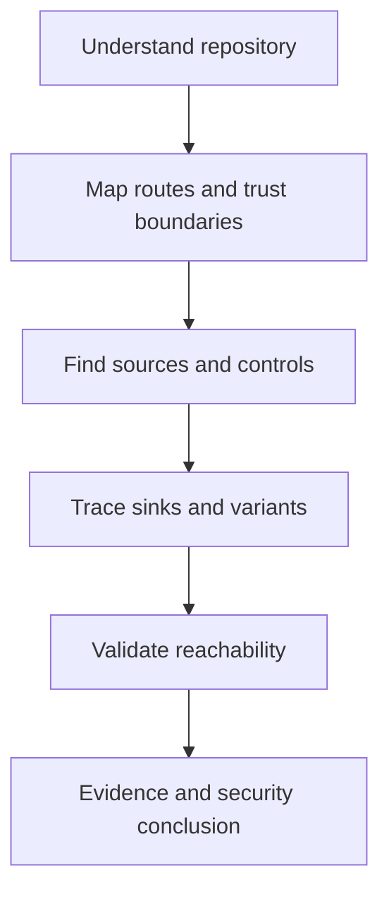

# Source Code Review

Source code review is the process of analysing application source code to understand how the application works, identify security-relevant data flows, locate trust boundaries, and determine whether attacker-controlled input can reach sensitive operations unsafely.

Unlike black-box testing, source review provides visibility into the application's internal implementation.

A reviewer can directly examine:

```text
Routes
Controllers
Endpoints
Middleware
Authentication
Authorisation
Input handling
Validation
Business logic
Database access
File operations
HTTP clients
Template rendering
Deserialisation
Cryptography
Secrets
Configuration
Dependencies
Security controls
Dangerous sinks
```

The objective is not simply to search for dangerous functions.

The core question is:

```text
Can attacker-controlled data
reach a security-sensitive operation
without an effective security control?
```

!!! warning "Authorised Security Testing"
    Perform source code review only against applications, repositories, source packages, or systems for which you have explicit authorisation. Source code may contain credentials, personal data, internal infrastructure information, cryptographic material, API keys, proprietary business logic, and other sensitive information. Handle reviewed material according to the engagement rules and applicable data-handling requirements.

---

## Start Here

<div class="grid cards" markdown>

-   :material-map-search-outline:{ .lg .middle } **Review Methodology**

    ---

    Follow a repeatable process from repository understanding and attack-surface mapping through validation, evidence, and reporting.

    [:octicons-arrow-right-24: Source Code Review Methodology](methodology.md)

-   :material-source-branch:{ .lg .middle } **Source-to-Sink Analysis**

    ---

    Trace attacker-controlled input through transformations, validation, authorisation, and sensitive operations.

    [:octicons-arrow-right-24: Source-to-Sink Analysis](source-to-sink-analysis.md)

-   :material-magnify-scan:{ .lg .middle } **Static Analysis**

    ---

    Use ripgrep, Semgrep, OpenGrep, and CodeQL to identify and prioritise review candidates.

    [:octicons-arrow-right-24: Static Analysis](static-analysis/index.md)

-   :material-security:{ .lg .middle } **Authentication and Authorisation**

    ---

    Map identity, roles, permissions, ownership checks, tenant boundaries, and protected operations.

    [:octicons-arrow-right-24: Authentication](../web/authentication.md)

-   :material-code-braces:{ .lg .middle } **Framework-Specific Review**

    ---

    Apply language and framework-specific review techniques for .NET, Java, PHP, Python, Django, Flask, Node.js, and client-side JavaScript.

    [:octicons-arrow-right-24: Technology-Specific Notes](#technology-specific-review)

-   :material-bug-check-outline:{ .lg .middle } **Validate Findings**

    ---

    Connect source findings to runtime behaviour and determine whether the identified path is reachable, exploitable, and security relevant.

    [:octicons-arrow-right-24: Review Workflow](#source-code-review-workflow)

</div>

---

# Core Review Model

The most useful source-review model is:

```text
ATTACK SURFACE
      |
      v
ENTRY POINT
      |
      v
SOURCE
      |
      v
DATA FLOW
      |
      v
SECURITY CONTROLS
      |
      v
SINK
      |
      v
EXPLOITABILITY
      |
      v
IMPACT
```

Or more simply:

```text
SOURCE
   |
   v
DATA FLOW
   |
   v
SECURITY CONTROLS
   |
   v
SINK
   |
   v
IMPACT
```

A dangerous function is only a review candidate.

```text
Dangerous Function Found
          !=
Confirmed Vulnerability
```

The complete data flow must be understood.

---

# Source Code Review vs Black-Box Testing

Black-box testing observes behaviour externally:

```text
Tester
  |
  v
Request
  |
  v
Application
  |
  v
Response
```

The tester must infer what happens internally.

Source review exposes the implementation:

```text
Request
   |
   v
Route
   |
   v
Middleware
   |
   v
Controller
   |
   v
Validation
   |
   v
Authorisation
   |
   v
Business Logic
   |
   v
Sensitive Operation
```

The strongest assessments often combine both perspectives.

```text
Source Review
     +
Dynamic Testing
     |
     v
Higher Confidence
```

---

# Review Perspectives

## Black-Box

No source code is available.

The tester relies primarily on:

```text
HTTP behaviour
Application interaction
Content discovery
Parameter discovery
Fuzzing
Runtime responses
```

## Grey-Box

Partial internal information is available.

Examples include:

```text
Selected source files
API documentation
Architecture diagrams
Test credentials
Configuration
Specific repositories
```

## White-Box

Extensive internal visibility is available.

Examples include:

```text
Full source code
Configuration
Dependency manifests
Database schemas
Build files
Deployment configuration
Architecture documentation
```

Source code review is most closely associated with grey-box and white-box assessments.

---

# Why Source Review Matters

Implementation visibility can reveal issues that are difficult to identify externally.

Examples include:

- missing authorisation checks;
- unsafe SQL construction;
- command execution paths;
- dangerous deserialisation;
- weak cryptography;
- hard-coded credentials;
- hidden endpoints;
- legacy functionality;
- unsafe file handling;
- SSRF sinks;
- mass assignment;
- inconsistent validation;
- framework misconfiguration;
- business logic flaws;
- race conditions.

Source review helps answer:

```text
Where does input enter?

Where does it go?

Which controls does it cross?

Which sensitive operation does it reach?

Can the path actually be triggered?

What can an attacker achieve?
```

---

# Understand the Repository First

Before looking for vulnerabilities, understand the application structure.

Identify:

```text
Languages
Frameworks
Routes
Controllers
Services
Models
Authentication
Authorisation
Templates
Database access
HTTP clients
File handling
Configuration
Dependencies
Tests
Deployment files
Background jobs
Integrations
```

Useful initial commands include:

```bash
pwd
```

```bash
tree -L 3 -I 'node_modules|vendor|venv|.venv|dist|build|target|bin|obj'
```

If `tree` is unavailable:

```bash
find . -maxdepth 3 -type f | sort
```

A repository should first become an architecture map.

---

# Attack Surface Mapping

Identify externally or indirectly reachable entry points such as:

```text
Web routes
REST APIs
GraphQL
gRPC
WebSockets
Authentication endpoints
Administrative functionality
File uploads
Imports
Exports
Webhooks
Callbacks
Message consumers
Background jobs
Scheduled tasks
Internal APIs
Debug endpoints
Management endpoints
Third-party integrations
```

Related note:

[Attack Surface Analysis](../web/attack-surface-analysis.md)

---

# Sources

A **source** is somewhere potentially untrusted data enters the application.

Examples include:

```text
Query parameters
Path parameters
Request bodies
JSON fields
XML fields
HTTP headers
Cookies
Uploaded files
WebSocket messages
GraphQL arguments
gRPC fields
Webhook payloads
Message queues
Third-party APIs
Stored user data
```

The important question is not:

```text
Is this called "userInput"?
```

It is:

```text
Can an attacker meaningfully influence it?
```

---

# Sinks

A **sink** is a security-sensitive operation.

Typical sink categories include:

| Sink | Potential Security Concern |
|---|---|
| SQL execution | SQL injection |
| NoSQL query | NoSQL injection |
| LDAP filter | LDAP injection |
| Process or shell execution | Command injection |
| Template evaluation | SSTI |
| HTML or DOM output | XSS |
| File read/write | Path traversal or file handling |
| HTTP client | SSRF |
| Redirect | Open redirect |
| Deserialiser | Insecure deserialisation |
| XML parser | XXE |
| Object binding | Mass assignment |
| Object lookup | IDOR / BOLA |
| Dynamic code evaluation | Code injection |

A sink identifies somewhere worth reviewing.

It does not establish exploitability.

---

# Source-to-Sink Analysis

The central question is:

```text
Can attacker-controlled data reach a dangerous sink?
```

Then determine what happens in between.

```text
Request Input
      |
      v
Controller
      |
      v
Transformation
      |
      v
Validation
      |
      v
Authorisation
      |
      v
Service
      |
      v
Sensitive Sink
```

For each path, establish:

- attacker controllability;
- transformations;
- normalisation;
- validation;
- sanitisation;
- encoding;
- authentication;
- authorisation;
- reachability;
- runtime configuration;
- exploitability;
- impact.

Detailed methodology:

[Source-to-Sink Analysis](source-to-sink-analysis.md)

---

# Forward and Backward Analysis

Two approaches are useful.

## Forward Analysis

Start from attacker-controlled input:

```text
Source
  |
  v
Where does it go?
```

This works well for high-value routes and application workflows.

## Backward Analysis

Start from a sensitive sink:

```text
Sensitive Sink
      ^
      |
Who can reach it?
```

For example:

```text
Process Execution
      ^
      |
Command Builder
      ^
      |
Service
      ^
      |
Controller
      ^
      |
HTTP Parameter
```

Large applications usually benefit from using both.

---

# Trust Boundaries

Do not assume trust based only on component names.

Modern applications commonly have multiple trust boundaries:

```text
Internet
   |
   v
Reverse Proxy
   |
   v
Application
   |
   v
Internal API
   |
   v
Database
```

or:

```text
External SaaS
     |
     v
Webhook
     |
     v
Application
```

Potentially untrusted data can also come from:

- databases;
- queues;
- uploaded documents;
- imports;
- email;
- third-party APIs;
- cached values.

This is especially important for second-order vulnerabilities.

---

# Security Control Mapping

Identify reusable security controls early.

Examples:

```text
Authentication middleware
Authorisation middleware
Permission helpers
CSRF controls
Input validators
Schema validators
Output encoders
HTML sanitisers
URL validators
File validators
SQL abstractions
Rate limiters
Cryptographic helpers
Logging wrappers
```

Then ask:

```text
Where is the control used?

Where is it missing?

Is it applied consistently?

Can another code path bypass it?
```

Inconsistency between similar endpoints is often particularly valuable.

Example:

```text
/api/v1/users/{id}
        |
        +--> Ownership check


/api/v2/users/{id}
        |
        +--> No ownership check
```

---

# Authentication Review

Map:

```text
Login
   |
   v
Identity Verification
   |
   v
Session / Token Creation
   |
   v
Authenticated Requests
   |
   v
Logout / Expiry
```

Review:

- credential validation;
- password storage;
- session creation;
- session rotation;
- logout;
- password reset;
- MFA;
- remember-me functionality;
- API keys;
- JWT;
- OAuth/OIDC;
- SAML.

Related notes:

[Authentication](../web/authentication.md)

[Password Reset](../web/password-reset.md)

[Multi-Factor Authentication](../web/mfa.md)

[Session Management](../web/session-management.md)

[JSON Web Tokens](../web/jwt.md)

[OAuth 2.0 and OpenID Connect](../web/oauth-oidc.md)

[SAML](../web/saml.md)

---

# Authorisation Review

Authentication asks:

```text
Who are you?
```

Authorisation asks:

```text
Are you allowed to perform this action?
```

Look for:

- roles;
- permissions;
- ownership checks;
- tenant boundaries;
- administrative functions;
- policy checks;
- middleware;
- annotations;
- decorators;
- query-level access controls.

A useful matrix is:

| Action | Anonymous | User | Manager | Admin |
|---|---:|---:|---:|---:|
| View own profile | No | Yes | Yes | Yes |
| View another profile | No | No | Team only | Yes |
| Edit user | No | No | No | Yes |
| Delete user | No | No | No | Yes |

Compare the expected model with the actual implementation.

Related notes:

[Authorisation](../web/authorisation.md)

[IDOR and BOLA](../web/idor-bola.md)

[Mass Assignment](../web/mass-assignment.md)

---

# Business Logic Review

Not every vulnerability has a recognisable dangerous sink.

Review:

```text
Workflow
State
Role transitions
Approval
Financial calculations
Quantity
Discounts
Inventory
Tenant boundaries
Account state
Race conditions
```

Ask:

```text
What assumptions does this workflow make?
```

Then:

```text
Can those assumptions be violated?
```

Related notes:

[Business Logic Vulnerabilities](../web/business-logic.md)

[Race Conditions](../web/race-conditions.md)

[Rate Limiting and Anti-Automation](../web/rate-limiting.md)

---

# Common Vulnerability Review Paths

## SQL Injection

```text
Input
  |
  v
Query Construction
  |
  v
Database Execution
```

Review:

- string concatenation;
- interpolation;
- raw SQL;
- dynamic query fragments;
- ORM escape hatches;
- parameterisation.

[SQL Injection](../web/sql-injection.md)

## Command Injection

```text
Input
  |
  v
Command Construction
  |
  v
Process Execution
```

Review:

- executable control;
- argument control;
- shell use;
- environment variables;
- working directory;
- safe process APIs.

[OS Command Injection](../web/command-injection.md)

## SSRF

```text
User Input
    |
    v
URL Construction
    |
    v
HTTP Client
```

Review:

- schemes;
- host restrictions;
- DNS resolution;
- redirects;
- network egress;
- destination validation.

[Server-Side Request Forgery](../web/ssrf.md)

## Path Traversal and File Handling

```text
User Input
    |
    v
Path Construction
    |
    v
Filesystem
```

Review:

- path joining;
- canonicalisation;
- filename mapping;
- base-directory enforcement;
- archive handling;
- upload processing.

[Path Traversal](../web/path-traversal.md)

[File Inclusion](../web/file-inclusion.md)

[File Upload](../web/file-upload.md)

## Template Injection

Determine whether input is treated as:

```text
Template Data
```

or:

```text
Template Source
```

[Server-Side Template Injection](../web/ssti.md)

## Deserialisation

Review:

```text
Input
  |
  v
Deserializer
  |
  v
Object Construction
```

Determine:

- attacker control;
- allowed types;
- parser configuration;
- integrity protection;
- dangerous callbacks or object behaviour.

[Insecure Deserialization](../web/deserialization.md)

## XSS and DOM Security

Trace input to its exact output context:

```text
HTML
Attribute
JavaScript
URL
CSS
DOM
```

[Cross-Site Scripting](../web/xss.md)

[DOM-Based Vulnerabilities](../web/dom-based-vulnerabilities.md)

[HTML Injection](../web/html-injection.md)

---

# Configuration and Secrets

Source review should include:

```text
.env
Application configuration
CI/CD
Container files
Kubernetes
Terraform
Helm
Cloud configuration
Build files
Test configuration
Git history
```

Search for:

- passwords;
- API keys;
- tokens;
- private keys;
- signing keys;
- database credentials;
- cloud credentials;
- encryption keys.

A matching string is only a candidate.

Determine whether it is:

```text
Placeholder
Example
Test value
Expired secret
Production secret
Environment reference
Currently usable credential
```

Related notes:

[Secrets Exposure](../web/secrets-exposure.md)

[Dependency Security](../web/dependency-security.md)

---

# Git History

The current tree is only one point in time.

Useful commands include:

```bash
git log --oneline --all
```

Search for historical changes to a value:

```bash
git log -S 'password' --all -p
```

Search commit patches using a pattern:

```bash
git log -G 'secret|token|api[_-]?key' --all -p
```

Security-related commits can also reveal useful variant-analysis opportunities.

```bash
git log --all --oneline --grep='security'
```

A previous security fix may identify similar code that was not corrected elsewhere.

---

# Variant Analysis

Variant analysis means:

```text
Find Vulnerability
      |
      v
Understand Root Cause
      |
      v
Identify Pattern
      |
      v
Search Entire Codebase
      |
      v
Find Variants
```

Examples:

```text
Missing ownership check
        |
        v
Review all object lookup paths
```

```text
Unsafe raw SQL
        |
        v
Search all raw-query usage
```

```text
Weak URL validation
        |
        v
Review every HTTP client call
```

Variant analysis is one of the highest-value activities in source review.

---

# Static Analysis

Static-analysis tooling helps identify candidates at scale.

Useful tools include:

```text
ripgrep
Semgrep
OpenGrep
CodeQL
IDE references
Language-specific analysers
```

The correct model is:

```text
Static Analysis
      |
      v
Candidate
      |
      v
Manual Review
      |
      v
Reachability
      |
      v
Security Controls
      |
      v
Dynamic Validation
```

Detailed notes:

[Static Analysis](static-analysis/index.md)

[ripgrep](static-analysis/ripgrep.md)

[Semgrep](static-analysis/semgrep.md)

[OpenGrep](static-analysis/opengrep.md)

[CodeQL](static-analysis/codeql.md)

---

# Static Analysis Is Not the Finding

For example:

```text
Semgrep identifies exec()
        |
        v
Candidate
```

You still need to establish:

```text
Is it reachable?

Can the attacker influence it?

What validation exists?

Is a shell involved?

What execution context is used?

What security impact follows?
```

Similarly:

```text
CodeQL data-flow result
        !=
Confirmed exploitable vulnerability
```

Tools accelerate review.

They do not replace security reasoning.

---

# Tool-Assisted Review

The Tools section provides practical guidance on choosing and using source-review tooling:

[Source Code Review Tools](../tools/source-code-review/index.md)

A useful workflow is:

```text
Repository
    |
    +--> ripgrep
    |
    +--> Semgrep
    |
    +--> OpenGrep
    |
    +--> CodeQL
    |
    v
Candidate Paths
    |
    v
Manual Analysis
```

---

# IDE-Assisted Review

IDE features can significantly improve tracing.

Useful capabilities include:

```text
Go to Definition
Find References
Find Implementations
Call Hierarchy
Type Hierarchy
Symbol Search
Git Integration
```

For example:

```text
Dangerous Sink
      |
      v
Find References
      |
      v
Identify Callers
      |
      v
Trace Back to Entry Point
```

This is especially useful in large, strongly typed codebases.

---

# Reachability

Code can be insecure without being reachable in the assessed deployment.

Examples:

```text
Legacy Function
      |
      v
No Callers
```

```text
Debug Route
      |
      v
Development Build Only
```

Review:

- feature flags;
- build flags;
- runtime configuration;
- reverse proxies;
- routing;
- deployment environment;
- authentication;
- network exposure.

Reachability directly affects the significance of a source finding.

---

# Deployment Context

Source alone may not tell you what is enabled.

Consider:

```text
Environment Variables
Feature Flags
Configuration
Build Profiles
Containers
Reverse Proxies
API Gateways
Cloud Configuration
Runtime Versions
```

The assessed application is:

```text
Source Code
     +
Configuration
     +
Runtime Environment
```

not source code alone.

---

# Technology-Specific Review

Different frameworks implement routing, data binding, authentication, authorisation, templating, persistence, and validation differently.

<div class="grid cards" markdown>

-   :material-microsoft-visual-studio-code:{ .lg .middle } **.NET / ASP.NET Core**

    ---

    Controllers, Minimal APIs, middleware, ASP.NET Core Identity, Entity Framework, Dapper, HttpClient, Razor, configuration and process execution.

    [:octicons-arrow-right-24: .NET Review](dotnet.md)

-   :material-language-java:{ .lg .middle } **Java / Spring**

    ---

    Spring MVC, Spring Security, JDBC, JPA, Hibernate, XML parsers, templates, ProcessBuilder and HTTP clients.

    [:octicons-arrow-right-24: Java Review](java.md)

-   :material-language-php:{ .lg .middle } **PHP**

    ---

    Superglobals, PDO, MySQLi, file operations, include paths, command execution, sessions, templates and deserialisation.

    [:octicons-arrow-right-24: PHP Review](php.md)

-   :material-language-python:{ .lg .middle } **Python**

    ---

    subprocess, os.system, pickle, YAML, HTTP clients, filesystem APIs, eval/exec, cryptography and dependencies.

    [:octicons-arrow-right-24: Python Review](python.md)

-   :material-language-python:{ .lg .middle } **Django**

    ---

    URLs, views, middleware, permissions, ORM, RawSQL, templates, CSRF, file handling and application settings.

    [:octicons-arrow-right-24: Django Review](django.md)

-   :material-flask-outline:{ .lg .middle } **Flask**

    ---

    Routes, Blueprints, request data, sessions, Jinja, SQLAlchemy, redirects, files, configuration and extensions.

    [:octicons-arrow-right-24: Flask Review](flask.md)

-   :material-nodejs:{ .lg .middle } **Node.js / Express**

    ---

    Routes, middleware, request data, authentication, database operations, child processes, files, HTTP clients and prototype pollution.

    [:octicons-arrow-right-24: Node.js Review](nodejs.md)

-   :material-language-javascript:{ .lg .middle } **Client-Side JavaScript**

    ---

    DOM sources and sinks, postMessage, browser storage, dynamic HTML, script loading and client-side routing.

    [:octicons-arrow-right-24: JavaScript Review](javascript.md)

</div>

---

# Source Code Review Workflow

A practical review can be structured as:

```text
1. Understand Repository

2. Identify Languages and Frameworks

3. Identify Build and Dependency Files

4. Identify Configuration

5. Map Routes and Entry Points

6. Map Authentication

7. Map Authorisation

8. Identify User-Controlled Sources

9. Identify Security Controls

10. Identify Sensitive Sinks

11. Trace Source-to-Sink Paths

12. Review Business Logic

13. Review Secrets and Configuration

14. Review Dependencies

15. Review Git History

16. Perform Static Analysis

17. Perform Variant Analysis

18. Validate Candidates Dynamically

19. Determine Supported Impact

20. Document Evidence
```

Detailed methodology:

[Source Code Review Methodology](methodology.md)

---

# Dynamic Validation

Where authorised, source-review findings should be connected to runtime behaviour.

```text
Source Candidate
      |
      v
Identify Reachable Endpoint
      |
      v
Create Controlled Test
      |
      v
Observe Runtime Behaviour
      |
      v
Compare With Source
      |
      v
Determine Impact
```

Source and dynamic testing strengthen each other:

```text
Source Review
     +
Runtime Evidence
     |
     v
Higher Confidence
```

---

# Evidence Collection

For each candidate, record:

```text
File
Line
Class
Function
Route
Source
Data Flow
Security Control
Sink
Reachability
Authentication
Authorisation
Runtime Context
Validation Performed
Observed Impact
```

Example:

```text
Route:
POST /api/report

Source:
request JSON property "url"

Handler:
ReportController.create()

Data Flow:
url -> ReportService.generate() -> fetchRemoteDocument()

Sink:
HTTP client

Validation:
Scheme validation only

Authentication:
Required

Dynamic Validation:
Controlled callback observed

Security Concern:
Server-side request to attacker-controlled destination
```

---

# Evidence Before Conclusions

Use a clear confidence model.

| State | Meaning |
|---|---|
| Observation | Something potentially interesting was found |
| Candidate | A plausible security path exists |
| Reachable | The affected code executes in the assessed context |
| Validated | Runtime behaviour reproduces the condition |
| Confirmed | Evidence supports the security condition and impact |

Example:

```text
HTTP Client Found
      |
      v
User Input Reaches URL
      |
      v
Candidate SSRF
      |
      v
Route Confirmed Reachable
      |
      v
Controlled Callback
      |
      v
Validated Server-Side Request
      |
      v
Impact Assessment
```

---

# Finding Classification

A useful decision model is:

```text
Candidate
   |
   v
Reachable?
   |
   +-- No --> Not applicable to current deployment
   |
   v
Attacker Controlled?
   |
   +-- No --> Review context
   |
   v
Effective Security Control?
   |
   +-- Yes --> Not vulnerable
   |
   v
Exploitable?
   |
   +-- No --> Defence-in-depth / low significance
   |
   v
Supported Security Impact?
   |
   +-- No --> Reassess significance
   |
   v
Confirmed Finding
```

---

# Reporting Source Findings

Do not report:

```text
Semgrep found exec().
```

Report the actual security condition:

```text
Attacker-controlled input reaches process execution without safe
argument handling, allowing command injection in the affected request
path.
```

A strong finding explains:

```text
Root Cause
Reachability
Source
Data Flow
Missing / Ineffective Control
Sink
Exploitability
Impact
Evidence
Remediation
```

---

# Finding Template

```text
Title:
[Specific security condition]

Affected Component:
[Route / class / function]

Source:
[Attacker-controlled input]

Data Flow:
[Source -> transformations -> sink]

Security Control:
[Missing / ineffective / bypassable control]

Sink:
[Security-sensitive operation]

Reachability:
[How the path is exposed]

Impact:
[What an attacker can actually achieve]

Evidence:
[Relevant source and controlled runtime evidence]

Recommendation:
[Root-cause remediation]
```

---

# Quick Review Questions

For important endpoints ask:

```text
Where is the route defined?

Which HTTP methods are supported?

Is authentication required?

How is authentication enforced?

What role or permission is required?

How is authorisation enforced?

Which objects can the user reference?

Are ownership checks performed?

Which inputs are attacker-controlled?

Where do they flow?

How are they validated?

Do they reach SQL?

Do they reach process execution?

Do they reach LDAP?

Do they reach a template engine?

Do they reach the filesystem?

Do they reach an HTTP client?

Do they reach HTML or DOM APIs?

Do they reach a redirect?

Do they reach a deserialiser?

Can sensitive properties be bound automatically?

Can workflows be reordered?

Can requests race?

Are secrets involved?

Are sensitive values logged?

Does a similar route use stronger controls?
```

---

# Review Checklist

## Repository

```text
[ ] Repository structure understood
[ ] Languages identified
[ ] Frameworks identified
[ ] Build files identified
[ ] Dependency files identified
[ ] Configuration identified
[ ] Deployment context understood
```

## Attack Surface

```text
[ ] Routes mapped
[ ] APIs mapped
[ ] GraphQL reviewed where present
[ ] gRPC reviewed where present
[ ] WebSockets reviewed where present
[ ] File uploads identified
[ ] Webhooks identified
[ ] Background jobs identified
[ ] Administrative functionality identified
```

## Identity and Access

```text
[ ] Authentication mapped
[ ] Sessions reviewed
[ ] Roles identified
[ ] Permissions mapped
[ ] Object ownership checked
[ ] Tenant boundaries reviewed
[ ] Privileged functionality reviewed
```

## Data Flow

```text
[ ] User-controlled sources identified
[ ] Security-sensitive sinks identified
[ ] Transformations understood
[ ] Validation reviewed
[ ] Sanitisation reviewed
[ ] Encoding reviewed
[ ] Reachability established
```

## Vulnerability Classes

```text
[ ] SQL / NoSQL / LDAP injection reviewed
[ ] Command execution reviewed
[ ] SSRF reviewed
[ ] Path traversal reviewed
[ ] File upload reviewed
[ ] SSTI reviewed
[ ] Deserialisation reviewed
[ ] XML parsing reviewed
[ ] XSS / DOM handling reviewed
[ ] Redirects reviewed
[ ] Mass assignment reviewed
[ ] IDOR / BOLA reviewed
```

## Application Logic

```text
[ ] Business logic reviewed
[ ] State transitions reviewed
[ ] Race conditions considered
[ ] Rate limiting reviewed
[ ] Error handling reviewed
[ ] Fail-open conditions considered
```

## Security Engineering

```text
[ ] Secrets searched
[ ] Dependencies reviewed
[ ] Cryptography reviewed
[ ] Randomness reviewed
[ ] Logging reviewed
[ ] Security headers/configuration reviewed where relevant
[ ] Git history reviewed
```

## Analysis

```text
[ ] Static analysis used where useful
[ ] Static-analysis results manually reviewed
[ ] Variant analysis performed
[ ] Candidate findings validated dynamically where permitted
[ ] Findings based on supported impact
```

---

# Related Web Security Notes

Source review and web application testing should reinforce each other.

[Web Application Security](../web/index.md)

[Authentication](../web/authentication.md)

[Authorisation](../web/authorisation.md)

[Session Management](../web/session-management.md)

[IDOR and BOLA](../web/idor-bola.md)

[SQL Injection](../web/sql-injection.md)

[NoSQL Injection](../web/nosql-injection.md)

[LDAP Injection](../web/ldap-injection.md)

[OS Command Injection](../web/command-injection.md)

[Server-Side Template Injection](../web/ssti.md)

[Server-Side Request Forgery](../web/ssrf.md)

[Path Traversal](../web/path-traversal.md)

[File Upload](../web/file-upload.md)

[Insecure Deserialization](../web/deserialization.md)

[Cross-Site Scripting](../web/xss.md)

[Mass Assignment](../web/mass-assignment.md)

[Business Logic Vulnerabilities](../web/business-logic.md)

---

# Source Code Review Tools

The main practical tooling layer is available here:

[Source Code Review Tools](../tools/source-code-review/index.md)

Detailed static-analysis pages:

[ripgrep](static-analysis/ripgrep.md)

[Semgrep](static-analysis/semgrep.md)

[OpenGrep](static-analysis/opengrep.md)

[CodeQL](static-analysis/codeql.md)

---

# References

## OWASP

[OWASP Code Review Guide](https://owasp.org/www-project-code-review-guide/){ target="_blank" rel="noopener noreferrer" }

[OWASP Application Security Verification Standard](https://owasp.org/www-project-application-security-verification-standard/){ target="_blank" rel="noopener noreferrer" }

[OWASP Web Security Testing Guide](https://owasp.org/www-project-web-security-testing-guide/){ target="_blank" rel="noopener noreferrer" }

[OWASP Cheat Sheet Series](https://cheatsheetseries.owasp.org/){ target="_blank" rel="noopener noreferrer" }

## Static Analysis

[Semgrep Documentation](https://semgrep.dev/docs/){ target="_blank" rel="noopener noreferrer" }

[CodeQL Documentation](https://codeql.github.com/docs/){ target="_blank" rel="noopener noreferrer" }

[ripgrep](https://github.com/BurntSushi/ripgrep){ target="_blank" rel="noopener noreferrer" }

## Weakness Classification

[MITRE CWE](https://cwe.mitre.org/){ target="_blank" rel="noopener noreferrer" }

---



# Final Source Code Review Model

The complete methodology can be reduced to five questions:

```text
1. WHERE CAN ATTACKER-CONTROLLED DATA ENTER?

                     |
                     v

                   SOURCE

                     |
                     v

2. WHERE DOES THE DATA GO?

                  DATA FLOW

                     |
                     v

3. WHICH SECURITY CONTROLS DOES IT CROSS?

                 VALIDATION
                SANITISATION
                  ENCODING
              AUTHENTICATION
               AUTHORISATION

                     |
                     v

4. WHICH SECURITY-SENSITIVE OPERATION DOES IT REACH?

                    SINK

                     |
                     v

5. WHAT CAN THE ATTACKER ACTUALLY ACHIEVE?

                   IMPACT
```

The key principle is:

```text
Search results identify code.

Static analysis identifies candidates.

Data-flow analysis explains the path.

Security-control analysis determines whether the path is protected.

Reachability determines whether it matters in the assessed deployment.

Dynamic validation demonstrates behaviour.

Impact determines whether the condition is a reportable vulnerability.
```
