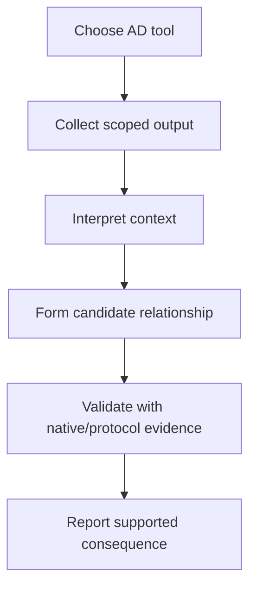

# Active Directory Tools

Active Directory assessments usually require several tools because no single utility provides complete coverage of:

- domain enumeration;
- LDAP analysis;
- authentication testing;
- SMB access;
- Kerberos behaviour;
- certificate services;
- delegation;
- trusts;
- privilege relationships;
- attack path analysis;
- credential exposure;
- lateral movement opportunities;
- configuration validation.

A strong Active Directory workflow combines specialised tools with manual validation.

```text
Domain Context
     |
     v
Enumeration
     |
     +-- LDAP
     +-- SMB
     +-- Kerberos
     +-- DNS
     |
     v
Relationship Mapping
     |
     +-- BloodHound
     |
     v
Focused Analysis
     |
     +-- NetExec
     +-- Impacket
     +-- Certipy
     +-- Rubeus
     +-- PowerView
     |
     v
Manual Validation
     |
     v
Evidence
     |
     v
Defensible Conclusion
```

!!! warning "Authorised testing only"
    Use Active Directory tooling only within an explicitly authorised environment. Many tools can perform authentication, LDAP queries, SMB interaction, Kerberos requests, or certificate operations that may generate substantial domain-controller and endpoint telemetry. Confirm the rules of engagement before using intrusive modules or actions.

---

# Where Active Directory Tools Fit

A typical Active Directory assessment may progress through:

```text
Initial Domain Context
      |
      v
Identify User / Host / Domain
      |
      v
Basic Enumeration
      |
      v
LDAP / SMB / Kerberos Discovery
      |
      v
Privilege and Trust Mapping
      |
      v
Focused Technique Validation
      |
      v
Manual Confirmation
      |
      v
Evidence
```

Related notes:

[Active Directory](../../active-directory/index.md)

[Privilege Escalation Explorer](../../privesc/index.md)

[Red Teaming](../../red-teaming/index.md)

---

# Core Active Directory Tooling

A practical toolkit commonly includes:

| Tool | Primary Use |
|---|---|
| NetExec | SMB, LDAP, WinRM and domain-oriented enumeration/validation |
| Impacket | Python implementations of Windows network protocols and AD utilities |
| BloodHound | Relationship and attack-path analysis |
| Certipy | Active Directory Certificate Services assessment |
| Rubeus | Kerberos-focused Windows tooling |
| PowerView | PowerShell Active Directory enumeration |
| ldapsearch | Direct LDAP querying |
| klist | Kerberos ticket inspection |
| setspn | SPN inspection from Windows |
| nltest | Domain and trust-related validation |
| native PowerShell / Windows tools | Manual confirmation |

Each tool should answer a specific security question.

---

# Tool Output Is Not a Finding

Keep this principle central:

```text
Tool Output
    !=
Vulnerability
```

Examples:

```text
BloodHound shows path
    !=
Path is exploitable

NetExec reports access
    !=
Privilege escalation confirmed

Certipy reports template issue
    !=
Certificate abuse confirmed

Rubeus lists tickets
    !=
Kerberos weakness confirmed

Impacket command succeeds
    !=
Underlying security cause documented
```

The tool identifies behaviour.

The assessment must explain why that behaviour matters.

---

# Start with Domain Context

Before running large-scale tooling, establish the current context.

Useful Windows commands include:

```powershell
whoami
```

```powershell
whoami /groups
```

```powershell
hostname
```

```powershell
$env:USERDOMAIN
```

```powershell
$env:LOGONSERVER
```

Also useful:

```powershell
nltest /dsgetdc:example.test
```

where the domain is known and the command is available.

This helps answer:

```text
Which user am I?

Which domain am I in?

Which domain controller am I using?

Which groups apply?

Am I domain joined?
```

---

# DNS Matters

Active Directory depends heavily on DNS.

Many tooling failures are actually DNS or domain-resolution problems.

Useful checks include:

```powershell
Resolve-DnsName example.test
```

On Linux:

```bash
dig example.test
```

and:

```bash
nslookup example.test
```

Before troubleshooting Kerberos or LDAP tooling, confirm that the domain and domain controllers resolve correctly.

---

# Time Synchronisation Matters

Kerberos depends on acceptable clock synchronisation between systems.

If Kerberos authentication fails unexpectedly, check:

```text
Client time
Domain controller time
Timezone
Clock skew
```

On Windows:

```powershell
w32tm /query /status
```

On Linux:

```bash
timedatectl
```

Time problems can look like authentication problems.

---

# NetExec

NetExec is a network service enumeration and validation framework frequently used during Active Directory assessments.

It supports multiple protocols and can help inspect environments using services such as:

- SMB;
- LDAP;
- WinRM;
- MSSQL;
- SSH;
- other supported protocols depending on version.

It is particularly useful for rapidly determining:

- reachable hosts;
- authentication success;
- administrative access;
- SMB signing state;
- operating system information;
- domain information;
- share access;
- protocol-specific security configuration.

Official project:

[NetExec - GitHub](https://github.com/Pennyw0rth/NetExec){ target="_blank" rel="noopener noreferrer" }

Official documentation:

[NetExec Documentation](https://www.netexec.wiki/){ target="_blank" rel="noopener noreferrer" }

---

# NetExec Mental Model

```text
Credentials / Session Context
        |
        v
NetExec
        |
        +-- SMB
        +-- LDAP
        +-- WinRM
        +-- MSSQL
        |
        v
Host / Domain Observations
```

NetExec is particularly strong for breadth.

Manual validation is still needed for depth.

---

# NetExec and SMB

SMB can provide valuable Active Directory context.

Typical security questions include:

```text
Is SMB reachable?

Is signing enabled?

Which domain does the host belong to?

Is authentication accepted?

Which shares are visible?

Does the user have administrative access?
```

Use read-only enumeration first where practical.

---

# NetExec Authentication Results

Authentication success should be interpreted carefully.

For example:

```text
Credential accepted
```

may mean:

```text
Valid domain credential
```

but does not automatically mean:

```text
Local administrator
```

or:

```text
Domain administrator
```

Separate:

```text
Authentication
```

from:

```text
Authorisation
```

---

# Administrative Access

Some tooling may indicate administrative access to a Windows host.

That observation should be validated and documented accurately.

A useful distinction is:

```text
Credential works
      |
      v
Normal authenticated access
```

versus:

```text
Credential works
      |
      v
Administrative remote access
```

These have very different security implications.

---

# SMB Signing

SMB signing configuration is an important domain security property.

Do not report a signing observation without understanding:

- whether signing is required;
- which system is affected;
- server/client role;
- network trust model;
- actual risk in the environment.

The configuration is the finding, not the NetExec result.

---

# SMB Shares

Share enumeration can identify:

- departmental shares;
- deployment shares;
- administrative shares;
- application storage;
- backups;
- software distribution.

A visible share is not automatically a vulnerability.

The security question is:

```text
Can the tested user access data or functionality beyond what should be permitted?
```

---

# LDAP with NetExec

LDAP modules can assist with domain-level enumeration.

Potential areas include:

- users;
- groups;
- computers;
- domain policy;
- delegation-related information;
- certificate services information;
- service accounts.

LDAP provides directory data.

Interpretation still requires Active Directory knowledge.

---

# NetExec Modules

NetExec includes modules and protocol-specific capabilities.

Before using one:

1. review what it does;
2. determine whether it is read-only;
3. assess expected traffic;
4. confirm it is permitted;
5. understand its output.

Do not automatically run all modules against every system.

---

# Impacket

Impacket is a collection of Python classes and example tools for working with network protocols commonly used in Windows and Active Directory environments.

Supported protocol areas include technologies such as:

- SMB;
- MSRPC;
- LDAP-related workflows;
- Kerberos;
- NTLM;
- WMI;
- DCOM.

Official project:

[Impacket - GitHub](https://github.com/fortra/impacket){ target="_blank" rel="noopener noreferrer" }

Documentation:

[Fortra Impacket](https://www.fortra.com/resources/open-source/impacket){ target="_blank" rel="noopener noreferrer" }

---

# Impacket Is a Toolkit, Not One Tool

A better mental model is:

```text
Impacket
   |
   +-- protocol libraries
   |
   +-- example utilities
   |
   +-- Kerberos tooling
   |
   +-- SMB tooling
   |
   +-- RPC tooling
```

Different utilities answer different questions.

---

# Common Impacket Utility Categories

Useful categories include:

```text
Kerberos service enumeration
SMB interaction
Remote management validation
Directory-related operations
Credential and ticket analysis
```

Exact script names and options can change across releases.

Always check:

```bash
impacket-<tool> -h
```

or the specific installed utility's help before use.

---

# Verify the Installed Impacket Version

On Kali or Python environments:

```bash
python3 -m pip show impacket
```

or:

```bash
pip show impacket
```

Package naming and command wrappers may differ by distribution.

Use the installed environment's help rather than relying on old blog syntax.

---

# Impacket and Kerberos

Impacket contains utilities useful for inspecting Kerberos-related Active Directory behaviour.

This can support analysis of:

- service accounts;
- SPNs;
- ticket requests;
- authentication;
- delegation-related behaviour.

Kerberos tooling should be used according to the specific technique being validated.

---

# BloodHound

BloodHound models relationships within Active Directory and other supported identity environments.

Its major strength is showing how individual permissions and relationships combine into potential attack paths.

Conceptually:

```text
Users
Computers
Groups
ACLs
Sessions
Delegation
Other Relationships
      |
      v
BloodHound Graph
      |
      v
Potential Paths
```

Official resources:

[BloodHound](https://bloodhound.specterops.io/){ target="_blank" rel="noopener noreferrer" }

[BloodHound Documentation](https://bloodhound.specterops.io/get-started/introduction){ target="_blank" rel="noopener noreferrer" }

---

# BloodHound Is Relationship Analysis

Traditional enumeration may show:

```text
User A belongs to Group B
```

BloodHound can help reveal:

```text
User A
  |
  v
Group B
  |
  v
Controls Computer C
  |
  v
Session of User D
  |
  v
Sensitive privilege
```

This graph-oriented approach can expose relationships that are difficult to recognise from isolated LDAP queries.

---

# BloodHound Data Collection

BloodHound requires data collection before graph analysis.

Collection mechanisms vary by BloodHound version and environment.

Because data collectors evolve, always use the collector recommended by the current official BloodHound documentation.

Do not rely on historical collector assumptions.

---

# BloodHound Collection Scope

Collection can generate substantial domain queries.

Before running broad collection:

- confirm authorised domains;
- confirm network scope;
- review collection methods;
- understand session collection implications;
- consider production sensitivity.

Use only the collection methods required for the objective.

---

# BloodHound Edges

Edges represent relationships.

Examples may include relationships associated with:

- group membership;
- local administration;
- object control;
- sessions;
- delegation;
- directory permissions.

A graph edge should be understood before it is used as evidence.

---

# Attack Paths

BloodHound may show a path to a high-value object.

Example concept:

```text
User
 |
 v
Group
 |
 v
Computer
 |
 v
Privileged Session
```

A path is a hypothesis about connected permissions and relationships.

Validate critical edges manually.

---

# Why Manual BloodHound Validation Matters

A path can be affected by:

- stale sessions;
- changed group membership;
- inaccessible hosts;
- security controls;
- disabled accounts;
- outdated collected data;
- operational constraints.

Therefore:

```text
BloodHound Path
      |
      v
Validate Important Edges
      |
      v
Confirm Current Reality
```

---

# BloodHound and ACLs

Directory ACL relationships can be particularly valuable.

Examples include the ability to:

- modify membership;
- change object attributes;
- control another principal;
- affect computer or group objects.

The exact security implication depends on the permission and object.

Do not use generic language such as:

```text
User owns AD
```

when the actual permission is narrow.

---

# Certipy

Certipy is a tool used for Active Directory Certificate Services assessment.

It can assist with discovering and analysing:

- enterprise certificate authorities;
- certificate templates;
- enrollment configuration;
- certificate-related permissions;
- certificate authentication relationships;
- known AD CS misconfiguration patterns.

Official project:

[Certipy - GitHub](https://github.com/ly4k/Certipy){ target="_blank" rel="noopener noreferrer" }

---

# AD CS Requires Separate Analysis

Certificate Services introduces a separate trust layer into Active Directory.

```text
Active Directory
      |
      +-- Users
      +-- Groups
      +-- Computers
      |
      v
Certificate Services
      |
      +-- CA
      +-- Templates
      +-- Enrollment
      +-- Certificate Authentication
```

This can create privilege paths that are not obvious from traditional group membership.

Related section:

[Active Directory Certificate Services](../../active-directory/ad-cs/index.md)

---

# Certipy Discovery

A useful assessment sequence is:

```text
Discover CA
    |
    v
Enumerate Templates
    |
    v
Review Enrollment Permissions
    |
    v
Review Template Configuration
    |
    v
Identify Candidate Misconfiguration
    |
    v
Manual Validation
```

Do not treat a tool-assigned ESC label as sufficient evidence by itself.

---

# Certipy Findings

If Certipy reports a potentially vulnerable certificate template, determine:

```text
Who can enroll?

Which subject information can be controlled?

Which EKUs apply?

Is manager approval required?

Are authorised signatures required?

Which CA publishes the template?

What identity could the certificate represent?
```

The configuration explains the risk.

---

# ESC Labels

AD CS research commonly uses labels such as:

```text
ESC1
ESC2
ESC3
...
```

These are useful shorthand.

Reports should still explain the actual configuration rather than relying only on an ESC number.

For example:

```text
The certificate template allowed members of Domain Users to enroll and
supply subject information while permitting client authentication.
```

is more meaningful than:

```text
ESC1 found.
```

---

# Rubeus

Rubeus is a Windows-focused Kerberos interaction toolkit.

It is commonly used in Active Directory research and authorised assessments for Kerberos-related analysis.

Official project:

[Rubeus - GitHub](https://github.com/GhostPack/Rubeus){ target="_blank" rel="noopener noreferrer" }

---

# Rubeus Focus

Rubeus is primarily associated with:

- Kerberos tickets;
- ticket requests;
- ticket inspection;
- Kerberos authentication workflows;
- service tickets;
- delegation-related analysis.

Because it interacts directly with Kerberos, use it only when the specific workflow is understood and authorised.

---

# Native Kerberos Inspection

Before relying on specialised tooling, native Windows commands can provide useful context.

List cached tickets:

```powershell
klist
```

Purge should not be performed casually because it changes authentication state.

For assessment evidence, ticket listing is often sufficient for context.

---

# SPNs

Service Principal Names are important in Kerberos.

Native inspection may use:

```powershell
setspn.exe
```

where appropriate.

SPNs associate service identities with Kerberos service names.

Service-account security depends on more than merely having an SPN.

---

# Kerberos Service Accounts

A service account with an SPN may be relevant to Kerberos service ticket analysis.

Before concluding risk, consider:

- password strength;
- managed service accounts;
- encryption types;
- account privilege;
- monitoring;
- actual attack feasibility.

---

# PowerView

PowerView is a PowerShell-based Active Directory enumeration toolkit associated with PowerSploit.

It can help query information such as:

- users;
- groups;
- computers;
- domain relationships;
- sessions;
- ACLs;
- trusts;
- delegation;
- group membership.

Historical project:

[PowerSploit - Recon](https://github.com/PowerShellMafia/PowerSploit/tree/master/Recon){ target="_blank" rel="noopener noreferrer" }

---

# PowerView in Modern Environments

PowerView remains useful as a reference and in some test environments.

However, modern Windows environments may constrain its execution through:

- AppLocker;
- WDAC;
- Constrained Language Mode;
- Defender;
- EDR.

If PowerView cannot run, equivalent information can often be obtained through:

- native PowerShell;
- LDAP queries;
- BloodHound collection;
- NetExec;
- other directory tooling.

---

# ldapsearch

`ldapsearch` is useful for direct LDAP queries from Linux.

It is particularly valuable because it exposes the directory query model directly instead of abstracting everything behind a specialised framework.

Check help:

```bash
ldapsearch -H
```

or:

```bash
man ldapsearch
```

depending on the installed environment.

---

# Why Direct LDAP Matters

Specialised tools can hide how directory data is organised.

Direct LDAP queries help understand:

```text
Distinguished Names
Object Classes
Attributes
Search Bases
Filters
```

This knowledge makes output from BloodHound, NetExec, PowerView, and other tools easier to interpret.

---

# LDAP Search Base

An Active Directory domain such as:

```text
example.test
```

typically maps conceptually to:

```text
DC=example,DC=test
```

This becomes the LDAP search base for many directory queries.

---

# LDAP Attributes

Commonly useful categories include attributes related to:

- account names;
- groups;
- userAccountControl;
- SPNs;
- distinguished names;
- delegation;
- object identifiers;
- timestamps.

Do not collect excessive directory data without a reason.

---

# Native Windows AD Tools

Native tools provide valuable manual confirmation.

Examples include:

```text
whoami
net
nltest
setspn
klist
dsquery where installed
PowerShell AD cmdlets where available
```

These tools can validate specialised-tool output.

---

# ActiveDirectory PowerShell Module

Where available, the Microsoft ActiveDirectory module provides structured domain querying.

Example command discovery:

```powershell
Get-Command -Module ActiveDirectory
```

Potential cmdlets include those for:

- users;
- groups;
- computers;
- domain information.

Availability depends on the system and installed administration tools.

---

# Domain Users

Native examples may include:

```powershell
net user /domain
```

This can provide a quick domain-user view.

Large domains may produce substantial output.

Use more targeted LDAP or PowerShell queries when appropriate.

---

# Domain Groups

Example:

```powershell
net group /domain
```

For a specific group:

```powershell
net group "Domain Admins" /domain
```

Use exact group names from the environment.

---

# Domain Controllers

Useful native checks include:

```powershell
nltest /dclist:example.test
```

and:

```powershell
nltest /dsgetdc:example.test
```

where appropriate.

Domain-controller discovery is foundational for LDAP and Kerberos workflows.

---

# Trusts

Trust relationships can extend authentication and authorisation across domains or forests.

Use tools to identify trusts, but interpret:

- direction;
- transitivity;
- trust type;
- authentication scope;
- SID filtering;
- actual accessible resources.

A trust existing is not itself a vulnerability.

---

# Delegation

Delegation is an important Kerberos and Active Directory configuration area.

Potential categories include:

- unconstrained delegation;
- constrained delegation;
- resource-based constrained delegation.

Tool output should identify the configuration.

Manual analysis determines whether a privilege path exists.

---

# Resource-Based Constrained Delegation

RBCD is controlled through directory permissions and attributes associated with a target computer or service.

The important security question is:

```text
Who can configure the relevant relationship?
```

rather than simply:

```text
RBCD exists.
```

---

# Group Policy

Group Policy can affect:

- local administrators;
- security controls;
- scripts;
- software;
- scheduled tasks;
- registry settings.

A complete AD assessment should consider GPO relationships and permissions.

Tooling can identify GPOs, but security relevance depends on who can modify them and where they apply.

---

# GPO Permissions

A GPO can be security sensitive if a lower-privileged principal can modify it and the GPO applies to higher-value systems or users.

The chain is:

```text
User Can Modify GPO
       |
       v
GPO Applies to Target
       |
       v
Privileged Configuration Influence
```

All stages should be validated.

---

# ACL Analysis

Active Directory ACLs are among the most important sources of non-obvious privilege relationships.

Relevant questions include:

```text
Who has control?

Over which object?

Which exact right?

Is that right inherited?

Can it change authentication or privilege?
```

BloodHound can help visualise ACL relationships, but the exact permission should be confirmed.

---

# Group Membership Paths

Nested groups can create indirect privilege.

Example:

```text
User
 |
 v
Group A
 |
 v
Group B
 |
 v
Privileged Resource
```

This is one area where graph analysis is especially helpful.

---

# Sessions

Session information may identify where privileged users are logged on.

Such information can change quickly.

Treat it as time-sensitive.

A previously observed session may no longer exist when validation occurs.

---

# Stale Data

BloodHound and other collection output represents a point in time.

Domain environments change.

Possible changes include:

- password resets;
- logoff;
- group changes;
- machine rebuilds;
- ACL changes;
- account disablement.

Record collection time.

---

# Credential Handling

Active Directory tools often accept:

- usernames;
- passwords;
- NTLM hashes;
- Kerberos tickets;
- certificates;
- keys.

These are highly sensitive.

Avoid exposing them in:

- shell history;
- screenshots;
- Git repositories;
- report drafts;
- tool logs.

Use assessment-safe credential handling.

---

# Shell History

Commands containing plaintext credentials can remain in:

```text
bash history
PowerShell history
terminal logs
```

Prefer secure mechanisms supported by the tool and environment where possible.

Sanitise evidence.

---

# Password Spraying

Some AD frameworks support authentication testing across multiple accounts.

Password spraying can:

- lock accounts;
- trigger alerts;
- affect users;
- violate engagement restrictions.

Do not perform password spraying unless explicitly authorised with agreed:

- target account scope;
- password;
- lockout controls;
- request rate;
- time window.

---

# Account Lockout Policy

Before any repeated authentication testing, understand:

```text
Lockout threshold
Reset period
Lockout duration
```

Do not discover these settings by intentionally locking accounts.

Use directory or administrative information where available.

---

# SMB Authentication

SMB authentication testing may generate:

- domain controller events;
- host logon events;
- EDR telemetry;
- account lockout counters.

Use valid test credentials and controlled target sets.

---

# Kerberos Authentication

Kerberos tooling may generate:

- AS requests;
- TGS requests;
- ticket-related domain-controller telemetry.

In purple-team exercises, this can be useful for detection validation.

In standard assessments, avoid unnecessary ticket generation.

---

# AD CS Enrollment

Certificate requests can create persistent artefacts in:

- CA databases;
- certificate stores;
- directory configuration.

Read-only enumeration should generally precede certificate enrollment.

Do not request certificates solely to confirm a tool warning unless the assessment explicitly requires exploitation validation.

---

# Read-Only First

A useful general rule is:

```text
Discover
   |
   v
Enumerate
   |
   v
Understand
   |
   v
Validate Read-Only
   |
   v
Perform State-Changing Test Only If Required
```

This reduces operational impact.

---

# Tool Chaining

Active Directory tools become more useful when connected intentionally.

Example:

```text
NetExec
   |
   v
Reachable Hosts / Domain Context
   |
   v
BloodHound
   |
   v
Interesting Relationship
   |
   v
LDAP / Native Validation
   |
   v
Focused Tool
```

Another:

```text
Certipy
   |
   v
Template Candidate
   |
   v
LDAP / CA Validation
   |
   v
Security Conclusion
```

---

# NetExec to BloodHound

NetExec can help identify domain and host context.

BloodHound then provides relationship mapping.

```text
Infrastructure Visibility
        |
        v
Identity Relationships
```

This is useful for moving from host-level enumeration to domain-level reasoning.

---

# BloodHound to Native Validation

Suppose BloodHound shows:

```text
User A
  |
  v
Group B
  |
  v
Control Over Computer C
```

Validate:

- current group membership;
- relevant ACL;
- computer object;
- actual reachable system;
- security-control context.

A graph edge should be traceable to underlying directory data.

---

# Certipy to BloodHound

Certificate Services relationships can complement BloodHound identity paths.

Example:

```text
User
 |
 v
Enroll Permission
 |
 v
Certificate Template
 |
 v
Authentication Capability
 |
 v
Higher-Privilege Identity
```

Each step should be supported by actual AD CS configuration.

---

# NetExec to Manual SMB Review

NetExec may identify:

```text
Share:
Deploy
Access:
READ
```

The next step is not necessarily to recursively download everything.

Instead:

1. confirm the share purpose;
2. inspect only relevant authorised content;
3. minimise data collection;
4. document unexpected access.

---

# Impacket to Native Validation

When an Impacket utility demonstrates a protocol behaviour, use native or directory evidence to explain the root cause.

The report should not depend on:

```text
This Impacket script worked.
```

It should explain:

```text
Why the domain configuration permitted the behaviour.
```

---

# Rubeus to Kerberos Validation

Rubeus output should be correlated with:

- account attributes;
- SPNs;
- ticket properties;
- encryption configuration;
- directory settings.

Kerberos is protocol- and configuration-driven.

The security finding should describe the actual weakness.

---

# AD CS Validation Model

```text
Certipy Result
     |
     v
Candidate Template
     |
     v
Enrollment Rights
     |
     v
Template Settings
     |
     v
CA Publication
     |
     v
Authentication Capability
     |
     v
Impact
```

Do not skip intermediate steps.

---

# BloodHound Validation Model

```text
Graph Path
   |
   v
Edge 1
   |
   v
Validate
   |
   v
Edge 2
   |
   v
Validate
   |
   v
Reachability
   |
   v
Actual Security Impact
```

---

# Representative Host Enumeration Scenario

Suppose tooling identifies:

```text
Host:
WS01.example.test

SMB:
Reachable

Domain:
EXAMPLE

Authentication:
Successful

Admin:
No
```

Interpretation:

```text
The credential is valid for normal authenticated SMB access but does
not appear to provide administrative rights on this host.
```

Do not report:

```text
Compromised workstation
```

without supporting evidence.

---

# Representative BloodHound Scenario

BloodHound identifies:

```text
User A
  |
  v
MemberOf Group B
  |
  v
GenericWrite over Computer C
```

Validation should establish:

- User A's current membership;
- Group B's current rights;
- Computer C's current directory ACL;
- what the `GenericWrite` permission allows in this context.

The report should describe the actual directory permission.

---

# Representative AD CS Scenario

Certipy identifies a certificate template with potentially unsafe configuration.

Validation establishes:

```text
Domain Users can enroll
Subject information can be supplied
Client Authentication EKU is present
No manager approval is required
Template is published by an enterprise CA
```

Now the security condition can be described in terms of those settings rather than simply saying:

```text
Certipy found ESC1.
```

---

# Representative Kerberos Scenario

A tool identifies a service account with an SPN.

That alone means:

```text
Kerberos service principal exists
```

It does not automatically mean:

```text
Password is weak
```

or:

```text
Privilege escalation exists
```

Assess account privilege, password management, encryption, and organisational controls separately.

---

# Representative Trust Scenario

Tooling shows:

```text
Domain A trusts Domain B
```

The security questions include:

```text
Direction?
Transitive?
Forest or external trust?
Authentication scope?
SID filtering?
Who can actually access what?
```

A trust is architecture, not automatically a weakness.

---

# False Positives

Active Directory tooling can produce misleading conclusions because of:

- stale BloodHound data;
- old sessions;
- disabled accounts;
- unreachable hosts;
- incomplete ACL interpretation;
- inherited permissions;
- certificate templates not actually published;
- strong security controls;
- outdated tool assumptions.

Manual validation is critical.

---

# False Negatives

Tools can also miss real issues because of:

- incomplete collection;
- inaccessible network segments;
- custom applications;
- unusual directory permissions;
- cross-domain relationships;
- security products blocking collection;
- insufficient credentials;
- delegated administration not represented clearly.

No single tool provides full coverage.

---

# Security Controls

AD workflows should be interpreted alongside controls such as:

- Microsoft Defender;
- EDR;
- AppLocker;
- WDAC;
- tiering;
- privileged access workstations;
- network segmentation;
- MFA;
- certificate hardening;
- SMB signing;
- NTLM restrictions.

A theoretical path may not be practically reachable under current controls.

---

# Telemetry

Active Directory tools can generate useful telemetry for blue-team validation.

Potential data sources include:

```text
Domain controller security logs
Kerberos events
LDAP events
SMB events
Endpoint process telemetry
PowerShell logging
Certificate Services logs
EDR telemetry
```

This makes many AD techniques well suited to purple-team exercises.

Related section:

[Purple Teaming](../../purple-teaming/index.md)

---

# Purple Team Use

A controlled exercise might look like:

```text
Known AD Technique
       |
       v
Authorised Tool Action
       |
       v
Domain / Endpoint Telemetry
       |
       v
Detection Review
       |
       v
Rule Improvement
```

The objective should be defined before execution.

---

# Evidence Collection

For each important AD observation, retain:

```text
Current identity:
Domain:
Target:
Tool:
Tool version:
Command:
Timestamp:
Relevant output:
Underlying directory configuration:
Manual validation:
Observed access:
Security control context:
Conclusion:
```

Do not retain unnecessary secrets.

---

# Evidence Should Explain the Cause

Weak:

```text
Screenshot of BloodHound graph
```

Better:

```text
BloodHound relationship
       |
       v
Directory group membership
       |
       v
ACL evidence
       |
       v
Target object
       |
       v
Effective permission
```

Weak:

```text
Certipy says ESC1
```

Better:

```text
Enrollment group
Template flags
EKUs
Approval requirements
CA publication
```

---

# Reporting

Avoid tool-centric findings.

Bad:

```text
BloodHound found privilege escalation.
```

Better:

```text
The tested user was a member of a group with directory write access
over the target computer object. This permission allowed the user to
modify security-relevant properties of that object and created an
indirect path to higher privilege.
```

Bad:

```text
Certipy found vulnerable AD CS.
```

Better:

```text
The certificate template allowed low-privileged domain users to enroll
while supplying authentication-relevant subject information and did
not require manager approval, creating an unsafe certificate
authentication path.
```

---

# Tool Version Matters

Record versions where relevant because:

- NetExec modules evolve;
- BloodHound collectors change;
- Certipy logic changes;
- Impacket utilities change;
- Rubeus builds vary;
- PowerView forks differ.

This improves reproducibility.

---

# Use Official Sources

Prefer:

```text
Official project repository
Official release
Official documentation
Trusted internal mirror
```

Avoid:

```text
Random binary archive
Unknown fork
Unverified paste
```

Active Directory tools often handle highly privileged credentials and should be treated as trusted code.

---

# Tool Cleanup

Some AD tools may create:

- files on endpoints;
- certificates;
- local caches;
- output databases;
- temporary scripts.

Document what is created.

Remove assessment artefacts where required.

Do not delete legitimate domain logs or evidence.

---

# Credentials in Output

Potentially sensitive output may include:

- usernames;
- hashes;
- tickets;
- certificates;
- private keys;
- passwords.

Sanitise reports and screenshots.

Do not commit these files to a public repository.

---

# BloodHound Data Sensitivity

BloodHound datasets may reveal:

- domain structure;
- privileged groups;
- relationships;
- sessions;
- administrative paths.

Treat the database as sensitive assessment material.

---

# Certificate Material Sensitivity

Private keys and issued authentication certificates are highly sensitive.

If generated during an authorised assessment:

- protect them;
- record their purpose;
- remove them when required;
- revoke or invalidate where appropriate;
- follow engagement cleanup procedures.

---

# Kerberos Ticket Sensitivity

Kerberos ticket files and cached credentials can enable authentication.

Handle them similarly to passwords or private keys.

Do not include raw ticket data in report artefacts.

---

# Practical AD Tool Workflow

A structured workflow can be:

```text
1. Confirm scope
      |
      v
2. Record identity/domain context
      |
      v
3. Confirm DNS/time
      |
      v
4. Identify domain controllers
      |
      v
5. Perform low-impact LDAP/SMB enumeration
      |
      v
6. Build relationship map
      |
      +-- BloodHound
      |
      v
7. Review high-value paths
      |
      v
8. Analyse focused areas
      |
      +-- NetExec
      +-- Impacket
      +-- Certipy
      +-- Rubeus
      +-- PowerView
      |
      v
9. Validate critical observations manually
      |
      v
10. Consider security controls
      |
      v
11. Capture evidence
      |
      v
12. Report underlying configuration
      |
      v
13. Clean up assessment artefacts
```

---

# Tool Selection Guide

## Need Broad SMB / LDAP Validation

Use:

```text
NetExec
```

---

## Need Windows Protocol Utilities

Use:

```text
Impacket
```

---

## Need Privilege Relationship Mapping

Use:

```text
BloodHound
```

---

## Need AD CS Analysis

Use:

```text
Certipy
```

---

## Need Kerberos-Focused Windows Analysis

Use:

```text
Rubeus
```

---

## Need PowerShell-Based Directory Enumeration

Use:

```text
PowerView
```

where appropriate.

---

## Need Direct Directory Queries

Use:

```text
ldapsearch
```

or native Microsoft AD PowerShell cmdlets where available.

---

# Active Directory Tool Checklist

## Preparation

- [ ] Domain explicitly authorised.
- [ ] Current identity recorded.
- [ ] Current groups recorded.
- [ ] Domain name confirmed.
- [ ] Domain controller identified.
- [ ] DNS resolution verified.
- [ ] Time synchronisation checked.
- [ ] Credential handling plan understood.
- [ ] Tool source trusted.

## NetExec

- [ ] Correct protocol selected.
- [ ] Authentication scope controlled.
- [ ] Host list authorised.
- [ ] SMB access interpreted correctly.
- [ ] Administrative access distinguished from normal access.
- [ ] Modules reviewed before use.
- [ ] High-volume actions avoided unless required.

## Impacket

- [ ] Installed version known.
- [ ] Exact utility purpose understood.
- [ ] Help reviewed.
- [ ] Protocol interaction understood.
- [ ] Results explained in terms of underlying configuration.

## BloodHound

- [ ] Correct collector used for current version.
- [ ] Collection methods reviewed.
- [ ] Domain scope controlled.
- [ ] Collection timestamp retained.
- [ ] Important graph edges manually validated.
- [ ] Stale sessions considered.
- [ ] Dataset protected securely.

## Certipy

- [ ] CA discovered.
- [ ] Template publication confirmed.
- [ ] Enrollment permissions reviewed.
- [ ] Template configuration reviewed.
- [ ] EKUs reviewed.
- [ ] Approval/signature requirements reviewed.
- [ ] ESC labels not used as sole evidence.
- [ ] Certificate enrollment performed only where required and authorised.

## Kerberos

- [ ] Current tickets inspected where useful.
- [ ] SPNs interpreted correctly.
- [ ] Service account privilege reviewed.
- [ ] Encryption and password management considered.
- [ ] Ticket-generation activity minimised.
- [ ] Kerberos artefacts protected.

## LDAP

- [ ] Search base understood.
- [ ] Queries targeted to objective.
- [ ] Excessive data collection avoided.
- [ ] Important attributes interpreted correctly.
- [ ] Directory permissions validated where relevant.

## Validation

- [ ] Tool results treated as candidates.
- [ ] Directory configuration confirmed.
- [ ] Effective permission confirmed.
- [ ] Reachability confirmed.
- [ ] Security controls considered.
- [ ] False positives considered.
- [ ] Actual impact established.

## Evidence

- [ ] Current identity retained.
- [ ] Domain/target retained.
- [ ] Exact command retained.
- [ ] Relevant output retained.
- [ ] Native/LDAP validation retained.
- [ ] Sensitive credentials redacted.
- [ ] Findings describe underlying configuration.

## Cleanup

- [ ] Temporary tooling removed where required.
- [ ] Generated certificates handled appropriately.
- [ ] Private keys protected/removed where required.
- [ ] Ticket artefacts protected/removed where required.
- [ ] BloodHound data retained securely.
- [ ] Legitimate domain and endpoint logs preserved.

---

# Related Tool Sections

[Security Tools](../index.md)

[Privilege Escalation Tools](../privilege-escalation/index.md)

[Red Teaming Tools](../red-teaming/index.md)

---

# Related Active Directory Notes

[Active Directory](../../active-directory/index.md)

[Active Directory Certificate Services](../../active-directory/ad-cs/index.md)

Use the existing Active Directory section as the canonical location for technique-specific methodology and validation.

Tool pages should support those methodology pages rather than duplicate them.

---

# External References

## NetExec

[NetExec - GitHub](https://github.com/Pennyw0rth/NetExec){ target="_blank" rel="noopener noreferrer" }

[NetExec Documentation](https://www.netexec.wiki/){ target="_blank" rel="noopener noreferrer" }

## Impacket

[Impacket - GitHub](https://github.com/fortra/impacket){ target="_blank" rel="noopener noreferrer" }

[Fortra Impacket](https://www.fortra.com/resources/open-source/impacket){ target="_blank" rel="noopener noreferrer" }

## BloodHound

[BloodHound](https://bloodhound.specterops.io/){ target="_blank" rel="noopener noreferrer" }

[BloodHound Documentation](https://bloodhound.specterops.io/get-started/introduction){ target="_blank" rel="noopener noreferrer" }

## Certipy

[Certipy - GitHub](https://github.com/ly4k/Certipy){ target="_blank" rel="noopener noreferrer" }

## Rubeus

[Rubeus - GitHub](https://github.com/GhostPack/Rubeus){ target="_blank" rel="noopener noreferrer" }

## PowerView

[PowerSploit Recon - GitHub](https://github.com/PowerShellMafia/PowerSploit/tree/master/Recon){ target="_blank" rel="noopener noreferrer" }

## Practical Active Directory References

[HackTricks - Active Directory Methodology](https://book.hacktricks.wiki/en/windows-hardening/active-directory-methodology/index.html){ target="_blank" rel="noopener noreferrer" }

[The Hacker Recipes - Active Directory](https://www.thehacker.recipes/ad/){ target="_blank" rel="noopener noreferrer" }

---



# Final Testing Model

Do not use Active Directory tooling like this:

```text
Run NetExec
Run BloodHound
Run Certipy
Run Impacket
      |
      v
Collect Alerts
      |
      v
Report Tool Output
```

Use it like this:

```text
Understand Domain Context
        |
        v
Choose Security Question
        |
        v
Choose Appropriate Tool
        |
        v
Enumerate Carefully
        |
        v
Identify Candidate Relationship
        |
        v
Understand Underlying AD Configuration
        |
        v
Validate Important Permissions / Attributes
        |
        v
Confirm Reachability
        |
        v
Consider Security Controls
        |
        v
Determine Actual Impact
        |
        v
Capture Evidence
        |
        v
Report the Underlying Weakness
```

Active Directory tools are most valuable when they make complex identity relationships visible and easier to investigate.

The tools provide visibility.

The tester provides interpretation, validation, and the final security conclusion.
