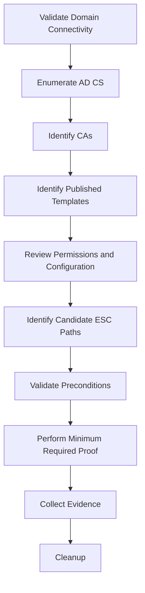

# Certipy

Certipy is a Python toolkit for enumerating and assessing Active Directory Certificate Services (AD CS). It supports discovery of certificate authorities and templates, certificate requests, certificate-based authentication, certificate and private-key handling, CA and template analysis, Shadow Credentials, relay assessment, and validation of AD CS privilege paths.

Certipy is particularly useful when conducting Active Directory assessments from Linux because it provides a broad AD CS workflow without requiring execution directly on a domain-joined Windows host.

!!! warning "Authorised Testing Only"
    Certipy can request authentication certificates, interact with certificate authorities, modify certificate-related Active Directory objects, and perform other security-sensitive operations. Use active functionality only when the affected domain, CA, accounts, templates, and authentication paths are explicitly within scope.

---

## Overview

Certipy can help answer:

```text
Is AD CS deployed?
        |
        v
Which CAs exist?
        |
        v
Which templates are published?
        |
        v
Who can enroll?
        |
        v
Who can modify templates or CA configuration?
        |
        v
Which identities can certificates represent?
        |
        v
Can certificates authenticate?
        |
        v
Does the configuration create a privilege path?
```

Major Certipy functionality includes:

```text
Certipy
├── find
├── req
├── auth
├── cert
├── ca
├── template
├── account
├── shadow
├── relay
└── Certificate / AD CS analysis
```

The exact command set depends on the installed Certipy version.

Always confirm with:

```bash
certipy --help
```

and:

```bash
certipy <COMMAND> -h
```

before relying on syntax from older write-ups.

---

## Official Project

The AD CS assessment toolkit covered by this page is:

[Certipy - Official GitHub Repository](https://github.com/ly4k/Certipy){ target="_blank" rel="noopener noreferrer" }

Do not confuse it with other unrelated Python packages named Certipy.

The package name commonly used for installation is:

```text
certipy-ad
```

Verify the installed tool after installation.

---

## Certipy vs Certify

Certipy and Certify overlap but have different operator workflows.

| Certipy | Certify |
| --- | --- |
| Python | C# / .NET |
| Commonly Linux-based | Commonly Windows-based |
| Remote AD CS workflows | Native Windows/domain workflows |
| CA discovery | CA discovery |
| Template enumeration | Template enumeration |
| Certificate requests | Certificate requests |
| Certificate authentication | Certificate enrollment workflows |
| Shadow Credentials | Primarily AD CS-focused |
| Relay functionality | Primarily direct AD CS enumeration |
| Certificate manipulation | Certificate enumeration/request workflows |

A useful model is:

```text
Linux Operator
    |
    +--> Certipy

Windows Domain Context
    |
    +--> Certify
```

This is not absolute.

Using both can provide independent validation of important findings.

---

# Installation

A common installation method is:

```bash
pipx install certipy-ad
```

Alternatively, use a dedicated Python virtual environment:

```bash
python3 -m venv .venv
```

Activate it:

```bash
source .venv/bin/activate
```

Install:

```bash
python3 -m pip install certipy-ad
```

Verify:

```bash
certipy --help
```

Check the version:

```bash
certipy -v
```

Depending on the packaging and operating system, the command may also appear as:

```text
certipy
```

or historically:

```text
certipy-ad
```

Use:

```bash
which certipy
```

to verify which executable is being used.

---

# Install from Source

For development or when testing a specific upstream revision:

```bash
git clone https://github.com/ly4k/Certipy.git
```

Enter the repository:

```bash
cd Certipy
```

Record the source revision:

```bash
git rev-parse HEAD
```

Create a virtual environment:

```bash
python3 -m venv .venv
```

Activate:

```bash
source .venv/bin/activate
```

Install the project:

```bash
python3 -m pip install .
```

Verify:

```bash
certipy --help
```

Recording the Git commit improves reproducibility during assessments.

---

# Establish the Assessment Context

Before using Certipy, record:

```text
Domain
Username
Source Host
Domain Controller
DNS Server
Certificate Authority
Assessment Scope
```

Useful variables might conceptually be:

```text
DOMAIN=corp.local
USER=analyst
DC=dc01.corp.local
DC_IP=10.10.10.10
CA=CORP-CA
CA_HOST=ca01.corp.local
```

Use placeholders in documentation.

Do not place real credentials in:

- Git repositories
- Shell history where avoidable
- Screenshots
- Reports
- Shared notes

---

# Required Connectivity

AD CS assessment may depend on several Active Directory services.

Common ports include:

| Port | Protocol | Service |
| ---: | --- | --- |
| 53 | TCP/UDP | DNS |
| 88 | TCP/UDP | Kerberos |
| 135 | TCP | RPC Endpoint Mapper |
| 389 | TCP/UDP | LDAP |
| 445 | TCP | SMB |
| 464 | TCP/UDP | Kerberos password operations |
| 636 | TCP | LDAPS |
| 3268 | TCP | Global Catalog |
| 3269 | TCP | Global Catalog over TLS |

CA enrollment may additionally use:

```text
RPC
DCOM
HTTP
HTTPS
```

depending on the environment and enrollment mechanism.

---

# Validate DNS

Correct DNS is critical.

Query the domain:

```bash
dig @<DNS_SERVER> <DOMAIN>
```

Find LDAP Domain Controllers:

```bash
dig @<DNS_SERVER> _ldap._tcp.dc._msdcs.<DOMAIN> SRV
```

Find Kerberos services:

```bash
dig @<DNS_SERVER> _kerberos._tcp.dc._msdcs.<DOMAIN> SRV
```

Resolve the CA:

```bash
dig @<DNS_SERVER> <CA_HOST>
```

Do not treat a Certipy error as an AD CS problem until DNS and routing have been validated.

---

# Validate Connectivity

LDAP:

```bash
nc -vz <DC_IP> 389
```

Kerberos:

```bash
nc -vz <DC_IP> 88
```

SMB:

```bash
nc -vz <DC_IP> 445
```

CA HTTP:

```bash
nc -vz <CA_IP> 80
```

CA HTTPS:

```bash
nc -vz <CA_IP> 443
```

RPC:

```bash
nc -vz <CA_IP> 135
```

Network reachability is only the first layer.

---

# Basic Workflow

A good Certipy workflow is:



Do not begin with exploitation.

Begin with enumeration.

---

# Find

The `find` action is the primary Certipy discovery workflow.

Review current options:

```bash
certipy find -h
```

A typical authenticated enumeration structure is:

```bash
certipy find \
  -u '<USER>@<DOMAIN>' \
  -p '<PASSWORD>' \
  -dc-ip <DC_IP>
```

Certipy can enumerate:

```text
Certificate Authorities
Certificate Templates
Published Templates
Enrollment Rights
Template Permissions
CA Permissions
Extended Key Usage
Subject Configuration
Issuance Requirements
AD CS Security Settings
```

---

# Vulnerable-Only Enumeration

Certipy can filter results to candidate vulnerable configurations.

Typical structure:

```bash
certipy find \
  -u '<USER>@<DOMAIN>' \
  -p '<PASSWORD>' \
  -dc-ip <DC_IP> \
  -vulnerable
```

Treat this output as:

```text
Candidate Findings
```

not:

```text
Confirmed Exploitation
```

Each result must be reviewed manually.

---

# Enabled Templates

Where supported by the installed version, enumeration can focus on enabled/published templates.

Check:

```bash
certipy find -h
```

The distinction matters:

```text
Template Exists
        !=
Template Published
        !=
Template Enrollable
```

A dangerous template that is not currently published may have different immediate risk.

---

# Output Formats

Certipy can generate structured output useful for analysis.

Depending on the version, output may include:

```text
Text
JSON
BloodHound-compatible data
```

Keep the original output for evidence, but review it for sensitive information before attaching it to a report.

A useful evidence directory structure is:

```text
certipy/
├── raw/
├── json/
├── screenshots/
└── notes/
```

Do not store private keys or authentication certificates in normal evidence repositories.

---

# BloodHound Integration

Certipy can generate information suitable for visualising certificate-related privilege paths.

Conceptually:

```text
Certipy
    |
    v
AD CS Enumeration
    |
    v
Structured Data
    |
    v
BloodHound
    |
    v
Privilege Path Analysis
```

This is useful because certificate misconfigurations often interact with:

```text
Group Membership
ACLs
Delegation
Account Control
CA Permissions
Template Permissions
```

Do not rely solely on graph edges.

Validate the underlying permissions and configuration.

---

# Authentication Methods

Depending on the installed version and command, Certipy may support authentication using:

```text
Username + Password
NTLM Hash
Kerberos
SSPI
Certificate
```

Check the relevant action:

```bash
certipy <ACTION> -h
```

Use the least sensitive authentication material available for the assessment.

---

# Kerberos Authentication

When using Kerberos, Certipy can work with existing Kerberos credential-cache material where supported.

Check:

```bash
certipy find -h
```

for Kerberos-related options.

Before using Kerberos:

```bash
klist
```

or on Linux:

```bash
klist
```

Confirm:

```text
Realm
Principal
Ticket Validity
KDC Reachability
DNS
Clock
```

---

# Time Synchronisation

Kerberos is time-sensitive.

Check:

```bash
date
```

If necessary, compare with the Domain Controller using an approved method.

Kerberos failures may be caused by:

```text
Clock Skew
DNS
Wrong Realm
KDC Reachability
Expired Ticket
```

rather than Certipy.

---

# Certificate Authorities

A Certificate Authority is a trust anchor.

A simplified model is:

```text
Active Directory
        |
        v
Enterprise CA
        |
        v
Certificate Templates
        |
        v
Certificate Requests
        |
        v
Certificates
```

Certipy enumeration should identify:

```text
CA Name
CA Host
CA Certificate
Published Templates
Enrollment Services
CA Permissions
Security Configuration
Web Enrollment
```

---

# Certificate Templates

Certificate templates define how Enterprise CAs issue certificates.

Important properties include:

```text
Enrollment Permissions
Template ACL
Subject Name Configuration
Extended Key Usage
Issuance Requirements
Authorized Signatures
Manager Approval
Validity
Renewal
Private Key Options
Security Extensions
```

A vulnerability usually depends on a combination of properties.

---

# Enrollment Rights

Common enrollment-related permissions include:

```text
Enroll
Autoenroll
```

Potential principals include:

```text
Domain Users
Domain Computers
Authenticated Users
Specific Groups
Specific Users
Service Accounts
```

Enrollment itself is not a vulnerability.

The security question is:

```text
What certificate can this principal obtain?
```

---

# Template ACLs

Templates are Active Directory objects.

Security-sensitive permissions may include:

```text
GenericAll
GenericWrite
WriteDacl
WriteOwner
WriteProperty
```

The reasoning model is:

```text
Principal
    |
    v
Template Modification Rights
    |
    v
Security-Sensitive Configuration
    |
    v
Certificate Enrollment
    |
    v
Authentication Path
```

This is especially relevant to ESC4-style conditions.

---

# Extended Key Usage

Extended Key Usage determines what a certificate is intended to do.

Authentication-related purposes may include:

```text
Client Authentication
Smart Card Logon
PKINIT Client Authentication
Any Purpose
```

Always ask:

```text
Can this certificate authenticate?
```

rather than simply:

```text
Can this template issue a certificate?
```

---

# Subject and SAN

Certificate identity may be represented through:

```text
Subject
Subject Alternative Name
User Principal Name
DNS Name
SID-related extensions
```

The security-sensitive question is:

```text
Who controls the certificate identity?
```

If the requester can influence an identity other than their own, investigate the complete mapping and issuance chain.

---

# Issuance Requirements

Templates can impose additional requirements.

Examples include:

```text
Manager Approval
Authorized Signatures
Enrollment Agent Requirements
```

These controls can significantly affect exploitability.

Therefore:

```text
Dangerous-Looking Template
        +
Approval Required
        !=
Immediately Exploitable
```

---

# Request Certificates

Certipy uses the `req` action for certificate enrollment.

Review:

```bash
certipy req -h
```

A normal approved certificate request conceptually requires:

```text
Authenticated Principal
        +
CA
        +
Published Template
        +
Enrollment Permission
        =
Certificate Request
```

A typical request structure is:

```bash
certipy req \
  -u '<USER>@<DOMAIN>' \
  -p '<PASSWORD>' \
  -dc-ip <DC_IP> \
  -ca '<CA_NAME>' \
  -template '<TEMPLATE>'
```

Use only approved test identities and templates.

---

# Certificate Request Result

A successful request can result in:

```text
Certificate
+
Private Key
```

commonly stored as:

```text
.pfx
```

Treat this file as authentication material.

Do not:

- Commit it to Git
- Upload it to shared documentation
- Include its private key in screenshots
- Leave it on shared systems
- Retain it unnecessarily

---

# PFX

PFX is a PKCS#12 container.

It may contain:

```text
Certificate
Private Key
Certificate Chain
```

Inspect a test PFX without printing sensitive key material:

```bash
openssl pkcs12 \
  -in certificate.pfx \
  -info \
  -noout
```

Do not use:

```text
-nodes
```

casually because it may expose unencrypted private-key material.

---

# cert Action

Certipy provides certificate-management functionality.

Review:

```bash
certipy cert -h
```

This can be useful for working with certificate and private-key formats.

Use it for:

```text
Certificate Inspection
Certificate Conversion
Private-Key Handling
PFX Management
```

Treat all resulting private-key material as sensitive.

---

# Certificate Authentication

Certipy's:

```text
auth
```

action can validate whether an approved certificate supports authentication.

Review:

```bash
certipy auth -h
```

Conceptually:

```text
Certificate + Private Key
        |
        v
PKINIT / Certificate Authentication
        |
        v
KDC or Directory Service
        |
        v
Authenticated Identity
```

A successful certificate request does not prove successful authentication.

---

# PKINIT

PKINIT extends Kerberos with public-key authentication.

Simplified:

```text
Certificate
    |
    v
AS-REQ with PKINIT
    |
    v
KDC
    |
    v
Identity Mapping
    |
    v
TGT
```

Several conditions can affect this process:

```text
Certificate EKU
Certificate Identity
Certificate Mapping
KDC Certificate
Trust Chain
Strong Mapping Enforcement
Clock
```

---

# Certificate Mapping

Modern Active Directory environments may enforce stronger certificate-to-account mapping.

Therefore:

```text
Certificate Contains UPN
        !=
KDC Maps Certificate to that User
```

Certificate mapping can depend on:

```text
SID Security Extension
Strong Mapping
Explicit Mapping
UPN
Issuer
Subject
Serial Number
Certificate Policy
```

Always validate the actual environment.

---

# Authentication Validation Model

Use:

```text
Certificate Issued
        |
        v
Private Key Available
        |
        v
Certificate Supports Authentication
        |
        v
Identity Mapping Accepted
        |
        v
Authentication Successful
        |
        v
Authorisation Evaluated Separately
```

Do not collapse these stages.

---

# CA Action

Certipy provides a:

```text
ca
```

action for CA-related operations.

Review:

```bash
certipy ca -h
```

This area can include security-sensitive CA administration functionality.

Begin with read-oriented analysis.

Do not modify:

```text
CA Configuration
Certificate Requests
CA Permissions
Security Extensions
```

unless explicitly authorised.

---

# Template Action

Certipy provides:

```text
template
```

functionality for interacting with certificate templates.

Review:

```bash
certipy template -h
```

Template modification is highly security-sensitive.

A production template may be used by:

```text
Users
Computers
VPN
Wi-Fi
Web Servers
Domain Controllers
Applications
```

Changing it can have organisation-wide consequences.

Prefer read-only evidence whenever it sufficiently demonstrates the issue.

---

# Account Action

Certipy may expose account-management functionality relevant to certificate attack paths.

Review:

```bash
certipy account -h
```

Account modifications can affect Active Directory identity state.

Do not create or modify accounts unless explicitly authorised.

---

# Shadow Credentials

Certipy includes:

```text
shadow
```

functionality.

Shadow Credentials relate to the Active Directory attribute:

```text
msDS-KeyCredentialLink
```

At a high level:

```text
Write Access to Account
        |
        v
Key Credential Added
        |
        v
Certificate-Based Authentication Material
        |
        v
Authentication as Account
```

This is not primarily an AD CS template vulnerability.

It uses certificate-based authentication mechanisms and Active Directory key credentials.

---

# Shadow Credential Preconditions

The key question is:

```text
Can the current principal modify msDS-KeyCredentialLink
for the target account?
```

Possible permission paths may arise from:

```text
GenericAll
GenericWrite
Specific WriteProperty
Other ACL relationships
```

Validate the ACL before performing any modification.

---

# Inspect Shadow Functionality

Review:

```bash
certipy shadow -h
```

Supported sub-actions depend on the installed version.

Potential operations can include:

```text
list
add
remove
clear
info
auto
```

Some of these modify Active Directory.

Use read-only operations first.

---

# Shadow Credential Safety

Never use:

```text
clear
```

casually.

Removing legitimate Key Credentials can break:

```text
Windows Hello for Business
Certificate Authentication
Other Key Trust Relationships
```

A safe assessment workflow is:

```text
Record Existing State
        |
        v
Add Controlled Test Entry if Authorised
        |
        v
Validate
        |
        v
Remove Only the Test Entry
        |
        v
Verify Original State
```

Do not delete unrelated entries.

---

# NTLM Relay and AD CS

Certipy includes:

```text
relay
```

functionality for evaluating AD CS enrollment endpoints.

Review:

```bash
certipy relay -h
```

AD CS relay risk commonly depends on combinations such as:

```text
NTLM Authentication
        +
Reachable Enrollment Endpoint
        +
Insufficient Relay Protection
        +
Enrollable Authentication Template
        =
Potential Certificate Relay Path
```

Relay testing should be explicitly authorised because it involves handling authentication from another security principal.

---

# ESC8 Concept

ESC8 is associated with NTLM relay to AD CS HTTP enrollment interfaces under vulnerable conditions.

A simplified model is:

```text
Victim Authentication
        |
        v
NTLM
        |
        v
AD CS Web Enrollment
        |
        v
Certificate Request
        |
        v
Certificate for Victim Identity
```

Relevant protections include:

```text
HTTPS
Extended Protection for Authentication
NTLM Restrictions
Network Segmentation
Enrollment Permissions
```

The presence of:

```text
/certsrv/
```

alone does not prove ESC8.

---

# RPC Enrollment

Modern AD CS assessments should also consider certificate enrollment over RPC.

This is distinct from HTTP-based web enrollment.

The important point is:

```text
AD CS Enrollment
    |
    +--> HTTP / HTTPS
    |
    +--> RPC
```

Different relay protections and exposure conditions may apply.

Review the current Certipy release and upstream documentation for supported relay/enrollment mechanisms.

---

# ESC Taxonomy

AD CS privilege paths are commonly categorised using:

```text
ESC1
ESC2
ESC3
...
ESC17
```

Certipy can identify and assist with validation of many of these conditions.

The ESC identifier is a shorthand classification.

It is not the finding itself.

The report should explain:

```text
Misconfiguration
        |
        v
Attacker-Controlled Property
        |
        v
Certificate Trust Decision
        |
        v
Authentication / Privilege Impact
```

---

# ESC1

ESC1 classically involves a certificate template where a low-privileged enrollee can influence certificate identity while the certificate supports authentication.

Conceptually:

```text
Low-Privilege Enrollment
        +
Requester-Controlled Identity
        +
Authentication-Capable Certificate
        +
No Blocking Issuance Requirement
        =
Potential Impersonation Path
```

Modern certificate mapping behaviour must also be considered.

---

# ESC2

ESC2 concerns templates whose certificate purpose is overly broad under the relevant conditions.

Examples may involve:

```text
Any Purpose
```

or insufficiently constrained certificate application policies.

Exploitability depends on the surrounding environment.

---

# ESC3

ESC3 involves Enrollment Agent functionality.

Conceptually:

```text
Enrollment Agent Certificate
        |
        v
Request Certificate on Behalf of Another Principal
        |
        v
Authentication Certificate
```

Review:

```text
Enrollment Agent EKU
Agent Enrollment Rights
Target Template
Enrollment Agent Restrictions
```

---

# ESC4

ESC4 concerns dangerous permissions over certificate-template objects.

Conceptually:

```text
Template Write Access
        |
        v
Security-Sensitive Template Modification
        |
        v
Certificate Enrollment
        |
        v
Potential Privilege Path
```

Template modification should be avoided in production unless explicitly authorised.

---

# ESC5

ESC5 covers broader PKI object-control issues where permissions over AD CS-related Active Directory objects create security impact.

The exact object and permission path matter.

Do not classify generic Active Directory write access as ESC5 without validating the PKI trust relationship.

---

# ESC6

ESC6 relates to CA configuration that can affect how requester-supplied certificate identity information is handled.

Modern Windows certificate security changes have altered the practical conditions for this class.

Always consider:

```text
CA Configuration
Certificate Security Extension
Strong Certificate Mapping
Template Configuration
```

together.

---

# ESC7

ESC7 involves dangerous Certificate Authority permissions.

Examples of security-sensitive CA permissions include:

```text
Manage CA
Manage Certificates
```

The complete privilege path depends on what the principal can actually change or approve.

---

# ESC8

ESC8 involves relay to HTTP-based AD CS enrollment under vulnerable conditions.

Review:

```text
NTLM
HTTP Enrollment
EPA
HTTPS
Template
Victim Identity
```

---

# ESC9 and ESC10

These classes involve weak certificate mapping conditions.

Modern certificate mapping protections are especially important here.

The core question is:

```text
How does Active Directory map the presented certificate
to an account?
```

Do not assess these solely from template properties.

---

# ESC11

ESC11 concerns certificate enrollment over RPC under relay-relevant conditions.

Evaluate:

```text
RPC Enrollment
Authentication
Relay Protections
CA Configuration
Template Permissions
```

This is separate from HTTP web enrollment.

---

# ESC12 and Later Classes

Modern AD CS research has expanded the ESC taxonomy beyond the original Certified Pre-Owned classes.

Current Certipy releases support detection and assessment of newer classes through ESC17.

Because the taxonomy continues to evolve, use:

```bash
certipy --help
```

the current Certipy documentation, and the current SpecterOps AD CS research when interpreting these findings.

Do not copy an old ESC1-ESC8 checklist and assume it represents the complete modern AD CS attack surface.

---

# CA Permissions

CA permissions should be reviewed separately from template permissions.

```text
Template ACL
        !=
CA ACL
        !=
Enrollment Rights
```

Important CA permissions can include:

```text
Manage CA
Manage Certificates
```

A principal with excessive CA control may be able to influence certificate issuance beyond normal enrollment.

---

# Web Enrollment Discovery

If Certipy identifies web enrollment, validate the actual endpoint.

Potential paths historically include:

```text
/certsrv/
```

Check HTTP:

```bash
curl -I http://<CA_HOST>/certsrv/
```

Check HTTPS:

```bash
curl -kI https://<CA_HOST>/certsrv/
```

A response only confirms the endpoint.

It does not prove relay vulnerability.

---

# Web Enrollment Security

Review:

```text
HTTP vs HTTPS
Windows Authentication
NTLM
Extended Protection for Authentication
Channel Binding
Network Exposure
Template Availability
```

A secure configuration may expose web enrollment while still resisting known relay paths.

---

# Certificate Security Extensions

Modern Windows certificate issuance can include security extensions linking certificates to Active Directory security identifiers.

This changes how some historical AD CS techniques behave.

The assessment model should therefore be:

```text
Template Configuration
        +
CA Configuration
        +
Certificate Contents
        +
Domain Controller Mapping Behaviour
        =
Effective Security
```

Do not assess only the template.

---

# Strong Certificate Mapping

Strong certificate mapping is increasingly important in modern Active Directory environments.

A certificate that contains an arbitrary:

```text
UPN
```

does not necessarily authenticate as that user.

The Domain Controller may require stronger binding between:

```text
Certificate
```

and:

```text
Active Directory Object
```

Always validate the effective runtime behaviour.

---

# Golden Certificates

Certipy has functionality associated with certificate forging when CA key material is already compromised.

This is fundamentally different from template misconfiguration.

The security condition is:

```text
CA Private Key Compromised
        |
        v
CA Trust Compromised
        |
        v
Certificates Can Potentially Be Forged
```

Possession of a CA private key represents a severe PKI compromise.

Do not perform certificate forging in production unless explicitly required and authorised.

---

# CA Private Keys

Protect CA private keys as high-value authentication infrastructure.

Potential protection mechanisms include:

```text
Hardware Security Module
TPM
Strong File Permissions
CA Host Isolation
Privileged Administration
Backup Protection
```

An Enterprise CA should be treated as privileged infrastructure.

---

# Certificate Revocation

Certificate-based access is affected by revocation.

Relevant concepts include:

```text
Certificate Revocation List
CRL Distribution Point
Online Certificate Status Protocol
Certificate Validity
```

When demonstrating certificate-related findings, consider whether the organisation can effectively revoke compromised certificates.

---

# Machine Certificates

Certificates may represent computers as well as users.

Machine authentication can affect:

```text
Kerberos
TLS
Network Authentication
IPsec
Device Authentication
Services
```

Therefore:

```text
Machine Certificate
```

should be treated as credential material for the associated computer identity.

---

# Domain Controller Certificates

Domain Controllers commonly require certificates for functions such as:

```text
LDAPS
Smart Card Authentication
PKINIT
```

Certificate configuration on Domain Controllers can therefore influence whether certificate-based Kerberos authentication is available.

---

# Certificate Lifetime

Review:

```text
Validity Period
Renewal Period
```

Long-lived authentication certificates can increase the duration of credential exposure.

Consider:

```text
Identity Privilege
Certificate Lifetime
Revocation Capability
Private-Key Protection
```

together.

---

# Private-Key Exportability

A certificate may be securely issued but poorly protected on the endpoint.

Ask:

```text
Is the private key exportable?

Who can read it?

Where is it stored?

Is hardware protection used?

Can another process access it?
```

This is an endpoint-security question separate from certificate-template security.

---

# Certipy Through Ligolo-ng

Because Ligolo-ng provides routed access, Certipy can often operate normally once the relevant Active Directory networks are routed.

Validate:

```bash
ip route get <DC_IP>
```

Then:

```bash
nc -vz <DC_IP> 389
```

```bash
nc -vz <DC_IP> 88
```

and the required CA enrollment protocol.

See:

[Ligolo-ng](ligolo-ng.md)

---

# Certipy Through Chisel

SOCKS-based operation can be more complicated because Certipy may interact with several protocols.

Validate individual dependencies before assuming the complete workflow will operate correctly through ProxyChains.

A useful sequence is:

```text
DNS
        |
        v
LDAP
        |
        v
Kerberos
        |
        v
CA Enrollment Protocol
```

For broad AD CS assessment, routed access through Ligolo-ng may be simpler than application-layer SOCKS forwarding.

See:

[Chisel](chisel.md)

---

# Compare Certipy and Certify Results

Important findings can be validated using both tools.

Example workflow:

```text
Certipy
    |
    v
Candidate ESC Finding
    |
    v
Certify
    |
    v
Windows-Side Enumeration
    |
    v
Manual Permission Review
    |
    v
Confirmed Security Condition
```

Tool disagreement should trigger investigation.

Do not simply choose the result that appears more severe.

---

# BloodHound Correlation

Certificate findings often interact with broader Active Directory relationships.

Examples include:

```text
User
 |
 v
Group
 |
 v
Template ACL
 |
 v
Certificate Template
 |
 v
Authentication
 |
 v
Privileged Account
```

BloodHound can help identify these relationships.

See:

[BloodHound](bloodhound.md)

---

# Troubleshooting

## Certipy Command Not Found

Check:

```bash
which certipy
```

Then:

```bash
python3 -m pip show certipy-ad
```

For pipx:

```bash
pipx list
```

Ensure the correct package is installed.

Remember that another unrelated package also uses the name Certipy.

---

# Wrong Certipy Installed

Check:

```bash
certipy --help
```

The AD CS tool should identify itself as the Active Directory Certificate Services toolkit by Oliver Lyak.

If the output describes generic certificate generation or local PKI management, the wrong Certipy package may be installed.

Install:

```bash
pipx install certipy-ad
```

rather than an unrelated package.

---

# DNS Resolution Fails

Test:

```bash
dig @<DNS_SERVER> <DC_HOST>
```

Then:

```bash
dig @<DNS_SERVER> <CA_HOST>
```

Check `/etc/resolv.conf` where appropriate.

A common failure pattern is:

```text
IP Connectivity Works
        +
Hostname Resolution Fails
        =
DNS Problem
```

not a Certipy problem.

---

# LDAP Fails

Check:

```bash
nc -vz <DC_IP> 389
```

Then validate:

```text
Credentials
Domain
Target
DNS
LDAP Signing
Channel Binding
TLS
```

depending on the operation being performed.

---

# Kerberos Fails

Check:

```bash
nc -vz <DC_IP> 88
```

Then review:

```text
DNS
Realm
KDC
Clock
Credentials
Ticket Cache
SPN
```

Kerberos is sensitive to hostname and realm correctness.

---

# CA Enumeration Works but Request Fails

Check:

```text
Template Published?
Enrollment Permission?
CA Accepting Template?
Manager Approval?
Authorized Signatures?
Subject Requirements?
Enrollment Protocol Reachable?
```

Enumeration and enrollment are different security boundaries.

---

# Certificate Request Succeeds but Authentication Fails

Check:

```text
Certificate EKU
Certificate Identity
SID Security Extension
Certificate Mapping
PKINIT Support
KDC Certificate
Trust Chain
Clock
Certificate Validity
```

A successful request alone is not proof of identity impersonation.

---

# RPC Errors

Validate:

```bash
nc -vz <CA_IP> 135
```

Remember that RPC may negotiate dynamic ports after contacting the endpoint mapper.

Network filtering can therefore allow:

```text
TCP/135
```

while still preventing the complete RPC workflow.

---

# Web Enrollment Not Found

Do not assume:

```text
No /certsrv/
```

means:

```text
No AD CS
```

The environment may use:

```text
RPC Enrollment
Other Enrollment Services
No Web Enrollment
```

Enumerate the CA independently.

---

# Vulnerable Output but No Exploit Path

Review the complete preconditions.

For example:

```text
Template Configuration
        +
Enrollment Rights
        +
Published State
        +
CA Configuration
        +
Certificate Mapping
        +
Authentication Support
```

All may affect the result.

Certipy's classification is the beginning of analysis, not the end.

---

# Security Interpretation

Avoid report statements such as:

```text
Certipy identified ESC1.
```

Prefer:

```text
Authenticated Users can enroll in an enabled certificate
template that permits requester-controlled identity information
and supports client authentication. The effective certificate
mapping configuration allows the issued certificate to represent
another directory identity.
```

The report should explain the security mechanism.

---

# Evidence Collection

Useful Certipy evidence can include:

- Certipy version
- Certipy source revision where relevant
- Current principal
- Domain
- Domain Controller
- CA name
- CA hostname
- Template name
- Template enabled state
- Enrollment permissions
- Template ACL
- CA ACL
- EKUs
- Subject/SAN configuration
- Issuance requirements
- Certificate mapping state
- Certificate request ID
- Certificate serial number
- Authentication result
- Timestamp
- Detection telemetry
- Cleanup verification

A strong evidence chain is:

```text
Principal
    |
    v
Permission
    |
    v
AD CS Configuration
    |
    v
Certificate Issuance
    |
    v
Certificate Mapping
    |
    v
Authentication
    |
    v
Authorisation Impact
```

---

# Detection Opportunities

AD CS activity can be monitored across several layers.

## Active Directory

Monitor:

```text
Certificate Template Changes
Template ACL Changes
CA Object Changes
msDS-KeyCredentialLink Changes
Group Membership Changes Affecting Enrollment
```

---

## Certificate Authority

Monitor:

```text
Certificate Requests
Certificate Issuance
Certificate Denials
Request Approval
CA Configuration Changes
Certificate Revocation
```

---

## Domain Controllers

Monitor:

```text
Kerberos Authentication
Certificate-Based Authentication
LDAP Changes
Account Changes
```

---

## Endpoint

Monitor:

```text
Certipy Execution
Python Processes
Unusual Certificate Files
PFX Creation
Private-Key Access
Authentication Changes
```

Do not rely only on process names.

---

# Certificate Services Events

Depending on audit configuration, useful Windows events can include certificate-service events such as:

```text
4886
4887
4888
4890
4891
```

Correlate:

```text
Requester
Template
Certificate Subject
Serial Number
CA
Timestamp
Source
```

---

# Directory Change Monitoring

Certificate attack paths can involve modifications to:

```text
Certificate Templates
Template ACLs
CA Objects
msDS-KeyCredentialLink
```

Directory Service Changes auditing can provide valuable evidence when configured.

A dangerous pattern may be:

```text
Object Modified
        |
        v
Authentication Performed
        |
        v
Object Restored
```

Point-in-time configuration scanning may miss temporary modifications.

---

# Defensive Recommendations

Relevant controls include:

- Restrict certificate enrollment
- Restrict template modification permissions
- Restrict CA administrative permissions
- Remove unnecessary requester-controlled identity settings
- Restrict authentication-capable EKUs
- Require approval where appropriate
- Configure Enrollment Agent restrictions
- Harden certificate mapping
- Keep Domain Controllers patched
- Protect CA private keys
- Use HSMs where appropriate
- Require HTTPS for web enrollment
- Configure Extended Protection for Authentication
- Reduce NTLM usage
- Restrict relay opportunities
- Monitor certificate issuance
- Monitor template changes
- Monitor `msDS-KeyCredentialLink`
- Protect privileged certificate templates
- Review certificate validity periods
- Maintain effective revocation

The goal is:

```text
Controlled Enrollment
        +
Strong Identity Mapping
        +
Protected CA
        +
Restricted Administration
        +
Relay Protection
        +
Monitoring
        =
Reduced AD CS Attack Surface
```

---

# CA Infrastructure Protection

Treat Enterprise CAs as privileged infrastructure.

Relevant protections include:

```text
Administrative Tiering
Network Segmentation
Restricted Interactive Logon
Application Control
EDR
Secure Backup
Private-Key Protection
Patch Management
Audit Logging
HSM
```

Compromise of a CA private key can undermine authentication trust beyond a single endpoint.

---

# Operational Safety

During production assessments:

- Enumerate before modifying
- Prefer read-only validation
- Use designated test identities
- Limit certificate requests
- Record every request
- Record certificate serial numbers
- Protect generated private keys
- Avoid template modification unless explicitly authorised
- Avoid CA configuration modification unless explicitly authorised
- Avoid clearing Shadow Credentials
- Avoid broad relay activity
- Avoid certificate forging unless explicitly required
- Remove temporary certificates and keys
- Restore only objects you intentionally changed
- Verify cleanup

---

# Cleanup

Review generated files:

```bash
find . -maxdepth 1 -type f \( \
  -name "*.pfx" -o \
  -name "*.pem" -o \
  -name "*.key" -o \
  -name "*.ccache" \
\) -print
```

Remove only files created during the assessment.

Example:

```bash
rm -f ./test-user.pfx
```

Do not use broad destructive cleanup commands in shared assessment directories.

Review Certipy enumeration output separately.

Preserve non-sensitive evidence according to the assessment evidence policy.

---

# Quick Reference

## Help

```bash
certipy --help
```

## Version

```bash
certipy -v
```

## Find Help

```bash
certipy find -h
```

## Enumerate AD CS

```bash
certipy find \
  -u '<USER>@<DOMAIN>' \
  -p '<PASSWORD>' \
  -dc-ip <DC_IP>
```

## Candidate Vulnerable Configurations

```bash
certipy find \
  -u '<USER>@<DOMAIN>' \
  -p '<PASSWORD>' \
  -dc-ip <DC_IP> \
  -vulnerable
```

## Request Help

```bash
certipy req -h
```

## Approved Certificate Request

```bash
certipy req \
  -u '<USER>@<DOMAIN>' \
  -p '<PASSWORD>' \
  -dc-ip <DC_IP> \
  -ca '<CA_NAME>' \
  -template '<TEMPLATE>'
```

## Authentication Help

```bash
certipy auth -h
```

## Certificate Operations

```bash
certipy cert -h
```

## CA Operations

```bash
certipy ca -h
```

## Template Operations

```bash
certipy template -h
```

## Shadow Credentials

```bash
certipy shadow -h
```

## Relay

```bash
certipy relay -h
```

## Account Operations

```bash
certipy account -h
```

---

# Assessment Checklist

## Preparation

- [ ] AD CS testing explicitly authorised
- [ ] Domain within scope
- [ ] CA systems within scope
- [ ] Certificate request testing authorised
- [ ] Relay testing separately authorised where required
- [ ] Active Directory modification separately authorised
- [ ] Test identities defined
- [ ] Certipy version recorded

## Connectivity

- [ ] DNS validated
- [ ] Domain Controller identified
- [ ] LDAP reachable
- [ ] Kerberos reachable
- [ ] CA identified
- [ ] Required enrollment protocol reachable
- [ ] Time synchronisation checked

## Discovery

- [ ] CAs enumerated
- [ ] Templates enumerated
- [ ] Published templates identified
- [ ] Enrollment permissions reviewed
- [ ] Template ACLs reviewed
- [ ] CA permissions reviewed
- [ ] EKUs reviewed
- [ ] Subject configuration reviewed
- [ ] Issuance requirements reviewed
- [ ] Web enrollment reviewed
- [ ] RPC enrollment considered
- [ ] Certificate mapping considered

## Validation

- [ ] Candidate ESC classifications manually reviewed
- [ ] Current principal's permissions confirmed
- [ ] Required preconditions confirmed
- [ ] Modern mitigations considered
- [ ] Minimum required proof selected
- [ ] Certificate requests limited
- [ ] Authentication separately validated
- [ ] Authorisation impact separately validated

## Shadow Credentials

- [ ] ACL prerequisite confirmed
- [ ] Existing Key Credentials recorded
- [ ] Only authorised test entry added
- [ ] No legitimate entry removed
- [ ] Test entry removed
- [ ] Original state verified

## Evidence

- [ ] Certipy version captured
- [ ] CA information captured
- [ ] Template information captured
- [ ] Permissions captured
- [ ] Request IDs recorded
- [ ] Certificate serial numbers recorded
- [ ] Authentication result recorded
- [ ] Private keys excluded from report
- [ ] Security impact explained

## Detection

- [ ] CA auditing reviewed where available
- [ ] Kerberos events reviewed
- [ ] Directory changes reviewed
- [ ] Endpoint telemetry reviewed
- [ ] Certificate issuance correlated

## Cleanup

- [ ] Temporary PFX files removed
- [ ] Temporary private keys removed
- [ ] Temporary credential caches reviewed
- [ ] Shadow Credential test entries removed
- [ ] Template changes restored if authorised testing required them
- [ ] CA changes restored if authorised testing required them
- [ ] No unintended directory changes remain
- [ ] Cleanup documented

---

# Common Mistakes

## Installing the Wrong Certipy

The AD CS assessment tool is distributed as:

```text
certipy-ad
```

Verify:

```bash
certipy --help
```

---

## Treating `-vulnerable` as Proof

Certipy identifies candidate configurations.

Manual validation remains necessary.

---

## Ignoring Certificate Mapping

Modern Active Directory certificate mapping can substantially change exploitability.

---

## Ignoring CA Configuration

Template analysis alone is insufficient.

Review:

```text
Template
+
CA
+
Domain Controller Mapping
```

---

## Ignoring Enrollment Protocol

HTTP and RPC enrollment have different exposure and protection considerations.

---

## Treating Certificate Issuance as Authentication

Keep separate:

```text
Certificate Issued
        !=
Authentication Successful
        !=
Privilege Obtained
```

---

## Leaving PFX Files Behind

A PFX containing a private key is credential material.

Protect and remove it appropriately.

---

## Clearing Shadow Credentials

Never remove legitimate Key Credentials merely to simplify testing.

Remove only the test entry you created.

---

## Modifying Templates Unnecessarily

Template modification can affect production authentication and enrollment.

Prefer configuration evidence when sufficient.

---

## Using Old ESC Checklists

The AD CS research landscape has expanded considerably.

Use current Certipy and current AD CS research rather than assuming the original ESC classes are exhaustive.

---

# Related Notes

- [Certify](certify.md)
- [Rubeus](rubeus.md)
- [Mimikatz](mimikatz.md)
- [BloodHound](bloodhound.md)
- [Impacket](impacket.md)
- [NetExec](netexec.md)
- [Ligolo-ng](ligolo-ng.md)
- [Chisel](chisel.md)
- [Active Directory](../active-directory/index.md)
- [Windows](../windows/index.md)

Planned related material:

```text
active-directory/ad-cs/
active-directory/ntlm-relay.md
active-directory/shadow-credentials.md
cheatsheets/certipy.md
```

---

# References

- [Certipy - Official GitHub Repository](https://github.com/ly4k/Certipy){ target="_blank" rel="noopener noreferrer" }
- [Certipy Wiki](https://github.com/ly4k/Certipy/wiki){ target="_blank" rel="noopener noreferrer" }
- [Certipy Releases](https://github.com/ly4k/Certipy/releases){ target="_blank" rel="noopener noreferrer" }
- [SpecterOps - Certified Pre-Owned](https://specterops.io/blog/2021/06/17/certified-pre-owned/){ target="_blank" rel="noopener noreferrer" }
- [Certified Pre-Owned Whitepaper](https://specterops.io/wp-content/uploads/sites/3/2022/06/Certified_Pre-Owned.pdf){ target="_blank" rel="noopener noreferrer" }
- [Microsoft - Active Directory Certificate Services Overview](https://learn.microsoft.com/en-us/windows-server/identity/ad-cs/active-directory-certificate-services-overview){ target="_blank" rel="noopener noreferrer" }
- [Microsoft - KB5014754 Certificate-Based Authentication Changes](https://support.microsoft.com/help/5014754){ target="_blank" rel="noopener noreferrer" }
- [MITRE ATT&CK - Steal Authentication Certificate](https://attack.mitre.org/techniques/T1649/){ target="_blank" rel="noopener noreferrer" }
