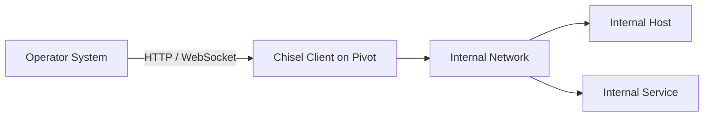
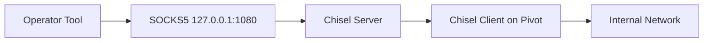

# Chisel

Chisel is a fast TCP/UDP tunnelling tool transported over HTTP and secured using SSH. It is commonly used during authorised security assessments to create port forwards, SOCKS proxies, reverse tunnels, and pivot paths through systems that can reach networks unavailable to the operator.

Where Ligolo-ng provides a TUN-based routed networking model, Chisel primarily provides explicit port forwarding and SOCKS-based access.

!!! warning "Authorised Testing Only"
    Use Chisel only on systems and networks for which you have explicit authorisation. Tunnelling can expose services and network segments that are outside the approved assessment scope.

---

## Overview

A basic Chisel deployment consists of:

| Component | Typical Location | Purpose |
| --- | --- | --- |
| Server | Operator-controlled system | Accepts Chisel client connections |
| Client | Pivot host | Connects to the server and creates requested tunnels |
| Remote | Client configuration | Defines the forwarding relationship |
| SOCKS proxy | Operator or pivot side | Provides dynamic access to multiple destinations |
| Reverse remote | Server side | Creates a listener whose traffic exits through the client |

A common assessment architecture is:



For a reverse SOCKS tunnel:

```text
Operator
    |
    | 127.0.0.1:1080
    v
SOCKS5 Proxy
    |
    v
Chisel Server
    |
    | HTTP / WebSocket tunnel
    v
Chisel Client
    |
    v
Internal Network
```

Tools that support SOCKS directly, or tools used through ProxyChains, can then communicate with internal systems.

---

## When to Use Chisel

Chisel is useful when:

- A pivot host can reach an internal network
- The pivot can establish an outbound connection to the operator
- A specific internal service must be forwarded
- A SOCKS proxy is preferred over network-level routing
- A reverse tunnel is required
- HTTP/WebSocket transport is useful
- Several forwards need to share one Chisel connection
- Installing or configuring a TUN interface is undesirable
- A lightweight single-binary tunnelling solution is preferred

Example:

```text
Operator
10.10.14.10
     |
     v
Pivot Host
10.10.10.25
172.16.20.10
     |
     v
Internal Network
172.16.20.0/24
```

The operator cannot directly reach:

```text
172.16.20.0/24
```

but the pivot can.

Chisel can provide either:

```text
Specific Port Forward
```

or:

```text
SOCKS Proxy
```

through that pivot.

---

## Chisel vs Ligolo-ng

Chisel and Ligolo-ng solve overlapping problems using different networking models.

| Chisel | Ligolo-ng |
| --- | --- |
| Port-forward/SOCKS model | TUN/routing model |
| Often used with ProxyChains | Applications generally use normal routing |
| Excellent for explicit forwards | Excellent for broad subnet access |
| Reverse SOCKS support | Routed pivoting |
| No operator TUN required for basic use | TUN interface normally involved |
| HTTP/WebSocket transport | Ligolo-ng-specific TLS transport |
| Multiple remotes per connection | Multiple tunnels/interfaces |
| TCP and UDP forwarding | TCP, UDP and ICMP echo support |

A useful rule of thumb is:

```text
Need one or several explicit forwards?
        |
        +--> Chisel

Need broad routed access to an internal subnet?
        |
        +--> Ligolo-ng
```

This is not absolute.

Choose the tool based on:

- Network topology
- Protocol requirements
- Operating system
- Available privileges
- Egress restrictions
- Tool compatibility
- Assessment scope

---

## Core Concepts

Before using Chisel, understand four concepts:

```text
Server
Client
Remote
Reverse Remote
```

### Server

The Chisel server accepts incoming Chisel client connections.

Typical syntax:

```bash
./chisel server -p 8080
```

The server can additionally enable:

- Reverse forwarding
- SOCKS5
- Authentication
- TLS
- Backend HTTP proxying

---

### Client

The client connects to the Chisel server.

Basic syntax:

```bash
./chisel client <SERVER> <REMOTE>
```

Example:

```bash
./chisel client 10.10.14.10:8080 8000:172.16.20.15:80
```

---

### Remote

A Chisel remote describes how traffic should be forwarded.

The general structure is:

```text
<local-host>:<local-port>:<remote-host>:<remote-port>/<protocol>
```

The protocol defaults to TCP.

Example:

```text
127.0.0.1:8445:172.16.20.15:445
```

Conceptually:

```text
Operator
127.0.0.1:8445
        |
        v
Chisel
        |
        v
172.16.20.15:445
```

---

### Reverse Remote

A remote prefixed with:

```text
R:
```

reverses the forwarding direction.

Conceptually:

```text
Listener on Chisel Server
        |
        v
Chisel Tunnel
        |
        v
Chisel Client
        |
        v
Client-Reachable Destination
```

Reverse remotes require the server to enable:

```text
--reverse
```

---

## Installation

Use the official Chisel project.

- [Chisel - Official GitHub Repository](https://github.com/jpillora/chisel){ target="_blank" rel="noopener noreferrer" }
- [Chisel Releases](https://github.com/jpillora/chisel/releases){ target="_blank" rel="noopener noreferrer" }

Download the appropriate binary for the operator and pivot operating systems.

Check the version:

```bash
./chisel --version
```

or inspect:

```bash
./chisel --help
```

Windows:

```powershell
.\chisel.exe --help
```

---

## Build from Source

If Go is installed:

```bash
go install github.com/jpillora/chisel@latest
```

Verify:

```bash
chisel --help
```

The official project also publishes packaged releases and container images.

---

## Docker

Display help using the official container:

```bash
docker run --rm -it jpillora/chisel --help
```

For assessment infrastructure, prefer a deployment method that is easy to identify and remove after testing.

---

# Basic Port Forwarding

A simple forward exposes a remote service locally.

Assume:

```text
Operator:     10.10.14.10
Pivot:        10.10.10.25
Internal:     172.16.20.15
Service:      172.16.20.15:80
```

Start the Chisel server on the operator:

```bash
./chisel server -p 8080
```

From the pivot:

```bash
./chisel client 10.10.14.10:8080 8000:172.16.20.15:80
```

The operator can then access:

```text
127.0.0.1:8000
```

which Chisel forwards to:

```text
172.16.20.15:80
```

Test:

```bash
curl http://127.0.0.1:8000
```

The path is:

```text
Operator:8000
     |
     v
Chisel Server
     |
     v
Chisel Client
     |
     v
172.16.20.15:80
```

---

# Bind the Local Forward Explicitly

To avoid exposing the local forwarding port unnecessarily, bind it to loopback:

```bash
./chisel client 10.10.14.10:8080 127.0.0.1:8000:172.16.20.15:80
```

This produces:

```text
127.0.0.1:8000
        |
        v
172.16.20.15:80
```

Prefer loopback bindings unless other systems genuinely need to access the forwarding port.

---

# Forward SMB

Assume the internal host is:

```text
172.16.20.15
```

and SMB is available on:

```text
445/tcp
```

Create a local forward:

```bash
./chisel client 10.10.14.10:8080 8445:172.16.20.15:445
```

Then test from the operator:

```bash
nc -vz 127.0.0.1 8445
```

Remember:

```text
Successful TCP Connection
        !=
Successful SMB Authentication
        !=
Administrative Access
```

Chisel establishes network reachability only.

---

# Forward RDP

For an internal RDP service:

```bash
./chisel client 10.10.14.10:8080 13389:172.16.20.15:3389
```

The operator can then connect to:

```text
127.0.0.1:13389
```

The remote destination remains:

```text
172.16.20.15:3389
```

Use valid authorised credentials and maintain normal assessment scope.

---

# Multiple Port Forwards

Chisel supports multiple remotes over a single connection.

Example:

```bash
./chisel client 10.10.14.10:8080 \
  8080:172.16.20.15:80 \
  8443:172.16.20.15:443 \
  8445:172.16.20.15:445
```

Conceptually:

```text
Operator:8080 ---> Internal:80
Operator:8443 ---> Internal:443
Operator:8445 ---> Internal:445
```

This can be cleaner than running a separate Chisel process for each service.

---

# SOCKS5 Pivoting

A SOCKS proxy is useful when access to multiple hosts and ports is required.

The general architecture becomes:

```text
Application
    |
    v
SOCKS5
    |
    v
Chisel
    |
    v
Pivot
    |
    v
Internal Network
```

Chisel can provide SOCKS in both normal and reverse configurations.

---

# Standard SOCKS5

Start the server with SOCKS support:

```bash
./chisel server -p 8080 --socks5
```

Connect the client:

```bash
./chisel client 10.10.14.10:8080 socks
```

By default, the local SOCKS listener is commonly:

```text
127.0.0.1:1080
```

Applications can then use:

```text
SOCKS5 127.0.0.1:1080
```

---

# Reverse SOCKS5

Reverse SOCKS is particularly useful during assessments where the pivot host can make an outbound connection to the operator.

Start the server:

```bash
./chisel server -p 8080 --reverse
```

From the pivot:

```bash
./chisel client 10.10.14.10:8080 R:socks
```

The result is typically a SOCKS5 listener on the server:

```text
127.0.0.1:1080
```

Traffic sent to this SOCKS proxy exits through the Chisel client.

Architecture:



This is one of the most useful Chisel configurations during internal assessments.

---

# Custom Reverse SOCKS Port

A different server-side SOCKS port can be specified.

Example:

```bash
./chisel client 10.10.14.10:8080 R:1081:socks
```

The operator can then configure:

```text
SOCKS5 127.0.0.1 1081
```

This is useful when:

- Port 1080 is already occupied
- Multiple pivots are active
- Separate SOCKS proxies are required for different networks

For example:

```text
Pivot A -> SOCKS 1080
Pivot B -> SOCKS 1081
Pivot C -> SOCKS 1082
```

---

# ProxyChains

Many command-line tools do not natively support SOCKS.

ProxyChains can redirect compatible TCP connections through the Chisel SOCKS proxy.

Edit:

```text
/etc/proxychains4.conf
```

or:

```text
/etc/proxychains.conf
```

Add:

```text
socks5 127.0.0.1 1080
```

Then run:

```bash
proxychains4 curl http://172.16.20.15
```

or:

```bash
proxychains4 nc -vz 172.16.20.15 445
```

---

# ProxyChains DNS

DNS can become an important issue when pivoting.

If the tool resolves a hostname locally before connecting through SOCKS, internal hostnames may fail.

Review the ProxyChains configuration for:

```text
proxy_dns
```

where appropriate.

Alternatively, query an internal DNS server explicitly.

Example:

```bash
proxychains4 dig @172.16.20.10 dc01.corp.local
```

Do not assume a working SOCKS proxy automatically solves internal DNS resolution.

---

# Nmap Through Chisel

Nmap requires special consideration when used through ProxyChains.

Use a TCP connect scan:

```bash
proxychains4 nmap -sT -Pn -p 80,443,445,3389 172.16.20.15
```

For a specific port:

```bash
proxychains4 nmap -sT -Pn -p 445 172.16.20.15
```

Avoid relying on SYN scanning through ProxyChains:

```text
-sS
```

because ProxyChains operates at the application/connect layer rather than forwarding arbitrary raw packets.

A practical model is:

```text
ProxyChains
     |
     v
TCP connect()
     |
     v
SOCKS5
     |
     v
Chisel
```

Prefer:

```text
-sT
```

for SOCKS-based scanning.

---

# Reverse Port Forwarding

Chisel can expose a port on the server and send traffic through the client.

Start the server with reverse forwarding enabled:

```bash
./chisel server -p 8080 --reverse
```

Assume the pivot can reach:

```text
172.16.20.15:80
```

Create:

```bash
./chisel client 10.10.14.10:8080 R:8000:172.16.20.15:80
```

The Chisel server now exposes:

```text
8000
```

and traffic is forwarded through the client to:

```text
172.16.20.15:80
```

Conceptually:

```text
Operator:8000
     |
     v
Chisel Server
     |
     v
Chisel Client
     |
     v
172.16.20.15:80
```

---

# Explicit Reverse Binding

A reverse listener can specify the server-side interface.

For example:

```text
R:127.0.0.1:8000:172.16.20.15:80
```

This limits the server-side listener to loopback.

Prefer:

```text
127.0.0.1
```

where only the operator needs access.

Avoid exposing forwarded ports on:

```text
0.0.0.0
```

unless the assessment specifically requires other systems to connect.

---

# UDP Forwarding

Chisel supports UDP forwarding.

The remote syntax can specify:

```text
/udp
```

For example:

```bash
./chisel client 10.10.14.10:8080 1053:172.16.20.10:53/udp
```

This maps:

```text
Operator:1053/UDP
        |
        v
172.16.20.10:53/UDP
```

UDP behaviour differs from TCP because it is connectionless.

Validate the actual protocol rather than relying only on port-state assumptions.

---

# DNS Through a UDP Forward

For an authorised internal DNS server:

```text
172.16.20.10:53
```

create:

```bash
./chisel client 10.10.14.10:8080 1053:172.16.20.10:53/udp
```

Then query the local forwarded port using a DNS client that supports specifying the destination port.

For example:

```bash
dig @127.0.0.1 -p 1053 dc01.corp.local
```

This can be useful when a full SOCKS workflow is unnecessary.

---

# Client Through an Upstream Proxy

Chisel clients can connect through supported HTTP CONNECT or SOCKS proxies.

This can be useful in environments where direct outbound connectivity is unavailable but an authorised proxy is required.

Inspect:

```bash
./chisel client --help
```

for the installed version's proxy options.

The architecture becomes:

```text
Chisel Client
      |
      v
Corporate / Assessment Proxy
      |
      v
Chisel Server
```

Do not attempt to bypass organisational proxy controls unless that behaviour is explicitly within scope.

---

# Authentication

Chisel supports authentication between clients and the server.

A simple server configuration can use:

```bash
./chisel server -p 8080 --reverse --auth user:password
```

The client then provides matching credentials.

Check:

```bash
./chisel client --help
```

for the exact current argument placement.

Authentication is strongly preferable when the Chisel server is reachable by systems other than the intended pivot.

---

# Authentication File

For multiple users or restricted forwarding destinations, Chisel supports an authentication file.

Example structure:

```json
{
  "operator1:StrongPasswordHere": [
    "^172\\.16\\.20\\..*:.*$"
  ]
}
```

Start the server:

```bash
./chisel server -p 8080 --reverse --authfile users.json
```

The address patterns can restrict which destinations a particular authenticated user is allowed to request.

!!! warning
    Chisel authentication-file entries use regular expressions. Anchor and escape patterns correctly. Overly broad expressions can unintentionally permit more destinations than intended.

---

# Restrict SOCKS Access

When an authentication file is used, SOCKS access should be explicitly considered.

A user requiring normal SOCKS access needs an allowed pattern matching:

```text
socks
```

Reverse SOCKS permissions should likewise be restricted to the intended reverse listener.

Avoid using unrestricted:

```text
""
```

unless full forwarding access is genuinely required.

---

# Server Fingerprint

Chisel generates an SSH server key and displays a fingerprint.

Clients can validate the expected server using:

```text
--fingerprint
```

Example structure:

```bash
./chisel client --fingerprint '<EXPECTED_FINGERPRINT>' 10.10.14.10:8080 R:socks
```

Fingerprint verification helps protect against connecting to an unintended or intercepted Chisel server.

For repeatable infrastructure, use a persistent server key rather than generating a different identity every time.

---

# Persistent Server Key

Modern Chisel versions support key-file management.

Inspect:

```bash
./chisel server --help
```

for:

```text
--keygen
--keyfile
```

Generate or configure a persistent server identity where appropriate.

This allows clients to validate a stable fingerprint.

---

# TLS

Chisel can run with TLS.

Server options include certificate and key configuration.

Inspect:

```bash
./chisel server --help
```

for current options such as:

```text
--tls-key
--tls-cert
--tls-domain
```

Using TLS can be useful where the server is exposed over HTTPS.

However:

```text
Encrypted Tunnel
        !=
Authorised Tunnel
```

Authentication, network restrictions and scope controls remain important.

---

# Backend HTTP Proxying

The Chisel server can forward ordinary HTTP requests to another HTTP server.

This can make the listening endpoint behave like a normal web endpoint when the request is not a Chisel WebSocket connection.

Inspect:

```text
--backend
```

or the supported alias:

```text
--proxy
```

Example structure:

```bash
./chisel server -p 8080 --backend http://127.0.0.1:8000
```

This capability should not be treated as a substitute for proper network restrictions or authentication.

---

# Keepalive

Long-lived tunnels may pass through HTTP proxies, firewalls or load balancers that terminate idle connections.

Chisel supports keepalive configuration.

Inspect:

```bash
./chisel client --help
```

and:

```bash
./chisel server --help
```

for the current:

```text
--keepalive
```

behaviour.

A tunnel repeatedly disconnecting after a predictable idle period may indicate an intermediate timeout rather than a Chisel failure.

---

# Automatic Reconnection

Chisel clients automatically attempt to reconnect when the connection is interrupted.

This can be useful for unstable assessment links.

However, it also means that terminating only the server-side connection may not permanently stop the client.

During cleanup:

```text
Stop Client
        +
Stop Server
        +
Verify Listeners
        =
Confirmed Cleanup
```

---

# stdio Forwarding

Chisel supports forwarding through standard input/output.

One use is integrating Chisel with SSH `ProxyCommand`.

Conceptually:

```bash
ssh -o ProxyCommand='chisel client <SERVER> stdio:%h:%p' user@target
```

This allows SSH traffic to traverse the Chisel connection without creating a conventional local listener.

Use this only where the SSH destination is within the authorised scope.

---

# Active Directory Through Chisel

Reverse SOCKS is particularly useful for Active Directory assessments.

Example:

```text
Operator
    |
    v
127.0.0.1:1080
    |
    v
Chisel Server
    |
    v
Pivot
    |
    v
172.16.20.0/24
```

Relevant services may include:

| Port | Service |
| ---: | --- |
| 53 | DNS |
| 88 | Kerberos |
| 135 | RPC |
| 389 | LDAP |
| 445 | SMB |
| 464 | Kerberos password operations |
| 636 | LDAPS |
| 3268 | Global Catalog |
| 3269 | Global Catalog over TLS |
| 3389 | RDP |

Test individual services first.

```bash
proxychains4 nc -vz 172.16.20.10 445
```

```bash
proxychains4 nc -vz 172.16.20.10 389
```

```bash
proxychains4 nc -vz 172.16.20.10 88
```

Do not interpret network reachability as proof of authentication or privilege.

---

# NetExec Through Chisel

With reverse SOCKS configured:

```bash
proxychains4 nxc smb 172.16.20.15
```

For a narrow authorised range:

```bash
proxychains4 nxc smb 172.16.20.0/24
```

SOCKS compatibility can vary by protocol and tool behaviour.

If a tool behaves unexpectedly, test the underlying service first with:

```bash
proxychains4 nc -vz <TARGET> <PORT>
```

See:

[NetExec](netexec.md)

---

# Impacket Through Chisel

Many Impacket tools use TCP-based protocols and can operate through ProxyChains where the relevant network and name-resolution requirements are satisfied.

The conceptual relationship is:

```text
Impacket
    |
    v
ProxyChains
    |
    v
SOCKS5
    |
    v
Chisel
    |
    v
Internal Service
```

If an Impacket tool fails, validate:

1. Network reachability
2. SOCKS operation
3. DNS/name resolution
4. Required protocol ports
5. Authentication
6. Tool-specific requirements

See:

[Impacket](impacket.md)

---

# BloodHound Through Chisel

BloodHound collection can require several services and correct DNS resolution.

Depending on the collector and collection method, requirements may include:

- DNS
- LDAP
- Kerberos
- SMB
- RPC

Do not troubleshoot BloodHound as a single black box.

Validate each dependency through the pivot.

See:

[BloodHound](bloodhound.md)

---

# Browser Through Chisel

A browser can use the Chisel SOCKS proxy directly.

Configure:

```text
SOCKS5 Host: 127.0.0.1
Port: 1080
```

This is useful for internal web applications.

Where possible, ensure hostname resolution also occurs through the SOCKS path if internal DNS names are required.

---

# curl Through Chisel

curl supports SOCKS directly.

Example:

```bash
curl --socks5 127.0.0.1:1080 http://172.16.20.15
```

For proxy-side hostname resolution:

```bash
curl --socks5-hostname 127.0.0.1:1080 http://internal.corp.local
```

The distinction is useful:

```text
--socks5
    |
    +--> hostname may be resolved locally

--socks5-hostname
    |
    +--> hostname resolution occurs through SOCKS
```

For internal DNS names, the second behaviour may be preferable.

---

# Multi-Hop Pivoting

Chisel can be chained for multi-hop environments.

Example:

```text
Operator
    |
    v
Pivot 1
172.16.20.10
    |
    v
Pivot 2
192.168.50.10
    |
    v
Internal Network
192.168.50.0/24
```

Each additional hop introduces:

- Another Chisel process
- Another forwarding relationship
- Another potential SOCKS endpoint
- Additional port-management complexity
- Additional troubleshooting complexity

Before creating a multi-hop chain, document the network.

---

# Multi-Hop Network Map

Example:

```text
[Operator]
    |
    | 10.10.10.0/24
    v
[WEB01]
    |
    | 172.16.20.0/24
    v
[APP01]
    |
    | 192.168.50.0/24
    v
[DC01]
```

Record:

| Host | Network | Role |
| --- | --- | --- |
| Operator | 10.10.10.0/24 | Assessment system |
| WEB01 | 172.16.20.0/24 | Pivot 1 |
| APP01 | 192.168.50.0/24 | Pivot 2 |
| DC01 | 192.168.50.0/24 | Internal target |

Avoid creating tunnel chains without first understanding which system can reach which network.

---

# Choosing Between Port Forwarding and SOCKS

Use an explicit port forward when:

```text
One Service
or
Small Number of Services
```

For example:

```text
Internal web application
Internal RDP service
Internal SSH service
```

Use SOCKS when:

```text
Multiple Hosts
+
Multiple Ports
+
Multiple Tools
```

For example:

```text
Active Directory assessment
Internal network enumeration
Several internal web applications
```

This keeps the tunnel configuration as simple as possible.

---

# Troubleshooting

## Client Cannot Connect to Server

Verify the Chisel server:

```bash
ss -lntp | grep 8080
```

From Linux:

```bash
nc -vz <SERVER_IP> 8080
```

From Windows:

```powershell
Test-NetConnection <SERVER_IP> -Port 8080
```

Possible causes include:

- Incorrect server address
- Incorrect port
- Local firewall
- Network firewall
- Outbound filtering
- Proxy requirement
- TLS configuration
- Authentication failure
- Server not listening

---

## Chisel Connects but Internal Service Fails

Test the internal service from the pivot first.

Linux:

```bash
nc -vz 172.16.20.15 445
```

Windows:

```powershell
Test-NetConnection 172.16.20.15 -Port 445
```

If the pivot cannot reach the service, Chisel cannot create reachability that the pivot itself does not have.

The correct troubleshooting sequence is:

```text
Can Pivot Reach Target?
        |
        v
Can Client Reach Chisel Server?
        |
        v
Is Tunnel Established?
        |
        v
Is SOCKS / Forward Listening?
        |
        v
Can Operator Reach Through Tunnel?
        |
        v
Does Application Protocol Work?
```

---

## SOCKS Listener Is Missing

Check whether the server was started with the required mode.

For normal SOCKS:

```text
--socks5
```

For reverse SOCKS:

```text
--reverse
```

Then verify the client remote:

```text
socks
```

or:

```text
R:socks
```

Check listening ports:

```bash
ss -lntp
```

---

## ProxyChains Fails

First test the SOCKS proxy without the target application.

For example:

```bash
curl --socks5 127.0.0.1:1080 http://172.16.20.15
```

If this works but ProxyChains does not, investigate:

- ProxyChains configuration
- SOCKS4 vs SOCKS5
- DNS handling
- Application compatibility
- Static binaries
- Raw socket use

---

## IP Works but Hostname Fails

This usually indicates name-resolution problems.

Test the internal DNS server:

```bash
proxychains4 dig @172.16.20.10 dc01.corp.local
```

Or use a SOCKS-aware application that resolves hostnames through the proxy.

For curl:

```bash
curl --socks5-hostname 127.0.0.1:1080 http://internal.corp.local
```

---

## Nmap Shows Everything Closed or Times Out

Use:

```bash
proxychains4 nmap -sT -Pn -p 445 172.16.20.15
```

Do not use a raw SYN scan through ProxyChains and expect normal SOCKS behaviour.

Compare with:

```bash
proxychains4 nc -vz 172.16.20.15 445
```

---

## Reverse Tunnel Does Not Work

Verify the server was started with:

```text
--reverse
```

Then verify the remote begins with:

```text
R:
```

Check server-side listeners:

```bash
ss -lntp
```

Also verify that the Chisel client itself can reach the requested destination.

---

## Authentication Fails

Check:

- Username
- Password
- Argument placement
- Server authentication configuration
- Authfile regular expressions
- Destination permissions
- SOCKS permissions

Use:

```bash
./chisel client --help
```

and:

```bash
./chisel server --help
```

for the exact syntax supported by the installed release.

---

# Validation Model

Validate Chisel in layers.

## Layer 1 - Pivot Reachability

Can the pivot reach the internal target?

## Layer 2 - Chisel Transport

Can the Chisel client connect to the server?

## Layer 3 - Tunnel

Was the requested remote successfully created?

## Layer 4 - Listener

Is the expected local or reverse port listening?

## Layer 5 - Network

Can traffic traverse the tunnel?

## Layer 6 - Protocol

Does the expected application protocol work?

## Layer 7 - Authentication

If required, does authentication succeed?

Keep these states separate.

```text
Tunnel Established
        !=
Service Reachable
        !=
Authentication Successful
        !=
Authorised Resource Access
        !=
Administrative Rights
```

---

# Evidence Collection

Useful assessment evidence may include:

- Pivot hostname
- Pivot network interfaces
- Pivot route table
- Chisel server configuration
- Chisel client connection
- Remote configuration
- SOCKS listener
- Port-forward listener
- Successful connection through the tunnel
- Internal destination reached
- Timestamp
- Cleanup verification

A useful evidence chain is:

```text
Pivot Can Reach Internal Service
        |
        v
Chisel Connection Established
        |
        v
SOCKS / Forward Created
        |
        v
Operator Reaches Service
        |
        v
Evidence Captured
```

Do not claim broader network access than was actually demonstrated.

---

# Security Interpretation

Chisel demonstrates a network pivot capability.

For example:

```text
Low-Privilege Host
        |
        +--> Outbound HTTP/WebSocket Connectivity
        |
        +--> Internal Network Access
        |
        v
Potential Pivot Path
```

This may demonstrate weaknesses in:

- Network segmentation
- Egress filtering
- Host application control
- Network monitoring
- Trust assumptions

It does not automatically prove:

- Credential compromise
- Privilege escalation
- Administrative access
- Domain compromise

Those require separate evidence.

---

# Detection Opportunities

Defenders may investigate:

- Long-lived HTTP/WebSocket connections
- Unexpected outbound connections from servers
- Chisel process execution
- Unknown binaries in user-writable directories
- Unexpected SOCKS listeners
- Unexpected local forwarding ports
- Unusual east-west traffic
- New outbound connections followed by internal scanning
- Connections to uncommon external ports
- Process/network relationships inconsistent with the host role

Detection should not rely only on:

```text
chisel.exe
```

or a known file hash.

The underlying behaviour is more important.

---

# Defensive Recommendations

Relevant controls include:

- Restrict unnecessary outbound connectivity
- Apply egress filtering
- Restrict unnecessary east-west traffic
- Use host-based firewalls
- Implement application control
- Monitor unusual binaries
- Monitor long-lived WebSocket connections
- Monitor unexpected local listeners
- Correlate endpoint and network telemetry
- Segment sensitive networks
- Restrict administrative execution
- Review proxy access controls

The underlying risk can be represented as:

```text
Executable Capability
        +
Outbound Connectivity
        +
Internal Network Reachability
        =
Potential Pivot
```

Blocking one Chisel hash does not remove the underlying pivot opportunity.

---

# Cleanup

Terminate the Chisel client.

Terminate the Chisel server when it is no longer required.

Verify local listeners:

```bash
ss -lntp
```

Verify UDP listeners where applicable:

```bash
ss -lnup
```

Remove:

- Chisel binaries where required
- Temporary configuration
- Authentication files
- Temporary TLS material
- ProxyChains changes no longer required
- Temporary browser proxy settings

Document cleanup.

---

# Quick Command Reference

## Start Server

```bash
./chisel server -p 8080
```

## Reverse-Enabled Server

```bash
./chisel server -p 8080 --reverse
```

## SOCKS-Enabled Server

```bash
./chisel server -p 8080 --socks5
```

## Reverse + Authentication

```bash
./chisel server -p 8080 --reverse --auth user:password
```

## Basic Port Forward

```bash
./chisel client <SERVER>:8080 8000:<TARGET>:80
```

## Explicit Loopback Forward

```bash
./chisel client <SERVER>:8080 127.0.0.1:8000:<TARGET>:80
```

## Multiple Forwards

```bash
./chisel client <SERVER>:8080 \
  8080:<TARGET>:80 \
  8443:<TARGET>:443 \
  8445:<TARGET>:445
```

## Normal SOCKS

Server:

```bash
./chisel server -p 8080 --socks5
```

Client:

```bash
./chisel client <SERVER>:8080 socks
```

## Reverse SOCKS

Server:

```bash
./chisel server -p 8080 --reverse
```

Client:

```bash
./chisel client <SERVER>:8080 R:socks
```

## Custom Reverse SOCKS Port

```bash
./chisel client <SERVER>:8080 R:1081:socks
```

## Reverse Port Forward

```bash
./chisel client <SERVER>:8080 R:8000:<TARGET>:80
```

## UDP Forward

```bash
./chisel client <SERVER>:8080 1053:<DNS_SERVER>:53/udp
```

## ProxyChains

```text
socks5 127.0.0.1 1080
```

## curl Through SOCKS

```bash
curl --socks5 127.0.0.1:1080 http://<TARGET>
```

## curl with Proxy-Side Hostname Resolution

```bash
curl --socks5-hostname 127.0.0.1:1080 http://<HOSTNAME>
```

## Nmap Through SOCKS

```bash
proxychains4 nmap -sT -Pn -p 80,443,445,3389 <TARGET>
```

## Test Port Through SOCKS

```bash
proxychains4 nc -vz <TARGET> <PORT>
```

---

# Common Mistakes

## Using SYN Scans Through ProxyChains

Prefer:

```text
-sT
```

rather than expecting raw SYN forwarding.

---

## Forgetting DNS

A working SOCKS proxy does not guarantee internal hostname resolution.

---

## Exposing Forwarded Ports Unnecessarily

Prefer:

```text
127.0.0.1
```

over:

```text
0.0.0.0
```

unless remote access to the forwarded port is intentionally required.

---

## Forgetting --reverse

Reverse remotes require the server to permit reverse forwarding.

---

## Confusing Normal SOCKS and Reverse SOCKS

Normal:

```text
socks
```

Reverse:

```text
R:socks
```

They create the SOCKS listener on different sides of the Chisel relationship.

---

## Using an Unauthenticated Public Server

If the Chisel server is reachable by untrusted systems, authentication and network restrictions should be considered.

---

## Treating the Tunnel as Proof of Privilege

A tunnel proves network connectivity.

It does not prove privileged access.

---

## Forgetting Cleanup

Stop:

- Clients
- Servers
- SOCKS proxies
- Port forwards

and restore temporary proxy configuration.

---

# Assessment Checklist

## Discovery

- [ ] Pivot host is authorised
- [ ] Pivot interfaces identified
- [ ] Internal network identified
- [ ] Internal network is within scope
- [ ] Required target/service identified
- [ ] Pivot can reach target

## Server

- [ ] Chisel server started
- [ ] Listening address verified
- [ ] Reverse mode enabled where required
- [ ] SOCKS mode enabled where required
- [ ] Authentication considered
- [ ] Fingerprint verification considered

## Client

- [ ] Client connected
- [ ] Correct server selected
- [ ] Correct remote configured
- [ ] Tunnel established
- [ ] Expected listener verified

## SOCKS

- [ ] SOCKS listener verified
- [ ] ProxyChains configured
- [ ] SOCKS5 selected
- [ ] DNS behaviour verified
- [ ] TCP connect scanning used where appropriate

## Validation

- [ ] Pivot can reach target
- [ ] Operator can reach through Chisel
- [ ] Target service validated
- [ ] Application protocol validated
- [ ] Authentication tested separately where required

## Evidence

- [ ] Pivot information captured
- [ ] Chisel configuration captured
- [ ] Listener captured
- [ ] Successful connection captured
- [ ] Scope maintained

## Cleanup

- [ ] Client terminated
- [ ] Server terminated
- [ ] Listeners verified as removed
- [ ] Temporary proxy configuration removed
- [ ] Temporary files reviewed
- [ ] Cleanup documented

---

# Related Notes

- [Ligolo-ng](ligolo-ng.md)
- [Networking](../networking/index.md)
- [Nmap](nmap.md)
- [NetExec](netexec.md)
- [Impacket](impacket.md)
- [BloodHound](bloodhound.md)
- [Active Directory](../active-directory/index.md)
- [Windows](../windows/index.md)
- [Linux](../linux/index.md)

---

# References

- [Chisel - Official GitHub Repository](https://github.com/jpillora/chisel){ target="_blank" rel="noopener noreferrer" }
- [Chisel Releases](https://github.com/jpillora/chisel/releases){ target="_blank" rel="noopener noreferrer" }
- [HackTricks - Tunnelling and Port Forwarding](https://hacktricks.wiki/en/generic-methodologies-and-resources/tunneling-and-port-forwarding.html){ target="_blank" rel="noopener noreferrer" }
- [Internal All The Things](https://swisskyrepo.github.io/InternalAllTheThings/){ target="_blank" rel="noopener noreferrer" }
