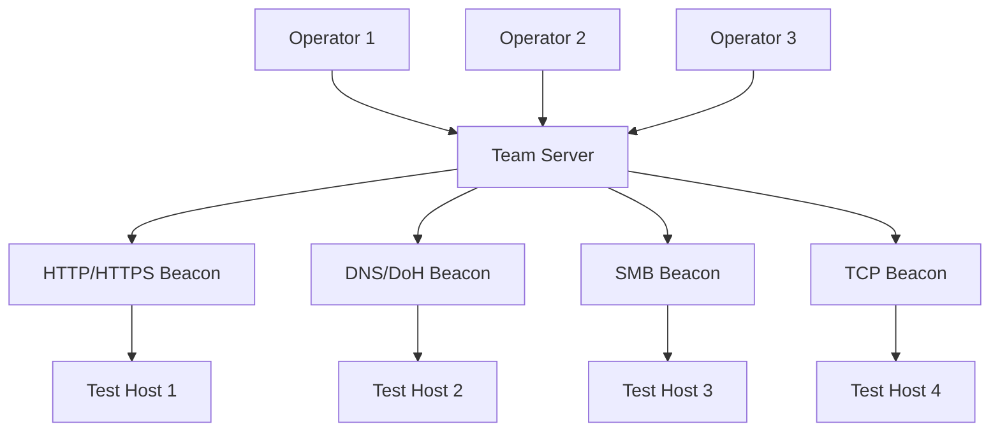
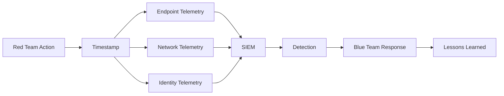
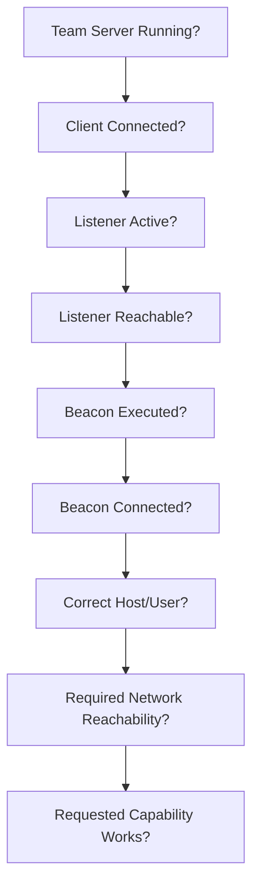

# Cobalt Strike

Cobalt Strike is a commercial adversary-simulation and red-team operations platform developed by Fortra. It provides collaborative command-and-control infrastructure, the Beacon post-exploitation agent, multiple communication channels, pivoting, Malleable C2, extensibility through Aggressor Script and Beacon Object Files (BOFs), reporting, automation, and other capabilities used during authorised security assessments.

Cobalt Strike is designed for threat-representative security testing rather than conventional vulnerability scanning.

!!! warning "Authorised Testing Only"
    Cobalt Strike provides command-and-control and post-exploitation capabilities. Use it only against systems explicitly included in an authorised security assessment. Define permitted hosts, networks, payload types, communication channels, privilege boundaries, lateral-movement actions, and cleanup requirements before deployment.

---

## Overview

A typical Cobalt Strike architecture is:

```text
Operator
    |
    v
Cobalt Strike Client
    |
    v
Team Server
    |
    v
Listener
    |
    v
Beacon
    |
    v
Authorised Test Host
```

Multiple operators can collaborate through the same Team Server:



The main operational layers are:

```text
Infrastructure
        |
        v
Team Server
        |
        v
Listener
        |
        v
Beacon
        |
        v
Session Context
        |
        v
Assessment Action
```

Keep these layers separate when troubleshooting.

---

# Official Project

Use official Cobalt Strike documentation as the primary reference.

- [Cobalt Strike](https://www.cobaltstrike.com/){ target="_blank" rel="noopener noreferrer" }
- [Cobalt Strike User Manuals](https://www.cobaltstrike.com/support/user-manuals){ target="_blank" rel="noopener noreferrer" }
- [Cobalt Strike Support](https://www.cobaltstrike.com/support){ target="_blank" rel="noopener noreferrer" }
- [Cobalt Strike Releases](https://www.cobaltstrike.com/release-page){ target="_blank" rel="noopener noreferrer" }
- [Cobalt Strike Training](https://www.cobaltstrike.com/support/training){ target="_blank" rel="noopener noreferrer" }

Cobalt Strike is commercial software.

Use only legitimate licensed copies obtained through authorised channels.

Avoid cracked or unofficial versions.

---

# Current Cobalt Strike

Modern Cobalt Strike includes considerably more functionality than older tutorials may describe.

Current capabilities include concepts such as:

```text
Beacon
Malleable C2
HTTP/HTTPS C2
DNS
DNS over HTTPS
SMB Beacon
TCP Beacon
External C2
User Defined Command and Control
Beacon Object Files
BOF-PE
Beacon Interpreter
LLVM Beacon
Payload Store
Aggressor Script
REST API
SOCKS
Port Forwarding
Pivoting
Reporting
Multiplayer
```

Always verify the installed version before relying on old command syntax or tradecraft.

---

# Architecture

The primary components are:

| Component | Purpose |
| --- | --- |
| Client | Operator graphical interface |
| Team Server | Central collaboration and C2 server |
| Listener | Defines Beacon communication |
| Beacon | Post-exploitation agent |
| Malleable C2 | Customises communication behaviour |
| Aggressor Script | Extends the client and workflows |
| BOF | Executes compact native functionality through Beacon |
| Payload Store | Central payload management |
| REST API | Automation and integration |
| SOCKS | Proxies traffic through Beacon |
| Port Forward | Forwards selected traffic |
| Reporting | Generates assessment activity reports |

---

# Team Server

The Team Server provides the central infrastructure for an engagement.

Conceptually:

```text
Team Server
├── Operator Connections
├── Listeners
├── Beacon Metadata
├── Tasks
├── Results
├── Downloads
├── Logs
└── Collaboration
```

Treat the Team Server as sensitive assessment infrastructure.

It may contain information about:

```text
Targets
Credentials
Beacon Sessions
Operator Activity
Downloaded Files
Assessment Infrastructure
```

---

# Installation

Follow the installation documentation supplied with the licensed Cobalt Strike distribution.

Before deployment, record:

```text
Version
Build
License
Server Host
Assessment
Installation Date
```

Do not place licensed installation files in public repositories.

---

# Version

Record the exact version used during an assessment.

This matters because Cobalt Strike changes frequently.

For example, functionality relating to:

```text
Beacon
BOFs
REST API
Malleable C2
Memory behaviour
Pivoting
Payload Generation
```

can differ between releases.

---

# Start the Team Server

The licensed Cobalt Strike distribution provides the Team Server launcher.

The general architecture is:

```text
Linux Server
    |
    v
Team Server
    |
    v
TCP/50050
    |
    v
Cobalt Strike Clients
```

Use the official installation manual for the exact syntax for the installed release.

Do not expose Team Server administration directly to untrusted networks when avoidable.

---

# Team Server Connectivity

Before connecting a client, validate:

```text
Team Server Running?
        |
        v
Management Port Listening?
        |
        v
Firewall Allows Operator?
        |
        v
TLS Fingerprint Verified?
        |
        v
Authentication Successful?
```

On Linux:

```bash
ss -lntp
```

Test connectivity:

```bash
nc -vz <TEAM_SERVER> 50050
```

where appropriate for the deployed configuration.

---

# Team Server Security

Protect the Team Server using:

```text
Restricted Source IPs
Host Firewall
SSH Keys
Strong Authentication
Patch Management
Minimal Services
Disk Encryption
Secure Backups
Central Logging
```

The Team Server should not be treated as a disposable anonymous VPS.

It is part of the assessment evidence chain.

---

# Client

The Cobalt Strike client provides the operator interface.

The client connects to the Team Server and allows authorised operators to:

```text
Manage Listeners
Manage Beacons
Task Beacons
View Downloads
Review Credentials
Manage Pivots
Generate Reports
Load Extensions
Collaborate
```

Operators should use individual identities where possible.

---

# Collaboration

Cobalt Strike is designed for multi-operator engagements.

Conceptually:

```text
Operator A ----+
               |
Operator B ----+--> Team Server --> Beacons
               |
Operator C ----+
```

This is useful for:

```text
Red Teams
Purple Teams
Adversary Simulations
Large Penetration Tests
Training Exercises
```

Coordinate operators carefully to avoid conflicting tasks.

---

# Listeners

Listeners define how Beacon communicates.

Listener configuration can include:

```text
Protocol
Host
Port
Profile
Domains
Proxy Behaviour
Communication Method
```

The exact options depend on the listener type and installed version.

---

# Listener Management

Before generating any test payload, create and validate the required listener.

The workflow should be:

```text
Assessment Requirement
        |
        v
Choose Transport
        |
        v
Configure Listener
        |
        v
Validate Infrastructure
        |
        v
Generate Test Payload
```

Do not generate multiple payloads simply because the first one cannot connect.

Validate the listener first.

---

# Beacon

Beacon is Cobalt Strike's primary post-exploitation agent.

Conceptually:

```text
Beacon
    |
    +--> C2 Communication
    |
    +--> Host Enumeration
    |
    +--> Task Execution
    |
    +--> File Transfer
    |
    +--> Pivoting
    |
    +--> Extensibility
```

Beacon should be viewed as:

```text
Remote Assessment Agent
```

not:

```text
Automatic Administrative Access
```

Its privileges are determined by the process and security context in which it executes.

---

# Beacon Context

When a Beacon is established, identify:

```text
Hostname
Username
Process
PID
Architecture
Integrity
Network
Transport
```

before performing additional actions.

The reasoning should be:

```text
Beacon Established
        |
        v
Host Confirmed
        |
        v
Identity Confirmed
        |
        v
Privilege Confirmed
        |
        v
Scope Confirmed
        |
        v
Action
```

---

# Beacon Commands

Beacon provides a command console.

Use:

```text
help
```

to display commands available in the installed release.

For command-specific help:

```text
help <COMMAND>
```

Do not assume commands from old Cobalt Strike tutorials still behave identically.

---

# Sleep

Beacon commonly operates asynchronously.

The:

```text
sleep
```

setting controls check-in behaviour.

Conceptually:

```text
Beacon
    |
    v
Sleep
    |
    v
Check In
    |
    v
Receive Task
    |
    v
Execute
    |
    v
Return Result
```

This affects both operational responsiveness and network behaviour.

---

# Interactive Mode

For tasks requiring responsive communication, Beacon can operate interactively.

Historically:

```text
sleep 0
```

places Beacon into interactive behaviour.

Use this only when necessary.

Interactive communication can generate substantially more network traffic.

---

# Sleep and Jitter

Beacon timing can include:

```text
Sleep
Jitter
```

Conceptually:

```text
Base Interval
        +
Timing Variation
        =
Beacon Check-In Pattern
```

Do not choose timing solely for stealth.

Consider:

```text
Assessment Objective
Network Load
Purple-Team Visibility
Operator Requirements
Test Duration
```

---

# Beacon Types

Cobalt Strike supports multiple Beacon communication methods.

Common examples include:

```text
HTTP
HTTPS
DNS
DNS over HTTPS
SMB
TCP
```

Modern versions additionally support extensible communication models such as:

```text
External C2
User Defined Command and Control
```

Different channels serve different network situations.

---

# HTTP Beacon

HTTP Beacon communicates using web requests.

Conceptually:

```text
Beacon
    |
    v
HTTP
    |
    v
Team Server
```

This can be useful where ordinary outbound web connectivity exists.

HTTP traffic remains observable to:

```text
Proxy
Firewall
IDS/IPS
EDR
Network Monitoring
```

---

# HTTPS Beacon

HTTPS adds TLS to the communication path.

Conceptually:

```text
Beacon
    |
    v
TLS
    |
    v
HTTPS
    |
    v
Team Server
```

Encryption does not make traffic invisible.

Defenders can still analyse:

```text
Destination
Certificate
TLS Behaviour
Connection Timing
Process
DNS
Traffic Volume
```

---

# DNS Beacon

DNS Beacon communicates through DNS.

Conceptually:

```text
Beacon
    |
    v
DNS Query
    |
    v
Resolver
    |
    v
Authoritative Infrastructure
    |
    v
Team Server
```

DNS C2 requires correctly configured DNS infrastructure.

Relevant considerations include:

```text
Domain Ownership
Delegation
Authoritative DNS
Resolvers
Query Types
Logging
Latency
```

---

# DNS over HTTPS

Modern Cobalt Strike supports DNS over HTTPS communication.

The architecture becomes:

```text
Beacon
    |
    v
HTTPS
    |
    v
DoH Resolver / Infrastructure
    |
    v
DNS C2
```

DoH changes the network visibility model but does not eliminate endpoint telemetry.

---

# SMB Beacon

SMB Beacon supports peer-to-peer communication.

Conceptually:

```text
Team Server
      |
      v
Beacon A
      |
      | SMB
      v
Beacon B
```

This can reduce the number of systems requiring direct outbound C2 connectivity.

It also introduces additional internal communication that defenders can monitor.

---

# TCP Beacon

TCP Beacon provides peer-to-peer communication over TCP.

Conceptually:

```text
Beacon A
    |
    v
TCP
    |
    v
Beacon B
```

This can be useful when direct Team Server connectivity is unavailable but internal network connectivity exists.

Use only within authorised networks.

---

# Peer-to-Peer C2

SMB and TCP Beacons allow chained communication.

For example:

```text
Team Server
    |
    v
HTTPS Beacon
    |
    v
SMB Beacon
    |
    v
TCP Beacon
```

The operational benefit is:

```text
Only Selected Systems Need Direct External C2
```

However, troubleshooting becomes more complex because every link matters.

---

# Peer-to-Peer Troubleshooting

Use:

```text
Parent Beacon Alive?
        |
        v
Internal Route Available?
        |
        v
Required Port Reachable?
        |
        v
Child Beacon Running?
        |
        v
Link Established?
```

If the parent disappears, dependent communication may also be affected.

---

# External C2

External C2 allows Cobalt Strike communication to be integrated with custom external communication channels.

Conceptually:

```text
Beacon
    |
    v
External C2 Interface
    |
    v
Custom Transport
    |
    v
Team Server
```

This is an advanced capability.

Use the official documentation and a controlled lab before deploying custom communication mechanisms in an assessment.

---

# User Defined Command and Control

Modern Cobalt Strike supports User Defined Command and Control concepts.

This allows custom C2 channels to integrate more directly with Beacon.

Keep custom transport development in dedicated red-team tooling notes.

The Cobalt Strike tool page should focus on the architecture:

```text
Beacon
    |
    v
Custom C2 Implementation
    |
    v
Cobalt Strike Infrastructure
```

---

# Malleable C2

Malleable C2 allows operators to define aspects of C2 communication behaviour.

A profile can influence properties associated with:

```text
HTTP
HTTPS
Headers
URIs
Data Transformation
Beacon Behaviour
Process Behaviour
Post-Exploitation Behaviour
```

The objective during an authorised assessment should be to model an agreed threat profile, not merely to create arbitrary obfuscation.

---

# Malleable C2 Model

Conceptually:

```text
Beacon Data
    |
    v
Malleable Transformation
    |
    v
Network Request
    |
    v
Team Server
    |
    v
Reverse Transformation
```

This makes communication behaviour configurable.

---

# Profile Validation

Before using a Malleable C2 profile in production, validate it.

Use the profile validation tools provided with the licensed distribution.

The workflow should be:

```text
Write Profile
        |
        v
Validate Syntax
        |
        v
Test in Lab
        |
        v
Capture Traffic
        |
        v
Confirm Behaviour
        |
        v
Deploy
```

Never deploy an untested profile directly into a production engagement.

---

# Malleable C2 and Detection

Malleable C2 does not make C2 traffic automatically invisible.

Defenders can correlate:

```text
Endpoint Process
DNS
Destination
TLS
Proxy Logs
Traffic Timing
Network Volume
Host Role
```

A realistic assessment should test whether the organisation detects the complete behaviour rather than one static signature.

---

# Payloads

Cobalt Strike can generate Beacon payloads in multiple forms.

Exact formats depend on the installed version.

Payload design should begin with:

```text
Assessment Objective
        |
        v
Target Platform
        |
        v
Architecture
        |
        v
Listener
        |
        v
Delivery Method
        |
        v
Payload Format
```

Do not select a format simply because it is available.

---

# Staged vs Stageless

Cobalt Strike supports staged and stageless payload concepts.

## Staged

```text
Initial Component
        |
        v
Retrieve Additional Component
        |
        v
Beacon
```

## Stageless

```text
Complete Beacon
        |
        v
Execution
```

Each has different:

```text
Size
Network Behaviour
Reliability
Operational Requirements
```

Detailed staged-payload design belongs in the Red Teaming notes.

---

# Payload Store

Modern Cobalt Strike provides centralised payload-management functionality through the Payload Store.

Conceptually:

```text
Generated Payload
        |
        v
Payload Store
        |
        +--> Metadata
        +--> Management
        +--> Reuse
        +--> Operator Workflow
```

This can improve consistency during multi-operator engagements.

Still maintain an independent assessment inventory of deployed files.

---

# Payload Tracking

For every deployed test artifact, record:

```text
Payload Name
Format
Architecture
Listener
Generation Time
SHA256
Target
Deployment Time
Removal Time
```

Linux hash:

```bash
sha256sum <FILE>
```

Windows:

```powershell
Get-FileHash .\<FILE> -Algorithm SHA256
```

This is important for detection validation and cleanup.

---

# Guardrails

Where available, payload guardrails can help constrain authorised test payloads to intended environments.

The defensive operational idea is:

```text
Payload
    |
    v
Environment Check
    |
    +--> Approved Environment -> Continue
    |
    +--> Unexpected Environment -> Stop
```

Guardrails should complement, not replace:

```text
Scope Control
Operator Discipline
Infrastructure Restrictions
Cleanup
```

---

# Post-Exploitation

Once Beacon is established, post-exploitation should follow an explicit objective.

A good workflow is:

```text
Beacon
    |
    v
Establish Context
    |
    v
Define Test Objective
    |
    v
Minimum Required Action
    |
    v
Evidence
    |
    v
Cleanup
```

Avoid running large numbers of commands simply because they are available.

---

# File System

Beacon provides file-system interaction capabilities.

Common concepts include:

```text
pwd
cd
ls
download
upload
```

Check:

```text
help
```

for the current release.

Treat remote file access according to assessment data-handling requirements.

---

# Downloads

Downloaded files may contain sensitive organisational information.

For each download, record:

```text
Source
Reason
Operator
Timestamp
Storage Location
Retention
Deletion
```

Do not download entire directories when a single proof file is sufficient.

---

# Uploads

Before uploading a test file, record its hash:

```bash
sha256sum <FILE>
```

After transfer:

```powershell
Get-FileHash C:\Path\To\<FILE> -Algorithm SHA256
```

Matching hashes provide evidence that the expected assessment file was transferred.

---

# Process Information

Process information can help determine:

```text
Current Context
Architecture
Security Products
Applications
Potential Assessment Targets
```

Do not terminate or manipulate security processes merely because they are visible.

Detection and prevention may be the intended assessment result.

---

# Native Commands

Beacon can invoke operating-system functionality through several mechanisms depending on the task.

Always understand the telemetry generated by a command.

The reasoning should be:

```text
Operator Command
        |
        v
Beacon Implementation
        |
        v
Windows API / Process / Shell
        |
        v
Endpoint Telemetry
```

Two commands producing the same visible output may generate very different telemetry.

---

# Beacon Object Files

Beacon Object Files provide a mechanism for running compact native functionality within Beacon.

Conceptually:

```text
Operator
    |
    v
BOF
    |
    v
Beacon
    |
    v
Native Functionality
```

BOFs are useful because they extend Beacon without requiring every capability to exist permanently in the core agent.

---

# BOF Operational Model

The important distinction is:

```text
Traditional External Tool
        |
        v
New Process / Separate Executable

versus

BOF
        |
        v
Beacon-Integrated Execution
```

This changes telemetry but does not remove telemetry.

Memory, API, network and behavioural monitoring can still detect activity.

---

# BOF-PE

Modern Cobalt Strike includes BOF-PE support.

This extends Beacon's BOF ecosystem to support additional PE-oriented development workflows.

Treat BOF-PE code as executable assessment tooling.

Apply the same review process as any other extension:

```text
Source
        |
        v
Code Review
        |
        v
Compile
        |
        v
Lab Test
        |
        v
Authorised Deployment
```

---

# Beacon Interpreter

Modern Cobalt Strike includes Beacon Interpreter functionality.

This provides a mechanism for executing supported scriptable C functionality through Beacon.

Treat interpreted functionality as code execution.

Review and test any custom code before use against production systems.

---

# LLVM Beacon

Modern releases include an LLVM-based Beacon implementation.

This provides an alternative Beacon build architecture.

Do not assume different compilation automatically means:

```text
Undetectable
```

Defenders can detect:

```text
Behaviour
Memory
Network
Process Activity
C2
```

independent of compiler choice.

---

# Aggressor Script

Aggressor Script extends the Cobalt Strike client.

It can be used for:

```text
Custom Commands
Automation
Menus
Event Handling
Workflow Integration
Data Processing
```

Treat Aggressor scripts as executable code.

---

# Aggressor Script Safety

Before loading a third-party script:

```text
Identify Source
        |
        v
Review Code
        |
        v
Understand Commands
        |
        v
Test in Lab
        |
        v
Load
```

Do not automatically load large public script collections into assessment infrastructure.

---

# Community Kit

Cobalt Strike maintains a Community Kit containing community-developed resources.

Use community content as:

```text
Reference
Extension
Research
```

not as automatically trusted production tooling.

Review every third-party component before use.

---

# REST API

Modern Cobalt Strike provides REST API functionality for automation and integration.

Conceptually:

```text
Automation
    |
    v
REST API
    |
    v
Team Server
    |
    v
Cobalt Strike Operations
```

Potential uses include:

```text
Automation
Task Tracking
Artifact Management
Custom Clients
Integration
Reporting
```

Protect API credentials as privileged assessment credentials.

---

# API Security

Apply:

```text
Restricted Network Access
Strong Authentication
TLS
Credential Rotation
Audit Logging
Least Privilege
```

where supported.

Do not expose the Cobalt Strike REST API broadly to the Internet.

---

# Task Tracking

Modern releases associate task identifiers with operator tasks and responses.

This is useful for:

```text
Automation
Evidence
Troubleshooting
Auditability
```

Where possible, preserve task IDs alongside significant assessment evidence.

---

# Pivoting

Beacon can act as a pivot point for authorised internal network access.

Before pivoting:

```text
Identify Internal Network
        |
        v
Confirm Scope
        |
        v
Confirm Beacon Reachability
        |
        v
Choose Pivot Method
        |
        v
Validate One Service
        |
        v
Expand Only if Required
```

---

# SOCKS Proxy

Beacon supports SOCKS pivoting.

Use:

```text
help socks
```

for the exact syntax of the installed release.

A common conceptual workflow is:

```text
Operator Tool
    |
    v
SOCKS Proxy on Team Server
    |
    v
Beacon
    |
    v
Internal Target
```

Modern Cobalt Strike supports SOCKS4/SOCKS5 functionality.

---

# SOCKS Example

A common lab-style command is:

```text
socks 8080
```

Use the installed version's:

```text
help socks
```

before relying on additional arguments.

Review configured pivots through the Cobalt Strike proxy/pivot view.

---

# SOCKS5

Modern versions support SOCKS5 functionality, including authentication and logging options depending on release.

Always inspect:

```text
help socks
```

because syntax has evolved.

Do not expose an unauthenticated SOCKS service to an untrusted network.

---

# Stop SOCKS

Use the current command help to stop the SOCKS server.

Historically:

```text
socks stop
```

is used to terminate the associated proxy.

Verify that the listener is actually removed after cleanup.

---

# ProxyChains

A Cobalt Strike SOCKS listener can be used with ProxyChains.

Example `/etc/proxychains4.conf` entry:

```text
socks5 127.0.0.1 8080
```

Test a specific service:

```bash
proxychains4 nc -vz <TARGET> <PORT>
```

Do not start with broad scanning.

---

# Nmap Through Beacon SOCKS

Use TCP connect scanning when operating Nmap through an application-layer SOCKS proxy.

Example:

```bash
proxychains4 nmap -sT -Pn -p 80,443,445,3389 <TARGET>
```

Avoid raw SYN assumptions through SOCKS.

The path is:

```text
Nmap
    |
    v
connect()
    |
    v
ProxyChains
    |
    v
SOCKS
    |
    v
Beacon
    |
    v
Target
```

---

# Pivot Performance

SOCKS traffic becomes Beacon tasks.

Therefore Beacon timing affects pivot responsiveness.

Conceptually:

```text
Application Request
        |
        v
SOCKS
        |
        v
Beacon Task
        |
        v
Beacon Check-In
        |
        v
Internal Connection
```

A long sleep interval can make interactive pivoting impractical.

---

# Port Forwarding

Cobalt Strike supports port-forwarding capabilities.

Use:

```text
help portfwd
```

and related command help for the installed version.

Port forwarding is useful when:

```text
One Service
+
One Target
```

needs to be exposed.

---

# SOCKS vs Port Forward

Use:

```text
Single Service
        |
        +--> Port Forward

Multiple TCP Services
        |
        +--> SOCKS

Broad Routed Network
        |
        +--> Ligolo-ng
```

Do not use a complex pivot when a simple forward is sufficient.

---

# Reverse Port Forwarding

Reverse port forwarding allows a listening service on the Beacon side of the network path to forward connections elsewhere.

This can be useful for controlled testing where inbound internal connectivity must reach authorised assessment infrastructure.

Use the installed command help before configuring it.

Always record:

```text
Listening Host
Listening Port
Destination Host
Destination Port
Purpose
Cleanup
```

---

# Ligolo-ng vs Cobalt Strike Pivoting

Cobalt Strike pivoting is integrated into Beacon.

Ligolo-ng is purpose-built for routed tunnelling.

Use Cobalt Strike when:

```text
Beacon Already Exists
+
Limited Internal Access Required
```

Use Ligolo-ng when:

```text
Broad Routed Network Access
+
Many Tools
+
Many Services
```

is required.

See:

[Ligolo-ng](ligolo-ng.md)

---

# Chisel vs Cobalt Strike

Chisel provides lightweight HTTP/WebSocket tunnelling.

Cobalt Strike provides pivoting as part of a larger C2 framework.

Use the simplest tool appropriate to the objective.

See:

[Chisel](chisel.md)

---

# Active Directory

Cobalt Strike can provide the operator channel during an Active Directory assessment.

However, AD-specific methodology should remain in the dedicated AD notes.

Conceptually:

```text
Beacon
    |
    v
Domain Context
    |
    v
Dedicated AD Assessment Tool
    |
    v
Security Finding
```

Examples include:

```text
BloodHound
NetExec
Impacket
Rubeus
Certify
Certipy
```

---

# Rubeus

Rubeus specialises in Kerberos assessment.

Cobalt Strike provides the remote operational channel.

Keep the security reasoning separate:

```text
Beacon
    |
    v
Rubeus Test
    |
    v
Kerberos Behaviour
    |
    v
Security Conclusion
```

See:

[Rubeus](rubeus.md)

---

# Mimikatz

Mimikatz focuses on Windows authentication and credential security.

Cobalt Strike is the C2 framework.

The relationship is:

```text
Cobalt Strike
        |
        +--> Remote Operator Channel

Mimikatz
        |
        +--> Authentication Security Testing
```

See:

[Mimikatz](mimikatz.md)

---

# AD CS

Use Certify and Certipy for dedicated AD CS assessment.

See:

[Certify](certify.md)

and:

[Certipy](certipy.md)

Do not duplicate their complete workflows inside the Cobalt Strike page.

---

# BloodHound

BloodHound is better suited to relationship and attack-path analysis.

Cobalt Strike can provide host access during the assessment, but the graph analysis remains a separate stage.

See:

[BloodHound](bloodhound.md)

---

# Privilege Escalation

A Beacon running as a normal user does not imply privilege escalation.

Always distinguish:

```text
Beacon Running
        |
        v
Current User
        |
        v
Current Token
        |
        v
Current Integrity
```

from:

```text
Administrator / SYSTEM
```

Use the dedicated Windows privilege-escalation methodology for analysing elevation candidates.

---

# Lateral Movement

Cobalt Strike supports workflows associated with lateral movement, but a successful remote connection does not by itself explain why lateral movement was possible.

The finding should identify:

```text
Credential / Trust
        |
        v
Remote Access Permission
        |
        v
Reachable Service
        |
        v
Execution
        |
        v
New Security Context
```

Detailed lateral-movement techniques belong in the Active Directory and Windows notes.

---

# Credentials

Cobalt Strike can maintain credential information discovered during an assessment.

Treat this data as highly sensitive.

Credential material should not be:

```text
Committed to Git
Included in screenshots unnecessarily
Copied into normal notes
Retained after the engagement without need
```

Follow the assessment data-retention policy.

---

# BOFs and Tool Integration

Modern Cobalt Strike ecosystems commonly use BOFs for focused functionality.

The operational model should remain:

```text
Need Identified
        |
        v
Tool / BOF Selected
        |
        v
Source Reviewed
        |
        v
Lab Tested
        |
        v
Authorised Execution
        |
        v
Evidence
```

Avoid turning Beacon into a collection of unreviewed third-party code.

---

# Detection

Cobalt Strike should be evaluated across multiple telemetry layers.

```text
Endpoint
+
Network
+
DNS
+
Identity
+
Application Control
+
SIEM
```

Detection based solely on:

```text
cobaltstrike.exe
```

or one static Beacon signature is insufficient.

---

# Endpoint Detection

Potential telemetry includes:

```text
Process Creation
Process Access
Memory Allocation
Thread Creation
Module Loads
File Creation
Registry Activity
Network Connections
Named Pipes
Token Activity
```

Relevant sources may include:

```text
EDR
Microsoft Defender
Sysmon
Windows Security Logs
ETW
Application Control
```

---

# Network Detection

Potential signals include:

```text
Periodic Beaconing
Unexpected Destinations
Unusual TLS
DNS Patterns
Long-Lived Connections
Peer-to-Peer Internal C2
SOCKS Traffic
Port Forwarding
```

Always consider the expected network behaviour of the affected host.

---

# DNS Detection

DNS-based Beacon communication can produce behavioural signals involving:

```text
Query Frequency
Subdomain Structure
Record Types
Authoritative Domain
Response Patterns
Query Volume
```

Do not use one simplistic DNS pattern as the only detection mechanism.

---

# SMB Beacon Detection

Potential telemetry includes:

```text
Named Pipes
SMB Connections
Internal Host-to-Host Traffic
Process Activity
Authentication Events
```

Correlating endpoint and network telemetry provides stronger detection than either source alone.

---

# TCP Beacon Detection

TCP peer-to-peer C2 may create unusual internal listeners and connections.

Review:

```text
Listening Ports
Process Owning Listener
Source Host
Destination Host
Connection Duration
Host Role
```

---

# Malleable C2 Detection

Malleable C2 changes network characteristics but does not eliminate behaviour.

Correlate:

```text
Process
        +
Destination
        +
DNS
        +
TLS
        +
Timing
        +
Host Role
```

rather than relying only on HTTP strings.

---

# Memory Detection

Beacon operates in memory and can therefore be visible to:

```text
EDR
Memory Scanners
ETW
API Monitoring
Call-Stack Analysis
Behavioural Analytics
```

Do not assume:

```text
In Memory
```

means:

```text
Invisible
```

---

# Application Control

Controls may include:

```text
WDAC
AppLocker
Defender
EDR
ASR
```

If a test artifact is blocked:

```text
Execution Attempt
        |
        v
Observed Failure
        |
        v
Collect Telemetry
        |
        v
Identify Enforcing Control
        |
        v
Validate Effective Policy
```

Do not automatically move to evasion.

The block may be the desired assessment result.

---

# Purple-Team Use

Cobalt Strike is particularly useful for controlled purple-team exercises.

For each action, record:

```text
Action
Host
User
Timestamp
Expected Telemetry
Observed Telemetry
Detection
Alert
Response
```

The workflow becomes:



This produces far more value than simply asking whether Beacon executed.

---

# Evidence Collection

Useful Cobalt Strike evidence includes:

- Cobalt Strike version
- Team Server identifier
- Operator
- Listener
- Beacon ID
- Beacon transport
- Target hostname
- Target username
- Process
- PID
- Architecture
- Payload SHA256
- Connection timestamp
- Task ID where available
- Pivot configuration
- Detection result
- Cleanup timestamp

A strong evidence chain is:

```text
Authorised Artifact
        |
        v
Execution
        |
        v
Beacon Established
        |
        v
Security Context Confirmed
        |
        v
Approved Action
        |
        v
Telemetry
        |
        v
Security Conclusion
```

---

# Reporting

Cobalt Strike provides reporting functionality.

Reports may include information about:

```text
Activities
Sessions
Hosts
Credentials
Indicators
Operator Actions
```

Generated reports should be reviewed manually.

A tool-generated activity report is not a substitute for:

```text
Finding Analysis
Risk Assessment
Evidence Validation
Recommendation
```

---

# Logs

Preserve Team Server and engagement logs according to the assessment evidence policy.

Modern task identifiers can improve correlation between:

```text
Operator Command
        |
        v
Beacon Task
        |
        v
Returned Output
        |
        v
Endpoint / Network Telemetry
```

This is especially useful during purple-team exercises.

---

# Troubleshooting

Use a layered approach.



---

# Beacon Does Not Connect

Check:

```text
Correct Listener?
Correct Host?
Correct Port?
DNS?
Firewall?
Proxy?
TLS?
Malleable C2?
Team Server?
```

Windows connectivity test:

```powershell
Test-NetConnection <C2_HOST> -Port <PORT>
```

Linux:

```bash
nc -vz <C2_HOST> <PORT>
```

Validate infrastructure before regenerating payloads.

---

# HTTPS Problems

Review:

```text
DNS
Certificate
Listener
Port
Redirector
Proxy
TLS
Firewall
```

A successful TCP connection to:

```text
443
```

does not prove the complete HTTPS C2 path works.

---

# DNS Beacon Problems

Validate:

```text
Domain Delegation
Authoritative DNS
Resolver
Firewall
Query Type
Listener
```

Use normal DNS tooling before changing Beacon configuration.

For example:

```bash
dig <DOMAIN>
```

and:

```bash
dig NS <DOMAIN>
```

---

# Beacon Is Slow

Check:

```text
Sleep
Jitter
Transport
Network Latency
Parent Beacon
Pivot
Task Queue
```

A sleeping Beacon will naturally delay interactive operations.

---

# SOCKS Is Slow

Remember:

```text
SOCKS Request
        |
        v
Beacon Task
        |
        v
Beacon Check-In
        |
        v
Internal Connection
```

Increase responsiveness only when necessary for the test.

---

# Pivot Target Unreachable

First verify the Beacon itself can reach the destination.

The correct model is:

```text
Beacon Reachability
        |
        v
SOCKS / Forwarding
        |
        v
Operator Tool
```

A pivot cannot create network reachability that the Beacon does not possess.

---

# Peer-to-Peer Beacon Missing

Check:

```text
Parent Alive?
Child Running?
Port Reachable?
Named Pipe / TCP Listener Available?
Correct Link?
Firewall?
```

Troubleshoot the immediate parent-child relationship.

---

# Security Interpretation

Avoid reporting:

```text
Cobalt Strike worked.
```

Instead explain the control boundary.

For example:

```text
A test executable launched successfully from a user-writable
directory under a standard-user context and established outbound
HTTPS command-and-control to external assessment infrastructure.
No endpoint prevention control blocked execution or the outbound
connection during the test window.
```

Then separately establish whether:

```text
EDR Alerted
SOC Detected
Firewall Logged
Proxy Logged
Incident Response Triggered
```

---

# Detection vs Prevention

Keep these separate:

```text
Execution Prevented
```

```text
Execution Allowed but Detected
```

```text
Execution Allowed and Not Detected
```

```text
C2 Blocked
```

```text
C2 Allowed but Alerted
```

These represent different control outcomes.

---

# Operational Safety

During production assessments:

- Use licensed Cobalt Strike
- Confirm scope before deployment
- Use identifiable test artifacts where practical
- Record generated payload hashes
- Track every Beacon
- Avoid unnecessary persistence
- Avoid unrelated data collection
- Avoid uncontrolled credential access
- Avoid uncontrolled lateral movement
- Limit pivot networks
- Coordinate operators
- Record timestamps
- Protect downloaded data
- Stop unused listeners
- Remove deployed artifacts
- Confirm cleanup

---

# Cleanup

Cleanup should cover:

```text
Target Hosts
+
Team Server
+
Operator Systems
+
Redirectors
```

where applicable.

---

## Beacon Cleanup

For each deployed Beacon, record:

```text
Host
User
Process
Payload
Persistence
Temporary Files
Pivot
Cleanup Status
```

Terminate test processes only after confirming no other authorised testing depends on them.

---

## File Cleanup

Identify test artifacts before deletion.

Windows:

```powershell
Get-ChildItem C:\Path\To\Test -File
```

Hash if necessary:

```powershell
Get-FileHash C:\Path\To\Test\<FILE> -Algorithm SHA256
```

Then remove only known assessment files.

---

## Pivot Cleanup

Review:

```text
SOCKS
Port Forwards
Reverse Port Forwards
Peer-to-Peer Links
```

and stop those no longer required.

Confirm local listeners are gone.

Linux:

```bash
ss -lntp
```

---

## Infrastructure Cleanup

Review:

```text
Listeners
Web Servers
Payloads
Downloaded Files
Operator Accounts
API Tokens
Redirectors
DNS Records
```

Remove temporary infrastructure according to the engagement plan.

---

# Quick Reference

## Team Server Listener Check

```bash
ss -lntp
```

## Test Team Server Connectivity

```bash
nc -vz <TEAM_SERVER> 50050
```

## Beacon Help

```text
help
```

## Command Help

```text
help <COMMAND>
```

## Interactive Beacon

```text
sleep 0
```

## SOCKS Help

```text
help socks
```

## Start Basic SOCKS

```text
socks 8080
```

## Stop SOCKS

```text
socks stop
```

## Port Forward Help

```text
help portfwd
```

## ProxyChains Configuration

```text
socks5 127.0.0.1 8080
```

## ProxyChains Connectivity Test

```bash
proxychains4 nc -vz <TARGET> <PORT>
```

## Nmap Through SOCKS

```bash
proxychains4 nmap -sT -Pn -p 80,443,445,3389 <TARGET>
```

## Windows Connectivity

```powershell
Test-NetConnection <HOST> -Port <PORT>
```

## Linux Connectivity

```bash
nc -vz <HOST> <PORT>
```

## Linux File Hash

```bash
sha256sum <FILE>
```

## Windows File Hash

```powershell
Get-FileHash .\<FILE> -Algorithm SHA256
```

## DNS

```bash
dig <DOMAIN>
```

## Name Servers

```bash
dig NS <DOMAIN>
```

---

# Common Mistakes

## Using Cracked Cobalt Strike

Use only licensed software from authorised sources.

Unofficial distributions may contain backdoors or modified components.

---

## Treating Beacon as SYSTEM

Always establish the actual security context.

---

## Generating Payloads Before Validating the Listener

Validate infrastructure first.

---

## Regenerating Payloads When the Firewall Is the Problem

Test connectivity before changing the artifact.

---

## Assuming HTTPS Is Invisible

TLS encrypts content but does not remove:

```text
Process
Destination
Timing
DNS
Certificate
Network Metadata
```

---

## Treating Malleable C2 as Automatic Evasion

Profiles change communication characteristics.

They do not eliminate behavioural detection.

---

## Treating In-Memory Execution as Invisible

Memory activity can still be monitored.

---

## Loading Unreviewed Aggressor Scripts

Third-party extensions execute code in trusted assessment infrastructure.

Review them.

---

## Running Every BOF Available

Use only functionality required for the assessment objective.

---

## Using SOCKS for Everything

For broad routed access, Ligolo-ng may provide a cleaner network model.

---

## SYN Scanning Through SOCKS

Prefer:

```text
-sT
```

with ProxyChains.

---

## Forgetting Beacon Sleep

Long sleep intervals can make pivoting and troubleshooting appear broken.

---

## Ignoring Peer-to-Peer Dependencies

Child Beacons may depend on parent Beacons.

Document the chain.

---

## Bypassing a Working Security Control Automatically

A blocked payload may already provide the required evidence.

Evasion is a separate test objective.

---

## Leaving C2 Infrastructure Running

Stop unused listeners and remove temporary infrastructure after the engagement.

---

# Assessment Checklist

## Preparation

- [ ] Cobalt Strike licence confirmed
- [ ] C2 testing authorised
- [ ] Target hosts defined
- [ ] Target networks defined
- [ ] Allowed communication channels defined
- [ ] Cobalt Strike version recorded
- [ ] Team Server secured
- [ ] Operators defined
- [ ] Cleanup plan documented

## Infrastructure

- [ ] Team Server running
- [ ] Operator connectivity confirmed
- [ ] Listener configured
- [ ] Listener validated
- [ ] Firewall reviewed
- [ ] DNS configured where required
- [ ] TLS configured where required
- [ ] Redirectors documented where used

## Payload

- [ ] Target OS confirmed
- [ ] Architecture confirmed
- [ ] Listener confirmed
- [ ] Payload format selected
- [ ] Payload generated
- [ ] SHA256 recorded
- [ ] Payload identifier recorded
- [ ] Guardrails considered
- [ ] Deployment method authorised

## Beacon

- [ ] Beacon established
- [ ] Hostname confirmed
- [ ] Username confirmed
- [ ] PID recorded
- [ ] Architecture confirmed
- [ ] Privilege context confirmed
- [ ] Transport recorded
- [ ] Timestamp recorded

## Pivoting

- [ ] Internal network identified
- [ ] Scope confirmed
- [ ] Beacon reachability confirmed
- [ ] Pivot method selected
- [ ] SOCKS/forward configured
- [ ] Specific service validated
- [ ] DNS behaviour validated
- [ ] Pivot documented

## Extensions

- [ ] Aggressor scripts reviewed
- [ ] BOFs reviewed
- [ ] Third-party tools reviewed
- [ ] Versions recorded
- [ ] Sources recorded
- [ ] Lab validation completed

## Purple Team

- [ ] Test objective defined
- [ ] Expected telemetry defined
- [ ] Exact timestamp captured
- [ ] Endpoint telemetry reviewed
- [ ] Network telemetry reviewed
- [ ] Identity telemetry reviewed
- [ ] SIEM alert reviewed
- [ ] SOC response reviewed
- [ ] Detection gap documented

## Evidence

- [ ] Cobalt Strike version recorded
- [ ] Listener recorded
- [ ] Beacon ID recorded
- [ ] Payload hash recorded
- [ ] Host/user context recorded
- [ ] Task IDs recorded where available
- [ ] Security-control result captured
- [ ] Sensitive data minimised
- [ ] Security conclusion documented

## Cleanup

- [ ] Beacon processes terminated
- [ ] Test artifacts removed
- [ ] Temporary files removed
- [ ] SOCKS proxies stopped
- [ ] Port forwards stopped
- [ ] Peer-to-peer links reviewed
- [ ] Persistence removed
- [ ] Listeners reviewed
- [ ] Temporary web services stopped
- [ ] Redirectors removed where appropriate
- [ ] DNS records cleaned up
- [ ] API tokens reviewed
- [ ] Downloaded data handled correctly
- [ ] Cleanup documented

---

# Related Notes

- [Sliver](sliver.md)
- [Ligolo-ng](ligolo-ng.md)
- [Chisel](chisel.md)
- [Mimikatz](mimikatz.md)
- [Rubeus](rubeus.md)
- [Certify](certify.md)
- [Certipy](certipy.md)
- [BloodHound](bloodhound.md)
- [Impacket](impacket.md)
- [NetExec](netexec.md)
- [PowerShell](powershell.md)
- [Active Directory](../active-directory/index.md)
- [Windows](../windows/index.md)
- [Linux](../linux/index.md)

Planned related material:

```text
red-teaming/custom-tooling.md
red-teaming/payload-delivery.md
red-teaming/staged-payloads.md
red-teaming/dll-hijacking.md
red-teaming/evasion/
cheatsheets/sliver.md
```

---

# References

- [Cobalt Strike](https://www.cobaltstrike.com/){ target="_blank" rel="noopener noreferrer" }
- [Cobalt Strike User Manuals](https://www.cobaltstrike.com/support/user-manuals){ target="_blank" rel="noopener noreferrer" }
- [Cobalt Strike Support](https://www.cobaltstrike.com/support){ target="_blank" rel="noopener noreferrer" }
- [Cobalt Strike Releases](https://www.cobaltstrike.com/release-page){ target="_blank" rel="noopener noreferrer" }
- [Cobalt Strike Training](https://www.cobaltstrike.com/support/training){ target="_blank" rel="noopener noreferrer" }
- [MITRE ATT&CK - Command and Control](https://attack.mitre.org/tactics/TA0011/){ target="_blank" rel="noopener noreferrer" }
- [MITRE ATT&CK - Application Layer Protocol](https://attack.mitre.org/techniques/T1071/){ target="_blank" rel="noopener noreferrer" }
- [MITRE ATT&CK - Proxy](https://attack.mitre.org/techniques/T1090/){ target="_blank" rel="noopener noreferrer" }
- [MITRE ATT&CK - Remote Services](https://attack.mitre.org/techniques/T1021/){ target="_blank" rel="noopener noreferrer" }
