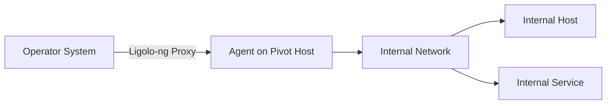
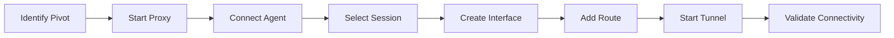
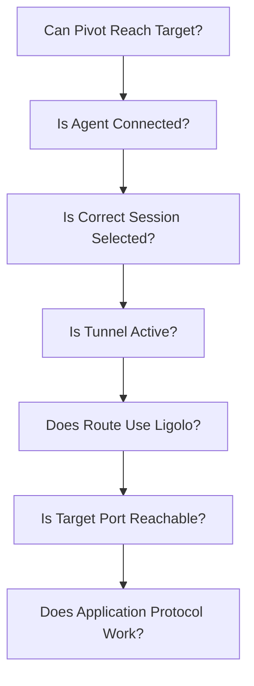

# Ligolo-ng

Ligolo-ng is a tunnelling and pivoting tool that provides access to networks reachable from an authorised pivot host but not directly reachable from the operator system.

Unlike traditional SOCKS-based pivoting, Ligolo-ng uses a TUN interface and a userland network stack. Traffic sent through the TUN interface is translated and forwarded through the Ligolo-ng agent, allowing many tools to interact with remote networks using normal IP routing without requiring ProxyChains.

!!! warning "Authorised Testing Only"
Use Ligolo-ng only on systems and networks for which you have explicit authorisation. A successful pivot may expose additional network segments that are outside the approved assessment scope.

---

## Overview

A typical Ligolo-ng deployment consists of:

| Component     | Location        | Purpose                                                                 |
| ------------- | --------------- | ----------------------------------------------------------------------- |
| Proxy         | Operator system | Accepts agent connections and manages tunnels                           |
| Agent         | Pivot host      | Connects to the proxy and provides access to reachable networks         |
| TUN interface | Operator system | Presents tunneled networks to the local routing stack                   |
| Route         | Operator system | Directs selected destination networks through Ligolo-ng                 |
| Listener      | Agent host      | Exposes a listening socket and redirects connections through the tunnel |

The basic architecture is:



Conceptually:

```text
Operator Tool
     |
     v
Operating System Routing
     |
     v
Ligolo TUN Interface
     |
     v
Ligolo-ng Proxy
     |
     v
Ligolo-ng Agent
     |
     v
Internal Network
```

This is the main difference between Ligolo-ng and SOCKS-based tools such as Chisel.

---

# When to Use Ligolo-ng

Ligolo-ng is useful when an authorised assessment reaches a host that has access to another network.

For example:

```text
Operator
10.10.14.10
     |
     v
Pivot Host
10.10.10.25
172.16.20.10
     |
     v
Internal Network
172.16.20.0/24
```

The operator cannot directly reach:

```text
172.16.20.0/24
```

but the pivot host can.

Ligolo-ng can provide a route from the operator system through that host into the internal network.

Common use cases include:

* internal network enumeration
* segmented network assessments
* Active Directory assessments
* accessing internal web applications
* reaching management networks
* reaching services behind a pivot host
* multi-network lab environments
* authorised lateral-movement testing
* multi-hop pivoting
* exposing selected services through listeners

---

# Core Architecture

Ligolo-ng uses a reverse TCP/TLS connection between the agent and proxy.

```text
Pivot Host
    |
    | outbound TCP/TLS
    v
Ligolo-ng Proxy
```

The operator-side proxy creates or uses a TUN interface.

Traffic directed to that interface is passed through Ligolo-ng and translated into network operations on the agent.

For TCP, the simplified flow is:

```text
Application
    |
    v
TCP SYN
    |
    v
TUN Interface
    |
    v
Ligolo-ng Proxy
    |
    v
Agent connect()
    |
    v
Remote Service
```

This is why many applications can communicate through Ligolo-ng without SOCKS support.

---

# Supported Traffic

Ligolo-ng supports:

* TCP
* UDP
* ICMP echo requests

However, Ligolo-ng does not behave exactly like a directly connected Layer 2 network.

The agent operates without requiring administrative/root privileges and therefore cannot simply forward arbitrary raw packets.

This distinction is particularly important when using tools such as Nmap.

---

# Modern Ligolo-ng Features

Modern Ligolo-ng releases provide functionality beyond the original basic TUN workflow.

Relevant features include:

```text
Ligolo-ng
├── TUN-based routing
├── Automatic interface management
├── Autoroute
├── Multiple tunnels
├── Agent listeners
├── Reverse and bind connections
├── TCP support
├── UDP support
├── ICMP echo support
├── Configuration files
├── Automatic recovery
├── Auto-bind
├── Daemon mode
├── Web API
├── Web interface
├── WebSocket support
└── Remote agent termination
```

The exact commands available depend on the installed version.

Check:

```text
help
```

from the Ligolo-ng console whenever syntax differs from older documentation.

---

# Installation

Use the official Ligolo-ng project and releases.

The project provides separate binaries for the proxy and agent.

Typical files are similar to:

```text
proxy
agent
```

or platform-specific equivalents.

Official project:

[Official Ligolo-ng GitHub Repository](https://github.com/nicocha30/ligolo-ng){ target="_blank" rel="noopener noreferrer" }

Official documentation:

[Ligolo-ng Documentation](https://docs.ligolo.ng/){ target="_blank" rel="noopener noreferrer" }

Official releases:

[Ligolo-ng Releases](https://github.com/nicocha30/ligolo-ng/releases){ target="_blank" rel="noopener noreferrer" }

---

# Basic Workflow

A standard Ligolo-ng pivot consists of:



The investigation sequence should be:

```text
1. Identify the pivot network interfaces
2. Determine the network that is not directly reachable
3. Start the Ligolo-ng proxy
4. Connect the Ligolo-ng agent
5. Select the agent session
6. Create or select a TUN interface
7. Add only the required route
8. Start the tunnel
9. Validate routing
10. Validate a known service
```

---

# Start the Proxy

On the operator system:

```bash
sudo ./proxy -selfcert
```

The default listening port commonly used by Ligolo-ng is:

```text
11601/tcp
```

A custom listening address can also be configured.

Example:

```bash
sudo ./proxy -selfcert -laddr 0.0.0.0:11601
```

Verify that the proxy is listening:

```bash
ss -lntp
```

or:

```bash
sudo lsof -i -P -n | grep LISTEN
```

---

# TLS Options

Ligolo-ng supports several certificate configurations.

Common approaches include:

* automatic Let's Encrypt certificates
* custom certificates
* automatically generated self-signed certificates

For a controlled lab or assessment environment:

```bash
sudo ./proxy -selfcert
```

The corresponding agent may use:

```text
-ignore-cert
```

when connecting to the self-signed proxy.

!!! note
Disabling certificate validation is convenient during controlled testing but removes normal server certificate verification. Use validated certificates where the assessment environment allows it.

---

# Connect the Agent

## Linux Agent

```bash
./agent -connect <PROXY_IP>:11601 -ignore-cert
```

Example:

```bash
./agent -connect 10.10.14.10:11601 -ignore-cert
```

## Windows Agent

```powershell
.\agent.exe -connect <PROXY_IP>:11601 -ignore-cert
```

Example:

```powershell
.\agent.exe -connect 10.10.14.10:11601 -ignore-cert
```

The connection direction is:

```text
Pivot
  |
  | outbound connection
  v
Proxy
```

This can be useful when the operator cannot initiate inbound connections to the pivot but the pivot is allowed to make outbound connections.

---

# Inspect Sessions

Once an agent connects, inspect available sessions:

```text
session
```

Select the appropriate agent.

Before creating routes, identify:

* hostname
* username
* operating system
* network interfaces
* reachable networks
* intended pivot network

Do not assume that every network visible from the pivot is within assessment scope.

---

# Identify Networks on the Pivot

## Linux

```bash
ip addr
```

```bash
ip route
```

Alternative:

```bash
ip -br addr
```

## Windows

```powershell
ipconfig /all
```

```powershell
route print
```

Example:

```text
Ethernet0
10.10.10.25/24

Ethernet1
172.16.20.10/24
```

This suggests the pivot has interfaces in:

```text
10.10.10.0/24
172.16.20.0/24
```

If the operator already reaches `10.10.10.0/24` but cannot reach `172.16.20.0/24`, the second network is a potential pivot route.

---

# Create the TUN Interface

Modern Ligolo-ng versions can create interfaces directly from the Ligolo-ng console.

Example:

```text
interface_create --name ligolo
```

Inspect available interfaces:

```text
interface_list
```

The exact available commands should always be confirmed with:

```text
help
```

---

# Manual Linux TUN Setup

Older workflows or environments where manual interface management is preferred can create the TUN interface directly.

```bash
sudo ip tuntap add user "$(whoami)" mode tun ligolo
```

Bring the interface up:

```bash
sudo ip link set ligolo up
```

Verify:

```bash
ip addr show ligolo
```

or:

```bash
ip link show ligolo
```

---

# Add a Route

Assume the internal network is:

```text
172.16.20.0/24
```

Modern Ligolo-ng versions support managed routing.

Within the Ligolo-ng console, inspect:

```text
help
```

and use the available route-management commands.

A common managed-routing command is:

```text
route_add --name ligolo --route 172.16.20.0/24
```

Where automatic route discovery is appropriate, modern Ligolo-ng also provides autoroute functionality.

Inspect the installed version:

```text
autoroute
```

and:

```text
help
```

before applying routes.

---

# Manual Route Setup

For a manually created Linux TUN interface:

```bash
sudo ip route add 172.16.20.0/24 dev ligolo
```

Verify:

```bash
ip route
```

Expected:

```text
172.16.20.0/24 dev ligolo
```

Check how a specific destination will be routed:

```bash
ip route get 172.16.20.15
```

The output should show the Ligolo interface.

---

# Start the Tunnel

Select the correct session:

```text
session
```

Then start tunnelling using the command available in the installed Ligolo-ng version.

Common console workflow:

```text
start
```

Verify the session and tunnel state before beginning further testing.

The resulting path is:

```text
Operator
   |
   v
TUN Interface
   |
   v
Ligolo Proxy
   |
   v
Ligolo Agent
   |
   v
Internal Network
```

---

# Verify the Route

Before running larger scans, test a known authorised destination.

Check routing first:

```bash
ip route get 172.16.20.15
```

Then test connectivity.

For TCP:

```bash
nc -vz 172.16.20.15 445
```

For HTTP:

```bash
curl -I http://172.16.20.15
```

For HTTPS:

```bash
curl -kI https://172.16.20.15
```

ICMP may also be tested:

```bash
ping -c 1 172.16.20.15
```

A failed ping does not necessarily mean the tunnel is broken because ICMP may be filtered.

---

# Nmap Through Ligolo-ng

Ligolo-ng requires some care when using Nmap.

Because the unprivileged agent cannot forward arbitrary raw packets, raw-packet scan behaviour may differ from a directly connected network.

The Ligolo-ng project recommends using Nmap in unprivileged mode.

Example:

```bash
nmap --unprivileged -Pn -sT 172.16.20.15
```

Selected ports:

```bash
nmap --unprivileged -Pn -sT -p 22,80,443,445,3389 172.16.20.15
```

Subnet:

```bash
nmap --unprivileged -Pn -sT --top-ports 100 172.16.20.0/24
```

Another documented option is:

```bash
nmap -PE <TARGET>
```

Do not assume a SYN scan through Ligolo-ng behaves exactly like a SYN scan on a directly connected interface.

---

# Why Nmap Behaves Differently

Consider a normal TCP SYN:

```text
Operator
   |
   | SYN
   v
Ligolo TUN
   |
   v
Ligolo Proxy
   |
   v
Agent
   |
   | connect()
   v
Target
```

The agent translates the request into a remote connection attempt.

The result is translated back into network behaviour visible to the operator.

Therefore:

```text
Raw Packet Scan
       !=
Direct Raw Packet Forwarding
```

This is an important troubleshooting distinction.

---

# Active Directory Through Ligolo-ng

Ligolo-ng is useful during authorised Active Directory assessments because many AD tools expect normal network connectivity.

Once the AD network is routed, relevant services may include:

| Port | Service                      |
| ---: | ---------------------------- |
|   53 | DNS                          |
|   88 | Kerberos                     |
|  135 | RPC                          |
|  389 | LDAP                         |
|  445 | SMB                          |
|  464 | Kerberos password operations |
|  636 | LDAPS                        |
| 3268 | Global Catalog               |
| 3269 | Global Catalog over TLS      |
| 3389 | RDP                          |

Test individual services first.

```bash
nc -vz 172.16.20.10 445
```

```bash
nc -vz 172.16.20.10 389
```

```bash
nc -vz 172.16.20.10 88
```

A successful network connection proves reachability only.

Keep the following distinctions explicit:

```text
Network Reachability
        !=
Authentication
        !=
Resource Access
        !=
Permissions
        !=
Administrative Rights
        !=
Code Execution
```

---

# DNS Through Ligolo-ng

Routing an internal network does not automatically configure the operator to use the internal DNS server.

This is especially important in Active Directory environments.

For example:

```text
172.16.20.10
```

may be reachable while:

```text
dc01.corp.local
```

does not resolve.

Query the internal DNS server directly:

```bash
dig @172.16.20.10 dc01.corp.local
```

or:

```bash
nslookup dc01.corp.local 172.16.20.10
```

If direct DNS queries work but normal hostname resolution fails, investigate the operator's resolver configuration rather than the Ligolo tunnel.

---

# Working with NetExec

Once normal routed connectivity exists, tools such as NetExec can communicate with internal systems without ProxyChains.

Example connectivity-oriented use:

```bash
nxc smb 172.16.20.0/24
```

For a specific host:

```bash
nxc smb 172.16.20.15
```

Keep enumeration scope narrow until the tunnel and target range have been confirmed.

See:

[NetExec](netexec.md)

---

# Working with Impacket

Ligolo-ng can provide the network path required by Impacket tools.

The important point is that Ligolo-ng solves:

```text
Network Reachability
```

while Impacket handles the relevant protocol or authentication workflow.

See:

[Impacket](impacket.md)

---

# Working with BloodHound

BloodHound collection may depend on:

* DNS
* LDAP
* SMB
* Kerberos
* RPC

If collection fails through a pivot, validate these dependencies individually rather than assuming BloodHound itself is the problem.

See:

[BloodHound](bloodhound.md)

---

# Listeners

Ligolo-ng can create listeners on the agent and redirect connections through the tunnel.

Conceptually:

```text
Internal Host
     |
     v
Agent Listener
     |
     v
Ligolo Agent
     |
     v
Ligolo Proxy
     |
     v
Operator Service
```

List existing listeners:

```text
listener_list
```

Add a TCP listener:

```text
listener_add --addr <AGENT_LISTEN_IP>:<PORT> --to <DESTINATION_IP>:<PORT> --tcp
```

Example structure:

```text
listener_add --addr 0.0.0.0:8080 --to 127.0.0.1:8080 --tcp
```

For UDP:

```text
listener_add --addr <AGENT_LISTEN_IP>:<PORT> --to <DESTINATION_IP>:<PORT> --udp
```

Inspect the installed version:

```text
listener_add --help
```

before creating the listener.

---

# Listener Reasoning

A listener should be understood as:

```text
Listen Here
    |
    v
Redirect Through Tunnel
    |
    v
Destination
```

The important fields are:

```text
Protocol
Agent Listening Address
Agent Listening Port
Destination Address
Destination Port
```

After adding listeners:

```text
listener_list
```

Remove them when no longer required.

---

# Accessing the Agent Host

Ligolo-ng provides special addresses for reaching services on the agent host.

This matters when the desired service is bound locally on the pivot rather than another host in the remote subnet.

For example:

```text
Pivot
127.0.0.1:8080
```

is a different networking case from:

```text
Internal Host
172.16.20.15:8080
```

Consult the current Ligolo-ng documentation for the special agent-local addressing supported by the installed version.

Do not assume normal subnet routing automatically reaches services bound only to the pivot's loopback interface.

---

# Autoroute

Modern Ligolo-ng provides automatic route and interface management.

This can reduce the amount of manual TUN configuration required.

Conceptually:

```text
Agent Interfaces
       |
       v
Ligolo-ng
       |
       v
Candidate Networks
       |
       v
Autoroute
       |
       v
Operator Route
```

Use:

```text
autoroute
```

from the Ligolo-ng console where supported.

Always review the proposed network before adding it.

Automatic discovery does not determine whether a network is within the authorised scope.

---

# Configuration Files

Modern Ligolo-ng versions can persist configuration.

Interface and route changes made through Ligolo-ng commands can be registered in the configuration.

This is useful for repeatable lab or assessment infrastructure but introduces an important cleanup consideration.

After testing, review persistent Ligolo-ng configuration and remove routes, listeners or bindings that are no longer required.

---

# Web Interface and API

Modern Ligolo-ng includes a Web API and optional Web UI.

The Web UI is disabled by default in the configuration.

The API can provide another method for managing:

* agents
* interfaces
* routes
* listeners
* tunnels

Treat the management interface as sensitive infrastructure.

Avoid exposing it unnecessarily to untrusted networks.

---

# Multiple Tunnels

Ligolo-ng can manage multiple tunnels.

Example:

```text
                   +--> Pivot A --> 172.16.20.0/24
                   |
Operator --> Proxy +
                   |
                   +--> Pivot B --> 10.20.30.0/24
```

Maintain clear names for:

* sessions
* interfaces
* routes
* networks

This reduces the chance of sending assessment traffic through the wrong pivot.

---

# Double Pivoting

Ligolo-ng can support multi-hop network access.

Example:

```text
Operator
10.10.14.10
     |
     v
Pivot 1
10.10.10.25
172.16.20.10
     |
     v
Pivot 2
172.16.20.25
192.168.50.10
     |
     v
Internal Network
192.168.50.0/24
```

Initially:

```text
Operator
    |
    v
Pivot 1
    |
    v
172.16.20.0/24
```

After reaching Pivot 2:

```text
Operator
    |
    v
Pivot 1
    |
    v
Pivot 2
    |
    v
192.168.50.0/24
```

Each additional pivot introduces:

* another agent
* another session
* another route
* another network boundary
* additional troubleshooting complexity
* additional scope considerations

---

# Map Multi-Hop Networks First

Before configuring multiple pivots, document the topology.

```text
[Operator]
    |
    | 10.10.10.0/24
    v
[WEB01]
    |
    | 172.16.20.0/24
    v
[APP01]
    |
    | 192.168.50.0/24
    v
[DC01]
```

Example table:

| Host     | Interface | Network         | Role            |
| -------- | --------- | --------------- | --------------- |
| Operator | tun0      | 10.10.10.0/24   | Operator        |
| WEB01    | eth1      | 172.16.20.0/24  | Pivot 1         |
| APP01    | eth1      | 192.168.50.0/24 | Pivot 2         |
| DC01     | eth0      | 192.168.50.0/24 | Internal target |

This is easier to reason about than blindly adding private address ranges.

---

# Route Conflicts

Before adding routes:

```bash
ip route
```

Check a specific destination:

```bash
ip route get 172.16.20.15
```

Suppose the operator already has:

```text
172.16.0.0/16 via 192.168.1.1
```

but Ligolo should handle:

```text
172.16.20.0/24
```

A more specific route can be used:

```bash
sudo ip route add 172.16.20.0/24 dev ligolo
```

Verify:

```bash
ip route get 172.16.20.15
```

Do not assume Ligolo-ng is receiving the traffic merely because the interface exists.

---

# Troubleshooting Methodology

Troubleshoot Ligolo-ng from the inside out.



This prevents higher-level application failures from being mistaken for tunnelling failures.

---

# Agent Cannot Connect

Verify the proxy:

```bash
ss -lntp | grep 11601
```

From Linux:

```bash
nc -vz <PROXY_IP> 11601
```

From Windows:

```powershell
Test-NetConnection <PROXY_IP> -Port 11601
```

Possible causes include:

* incorrect proxy address
* incorrect port
* proxy not listening
* local firewall
* network firewall
* outbound filtering
* routing
* NAT
* certificate validation

---

# Agent Connected but Target Is Unreachable

First determine whether the pivot itself can reach the target.

Linux:

```bash
ip route get 172.16.20.15
```

```bash
nc -vz 172.16.20.15 445
```

Windows:

```powershell
Test-NetConnection 172.16.20.15 -Port 445
```

Then verify the operator route:

```bash
ip route get 172.16.20.15
```

Troubleshoot in this order:

```text
Pivot -> Target
Agent -> Proxy
Tunnel State
Operator Route
Target Service
Application
```

---

# IP Works but Hostname Does Not

This is commonly a DNS issue.

Test:

```bash
dig @<INTERNAL_DNS_IP> <HOSTNAME>
```

Example:

```bash
dig @172.16.20.10 dc01.corp.local
```

If this works, the tunnel is likely providing network reachability correctly.

Investigate the operator resolver separately.

---

# Connection Timeout

A timeout alone does not prove the Ligolo tunnel is broken.

Possible causes include:

* wrong route
* target offline
* firewall filtering
* wrong subnet
* tunnel inactive
* service filtering
* intermediate network ACL

Check:

```bash
ip route get <TARGET_IP>
```

Then verify the same destination from the pivot.

---

# Connection Refused

A refused connection generally means the destination was reached but the requested port did not accept the connection.

This differs from:

```text
timeout
```

Do not classify a refused connection as a tunnelling failure without additional evidence.

---

# Nmap Shows Unexpected Results

Use:

```bash
nmap --unprivileged -Pn -sT -p <PORT> <TARGET>
```

Compare with:

```bash
nc -vz <TARGET> <PORT>
```

Check the route:

```bash
ip route get <TARGET>
```

Then test the same service from the pivot.

---

# Validation Model

Validate the tunnel in layers.

## Layer 1 - Pivot

Can the pivot reach the target?

## Layer 2 - Agent

Is the agent connected to the correct proxy?

## Layer 3 - Session

Is the correct Ligolo session selected?

## Layer 4 - Tunnel

Is the tunnel active?

## Layer 5 - Route

Does the operator route the destination through Ligolo?

## Layer 6 - Service

Is the intended TCP/UDP service reachable?

## Layer 7 - Application

Does the application protocol behave as expected?

This produces a much stronger evidence chain than simply stating that Ligolo-ng was running.

---

# Evidence Collection

Useful evidence during an authorised assessment can include:

* pivot hostname
* pivot username
* pivot interfaces
* pivot route table
* internal network discovered
* Ligolo agent connection
* selected session
* tunnel interface
* operator route
* listener configuration where used
* successful connection to an authorised service
* timestamps
* cleanup verification

A useful evidence chain is:

```text
Pivot Has Network Access
        |
        v
Agent Connected
        |
        v
Tunnel Established
        |
        v
Route Added
        |
        v
Authorised Service Reached
        |
        v
Evidence Captured
```

Do not claim access to an entire network when only a specific service or host was validated.

---

# Security Interpretation

Ligolo-ng changes network reachability.

A successful tunnel demonstrates:

```text
Operator
    |
    v
Pivot
    |
    v
Previously Unreachable Network
```

It does not automatically demonstrate:

```text
Valid Credentials
Administrative Access
Privilege Escalation
Lateral Movement
Domain Compromise
Code Execution
```

Each requires separate evidence.

---

# Detection Opportunities

Defenders may investigate:

* unexpected outbound TLS connections
* long-lived outbound connections from servers
* unknown agent binaries
* unusual executable locations
* unexpected process/network combinations
* connections crossing network segments unexpectedly
* unusual east-west network traffic
* unexpected listener ports
* persistent connections to external systems
* execution telemetry associated with tunnelling tools

Detection should not rely solely on a Ligolo-ng filename or hash.

---

# Defensive Recommendations

Relevant controls include:

* restrict unnecessary outbound connectivity
* implement host-based firewall rules
* segment sensitive networks
* restrict unnecessary east-west connectivity
* monitor unexpected binaries
* implement application control
* monitor unusual long-lived connections
* monitor unexpected network listeners
* correlate endpoint and network telemetry
* restrict administrative execution
* maintain egress filtering

The underlying risk can be modelled as:

```text
Unauthorised Process
        +
Outbound Connectivity
        +
Access to Sensitive Network
        =
Potential Pivot Path
```

Blocking a single Ligolo-ng binary does not address the underlying network trust issue.

---

# Cleanup

If routes were created manually:

```bash
sudo ip route del 172.16.20.0/24 dev ligolo
```

Bring down the manual interface:

```bash
sudo ip link set ligolo down
```

Delete it:

```bash
sudo ip link delete ligolo
```

Verify:

```bash
ip route
```

```bash
ip link
```

Also remove:

* Ligolo listeners
* persistent routes
* persistent Ligolo configuration no longer required
* agents
* temporary binaries where required by the assessment plan

Document cleanup.

---

# Quick Command Reference

## Start Proxy

```bash
sudo ./proxy -selfcert
```

Custom listener:

```bash
sudo ./proxy -selfcert -laddr 0.0.0.0:11601
```

## Linux Agent

```bash
./agent -connect <PROXY_IP>:11601 -ignore-cert
```

## Windows Agent

```powershell
.\agent.exe -connect <PROXY_IP>:11601 -ignore-cert
```

## Sessions

```text
session
```

## Help

```text
help
```

## Create Interface

```text
interface_create --name ligolo
```

## List Interfaces

```text
interface_list
```

## Manual Linux Interface

```bash
sudo ip tuntap add user "$(whoami)" mode tun ligolo
sudo ip link set ligolo up
```

## Manual Route

```bash
sudo ip route add 172.16.20.0/24 dev ligolo
```

## Verify Route

```bash
ip route get 172.16.20.15
```

## Autoroute

```text
autoroute
```

## Start Tunnel

```text
start
```

## List Listeners

```text
listener_list
```

## Add TCP Listener

```text
listener_add --addr <AGENT_IP>:<PORT> --to <DESTINATION>:<PORT> --tcp
```

## Add UDP Listener

```text
listener_add --addr <AGENT_IP>:<PORT> --to <DESTINATION>:<PORT> --udp
```

## Test TCP

```bash
nc -vz <TARGET> <PORT>
```

## Nmap

```bash
nmap --unprivileged -Pn -sT -p <PORTS> <TARGET>
```

---

# Ligolo-ng vs Chisel

Ligolo-ng and Chisel solve overlapping problems using different approaches.

| Ligolo-ng                             | Chisel                               |
| ------------------------------------- | ------------------------------------ |
| TUN-based routing                     | SOCKS and TCP forwarding             |
| Network-level routing model           | Proxy/forward model                  |
| Does not normally require ProxyChains | ProxyChains commonly used with SOCKS |
| Convenient for entire routed networks | Convenient for individual forwards   |
| Supports multiple tunnels             | Supports reverse tunnels             |
| Route management required             | Port/proxy configuration required    |

For broad internal network access:

```text
Ligolo-ng
```

is often convenient.

For a small number of explicit TCP forwards:

```text
Chisel
```

may be simpler.

The dedicated Chisel note should focus on those differences rather than duplicate this page.

---

# Common Mistakes

## Blindly Routing Private Networks

Do not automatically add:

```text
10.0.0.0/8
172.16.0.0/12
192.168.0.0/16
```

Identify the actual network first.

---

## Forgetting DNS

A working route does not automatically configure internal DNS resolution.

---

## Treating Ping as the Only Connectivity Test

ICMP may be blocked.

Test a known TCP service.

---

## Using the Wrong Session

Verify the selected Ligolo agent before starting a tunnel or creating listeners.

---

## Ignoring Route Conflicts

Always check:

```bash
ip route get <TARGET>
```

---

## Using Inappropriate Nmap Scan Modes

Remember that Ligolo-ng does not provide unrestricted raw-packet forwarding through the unprivileged agent.

Prefer:

```bash
nmap --unprivileged -Pn -sT <TARGET>
```

where appropriate.

---

## Confusing Reachability with Privilege

A reachable SMB port does not prove authentication.

Authentication does not prove administrative rights.

Administrative rights do not automatically prove execution.

Maintain the evidence chain.

---

## Forgetting Cleanup

Remove temporary:

* routes
* interfaces
* listeners
* agents
* persistent configuration

when they are no longer required.

---

# Assessment Checklist

## Discovery

* [ ] Pivot host is authorised
* [ ] Pivot interfaces identified
* [ ] Pivot routes identified
* [ ] Internal network identified
* [ ] Internal network is within scope
* [ ] Required destination identified

## Proxy and Agent

* [ ] Proxy started
* [ ] Proxy listener verified
* [ ] Agent connected
* [ ] Correct session selected
* [ ] Agent identity recorded

## Routing

* [ ] Interface created or selected
* [ ] Required route added
* [ ] Route verified
* [ ] Tunnel started
* [ ] Route conflicts checked

## Validation

* [ ] Pivot can reach target
* [ ] Operator route uses Ligolo
* [ ] Known target service tested
* [ ] DNS tested separately where required
* [ ] Application connectivity validated

## Evidence

* [ ] Pivot details captured
* [ ] Internal network captured
* [ ] Session captured
* [ ] Route captured
* [ ] Successful connectivity captured
* [ ] Scope maintained

## Cleanup

* [ ] Listeners removed
* [ ] Tunnel stopped
* [ ] Routes removed
* [ ] Manual interfaces removed
* [ ] Agent terminated
* [ ] Persistent configuration reviewed
* [ ] Cleanup verified

---

# Further Research

The following external material is useful for additional Ligolo-ng research.

The OSEPlayground repository includes a PowerShell-based Ligolo-related example. It should be treated as research material rather than as the baseline Ligolo-ng deployment workflow because it combines Ligolo usage with additional Windows execution techniques.

[OSEPlayground - Ligolo PowerShell Example](https://github.com/Extravenger/OSEPlayground/blob/main/04%20-%20Tunneling/ligolo.ps1){ target="_blank" rel="noopener noreferrer" }

---

# Related Notes

* [Networking](../networking/index.md)
* [Nmap](nmap.md)
* [NetExec](netexec.md)
* [Impacket](impacket.md)
* [BloodHound](bloodhound.md)
* [Active Directory](../active-directory/index.md)
* [Windows](../windows/index.md)
* [Linux](../linux/index.md)

---

# References

* [Ligolo-ng - Official GitHub Repository](https://github.com/nicocha30/ligolo-ng){ target="_blank" rel="noopener noreferrer" }
* [Ligolo-ng Documentation](https://docs.ligolo.ng/){ target="_blank" rel="noopener noreferrer" }
* [Ligolo-ng Quickstart](https://docs.ligolo.ng/Quickstart/){ target="_blank" rel="noopener noreferrer" }
* [Ligolo-ng Configuration](https://docs.ligolo.ng/Config-File/){ target="_blank" rel="noopener noreferrer" }
* [Ligolo-ng Releases](https://github.com/nicocha30/ligolo-ng/releases){ target="_blank" rel="noopener noreferrer" }
* [OSEPlayground - Ligolo PowerShell Example](https://github.com/Extravenger/OSEPlayground/blob/main/04%20-%20Tunneling/ligolo.ps1){ target="_blank" rel="noopener noreferrer" }
