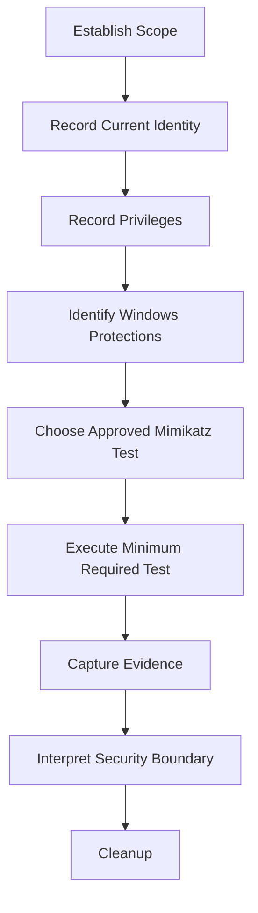

# Mimikatz

Mimikatz is a Windows security research and assessment tool created by Benjamin Delpy (`gentilkiwi`). It is widely used to inspect Windows authentication material, security packages, Kerberos tickets, DPAPI-protected data, tokens, certificates, and other Windows security mechanisms.

Mimikatz is particularly relevant during authorised Windows and Active Directory assessments because it exposes how Windows authentication material is stored, protected, cached, and used.

!!! warning "Authorised Testing Only"
    Mimikatz can access highly sensitive authentication material. Use it only on systems for which credential-access testing is explicitly authorised. Do not collect unrelated credentials or authentication material merely because the tool makes them accessible.

---

## Overview

Mimikatz is not a single-purpose password-dumping utility.

Its modules expose several Windows security subsystems.

```text
Mimikatz
├── privilege
├── token
├── sekurlsa
├── kerberos
├── lsadump
├── dpapi
├── vault
├── crypto
├── certificate
├── process
├── service
├── event
├── standard
└── misc
```

Common assessment areas include:

| Area | Purpose |
| --- | --- |
| Windows authentication | Inspect authentication state and security packages |
| LSASS | Examine authentication material associated with logon sessions |
| Kerberos | Inspect Kerberos tickets and ticket state |
| DPAPI | Analyse Windows Data Protection API material |
| Tokens | Inspect Windows access tokens and privileges |
| LSA | Analyse Local Security Authority-related information |
| Certificates | Inspect certificate and private-key protection |
| Windows Vault | Examine Windows Credential Manager/Vault structures |
| Active Directory | Validate selected domain authentication and replication security conditions |

The important assessment principle is:

```text
Tool Output
    !=
Confirmed Security Impact
```

The result must be interpreted in the context of:

```text
Execution Context
        +
Windows Security Configuration
        +
Credential Protection
        +
Observed Authentication Material
        +
Authorised Scope
        =
Security Conclusion
```

---

## Official Project

Use the original project as the primary reference.

- [Mimikatz - Official GitHub Repository](https://github.com/gentilkiwi/mimikatz){ target="_blank" rel="noopener noreferrer" }
- [Mimikatz Releases](https://github.com/gentilkiwi/mimikatz/releases){ target="_blank" rel="noopener noreferrer" }
- [Mimikatz Wiki](https://github.com/gentilkiwi/mimikatz/wiki){ target="_blank" rel="noopener noreferrer" }

Avoid downloading Mimikatz binaries from random mirrors.

---

# Execution Models

Mimikatz is commonly encountered in two forms:

```text
Native Executable
        |
        +--> mimikatz.exe

PowerShell / Reflective Loading
        |
        +--> Invoke-Mimikatz.ps1
```

These should be treated separately because their execution and detection characteristics differ.

---

# Native Executable

The standard workflow uses:

```text
mimikatz.exe
```

Start it from an authorised administrative command prompt or PowerShell session:

```powershell
.\mimikatz.exe
```

The interactive prompt appears as:

```text
mimikatz #
```

Display available commands:

```text
help
```

Exit:

```text
exit
```

or:

```text
quit
```

---

## Run a Command Directly

Mimikatz commands can also be supplied from the command line.

General structure:

```powershell
.\mimikatz.exe "<COMMAND>" "exit"
```

This is useful when testing a specific authorised function without remaining in the interactive console.

---

# Architecture

Use the Mimikatz build appropriate for the operating system architecture.

Typical release directories may contain builds for:

```text
Win32
x64
```

Check the operating system architecture:

```powershell
[Environment]::Is64BitOperatingSystem
```

Check the current PowerShell process:

```powershell
[Environment]::Is64BitProcess
```

On a 64-bit operating system, the x64 build is normally appropriate for inspecting 64-bit Windows security processes.

---

# Determine Current Context

Before using Mimikatz, establish the current security context.

From Windows:

```powershell
whoami
```

Privileges:

```powershell
whoami /priv
```

Groups:

```powershell
whoami /groups
```

Integrity level can also be reviewed through:

```powershell
whoami /groups
```

Look for the mandatory integrity label.

This establishes the context from which Mimikatz is being executed.

---

# Mimikatz Context

Inside Mimikatz:

```text
standard::version
```

The standard module can be used to inspect basic Mimikatz information.

Other harmless commands can be used to confirm that the executable is functioning before performing authorised security testing.

---

# Debug Privilege

Many Mimikatz operations involving protected processes depend on the execution context having appropriate Windows privileges.

A commonly encountered Mimikatz command is:

```text
privilege::debug
```

This requests the use of:

```text
SeDebugPrivilege
```

where that privilege is available to the current process.

The important distinction is:

```text
Command Executed
        !=
Privilege Available
        !=
Privilege Enabled
        !=
Protected Process Accessible
```

Modern Windows protections may still prevent access even when the current account is a local administrator.

---

# Windows Security Context

Credential-related testing commonly depends on several factors:

```text
Administrator Membership
        |
        v
Elevated Token
        |
        v
Required Privileges
        |
        v
Target Process Protection
        |
        v
Credential Protection Controls
```

Relevant controls can include:

- User Account Control
- Credential Guard
- LSA protection
- Protected Process Light
- Windows Defender
- EDR
- Application control
- WDAC
- AppLocker
- Attack Surface Reduction rules

Do not interpret a failed Mimikatz command as proof that one particular security control blocked it.

Identify the actual control.

---

# Major Modules

## standard

The `standard` module contains general Mimikatz functionality.

Examples include:

```text
standard::version
```

and built-in help functionality.

---

## privilege

The `privilege` module interacts with Windows privileges associated with the current process.

Common assessment questions include:

```text
Which privileges does the current token contain?

Which privileges are enabled?

Does the required privilege exist?

Does the operating system still enforce another protection boundary?
```

Always compare Mimikatz results with:

```powershell
whoami /priv
```

---

## token

The `token` module deals with Windows access tokens.

Tokens are fundamental to Windows security because they contain information such as:

```text
User SID
Group SIDs
Privileges
Integrity Level
Authentication ID
Token Type
Impersonation Level
```

Token behaviour will be covered in more detail in:

```text
windows/token-manipulation.md
```

The Mimikatz page should remain focused on tool operation rather than duplicate the Windows token security model.

---

## sekurlsa

The `sekurlsa` module interacts with authentication information maintained by the Local Security Authority.

Conceptually:

```text
User Logon
    |
    v
LSASS
    |
    +--> Authentication Packages
    |
    +--> Logon Sessions
    |
    +--> Kerberos State
    |
    +--> Credential Material
```

Access to this area is security-sensitive.

During an assessment, first establish:

```text
Can the current process access the required LSASS structures?
```

before drawing conclusions about credential exposure.

The dedicated Windows LSASS notes will cover the security model in greater detail.

---

# LSASS

LSASS is:

```text
Local Security Authority Subsystem Service
```

and normally runs as:

```text
lsass.exe
```

Check the process:

```powershell
Get-Process lsass
```

or:

```cmd
tasklist /fi "imagename eq lsass.exe"
```

LSASS is a critical Windows security process.

Modern Windows environments may protect it using:

```text
Credential Guard
LSA Protection
Protected Process Light
EDR
Application Control
```

Do not attempt to disable these controls merely to make a credential-access test succeed unless the assessment explicitly requires and authorises such control-bypass testing.

---

# Kerberos

The Mimikatz Kerberos module can inspect Kerberos-related state.

Windows itself provides:

```powershell
klist
```

Use the native tool first where it provides sufficient evidence.

Example:

```powershell
klist
```

This can show Kerberos tickets associated with the current logon session.

The relationship is:

```text
Windows Authentication
        |
        v
Kerberos
        |
        +--> TGT
        |
        +--> Service Tickets
        |
        +--> Session Keys
```

Mimikatz provides deeper Kerberos inspection capabilities, while tools such as Rubeus provide Kerberos-focused assessment workflows.

See:

```text
docs/tools/rubeus.md
```

once available.

---

# DPAPI

Mimikatz includes functionality for working with the Windows Data Protection API.

DPAPI protects sensitive information such as:

- Application credentials
- Browser secrets
- Certificate private keys
- Windows Credential Manager data
- Other application-specific secrets

The simplified model is:

```text
Protected Data
      |
      v
DPAPI Blob
      |
      v
Master Key
      |
      v
User / Machine Protection Context
```

Mimikatz can inspect DPAPI-related structures and help determine whether protected data can be accessed within an authorised assessment.

DPAPI is complex enough to deserve its own technical page:

```text
windows/dpapi.md
```

The dedicated page should explain:

```text
DPAPI blobs
Master keys
Credential history
User scope
Machine scope
Domain backup keys
Application use
Detection
Remediation
```

---

# Windows Vault

Windows Credential Manager uses Windows Vault mechanisms for some stored credentials.

Mimikatz includes:

```text
vault
```

functionality for inspecting this subsystem.

Before testing credential exposure, native Windows enumeration can establish whether relevant credential objects exist.

For example:

```powershell
cmdkey /list
```

This does not reveal credential secrets.

It provides a useful initial observation:

```text
Stored Credential Entry Exists
        |
        v
Determine Protection Mechanism
        |
        v
Assess Access Boundary
```

---

# Certificates

Mimikatz contains cryptographic and certificate-related functionality.

Windows certificates can be inspected natively first.

Current user:

```powershell
Get-ChildItem Cert:\CurrentUser\My
```

Local machine:

```powershell
Get-ChildItem Cert:\LocalMachine\My
```

Certificate security testing should distinguish:

```text
Certificate Visible
        !=
Private Key Available
        !=
Private Key Exportable
        !=
Private Key Usable
```

The security impact depends on the certificate purpose and associated permissions.

---

# LSA

The Local Security Authority is responsible for significant parts of Windows authentication and security policy.

Mimikatz provides modules for examining selected LSA-related information.

When assessing LSA-related exposure, establish:

```text
Current Identity
        |
        v
Current Privileges
        |
        v
Accessible LSA Information
        |
        v
Security Relevance
```

Do not treat the ability to execute a Mimikatz module as equivalent to successful access to sensitive LSA data.

---

# Executable Workflow

A controlled executable-based assessment can follow:

```text
1. Verify file source
2. Record file hash
3. Confirm architecture
4. Establish current identity
5. Establish current privileges
6. Start Mimikatz
7. Confirm version
8. Perform only authorised checks
9. Record evidence
10. Exit
11. Remove temporary files where required
```

---

## Hash the Executable

Before execution:

```powershell
Get-FileHash .\mimikatz.exe -Algorithm SHA256
```

This helps record exactly which binary was used during the assessment.

Example evidence:

```text
Tool: Mimikatz
Source: Official project release
Architecture: x64
SHA256: <HASH>
Timestamp: <TIME>
```

---

# PowerShell Invoke-Mimikatz

Mimikatz has historically also been exposed through PowerShell using:

```text
Invoke-Mimikatz.ps1
```

The well-known PowerShell implementation originated from PowerSploit and used reflective PE loading.

Conceptually:

```text
PowerShell
    |
    v
Invoke-Mimikatz.ps1
    |
    v
Reflective PE Loading
    |
    v
Mimikatz Code in Process Memory
```

This differs from:

```text
powershell.exe
    |
    v
mimikatz.exe
```

because the Mimikatz PE can be loaded into the PowerShell process rather than started as a separate executable from disk.

---

# Invoke-Mimikatz History

`Invoke-Mimikatz.ps1` is historically associated with:

```text
PowerSploit
```

and later implementations or copies have appeared in projects such as:

```text
Empire
```

The script combines Mimikatz with reflective PE-loading functionality.

The security-relevant concept is:

```text
PowerShell Script
       |
       v
Embedded PE
       |
       v
Reflective Loading
       |
       v
Memory
```

This is often described as:

```text
In-Memory Mimikatz
```

---

# Local PowerShell Loading

For controlled analysis of a trusted local copy, inspect the script first:

```powershell
Get-FileHash .\Invoke-Mimikatz.ps1 -Algorithm SHA256
```

Review its origin and contents before loading it.

A normal PowerShell script can be loaded into the current session using standard PowerShell mechanisms.

The important assessment distinction is:

```text
Script Loaded
        !=
Mimikatz Function Invoked
        !=
Sensitive Material Accessed
```

Treat each stage separately when collecting evidence.

---

# Invoke-Mimikatz Function

After an authorised and trusted `Invoke-Mimikatz.ps1` implementation has been loaded, confirm the function exists:

```powershell
Get-Command Invoke-Mimikatz
```

Inspect its syntax:

```powershell
Get-Help Invoke-Mimikatz
```

or:

```powershell
Get-Command Invoke-Mimikatz -Syntax
```

This is useful for confirming that the PowerShell component loaded successfully without immediately performing credential-access operations.

---

# In-Memory Execution Model

The important technical concept is not simply:

```text
PowerShell downloads Mimikatz
```

but:

```text
PowerShell
    |
    v
Script / Module
    |
    v
Reflective Loader
    |
    v
PE Image Mapped into Memory
    |
    v
Mimikatz Functionality
```

This means there may be no conventional:

```text
mimikatz.exe
```

process.

Instead, telemetry may show:

```text
powershell.exe
```

or another hosting process performing behaviour associated with reflective loading and credential access.

---

# Why In-Memory Execution Matters

Defenders should not rely solely on:

```text
mimikatz.exe
```

being present on disk.

An assessment should consider:

```text
Disk Detection
        |
        +--> File reputation
        +--> Hash
        +--> Path
        +--> Signature

Memory / Behaviour Detection
        |
        +--> PowerShell telemetry
        +--> Script content
        +--> Process access
        +--> Memory allocation
        +--> LSASS access
        +--> Credential-access behaviour
```

This is one reason modern endpoint security focuses heavily on behaviour rather than filenames.

---

# PowerShell Logging

Relevant Windows telemetry can include:

```text
PowerShell Script Block Logging
PowerShell Module Logging
PowerShell Transcription
AMSI
Process Creation
EDR Telemetry
```

Useful Windows event channels include:

```text
Microsoft-Windows-PowerShell/Operational
```

and, where configured:

```text
Windows PowerShell
```

Relevant PowerShell event IDs can include:

| Event ID | Purpose |
| ---: | --- |
| 4103 | Module logging |
| 4104 | Script block logging |

Logging availability depends on configuration.

---

# AMSI

Modern PowerShell integrates with:

```text
AMSI
```

the Antimalware Scan Interface.

Conceptually:

```text
PowerShell Content
        |
        v
AMSI
        |
        v
Registered Security Product
        |
        v
Inspection / Detection
```

The existence of an in-memory execution technique does not mean AMSI or endpoint security is automatically bypassed.

AMSI will be covered separately in:

```text
windows/application-control/amsi-bypass.md
```

and from the Red Team assessment perspective in:

```text
red-teaming/evasion/amsi-bypass.md
```

---

# PowerShell Constrained Language Mode

PowerShell execution may also be affected by:

```text
Constrained Language Mode
```

Check:

```powershell
$ExecutionContext.SessionState.LanguageMode
```

Possible output includes:

```text
FullLanguage
ConstrainedLanguage
RestrictedLanguage
NoLanguage
```

A script failing under Constrained Language Mode is not automatically proof that CLM itself is the root cause.

Investigate the specific blocked functionality.

CLM will be covered separately in:

```text
windows/application-control/clm-bypass.md
```

---

# Application Control

Mimikatz execution may be affected by:

```text
WDAC
AppLocker
Defender
EDR
ASR
PowerShell policy
```

These are separate security controls.

The correct reasoning model is:

```text
Execution Attempt
        |
        v
Observed Failure
        |
        v
Identify Enforcement Source
        |
        v
Confirm Effective Policy
        |
        v
Security Conclusion
```

Do not write:

```text
Mimikatz was blocked, therefore WDAC works.
```

unless WDAC was actually identified as the enforcing control.

---

# Executable vs In-Memory PowerShell

| Native Mimikatz | Invoke-Mimikatz |
| --- | --- |
| `mimikatz.exe` executed | PowerShell hosts functionality |
| PE normally exists on disk | PE may be reflectively loaded |
| Separate process normally visible | PowerShell may remain the visible host |
| File reputation may apply | Script/behaviour inspection becomes important |
| Process execution telemetry | PowerShell + memory telemetry |
| Application control may block executable | PowerShell controls may also matter |

Neither execution method should be assumed to be invisible.

Modern endpoint security can detect both.

---

# Assessment Strategy

A useful assessment sequence is:



This avoids treating Mimikatz as a button that automatically proves credential compromise.

---

# Credential Guard

Windows Credential Guard can protect selected authentication material using Virtualization-Based Security.

Check Device Guard information where available:

```powershell
Get-CimInstance -ClassName Win32_DeviceGuard -Namespace root\Microsoft\Windows\DeviceGuard
```

Availability depends on the Windows version and environment.

Other relevant information may be available through:

```powershell
Get-ComputerInfo
```

or Windows Security/system configuration.

The important distinction is:

```text
Credential Guard Configured
        !=
Credential Guard Running
        !=
Every Credential Protected
```

Validate effective runtime state.

---

# LSA Protection

LSA protection can configure LSASS as a protected process.

Relevant configuration may include:

```text
RunAsPPL
```

Inspect configuration where authorised:

```powershell
Get-ItemProperty `
  'HKLM:\SYSTEM\CurrentControlSet\Control\Lsa' `
  -Name RunAsPPL `
  -ErrorAction SilentlyContinue
```

Interpret the result together with the effective runtime state.

A registry value alone is not always sufficient evidence that a security control is currently effective.

---

# Defender

Check Defender status where available:

```powershell
Get-MpComputerStatus
```

Useful fields can include:

```powershell
Get-MpComputerStatus |
    Select-Object `
        AntivirusEnabled,
        RealTimeProtectionEnabled,
        BehaviorMonitorEnabled,
        IoavProtectionEnabled,
        AntispywareEnabled
```

Do not disable Defender merely to demonstrate that Mimikatz would otherwise execute.

A blocked execution can itself provide useful control evidence.

---

# AppLocker

Check effective AppLocker policy where authorised:

```powershell
Get-AppLockerPolicy -Effective
```

XML output:

```powershell
Get-AppLockerPolicy -Effective -Xml
```

Relevant rule collections can include:

```text
Exe
Dll
Script
Msi
Appx
```

The existence of an allow rule for a directory does not automatically prove that Mimikatz can execute from that directory.

Test effective behaviour separately.

---

# WDAC

Windows Defender Application Control may restrict executable, DLL, script, or managed-code execution.

WDAC assessment should distinguish:

```text
Policy File Present
        |
        v
Policy Loaded
        |
        v
Policy Enforced
        |
        v
Specific Execution Blocked
```

See the dedicated Windows application-control notes for detailed testing.

---

# Native Windows Baseline

Before using Mimikatz, native Windows commands can establish useful context.

Identity:

```powershell
whoami
```

Privileges:

```powershell
whoami /priv
```

Groups:

```powershell
whoami /groups
```

Kerberos tickets:

```powershell
klist
```

Stored credential entries:

```powershell
cmdkey /list
```

Certificates:

```powershell
Get-ChildItem Cert:\CurrentUser\My
```

LSASS:

```powershell
Get-Process lsass
```

Defender:

```powershell
Get-MpComputerStatus
```

Language mode:

```powershell
$ExecutionContext.SessionState.LanguageMode
```

These establish a baseline before Mimikatz is introduced.

---

# Evidence Collection

Useful evidence may include:

- Hostname
- Windows version
- Current user
- Current integrity level
- Current privileges
- Mimikatz version
- Mimikatz architecture
- Binary/script SHA256
- Relevant Windows protection state
- Exact authorised test performed
- Result
- Timestamp
- Detection event
- Cleanup confirmation

Example evidence chain:

```text
Current User
    |
    v
Current Privileges
    |
    v
Windows Protection State
    |
    v
Mimikatz Test
    |
    v
Observed Result
    |
    v
Security Conclusion
```

---

# Interpreting Results

## Tool Executes

If Mimikatz starts successfully:

```text
Mimikatz Execution Confirmed
```

This does not prove:

```text
Credential Access
Privilege Escalation
Domain Compromise
```

---

## Debug Privilege Available

If the required debug privilege is available:

```text
Required Process Privilege Available
```

This still does not prove that protected authentication material is accessible.

---

## Sensitive Process Access Blocked

Determine why.

Potential causes include:

- Insufficient privileges
- LSA protection
- Credential Guard
- EDR
- Defender
- Application control
- Process protection
- Architecture mismatch

Do not guess the cause from the Mimikatz error alone.

---

## Authentication Material Observed

If an authorised test demonstrates access to authentication material, determine:

```text
What material?
Which account?
What protection boundary failed?
Is the material current?
What access could it enable?
Was access expected for this administrative context?
```

Minimise collection.

The goal is to demonstrate the security condition, not accumulate credentials.

---

# Detection Opportunities

Mimikatz-related activity may generate several forms of telemetry.

## Process Creation

Native execution may produce:

```text
mimikatz.exe
```

process telemetry.

Relevant sources can include:

- Windows process creation auditing
- Sysmon
- EDR
- Defender

---

## PowerShell

Invoke-Mimikatz-style execution may produce:

```text
powershell.exe
```

telemetry instead.

Relevant signals can include:

- Script block logging
- Module logging
- AMSI
- Suspicious memory behaviour
- Process access
- Network retrieval
- Reflective loading patterns

---

## LSASS Access

Credential-access activity may involve attempts to access:

```text
lsass.exe
```

Defenders can monitor unusual processes requesting access to LSASS.

This can be more robust than looking only for:

```text
mimikatz.exe
```

---

## Authentication Behaviour

Follow-on authentication behaviour may also provide evidence.

Examples include unusual:

- Kerberos ticket activity
- NTLM authentication
- Administrative logons
- Remote service access
- Directory replication requests

Detection should therefore correlate:

```text
Endpoint
+
Identity
+
Network
+
Authentication
```

rather than relying on a single signature.

---

# Defensive Recommendations

Relevant controls include:

- Credential Guard
- LSA protection
- Windows Defender
- EDR
- WDAC
- AppLocker
- Attack Surface Reduction rules
- PowerShell logging
- AMSI
- Privileged access management
- Reduced local administrator exposure
- Tiered administration
- Protected Users where appropriate
- Strong credential hygiene
- Limiting interactive privileged logons
- Monitoring LSASS access
- Monitoring abnormal authentication activity

The strongest defence is not:

```text
Block mimikatz.exe
```

but:

```text
Reduce Credential Exposure
        +
Protect Authentication Processes
        +
Restrict Privileged Execution
        +
Monitor Credential Access
        +
Detect Abnormal Authentication
```

---

# Operational Safety

Mimikatz can interact with critical Windows authentication components.

During production assessments:

- Use the minimum required functionality
- Avoid unrelated credential collection
- Avoid modifying authentication providers unnecessarily
- Avoid persistent modifications
- Avoid destabilising LSASS
- Avoid experimental kernel functionality
- Avoid modifying domain controllers unless explicitly authorised
- Record exactly what was tested
- Clean up temporary tooling

A proof should demonstrate the condition without creating unnecessary operational risk.

---

# Troubleshooting

## Mimikatz Does Not Start

Check:

```powershell
Get-Item .\mimikatz.exe
```

Architecture:

```powershell
[Environment]::Is64BitOperatingSystem
```

File hash:

```powershell
Get-FileHash .\mimikatz.exe -Algorithm SHA256
```

Potential causes include:

- Defender
- EDR
- AppLocker
- WDAC
- File corruption
- Architecture mismatch

---

## Access Denied

Check:

```powershell
whoami
```

```powershell
whoami /groups
```

```powershell
whoami /priv
```

Determine whether the process is elevated.

Do not assume local administrator membership means the current process has an elevated administrative token.

---

## Invoke-Mimikatz Is Not Recognised

Check:

```powershell
Get-Command Invoke-Mimikatz -ErrorAction SilentlyContinue
```

If no command is returned, the function has not been loaded into the current PowerShell session.

Review:

- Script path
- Script integrity
- PowerShell errors
- Language mode
- Execution policy
- Application control
- AMSI/endpoint security telemetry

---

## Script Loads but Functionality Fails

Check:

```powershell
$ExecutionContext.SessionState.LanguageMode
```

Then review:

- PowerShell version
- Architecture
- Required privileges
- Endpoint protection
- Script implementation
- Reflective loader compatibility
- Windows security controls

---

## Native Works but PowerShell Does Not

This can indicate different controls applying to:

```text
Native PE Execution
```

and:

```text
PowerShell Script / Memory Execution
```

Investigate:

- AMSI
- Script enforcement
- CLM
- Script Block Logging
- WDAC script policy
- EDR PowerShell controls

---

## PowerShell Works but Native EXE Does Not

Investigate:

- AppLocker EXE rules
- WDAC executable policy
- Defender file detection
- File reputation
- Path-based execution controls

Again:

```text
Different Result
        !=
Confirmed Bypass
```

until the enforcing control is identified.

---

# Quick Reference

## Native Executable

Start:

```powershell
.\mimikatz.exe
```

Help:

```text
help
```

Version:

```text
standard::version
```

Request debug privilege where authorised:

```text
privilege::debug
```

Exit:

```text
exit
```

---

## Host Baseline

Identity:

```powershell
whoami
```

Privileges:

```powershell
whoami /priv
```

Groups:

```powershell
whoami /groups
```

Kerberos:

```powershell
klist
```

Stored credential entries:

```powershell
cmdkey /list
```

LSASS:

```powershell
Get-Process lsass
```

Language mode:

```powershell
$ExecutionContext.SessionState.LanguageMode
```

Defender:

```powershell
Get-MpComputerStatus
```

---

## Hash Mimikatz

```powershell
Get-FileHash .\mimikatz.exe -Algorithm SHA256
```

Hash Invoke-Mimikatz:

```powershell
Get-FileHash .\Invoke-Mimikatz.ps1 -Algorithm SHA256
```

---

## Confirm Invoke-Mimikatz

After loading an authorised local copy:

```powershell
Get-Command Invoke-Mimikatz
```

Syntax:

```powershell
Get-Command Invoke-Mimikatz -Syntax
```

Help:

```powershell
Get-Help Invoke-Mimikatz
```

---

# Assessment Checklist

## Preparation

- [ ] Credential-access testing explicitly authorised
- [ ] Host is within scope
- [ ] Tool obtained from trusted source
- [ ] Tool hash recorded
- [ ] Architecture confirmed
- [ ] Test objective defined

## Baseline

- [ ] Current user recorded
- [ ] Groups recorded
- [ ] Privileges recorded
- [ ] Integrity/elevation state understood
- [ ] Relevant security controls identified

## Execution

- [ ] Correct Mimikatz execution model selected
- [ ] Native EXE or PowerShell method recorded
- [ ] Version recorded
- [ ] Only required functionality tested
- [ ] Sensitive material minimised

## Validation

- [ ] Tool execution distinguished from credential access
- [ ] Protection state validated
- [ ] Failure reason investigated
- [ ] Security impact supported by evidence

## Detection

- [ ] Endpoint telemetry reviewed where available
- [ ] PowerShell telemetry reviewed where relevant
- [ ] LSASS access telemetry reviewed
- [ ] Authentication telemetry reviewed where relevant

## Cleanup

- [ ] Mimikatz exited
- [ ] PowerShell session closed where appropriate
- [ ] Temporary files removed
- [ ] Temporary scripts removed
- [ ] No persistence introduced
- [ ] Cleanup documented

---

# Related Notes

- [Windows](../windows/index.md)
- [Active Directory](../active-directory/index.md)
- [PowerShell](powershell.md)
- [Impacket](impacket.md)
- [NetExec](netexec.md)
- [BloodHound](bloodhound.md)

Planned related pages:

```text
tools/rubeus.md
windows/dpapi.md
windows/token-manipulation.md
windows/application-control/amsi-bypass.md
windows/application-control/clm-bypass.md
windows/application-control/wdac-bypass.md
active-directory/credential-access/lsass.md
cheatsheets/mimikatz.md
```

---

# References

- [Mimikatz - Official GitHub Repository](https://github.com/gentilkiwi/mimikatz){ target="_blank" rel="noopener noreferrer" }
- [Mimikatz Releases](https://github.com/gentilkiwi/mimikatz/releases){ target="_blank" rel="noopener noreferrer" }
- [Mimikatz Wiki](https://github.com/gentilkiwi/mimikatz/wiki){ target="_blank" rel="noopener noreferrer" }
- [PowerSploit](https://github.com/PowerShellMafia/PowerSploit){ target="_blank" rel="noopener noreferrer" }
- [PowerSploit Releases](https://github.com/PowerShellMafia/PowerSploit/releases){ target="_blank" rel="noopener noreferrer" }
- [JPCERT/CC Tool Analysis - Invoke-Mimikatz](https://github.com/JPCERTCC/ToolAnalysisResultSheet/blob/master/details/PowerSploit_Invoke-Mimikatz.htm){ target="_blank" rel="noopener noreferrer" }
