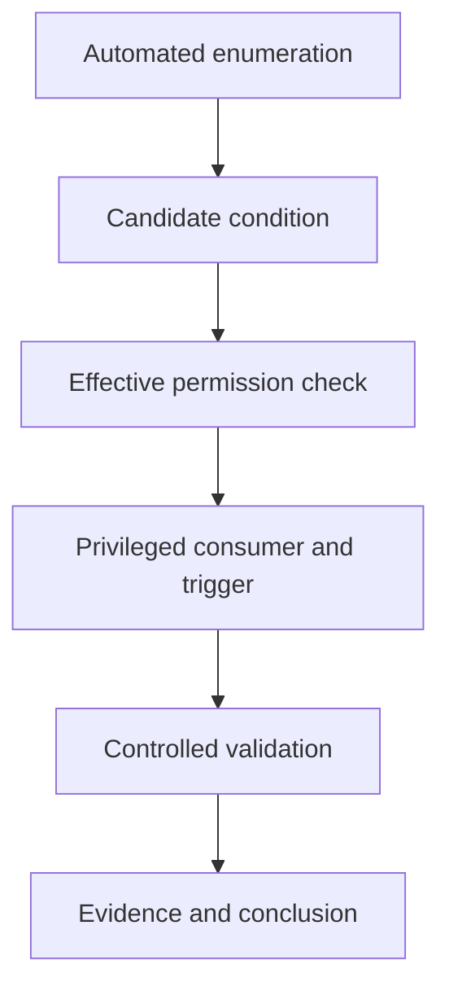

# Privilege Escalation Tools

Privilege escalation tools help identify security-relevant conditions that may allow a lower-privileged user or process to gain additional privileges.

They are especially useful because both Windows and Linux expose a large number of configuration locations that would be time-consuming to inspect manually.

Typical areas include:

- users and groups;
- services;
- scheduled tasks;
- cron jobs;
- file permissions;
- directory permissions;
- registry permissions;
- environment variables;
- credentials;
- configuration files;
- SUID and SGID binaries;
- Linux capabilities;
- sudo configuration;
- PATH handling;
- writable executables;
- writable scripts;
- privileged service configuration;
- installed software;
- token and privilege information;
- security controls.

However:

> Enumeration output is not the same as a confirmed privilege escalation vulnerability.

A strong workflow is:

```text
Local Access
    |
    v
Enumeration Tool
    |
    v
Candidate Condition
    |
    v
Understand Configuration
    |
    v
Check Effective Permissions
    |
    v
Confirm Privileged Execution Path
    |
    v
Validate Security Impact
    |
    v
Evidence
    |
    v
Finding
```

!!! warning "Authorised testing only"
    Use privilege escalation tools only on systems where local security testing is explicitly authorised. Some tools perform many checks, inspect sensitive locations, invoke system utilities, or generate substantial endpoint-security telemetry. Confirm engagement restrictions before use.

---

# Where Privilege Escalation Tooling Fits

Privilege escalation typically follows an initial foothold or local execution context.

```text
Initial Access
     |
     v
Current User / Process Context
     |
     v
Manual Enumeration
     |
     +--> Windows
     |
     +--> Linux
     |
     v
Automated Enumeration
     |
     +--> WinPEAS
     +--> LinPEAS
     +--> PowerUp
     +--> PrivescCheck
     +--> linux-smart-enumeration
     |
     v
Candidate Conditions
     |
     v
Manual Validation
     |
     v
Privilege Escalation Path
```

Related notes:

[Privilege Escalation Explorer](../../privesc/index.md)

[Windows Privilege Escalation](../../windows/privilege-escalation.md)

[Linux Privilege Escalation](../../linux/privilege-escalation.md)

---

# Core Tools

The main tools covered in this section are:

| Tool | Platform | Primary Use |
|---|---|---|
| WinPEAS | Windows | Broad privilege escalation enumeration |
| LinPEAS | Linux | Broad privilege escalation enumeration |
| PowerUp | Windows | PowerShell-based privilege escalation checks |
| PrivescCheck | Windows | Structured PowerShell privilege escalation enumeration |
| linux-smart-enumeration | Linux | Focused Linux privilege escalation enumeration |

These tools overlap intentionally.

Different tools may:

- inspect different locations;
- use different heuristics;
- present results differently;
- identify conditions another tool misses.

The correct approach is not to run all of them blindly.

Use them to support a methodology.

---

# Automated Enumeration vs Manual Validation

Automated tools are useful for breadth.

Manual validation is required for depth.

```text
Automated Enumeration
       |
       +-- many checks
       +-- fast coverage
       +-- useful highlighting

Manual Validation
       |
       +-- effective permissions
       +-- execution context
       +-- reachability
       +-- exploitability
       +-- impact
```

Together:

```text
Automation
    +
Manual Validation
    |
    v
Defensible Conclusion
```

---

# Why Tool Output Is Not Enough

Suppose a tool reports:

```text
Writable service binary
```

This is only the beginning.

You still need to determine:

```text
Who can write the file?

Which service uses it?

Which account runs the service?

Can the current user restart the service?

Will the service restart automatically?

Is the path actually used?

Is another security control preventing execution?
```

Only after these questions are answered can the condition be assessed properly.

---

# A Privilege Escalation Evidence Model

A useful model is:

```text
Candidate
   |
   v
Control
   |
   v
Reachability
   |
   v
Influence
   |
   v
Privileged Execution
   |
   v
Impact
```

For example:

```text
Writable file
   |
   v
Current user can modify it
   |
   v
Privileged service loads it
   |
   v
Service executes as SYSTEM
   |
   v
Privilege escalation condition
```

---

# WinPEAS

WinPEAS is part of the PEASS-ng project and performs extensive Windows privilege escalation enumeration.

It can inspect areas such as:

- system information;
- users;
- groups;
- privileges;
- services;
- scheduled tasks;
- installed software;
- registry configuration;
- file permissions;
- writable directories;
- credentials;
- environment variables;
- network configuration;
- security controls;
- potentially sensitive files.

Conceptually:

```text
Windows Host
    |
    v
WinPEAS
    |
    +-- System
    +-- Users
    +-- Services
    +-- Tasks
    +-- Files
    +-- Registry
    +-- Credentials
    +-- Security Controls
    |
    v
Candidate PrivEsc Conditions
```

Detailed note:

[WinPEAS](winpeas.md)

Official project:

[PEASS-ng - GitHub](https://github.com/peass-ng/PEASS-ng){ target="_blank" rel="noopener noreferrer" }

---

# LinPEAS

LinPEAS is the Linux counterpart within PEASS-ng.

It performs broad Linux privilege escalation enumeration.

Typical checks include:

- sudo;
- SUID;
- SGID;
- Linux capabilities;
- cron;
- systemd;
- file permissions;
- writable paths;
- environment configuration;
- processes;
- credentials;
- containers;
- mounts;
- services;
- interesting files.

Conceptually:

```text
Linux Host
   |
   v
LinPEAS
   |
   +-- sudo
   +-- SUID/SGID
   +-- capabilities
   +-- cron
   +-- files
   +-- credentials
   +-- services
   |
   v
Candidate PrivEsc Conditions
```

Detailed note:

[LinPEAS](linpeas.md)

Official project:

[PEASS-ng - GitHub](https://github.com/peass-ng/PEASS-ng){ target="_blank" rel="noopener noreferrer" }

---

# PowerUp

PowerUp is a PowerShell-based privilege escalation enumeration script from the PowerSploit project.

It can help identify potentially interesting Windows configurations such as:

- service permissions;
- service binary permissions;
- unquoted service paths;
- registry settings;
- installer policy;
- DLL-related conditions;
- autologon information;
- potentially writable privileged resources.

The correct interpretation is:

```text
PowerUp reports condition
        |
        v
Candidate
        |
        v
Manual validation
```

not:

```text
PowerUp reports condition
        |
        v
Confirmed privilege escalation
```

Detailed note:

[PowerUp](powerup.md)

Project reference:

[PowerUp - PowerSploit](https://github.com/PowerShellMafia/PowerSploit/tree/master/Privesc){ target="_blank" rel="noopener noreferrer" }

---

# PrivescCheck

PrivescCheck is a PowerShell-based Windows privilege escalation enumeration tool.

It performs structured checks across many Windows security areas.

Potentially useful areas include:

- services;
- scheduled tasks;
- registry configuration;
- permissions;
- credentials;
- applications;
- system configuration;
- security controls.

PrivescCheck is useful as a second perspective when validating Windows privilege escalation exposure.

Detailed note:

[PrivescCheck](privesccheck.md)

Official project:

[PrivescCheck - GitHub](https://github.com/itm4n/PrivescCheck){ target="_blank" rel="noopener noreferrer" }

---

# linux-smart-enumeration

linux-smart-enumeration, commonly referred to as LSE, performs focused Linux enumeration for privilege escalation.

It is designed to help identify security-relevant local conditions without requiring the tester to manually inspect every system component first.

Potential areas include:

- users;
- groups;
- sudo;
- files;
- processes;
- services;
- SUID;
- capabilities;
- cron;
- credentials.

Detailed note:

[linux-smart-enumeration](linux-smart-enumeration.md)

Official project:

[linux-smart-enumeration - GitHub](https://github.com/diego-treitos/linux-smart-enumeration){ target="_blank" rel="noopener noreferrer" }

---

# Windows Privilege Escalation Workflow

A useful Windows workflow is:

```text
Current User
    |
    v
whoami
    |
    v
Group / Privilege Review
    |
    v
Manual Enumeration
    |
    v
WinPEAS / PowerUp / PrivescCheck
    |
    v
Candidate Condition
    |
    v
Manual ACL / Configuration Validation
    |
    v
Privileged Execution Path
```

Related notes:

[Windows Enumeration](../../windows/enumeration.md)

[Windows Privilege Escalation](../../windows/privilege-escalation.md)

---

# Linux Privilege Escalation Workflow

A useful Linux workflow is:

```text
Current User
    |
    v
id
    |
    v
Groups / sudo / environment
    |
    v
Manual Enumeration
    |
    v
LinPEAS / LSE
    |
    v
Candidate Condition
    |
    v
Manual Permission Validation
    |
    v
Privileged Execution Path
```

Related notes:

[Linux Enumeration](../../linux/enumeration.md)

[Linux Privilege Escalation](../../linux/privilege-escalation.md)

---

# Start with Identity

Before interpreting any privilege escalation output, understand the current context.

On Windows:

```powershell
whoami
```

```powershell
whoami /groups
```

```powershell
whoami /priv
```

On Linux:

```bash
id
```

```bash
groups
```

This establishes:

```text
Who am I?

Which groups do I belong to?

Which privileges do I have?

What should I already be able to access?
```

Without this context, enumeration results are harder to interpret correctly.

---

# Windows Services

Windows services are a common privilege escalation review area.

Relevant questions include:

```text
Which account runs the service?

What executable does it start?

Can the current user modify that executable?

Can the current user modify the service configuration?

Can the current user restart the service?

Does the service start automatically?
```

The relationship matters:

```text
Writable File
      +
Privileged Service
      +
Reachable Execution Path
      =
Potential Privilege Escalation
```

Related note:

[Windows Services](../../windows/services.md)

---

# Service Binary Permissions

A tool may highlight a service executable.

Validate manually.

Questions:

```text
Is the executable writable?

Is the parent directory writable?

Who owns the file?

Which ACL grants access?

Does the service actually execute this file?
```

A writable file that is never executed by a privileged context may have little security impact.

---

# Service Configuration Permissions

The binary itself may be protected while the service configuration is modifiable.

Relevant settings include:

- executable path;
- service account;
- startup configuration;
- dependencies.

Always assess effective permissions rather than relying only on directory location.

---

# Unquoted Service Paths

An unquoted service path is often highlighted by Windows enumeration tools.

Example concept:

```text
C:\Program Files\Example App\service.exe
```

If the path contains spaces and is unquoted, investigate how Windows resolves it.

However:

> An unquoted service path is not automatically exploitable.

Also determine:

- whether an earlier path location is writable;
- whether the service runs privileged;
- whether the service can restart;
- whether an appropriate executable path could actually be influenced.

---

# Windows Scheduled Tasks

Scheduled tasks can represent privileged execution paths.

Questions include:

```text
Which account executes the task?

What program or script is launched?

Can the current user modify it?

Can the user modify its working directory?

Can the user influence referenced files?

When does the task execute?
```

Related note:

[Windows Scheduled Tasks](../../windows/scheduled-tasks.md)

---

# Windows Registry

The registry can influence privileged execution.

Interesting areas may include:

- service configuration;
- application configuration;
- installer policy;
- startup behaviour;
- execution paths.

A registry key is only security relevant if:

```text
Current User Can Modify
        +
Privileged Component Reads It
        +
Meaningful Execution Influence
```

Related note:

[Windows Registry](../../windows/registry.md)

---

# Windows Filesystem Permissions

Filesystem permissions are central to privilege escalation analysis.

Review:

```text
Files
Directories
Executable paths
Scripts
Configuration
DLL search locations
Scheduled-task resources
Service resources
```

Related note:

[Windows Filesystem Permissions](../../windows/filesystem-permissions.md)

---

# Writable Directories

A writable directory may be interesting, but context matters.

Ask:

```text
Who writes there?

Who executes from there?

Is the location searched automatically?

Does a privileged application load resources from it?
```

A generic writable directory does not automatically create privilege escalation.

---

# Windows Credentials

Enumeration tools may identify potential credential material.

Possible locations include:

- configuration files;
- scripts;
- deployment artefacts;
- saved credentials;
- environment variables;
- application files.

Treat any discovered credentials as sensitive evidence.

Related note:

[Windows Credentials](../../windows/credentials.md)

---

# Windows UAC

User Account Control affects how administrative users receive elevated tokens.

UAC should not be confused with a normal privilege boundary between unrelated users.

Review UAC in the context of:

- current account;
- group membership;
- integrity level;
- elevation configuration.

Related note:

[Windows User Account Control](../../windows/uac.md)

---

# Windows Application Control

Privilege escalation analysis should also consider security controls that may prevent a discovered path from being practically usable.

These may include:

- AppLocker;
- Windows Defender Application Control;
- Defender;
- script controls;
- endpoint-security policy.

Related notes:

[Windows Application Control](../../windows/application-control.md)

[Microsoft Defender](../../windows/defender.md)

A tool may identify an execution path that is technically writable but blocked by another control.

---

# Linux sudo

sudo configuration is one of the most important Linux privilege escalation areas.

Start with:

```bash
sudo -l
```

Review:

- allowed commands;
- target user;
- password requirement;
- environment handling;
- wildcards;
- command arguments.

Related note:

[Linux sudo](../../linux/sudo.md)

---

# sudo Tool Output

LinPEAS or LSE may highlight sudo rules.

Do not stop at the highlight.

Determine:

```text
Exact sudo rule
    |
    v
Exact command
    |
    v
Allowed arguments
    |
    v
Execution context
    |
    v
Whether privilege can actually be increased
```

---

# SUID and SGID

SUID and SGID binaries can execute with an effective identity different from the invoking user.

Enumerate manually:

```bash
find / -perm -4000 -type f 2>/dev/null
```

SGID:

```bash
find / -perm -2000 -type f 2>/dev/null
```

Tools such as LinPEAS and LSE can highlight interesting entries.

Related note:

[Linux SUID and SGID](../../linux/suid-sgid.md)

---

# Linux Capabilities

Linux capabilities split traditional root privileges into smaller units.

Enumerate:

```bash
getcap -r / 2>/dev/null
```

Potentially interesting capabilities depend on:

- executable;
- capability;
- configuration;
- available arguments.

Related note:

[Linux Capabilities](../../linux/capabilities.md)

---

# Linux Scheduled Jobs

Linux scheduled execution can include:

- cron;
- systemd timers;
- application schedulers.

Questions include:

```text
Who executes the job?

Which command is called?

Can the current user modify the script?

Can the user modify a parent directory?

Can PATH influence command resolution?
```

Related note:

[Linux Scheduled Jobs](../../linux/scheduled-jobs.md)

---

# Linux Filesystem Permissions

Filesystem review should consider:

- file owner;
- group;
- mode;
- ACLs;
- parent directories;
- mounts.

Useful commands include:

```bash
ls -la
```

```bash
namei -l /path/to/file
```

```bash
getfacl /path/to/file
```

Related note:

[Linux Filesystem Permissions](../../linux/filesystem-permissions.md)

---

# Linux Credentials

Enumeration tools may identify:

- shell history;
- configuration files;
- environment variables;
- SSH keys;
- database configuration;
- application secrets.

Handle such data carefully.

Related note:

[Linux Credentials](../../linux/credentials.md)

---

# PATH Analysis

PATH-based privilege escalation depends on command resolution.

Example:

```text
Privileged Script
      |
      v
Calls:
backup
      |
      v
Shell Searches PATH
```

Questions include:

```text
Is an absolute path used?

Which PATH is active?

Can the current user write to an earlier PATH directory?

Does the privileged process inherit that PATH?
```

A writable PATH directory alone is not sufficient without a privileged execution path.

---

# Environment Variables

Environment variables can influence:

- executable resolution;
- libraries;
- interpreters;
- application configuration.

Their relevance depends on whether privileged processes inherit or trust them.

---

# Processes

Running processes provide useful context.

On Linux:

```bash
ps aux
```

On Windows:

```powershell
Get-Process
```

Questions include:

- Which services are running?
- Which accounts own them?
- Which applications are installed?
- Are privileged processes loading resources from modifiable locations?

---

# Installed Software

Enumeration tools often list installed applications.

This can help identify:

- locally privileged services;
- management software;
- outdated products;
- custom applications.

Do not equate:

```text
Old version installed
```

with:

```text
Exploitable vulnerability
```

Validate configuration and patch context.

---

# Security Products

Enumeration tools may report:

- antivirus;
- EDR;
- AppLocker;
- WDAC;
- SELinux;
- AppArmor.

These observations help explain what privilege escalation paths may or may not be practical.

Do not disable security controls unless explicitly permitted.

---

# Containers

Linux enumeration may reveal containerisation.

Possible indicators include:

- Docker;
- containerd;
- Kubernetes;
- LXC.

Container privilege boundaries require separate analysis.

A container context may affect:

- filesystem visibility;
- capabilities;
- mounts;
- device access;
- namespaces.

Do not assume root inside a container equals root on the host.

---

# Mounts

Linux mount configuration can influence privilege escalation.

Review:

```bash
mount
```

and:

```bash
findmnt
```

Potentially interesting properties include:

- writable network shares;
- unusual local mounts;
- container mounts;
- privileged files exposed through mounts.

---

# Network Shares

Windows and Linux systems may expose mounted or accessible network shares.

Shared locations can contain:

- deployment scripts;
- configuration;
- credentials;
- binaries;
- administrative tooling.

Ensure remote systems are within scope before interacting with them.

---

# Effective Permissions

Tooling often interprets permissions heuristically.

Manual validation should determine effective permissions.

On Windows, consider:

- user SID;
- group SIDs;
- inherited ACEs;
- deny ACEs;
- allow ACEs;
- ownership;
- integrity level.

On Linux, consider:

- UID;
- GID;
- supplementary groups;
- mode bits;
- ACLs;
- mount options.

---

# Writable Does Not Mean Exploitable

This principle should remain central:

```text
Writable
   !=
Executed
```

and:

```text
Executed
   !=
Privileged
```

and:

```text
Privileged
   !=
Current user can trigger
```

A meaningful chain may require all of them:

```text
Writable
   +
Privileged Execution
   +
Reachability
   =
Candidate PrivEsc
```

---

# Reachability

A condition can exist but be unreachable.

Example:

```text
Writable executable
```

but:

```text
Service disabled
No restart rights
Never executed
```

The security impact may therefore be limited.

Always verify the full execution path.

---

# Trigger Conditions

Privilege escalation may depend on:

- reboot;
- service restart;
- scheduled execution;
- user login;
- application launch;
- administrator action.

Document the trigger clearly.

---

# Current User Can Restart Service?

On Windows, the ability to modify a service-related file does not automatically imply the current user can cause immediate execution.

Possible triggers include:

- service restart;
- host reboot;
- scheduled service recovery.

Do not assume trigger capability.

---

# Root-Owned Cron Is Not Enough

On Linux:

```text
root cron job
```

is not automatically vulnerable.

The interesting question is:

```text
Can the current user influence anything the root cron job executes?
```

This may include:

- script;
- directory;
- executable;
- configuration;
- PATH-resolved binary.

---

# Tool Colour Coding

Tools such as PEASS may use colours to prioritise output.

Treat colours as triage aids.

Do not interpret:

```text
red
```

as:

```text
confirmed vulnerability
```

Colour usually means:

```text
worth investigating
```

---

# Running Multiple Tools

Running multiple enumeration tools can provide additional coverage.

Example:

```text
WinPEAS
   |
   +--> candidate service

PowerUp
   |
   +--> same service

PrivescCheck
   |
   +--> confirms permissions
```

This increases confidence that the configuration deserves attention.

It still does not replace manual validation.

---

# Tool Correlation

A strong Windows workflow might be:

```text
WinPEAS --------+
                |
PowerUp --------+
                |
PrivescCheck ---+----> Candidate Service
                |
Manual ACL -----+
                |
                v
Validated Condition
```

Linux:

```text
LinPEAS --------+
                |
LSE ------------+
                |
Manual sudo ----+
                |
Manual ACL -----+----> Validated Condition
```

---

# Avoid Duplicate Noise

Multiple tools often report the same issue.

Do not create several findings for:

```text
Same writable service
```

because three tools identified it.

Consolidate the evidence around the underlying condition.

---

# Tool Version

Record tool versions where possible.

For example:

```text
WinPEAS release:
LinPEAS release:
PrivescCheck version:
PowerUp source revision:
LSE version/revision:
```

This matters because checks evolve.

---

# Integrity of Downloaded Tools

Security tools are high-trust code.

Prefer:

- official repositories;
- official releases;
- cryptographic hashes where provided;
- controlled internal mirrors.

Avoid downloading modified copies from unknown sources.

---

# Endpoint Security Detection

Privilege escalation scripts are commonly detected by endpoint-security products.

This does not mean the tool is malicious in an authorised assessment.

However, it can affect:

- execution;
- logging;
- telemetry;
- alerting;
- assessment coordination.

Coordinate intrusive tool use where required.

---

# Script Execution Restrictions

On Windows, PowerShell tooling may be affected by:

- execution policy;
- AppLocker;
- WDAC;
- Constrained Language Mode;
- Defender;
- EDR.

A tool failing to run does not mean the system is free of privilege escalation conditions.

Switch to manual enumeration where necessary.

---

# Living-off-the-Land Enumeration

When third-party tooling is unavailable, native operating-system tools can still provide strong enumeration coverage.

Windows examples:

```text
whoami
sc.exe
schtasks.exe
icacls.exe
reg.exe
PowerShell cmdlets
```

Linux examples:

```text
id
sudo
find
ls
getfacl
getcap
ps
systemctl
findmnt
```

Automated tools accelerate this process; they do not replace the underlying knowledge.

---

# Manual Windows Validation

For any Windows candidate, investigate:

```text
Identity
    |
    v
Object
    |
    v
ACL
    |
    v
Privileged Consumer
    |
    v
Trigger
    |
    v
Impact
```

Example categories:

```text
Service executable
Scheduled task script
Registry value
DLL location
Application configuration
```

---

# Manual Linux Validation

For Linux:

```text
Identity
    |
    v
File / Command / Configuration
    |
    v
Owner / Group / ACL
    |
    v
Privileged Process
    |
    v
Execution Trigger
    |
    v
Impact
```

---

# Representative Windows Scenario

An enumeration tool reports:

```text
Potentially writable service executable:
C:\Program Files\Example\Service.exe

Service account:
LocalSystem
```

Do not immediately conclude privilege escalation.

Validate:

```powershell
icacls "C:\Program Files\Example\Service.exe"
```

Then determine:

```text
Does current user have write/modify rights?

Is the service actually configured to use this binary?

Can the service be restarted?

Does the service run as SYSTEM?

Are application-control controls relevant?
```

Possible outcome:

```text
Current user cannot modify file
```

Conclusion:

```text
Tool-generated candidate not confirmed.
```

Alternative outcome:

```text
Current user can modify file
Service runs as SYSTEM
Service restarts automatically
```

This is a much stronger security condition.

---

# Representative Linux Scenario

LinPEAS reports:

```text
Interesting SUID binary
```

Validate:

```bash
ls -l /path/to/binary
```

Then determine:

```text
Owner
Permissions
Binary behaviour
Arguments
Configuration
Whether effective UID is retained
```

The presence of SUID alone is not necessarily a vulnerability.

Many legitimate system binaries use it intentionally.

---

# Representative sudo Scenario

Suppose:

```bash
sudo -l
```

shows an allowed command.

The analysis should determine:

```text
Exact executable
Allowed arguments
Wildcard use
Environment
Whether command offers shell/file/process influence
```

Do not report sudo configuration simply because an entry exists.

---

# Representative Scheduled Task Scenario

A Windows tool reports:

```text
Task runs as SYSTEM
Script path is C:\ProgramData\Scripts\backup.ps1
```

Validate:

```powershell
icacls "C:\ProgramData\Scripts\backup.ps1"
```

Then:

```text
Can current user modify it?

When does the task run?

Can execution be triggered?

Is PowerShell allowed by application control?
```

The complete chain determines risk.

---

# Representative Cron Scenario

A Linux tool reports:

```text
root executes /opt/scripts/backup.sh every minute
```

Check:

```bash
ls -l /opt/scripts/backup.sh
```

and:

```bash
namei -l /opt/scripts/backup.sh
```

A protected script may still reside in a writable parent directory.

Evaluate the full path.

---

# False Positives

Common reasons automated tools produce misleading privilege escalation candidates include:

- writable directory unrelated to privileged execution;
- inherited ACL interpretation;
- disabled service;
- inactive scheduled task;
- root-owned file that is not executed;
- package version without vulnerable configuration;
- protected resource misidentified as writable;
- effective permissions differing from simple mode bits.

Manual validation resolves these uncertainties.

---

# False Negatives

Enumeration tools can miss real privilege escalation paths.

Possible reasons include:

- custom application logic;
- non-standard directories;
- unusual service configuration;
- transient files;
- application-specific IPC;
- undocumented privileged workflows;
- security-control interference;
- custom scripts.

A clean WinPEAS or LinPEAS run does not prove that no escalation path exists.

---

# Evidence to Capture

For each validated condition, retain:

```text
Current user:
Current groups:
Relevant privilege:
Affected object:
Owner:
Permissions:
Privileged execution context:
Trigger:
Manual validation:
Observed result:
Security impact:
```

For Windows:

```text
Service/task name
Executable/script path
Service account
ACL output
Startup/trigger condition
```

For Linux:

```text
File path
Owner/group
Mode/ACL
sudo/SUID/capability context
Privileged consumer
Trigger
```

---

# Evidence Should Show the Chain

Weak evidence:

```text
Screenshot of WinPEAS red text
```

Strong evidence:

```text
WinPEAS candidate
      |
      v
icacls output
      |
      v
service configuration
      |
      v
service account
      |
      v
trigger condition
```

The evidence should explain why the condition matters.

---

# Reporting

The finding should describe the underlying security weakness rather than the enumeration tool.

Avoid:

```text
WinPEAS found a vulnerable service.
```

Prefer:

```text
A service running as LocalSystem used an executable that was modifiable
by the tested standard user. The service represented a privileged
execution path, allowing the low-privileged user to influence code
executed in the LocalSystem context.
```

Similarly, avoid:

```text
LinPEAS found a cron vulnerability.
```

Prefer:

```text
A root-owned scheduled job executed a script located in a path that was
modifiable by the tested user, allowing the user to influence commands
executed by the privileged scheduled process.
```

---

# Negative Results

Negative results are also useful.

Example:

```text
Tool:
WinPEAS

Candidate:
Writable service executable

Manual validation:
Effective ACL did not grant write or modify rights to the current user.

Conclusion:
The suspected privilege escalation path was not confirmed.
```

This is useful assessment evidence.

---

# Severity Depends on the Chain

A privilege escalation condition may be severe where:

```text
Normal user
    |
    v
Immediate SYSTEM/root
```

But severity may be lower if:

- privileged trigger requires an administrator;
- execution occurs rarely;
- additional conditions are required;
- strong controls limit practical exploitation.

Assess the actual environment.

---

# Remediation Principles

Remediation commonly involves removing the user's ability to influence privileged execution.

Examples:

## Windows

- correct service binary ACLs;
- correct service configuration ACLs;
- secure scheduled-task scripts;
- restrict writable directories;
- quote service paths where relevant;
- protect registry values;
- remove unnecessary privileges.

### Linux

- correct file ownership;
- remove unsafe write permissions;
- correct sudo rules;
- remove unnecessary SUID/SGID;
- remove unnecessary capabilities;
- secure cron scripts;
- use absolute paths;
- protect privileged configuration.

---

# Retesting

A good retest confirms the root cause was removed.

Example:

```text
Before:
Standard user -> Modify service executable

After:
Standard user -> Read/Execute only
```

Then verify:

```text
Service still functions
Privileged execution path remains protected
```

Do not retest only by rerunning the enumeration tool.

Manually confirm the relevant permission or configuration.

---

# Recommended Testing Order - Windows

A practical sequence is:

```text
1. Identity
2. Groups
3. Token privileges
4. System information
5. Services
6. Scheduled tasks
7. Filesystem permissions
8. Registry
9. Credentials
10. Installed applications
11. Security controls
12. Automated enumeration
13. Manual validation
```

Automated tooling can be used earlier, but understanding the underlying areas first improves interpretation.

---

# Recommended Testing Order - Linux

```text
1. Identity
2. Groups
3. sudo
4. SUID/SGID
5. capabilities
6. cron/systemd
7. filesystem permissions
8. processes
9. credentials
10. mounts
11. environment/PATH
12. automated enumeration
13. manual validation
```

---

# Windows Tool Comparison

| Tool | Strength |
|---|---|
| WinPEAS | Very broad Windows enumeration |
| PowerUp | Focused PowerShell privilege escalation checks |
| PrivescCheck | Structured Windows configuration review |
| Native tools | Precise manual validation |

A useful workflow is:

```text
WinPEAS
   |
   v
Candidate
   |
   +--> PowerUp / PrivescCheck
   |
   v
Native Validation
```

---

# Linux Tool Comparison

| Tool | Strength |
|---|---|
| LinPEAS | Broad Linux privilege escalation enumeration |
| linux-smart-enumeration | Focused Linux enumeration |
| Native tools | Precise manual validation |

Example:

```text
LinPEAS
   |
   v
Candidate sudo/SUID/cron issue
   |
   v
LSE comparison
   |
   v
Native validation
```

---

# Choosing a Tool

Ask:

```text
What platform am I on?

What execution restrictions exist?

How much telemetry is acceptable?

Do I need broad coverage or a focused check?

Can I transfer third-party tools?

Would native commands be more appropriate?
```

Then choose accordingly.

---

# Tool Transfer Considerations

If a tool must be transferred to a target, consider:

- engagement rules;
- endpoint security;
- file provenance;
- cleanup;
- logging;
- integrity verification.

Do not leave unnecessary assessment artefacts behind.

---

# Cleanup

Where tooling creates files or logs on the target, remove them when the engagement requires cleanup.

Document:

```text
What was uploaded?

Where?

When?

Was it removed?
```

Avoid deleting legitimate system or security logs.

---

# Logging and Telemetry

Privilege escalation enumeration can generate telemetry through:

- PowerShell;
- process creation;
- registry access;
- filesystem enumeration;
- security product alerts.

In purple-team exercises, this can be useful.

In sensitive production assessments, coordinate the expected activity.

Related section:

[Purple Teaming](../../purple-teaming/index.md)

---

# Tool-Assisted Purple Teaming

Privilege escalation tools can also be used to validate defensive visibility.

Example:

```text
WinPEAS / LinPEAS
      |
      v
Enumeration Activity
      |
      v
Endpoint Telemetry
      |
      v
Detection Engineering
```

The objective may be both:

```text
Identify exposure
```

and:

```text
Measure detection visibility
```

Related note:

[Detection Engineering](../../purple-teaming/detection-engineering.md)

---

# Privilege Escalation Explorer Integration

The tool pages should connect directly to the existing Privilege Escalation Explorer.

```text
Tool Output
    |
    v
Candidate Category
    |
    +--> Windows Service
    +--> Scheduled Task
    +--> Registry
    +--> sudo
    +--> SUID
    +--> Capability
    |
    v
Privilege Escalation Explorer
```

Related pages:

[Privilege Escalation Explorer](../../privesc/index.md)

[Windows Privilege Escalation Explorer](../../privesc/windows.md)

[Linux Privilege Escalation Explorer](../../privesc/linux.md)

---

# Practical Validation Model

For each candidate, answer:

```text
1. What did the tool identify?
2. Why could this matter?
3. Does the current user actually have the required access?
4. Which privileged component consumes the resource?
5. Can the execution path be triggered?
6. Which security controls apply?
7. What privilege would be gained?
8. Can the condition be reproduced safely?
9. What evidence supports the conclusion?
```

If these questions cannot be answered, the candidate may not yet be a finding.

---

# Common Mistakes

## Reporting Tool Colour

Bad:

```text
WinPEAS marked this red.
```

Better:

```text
The effective ACL grants the standard user Modify rights over a binary
executed by a LocalSystem service.
```

---

## Ignoring Effective Permissions

Do not infer permissions solely from location.

Example:

```text
C:\Program Files\
```

is commonly protected, but individual subdirectories may have different ACLs.

Similarly:

```text
/opt/
```

does not imply a particular Linux permission model.

Check the actual object.

---

## Ignoring Parent Directories

A protected file can still be affected through a writable parent directory depending on platform and operation.

Review the complete path.

---

## Ignoring Trigger Conditions

A candidate may require:

```text
restart
reboot
scheduled execution
administrator action
```

Document this.

---

## Ignoring Security Controls

A technically writable execution path may still be constrained by:

- AppLocker;
- WDAC;
- SELinux;
- AppArmor;
- endpoint security.

This does not necessarily eliminate the configuration weakness, but it affects practical risk.

---

## Running Tools Without Understanding Output

The objective is not:

```text
Run WinPEAS
Scroll for red lines
```

The objective is:

```text
Run WinPEAS
Understand candidate
Validate manually
```

---

# Privilege Escalation Tool Checklist

## Context

- [ ] Current user identified.
- [ ] Current groups identified.
- [ ] Current privileges identified.
- [ ] Host/platform understood.
- [ ] Assessment scope confirmed.

## Automated Enumeration

- [ ] Appropriate tool selected.
- [ ] Tool obtained from trusted source.
- [ ] Tool version/revision recorded where useful.
- [ ] Endpoint-security impact considered.
- [ ] Output retained securely.

## Windows

- [ ] Services reviewed.
- [ ] Scheduled tasks reviewed.
- [ ] Filesystem ACLs reviewed.
- [ ] Registry permissions reviewed.
- [ ] Credentials reviewed.
- [ ] Application control considered.
- [ ] UAC context understood.

## Linux

- [ ] sudo reviewed.
- [ ] SUID/SGID reviewed.
- [ ] capabilities reviewed.
- [ ] cron/systemd reviewed.
- [ ] filesystem permissions reviewed.
- [ ] credentials reviewed.
- [ ] PATH/environment reviewed.
- [ ] mounts reviewed.

## Validation

- [ ] Candidate object identified.
- [ ] Effective permissions confirmed.
- [ ] Privileged consumer identified.
- [ ] Execution context confirmed.
- [ ] Trigger condition confirmed.
- [ ] Security controls considered.
- [ ] Impact validated.

## Evidence

- [ ] Current identity recorded.
- [ ] Relevant permission output retained.
- [ ] Relevant configuration retained.
- [ ] Privileged execution context documented.
- [ ] Trigger documented.
- [ ] Conclusion based on technical evidence.
- [ ] Sensitive credentials redacted where necessary.

---

# Related Tool Notes

[Security Tools](../index.md)

Detailed privilege escalation tool notes:

[WinPEAS](winpeas.md)

[LinPEAS](linpeas.md)

[PowerUp](powerup.md)

[PrivescCheck](privesccheck.md)

[linux-smart-enumeration](linux-smart-enumeration.md)

---

# Related Security Notes

## Windows

[Windows](../../windows/index.md)

[Windows Enumeration](../../windows/enumeration.md)

[Windows Privilege Escalation](../../windows/privilege-escalation.md)

[Windows Services](../../windows/services.md)

[Windows Scheduled Tasks](../../windows/scheduled-tasks.md)

[Windows Registry](../../windows/registry.md)

[Windows Filesystem Permissions](../../windows/filesystem-permissions.md)

[Windows Credentials](../../windows/credentials.md)

[Windows Application Control](../../windows/application-control.md)

[Windows User Account Control](../../windows/uac.md)

## Linux

[Linux](../../linux/index.md)

[Linux Enumeration](../../linux/enumeration.md)

[Linux Privilege Escalation](../../linux/privilege-escalation.md)

[Linux sudo](../../linux/sudo.md)

[Linux SUID and SGID](../../linux/suid-sgid.md)

[Linux Capabilities](../../linux/capabilities.md)

[Linux Scheduled Jobs](../../linux/scheduled-jobs.md)

[Linux Filesystem Permissions](../../linux/filesystem-permissions.md)

[Linux Credentials](../../linux/credentials.md)

## Explorer

[Privilege Escalation Explorer](../../privesc/index.md)

[Windows Privilege Escalation Explorer](../../privesc/windows.md)

[Linux Privilege Escalation Explorer](../../privesc/linux.md)

---

# External References

## PEASS-ng

[PEASS-ng - GitHub](https://github.com/peass-ng/PEASS-ng){ target="_blank" rel="noopener noreferrer" }

This project includes WinPEAS and LinPEAS.

## PowerUp

[PowerUp - PowerSploit](https://github.com/PowerShellMafia/PowerSploit/tree/master/Privesc){ target="_blank" rel="noopener noreferrer" }

## PrivescCheck

[PrivescCheck - GitHub](https://github.com/itm4n/PrivescCheck){ target="_blank" rel="noopener noreferrer" }

## linux-smart-enumeration

[linux-smart-enumeration - GitHub](https://github.com/diego-treitos/linux-smart-enumeration){ target="_blank" rel="noopener noreferrer" }

## Practical Privilege Escalation References

[HackTricks - Windows Local Privilege Escalation](https://book.hacktricks.wiki/en/windows-hardening/windows-local-privilege-escalation/index.html){ target="_blank" rel="noopener noreferrer" }

[HackTricks - Linux Privilege Escalation](https://book.hacktricks.wiki/en/linux-hardening/privilege-escalation/index.html){ target="_blank" rel="noopener noreferrer" }

---



# Final Testing Model

Do not use privilege escalation tools like this:

```text
Run Tool
   |
   v
Find Highlighted Line
   |
   v
Report PrivEsc
```

Use them like this:

```text
Understand Current Identity
        |
        v
Run Focused Enumeration
        |
        v
Identify Candidate Condition
        |
        v
Understand Why It Matters
        |
        v
Check Effective Permissions
        |
        v
Identify Privileged Consumer
        |
        v
Confirm Trigger / Reachability
        |
        v
Consider Security Controls
        |
        v
Validate Impact
        |
        v
Capture Evidence
        |
        v
Report the Underlying Weakness
```

Privilege escalation tools are most valuable when they accelerate discovery without replacing technical understanding.

The tool identifies where to look.

The tester determines whether a real privilege escalation path exists.
