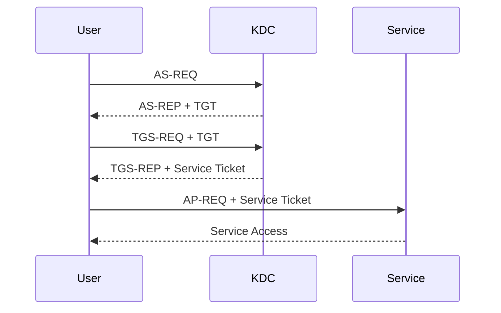

# Rubeus

Rubeus is a Windows Kerberos assessment toolkit from GhostPack. It provides functionality for interacting with Kerberos authentication, tickets, ticket caches, delegation, service tickets, pre-authentication, and other Active Directory Kerberos mechanisms.

Rubeus is particularly useful during authorised Active Directory assessments because it exposes Kerberos behaviour that is otherwise difficult to inspect using standard Windows tooling alone.

!!! warning "Authorised Testing Only"
    Rubeus can request, inspect, import, export, and manipulate Kerberos authentication material. Use it only in environments where Kerberos and credential-access testing are explicitly authorised.

---

## Overview

Rubeus focuses primarily on:

```text
Kerberos
├── Ticket inspection
├── Ticket requests
├── Ticket cache interaction
├── TGT operations
├── TGS operations
├── Kerberoasting assessment
├── AS-REP roasting assessment
├── Delegation analysis
├── Ticket renewal
├── Ticket import/export
├── Ticket description
├── Encryption types
├── KDC interaction
└── Kerberos security research
```

Typical assessment areas include:

| Area | Purpose |
| --- | --- |
| Ticket enumeration | Inspect Kerberos tickets associated with logon sessions |
| TGT analysis | Examine Ticket Granting Tickets |
| TGS analysis | Examine service tickets |
| Kerberoasting | Identify service accounts whose service tickets may expose password-strength risk |
| AS-REP roasting | Identify accounts configured without Kerberos pre-authentication |
| Delegation | Analyse Kerberos delegation configurations |
| Ticket cache | Inspect and manage Kerberos tickets |
| Encryption | Review Kerberos encryption types |
| KDC interaction | Test authentication behaviour against domain controllers |

The key assessment principle is:

```text
Kerberos Observation
        |
        v
Security Condition
        |
        v
Validation
        |
        v
Evidence
        |
        v
Security Conclusion
```

Do not treat every Rubeus result as a vulnerability.

---

# Official Project

Use the GhostPack repository as the primary source for Rubeus.

- [Rubeus - Official GitHub Repository](https://github.com/GhostPack/Rubeus){ target="_blank" rel="noopener noreferrer" }
- [Rubeus README](https://github.com/GhostPack/Rubeus/blob/master/README.md){ target="_blank" rel="noopener noreferrer" }

Rubeus is source-oriented and the upstream repository may not always provide a precompiled executable for every current revision.

For repeatable assessments, record exactly which source revision or binary build was used.

---

# Execution Models

Rubeus is commonly encountered in two forms:

```text
Native .NET Executable
        |
        +--> Rubeus.exe

PowerShell Wrapper
        |
        +--> Invoke-Rubeus.ps1
```

These are related but not identical execution models.

The official GhostPack project provides the Rubeus C# source.

`Invoke-Rubeus.ps1` from PowerSharpPack is a third-party PowerShell wrapper around a compiled Rubeus assembly.

---

# Native Rubeus.exe

The conventional workflow uses:

```text
Rubeus.exe
```

General syntax:

```powershell
.\Rubeus.exe <action> [arguments]
```

Display help:

```powershell
.\Rubeus.exe
```

or:

```powershell
.\Rubeus.exe help
```

The exact actions available depend on the Rubeus revision being used.

Always check the installed build rather than assuming syntax from an older write-up still applies.

---

# Record the Binary

Before testing:

```powershell
Get-FileHash .\Rubeus.exe -Algorithm SHA256
```

Record:

```text
Tool: Rubeus
Source: GhostPack
Revision: <COMMIT_OR_VERSION>
Architecture: <ARCHITECTURE>
SHA256: <HASH>
Timestamp: <TIME>
```

This is especially useful when Rubeus has been compiled from source.

---

# Build from Source

Clone the official repository in an authorised development environment:

```bash
git clone https://github.com/GhostPack/Rubeus.git
```

The repository contains the Visual Studio solution and C# source.

Compile using a compatible Visual Studio/.NET build environment.

The resulting executable is typically:

```text
Rubeus.exe
```

Record the source revision:

```bash
git rev-parse HEAD
```

This allows assessment evidence to identify the exact code revision used.

---

# Determine Current Windows Context

Before using Rubeus, establish the current security context.

Identity:

```powershell
whoami
```

Groups:

```powershell
whoami /groups
```

Privileges:

```powershell
whoami /priv
```

Domain information:

```powershell
whoami /fqdn
```

Logon server:

```powershell
$env:LOGONSERVER
```

Domain:

```powershell
$env:USERDNSDOMAIN
```

This helps explain which Kerberos context Rubeus is operating within.

---

# Native Kerberos Baseline

Before introducing Rubeus, inspect Kerberos using native Windows tooling.

The most important command is:

```powershell
klist
```

This displays Kerberos tickets associated with the current logon session.

Typical information includes:

```text
Client
Server
Kerberos Encryption Type
Ticket Flags
Start Time
End Time
Renew Time
```

This provides a useful baseline for comparison with Rubeus.

---

# Kerberos Fundamentals

A simplified Kerberos authentication flow is:



The Key Distribution Center normally consists logically of:

```text
KDC
├── Authentication Service
└── Ticket Granting Service
```

The Domain Controller performs these roles in Active Directory.

---

# TGT

A Ticket Granting Ticket is issued after successful Kerberos authentication.

Conceptually:

```text
User
 |
 | AS-REQ
 v
KDC
 |
 | AS-REP
 v
TGT
```

The TGT can then be used to request service tickets.

A TGT is not itself proof of administrative access.

It proves a Kerberos authentication context exists for the associated principal.

---

# TGS

A Ticket Granting Service ticket is issued for a specific service.

Conceptually:

```text
TGT
 |
 | TGS-REQ
 v
KDC
 |
 | TGS-REP
 v
Service Ticket
 |
 v
Service
```

The service is identified through a Service Principal Name.

Examples include:

```text
cifs/server.domain.local
http/server.domain.local
ldap/dc.domain.local
host/server.domain.local
```

---

# Service Principal Names

Service Principal Names identify Kerberos-enabled services.

Native enumeration can start with:

```powershell
setspn -Q */*
```

For a specific account:

```powershell
setspn -L <ACCOUNT>
```

This helps establish the Kerberos environment before using Rubeus.

---

# Ticket Enumeration

Rubeus can inspect Kerberos ticket state.

A common read-oriented action is:

```powershell
.\Rubeus.exe triage
```

This can provide a summary of Kerberos tickets visible to the current execution context.

Another inspection action is:

```powershell
.\Rubeus.exe klist
```

Compare the result with:

```powershell
klist
```

from Windows.

The assessment objective is to understand:

```text
Which tickets exist?
For which principals?
For which services?
Which encryption types are used?
When do they expire?
```

---

# Ticket Description

Rubeus can parse and describe Kerberos ticket structures.

General concept:

```text
.kirbi
   |
   v
Rubeus
   |
   v
Kerberos Ticket Metadata
```

This is useful for offline analysis of authorised ticket material.

Record:

- Client principal
- Service principal
- Realm
- Encryption type
- Ticket flags
- Start time
- End time
- Renewal time

Avoid retaining ticket material longer than required.

---

# Kerberos Encryption Types

Common Kerberos encryption types include:

```text
AES256
AES128
RC4
```

Modern Active Directory environments should generally prefer AES where supported.

Older systems or accounts may still support RC4.

The security assessment should distinguish:

```text
Encryption Type Supported
        !=
Encryption Type Negotiated
        !=
Encryption Type Required
```

Inspect actual ticket behaviour rather than relying only on account configuration.

---

# Kerberoasting Assessment

Kerberoasting evaluates service accounts associated with SPNs.

The high-level mechanism is:

```text
Authenticated Domain User
        |
        v
Request Service Ticket
        |
        v
KDC Returns TGS
        |
        v
Ticket Protected with Service Account Key
        |
        v
Offline Password-Strength Assessment
```

The underlying security issue is generally not:

```text
Kerberoasting Exists
```

because requesting service tickets is normal Kerberos functionality.

The risk depends on factors such as:

```text
Weak Service Account Password
        +
Crackable Encryption
        +
Valuable Service Account Privileges
        =
Meaningful Risk
```

---

# Identify SPN Accounts

Native Windows tooling can provide initial context.

Example:

```powershell
setspn -Q */*
```

In larger environments, use authorised directory enumeration tooling to identify user accounts with SPNs.

Record:

```text
Account
SPN
Encryption Support
Password Age
Privilege
Service Purpose
```

before assessing risk.

---

# Rubeus Kerberoast Mode

Rubeus contains:

```text
kerberoast
```

functionality.

Review the syntax supported by the current build:

```powershell
.\Rubeus.exe kerberoast /?
```

or consult the upstream documentation/source for the installed revision.

During production testing, limit requests to the accounts required for the assessment rather than automatically targeting every service account.

The result should be interpreted as:

```text
Service Ticket Obtained
        !=
Password Recovered
        !=
Privilege Obtained
```

These are separate states.

---

# AS-REP Roasting Assessment

Kerberos normally requires pre-authentication.

Simplified normal flow:

```text
AS-REQ + Pre-Authentication
        |
        v
KDC
        |
        v
AS-REP
```

Some accounts may be configured with:

```text
Do not require Kerberos preauthentication
```

In that case:

```text
AS-REQ
   |
   v
KDC
   |
   v
AS-REP
```

may occur without normal pre-authentication.

This configuration can expose material suitable for offline password-strength assessment.

---

# Rubeus AS-REP Assessment

Rubeus includes:

```text
asreproast
```

functionality.

Review the current syntax:

```powershell
.\Rubeus.exe asreproast /?
```

The security conclusion should distinguish:

```text
Account Does Not Require Pre-Authentication
        |
        v
AS-REP Material Obtainable
        |
        v
Password Strength Determines Practical Risk
```

A strong password can substantially change the practical impact.

---

# Ticket Requests

Rubeus can perform raw Kerberos ticket requests.

Relevant actions include concepts such as:

```text
asktgt
asktgs
```

These interact with the Kerberos Authentication Service and Ticket Granting Service.

Use them only where explicit ticket-request testing is required.

The important distinction is:

```text
Credential Material Available
        |
        v
Kerberos Request Constructed
        |
        v
KDC Accepts Request
        |
        v
Ticket Issued
```

Each stage provides different evidence.

---

# Requesting a TGT

The `asktgt` functionality constructs an AS request.

Review:

```powershell
.\Rubeus.exe asktgt /?
```

Rubeus supports several authentication inputs depending on the current build.

These may include:

```text
Password
Kerberos key material
Certificate
Existing Kerberos context
```

Do not place real credentials in screenshots, command histories, documentation, or assessment reports.

Use placeholders in notes:

```text
/user:<USER>
/domain:<DOMAIN>
/dc:<DOMAIN_CONTROLLER>
```

---

# Requesting a Service Ticket

The `asktgs` functionality can request a service ticket using appropriate authorised Kerberos material.

Review:

```powershell
.\Rubeus.exe asktgs /?
```

The conceptual flow is:

```text
Existing Kerberos Context
        |
        v
TGS-REQ
        |
        v
KDC
        |
        v
TGS-REP
        |
        v
Service Ticket
```

Again:

```text
Ticket Issued
        !=
Service Access Granted
```

The service performs its own authorisation checks.

---

# Ticket Cache

Windows maintains Kerberos tickets associated with logon sessions.

Native inspection:

```powershell
klist
```

Rubeus provides additional ticket-cache functionality.

The current execution context determines which sessions and tickets are visible.

Higher privileges may expose additional logon sessions.

Keep the distinction:

```text
Current User Tickets
        !=
All Host Tickets
```

---

# Logon Sessions

Windows authentication sessions are identified internally using Logon IDs or LUIDs.

Conceptually:

```text
Windows Host
├── Logon Session A
│   └── Kerberos Tickets
├── Logon Session B
│   └── Kerberos Tickets
└── Logon Session C
    └── Kerberos Tickets
```

Rubeus can expose ticket information associated with these sessions when the current security context permits it.

---

# Ticket Import and Export

Kerberos tickets may be represented in formats such as:

```text
.kirbi
```

Rubeus can work with ticket files and encoded ticket representations.

Treat ticket material as sensitive authentication material.

Do not:

- Commit tickets to Git
- Upload them to shared notes
- Include them in screenshots
- Leave them on shared assessment systems
- Retain them longer than necessary

---

# Ticket Injection Concept

Windows can associate Kerberos tickets with logon sessions.

Rubeus contains functionality for importing authorised ticket material into an appropriate Kerberos session.

This is commonly referred to as:

```text
Pass-the-Ticket
```

The conceptual model is:

```text
Kerberos Ticket
        |
        v
Windows Logon Session
        |
        v
Kerberos Authentication Context
```

Importing a ticket does not modify the permissions encoded in the associated account.

The service still performs authorisation.

---

# Ticket Purging

Windows provides native functionality to remove Kerberos tickets:

```powershell
klist purge
```

!!! warning
    Purging tickets can interrupt the current user's authentication to domain resources. Do not run this casually on production systems.

Use ticket cleanup only where necessary and authorised.

---

# Delegation

Rubeus contains functionality relevant to Kerberos delegation.

Important delegation models include:

```text
Unconstrained Delegation
Constrained Delegation
Resource-Based Constrained Delegation
```

Delegation is primarily an Active Directory configuration topic.

The dedicated Active Directory notes should explain:

```text
Configuration
Preconditions
Trust Boundary
Abuse Conditions
Detection
Remediation
```

Rubeus should remain the tool-operation reference.

---

# S4U

Kerberos includes Service-for-User extensions:

```text
S4U2Self
S4U2Proxy
```

Simplified:

```text
S4U2Self
Service requests a ticket representing a user to itself.

S4U2Proxy
Service requests a ticket to another service on behalf of that user.
```

These mechanisms are legitimate Kerberos functionality used by delegation.

Security problems occur when delegation is configured in a way that permits unintended privilege paths.

Rubeus contains:

```text
s4u
```

functionality for assessing these conditions.

Review the exact syntax:

```powershell
.\Rubeus.exe s4u /?
```

before testing.

---

# Monitor

Rubeus includes Kerberos monitoring functionality.

The purpose is to observe Kerberos ticket activity visible to the current execution context.

Review:

```powershell
.\Rubeus.exe monitor /?
```

Monitoring authentication material can expose sensitive information.

Use narrow monitoring periods and stop collection as soon as the required evidence has been obtained.

---

# Harvest

Rubeus also contains ticket-harvesting functionality.

This should be treated as credential-access testing.

Do not run broad or long-duration harvesting in production merely because the tool supports it.

Use the minimum functionality required to demonstrate the security condition.

---

# Renew

Kerberos tickets may contain renewal information.

Rubeus can interact with ticket renewal behaviour.

Native ticket information can first be reviewed with:

```powershell
klist
```

Look for:

```text
Start Time
End Time
Renew Time
```

Ticket renewal should be interpreted within the account's Kerberos policy and current authentication context.

---

# Rubeus and Mimikatz

Rubeus and Mimikatz overlap in some Kerberos functionality but have different focuses.

| Rubeus | Mimikatz |
| --- | --- |
| Kerberos-focused toolkit | Broader Windows security toolkit |
| Raw Kerberos interaction | LSASS and authentication package interaction |
| Ticket requests | Credential and ticket inspection |
| Delegation workflows | Broad authentication research |
| Kerberoasting | Credential-access functionality |
| AS-REP roasting | DPAPI, LSA, tokens and more |
| .NET/C# | Native C/C++ |

Use Rubeus when the assessment question is primarily:

```text
How is Kerberos behaving?
```

Use Mimikatz when the question involves broader Windows authentication internals.

See:

[Mimikatz](mimikatz.md)

---

# PowerSharpPack Invoke-Rubeus

A PowerShell wrapper for Rubeus is available in:

```text
PowerSharpPack
```

The relevant file is:

```text
PowerSharpBinaries/Invoke-Rubeus.ps1
```

Reference:

[PowerSharpPack - Invoke-Rubeus.ps1](https://github.com/S3cur3Th1sSh1t/PowerSharpPack/blob/master/PowerSharpBinaries/Invoke-Rubeus.ps1){ target="_blank" rel="noopener noreferrer" }

This is not the official GhostPack Rubeus distribution.

Treat it as a separate third-party execution wrapper.

---

# Invoke-Rubeus Execution Model

The PowerSharpPack wrapper embeds a compressed .NET Rubeus assembly inside PowerShell.

At a high level:

```text
Invoke-Rubeus.ps1
        |
        v
Embedded Encoded Data
        |
        v
Decode
        |
        v
GZip Decompression
        |
        v
Byte Array
        |
        v
System.Reflection.Assembly.Load()
        |
        v
Rubeus Assembly in PowerShell Process
```

The wrapper then invokes the Rubeus program entry point and captures its console output.

This means:

```text
Rubeus.exe on Disk
```

is not required for this execution model.

---

# Native EXE vs Invoke-Rubeus.ps1

| Native Rubeus | Invoke-Rubeus.ps1 |
| --- | --- |
| Executes `Rubeus.exe` | PowerShell hosts Rubeus |
| Separate Rubeus process | Rubeus assembly loaded into PowerShell |
| PE normally present on disk | Embedded assembly loaded from script |
| Native process telemetry | PowerShell and .NET telemetry |
| File-based application controls relevant | Script/.NET controls also relevant |
| Official GhostPack code can be compiled | Third-party PowerSharpPack wrapper |

The underlying Kerberos functionality is based on Rubeus, but the execution and detection surfaces differ.

---

# Inspect Invoke-Rubeus.ps1

Before using a third-party wrapper:

```powershell
Get-FileHash .\Invoke-Rubeus.ps1 -Algorithm SHA256
```

Review the file:

```powershell
Get-Content .\Invoke-Rubeus.ps1 -TotalCount 50
```

Confirm its origin.

Do not blindly execute PowerShell wrappers downloaded from arbitrary mirrors.

---

# Load a Trusted Local Copy

For a trusted, authorised local copy, standard PowerShell loading mechanisms can make the function available to the current session.

After loading the script, verify:

```powershell
Get-Command Invoke-Rubeus
```

Inspect syntax:

```powershell
Get-Command Invoke-Rubeus -Syntax
```

or:

```powershell
Get-Help Invoke-Rubeus
```

The PowerSharpPack wrapper exposes a:

```text
-Command
```

parameter used to pass a Rubeus command string to the embedded assembly.

Use the wrapper only for the specific authorised Kerberos test being performed.

---

# In-Memory Does Not Mean Invisible

A common mistake is to assume:

```text
Assembly Loaded in Memory
        =
No Detection
```

This is incorrect.

Potential telemetry includes:

```text
PowerShell
├── Script Block Logging
├── Module Logging
├── AMSI
└── Transcription

.NET
├── Assembly loading
└── Runtime behaviour

Endpoint
├── Process behaviour
├── Memory behaviour
├── Kerberos API usage
└── EDR telemetry

Network
├── AS-REQ
├── TGS-REQ
└── Kerberos authentication patterns
```

Defenders can detect behaviour without relying on the filename `Rubeus.exe`.

---

# PowerShell Language Mode

Check:

```powershell
$ExecutionContext.SessionState.LanguageMode
```

Possible values include:

```text
FullLanguage
ConstrainedLanguage
RestrictedLanguage
NoLanguage
```

PowerSharpPack wrappers depend on PowerShell and .NET functionality.

Constrained Language Mode or application control may prevent some functionality.

A failure does not automatically prove which control caused it.

---

# AMSI

PowerShell content may be inspected through the Antimalware Scan Interface.

Conceptually:

```text
PowerShell Content
        |
        v
AMSI
        |
        v
Registered Security Product
        |
        v
Inspection
```

The fact that Rubeus is embedded in a PowerShell wrapper does not automatically bypass AMSI or endpoint protection.

AMSI testing belongs in the dedicated Windows application-control material.

---

# WDAC and AppLocker

Native and PowerShell execution can encounter different policy paths.

For example:

```text
Rubeus.exe
    |
    +--> EXE policy
    +--> WDAC
    +--> Defender / EDR

Invoke-Rubeus.ps1
    |
    +--> Script policy
    +--> PowerShell controls
    +--> WDAC
    +--> AMSI
    +--> Defender / EDR
```

Therefore:

```text
EXE Blocked
+
PowerShell Wrapper Executes
```

does not automatically prove a WDAC or AppLocker bypass.

Identify the actual effective policy and enforcement path.

---

# Rubeus Through a Pivot

Kerberos commonly requires connectivity to a Domain Controller.

Relevant ports can include:

| Port | Protocol | Purpose |
| ---: | --- | --- |
| 53 | TCP/UDP | DNS |
| 88 | TCP/UDP | Kerberos |
| 389 | TCP/UDP | LDAP |
| 445 | TCP | SMB |
| 464 | TCP/UDP | Kerberos password operations |
| 636 | TCP | LDAPS |
| 3268 | TCP | Global Catalog |
| 3269 | TCP | Global Catalog over TLS |

When working through a pivot, validate the required services individually.

For example:

```powershell
Test-NetConnection <DC> -Port 88
```

From Linux through an appropriate tunnel:

```bash
nc -vz <DC> 88
```

---

# DNS Matters

Kerberos depends heavily on correct naming.

Validate DNS:

```powershell
Resolve-DnsName <DOMAIN>
```

Domain Controller discovery:

```powershell
Resolve-DnsName -Type SRV _kerberos._tcp.dc._msdcs.<DOMAIN>
```

Example structure:

```text
_kerberos._tcp.dc._msdcs.corp.local
```

Kerberos failures during pivoting are frequently caused by:

- Incorrect DNS
- Wrong realm/domain
- Inaccessible KDC
- Clock skew

rather than Rubeus itself.

---

# Time Synchronisation

Kerberos is time-sensitive.

Check local time:

```powershell
Get-Date
```

Windows time status:

```powershell
w32tm /query /status
```

Compare with the Domain Controller where authorised.

Significant clock skew can cause Kerberos authentication failures.

The troubleshooting model should therefore include:

```text
DNS
+
KDC Reachability
+
Time
+
Credentials
+
Ticket State
```

---

# Troubleshooting

## Rubeus Does Not Start

Check:

```powershell
Get-Item .\Rubeus.exe
```

Hash:

```powershell
Get-FileHash .\Rubeus.exe -Algorithm SHA256
```

Potential causes include:

- Defender
- EDR
- WDAC
- AppLocker
- Missing .NET requirements
- Corrupt build
- Architecture/environment issue

---

## Rubeus Command Is Unknown

Run:

```powershell
.\Rubeus.exe
```

and inspect the actions supported by that build.

Rubeus evolves over time.

Do not rely exclusively on syntax from old blog posts.

---

## Domain Cannot Be Found

Check:

```powershell
$env:USERDNSDOMAIN
```

Then:

```powershell
Resolve-DnsName $env:USERDNSDOMAIN
```

Check Domain Controller discovery:

```powershell
nltest /dsgetdc:<DOMAIN>
```

Verify Kerberos:

```powershell
Test-NetConnection <DC> -Port 88
```

---

## Kerberos Request Fails

Check:

```text
Domain
User
KDC
DNS
Time
Encryption Type
Pre-Authentication
Credential Material
```

Do not assume the tool is malfunctioning.

Kerberos errors often provide useful information about which stage failed.

---

## Invoke-Rubeus Is Not Recognised

Check:

```powershell
Get-Command Invoke-Rubeus -ErrorAction SilentlyContinue
```

If no function is returned, the PowerShell wrapper has not loaded successfully.

Review:

- Script path
- PowerShell errors
- Script integrity
- Language mode
- Application control
- Endpoint security telemetry

---

## Invoke-Rubeus Loads but Command Fails

Check:

```powershell
$ExecutionContext.SessionState.LanguageMode
```

Then investigate:

- Wrapper version
- Embedded Rubeus version
- PowerShell/.NET compatibility
- Required Kerberos connectivity
- Command syntax
- Endpoint security
- Current execution context

Remember that the embedded Rubeus version may differ from the latest GhostPack source.

---

# Kerberos Error Interpretation

Kerberos errors should be recorded rather than discarded.

Examples of useful categories include:

```text
Principal Unknown
Pre-Authentication Required
Pre-Authentication Failed
Clock Skew
Ticket Expired
Policy Restriction
Encryption Type Not Supported
```

A Kerberos error often tells you more about the environment than a generic application failure.

Record:

```text
Operation
KDC
Principal
Error Code
Error Name
Context
```

without exposing sensitive credential material.

---

# Evidence Collection

Useful Rubeus assessment evidence can include:

- Hostname
- Current identity
- Domain
- Domain Controller
- Rubeus source revision
- Binary SHA256
- PowerShell wrapper SHA256
- Execution model
- Kerberos ticket metadata
- Encryption type
- Ticket flags
- SPN
- Relevant account configuration
- KDC response
- Timestamp
- Detection event
- Cleanup verification

A useful evidence chain is:

```text
Observed Kerberos Condition
        |
        v
Rubeus Validation
        |
        v
KDC Response
        |
        v
Ticket / Configuration Evidence
        |
        v
Security Impact
```

---

# Security Interpretation

Rubeus often demonstrates authentication conditions rather than vulnerabilities by itself.

For example:

```text
Service Ticket Obtained
```

is normal Kerberos behaviour.

Risk emerges when additional conditions exist:

```text
Service Account
        +
Weak Password
        +
Crackable Ticket Encryption
        +
High Privilege
        =
Kerberoasting Risk
```

Similarly:

```text
Delegation Configured
```

does not automatically mean:

```text
Privilege Escalation
```

The complete trust path must be validated.

---

# Detection Opportunities

Defenders can monitor Rubeus-related activity through multiple telemetry sources.

## Endpoint

Potential indicators include:

- `Rubeus.exe` execution
- PowerShell hosting embedded .NET assemblies
- Unusual .NET assembly loading
- Ticket cache interaction
- Security-process access
- Unusual command-line arguments

---

## PowerShell

For Invoke-Rubeus-style execution:

```text
PowerShell Script Block Logging
PowerShell Module Logging
AMSI
PowerShell Transcription
EDR PowerShell Telemetry
```

Relevant PowerShell event IDs may include:

| Event ID | Description |
| ---: | --- |
| 4103 | Module logging |
| 4104 | Script block logging |

Logging depends on system configuration.

---

## Domain Controller

Kerberos activity is also visible from the KDC side.

Relevant events can include:

| Event ID | Description |
| ---: | --- |
| 4768 | Kerberos authentication ticket requested |
| 4769 | Kerberos service ticket requested |
| 4770 | Kerberos service ticket renewed |
| 4771 | Kerberos pre-authentication failed |

These events provide valuable context for Kerberos assessment activity.

---

# Kerberoasting Detection

Potential indicators include:

```text
Large Number of TGS Requests
        |
        +
Many Different SPNs
        |
        +
Unusual Client
        |
        +
Legacy Encryption Requests
```

Detection should account for legitimate applications that also request many service tickets.

Behavioural baselining is preferable to simplistic thresholds.

---

# AS-REP Roasting Detection

Potential indicators include authentication requests involving accounts configured without Kerberos pre-authentication.

The strongest remediation is usually to correct the account configuration and enforce strong credentials rather than relying solely on detection.

---

# Delegation Detection

Defenders should monitor changes to delegation-related Active Directory attributes and privileged delegation configurations.

Important concepts include:

```text
TrustedForDelegation
TrustedToAuthForDelegation
msDS-AllowedToDelegateTo
msDS-AllowedToActOnBehalfOfOtherIdentity
```

These belong primarily in the Active Directory delegation notes.

---

# Defensive Recommendations

Relevant controls include:

- Require Kerberos pre-authentication
- Use strong service-account passwords
- Prefer group Managed Service Accounts where appropriate
- Prefer AES Kerberos encryption
- Reduce RC4 dependencies
- Review SPNs regularly
- Review delegation configuration
- Minimise privileged service accounts
- Protect privileged logon sessions
- Monitor Kerberos events
- Monitor abnormal ticket requests
- Use Defender/EDR
- Use WDAC/AppLocker where appropriate
- Enable PowerShell logging
- Monitor unusual .NET assembly loading
- Maintain accurate time synchronisation

The defensive objective is not simply:

```text
Block Rubeus.exe
```

Instead:

```text
Strong Kerberos Configuration
        +
Strong Service Credentials
        +
Safe Delegation
        +
Protected Privileged Sessions
        +
Authentication Monitoring
        =
Reduced Kerberos Attack Surface
```

---

# Operational Safety

During production assessments:

- Limit Kerberos requests
- Avoid broad ticket collection
- Avoid unnecessary ticket injection
- Do not purge production tickets without need
- Avoid collecting unrelated user tickets
- Avoid password changes unless explicitly authorised
- Avoid persistent authentication modifications
- Record exact actions performed
- Remove exported ticket material after use
- Treat `.kirbi` files as credentials
- Minimise offline password testing to approved accounts

The goal is to demonstrate the security condition with minimum operational impact.

---

# Quick Reference

## Native Rubeus

Help:

```powershell
.\Rubeus.exe
```

Hash:

```powershell
Get-FileHash .\Rubeus.exe -Algorithm SHA256
```

Ticket baseline:

```powershell
klist
```

Rubeus ticket triage:

```powershell
.\Rubeus.exe triage
```

Rubeus ticket list:

```powershell
.\Rubeus.exe klist
```

Review Kerberoast syntax:

```powershell
.\Rubeus.exe kerberoast /?
```

Review AS-REP syntax:

```powershell
.\Rubeus.exe asreproast /?
```

Review TGT request syntax:

```powershell
.\Rubeus.exe asktgt /?
```

Review TGS request syntax:

```powershell
.\Rubeus.exe asktgs /?
```

Review delegation/S4U syntax:

```powershell
.\Rubeus.exe s4u /?
```

---

# PowerSharpPack Invoke-Rubeus

Hash:

```powershell
Get-FileHash .\Invoke-Rubeus.ps1 -Algorithm SHA256
```

Confirm function after loading:

```powershell
Get-Command Invoke-Rubeus
```

Syntax:

```powershell
Get-Command Invoke-Rubeus -Syntax
```

Help:

```powershell
Get-Help Invoke-Rubeus
```

The wrapper accepts Rubeus arguments through:

```text
-Command
```

Conceptually:

```text
Invoke-Rubeus
    |
    +--> -Command "<RUBEUS_ACTION_AND_ARGUMENTS>"
```

Use the same Kerberos safety principles as with the native executable.

---

# Native Windows Baseline

Identity:

```powershell
whoami
```

Domain:

```powershell
$env:USERDNSDOMAIN
```

Logon server:

```powershell
$env:LOGONSERVER
```

Kerberos tickets:

```powershell
klist
```

SPNs:

```powershell
setspn -Q */*
```

Domain Controller:

```powershell
nltest /dsgetdc:<DOMAIN>
```

Kerberos port:

```powershell
Test-NetConnection <DC> -Port 88
```

DNS:

```powershell
Resolve-DnsName -Type SRV _kerberos._tcp.dc._msdcs.<DOMAIN>
```

Time:

```powershell
w32tm /query /status
```

PowerShell language mode:

```powershell
$ExecutionContext.SessionState.LanguageMode
```

---

# Assessment Checklist

## Preparation

- [ ] Kerberos testing explicitly authorised
- [ ] Domain is within scope
- [ ] Accounts are within scope
- [ ] Domain Controllers are within scope
- [ ] Rubeus source identified
- [ ] Source revision recorded
- [ ] Binary/script hash recorded
- [ ] Test objective defined

## Baseline

- [ ] Current identity recorded
- [ ] Domain recorded
- [ ] Domain Controller identified
- [ ] DNS validated
- [ ] Kerberos port validated
- [ ] Time synchronisation checked
- [ ] Existing ticket state recorded

## Execution

- [ ] Native EXE or PowerShell wrapper recorded
- [ ] Rubeus build identified
- [ ] Only required Kerberos action used
- [ ] Requests limited to authorised principals
- [ ] Sensitive ticket material minimised

## Validation

- [ ] KDC response captured
- [ ] Ticket metadata recorded where relevant
- [ ] Encryption type recorded
- [ ] Account configuration validated
- [ ] Security impact separately demonstrated
- [ ] Tool output not treated as automatic vulnerability proof

## Detection

- [ ] Endpoint telemetry reviewed where available
- [ ] PowerShell telemetry reviewed where relevant
- [ ] Domain Controller Kerberos events reviewed
- [ ] Authentication behaviour correlated

## Cleanup

- [ ] Exported tickets removed
- [ ] Temporary scripts removed
- [ ] Temporary executables removed where required
- [ ] Test PowerShell session closed where appropriate
- [ ] No persistent changes introduced
- [ ] Cleanup documented

---

# Related Notes

- [Mimikatz](mimikatz.md)
- [PowerShell](powershell.md)
- [Impacket](impacket.md)
- [NetExec](netexec.md)
- [BloodHound](bloodhound.md)
- [Active Directory](../active-directory/index.md)
- [Windows](../windows/index.md)

Planned related material:

```text
tools/certify.md
tools/certipy.md
active-directory/kerberos/
active-directory/delegation/
active-directory/kerberoasting.md
active-directory/asrep-roasting.md
cheatsheets/rubeus.md
```

---

# References

- [Rubeus - Official GhostPack Repository](https://github.com/GhostPack/Rubeus){ target="_blank" rel="noopener noreferrer" }
- [Rubeus README](https://github.com/GhostPack/Rubeus/blob/master/README.md){ target="_blank" rel="noopener noreferrer" }
- [PowerSharpPack](https://github.com/S3cur3Th1sSh1t/PowerSharpPack){ target="_blank" rel="noopener noreferrer" }
- [PowerSharpPack - Invoke-Rubeus.ps1](https://github.com/S3cur3Th1sSh1t/PowerSharpPack/blob/master/PowerSharpBinaries/Invoke-Rubeus.ps1){ target="_blank" rel="noopener noreferrer" }
- [Microsoft - Kerberos Authentication Overview](https://learn.microsoft.com/en-us/windows-server/security/kerberos/kerberos-authentication-overview){ target="_blank" rel="noopener noreferrer" }
- [MITRE ATT&CK - Steal or Forge Kerberos Tickets](https://attack.mitre.org/techniques/T1558/){ target="_blank" rel="noopener noreferrer" }
