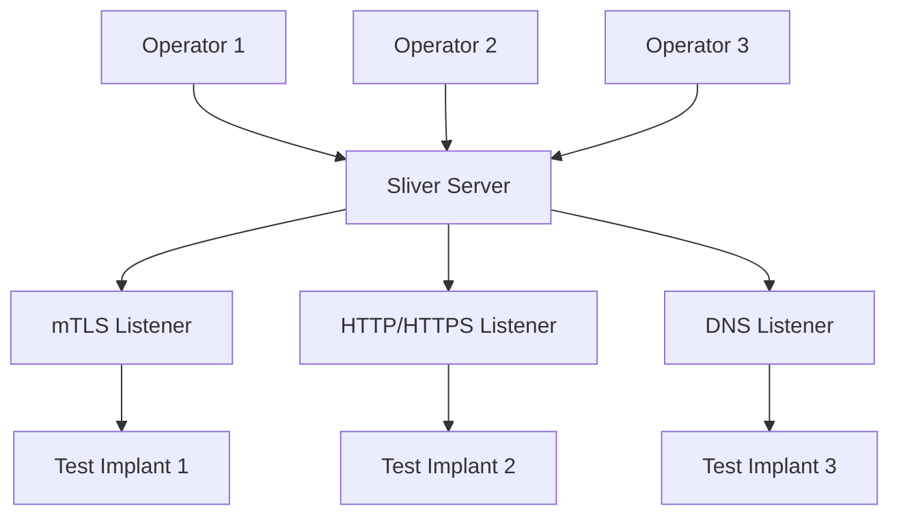
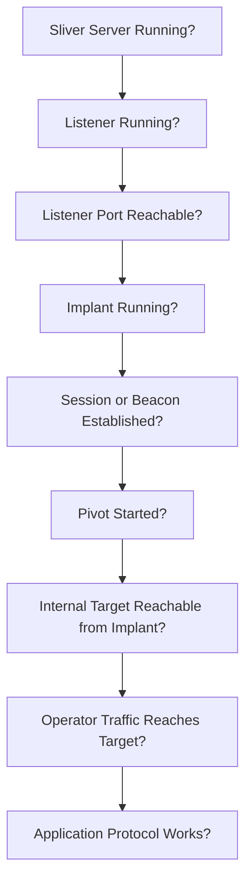
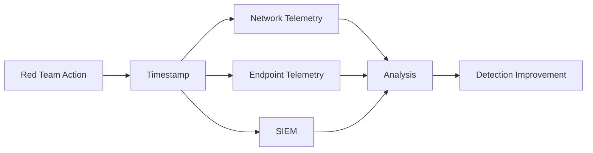

# Sliver

Sliver is an open-source command-and-control (C2) framework developed by Bishop Fox for authorised adversary simulation, red teaming, penetration testing, and security research.

Sliver provides a central server, operator clients, generated implants, session and beacon management, multiple communication protocols, pivoting, SOCKS proxies, port forwarding, multiplayer operation, and an extension ecosystem through the Armory.

!!! warning "Authorised Testing Only"
    Sliver provides remote command-and-control capabilities. Use it only against systems explicitly included in an authorised security assessment. Define the permitted hosts, networks, execution methods, communication channels, and post-exploitation actions before deployment.

---

## Overview

A typical Sliver deployment consists of:

```text
Operator
    |
    v
Sliver Client
    |
    v
Sliver Server
    |
    v
C2 Listener
    |
    v
Authorised Test Implant
    |
    v
Assessment Host
```

Multiple operators can connect to the same Sliver server:



Sliver separates:

```text
C2 Infrastructure
        |
        v
Operator Access
        |
        v
Communication Listener
        |
        v
Implant
        |
        v
Session / Beacon
```

Understanding these layers makes troubleshooting significantly easier.

---

# Official Project

Use the official Bishop Fox project as the primary source.

- [Sliver - Official GitHub Repository](https://github.com/BishopFox/sliver){ target="_blank" rel="noopener noreferrer" }
- [Sliver Documentation](https://sliver.sh/docs){ target="_blank" rel="noopener noreferrer" }
- [Sliver Releases](https://github.com/BishopFox/sliver/releases){ target="_blank" rel="noopener noreferrer" }
- [Bishop Fox](https://bishopfox.com/){ target="_blank" rel="noopener noreferrer" }

Avoid downloading Sliver binaries from unknown mirrors.

---

# Architecture

The main components are:

| Component | Purpose |
| --- | --- |
| Sliver Server | Central C2 infrastructure |
| Sliver Client | Operator console |
| Listener | Accepts implant communications |
| Implant | Authorised test agent |
| Session | Interactive implant connection |
| Beacon | Asynchronous implant connection |
| Multiplayer | Multiple operators using one server |
| Armory | Extension and package ecosystem |
| SOCKS | Proxy access through a controlled implant |
| Port Forward | Explicit forwarding through a controlled implant |

Conceptually:

```text
                    +----------------+
                    | Sliver Server  |
                    +-------+--------+
                            |
             +--------------+--------------+
             |              |              |
            mTLS          HTTPS           DNS
             |              |              |
             v              v              v
         Implant A      Implant B      Implant C
```

---

# Server and Client

Sliver commonly uses separate:

```text
sliver-server
```

and:

```text
sliver-client
```

components.

The server maintains the C2 infrastructure.

The client provides the operator console.

This separation is important for team environments because operators do not need direct administrative access to the underlying C2 server.

---

# Installation

Use an official Sliver release appropriate for the operator platform.

After obtaining the authorised release, verify it before use.

Example:

```bash
sha256sum sliver-server
```

and:

```bash
sha256sum sliver-client
```

Record:

```text
Tool
Version
Source
SHA256
Assessment
Date
```

Check the installed version:

```bash
./sliver-server version
```

or use the version/help functionality provided by the installed release.

Because Sliver evolves regularly, always review:

```text
help
```

inside the console before relying on commands from older write-ups.

---

# Start the Server

A local lab server can be started with:

```bash
./sliver-server
```

The Sliver console should appear.

Use:

```text
help
```

to display available commands.

The server console is used to manage:

```text
Listeners
Implants
Sessions
Beacons
Operators
Jobs
Profiles
Extensions
```

depending on the installed version.

---

# Help System

Sliver has extensive built-in help.

Start with:

```text
help
```

Then inspect individual commands:

```text
help sessions
```

```text
help beacons
```

```text
help generate
```

```text
help jobs
```

```text
help socks5
```

Use the installed release's help as the authoritative syntax reference.

---

# Listener Concepts

Sliver supports several communication mechanisms.

Common C2 transports include:

```text
mTLS
HTTP
HTTPS
DNS
```

Different transports have different:

```text
Network Requirements
Performance
Reliability
Visibility
Operational Complexity
```

Choose the simplest transport that satisfies the authorised assessment objective.

---

# mTLS

Mutual TLS is one of Sliver's core communication options.

Conceptually:

```text
Implant
   |
   | mTLS
   v
Sliver Server
```

A lab listener can be started using the mTLS functionality provided by the server console.

Review:

```text
help mtls
```

before starting it.

mTLS is useful when:

- Direct TCP connectivity exists
- Reliable interactive communication is required
- DNS-based communication is unnecessary
- The assessment infrastructure permits the selected listener port

---

# HTTP and HTTPS

Sliver supports HTTP and HTTPS communication.

Conceptually:

```text
Implant
    |
    v
HTTP / HTTPS
    |
    v
Sliver Server
```

Review:

```text
help http
```

and:

```text
help https
```

HTTP-based communication may fit environments where web traffic is permitted, but an assessment should not assume that:

```text
TCP/443
```

automatically means:

```text
Traffic Is Indistinguishable from Normal HTTPS
```

Network and endpoint controls can still identify abnormal behaviour.

---

# DNS

Sliver supports DNS-based C2.

Conceptually:

```text
Implant
    |
    v
DNS Queries
    |
    v
Authoritative DNS Infrastructure
    |
    v
Sliver Server
```

DNS-based C2 requires additional infrastructure planning.

Relevant considerations include:

```text
Domain Ownership
Authoritative DNS
Delegation
Resolver Behaviour
Query Volume
Latency
Logging
Scope
```

Use DNS C2 only when it is required by the assessment plan.

Do not introduce unnecessary DNS infrastructure for a test that can be completed safely using a simpler transport.

---

# Jobs

Listeners and other server-side tasks may appear as jobs.

Inspect:

```text
jobs
```

Use:

```text
help jobs
```

for the installed release.

A useful troubleshooting sequence is:

```text
Listener Command Issued
        |
        v
Job Created?
        |
        v
Port Listening?
        |
        v
Network Reachable?
        |
        v
Implant Connects?
```

Do not troubleshoot the implant first if the listener itself is not active.

---

# Listener Validation

After starting an authorised listener, verify the operating system is actually listening.

Linux:

```bash
ss -lntup
```

For a specific TCP port:

```bash
ss -lntp | grep '<PORT>'
```

Also verify firewall policy.

The correct sequence is:

```text
Sliver Listener
        |
        v
Operating System Listener
        |
        v
Host Firewall
        |
        v
Network Firewall
        |
        v
Target Connectivity
```

---

# Implant Generation

Sliver can generate implants for authorised assessment systems.

Review:

```text
help generate
```

before generating an implant.

Generation options vary between releases and may include choices relating to:

```text
Operating System
Architecture
C2 Endpoint
Transport
Connection Mode
Output Format
```

The assessment should define these parameters before generation.

---

# Implant Naming

Use identifiable test names.

For example:

```text
LAB-WIN11-01
VDI-TEST-01
ADLAB-WS01
```

Avoid intentionally misleading names during ordinary penetration tests unless masquerading is explicitly part of the authorised adversary-simulation objective.

Clear names improve:

- Evidence collection
- Operator coordination
- Cleanup
- Incident-response deconfliction

---

# Implant Tracking

For each generated test implant, record:

```text
Name
Sliver Version
Generation Time
Operating System
Architecture
Transport
C2 Endpoint
SHA256
Target Host
Deployment Time
Removal Time
```

Hash a generated file:

Linux:

```bash
sha256sum <FILE>
```

Windows:

```powershell
Get-FileHash .\<FILE> -Algorithm SHA256
```

This creates a reliable chain between generated test tooling and endpoint telemetry.

---

# Sessions

A Sliver session represents an interactive connection.

List sessions:

```text
sessions
```

A session may expose information such as:

```text
Session ID
Name
Transport
Remote Address
Hostname
Username
Operating System
Architecture
Last Activity
```

Select a session using the syntax shown by:

```text
help use
```

or:

```text
help sessions
```

depending on the installed version.

---

# Session Model

An interactive session can be represented as:

```text
Operator
    |
    v
Sliver Server
    |
    v
Live Connection
    |
    v
Test Implant
```

Interactive sessions generally provide faster command execution but require a more continuously available communication path.

---

# Beacons

Sliver also supports asynchronous beaconing.

List beacons:

```text
beacons
```

A beacon periodically checks in with the server.

Conceptually:

```text
Implant
    |
    | wait
    |
    v
Check In
    |
    v
Receive Task
    |
    v
Execute
    |
    v
Return Result
    |
    v
Wait
```

This differs from an interactive session.

---

# Session vs Beacon

| Session | Beacon |
| --- | --- |
| Interactive | Asynchronous |
| Live connection | Periodic check-in |
| Fast command response | Delayed task execution |
| Continuous communication | Intermittent communication |
| Useful for interactive testing | Useful for controlled asynchronous testing |

The correct mode depends on the assessment.

Do not select beacon mode solely because it may produce less continuous traffic.

---

# Beacon Timing

Beacon behaviour may involve concepts such as:

```text
Interval
Jitter
```

These control when an authorised test implant checks in.

Before changing timing, consider:

```text
Assessment Objective
Network Load
Detection Exercise Requirements
Operator Coordination
Test Duration
```

Very aggressive beacon timing can generate unnecessary traffic.

---

# Current Context

Once an authorised session or beacon exists, establish the host context before doing anything else.

Relevant questions include:

```text
Which host?
Which user?
Which operating system?
Which architecture?
Which network interfaces?
Which privileges?
```

Do not assume the session landed in the context expected by the operator.

---

# Basic Host Validation

Sliver provides commands for basic host context.

Use:

```text
help
```

inside the selected session to inspect the available functionality.

Typical assessment information includes:

```text
Hostname
Username
Process ID
Working Directory
Network Interfaces
Operating System
Architecture
```

Where possible, correlate this information with native operating-system commands.

---

# Process Information

Process enumeration can be useful for:

```text
Host Context
Security Product Identification
Application Discovery
Evidence
Troubleshooting
```

Use the minimum required enumeration.

Do not terminate or manipulate processes merely because they appear security-relevant.

---

# File-System Operations

Sliver provides remote file-system functionality.

Common concepts include:

```text
pwd
ls
cd
cat
download
upload
```

Exact command names and options should be checked with:

```text
help
```

Treat remote file access as normal assessment access:

- Stay within scope
- Minimise sensitive-data collection
- Avoid unrelated user files
- Record transferred files
- Remove temporary files

---

# File Transfer

When transferring an authorised test file, record:

```text
Source
Destination
SHA256
Purpose
Timestamp
Cleanup
```

Before transfer:

```bash
sha256sum <FILE>
```

After transfer on Windows:

```powershell
Get-FileHash C:\Path\To\<FILE> -Algorithm SHA256
```

Matching hashes demonstrate that the intended test file was transferred unchanged.

---

# Remote Command Execution

Sliver provides remote execution functionality through an established authorised session.

The security significance is:

```text
Established Test Agent
        |
        v
Command Execution
        |
        v
Current User Context
```

This does not automatically mean:

```text
Administrative Access
```

Always establish the current token and privileges separately.

---

# Privilege Context

On Windows, useful native validation includes:

```powershell
whoami
```

```powershell
whoami /groups
```

```powershell
whoami /priv
```

On Linux:

```bash
id
```

and:

```bash
sudo -l
```

where authorised.

Keep the distinction:

```text
C2 Session
        !=
Privileged Session
```

---

# Network Interfaces

Before using a compromised test host as a pivot, identify its network interfaces.

Conceptually:

```text
Host
├── External / User Network
├── Internal Network
└── Management Network
```

A dual-homed system may expose a potential network pivot path.

The correct reasoning is:

```text
Additional Interface Observed
        |
        v
Network Identified
        |
        v
Route / Reachability Validated
        |
        v
Scope Confirmed
        |
        v
Pivot Candidate
```

---

# Pivoting

Sliver can provide network pivoting capabilities through an authorised implant.

Before enabling any pivot:

1. Identify the reachable network.
2. Confirm that network is in scope.
3. Determine which services need to be reached.
4. Select the simplest forwarding mechanism.
5. Record the configuration.
6. Remove it after testing.

Do not expose an entire internal network merely because the implant can reach it.

---

# SOCKS5

Sliver provides SOCKS5 functionality through an established implant.

Review:

```text
help socks5
```

The conceptual architecture is:

```text
Operator Tool
    |
    v
SOCKS5 Listener
    |
    v
Sliver Server
    |
    v
Authorised Implant
    |
    v
Internal Service
```

This is useful for applications that support SOCKS directly or can operate through ProxyChains.

---

# SOCKS Validation

After starting an authorised SOCKS proxy, confirm the local listener.

Linux:

```bash
ss -lntp
```

Then test a specific in-scope service.

For example:

```bash
curl --socks5 127.0.0.1:<SOCKS_PORT> http://<INTERNAL_HOST>
```

For proxy-side hostname resolution:

```bash
curl --socks5-hostname 127.0.0.1:<SOCKS_PORT> http://<INTERNAL_HOSTNAME>
```

---

# ProxyChains

Configure the local SOCKS endpoint in:

```text
/etc/proxychains4.conf
```

Example structure:

```text
socks5 127.0.0.1 <SOCKS_PORT>
```

Then validate a specific TCP service:

```bash
proxychains4 nc -vz <TARGET> <PORT>
```

Do not begin with broad network scanning.

Confirm the forwarding path first.

---

# Nmap Through SOCKS

When Nmap is used through ProxyChains, prefer TCP connect scanning.

Example:

```bash
proxychains4 nmap -sT -Pn -p 80,443,445,3389 <TARGET>
```

The reasoning is:

```text
Nmap
    |
    v
TCP connect()
    |
    v
ProxyChains
    |
    v
SOCKS
```

Raw SYN scanning does not map cleanly to application-layer SOCKS proxying.

---

# Port Forwarding

Sliver also provides port-forwarding functionality.

Use:

```text
help portfwd
```

or the equivalent help command available in the installed release.

Explicit port forwarding is useful when:

```text
One Host
+
One Service
```

needs to be reached.

SOCKS is often preferable when:

```text
Multiple Hosts
+
Multiple Services
```

are required.

---

# Pivot Choice

A useful decision model is:

```text
Need One Internal Service?
        |
        +--> Port Forward

Need Several TCP Services?
        |
        +--> SOCKS

Need Broad Routed Network Access?
        |
        +--> Consider Ligolo-ng
```

Do not add complexity without a reason.

See:

[Chisel](chisel.md)

and:

[Ligolo-ng](ligolo-ng.md)

---

# Multiple Sessions

A Sliver server may manage several authorised test systems simultaneously.

Example:

```text
Sliver Server
├── WS01
├── WS02
├── APP01
└── WEB01
```

Always verify the selected session before issuing a command.

A useful operational habit is:

```text
Session
    |
    v
Hostname
    |
    v
Username
    |
    v
Scope
    |
    v
Action
```

This reduces accidental execution on the wrong host.

---

# Multiplayer

Sliver supports multiplayer operation.

This allows multiple operators to connect to a shared server.

Conceptually:

```text
Operator A ----+
               |
Operator B ----+--> Sliver Server --> Test Systems
               |
Operator C ----+
```

Multiplayer is useful for:

- Red-team exercises
- Purple-team exercises
- Collaborative assessments
- Operator handover
- Separate infrastructure and testing roles

---

# Operator Configuration

Sliver can generate operator configuration for remote clients.

Review the server's current multiplayer/operator help before creating a configuration.

Treat operator configuration files as credentials.

They may grant access to:

```text
C2 Server
Sessions
Beacons
Assessment Data
```

Do not commit them to Git or distribute them through insecure channels.

---

# Operator Security

For each operator:

```text
Unique Identity
        |
        v
Individual Configuration
        |
        v
Controlled Server Access
```

Avoid sharing one operator configuration among an entire team.

Individual access improves:

- Accountability
- Revocation
- Auditability
- Incident response

---

# Armory

Sliver provides an extension ecosystem called the:

```text
Armory
```

Use:

```text
armory
```

and:

```text
help armory
```

to inspect functionality supported by the installed version.

Armory packages can extend Sliver with additional commands and capabilities.

---

# Armory Trust Model

Treat extensions as code.

Before installing an extension:

```text
Identify Source
        |
        v
Review Purpose
        |
        v
Review Code / Package
        |
        v
Check Compatibility
        |
        v
Install
```

Do not install every available package into production C2 infrastructure.

Third-party extensions expand both capability and attack surface.

---

# Extensions

Sliver extensions may integrate external tooling or custom functionality.

For each extension, record:

```text
Name
Version
Source
Purpose
Assessment
Removal
```

Remove extensions that are no longer required.

This keeps assessment infrastructure reproducible.

---

# Profiles

Sliver supports reusable generation configuration through profiles in relevant releases.

The purpose is to avoid repeatedly specifying the same implant configuration.

Conceptually:

```text
Profile
├── Operating System
├── Architecture
├── C2 Transport
├── C2 Endpoint
└── Generation Options
```

Use:

```text
help profiles
```

or the appropriate installed-version help.

Profiles improve consistency but should not cause operators to reuse inappropriate configurations across unrelated assessments.

---

# Stagers

Sliver includes functionality associated with staged delivery.

Staging separates:

```text
Initial Component
        |
        v
Secondary Component
        |
        v
Operational Agent
```

This is a delivery architecture rather than a requirement for Sliver operation.

For ordinary assessments, use the simplest deployment model that satisfies the test objective.

Detailed staged-payload design belongs in the dedicated Red Teaming notes rather than this tool page.

---

# Sliver and Windows

On Windows, Sliver testing may interact with security controls including:

```text
Microsoft Defender
EDR
WDAC
AppLocker
AMSI
PowerShell Controls
Network Firewall
ASR Rules
```

A blocked implant does not automatically prove which control caused the block.

The correct workflow is:

```text
Execution Attempt
        |
        v
Observed Result
        |
        v
Collect Endpoint Telemetry
        |
        v
Identify Enforcement Source
        |
        v
Confirm Effective Control
```

---

# Sliver and Application Control

If a generated test binary cannot execute, investigate:

```text
WDAC
AppLocker
Defender
EDR
File Reputation
Path Rules
Publisher Rules
Hash Rules
```

Do not immediately modify the payload to evade the control.

For an application-control assessment, a block may be the expected and valuable result.

---

# Sliver and Linux

On Linux, establish:

```bash
id
```

Current directory:

```bash
pwd
```

Interfaces:

```bash
ip addr
```

Routes:

```bash
ip route
```

Listeners:

```bash
ss -lntup
```

Again:

```text
Agent Running
        !=
Root Access
```

---

# Sliver and Active Directory

Sliver can provide a remote execution and pivoting platform during an authorised Active Directory assessment.

However, Active Directory-specific reasoning should remain in the AD notes.

A useful workflow is:

```text
Sliver Session
        |
        v
Host / User Context
        |
        v
Domain Context
        |
        v
Network Reachability
        |
        v
Dedicated AD Tool
```

Examples of dedicated tools include:

- BloodHound
- NetExec
- Impacket
- Rubeus
- Certify
- Certipy

Do not duplicate their complete functionality inside the Sliver page.

---

# Sliver and Mimikatz

Mimikatz is a dedicated Windows authentication-security tool.

Sliver is a C2 framework.

The distinction is:

```text
Sliver
    |
    +--> Command and Control

Mimikatz
    |
    +--> Windows Authentication Research
```

If credential-access testing is authorised, use the dedicated Mimikatz methodology and record the security boundary separately.

See:

[Mimikatz](mimikatz.md)

---

# Sliver and Rubeus

Rubeus focuses on Kerberos.

Sliver provides the remote operator channel.

Keep the reasoning separate:

```text
Sliver Session Established
        |
        v
Rubeus Kerberos Test
        |
        v
KDC Response
        |
        v
Kerberos Security Conclusion
```

See:

[Rubeus](rubeus.md)

---

# Sliver and AD CS

Certify and Certipy should remain the primary AD CS references.

See:

[Certify](certify.md)

and:

[Certipy](certipy.md)

Sliver may provide access to the assessment host, but it does not replace AD CS-specific analysis.

---

# DNS Troubleshooting

If a Sliver-controlled system can reach an IP address but not an internal hostname, investigate DNS separately.

Windows:

```powershell
Resolve-DnsName <HOSTNAME>
```

Linux:

```bash
dig <HOSTNAME>
```

The correct distinction is:

```text
C2 Connectivity
        !=
Internal DNS Resolution
```

---

# Network Troubleshooting

Use a layered model:



Test one layer at a time.

---

# Implant Does Not Connect

Check:

```text
Correct C2 Endpoint?
Correct Port?
Listener Active?
Host Firewall?
Network Firewall?
DNS?
Proxy?
TLS?
Server Reachable?
```

From Windows:

```powershell
Test-NetConnection <SERVER> -Port <PORT>
```

From Linux:

```bash
nc -vz <SERVER> <PORT>
```

Do not regenerate the implant repeatedly before validating basic connectivity.

---

# Session Disappears

Possible causes include:

```text
Process Exited
Network Interrupted
Endpoint Security Terminated Process
Listener Stopped
Host Rebooted
Firewall Changed
```

Check:

```text
sessions
```

and:

```text
beacons
```

Then correlate with endpoint and server telemetry.

---

# Beacon Does Not Return Quickly

Remember:

```text
Beacon
        !=
Interactive Session
```

The task may not execute until the next check-in.

Review:

```text
Beacon Interval
Jitter
Last Check-In
Task Queue
```

before assuming failure.

---

# SOCKS Starts but Target Is Unreachable

First determine whether the implant can reach the target.

The correct sequence is:

```text
Can Implant Reach Target?
        |
        v
Is SOCKS Running?
        |
        v
Can Operator Reach SOCKS?
        |
        v
Can Application Use SOCKS?
        |
        v
Does Target Protocol Work?
```

If the implant cannot reach the destination, the SOCKS proxy cannot create that reachability.

---

# ProxyChains Fails

Test SOCKS directly first.

For HTTP:

```bash
curl --socks5 127.0.0.1:<PORT> http://<TARGET>
```

If that works but ProxyChains fails, review:

```text
ProxyChains Configuration
SOCKS Version
DNS
Application Compatibility
Raw Socket Requirements
```

---

# Evidence Collection

Useful Sliver evidence can include:

- Sliver version
- Server hostname
- Listener type
- Listener port
- Operator identity
- Implant identifier
- Implant SHA256
- Target hostname
- Target username
- Target architecture
- Session or beacon ID
- Transport
- Connection time
- Pivot configuration
- SOCKS listener
- Specific authorised validation
- Endpoint detection result
- Network detection result
- Cleanup time

A strong evidence chain is:

```text
Authorised Test Implant
        |
        v
Execution Observed
        |
        v
C2 Connection Established
        |
        v
Session Context Confirmed
        |
        v
Approved Capability Tested
        |
        v
Detection / Security Control Evaluated
        |
        v
Cleanup Confirmed
```

---

# Security Interpretation

The existence of a Sliver session demonstrates:

```text
Code Execution
        +
Network Communication
        =
C2 Capability
```

It does not automatically demonstrate:

```text
Privilege Escalation
Credential Access
Lateral Movement
Domain Compromise
Data Exfiltration
```

Each of those requires separate evidence.

For example:

```text
Low-Privilege User
        |
        v
Sliver Agent Executes
        |
        v
Outbound C2 Established
```

may demonstrate weaknesses in:

```text
Application Control
Endpoint Detection
Egress Filtering
Network Monitoring
```

without demonstrating administrative compromise.

---

# Detection Opportunities

Defenders can detect Sliver activity across several layers.

```text
Endpoint
+
Network
+
DNS
+
Identity
+
Application Control
```

Detection should not rely on one indicator.

---

# Endpoint Detection

Potential telemetry includes:

```text
Process Creation
Executable Creation
File Hash
Parent / Child Relationships
Memory Behaviour
Network Connections
File Transfers
Command Execution
```

Relevant sources may include:

- Microsoft Defender
- EDR
- Sysmon
- Windows Security auditing
- Linux audit frameworks
- Process accounting

---

# Network Detection

Potential indicators include:

```text
Unexpected Outbound Connections
Long-Lived Connections
Periodic Beaconing
Unusual TLS Behaviour
Unexpected DNS Patterns
Connections to New Infrastructure
Internal SOCKS / Pivot Traffic
```

Network behaviour should be correlated with the expected role of the host.

A workstation and a production server may have very different normal communication patterns.

---

# DNS Detection

DNS-based C2 may create unusual:

```text
Query Frequency
Subdomain Length
Record Patterns
Authoritative Domains
Query Types
Response Patterns
```

However, defenders should avoid simplistic detection based only on:

```text
Long DNS Name
```

because legitimate applications can also produce complex DNS traffic.

Use behavioural context.

---

# Beacon Detection

Periodic traffic can produce timing patterns.

Conceptually:

```text
Connection
    |
    v
Wait
    |
    v
Connection
    |
    v
Wait
```

Jitter can change timing but does not remove other behavioural signals.

Correlate:

```text
Timing
Destination
Process
Protocol
Host Role
```

---

# File Detection

Generated test files may be detected through:

```text
Hash
Static Signature
Metadata
Structure
Reputation
Behaviour
```

A successful detection is valuable evidence.

Do not automatically attempt to bypass it unless evasion testing is explicitly part of the assessment.

---

# Application-Control Detection

Relevant controls can include:

```text
WDAC
AppLocker
Defender
EDR
ASR
```

Record:

```text
File
Path
Hash
User
Rule
Control
Result
Timestamp
```

This provides significantly stronger evidence than simply stating:

```text
Sliver was blocked.
```

---

# Purple-Team Validation

Sliver is useful for controlled purple-team exercises because a specific action can be correlated with defensive telemetry.

A useful workflow is:



For every test:

```text
Action
Timestamp
Host
User
Expected Telemetry
Observed Telemetry
Detection
Response
```

should be recorded.

---

# Defensive Recommendations

Relevant controls include:

- Application control
- Endpoint detection and response
- Microsoft Defender
- Attack Surface Reduction rules
- Egress filtering
- Network segmentation
- DNS monitoring
- TLS/network analytics
- Host-based firewalls
- Least privilege
- Privileged access management
- PowerShell security controls
- Centralised logging
- Process telemetry
- Network telemetry
- Incident-response playbooks

The defensive objective should not be:

```text
Block sliver.exe
```

Instead:

```text
Prevent Unauthorised Execution
        +
Restrict Outbound Communication
        +
Detect C2 Behaviour
        +
Limit Privilege
        +
Segment Networks
        +
Respond Quickly
```

---

# C2 Infrastructure Security

The Sliver server itself is sensitive infrastructure.

It may contain:

```text
Operator Credentials
Assessment Metadata
Implant Information
Session Information
Generated Files
Target Information
```

Protect it using:

```text
Restricted Administrative Access
Host Firewall
SSH Key Authentication
Strong Authentication
Patch Management
Disk Encryption
Backups Where Appropriate
Central Logging
```

Do not expose unnecessary Sliver management interfaces directly to the Internet.

---

# Assessment Separation

Where possible, separate:

```text
Operator Workstation
        |
        v
Management Channel
        |
        v
Sliver Server
        |
        v
C2 Listener
```

This reduces the need for operators to administer the C2 server directly during every test.

---

# Infrastructure Inventory

Maintain an inventory such as:

| Item | Value |
| --- | --- |
| Server | `<C2_SERVER>` |
| Sliver version | `<VERSION>` |
| Operator | `<OPERATOR>` |
| Listener | `<TRANSPORT>` |
| Port | `<PORT>` |
| Assessment | `<ASSESSMENT>` |
| Start | `<TIME>` |
| End | `<TIME>` |

This becomes particularly important when multiple assessments share infrastructure.

---

# Operational Safety

During production assessments:

- Use only authorised hosts
- Use clear test identifiers
- Generate only required implants
- Avoid unnecessary persistence
- Avoid destructive commands
- Avoid broad credential collection
- Avoid unrelated file access
- Avoid uncontrolled lateral movement
- Limit pivot networks to scope
- Coordinate multi-operator activity
- Record timestamps
- Record file hashes
- Track every deployed implant
- Remove test tooling after use
- Confirm all listeners are stopped

A C2 framework increases operational capability and therefore also increases the need for disciplined change control.

---

# Cleanup

Cleanup should cover both:

```text
Target Infrastructure
```

and:

```text
C2 Infrastructure
```

---

## Target Cleanup

Verify:

- Test process terminated
- Test binary removed where required
- Temporary files removed
- Port forwards stopped
- SOCKS proxies stopped
- No persistence remains
- No unintended configuration changes remain

---

## Server Cleanup

Review:

```text
sessions
```

```text
beacons
```

```text
jobs
```

and any active SOCKS or forwarding functionality.

Stop no-longer-required listeners and jobs using the installed release's help.

Do not blindly terminate infrastructure used by another authorised operator.

---

## File Cleanup

On Linux, identify assessment files before removal:

```bash
find <ASSESSMENT_DIRECTORY> -maxdepth 2 -type f -print
```

On Windows:

```powershell
Get-ChildItem C:\Path\To\Assessment -Recurse -File
```

Remove only files known to belong to the assessment.

---

# Troubleshooting Checklist

When Sliver does not behave as expected, work through:

```text
Server
    |
    v
Listener
    |
    v
Network
    |
    v
Implant
    |
    v
Session / Beacon
    |
    v
Current Context
    |
    v
Requested Capability
```

Do not skip directly to payload modification.

---

# Quick Reference

## Start Server

```bash
./sliver-server
```

## Server Help

```text
help
```

## Sessions

```text
sessions
```

## Beacons

```text
beacons
```

## Jobs

```text
jobs
```

## Generate Help

```text
help generate
```

## mTLS Help

```text
help mtls
```

## HTTP Help

```text
help http
```

## HTTPS Help

```text
help https
```

## SOCKS Help

```text
help socks5
```

## Port Forward Help

```text
help portfwd
```

## Armory

```text
armory
```

## Armory Help

```text
help armory
```

## Listener Validation

```bash
ss -lntup
```

## Test TCP Connectivity from Windows

```powershell
Test-NetConnection <SERVER> -Port <PORT>
```

## Test TCP Connectivity from Linux

```bash
nc -vz <SERVER> <PORT>
```

## Hash Linux File

```bash
sha256sum <FILE>
```

## Hash Windows File

```powershell
Get-FileHash .\<FILE> -Algorithm SHA256
```

## SOCKS Test

```bash
curl --socks5 127.0.0.1:<SOCKS_PORT> http://<TARGET>
```

## SOCKS with Remote Name Resolution

```bash
curl --socks5-hostname 127.0.0.1:<SOCKS_PORT> http://<HOSTNAME>
```

## ProxyChains Test

```bash
proxychains4 nc -vz <TARGET> <PORT>
```

## Nmap Through SOCKS

```bash
proxychains4 nmap -sT -Pn -p 80,443,445,3389 <TARGET>
```

---

# Common Mistakes

## Treating a Session as Administrator Access

Always verify:

```text
User
Groups
Privileges
Integrity
```

separately.

---

## Generating Before Starting a Listener

Validate the C2 infrastructure first.

---

## Regenerating When Connectivity Is Broken

Test:

```text
Server
Port
Firewall
DNS
Route
```

before rebuilding the implant.

---

## Confusing Sessions and Beacons

Sessions are interactive.

Beacons are asynchronous.

Expect different response behaviour.

---

## Starting Broad Pivots Without Scope Validation

Confirm the destination network is authorised before forwarding traffic.

---

## Treating SOCKS as Routed Networking

SOCKS is an application-layer proxy.

If broad subnet routing is required, Ligolo-ng may be a better fit.

---

## Using SYN Scans Through SOCKS

Prefer:

```text
-sT
```

for Nmap through ProxyChains.

---

## Ignoring DNS

A working pivot does not guarantee internal hostname resolution.

---

## Installing Unreviewed Armory Packages

Extensions execute code and expand the C2 trust boundary.

Review them first.

---

## Sharing Operator Credentials

Use individual operator configurations.

---

## Treating In-Memory as Invisible

Memory-resident activity can still be visible through:

```text
EDR
AMSI
ETW
Process Telemetry
Network Telemetry
Memory Analysis
```

---

## Bypassing a Successful Security Control Automatically

If Defender, EDR, WDAC, AppLocker, or another control blocks the test, record and investigate the control first.

Evasion is a separate assessment objective.

---

## Forgetting Cleanup

Track every:

```text
Implant
Listener
Session
Beacon
SOCKS Proxy
Port Forward
Temporary File
Extension
```

created during the assessment.

---

# Assessment Checklist

## Preparation

- [ ] C2 testing explicitly authorised
- [ ] Hosts within scope
- [ ] Networks within scope
- [ ] Allowed transports defined
- [ ] Sliver version recorded
- [ ] C2 server secured
- [ ] Operator access controlled
- [ ] Cleanup plan defined

## Infrastructure

- [ ] Server started
- [ ] Listener configured
- [ ] Listener verified at OS level
- [ ] Host firewall reviewed
- [ ] Network firewall reviewed
- [ ] Operator connectivity verified

## Implant

- [ ] Test host confirmed
- [ ] OS confirmed
- [ ] Architecture confirmed
- [ ] Transport selected
- [ ] C2 endpoint confirmed
- [ ] Implant generated
- [ ] SHA256 recorded
- [ ] Implant identifier recorded

## Connection

- [ ] Session or beacon established
- [ ] Target hostname confirmed
- [ ] Current user confirmed
- [ ] Privilege context confirmed
- [ ] Transport recorded
- [ ] Timestamp recorded

## Pivoting

- [ ] Additional network identified
- [ ] Network scope confirmed
- [ ] Implant reachability confirmed
- [ ] SOCKS or forwarding selected
- [ ] Listener verified
- [ ] Specific target validated
- [ ] DNS behaviour validated

## Purple Team

- [ ] Test action defined
- [ ] Expected telemetry defined
- [ ] Timestamp recorded
- [ ] Endpoint telemetry reviewed
- [ ] Network telemetry reviewed
- [ ] SIEM detection reviewed
- [ ] Response behaviour reviewed
- [ ] Improvement recorded

## Evidence

- [ ] Sliver version captured
- [ ] Listener captured
- [ ] Implant hash captured
- [ ] Session/beacon captured
- [ ] Host/user context captured
- [ ] Approved capability result captured
- [ ] Security control result captured
- [ ] Sensitive information minimised

## Cleanup

- [ ] Test processes terminated
- [ ] Test implants removed
- [ ] Temporary files removed
- [ ] SOCKS proxies stopped
- [ ] Port forwards stopped
- [ ] Sessions reviewed
- [ ] Beacons reviewed
- [ ] Jobs reviewed
- [ ] Listeners reviewed
- [ ] Operator configurations secured
- [ ] No persistence remains
- [ ] Cleanup documented

---

# Related Notes

- [Ligolo-ng](ligolo-ng.md)
- [Chisel](chisel.md)
- [Mimikatz](mimikatz.md)
- [Rubeus](rubeus.md)
- [Certify](certify.md)
- [Certipy](certipy.md)
- [BloodHound](bloodhound.md)
- [Impacket](impacket.md)
- [NetExec](netexec.md)
- [PowerShell](powershell.md)
- [Active Directory](../active-directory/index.md)
- [Windows](../windows/index.md)
- [Linux](../linux/index.md)

Planned related material:

```text
tools/cobalt-strike.md
tools/havoc.md
red-teaming/custom-tooling.md
red-teaming/payload-delivery.md
red-teaming/staged-payloads.md
red-teaming/evasion/
cheatsheets/sliver.md
```

---

# References

- [Sliver - Official GitHub Repository](https://github.com/BishopFox/sliver){ target="_blank" rel="noopener noreferrer" }
- [Sliver Documentation](https://sliver.sh/docs){ target="_blank" rel="noopener noreferrer" }
- [Sliver Releases](https://github.com/BishopFox/sliver/releases){ target="_blank" rel="noopener noreferrer" }
- [Bishop Fox](https://bishopfox.com/){ target="_blank" rel="noopener noreferrer" }
- [MITRE ATT&CK - Command and Control](https://attack.mitre.org/tactics/TA0011/){ target="_blank" rel="noopener noreferrer" }
- [MITRE ATT&CK - Application Layer Protocol](https://attack.mitre.org/techniques/T1071/){ target="_blank" rel="noopener noreferrer" }
- [MITRE ATT&CK - Proxy](https://attack.mitre.org/techniques/T1090/){ target="_blank" rel="noopener noreferrer" }
