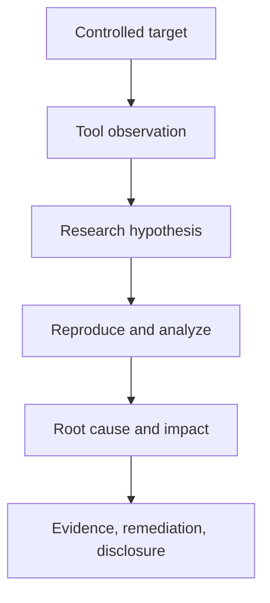

# Vulnerability Research Tools

Vulnerability research requires different tools depending on the stage of investigation.

Typical activities include:

- understanding application behaviour;
- reverse engineering;
- debugging;
- dynamic analysis;
- fuzzing;
- crash reproduction;
- root-cause analysis;
- patch diffing;
- variant analysis;
- proof-of-concept development;
- exploitability assessment;
- regression testing;
- responsible disclosure.

No single tool covers all of these activities.

A mature workflow combines several categories:

```text
Target
  |
  v
Understand Attack Surface
  |
  v
Static / Dynamic Analysis
  |
  +-- Disassembler
  +-- Debugger
  +-- Tracing
  |
  v
Fuzzing
  |
  v
Crash
  |
  v
Root Cause
  |
  v
Variant Analysis
  |
  v
Controlled PoC
  |
  v
Remediation / Disclosure
```

!!! warning "Authorised research only"
    Perform vulnerability research only against software, systems, products, binaries, source code, and environments that you are authorised to analyse. Fuzzing, debugging, malformed-input testing, and proof-of-concept development can crash software or alter state. Prefer dedicated research environments rather than production systems.

---

# Where Vulnerability Research Tools Fit

The toolchain should follow the research question.

A useful model is:

```text
What am I trying to learn?
        |
        v
Choose Research Technique
        |
        v
Choose Tool
        |
        v
Collect Evidence
        |
        v
Interpret Behaviour
        |
        v
Form Security Hypothesis
        |
        v
Validate
```

Related methodology:

[Vulnerability Research](../../vulnerability-research/index.md)

[Vulnerability Research Methodology](../../vulnerability-research/methodology.md)

[Attack Surface Analysis](../../vulnerability-research/attack-surface-analysis.md)

---

# Tool Categories

A practical vulnerability research toolkit may include:

| Category | Example Tools |
|---|---|
| Windows debugging | WinDbg, x64dbg |
| Linux debugging | GDB, GEF, pwndbg |
| Static reverse engineering | Ghidra, IDA Free/Pro, Binary Ninja |
| Dynamic instrumentation | Frida |
| Linux tracing | strace, ltrace |
| Windows tracing | Process Monitor, Process Explorer |
| Fuzzing | AFL++, libFuzzer, honggfuzz |
| Coverage analysis | compiler sanitizers, debugger coverage, fuzzing instrumentation |
| Crash analysis | GDB, WinDbg, sanitizers |
| Patch diffing | BinDiff-style tools, Diaphora, Git diff, binary comparison |
| Source analysis | ripgrep, Semgrep, OpenGrep, CodeQL |
| Network/protocol analysis | Wireshark, tcpdump |
| File-format inspection | strings, file, readelf, objdump, PE utilities |
| Scripting | Python |
| Version control | Git |

The best tool is the one that answers the current research question with the least unnecessary complexity.

---

# Tool Output Is Not a Vulnerability

A debugger exception, fuzzer crash, static-analysis match, or unusual binary instruction does not automatically mean a security vulnerability exists.

```text
Crash
  !=
Vulnerability

Static Match
  !=
Vulnerability

Debugger Exception
  !=
Exploitable Condition

Patch Difference
  !=
Root Cause
```

The research process must establish:

```text
Reachability
Controllability
Root cause
Security boundary
Impact
Reproducibility
```

---

# Research Environment

Vulnerability research should normally take place in a controlled environment.

Typical components include:

```text
Research Workstation
      |
      +-- Debugger
      +-- Disassembler
      +-- Fuzzer
      +-- Scripts
      |
      v
Isolated Target
      |
      +-- VM
      +-- Container
      +-- Test build
```

Isolation helps contain:

- crashes;
- malformed files;
- unstable builds;
- experimental instrumentation;
- temporary modifications.

---

# Virtual Machines

Virtual machines are useful because they allow:

- snapshots;
- repeatable state;
- operating-system isolation;
- version comparison;
- debugger installation.

A useful workflow is:

```text
Clean Snapshot
    |
    v
Install Target
    |
    v
Run Research
    |
    v
Crash / Modify State
    |
    v
Revert Snapshot
```

Snapshots improve reproducibility.

---

# Containers

Containers can be useful for:

- Linux targets;
- fuzzing;
- build environments;
- dependency isolation.

They are less suitable when research depends heavily on:

- kernel behaviour;
- GUI software;
- full system services;
- low-level Windows behaviour.

Choose the environment based on the target.

---

# Reproducibility

For every research environment, record:

```text
Operating system
Architecture
Application version
Build number
Compiler where known
Libraries
Configuration
Research tool versions
Input file / request
```

Without this information, reproducing a crash later can become difficult.

---

# Debugging

Debuggers provide visibility into program execution.

Typical questions include:

```text
Where did the program crash?

Which instruction failed?

Which register contains attacker-controlled data?

Which function processes the input?

What code path led to the fault?

Which security mitigations are active?
```

Related methodology:

[Debugging and Dynamic Analysis](../../vulnerability-research/debugging-dynamic-analysis.md)

---

# Windows Debuggers

Common Windows debugging tools include:

- WinDbg;
- x64dbg;
- Visual Studio Debugger.

Each has different strengths.

---

# WinDbg

WinDbg is Microsoft's debugger for Windows.

It is useful for:

- user-mode debugging;
- crash-dump analysis;
- kernel debugging;
- exception inspection;
- stack analysis;
- symbol-aware debugging.

Official resource:

[WinDbg - Microsoft Learn](https://learn.microsoft.com/en-us/windows-hardware/drivers/debugger/){ target="_blank" rel="noopener noreferrer" }

---

# WinDbg Mental Model

```text
Target Process
     |
     v
Exception
     |
     v
WinDbg
     |
     +-- Registers
     +-- Stack
     +-- Memory
     +-- Modules
     +-- Symbols
     |
     v
Root-Cause Analysis
```

---

# WinDbg Basic Context

Common research questions include:

```text
Which exception occurred?

Where is the instruction pointer?

Which module contains the fault?

What does the stack look like?

What input caused the condition?
```

Do not jump directly from:

```text
Access violation
```

to:

```text
Remote code execution
```

The crash still requires analysis.

---

# Symbols

Symbols make debugging substantially easier.

They can provide:

- function names;
- variable context;
- module information;
- stack readability.

Use vendor or locally generated symbols where authorised and available.

A missing symbol does not prevent debugging but usually makes analysis slower.

---

# Crash Dumps

Windows crash dumps can preserve state at the moment of failure.

Useful evidence includes:

```text
Exception code
Faulting address
Module
Stack
Registers
Process architecture
Input
```

Protect crash dumps because they may contain sensitive process memory.

---

# x64dbg

x64dbg is a popular Windows user-mode debugger and reverse-engineering tool.

It provides:

- disassembly;
- breakpoints;
- registers;
- memory views;
- call stack;
- module inspection;
- patching in controlled research environments.

Official project:

[x64dbg](https://x64dbg.com/){ target="_blank" rel="noopener noreferrer" }

GitHub:

[x64dbg - GitHub](https://github.com/x64dbg/x64dbg){ target="_blank" rel="noopener noreferrer" }

---

# When x64dbg Is Useful

x64dbg is particularly convenient for:

- interactive user-mode debugging;
- following control flow;
- setting breakpoints;
- examining memory;
- inspecting function calls.

It can be easier than WinDbg for some interactive reverse-engineering tasks.

---

# GDB

GNU Debugger, commonly called GDB, is one of the main debugging tools for Linux and Unix-like systems.

It can inspect:

- registers;
- memory;
- stack;
- functions;
- breakpoints;
- signals;
- shared libraries.

Official resource:

[GDB](https://www.gnu.org/software/gdb/){ target="_blank" rel="noopener noreferrer" }

---

# GDB Basic Workflow

```text
Program
  |
  v
Run Under GDB
  |
  v
Provide Test Input
  |
  v
Crash / Breakpoint
  |
  v
Inspect
  |
  +-- Registers
  +-- Backtrace
  +-- Memory
  +-- Instructions
```

---

# GDB Basic Commands

Start:

```bash
gdb ./target
```

Run:

```gdb
run
```

Backtrace:

```gdb
bt
```

Registers:

```gdb
info registers
```

Disassemble a function:

```gdb
disassemble main
```

Inspect instructions around the current program counter:

```gdb
x/10i $pc
```

These are foundational debugging commands.

---

# GEF

GEF is an extension for GDB aimed at exploit development and reverse engineering.

It improves debugger usability through enhanced:

- context views;
- register display;
- memory inspection;
- architecture information;
- security property inspection.

Official project:

[GEF - GitHub](https://github.com/hugsy/gef){ target="_blank" rel="noopener noreferrer" }

---

# pwndbg

pwndbg is another GDB extension commonly used in low-level vulnerability research.

It provides enhanced support for:

- memory analysis;
- heap research;
- register context;
- disassembly;
- binary security analysis.

Official project:

[pwndbg - GitHub](https://github.com/pwndbg/pwndbg){ target="_blank" rel="noopener noreferrer" }

---

# GEF vs pwndbg

Both extend GDB.

Choose based on:

- preference;
- target architecture;
- workflow;
- plugin compatibility.

Avoid loading multiple large debugger frameworks simultaneously unless you know they are compatible.

---

# Reverse Engineering

Reverse engineering helps understand software when source code is unavailable or incomplete.

Typical questions include:

```text
Which parser handles this file?

Which function validates the input?

Where is memory allocated?

Where is authentication checked?

Which protocol messages are supported?

Which function changed between versions?
```

---

# Ghidra

Ghidra is a reverse-engineering framework developed by the National Security Agency and released as open source.

It provides:

- disassembly;
- decompilation;
- function analysis;
- cross-references;
- scripting;
- data-type analysis.

Official project:

[Ghidra - GitHub](https://github.com/NationalSecurityAgency/ghidra){ target="_blank" rel="noopener noreferrer" }

---

# Ghidra Workflow

```text
Binary
  |
  v
Import
  |
  v
Auto Analysis
  |
  v
Identify Interesting Functions
  |
  v
Cross-References
  |
  v
Decompiler
  |
  v
Security Hypothesis
```

---

# Decompiler Output Is Approximate

Decompiler output is reconstructed from machine code.

It may contain:

- incorrect variable names;
- imperfect types;
- confusing control flow;
- compiler artefacts.

Never assume decompiled code is identical to original source.

Use it as an analysis aid.

---

# Cross-References

Cross-references are one of the most useful reverse-engineering features.

For example:

```text
Dangerous Function
      |
      v
Find Xrefs
      |
      v
Identify Callers
      |
      v
Trace Input
```

This is similar to source-to-sink analysis.

---

# IDA

IDA is a mature disassembler and reverse-engineering platform.

Free and commercial editions provide different capabilities.

Official resource:

[IDA](https://hex-rays.com/ida-pro/){ target="_blank" rel="noopener noreferrer" }

Use current vendor documentation for edition-specific capabilities.

---

# Binary Ninja

Binary Ninja is another reverse-engineering platform with strong analysis and scripting capabilities.

Official resource:

[Binary Ninja](https://binary.ninja/){ target="_blank" rel="noopener noreferrer" }

Tool choice is largely determined by workflow and analyst preference.

---

# Static vs Dynamic Analysis

Static analysis:

```text
Binary / Source
      |
      v
Inspect Without Running
```

Dynamic analysis:

```text
Run Target
    |
    v
Observe Runtime Behaviour
```

Both are valuable.

---

# Static Analysis Advantages

Static analysis can reveal:

- hidden code paths;
- functions not reached during testing;
- constant values;
- parser structure;
- dangerous APIs.

---

# Dynamic Analysis Advantages

Dynamic analysis can reveal:

- actual runtime paths;
- real variable values;
- loaded libraries;
- timing;
- environment-dependent behaviour.

The strongest research often combines both.

---

# Frida

Frida is a dynamic instrumentation toolkit that allows runtime observation and modification of applications in controlled research environments.

It can help researchers inspect:

- function calls;
- arguments;
- return values;
- runtime libraries;
- application behaviour.

Official project:

[Frida](https://frida.re/){ target="_blank" rel="noopener noreferrer" }

---

# Dynamic Instrumentation

A simplified model:

```text
Running Application
       |
       v
Instrumentation
       |
       +-- Observe Function
       +-- Inspect Arguments
       +-- Inspect Return
       |
       v
Understand Runtime Behaviour
```

Instrumentation is particularly useful where debugger attachment is inconvenient or where many repeated calls need observation.

---

# Linux Tracing

Linux provides several useful native tracing tools.

---

# strace

`strace` records system calls made by a process.

Example:

```bash
strace ./target
```

It can help answer:

```text
Which files are opened?

Which network calls occur?

Which processes are created?

Which system calls fail?
```

---

# Trace One Process

Example:

```bash
strace -f ./target
```

The `-f` option follows child processes.

Use:

```bash
strace -h
```

for current options.

---

# ltrace

`ltrace` can trace dynamic library calls on supported systems.

Example:

```bash
ltrace ./target
```

It can be useful when investigating:

- libc calls;
- string handling;
- file operations;
- library function usage.

---

# Windows Process Monitor

Process Monitor from Microsoft Sysinternals records real-time Windows activity such as:

- filesystem operations;
- registry operations;
- process activity.

Official resource:

[Process Monitor](https://learn.microsoft.com/en-us/sysinternals/downloads/procmon){ target="_blank" rel="noopener noreferrer" }

---

# Process Monitor Use

Procmon is especially useful when asking:

```text
Which DLL did the application try to load?

Which registry key controls this behaviour?

Which file does this parser open?

Where does the application store configuration?
```

Filters are essential because raw Procmon output can be extremely noisy.

---

# Process Explorer

Process Explorer provides detailed process information.

It can help inspect:

- parent-child relationships;
- loaded DLLs;
- process users;
- handles;
- process properties.

Official resource:

[Process Explorer](https://learn.microsoft.com/en-us/sysinternals/downloads/process-explorer){ target="_blank" rel="noopener noreferrer" }

---

# Fuzzing

Fuzzing repeatedly provides generated or mutated input to a target in order to discover unexpected behaviour.

A simplified workflow is:

```text
Seed Inputs
    |
    v
Fuzzer
    |
    v
Target
    |
    +-- Normal
    |
    +-- Hang
    |
    +-- Crash
```

Related methodology:

[Fuzzing](../../vulnerability-research/fuzzing.md)

---

# Fuzzing Is More Than Random Data

Modern fuzzers often use:

- mutation;
- code coverage;
- instrumentation;
- corpus evolution;
- dictionaries;
- feedback.

The aim is to explore new program states efficiently.

---

# AFL++

AFL++ is a widely used coverage-guided fuzzer.

Official project:

[AFL++ - GitHub](https://github.com/AFLplusplus/AFLplusplus){ target="_blank" rel="noopener noreferrer" }

Documentation:

[AFL++ Documentation](https://aflplus.plus/){ target="_blank" rel="noopener noreferrer" }

---

# AFL++ Model

```text
Seed Corpus
    |
    v
Mutation
    |
    v
Target Execution
    |
    v
Coverage Feedback
    |
    v
Interesting Input
    |
    v
Corpus Update
```

---

# Good Seed Corpus

A seed corpus should ideally contain:

- valid examples;
- different file structures;
- different protocol messages;
- edge cases.

The goal is diversity, not simply volume.

---

# Corpus Minimisation

Too many redundant seeds can slow fuzzing.

Corpus minimisation attempts to preserve useful coverage while reducing duplicate input.

The exact mechanism depends on the fuzzer.

---

# Dictionaries

Protocol- or format-specific dictionaries can help fuzzers discover important syntax.

Examples may include:

```text
keywords
magic values
field names
protocol tokens
```

A dictionary should reflect the target format.

---

# libFuzzer

libFuzzer is an in-process coverage-guided fuzzer integrated with LLVM.

It works especially well where a fuzz harness can directly call the target function.

Official documentation:

[libFuzzer](https://llvm.org/docs/LibFuzzer.html){ target="_blank" rel="noopener noreferrer" }

---

# Harness-Based Fuzzing

A fuzz harness provides a small entry point around the function being tested.

Conceptually:

```text
Fuzzer Input
     |
     v
Harness
     |
     v
Target Parser / Function
```

Good harnesses:

- isolate the interesting function;
- avoid unnecessary setup;
- execute quickly;
- clean state between inputs.

---

# Fuzzing Speed Matters

A fuzzer running:

```text
20 executions / second
```

will explore much less than one running:

```text
20,000 executions / second
```

Optimise:

- target startup;
- harness;
- I/O;
- instrumentation;
- logging.

Performance affects coverage.

---

# Persistent Execution

Some fuzzing models keep the target process alive across many inputs.

This reduces process startup overhead.

Persistent operation must ensure state from one input does not incorrectly affect later inputs.

---

# Sanitizers

Compiler sanitizers are extremely useful during fuzzing and crash analysis.

Common examples include:

- AddressSanitizer;
- UndefinedBehaviorSanitizer;
- MemorySanitizer where appropriate.

---

# AddressSanitizer

AddressSanitizer, commonly ASan, detects memory errors such as:

- out-of-bounds access;
- use-after-free;
- some double-free conditions.

Official documentation:

[AddressSanitizer](https://clang.llvm.org/docs/AddressSanitizer.html){ target="_blank" rel="noopener noreferrer" }

---

# Why ASan Helps

A normal crash may only show:

```text
Segmentation fault
```

ASan may provide:

```text
Type of memory error
Faulting location
Allocation context
Stack trace
```

This can substantially accelerate root-cause analysis.

---

# UndefinedBehaviorSanitizer

UBSan detects several categories of undefined behaviour.

Official documentation:

[UndefinedBehaviorSanitizer](https://clang.llvm.org/docs/UndefinedBehaviorSanitizer.html){ target="_blank" rel="noopener noreferrer" }

It is useful for identifying conditions that may not immediately crash.

---

# Fuzzer Crash Is Only the Start

When a fuzzer reports a crash:

```text
Crash Input
    |
    v
Reproduce Manually
    |
    v
Minimise
    |
    v
Debug
    |
    v
Root Cause
    |
    v
Assess Impact
```

Related methodology:

[Crash Analysis](../../vulnerability-research/crash-analysis.md)

---

# Reproduce First

A crash should be reproducible outside the fuzzer.

For example:

```text
target crashing-input
```

If the crash cannot be reproduced, investigate:

- timing;
- nondeterminism;
- environment;
- resource exhaustion;
- state.

---

# Minimise Crash Input

A large crashing file may contain thousands of irrelevant bytes.

Input minimisation helps identify the smallest structure necessary to trigger the bug.

Benefits include:

- easier root-cause analysis;
- clearer PoC;
- easier reporting;
- faster regression testing.

---

# Crash Bucketing

Large fuzzing campaigns may discover the same bug many times.

Crashes can be grouped using information such as:

```text
Exception
Faulting instruction
Stack trace
Top stack frames
Sanitizer report
```

Do not count each crashing file as a separate vulnerability.

---

# Crash Deduplication

A simplified process:

```text
1000 Crashes
     |
     v
Stack / Fault Analysis
     |
     v
20 Buckets
     |
     v
Manual Root Cause
     |
     v
3 Unique Bugs
```

Deduplication prevents wasted effort.

---

# Crash Severity

Not every crash is security relevant.

Possible categories include:

```text
Null dereference
Assertion failure
Stack exhaustion
Out-of-bounds read
Out-of-bounds write
Use-after-free
Integer issue
Logic error
```

Security impact depends on:

- attacker control;
- process privilege;
- reachable interface;
- mitigation;
- reliability.

---

# Denial of Service

A reliably reachable crash may represent a denial-of-service issue even when code execution is not feasible.

Assess:

- service restart;
- availability impact;
- authentication requirement;
- crash frequency;
- affected users.

---

# Root-Cause Analysis

The goal of crash analysis is to determine why the software entered an unsafe state.

```text
Input
  |
  v
Parser
  |
  v
Validation Error
  |
  v
Unsafe State
  |
  v
Crash
```

The crash location is not always the root cause.

---

# Root Cause vs Crash Site

Example:

```text
Length field incorrectly trusted
        |
        v
Memory allocation too small
        |
        v
Later copy
        |
        v
Crash
```

The crash occurs during the copy.

The root cause may be the earlier length validation.

---

# Taint / Data-Flow Reasoning

Track attacker-controlled data.

```text
Input Byte
    |
    v
Parser Field
    |
    v
Length Calculation
    |
    v
Memory Access
```

The research question is:

> How much control does the attacker have over the value that causes the unsafe operation?

---

# Exploitability Assessment

Once root cause is understood, assess potential impact.

Questions include:

```text
Can attacker control written data?

Can attacker control write location?

Can attacker control instruction pointer?

Is only a read possible?

Is memory disclosure possible?

Which mitigations are enabled?

Does process sandboxing reduce impact?
```

Avoid overclaiming.

---

# Binary Security Properties

Relevant mitigations may include:

- ASLR;
- DEP/NX;
- stack canaries;
- CFG;
- CET;
- PIE;
- RELRO;
- sandboxing.

The mitigation set depends on platform.

---

# Linux Binary Properties

Tools such as `readelf` and appropriate analysis utilities can reveal ELF properties.

Example:

```bash
readelf -h ./target
```

Sections:

```bash
readelf -S ./target
```

Dynamic dependencies:

```bash
ldd ./target
```

Use caution with `ldd` against untrusted binaries.

---

# file

The Unix `file` utility quickly identifies binary type.

```bash
file ./target
```

Example information may include:

```text
ELF
Architecture
Dynamically linked
Stripped
```

---

# strings

`strings` can reveal embedded text.

```bash
strings ./target
```

Useful discoveries may include:

- file paths;
- error messages;
- URLs;
- function names;
- protocol strings;
- format names.

Strings are hints, not definitive program behaviour.

---

# objdump

`objdump` can inspect object files and binaries.

Example:

```bash
objdump -d ./target
```

Use tool help:

```bash
objdump --help
```

for available analysis options.

---

# readelf

`readelf` is useful for ELF structures.

Examples:

```bash
readelf -h ./target
```

```bash
readelf -l ./target
```

```bash
readelf -s ./target
```

---

# Windows PE Inspection

Windows Portable Executable files can be inspected using:

- debugger module views;
- Ghidra;
- PE analysis utilities;
- Sysinternals tools;
- compiler/linker tooling.

Useful properties include:

```text
Architecture
Imports
Exports
Sections
Debug information
Mitigations
```

---

# Imports

Imported functions can reveal likely application behaviour.

Examples:

```text
Networking APIs
File APIs
Cryptographic APIs
Memory functions
Process APIs
```

Imports are useful starting points for reverse engineering.

---

# Exports

DLL exports can reveal externally callable functionality.

On Windows, exported functions may be inspected with appropriate PE tools or development utilities.

Exports can help identify:

- plugin interfaces;
- callable functions;
- COM-style entry points;
- library interfaces.

---

# Patch Diffing

Patch diffing compares vulnerable and fixed versions to identify what changed.

Related methodology:

[Patch Diffing](../../vulnerability-research/patch-diffing.md)

---

# Patch Diffing Workflow

```text
Old Version
    |
    +----+
         |
         v
      Compare
         ^
         |
    +----+
    |
Fixed Version
      |
      v
Changed Functions
      |
      v
Security-Relevant Difference
      |
      v
Root Cause
```

---

# Source-Level Diffing

If source is available:

```bash
git diff <old> <new>
```

or:

```bash
git show <commit>
```

This is usually easier than binary diffing.

---

# Git History

Useful Git commands include:

```bash
git log
```

```bash
git show <commit>
```

```bash
git blame path/to/file
```

Git history can reveal:

- when code changed;
- why it changed;
- related commits;
- previous implementations.

---

# Security Fix Commit

A security patch may not explicitly say:

```text
security fix
```

Look for changes involving:

- bounds validation;
- authentication;
- authorisation;
- parser hardening;
- memory allocation;
- input validation.

Do not assume every suspicious change is security related.

---

# Binary Diffing

When source is unavailable, compare binaries.

Potential approaches include:

- disassembly comparison;
- function similarity;
- changed constants;
- changed branches;
- imported API changes.

Tools such as Ghidra scripts and binary diffing platforms can help.

---

# Diaphora

Diaphora is a program-diffing tool commonly used with IDA.

Official project:

[Diaphora - GitHub](https://github.com/joxeankoret/diaphora){ target="_blank" rel="noopener noreferrer" }

It can assist with identifying changed functions between binary versions.

---

# Patch Diffing Is Not Automatic Vulnerability Discovery

A changed function may represent:

- refactoring;
- performance work;
- feature change;
- compatibility change;
- bug fix.

The researcher still needs to identify:

```text
What changed?

Why?

Does old behaviour cross a security boundary?
```

---

# Variant Analysis

Once one bug is understood, search for similar patterns.

Related methodology:

[Variant Analysis](../../vulnerability-research/variant-analysis.md)

---

# Variant Analysis Workflow

```text
Known Vulnerability
      |
      v
Root Cause
      |
      v
Generalise Pattern
      |
      v
Search Other Functions
      |
      v
Search Other Components
      |
      v
Validate Candidates
```

---

# Source-Level Variant Analysis

Useful tools include:

- ripgrep;
- Semgrep;
- OpenGrep;
- CodeQL.

Canonical references:

[ripgrep](../../source-code-review/static-analysis/ripgrep.md)

[Semgrep](../../source-code-review/static-analysis/semgrep.md)

[OpenGrep](../../source-code-review/static-analysis/opengrep.md)

[CodeQL](../../source-code-review/static-analysis/codeql.md)

---

# Binary Variant Analysis

Without source code, variant analysis may use:

- similar call patterns;
- cross-references;
- repeated parser structures;
- shared libraries;
- related binaries;
- patch differences.

This is slower but can still identify sibling issues.

---

# Fuzzer-Guided Variant Analysis

After identifying one parser weakness:

```text
Fix / Block Original Crash
       |
       v
Continue Fuzzing
       |
       v
Explore Nearby State Space
       |
       v
Find Related Bugs
```

Do not stop a fuzzing campaign after the first crash.

---

# Proof-of-Concept Development

A proof of concept should demonstrate the security condition with the minimum necessary complexity.

Related methodology:

[Proof-of-Concept Development](../../vulnerability-research/poc-development.md)

---

# PoC Principle

Prefer:

```text
Minimal
Deterministic
Reproducible
Safe
Understandable
```

Avoid:

```text
Large exploit framework
Unnecessary persistence
Unrelated payloads
Complex environmental dependencies
```

---

# Crash PoC

For a memory-corruption issue, an initial PoC may simply:

```text
Trigger deterministic crash
```

This can be enough to demonstrate the root cause while exploitability is still under investigation.

---

# Security Impact PoC

Where necessary, a PoC may demonstrate:

- controlled read;
- controlled write;
- authentication bypass;
- privilege boundary bypass;
- server-side request;
- information disclosure.

Use the minimum impact required to validate the issue.

---

# Avoid Unnecessary Weaponisation

A disclosure-quality PoC rarely needs:

- persistence;
- stealth;
- unrelated lateral movement;
- destructive payloads.

The objective is to prove the vulnerability.

---

# Python

Python is extremely useful for vulnerability research.

Common uses include:

- generating test files;
- mutating input;
- interacting with protocols;
- parsing logs;
- crash deduplication;
- automation;
- PoC development.

---

# Binary Data in Python

Python is convenient for byte-level input manipulation.

Example:

```python
data = b"A" * 100
```

Write a test file:

```python
with open("test.bin", "wb") as f:
    f.write(data)
```

Keep research scripts clear and reproducible.

---

# struct

Python's `struct` module helps encode binary values.

Example:

```python
import struct

value = struct.pack("<I", 100)
```

This is useful for file-format and protocol research.

---

# Logging Test Cases

A useful script should record:

```text
Input
Target
Timestamp
Result
```

rather than silently sending large numbers of tests.

---

# Network Protocol Research

Protocol vulnerabilities often require packet-level visibility.

Useful tools include:

- Wireshark;
- tcpdump;
- protocol-specific clients;
- Python.

---

# Wireshark

Wireshark can inspect network traffic in detail.

Official resource:

[Wireshark](https://www.wireshark.org/){ target="_blank" rel="noopener noreferrer" }

It can help analyse:

- protocol structure;
- malformed requests;
- connection resets;
- TLS negotiation;
- retransmission;
- server responses.

---

# tcpdump

`tcpdump` provides command-line packet capture.

Example:

```bash
tcpdump -i eth0
```

Use filters to minimise unnecessary captured data.

Packet captures may contain credentials or sensitive application traffic.

Protect them appropriately.

---

# HTTP Research

For HTTP-facing vulnerabilities, useful tools may include:

- Burp Suite;
- curl;
- browser developer tools;
- Python.

Related tool:

[Burp Suite](../web-testing/burp-suite.md)

---

# Burp in Vulnerability Research

Burp Suite is useful where a vulnerability involves:

- HTTP parsing;
- APIs;
- session behaviour;
- request manipulation;
- protocol differences;
- application state.

Repeater is especially useful for controlled experimentation.

---

# Binary vs Web Research

Tool choice depends on target type.

```text
Web Application
    |
    +-- Burp
    +-- browser
    +-- static source tools

Native Binary
    |
    +-- debugger
    +-- disassembler
    +-- fuzzer

Network Service
    |
    +-- protocol client
    +-- Wireshark
    +-- debugger
    +-- fuzzer
```

---

# Attack Surface Analysis

Before fuzzing or debugging everything, identify likely attack surfaces.

Related methodology:

[Attack Surface Analysis](../../vulnerability-research/attack-surface-analysis.md)

Potential surfaces include:

```text
Network listeners
File parsers
IPC
RPC
Browser handlers
Plugins
Import/export
Update mechanisms
Authentication interfaces
APIs
```

---

# Parser Research

Parsers are common vulnerability research targets because they process complex, attacker-controlled structures.

Examples include:

- images;
- archives;
- documents;
- protocol messages;
- configuration formats.

A strong parser workflow is:

```text
Valid Sample
    |
    v
Understand Structure
    |
    v
Identify Parser
    |
    v
Instrument
    |
    v
Fuzz
```

---

# File Format Research

Useful tools include:

- hex editors;
- Python;
- file-format specifications;
- Ghidra;
- debugger;
- fuzzer.

A file-format model may look like:

```text
Header
Length
Metadata
Data
Footer
```

Fields controlling lengths, offsets, counts, and types often deserve careful review.

---

# Hex Editors

Hex editors allow direct inspection and modification of binary files.

Useful features include:

- offsets;
- byte editing;
- comparisons;
- templates.

The exact editor is a matter of preference.

---

# Magic Bytes

Many file formats begin with distinctive bytes.

Use:

```bash
xxd sample.bin | head
```

or:

```bash
hexdump -C sample.bin | head
```

This can help map the file structure.

---

# xxd

`xxd` converts binary data to a hexadecimal view.

Example:

```bash
xxd sample.bin
```

Reverse a hex dump where appropriate:

```bash
xxd -r
```

Check:

```bash
xxd -h
```

for exact syntax.

---

# Diffing Test Inputs

Compare files:

```bash
cmp file1.bin file2.bin
```

or use:

```bash
xxd file1.bin > file1.hex
xxd file2.bin > file2.hex
diff -u file1.hex file2.hex
```

This can help identify fields changed by an application.

---

# Process Monitoring

Dynamic application behaviour can reveal attack surface.

For example:

```text
Open File
   |
   v
Application loads DLL
   |
   v
Application opens temp file
   |
   v
Application creates child process
```

Tools such as Procmon, strace, and debugger tracing make these relationships visible.

---

# API Monitoring

A debugger breakpoint on a sensitive function can reveal when and how it is called.

Useful target APIs may relate to:

- memory operations;
- file access;
- process creation;
- network access;
- cryptography;
- parsing.

Choose breakpoints based on the research hypothesis.

---

# Coverage

Coverage answers:

> Which code did my tests actually execute?

This is crucial for fuzzing.

```text
Input A -> Paths 1,2,3
Input B -> Paths 1,2,4
Input C -> Paths 1,5,6
```

A fuzzer can use this feedback to preserve inputs that reach new code.

---

# Coverage Is Not Security Coverage

High code coverage does not prove all security-relevant states were tested.

A program may require:

- specific values;
- long state sequences;
- authentication;
- environmental conditions.

Coverage is one measurement, not proof of completeness.

---

# Fuzzing Hangs

A fuzzer may classify input as a hang if the target exceeds a timeout.

Potential causes include:

- infinite loop;
- deadlock;
- expensive computation;
- slow valid behaviour.

Reproduce hangs separately before reporting.

---

# Resource Exhaustion

Malformed input may cause:

- excessive memory use;
- CPU exhaustion;
- disk growth;
- recursion.

These can represent denial-of-service conditions.

Measure carefully to avoid destabilising shared systems.

---

# Memory Leaks

Long-running fuzzing or repeated requests may expose memory leaks.

Useful evidence includes:

```text
Memory before
Memory after repeated input
Rate of growth
Recovery behaviour
```

A one-time allocation increase is not automatically a leak.

---

# Integer Issues

Integer overflow, truncation, or signedness problems may lead to unsafe sizes or bounds checks.

A common reasoning pattern is:

```text
Input Length
    |
    v
Integer Conversion
    |
    v
Unexpected Value
    |
    v
Allocation / Copy Mismatch
```

Debuggers and sanitizers can help identify this chain.

---

# Use-After-Free

A use-after-free occurs when memory is accessed after its lifetime has ended.

ASan can often identify:

- allocation location;
- free location;
- invalid later use.

Exploitability depends on control and memory reuse.

---

# Out-of-Bounds Read

An out-of-bounds read may lead to:

- crash;
- memory disclosure;
- unexpected application behaviour.

Determine whether sensitive adjacent memory can be exposed.

---

# Out-of-Bounds Write

An out-of-bounds write can be more severe because memory state is modified.

Still assess:

- data control;
- destination control;
- process mitigations;
- reachable interface.

Do not automatically label all writes as code execution.

---

# Stack Overflow

A stack buffer overflow may corrupt:

- local variables;
- saved control data;
- adjacent stack state.

Modern mitigations can affect exploitability.

The vulnerability is the unsafe memory operation, not the eventual exploit technique.

---

# Heap Corruption

Heap corruption can manifest far from the original unsafe operation.

Debuggers and sanitizers are particularly important for finding the earlier root cause.

---

# Assertions

Assertion failures can expose logic assumptions.

An assertion crash may be:

- non-security bug;
- denial of service;
- indication of deeper state corruption.

Investigate what attacker-controlled condition violates the assumption.

---

# Exception Handling

Programs may catch malformed input safely.

Example:

```text
Invalid Input
    |
    v
Parser Error
    |
    v
Graceful Rejection
```

This is different from:

```text
Invalid Input
    |
    v
Unhandled Exception
    |
    v
Service Crash
```

---

# Crash Reproduction Template

Record:

```text
Target:
Version:
OS:
Architecture:
Input:
Command:
Expected:
Observed:
Exception:
Faulting module:
Reproducibility:
```

This makes crash triage systematic.

---

# Crash Analysis Workflow

```text
Crash Found
   |
   v
Reproduce
   |
   v
Minimise
   |
   v
Debugger
   |
   v
Identify Fault
   |
   v
Trace Back to Root Cause
   |
   v
Assess Attacker Control
   |
   v
Determine Impact
```

---

# Patch Validation

After a vendor fix:

```text
Original PoC
     |
     v
Fixed Version
     |
     +-- Still triggers -> investigate
     |
     +-- Rejected safely -> continue
```

Then inspect whether the patch addresses the root cause.

---

# Regression Testing

A good regression test preserves the smallest safe input that reproduces the original issue.

After remediation:

```text
Run Original Regression Input
      |
      v
Expected Safe Behaviour
```

The same test can help prevent reintroduction.

---

# CVE Research

When researching a known CVE, establish:

```text
Affected component
Affected versions
Attack vector
Prerequisites
Vendor advisory
Patch
Root cause
Public technical analysis
```

Related methodology:

[CVE Research](../../vulnerability-research/cve-research.md)

---

# Vendor Advisory First

For known vulnerabilities, start with the vendor where possible.

Then compare:

- CVE record;
- vendor advisory;
- patch;
- independent research.

Do not rely only on exploit repositories or copied blog posts.

---

# Version Validation

A service banner may not reveal exact patch state.

Consider:

- backports;
- vendor build numbers;
- custom patches;
- distribution packages.

Version identification should be supported by reliable evidence.

---

# Proof-of-Concept Authenticity

Public PoCs vary significantly in quality.

Before running third-party code:

- read the source;
- inspect network destinations;
- inspect file operations;
- run in an isolated environment;
- verify author/repository;
- remove unnecessary functionality.

Never blindly execute exploit code.

---

# Malicious PoCs

Fake or modified PoCs have historically been used to compromise researchers.

Treat exploit code as untrusted.

A safe workflow is:

```text
Download
  |
  v
Read Source
  |
  v
Static Inspection
  |
  v
Isolated Execution
```

---

# Responsible Disclosure

Once a new vulnerability is confirmed, research should transition into controlled disclosure.

Related methodology:

[Responsible Disclosure](../../vulnerability-research/responsible-disclosure.md)

Typical evidence includes:

- affected version;
- reproduction instructions;
- minimal PoC;
- root cause;
- impact;
- suggested mitigation.

---

# Do Not Overstate Impact

A crash does not automatically justify:

```text
Remote Code Execution
```

Likewise:

```text
Memory corruption
```

does not always mean:

```text
Arbitrary code execution
```

Use the strongest impact supported by evidence.

---

# Evidence Preservation

Preserve:

```text
Original binary
Hash
Crashing input
Minimised input
Debugger output
Stack trace
Patch version
PoC
Research notes
```

These artefacts are invaluable during disclosure.

---

# Hash Target Binaries

Windows:

```powershell
Get-FileHash .\target.exe -Algorithm SHA256
```

Linux:

```bash
sha256sum ./target
```

This confirms exactly which binary was analysed.

---

# Hash Crash Inputs

Also hash important inputs:

```bash
sha256sum crash.bin
```

This prevents confusion when several similar crash files exist.

---

# Naming Crash Files

Prefer descriptive names such as:

```text
crash-oob-read-parser-field17.bin
```

rather than:

```text
id_000013
```

Keep the original fuzzer filename as metadata where useful.

---

# Research Notes

Maintain a timeline.

Example:

```text
14:10 - Fuzzer found crash
14:18 - Reproduced manually
14:31 - ASan reports heap-buffer-overflow
15:05 - Reduced input to 92 bytes
16:10 - Root cause identified in parse_record()
```

This makes research easier to resume.

---

# Git for Research Scripts

Keep custom scripts under version control where appropriate.

Do not commit:

- proprietary binaries;
- customer data;
- credentials;
- embargoed vulnerability details;

to public repositories.

---

# Debug Symbols and Proprietary Data

Vendor symbols or proprietary binaries may be subject to licensing and confidentiality restrictions.

Respect those terms.

---

# Tool Version Recording

Record versions for:

```text
GDB
GEF/pwndbg
WinDbg
Ghidra
AFL++
Compiler
Sanitizers
Python
```

Research behaviour can change between versions.

---

# Automate Repetitive Work

Good research automation includes:

- starting target;
- sending input;
- detecting crash;
- restarting target;
- collecting logs;
- deduplicating crashes.

Automation should make the experiment more reproducible.

---

# Do Not Automate Interpretation

A script can classify:

```text
Crash at address X
```

but the researcher still determines:

```text
Is this unique?

Is it attacker controlled?

What is the root cause?

What is the impact?
```

---

# Tool Chaining

A common native-binary workflow may be:

```text
Ghidra
  |
  v
Identify Parser
  |
  v
AFL++ / libFuzzer
  |
  v
Crash
  |
  v
GDB / WinDbg
  |
  v
Root Cause
  |
  v
Python PoC
```

---

# Web-Application Research Workflow

```text
Source / Application
       |
       v
Burp Suite
       |
       v
Interesting Behaviour
       |
       v
Source Review
       |
       v
Root Cause
       |
       v
Variant Search
```

---

# Patch-Diff Workflow

```text
Vendor Patch
    |
    v
Git / Binary Diff
    |
    v
Changed Function
    |
    v
Debugger
    |
    v
Understand Old Behaviour
    |
    v
PoC
```

---

# Fuzzing Workflow

```text
Attack Surface
      |
      v
Harness
      |
      v
Seed Corpus
      |
      v
Fuzzer
      |
      v
Crash Corpus
      |
      v
Deduplicate
      |
      v
Minimise
      |
      v
Debug
```

---

# Source-to-Sink Research

Source-code tools can also support vulnerability research.

```text
User Input
    |
    v
Source
    |
    v
Program Logic
    |
    v
Sink
```

Canonical tools:

[Source Code Review Tools](../source-code-review/index.md)

---

# LLM-Assisted Vulnerability Research

LLMs can help with:

- explaining unfamiliar code;
- drafting harnesses;
- suggesting debugger questions;
- summarising patches;
- generating search patterns;
- comparing functions;
- helping reason about parser structures.

However:

```text
LLM Suggestion
     |
     v
Research Hypothesis
     |
     v
Independent Validation
     |
     v
Evidence
     |
     v
Conclusion
```

Never treat an LLM statement as proof of a vulnerability.

---

# LLM Limitations

LLMs may:

- invent APIs;
- misunderstand assembly;
- miss compiler transformations;
- misread decompiler output;
- hallucinate CVEs;
- overstate exploitability;
- ignore mitigations.

Use them as assistants, not authorities.

---

# Sensitive Research and AI

Do not upload:

- proprietary source;
- unreleased binaries;
- customer data;
- private symbols;
- embargoed vulnerability information;

to external AI services unless organisational policy explicitly permits it.

---

# Practical Vulnerability Research Workflow

A mature workflow can be:

```text
1. Confirm authorisation
      |
      v
2. Record target/version
      |
      v
3. Build isolated environment
      |
      v
4. Map attack surface
      |
      v
5. Perform static analysis
      |
      v
6. Perform dynamic analysis
      |
      v
7. Build targeted harness/test
      |
      v
8. Fuzz or mutate inputs
      |
      v
9. Capture crashes/anomalies
      |
      v
10. Reproduce
      |
      v
11. Minimise
      |
      v
12. Debug
      |
      v
13. Identify root cause
      |
      v
14. Assess attacker control
      |
      v
15. Determine security impact
      |
      v
16. Search for variants
      |
      v
17. Develop minimal PoC
      |
      v
18. Validate patch/remediation
      |
      v
19. Preserve evidence
      |
      v
20. Disclose responsibly
```

---

# Tool Selection Guide

## Need Windows Crash Analysis

Use:

```text
WinDbg
x64dbg
```

---

## Need Linux Crash Analysis

Use:

```text
GDB
GEF
pwndbg
```

---

## Need Static Binary Analysis

Use:

```text
Ghidra
IDA
Binary Ninja
```

---

## Need Dynamic Instrumentation

Use:

```text
Frida
```

---

## Need Linux Runtime Tracing

Use:

```text
strace
ltrace
```

---

## Need Windows Runtime Tracing

Use:

```text
Process Monitor
Process Explorer
```

---

## Need Coverage-Guided Fuzzing

Use:

```text
AFL++
libFuzzer
```

depending on target and build access.

---

## Need Memory Error Diagnostics

Use:

```text
AddressSanitizer
UndefinedBehaviorSanitizer
```

where compilation/instrumentation is available.

---

## Need Source Variant Analysis

Use:

```text
ripgrep
Semgrep
OpenGrep
CodeQL
```

---

## Need Binary Patch Analysis

Use:

```text
Ghidra
IDA + diffing tooling
Diaphora
```

---

## Need Protocol Analysis

Use:

```text
Wireshark
tcpdump
Python
```

---

# Vulnerability Research Checklist

## Preparation

- [ ] Research explicitly authorised.
- [ ] Exact target identified.
- [ ] Version/build recorded.
- [ ] Binary hash recorded.
- [ ] Architecture recorded.
- [ ] Research environment isolated.
- [ ] Snapshot available where useful.
- [ ] Tool versions recorded.

## Attack Surface

- [ ] External interfaces identified.
- [ ] File parsers identified.
- [ ] Network listeners identified.
- [ ] IPC/RPC interfaces considered.
- [ ] Plugins/extensions considered.
- [ ] Privileged components identified.
- [ ] Trust boundaries understood.

## Static Analysis

- [ ] Strings reviewed.
- [ ] Imports reviewed.
- [ ] Exports reviewed.
- [ ] Interesting functions identified.
- [ ] Cross-references reviewed.
- [ ] Parser structures mapped.
- [ ] Security checks identified.

## Dynamic Analysis

- [ ] Target run under debugger where useful.
- [ ] Breakpoints placed according to hypothesis.
- [ ] Runtime file/network behaviour inspected.
- [ ] Relevant function arguments observed.
- [ ] Exceptions captured.

## Fuzzing

- [ ] Target/harness selected.
- [ ] Valid seed corpus created.
- [ ] Corpus diversity considered.
- [ ] Timeout appropriate.
- [ ] Instrumentation configured.
- [ ] Sanitizers enabled where possible.
- [ ] Crashes saved.
- [ ] Hangs saved separately.

## Crash Analysis

- [ ] Crash reproduced outside fuzzer.
- [ ] Crash input preserved.
- [ ] Crash input hash recorded.
- [ ] Crash minimised.
- [ ] Exception identified.
- [ ] Faulting instruction identified.
- [ ] Stack trace captured.
- [ ] Root cause traced.
- [ ] Duplicate crashes removed.

## Security Analysis

- [ ] Attacker-controlled data identified.
- [ ] Reachability established.
- [ ] Preconditions established.
- [ ] Security boundary identified.
- [ ] Mitigations reviewed.
- [ ] Impact not overstated.
- [ ] Denial-of-service distinguished from code execution.

## Patch Diffing

- [ ] Vulnerable version retained.
- [ ] Fixed version retained.
- [ ] Changed functions identified.
- [ ] Security-relevant change understood.
- [ ] Root cause compared with patch.
- [ ] Original test run against fixed version.

## Variant Analysis

- [ ] Root cause generalised.
- [ ] Similar code searched.
- [ ] Related components reviewed.
- [ ] Shared library usage reviewed.
- [ ] New candidates manually validated.

## PoC

- [ ] Minimal.
- [ ] Deterministic.
- [ ] Reproducible.
- [ ] Safe.
- [ ] Target version checked.
- [ ] Unnecessary weaponisation avoided.
- [ ] Output clearly demonstrates condition.

## Evidence

- [ ] Target hash retained.
- [ ] Crash input retained.
- [ ] Crash input hash retained.
- [ ] Debugger output retained.
- [ ] Stack trace retained.
- [ ] Research notes retained.
- [ ] PoC retained.
- [ ] Patch comparison retained.
- [ ] Sensitive data protected.

## Disclosure

- [ ] Affected versions identified.
- [ ] Root cause described.
- [ ] Reproduction steps clear.
- [ ] Minimal PoC prepared.
- [ ] Impact supported by evidence.
- [ ] Vendor/contact process identified.
- [ ] Disclosure timeline recorded.
- [ ] Embargo respected where applicable.

---

# Related Tool Sections

[Security Tools](../index.md)

[Source Code Review Tools](../source-code-review/index.md)

[Web Application Testing Tools](../web-testing/index.md)

[Red Teaming Tools](../red-teaming/index.md)

[AI-Assisted Security Tools](../ai/index.md)

---

# Related Vulnerability Research Notes

[Vulnerability Research](../../vulnerability-research/index.md)

[Vulnerability Research Methodology](../../vulnerability-research/methodology.md)

[Attack Surface Analysis](../../vulnerability-research/attack-surface-analysis.md)

[Debugging and Dynamic Analysis](../../vulnerability-research/debugging-dynamic-analysis.md)

[Fuzzing](../../vulnerability-research/fuzzing.md)

[Crash Analysis](../../vulnerability-research/crash-analysis.md)

[Patch Diffing](../../vulnerability-research/patch-diffing.md)

[Variant Analysis](../../vulnerability-research/variant-analysis.md)

[Proof-of-Concept Development](../../vulnerability-research/poc-development.md)

[CVE Research](../../vulnerability-research/cve-research.md)

[Responsible Disclosure](../../vulnerability-research/responsible-disclosure.md)

---

# Related Source Analysis Notes

[Static Analysis](../../source-code-review/static-analysis/index.md)

[ripgrep](../../source-code-review/static-analysis/ripgrep.md)

[Semgrep](../../source-code-review/static-analysis/semgrep.md)

[OpenGrep](../../source-code-review/static-analysis/opengrep.md)

[CodeQL](../../source-code-review/static-analysis/codeql.md)

---

# External References

## Debuggers

[WinDbg - Microsoft Learn](https://learn.microsoft.com/en-us/windows-hardware/drivers/debugger/){ target="_blank" rel="noopener noreferrer" }

[x64dbg](https://x64dbg.com/){ target="_blank" rel="noopener noreferrer" }

[GDB](https://www.gnu.org/software/gdb/){ target="_blank" rel="noopener noreferrer" }

[GEF - GitHub](https://github.com/hugsy/gef){ target="_blank" rel="noopener noreferrer" }

[pwndbg - GitHub](https://github.com/pwndbg/pwndbg){ target="_blank" rel="noopener noreferrer" }

## Reverse Engineering

[Ghidra - GitHub](https://github.com/NationalSecurityAgency/ghidra){ target="_blank" rel="noopener noreferrer" }

[IDA](https://hex-rays.com/ida-pro/){ target="_blank" rel="noopener noreferrer" }

[Binary Ninja](https://binary.ninja/){ target="_blank" rel="noopener noreferrer" }

[Frida](https://frida.re/){ target="_blank" rel="noopener noreferrer" }

## Fuzzing

[AFL++ - GitHub](https://github.com/AFLplusplus/AFLplusplus){ target="_blank" rel="noopener noreferrer" }

[AFL++ Documentation](https://aflplus.plus/){ target="_blank" rel="noopener noreferrer" }

[libFuzzer](https://llvm.org/docs/LibFuzzer.html){ target="_blank" rel="noopener noreferrer" }

## Sanitizers

[AddressSanitizer](https://clang.llvm.org/docs/AddressSanitizer.html){ target="_blank" rel="noopener noreferrer" }

[UndefinedBehaviorSanitizer](https://clang.llvm.org/docs/UndefinedBehaviorSanitizer.html){ target="_blank" rel="noopener noreferrer" }

## Windows Dynamic Analysis

[Process Monitor](https://learn.microsoft.com/en-us/sysinternals/downloads/procmon){ target="_blank" rel="noopener noreferrer" }

[Process Explorer](https://learn.microsoft.com/en-us/sysinternals/downloads/process-explorer){ target="_blank" rel="noopener noreferrer" }

## Patch Diffing

[Diaphora - GitHub](https://github.com/joxeankoret/diaphora){ target="_blank" rel="noopener noreferrer" }

## Network Analysis

[Wireshark](https://www.wireshark.org/){ target="_blank" rel="noopener noreferrer" }

## General References

[OWASP](https://owasp.org/){ target="_blank" rel="noopener noreferrer" }

[MITRE CWE](https://cwe.mitre.org/){ target="_blank" rel="noopener noreferrer" }

[NIST National Vulnerability Database](https://nvd.nist.gov/){ target="_blank" rel="noopener noreferrer" }

---



# Final Research Model

Do not use vulnerability research tools like this:

```text
Run Fuzzer
   |
   v
Find Crash
   |
   v
Call It RCE
```

Use them like this:

```text
Understand Target
      |
      v
Map Attack Surface
      |
      v
Form Research Hypothesis
      |
      v
Choose Appropriate Tool
      |
      +-- Debugger
      +-- Disassembler
      +-- Fuzzer
      +-- Tracer
      +-- Static Analysis
      |
      v
Observe Behaviour
      |
      v
Capture Interesting Input
      |
      v
Reproduce
      |
      v
Minimise
      |
      v
Identify Root Cause
      |
      v
Trace Attacker Control
      |
      v
Assess Security Boundary
      |
      v
Evaluate Mitigations
      |
      v
Determine Supported Impact
      |
      v
Search for Variants
      |
      v
Build Minimal PoC
      |
      v
Validate Remediation
      |
      v
Preserve Evidence
      |
      v
Disclose Responsibly
```

Vulnerability research tools provide visibility into how software behaves internally.

The tools help reveal crashes, code paths, state changes, and implementation details.

The researcher determines whether those observations represent a real security vulnerability, what the root cause is, and what impact the available evidence actually supports.
