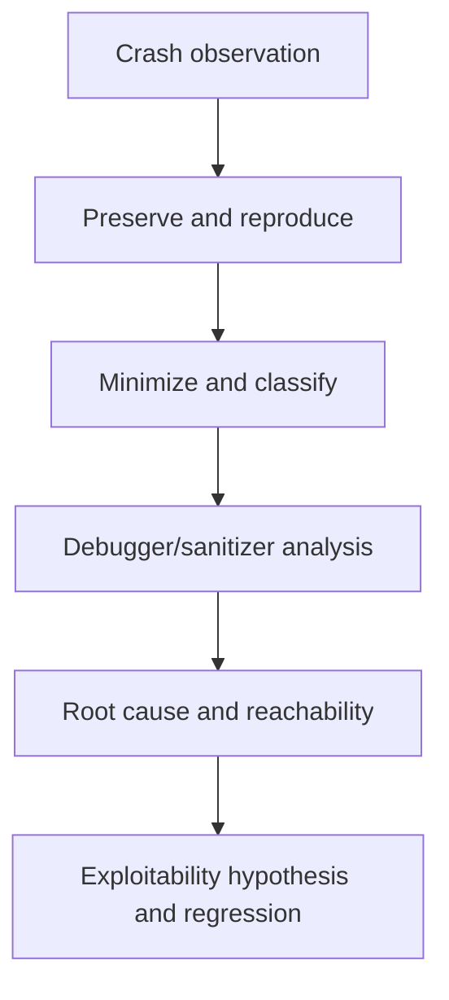

# Crash Analysis for Vulnerability Research

A crash discovered during vulnerability research is an observation, not a conclusion.

The application may have encountered:

```text
Memory corruption

Null pointer dereference

Unhandled exception

Assertion failure

Integer error

Stack exhaustion

Resource exhaustion

Invalid instruction

Race condition

Application logic failure
```

The purpose of crash analysis is to determine:

```text
What failed?

Where did it fail?

Why did it fail?

Which input triggered it?

What does the attacker control?

Is the failure reproducible?

Is the root cause security-relevant?

Which security boundary is affected?

What impact does the evidence support?
```

A useful workflow is:

```text
Crash
  |
  v
Preserve Evidence
  |
  v
Reproduce
  |
  v
Classify
  |
  v
Minimise Input
  |
  v
Debugger / Sanitizer Analysis
  |
  v
Trace Attacker-Controlled Data
  |
  v
Root Cause
  |
  v
Reachability
  |
  v
Security Impact
  |
  v
Variant Analysis
  |
  v
Regression Test
```

The goal is not merely to make the application fail.

The goal is to explain the failure accurately and defensibly.

---

# 1. Crash Analysis Starts With Evidence

When an interesting crash occurs, preserve the original conditions before changing anything.

Record:

```text
Product

Version

Build

Commit

Operating system

Architecture

Configuration

Process identity

Input

Input hash

Command line

Environment

Timestamp

Signal or exception

Logs

Debugger output

Sanitizer output
```

If fuzzing discovered the crash, also preserve:

```text
Fuzzer

Harness

Seed corpus

Dictionary

Compiler

Compiler flags

Sanitizers

Campaign configuration
```

This allows the crash to be reproduced later.

---

# 2. Preserve the Original Input

Never immediately modify the only copy of a crashing input.

Use a structure such as:

```text
crashes/
├── originals/
├── minimized/
├── triage/
├── reports/
└── notes/
```

Copy the original input into:

```text
crashes/originals/
```

before beginning minimisation.

---

# 3. Hash the Input

Calculate a cryptographic hash.

Linux:

```bash
sha256sum crash-input.bin
```

PowerShell:

```powershell
Get-FileHash .\crash-input.bin -Algorithm SHA256
```

Record:

```text
Filename:
crash-input.bin

SHA-256:
<hash>

Target:
Example Parser

Version:
2.4.1
```

The hash ensures that future analysis refers to the same artifact.

---

# 4. Create a Crash Record

Use a consistent record for every crash.

```text
Crash ID:
CRASH-001

Target:
Example Parser

Version:
2.4.1

Platform:
Linux x86_64

Input:
crash-input.bin

SHA-256:
<hash>

Discovery:
Coverage-guided fuzzing

Initial Failure:
SIGSEGV

Reproducible:
Unknown

Minimised:
No

Root Cause:
Unknown

Security Impact:
Unknown

Status:
Triage
```

Do not assign severity before sufficient analysis exists.

---

# 5. Reproduce Before Analysing

The first question is:

```text
Does the same input reproduce the failure?
```

Run the target using the same environment.

Example:

```bash
./target crash-input.bin
```

Record the result.

Repeat several times when appropriate.

---

# 6. Reproduction Matrix

Example:

| Run | Result | Failure |
|---|---|---|
| 1 | Crash | SIGSEGV |
| 2 | Crash | SIGSEGV |
| 3 | Crash | SIGSEGV |
| 4 | Crash | SIGSEGV |
| 5 | Crash | SIGSEGV |

This supports deterministic reproduction.

An intermittent result might look like:

| Run | Result |
|---|---|
| 1 | Crash |
| 2 | Normal |
| 3 | Crash |
| 4 | Normal |
| 5 | Crash |

This may indicate:

```text
Race condition

Uninitialised state

Memory-layout dependency

Randomness

Concurrency

Environmental state
```

---

# 7. Reset Between Tests

For important crashes:

```text
Reset Environment
      |
      v
Start Target
      |
      v
Verify Baseline
      |
      v
Submit Crash Input
      |
      v
Record Result
```

A clean environment reduces alternative explanations.

---

# 8. Establish a Negative Control

A negative control is an input similar to the crashing input that does not trigger the failure.

Example:

```text
crash.bin
safe.bin
```

Compare:

```text
Structure

Length

Field values

Execution path

Runtime state
```

The differences can help identify the trigger.

---

# 9. Establish a Positive Baseline

Also confirm that the application processes a known-valid input.

```bash
./target valid-input.bin
```

This verifies that the environment itself is functional.

A useful experiment contains:

```text
Valid Input
     |
     v
Expected Success

Near-Boundary Input
     |
     v
Expected Safe Handling

Crash Input
     |
     v
Observed Failure
```

---

# 10. Initial Crash Classification

Before detailed root cause analysis, classify the observable failure.

Possible categories include:

```text
Segmentation fault

Access violation

Abort

Assertion

Illegal instruction

Stack overflow

Heap corruption

Sanitizer finding

Unhandled exception

Timeout

Deadlock

Resource exhaustion

Unknown
```

This classification may change later.

---

# 11. Linux Signals

Common Linux signals encountered during crash analysis include:

| Signal | Typical Meaning |
|---|---|
| SIGSEGV | Invalid memory access |
| SIGABRT | Process abort |
| SIGBUS | Invalid memory access or alignment issue |
| SIGILL | Illegal instruction |
| SIGFPE | Arithmetic exception |

A signal describes how execution terminated.

It does not identify the complete root cause.

---

# 12. SIGSEGV

A segmentation fault can result from many conditions.

Examples:

```text
Null pointer dereference

Out-of-bounds access

Use-after-free

Corrupted pointer

Stack corruption

Invalid address calculation
```

Therefore:

```text
SIGSEGV
```

does not automatically mean:

```text
Exploitable memory corruption
```

---

# 13. SIGABRT

SIGABRT may occur because of:

```text
Explicit abort()

Assertion failure

Allocator corruption detection

Runtime safety check

Sanitizer termination
```

Determine why the process called or received the abort.

---

# 14. SIGBUS

SIGBUS may indicate:

```text
Invalid memory alignment

Invalid mapped-file access

Architecture-specific memory issue
```

Review the faulting instruction and memory address.

---

# 15. SIGILL

SIGILL means the processor attempted to execute an invalid or unsupported instruction.

Possible explanations include:

```text
Corrupted control flow

Deliberate trap

Invalid binary

Unsupported CPU instruction
```

The surrounding execution state determines significance.

---

# 16. SIGFPE

SIGFPE may occur because of arithmetic faults such as:

```text
Integer divide by zero

Certain invalid arithmetic operations
```

Determine whether attacker-controlled input can reach the operation.

---

# 17. Windows Exceptions

Windows-native crashes may expose exceptions such as:

```text
Access violation

Stack overflow

Illegal instruction

Integer divide by zero

Breakpoint exception

Heap corruption
```

Record:

```text
Exception code

Faulting instruction

Faulting module

Thread

Stack

Relevant registers
```

---

# 18. Exception Code Is Not Root Cause

For example:

```text
Access violation
```

means an invalid memory operation occurred.

It does not tell you whether the root cause was:

```text
Out-of-bounds write

Use-after-free

Null pointer

Corrupted object

Invalid index
```

Further analysis is required.

---

# 19. Use a Debugger

For native Linux applications, GDB is a common starting point.

```bash
gdb --args ./target crash-input.bin
```

Inside GDB:

```text
run
```

When the target crashes:

```text
bt
```

Then inspect the relevant state.

---

# 20. Basic GDB Crash Commands

Useful commands include:

```text
bt
```

Backtrace.

```text
info registers
```

Register state.

```text
info threads
```

Thread list.

```text
frame <number>
```

Select stack frame.

```text
info locals
```

Local variables when available.

```text
info args
```

Function arguments when available.

```text
disassemble
```

Disassemble the current function.

---

# 21. Full Backtrace

When symbols are available:

```text
bt full
```

may include additional local-variable information.

Preserve the output before continuing analysis.

---

# 22. Identify the Faulting Thread

Multi-threaded applications may contain many threads.

Use:

```text
info threads
```

The debugger typically identifies the thread that received the signal.

Inspect:

```text
Faulting thread

Worker threads

Related parser thread

Other relevant threads
```

Do not assume the main thread caused the failure.

---

# 23. Backtrace Analysis

Example:

```text
#0  copy_record()
#1  parse_record()
#2  parse_document()
#3  import_document()
#4  worker_loop()
```

This suggests a processing path:

```text
Import
  |
  v
Document Parser
  |
  v
Record Parser
  |
  v
Copy Operation
  |
  v
Crash
```

The faulting function is not necessarily where the bug originated.

---

# 24. Fault Site Versus Root Cause

Consider:

```text
Function A
   |
   v
Corrupt Memory
   |
   v
Function B
   |
   v
Continue Execution
   |
   v
Function C
   |
   v
Crash
```

The debugger may stop in:

```text
Function C
```

while the actual corruption occurred in:

```text
Function A
```

This distinction is fundamental in memory-corruption analysis.

---

# 25. Inspect the Faulting Instruction

Use:

```text
disassemble
```

or:

```text
x/i $pc
```

on supported GDB targets.

Determine whether the instruction is performing:

```text
Read

Write

Indirect call

Return

Arithmetic operation
```

This helps classify the immediate failure.

---

# 26. Registers

Use:

```text
info registers
```

Registers may reveal:

```text
Faulting address

Function arguments

Length values

Pointers

Control-flow state
```

Interpretation depends on:

```text
Architecture

Calling convention

Compiler

Optimisation
```

Do not interpret registers without considering the platform.

---

# 27. Memory Inspection

GDB can inspect memory.

Example:

```text
x/32bx <address>
```

Inspect a string:

```text
x/s <address>
```

Inspect pointer-sized values:

```text
x/8gx <address>
```

The appropriate format depends on what is being investigated.

---

# 28. Source-Level Debugging

If debug symbols and source are available:

```text
frame <number>
```

Then:

```text
list
```

Inspect:

```text
info locals
info args
```

This can connect runtime state directly to source code.

---

# 29. Source Correlation

Record:

```text
File:
parser.cpp

Function:
parse_record()

Line:
214

Attacker-Controlled Field:
record_length

Observed Value:
4096

Destination Allocation:
256 bytes
```

This provides a strong foundation for root cause analysis.

---

# 30. Binary-Only Analysis

When source is unavailable:

```text
Crash
  |
  v
Debugger
  |
  v
Faulting Address
  |
  v
Module Offset
  |
  v
Disassembler / Decompiler
  |
  v
Candidate Function
```

Tools may include:

```text
GDB

LLDB

WinDbg

Ghidra

IDA

Binary Ninja

Cutter
```

Use the tools appropriate to the authorised target.

---

# 31. Module-Relative Addresses

Because ASLR may change absolute addresses between runs, record:

```text
Module

Module base

Fault offset
```

rather than relying only on one absolute runtime address.

Conceptually:

```text
Fault Address - Module Base = Module Offset
```

This makes comparisons between runs easier.

---

# 32. Address Space Layout Randomisation

ASLR can cause:

```text
Run 1:
0x7f1234567890

Run 2:
0x7f9876547890
```

for the same logical code location.

Do not treat different absolute addresses as automatically different crashes.

---

# 33. Debug Symbols

Debug symbols improve crash analysis by providing:

```text
Function names

Source files

Line numbers

Variable names
```

Where possible, preserve:

```text
Exact binary

Exact symbols

Exact source revision
```

for the build being analysed.

---

# 34. Optimised Builds

Compiler optimisation may cause:

```text
Inlining

Removed variables

Reordered instructions

Merged functions
```

This can make debugging more difficult.

A debug build can help root cause analysis, but important behavior should also be validated against the relevant release configuration where appropriate.

---

# 35. Core Dumps

Core dumps preserve process state after a crash.

On Linux, check:

```bash
ulimit -c
```

Core-dump configuration differs between systems.

If a usable core dump exists:

```bash
gdb ./target core
```

Then inspect:

```text
bt
info threads
info registers
```

---

# 36. Preserve the Matching Binary

A core dump should be analysed with the binary and libraries corresponding to the crashed process.

Preserve:

```text
Executable

Symbols

Relevant libraries

Core dump

Configuration
```

Mismatched binaries can produce misleading analysis.

---

# 37. WinDbg Crash Analysis

For Windows-native crashes, WinDbg can be used to inspect crash dumps or live processes.

Useful investigation areas include:

```text
Exception

Faulting thread

Stack

Registers

Modules

Memory
```

A common first-pass crash analysis command is:

```text
!analyze -v
```

Treat automated analysis as a starting point, not the final root cause.

---

# 38. WinDbg Stack

Common stack commands include:

```text
k
```

and related variants.

Use the stack to understand:

```text
Current function

Callers

Module boundaries

Potential parser path
```

---

# 39. WinDbg Registers

Use:

```text
r
```

to inspect register state.

The significance of individual registers depends on the architecture and faulting instruction.

---

# 40. Modules

In WinDbg:

```text
lm
```

can help identify loaded modules.

Record the module containing the fault.

This is especially useful when the application uses third-party libraries.

---

# 41. Sanitizers

Sanitizers often provide clearer memory-safety diagnostics than an ordinary crash.

Common sanitizers include:

```text
AddressSanitizer

UndefinedBehaviorSanitizer

MemorySanitizer
```

They are particularly valuable for C and C++ vulnerability research.

---

# 42. AddressSanitizer

AddressSanitizer can identify issues including:

```text
Heap buffer overflow

Stack buffer overflow

Global buffer overflow

Use-after-free

Double free

Invalid free
```

A finding might begin:

```text
ERROR: AddressSanitizer: heap-buffer-overflow
```

Preserve the entire report.

---

# 43. ASan Access Type

An AddressSanitizer report may indicate:

```text
READ
```

or:

```text
WRITE
```

This distinction is important.

For example:

```text
READ of size 8
```

and:

```text
WRITE of size 8
```

describe different memory operations.

Do not infer exploitability solely from the access type.

---

# 44. ASan Location

The report may identify:

```text
Faulting function

Source file

Source line

Stack
```

Example:

```text
#0 copy_record parser.cpp:214
#1 parse_record parser.cpp:172
#2 parse_document parser.cpp:91
```

This can dramatically reduce root cause analysis time.

---

# 45. Allocation Context

For heap-related findings, AddressSanitizer may show where memory was allocated.

Conceptually:

```text
Allocation:
allocate_record()

Failure:
copy_record()
```

This allows comparison between:

```text
Allocated Size

Access Size

Offset

Copy Length
```

---

# 46. Use-After-Free

A use-after-free occurs when memory is accessed after its lifetime has ended.

Conceptually:

```text
Allocate Object
      |
      v
Use Object
      |
      v
Free Object
      |
      v
Use Object Again
      |
      v
Memory Error
```

Investigate:

```text
Who frees the object?

Who retains the pointer?

Can attacker input influence object lifetime?

Can memory be reused before the stale access?
```

---

# 47. Double Free

Conceptually:

```text
Allocate
   |
   v
Free
   |
   v
Free Again
```

Potential causes include:

```text
Error handling

Shared ownership mistakes

Duplicate cleanup

Unexpected state transitions
```

Determine whether attacker-controlled behavior can reach the faulty state.

---

# 48. Heap Buffer Overflow

Conceptually:

```text
Allocate N Bytes
      |
      v
Write M Bytes
      |
      v
M > N
```

Questions include:

```text
Who controls N?

Who controls M?

What data is written?

How far beyond the allocation?

What object follows the buffer?

Is the condition deterministic?
```

---

# 49. Stack Buffer Overflow

Conceptually:

```text
Stack Buffer
     |
     v
Copy Attacker Data
     |
     v
Boundary Exceeded
```

Modern compiler and operating-system mitigations may detect or reduce exploitation possibilities.

Do not assume:

```text
Stack overflow = code execution
```

Perform evidence-based impact analysis.

---

# 50. Out-of-Bounds Read

An out-of-bounds read may expose:

```text
Adjacent memory

Uninitialised data

Process information

Secrets
```

or simply cause a crash.

Determine whether the read result becomes observable to the attacker.

Without an observable channel, information disclosure may not be demonstrated.

---

# 51. Out-of-Bounds Write

An out-of-bounds write is potentially serious because memory outside the intended object is modified.

Investigate:

```text
Write size

Write value

Write destination

Attacker control

Repeatability

Affected object

Memory protections
```

Do not skip directly from:

```text
Out-of-bounds write
```

to:

```text
Arbitrary code execution
```

---

# 52. Null Pointer Dereference

A null pointer dereference often resembles:

```text
Pointer = NULL
     |
     v
Dereference
     |
     v
Crash
```

This may result in denial of service.

The security significance depends on:

```text
Reachability

Service availability

Automatic restart

Authentication requirement

Repeated triggerability
```

---

# 53. Integer Errors

Integer problems may include:

```text
Overflow

Underflow

Truncation

Signedness conversion

Incorrect comparison
```

A common pattern is:

```text
Attacker Length
      |
      v
Arithmetic
      |
      v
Unexpected Small Allocation
      |
      v
Larger Copy
```

Trace the values through every transformation.

---

# 54. Integer Example

Conceptually:

```text
Input Length:
65535

Conversion:
16-bit -> smaller derived value

Allocation:
Small

Copy:
Original length

Result:
Memory boundary violation
```

The exact integer types and operations must be confirmed from code or runtime evidence.

---

# 55. Stack Exhaustion

Deep recursion may cause stack exhaustion.

Example:

```text
Object
  |
  +-- Object
       |
       +-- Object
            |
            +-- ...
```

Determine whether the attacker can create unbounded or excessively deep structures.

Potential impact may be denial of service rather than memory corruption.

---

# 56. Resource Exhaustion

A process can fail because of:

```text
Memory exhaustion

CPU exhaustion

File descriptor exhaustion

Thread exhaustion

Disk exhaustion
```

Observe resource usage before classifying the finding.

---

# 57. Assertions

Assertions may terminate execution when an expected invariant is violated.

Example:

```text
assert(record_length <= available_data)
```

If attacker input can trigger the assertion remotely, this may create denial of service.

However, investigate whether release builds contain the assertion and whether the failure is reachable in deployed configurations.

---

# 58. Unhandled Exceptions

Managed applications may terminate because an exception is not handled.

Record:

```text
Exception type

Message

Stack trace

Input

Application state
```

Determine whether the exception:

```text
Terminates one request

Terminates one worker

Terminates the service

Is automatically recovered
```

Impact depends on the actual availability effect.

---

# 59. Heap Corruption Detected Later

A common memory-corruption pattern is:

```text
Function A
   |
   v
Corrupt Heap
   |
   v
Application Continues
   |
   v
Allocator Operation
   |
   v
Heap Corruption Detected
```

The allocator may detect the problem long after the original invalid write.

This is why root cause analysis must move backward through the data flow.

---

# 60. Crash Minimisation

Minimisation attempts to reduce the crashing input while preserving the same failure.

```text
Original Input
      |
      v
Remove / Simplify Data
      |
      v
Same Failure?
   /       \
 Yes       No
  |         |
  v         v
Continue   Restore
```

The final input should ideally contain only the structures required to trigger the bug.

---

# 61. Preserve Failure Identity During Minimisation

A smaller file that still crashes is not necessarily triggering the same bug.

Compare:

```text
Signal / Exception

Sanitizer class

Faulting function

Stack

Root cause
```

before concluding that minimisation preserved the original finding.

---

# 62. Manual Minimisation

Manual minimisation can be useful for structured formats.

Example:

```text
Remove optional metadata

Test

Remove second record

Test

Reduce payload

Test

Reduce length

Test
```

This can reveal which structure is essential.

---

# 63. Automated Minimisation

Fuzzing tools may provide minimisation functionality.

Examples include:

```text
afl-tmin

libFuzzer crash minimisation
```

See [Fuzzing for Vulnerability Research](fuzzing.md).

Always reproduce the minimised artifact independently.

---

# 64. Delta Debugging

The conceptual principle of delta debugging is:

```text
Input
  |
  v
Divide
  |
  v
Remove Part
  |
  v
Test
  |
  +---- Failure Remains -> Keep Removal
  |
  +---- Failure Gone -> Restore
```

Repeat until the triggering difference is much smaller.

---

# 65. Identify the Trigger

A minimised input should help answer:

```text
Which field matters?

Which byte range matters?

Which object matters?

Which state transition matters?

Which length matters?
```

Use controlled changes to isolate the trigger.

---

# 66. One-Variable Testing

Suppose the minimised crash contains:

```text
Length = 257
```

Test:

```text
255

256

257

258
```

if those values are meaningful to the parser.

Record the behavior.

This can expose an exact boundary.

---

# 67. Bit and Byte Sensitivity

For binary inputs, determine which bytes influence the failure.

Conceptually:

```text
Byte 0-3:
Magic

Byte 4:
Version

Byte 5-8:
Length

Byte 9+:
Payload
```

Change one field at a time and compare runtime behavior.

---

# 68. Unique Markers

When tracing attacker-controlled data through memory or logs, use a distinctive marker.

Example:

```text
VRCRASH-001
```

This is easier to identify than:

```text
AAAA
```

in complex traces.

---

# 69. Trace Source to Failure

A complete root cause should connect:

```text
Attacker Input
      |
      v
Parser Field
      |
      v
Transformation
      |
      v
Security Check
      |
      v
Memory / Logic Operation
      |
      v
Failure
```

If one of these steps is unknown, further investigation may be necessary.

---

# 70. Taint Reasoning

Even without automated taint analysis, manually reason about attacker influence.

Example:

```text
record_length
      |
      v
parsed_length
      |
      v
copy_length
```

Ask:

```text
Does the attacker control the original field?

Is the value transformed?

Is it bounded?

Is it truncated?

Is it compared against actual input size?

Does the same value control allocation and copy?
```

---

# 71. Root Cause Versus Trigger

Distinguish:

```text
Trigger:
Length field = 4096
```

from:

```text
Root Cause:
The parser validates the available source data but fails to
validate the destination capacity before copying the declared
record length.
```

The trigger reproduces the issue.

The root cause explains why the issue exists.

---

# 72. Root Cause Template

Use:

```text
Attacker-Controlled Input:

Parser / Handler:

Transformation:

Expected Validation:

Observed Validation:

Sensitive Operation:

Failure:

Root Cause:
```

Example:

```text
Attacker-Controlled Input:
Record length.

Parser:
parse_record().

Transformation:
32-bit little-endian integer.

Expected Validation:
Length should not exceed destination capacity.

Observed Validation:
Only source-buffer bounds are checked.

Sensitive Operation:
Memory copy.

Failure:
Heap-buffer-overflow.

Root Cause:
Destination bounds are not validated before the copy.
```

---

# 73. Determine Reachability

A memory-safety bug in a library may not be reachable through the actual application.

Establish:

```text
External Input
      |
      v
Application Interface
      |
      v
Processing Path
      |
      v
Vulnerable Function
```

Questions include:

```text
Can an unauthenticated attacker reach it?

Is authentication required?

Is local access required?

Is user interaction required?

Does the application validate input first?

Is the vulnerable feature enabled by default?
```

---

# 74. Full Application Reproduction

If the crash was discovered using a harness:

```text
Harness
   |
   v
Crash
```

attempt, where appropriate and authorised, to validate:

```text
Real Application Interface
          |
          v
Same Parser
          |
          v
Same Root Cause
```

This establishes practical reachability.

---

# 75. Harness-Only Findings

If the issue cannot be reached through the real application, document that clearly.

Possible conclusion:

> The memory-safety condition is reproducible when the parser API is called directly by the research harness. Reachability through the tested application interface has not been demonstrated.

This is more defensible than overstating the finding.

---

# 76. Determine Attacker Control

For memory corruption, distinguish different levels of control.

Examples:

```text
Attacker controls only whether crash occurs.

Attacker controls length.

Attacker controls copied data.

Attacker controls destination offset.

Attacker influences object lifetime.
```

These differences matter when evaluating security impact.

---

# 77. Read Versus Write

Determine whether the failure involves:

```text
Invalid Read

Invalid Write

Execution

Arithmetic

Resource Failure
```

A write generally deserves careful investigation, but the exact security implications still depend on attacker control and memory context.

---

# 78. Control of Written Data

Ask:

```text
Is the written data attacker-controlled?

Fully?

Partially?

Fixed?

Derived from another object?
```

For example:

```text
Out-of-bounds write of constant zero
```

and:

```text
Out-of-bounds write of attacker-controlled bytes
```

are different primitives.

---

# 79. Control of Destination

Ask:

```text
Is the destination fixed?

Adjacent to a known buffer?

Derived from attacker-controlled offset?

Derived from corrupted pointer?
```

Do not describe a write as arbitrary unless the evidence demonstrates meaningful control over both destination and data.

---

# 80. Information Disclosure

For an out-of-bounds read, determine whether the data becomes externally observable.

Example:

```text
Out-of-Bounds Read
       |
       v
Response Buffer
       |
       v
Network Response
```

This may support information disclosure.

Compare with:

```text
Out-of-Bounds Read
       |
       v
Unused Internal Value
       |
       v
Crash
```

which may not.

---

# 81. Denial of Service

A crash may support denial-of-service impact if an attacker can reliably terminate or significantly disrupt a service.

Consider:

```text
Remote reachability

Authentication

Process architecture

Automatic restart

Crash frequency

State corruption

Cluster redundancy

Rate limits
```

Do not claim service-wide denial of service if only one isolated request worker terminates and immediately recovers without meaningful impact.

---

# 82. Exploitability Assessment

Exploitability analysis asks whether the underlying primitive can produce impact beyond the observed crash.

Consider:

```text
Memory corruption type

Attacker-controlled data

Attacker-controlled address

Object layout

Process architecture

Memory protections

Sandbox

Privilege

Reliability
```

This is a separate stage from crash confirmation.

---

# 83. Memory Protections

Relevant mitigations may include:

```text
ASLR

DEP / NX

Stack canaries

Control-flow protections

Allocator hardening

Sandboxing

Privilege separation
```

Their presence does not make memory corruption harmless.

Their absence does not prove exploitation.

They are part of the exploitability context.

---

# 84. Linux Binary Protections

For authorised local research, tools such as `checksec` can help inspect binary hardening where available.

Example:

```bash
checksec --file=./target
```

Depending on the binary and tool version, information may include:

```text
RELRO

Stack canary

NX

PIE
```

Treat this as contextual evidence.

---

# 85. Process Privilege

Record the identity of the crashing process.

Linux:

```bash
ps -o pid,user,group,comm,args -p <PID>
```

Windows PowerShell:

```powershell
Get-Process -Id <PID> -IncludeUserName
```

The same memory-safety bug can have different impact depending on process privilege.

---

# 86. Sandbox Context

Determine whether the vulnerable process operates inside:

```text
Browser sandbox

Container

Application sandbox

Restricted service account

Low-integrity process
```

A sandbox may constrain post-compromise impact but does not eliminate the underlying vulnerability.

---

# 87. Parent and Child Processes

Map:

```text
Parent
  |
  v
Vulnerable Worker
  |
  v
Helper
```

Determine:

```text
Which process crashes?

Does the parent restart it?

Does state survive?

Does the parent have higher privilege?
```

This matters for availability and escalation analysis.

---

# 88. Crash Deduplication

A fuzzing campaign may produce thousands of crash files.

Group crashes using signals such as:

```text
Sanitizer error class

Faulting function

Stack trace

Module offset

Allocation stack

Root cause
```

The objective is to identify unique bugs rather than unique files.

---

# 89. Do Not Deduplicate Only by Fault Address

Different bugs can occasionally crash at the same location.

Likewise, the same bug may crash at different addresses because of:

```text
ASLR

Heap layout

Input differences

Optimisation

Different builds
```

Use multiple signals.

---

# 90. Crash Signature

A practical crash signature might contain:

```text
Failure:
ASan heap-buffer-overflow

Top Frame:
parse_record()

Caller:
parse_document()

Access:
WRITE

Input Structure:
Record Type 4

Root Cause Candidate:
Unchecked record length
```

This is more useful than a filename alone.

---

# 91. Crash Buckets

Example:

```text
Bucket 1
Heap buffer overflow
parse_record()
17 inputs

Bucket 2
Null dereference
parse_metadata()
43 inputs

Bucket 3
Stack exhaustion
parse_nested_object()
8 inputs
```

Each bucket then receives independent root cause analysis.

---

# 92. Same Root Cause, Multiple Sites

One incorrect helper function may cause failures in several callers.

Example:

```text
unsafe_copy()
   |
   +---- image_parser()
   |
   +---- metadata_parser()
   |
   +---- archive_parser()
```

Different stack traces may still share one root cause.

This becomes important during variant analysis.

---

# 93. Different Root Causes, Same Site

Conversely:

```text
copy_record()
```

may crash because of:

```text
Incorrect length

Invalid destination pointer

Use-after-free

Integer truncation
```

Do not merge findings solely because the top frame matches.

---

# 94. Version Analysis

Test the minimised reproducer against relevant versions.

Example:

| Version | Result |
|---|---|
| 2.3.9 | No crash |
| 2.4.0 | Crash |
| 2.4.1 | Crash |
| 2.4.2 | Crash |
| 2.4.3 | No crash |

This can help identify:

```text
Introduction range

Affected range

Fixed version
```

Do not claim exact affected versions until testing or source analysis supports them.

---

# 95. Bisecting the Introduction

If source history is available, version-control bisection can help identify the change that introduced a regression.

The conceptual process is:

```text
Known Good
    |
    v
Intermediate Commit
    |
    +---- Good
    |
    +---- Bad
    |
    v
Repeat
```

Eventually the introducing change may be isolated.

Use the project's version-control workflow and ensure the reproducer remains valid across builds.

---

# 96. Patch Confirmation

If a later version no longer crashes:

```text
Vulnerable Version
       |
       v
Crash

Fixed Version
       |
       v
No Crash
```

do not stop there.

Determine:

```text
What changed?

Does the new code address the root cause?

Was the input merely rejected elsewhere?

Are equivalent code paths still affected?
```

This leads naturally into patch diffing and variant analysis.

---

# 97. Regression Test

A minimised crash input can often become a regression test.

Expected future behavior:

```text
Input
  |
  v
Parser
  |
  v
Safely Reject / Safely Process
  |
  v
No Memory-Safety Violation
```

Regression tests help prevent the vulnerability from returning.

---

# 98. Variant Analysis

Once the root cause is understood, search for the same pattern elsewhere.

Example root cause:

```text
Unchecked destination size before copy
```

Search:

```text
Other parser functions

Other record types

Other format versions

Shared helper functions

Alternative import paths
```

A vulnerability is often one instance of a broader bug class.

---

# 99. Variant Hypothesis

Example:

```text
Confirmed:
parse_record_v2() fails to validate destination capacity.

Variant Hypothesis:
parse_record_v1() and parse_metadata() use the same helper
and may contain equivalent validation assumptions.
```

Test each variant independently.

---

# 100. Root Cause Evidence

Strong root cause evidence can combine:

```text
Minimised Input

Debugger Trace

Sanitizer Report

Source Code

Runtime Values

Negative Control

Version Comparison
```

The more independent evidence sources agree, the stronger the conclusion.

---

# 101. Practical Crash Analysis Scenario

Assume fuzzing identifies a crash in an authorised local document parser.

The original artifact is:

```text
crash-3f8c.vrd
```

---

## Step 1 - Preserve

```bash
mkdir -p crashes/originals crashes/minimized crashes/notes
cp crash-3f8c.vrd crashes/originals/
```

Hash:

```bash
sha256sum crashes/originals/crash-3f8c.vrd
```

Record the result.

---

## Step 2 - Reproduce

```bash
./vrd-parser crashes/originals/crash-3f8c.vrd
```

Suppose:

```text
Segmentation fault
```

Repeat from a clean state.

Result:

```text
Run 1: Crash
Run 2: Crash
Run 3: Crash
Run 4: Crash
Run 5: Crash
```

The crash is reproducible.

---

## Step 3 - Sanitizer Build

Suppose the source is available and the parser can be built with AddressSanitizer.

Representative build flags:

```bash
-fsanitize=address -g -O1
```

Run the same input.

Illustrative output:

```text
ERROR: AddressSanitizer: heap-buffer-overflow
WRITE of size 512

#0 copy_record
#1 parse_record
#2 parse_document
```

This provides a more specific failure classification.

---

## Step 4 - Minimise

Minimise the input while ensuring the same AddressSanitizer failure remains.

Suppose the original input is:

```text
18 KB
```

and the minimised input becomes:

```text
84 bytes
```

Preserve both.

---

## Step 5 - Understand the Format

The minimised input contains:

```text
Header

Record Type

Declared Length

Payload
```

Only one record remains.

This strongly narrows the research area.

---

## Step 6 - Debug

```bash
gdb --args ./vrd-parser crashes/minimized/minimized.vrd
```

Inside GDB:

```text
run
```

After the crash:

```text
bt
```

Representative:

```text
#0 copy_record()
#1 parse_record()
#2 parse_document()
#3 main()
```

---

## Step 7 - Inspect Runtime Values

Suppose source-level debugging shows:

```text
declared_length = 512
destination_size = 128
```

and the copy operation uses:

```text
declared_length
```

as the copy size.

The observed relationship is:

```text
Allocation:
128 bytes

Copy:
512 bytes
```

---

## Step 8 - Trace the Source

The controlled file contains:

```text
Declared Length:
512
```

Runtime observation confirms:

```text
File Field
   |
   v
declared_length
   |
   v
copy_length
```

The attacker therefore controls the copy length.

---

## Step 9 - Identify Validation

Suppose the code validates:

```text
declared_length <= remaining_input
```

but does not validate:

```text
declared_length <= destination_size
```

The root cause is now substantially clearer.

---

## Step 10 - Negative Control

Change only:

```text
Declared Length:
512
```

to:

```text
Declared Length:
128
```

Result:

```text
No AddressSanitizer finding
```

Restore:

```text
512
```

Result:

```text
Heap-buffer-overflow
```

This supports the relationship between the controlled length and the memory error.

---

## Step 11 - Reachability

Now test the minimised document through the actual authorised application import path.

```text
Application Import
       |
       v
VRD Parser
       |
       v
parse_record()
       |
       v
Same Memory Error
```

Suppose the same AddressSanitizer failure occurs.

Practical application reachability is now demonstrated in the test environment.

---

## Step 12 - Process Context

Record:

```text
Process:
vrd-worker

Identity:
application service account

Input Source:
Authenticated document upload

Interaction:
File processed automatically after upload
```

This information is needed for impact analysis.

---

## Step 13 - Defensible Conclusion

A suitable technical conclusion could be:

> The tested version contains a reproducible heap-buffer-overflow in the VRD record parser. A record length derived from attacker-controlled document content is used as the copy length after validation against the remaining source data, but the tested code path does not enforce the corresponding destination-buffer capacity. The minimised input reproduces the AddressSanitizer finding both through the parser harness and the authorised application import path. Further analysis is required before making claims regarding code-execution exploitability.

This conclusion separates:

```text
Confirmed:
Heap-buffer-overflow

Confirmed:
Attacker-controlled length

Confirmed:
Application reachability

Not yet established:
Code execution
```

---

# 102. Crash Analysis Decision Tree

```text
                    CRASH
                      |
                      v
               Reproducible?
                /         \
              No           Yes
              |             |
              v             v
        Investigate       Classify
        Environment          |
                             v
                    Memory-Safety Error?
                      /           \
                    No             Yes
                    |               |
                    v               v
              Logic / DoS       Sanitizer
              Investigation        |
                                   v
                           Minimise Input
                                   |
                                   v
                          Trace Input Data
                                   |
                                   v
                          Identify Root Cause
                                   |
                                   v
                          Reachable by Attacker?
                             /          \
                           No            Yes
                           |              |
                           v              v
                       Document       Determine
                       Limitation      Primitive
                                         |
                                         v
                                  Assess Impact
                                         |
                                         v
                                  Variant Analysis
                                         |
                                         v
                                  Regression Test
```

---

# 103. Crash Severity Is Contextual

The same technical failure can have very different consequences.

Example A:

```text
Malformed local file
      |
      v
User's own command-line utility crashes
```

Example B:

```text
Unauthenticated network input
      |
      v
Privileged server parser
      |
      v
Memory corruption
```

Therefore severity depends on:

```text
Reachability

Privileges

Authentication

User interaction

Primitive

Reliability

Affected component

Deployment architecture
```

not merely the crash type.

---

# 104. Defensible Reporting Language

Prefer:

> A crafted input reproducibly causes an out-of-bounds read in the tested parser.

over:

> The application can be hacked.

Prefer:

> The tested service terminates when processing the minimised input.

over:

> The entire platform can be remotely taken down.

Prefer:

> The observed out-of-bounds write warrants further exploitability analysis.

over:

> This is definitely remote code execution.

Technical precision increases the credibility of vulnerability research.

---

# 105. Crash Analysis Checklist

## Preservation

- [ ] Preserve original crash input
- [ ] Calculate SHA-256
- [ ] Record target version
- [ ] Record build
- [ ] Record configuration
- [ ] Record environment
- [ ] Preserve logs
- [ ] Preserve sanitizer output
- [ ] Preserve debugger output

## Reproduction

- [ ] Reproduce original input
- [ ] Repeat several times
- [ ] Reset environment
- [ ] Test known-valid input
- [ ] Create negative control
- [ ] Record reproducibility

## Classification

- [ ] Record signal or exception
- [ ] Identify faulting thread
- [ ] Identify faulting module
- [ ] Identify faulting function
- [ ] Determine read/write/execute
- [ ] Identify sanitizer class where available

## Minimisation

- [ ] Preserve original
- [ ] Minimise input
- [ ] Confirm same failure
- [ ] Hash minimised input
- [ ] Identify required fields
- [ ] Identify triggering field

## Debugging

- [ ] Capture stack
- [ ] Inspect relevant arguments
- [ ] Inspect relevant variables
- [ ] Inspect faulting instruction
- [ ] Inspect relevant registers
- [ ] Correlate source or decompiled code
- [ ] Identify earlier corruption if applicable

## Root Cause

- [ ] Identify attacker-controlled source
- [ ] Trace transformations
- [ ] Identify expected validation
- [ ] Identify observed validation
- [ ] Identify sensitive operation
- [ ] Explain technical root cause
- [ ] Distinguish trigger from root cause

## Security Context

- [ ] Confirm attacker reachability
- [ ] Determine authentication requirement
- [ ] Determine user interaction
- [ ] Determine process privilege
- [ ] Determine sandbox context
- [ ] Determine default feature state
- [ ] Determine availability impact

## Memory Corruption

- [ ] Determine read or write
- [ ] Determine access size
- [ ] Determine attacker-controlled data
- [ ] Determine destination control
- [ ] Determine object lifetime
- [ ] Review relevant mitigations
- [ ] Avoid unsupported exploitability claims

## Versions

- [ ] Test relevant versions
- [ ] Identify introduction where possible
- [ ] Identify fixed version where possible
- [ ] Review patch
- [ ] Preserve version evidence

## Follow-Up

- [ ] Perform variant analysis
- [ ] Create regression test
- [ ] Verify fix
- [ ] Prepare disclosure evidence

---

# 106. Crash Record Template

```text
Crash ID:

Date:

Researcher:

Product:

Version:

Build:

Commit:

Operating System:

Architecture:

Configuration:

Process:

Process Identity:

Input:

Input SHA-256:

Discovery Method:

Fuzzer Campaign:

Harness:

Compiler:

Sanitizers:

Signal / Exception:

Faulting Module:

Faulting Function:

Fault Offset:

Access Type:

Stack:

Reproducible:

Reproduction Count:

Minimised:

Minimised SHA-256:

Attacker-Controlled Field:

Observed Runtime Value:

Root Cause:

Reachability:

Authentication:

User Interaction:

Process Privilege:

Sandbox:

Security Impact:

Affected Versions:

Fixed Version:

Variant Status:

Regression Test:

Notes:
```

---

# 107. Quick Crash Analysis Workflow

```text
PRESERVE ORIGINAL
       |
       v
HASH INPUT
       |
       v
RECORD ENVIRONMENT
       |
       v
REPRODUCE
       |
       v
CLASSIFY FAILURE
       |
       v
CAPTURE STACK
       |
       v
USE SANITIZER
       |
       v
MINIMISE
       |
       v
IDENTIFY TRIGGER
       |
       v
TRACE ATTACKER INPUT
       |
       v
IDENTIFY ROOT CAUSE
       |
       v
CONFIRM REACHABILITY
       |
       v
ASSESS SECURITY IMPACT
       |
       v
TEST VERSIONS
       |
       v
VARIANT ANALYSIS
       |
       v
REGRESSION TEST
       |
       v
DISCLOSURE
```

---

# 108. Crash Analysis Mindset

Do not think:

```text
Crash = Vulnerability

SIGSEGV = Memory Corruption

Memory Corruption = RCE

ASan Finding = Critical

Faulting Function = Root Cause

Different Crash File = Different Vulnerability

No Crash = Secure
```

Instead think:

```text
What Exactly Failed?
        |
        v
Can I Reproduce It?
        |
        v
What Is the Smallest Trigger?
        |
        v
Where Did the Failure Become Visible?
        |
        v
Where Did the Root Cause Occur?
        |
        v
What Does the Attacker Control?
        |
        v
Can the Real Application Reach It?
        |
        v
Which Security Boundary Is Affected?
        |
        v
What Impact Does the Evidence Support?
        |
        v
Does the Same Bug Pattern Exist Elsewhere?
```

The most valuable output of crash analysis is not a debugger screenshot.

It is a technically defensible explanation connecting attacker-controlled input to a specific root cause and security consequence.

---

# Reproducible Crash Analysis Workflow

## Preserve and Reproduce

Record the exact input, binary or build hash, architecture, operating system, configuration, dependencies, command line, environment variables, security mitigations, debugger/sanitizer versions, and timestamp before changing the test case. Reproduce from a clean process and, where possible, a clean snapshot. A single crash without a stable reproducer is an observation requiring further triage.

Minimise the input while preserving the failure, then keep both the original and minimized cases. Use delta debugging or structured reduction appropriate to the format. Confirm that a minimized case reaches the same parser or code path rather than merely producing a different generic failure.

## Classify the Failure

Capture the exception or signal, faulting instruction, registers, stack and modules, memory-access direction and size, relevant bytes or address, thread, process context, sanitizer diagnostics, and whether the fault is controlled or deterministic.

Distinguish:

```text
Null or low-address dereference
Assertion or intentional abort
Resource exhaustion
Use-after-free or invalid lifetime
Out-of-bounds read or write
Integer or bounds error
Stack corruption or control-flow symptom
Race or concurrency failure
```

The visible crash site may be downstream from the root cause. Trace attacker-controlled data backward through parsing, allocation, validation, transformation, and the faulting operation. Group duplicate crashes by root cause, stack signature, sanitizer report, input feature, and code path rather than by superficial exception text alone.

## Debugger Interpretation

Use GDB, LLDB, WinDbg, sanitizers, or the project’s approved debugging tools to answer:

- What instruction faulted and what memory access did it attempt?
- Which register, length, index, pointer, or object lifetime was influenced by the input?
- Is the stack and heap state consistent with the reported failure?
- Does a negative control avoid the fault?
- Can the real application reach the path without special researcher-only configuration?

Exploitability remains a hypothesis. Establish reachability, attacker control, process privilege, memory primitive, mitigations, and impact before claiming more than denial of service or data exposure. Memory corruption does not automatically establish code execution.

## Evidence, Disclosure, and Retesting

Preserve the original and minimized inputs, hashes, debugger transcript, sanitizer output, registers and stack state, source path or symbols, environment, reproduction rate, negative controls, and root-cause explanation. Use an isolated environment and avoid testing third-party or production systems without explicit authorization.

After remediation, run the minimized regression case, the original case, nearby format or boundary variants, and negative controls. Confirm the fixed build no longer reaches the unsafe state and that the parser remains functional. Group and compare future crashes against the known root cause, then follow [Vulnerability Research Methodology](methodology.md), [Debugging and Dynamic Analysis](debugging-dynamic-analysis.md), and [Responsible Disclosure](responsible-disclosure.md).



# Related Notes

- [Vulnerability Research](index.md)
- [Vulnerability Research Methodology](methodology.md)
- [Attack Surface Analysis](attack-surface-analysis.md)
- [Debugging and Dynamic Analysis](debugging-dynamic-analysis.md)
- [Fuzzing for Vulnerability Research](fuzzing.md)
- [CVE Research](cve-research.md)
- [Responsible Disclosure](responsible-disclosure.md)
- [Source Code Review](../source-code-review/index.md)
- [Linux](../linux/index.md)
- [Windows](../windows/index.md)

---

# References

- [GDB Documentation](https://sourceware.org/gdb/documentation/){ target="_blank" rel="noopener noreferrer" }
- [GDB Online Documentation](https://sourceware.org/gdb/current/onlinedocs/gdb.html/){ target="_blank" rel="noopener noreferrer" }
- [LLDB Documentation](https://lldb.llvm.org/){ target="_blank" rel="noopener noreferrer" }
- [Microsoft WinDbg Documentation](https://learn.microsoft.com/en-us/windows-hardware/drivers/debugger/){ target="_blank" rel="noopener noreferrer" }
- [Microsoft Debugging Tools for Windows](https://learn.microsoft.com/en-us/windows-hardware/drivers/debugger/debugger-download-tools){ target="_blank" rel="noopener noreferrer" }
- [Clang AddressSanitizer](https://clang.llvm.org/docs/AddressSanitizer.html){ target="_blank" rel="noopener noreferrer" }
- [Clang UndefinedBehaviorSanitizer](https://clang.llvm.org/docs/UndefinedBehaviorSanitizer.html){ target="_blank" rel="noopener noreferrer" }
- [LLVM libFuzzer](https://llvm.org/docs/LibFuzzer.html){ target="_blank" rel="noopener noreferrer" }
- [AFL++ Documentation](https://aflplus.plus/docs/){ target="_blank" rel="noopener noreferrer" }
- [MITRE CWE](https://cwe.mitre.org/){ target="_blank" rel="noopener noreferrer" }

!!! tip "Preserve before investigating"

    The original crashing input, exact binary, environment and diagnostic output are evidence. Preserve them before minimising the input or changing the research build.

!!! tip "Separate the crash site from the root cause"

    Memory corruption may occur long before the application finally terminates. Trace attacker-controlled data backward from the observed failure until the incorrect security assumption or memory operation is understood.

!!! tip "Use multiple evidence sources"

    A minimised reproducer, sanitizer report, debugger state, source-code path and negative control together provide a substantially stronger conclusion than any one of them alone.

!!! tip "Keep the minimised reproducer"

    Once the root cause is fixed, the minimised input can become a regression test that verifies future versions continue to handle the condition safely.

!!! warning "Do not equate memory corruption with code execution"

    Confirm the memory primitive, attacker control, reachability, process context and relevant mitigations before making exploitability claims.

!!! warning "Crash severity depends on context"

    A local utility terminating on malformed input and an unauthenticated network service experiencing attacker-controlled memory corruption may contain similar implementation errors but present very different security risks.
