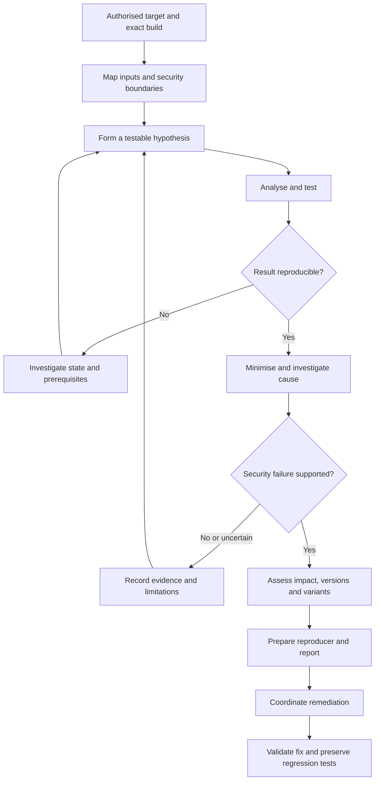
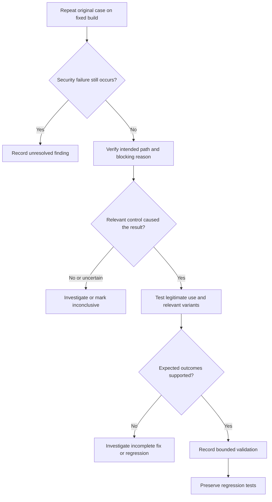

# Vulnerability Research

Vulnerability research is the systematic process of identifying, understanding, validating and responsibly communicating security weaknesses in software and systems.

The objective is to turn an interesting observation into a reproducible, technically defensible security conclusion.

A useful investigation establishes:

- Where untrusted input enters and what the attacker controls.
- How the input reaches a security-relevant operation.
- Which assumption or security check fails.
- Whether the behaviour can be reproduced and explained.
- What access, capability or impact is demonstrated.
- Which versions, configurations and related implementations are affected.
- Whether remediation addresses the underlying cause.

**Observation -> Candidate -> Validation -> Evidence -> Security Conclusion**

Use this page as the research overview and navigation map. The ten dedicated pages provide detailed procedures for each part of the investigation.

!!! warning "Authorised research"
    Test only software, systems and environments where the activity is authorised. Use controlled installations and synthetic data wherever possible. Public source code, an accessible service or a published CVE does not authorise testing someone else's deployment. Review testing, disclosure and publication conditions separately.

## Start Here

<div class="grid cards" markdown>

-   **Research Methodology**

    ---

    Define the target, scope, environment, research questions and evidence needed to support a conclusion.

    [Vulnerability Research Methodology](methodology.md)

-   **Attack Surface Analysis**

    ---

    Identify entry points, attacker-controlled inputs, trust boundaries and sensitive operations.

    [Attack Surface Analysis](attack-surface-analysis.md)

-   **Debugging and Dynamic Analysis**

    ---

    Observe reachable code, runtime values, security checks, process activity and failures.

    [Debugging and Dynamic Analysis](debugging-dynamic-analysis.md)

-   **Fuzzing**

    ---

    Explore input space using appropriate harnesses, seed corpora, instrumentation and result classification.

    [Fuzzing](fuzzing.md)

-   **Crash Analysis**

    ---

    Reproduce and minimise failures, inspect runtime state and determine their security relevance.

    [Crash Analysis](crash-analysis.md)

-   **Patch Diffing**

    ---

    Compare implementations to understand the security condition a change attempts to restore.

    [Patch Diffing](patch-diffing.md)

-   **Variant Analysis**

    ---

    Search related functions, interfaces and implementations for the same underlying security mistake.

    [Variant Analysis](variant-analysis.md)

-   **Proof of Concept Development**

    ---

    Build a minimal, controlled reproducer with explicit prerequisites, expected results and limitations.

    [Proof of Concept Development](poc-development.md)

-   **CVE Research**

    ---

    Connect advisories, affected versions, patches and local reproduction to technical understanding.

    [CVE Research](cve-research.md)

-   **Responsible Disclosure**

    ---

    Prepare evidence that maintainers can use to reproduce, investigate, remediate and retest the issue.

    [Responsible Disclosure](responsible-disclosure.md)

</div>

## Choose a Research Route

The starting point determines which page is most useful.

| Starting point | Begin with | Expected output |
|---|---|---|
| A new product or unfamiliar component | [Methodology](methodology.md) and [Attack Surface Analysis](attack-surface-analysis.md) | Target model and prioritised research questions |
| Suspicious source code | [Source Code Review](../source-code-review/index.md) and [Debugging](debugging-dynamic-analysis.md) | A candidate data flow with reachability evidence |
| A parser or structured input format | [Fuzzing](fuzzing.md) | A suitable harness, corpus and triage process |
| A crash, hang or sanitizer report | [Crash Analysis](crash-analysis.md) | Reproducer, failure classification and security assessment |
| A security patch or advisory | [CVE Research](cve-research.md) and [Patch Diffing](patch-diffing.md) | A hypothesis about the fixed condition |
| A confirmed root cause | [Variant Analysis](variant-analysis.md) | Independently validated related candidates |
| A reproducible security failure | [PoC Development](poc-development.md) | Minimal evidence supporting a specific claim |
| A finding ready for coordination | [Responsible Disclosure](responsible-disclosure.md) | A complete technical report and disclosure record |

Not every investigation needs fuzzing, binary analysis or a CVE assignment. Select methods that resolve the current question.

## Research Lifecycle

The workflow is iterative. Patch analysis may start an investigation, dynamic evidence may contradict the source-review hypothesis, and a variant may require a different reproduction environment.



| Phase | What to do | What to expect | What follows |
|---|---|---|---|
| Prepare | Record authorisation, target, build and configuration | A controlled baseline | Map relevant functionality |
| Observe | Identify inputs, transformations and sensitive operations | Candidate security assumptions | Define a testable hypothesis |
| Test | Combine appropriate static and dynamic methods | Supported, unsupported or inconclusive behaviour | Reproduce and investigate |
| Explain | Minimise the case and identify the failing condition | Root-cause evidence and a bounded capability | Assess security consequences |
| Extend | Review versions, patches and related implementations | A supported scope of affected behaviour | Prepare a report |
| Remediate | Coordinate a fix and repeat relevant tests | Evidence that the intended security condition holds | Preserve regression coverage |

A complete explanation is desirable, but evidence may remain incomplete. Report confirmed behaviour and uncertainty separately rather than inventing a root cause.

## Establish a Controlled Baseline

### Scope and Environment

Record:

- Product, component and deployment being tested.
- Exact version, build, commit or package revision.
- Operating system, architecture and runtime.
- Dependencies, compiler settings and relevant mitigations.
- Enabled features and configuration.
- Test accounts, roles and representative application data.
- Allowed techniques, excluded activity and stopping conditions.
- Evidence handling, disclosure and publication requirements.

Where practical, use a resettable VM, container or dedicated lab with appropriate network isolation. Treat the isolation boundary itself as part of the environment, especially when investigating privileged components.

Prepare the observations needed for the question: source code, debugger, application logs, system monitoring, proxy, network capture, instrumentation or sanitizers.

Snapshots help restore state, but record what they contain and verify that each attempt starts from the intended baseline.

### Exact Version Record

An example record for a fictional target:

```text
Product: Example Server
Component: Archive import service
Version: 4.2.1
Commit or build identifier: Record exact value
Platform: Linux x86_64
Runtime and dependencies: Record exact versions
Deployment: Isolated local installation
Configuration: Authentication enabled; archive import enabled
Test identity: Dedicated low-privileged research account
Instrumentation: Record debugger, sanitizer or tracing settings
Baseline: Record snapshot or reset procedure
```

Distinguish an instrumented research build from the distributed release. Instrumentation can help expose a defect, but deployment-specific conclusions still require evidence about the relevant product configuration.

### Research Workspace

Keep inputs, results and interpretation organised.

| Directory | Purpose |
|---|---|
| `notes/` | Hypotheses, observations, decisions and negative results |
| `source/` | Source snapshots and repository references |
| `builds/` | Build records and version-specific outputs |
| `samples/` | Known-good examples and controlled test inputs |
| `corpus/` | Fuzzing seeds and retained coverage inputs |
| `crashes/` | Original failures and triage records |
| `poc/` | Minimal reproducers |
| `patches/` | Relevant changes and patch analysis |
| `variants/` | Related candidates and their validation |
| `evidence/` | Logs, traces, captures and artefact identifiers |
| `reports/` | Technical reports and disclosure material |

Keep real credentials, sensitive data and restricted disclosure material out of public repositories.

## Model Inputs, Data Flow and Trust

### Attack Surface and Entry Points

Potential surfaces include HTTP and API endpoints, network protocols, file parsers, uploads, import functions, authentication flows, IPC, command-line interfaces, plugins, update mechanisms, deserialisation, archive extraction and local services.

Identify the specific input rather than stopping at the feature name:

- Parameter, header, JSON field or protocol field.
- Uploaded file or archive entry.
- Configuration value or environment variable.
- IPC message or command-line argument.
- Token, session value or object identifier.

Then determine who can control it, under which privileges and through which supported interface.

Continue with [Attack Surface Analysis](attack-surface-analysis.md).

### Sources, Transformations and Sinks

Trace the input through decoding, parsing, normalisation, validation and use.

Sensitive operations may include:

- Command execution and dynamic evaluation.
- Database queries.
- File access and modification.
- Template rendering and deserialisation.
- Memory allocation, indexing and copying.
- Outbound network requests.
- Authentication and authorisation decisions.

A function name is only a starting point. Determine whether the input reaches that operation under security-relevant conditions and whether an effective check constrains it.

Review the original representation, intermediate values and final value used. Validation of one representation may not constrain a later transformation.

Use [Source Code Review](../source-code-review/index.md) and the existing [Static Analysis](../source-code-review/static-analysis/index.md) section for detailed source-review methods.

### Trust Boundaries

Identify transitions such as:

| Boundary | Question |
|---|---|
| Unauthenticated to authenticated | Where is identity established and verified? |
| Standard user to privileged operation | Which permission permits the operation? |
| User A to User B | Is access authorised for the requested resource? |
| Tenant A to Tenant B | Is tenant context enforced throughout the operation? |
| Application to operating system | What authority does the process exercise? |
| Untrusted file to parser | What assumptions does processing make about structure and size? |
| Container or sandbox to host | Which resources and privileges are actually shared? |
| Downloaded update to trusted code | What establishes authenticity before use? |

Network access or data movement alone does not establish a security violation. Explain the intended policy and how observed behaviour violates it.

## Define the Security Invariant

A security invariant is a condition that must hold for an operation to remain safe.

| Area | Example invariant |
|---|---|
| Memory copy | The source contains the requested bytes and the destination has sufficient capacity |
| Array indexing | The index is within the valid range, including any relevant lower bound |
| Allocation arithmetic | Size calculations do not overflow or produce an undersized allocation |
| File extraction | The write remains confined to the permitted destination under actual filesystem resolution |
| Object access | The authenticated principal is authorised for the requested operation on the object |
| Update handling | Authenticity is verified before the artefact is trusted or executed |
| Object lifetime | An object remains valid while it is accessed |
| Privileged operation | The caller has the required authority at the point of use |

Common assumptions worth investigating include:

- This value cannot be controlled by a user.
- Another layer already validated the field.
- This endpoint always requires authentication.
- This object belongs to the current user.
- This path remains within the intended directory.
- This length cannot exceed the available buffer.
- This pointer still refers to a live object.
- This request can only originate internally.

Ask what evidence supports the assumption and what input or state could make it false.

An invariant provides a stronger basis for root-cause analysis, variant searches and remediation than the exact bytes of one successful input.

## Form and Test a Hypothesis

For example:

```text
Observation:
The application accepts archive uploads.

Question:
How does it constrain extraction destinations?

Hypothesis:
The extraction helper may use entry paths without enforcing
containment within the permitted output directory.

Controlled test:
Use an isolated installation and a dedicated marker destination
inside the research workspace.

Expected secure behaviour:
Entries that would escape the extraction root are rejected
before an out-of-root write occurs.

Evidence required:
Exact archive, version, configuration, execution identity,
filesystem observations and relevant processing logic.
```

The test should distinguish the hypothesis from alternative explanations. A rejected archive may mean the control worked, the format was unsupported or the relevant path was never reached.

### Authentication and Authorisation

For authentication, inspect session creation, session validation, token handling, password reset, administrative routes and alternative flows.

For authorisation, inspect object access, operations, HTTP methods, nested resources, tenant context and privileged actions.

The user interface does not establish where security is enforced. Trace enforcement to the server-side operation.

An authenticated user may legitimately access shared resources. Establish the intended access policy before interpreting another user's object as evidence of a vulnerability.

### Static and Dynamic Analysis

| Method | Helps establish | Limitation to resolve |
|---|---|---|
| Source search | Relevant functions, fields and checks | Text matches do not prove reachability |
| Static analysis | Candidate data flows and missing checks | Model assumptions may differ from runtime behaviour |
| Debugging | Executed paths, values and program state | The observed run may not represent every configuration |
| System tracing | File, process and system-call behaviour | A recorded operation still needs identity and policy context |
| Network observation | Requests, responses and protocol behaviour | Intermediaries or cached state may affect interpretation |
| Instrumentation and sanitizers | Runtime defects and diagnostic evidence | Product reachability and impact need separate assessment |

Use static evidence to guide runtime tests, then return to the implementation when observations differ from expectations.

Continue with [Debugging and Dynamic Analysis](debugging-dynamic-analysis.md).

## Fuzzing and Crash Triage

### Fuzzing

Fuzzing generates or mutates inputs and observes target behaviour. Coverage feedback, assertions, sanitizers and other test oracles help identify cases worth investigating.

Define:

- The component and entry point under test.
- Harness assumptions and reset behaviour.
- Representative seed inputs.
- Input structure and relevant state transitions.
- Time, memory and execution limits.
- What counts as an interesting result.
- How inputs, logs and coverage are preserved.
- How suspected duplicates are grouped and reviewed.

Crashes, hangs, resource exhaustion, parser inconsistencies and unexpected states are investigation inputs. Neither the number of crashes nor the amount of coverage alone measures confirmed vulnerabilities.

A harness that invokes an internal function in an impossible state may reveal a real coding defect without demonstrating a reachable product vulnerability.

Continue with [Fuzzing](fuzzing.md).

### Crash Analysis

For a failure, establish:

1. Whether the original input reproduces under the recorded conditions.
2. Whether the failure belongs to the target or the harness.
3. The exception, signal, failing instruction and relevant stack.
4. The allocation, lifetime and access details where memory is involved.
5. Which input or state influences the operation.
6. The earliest supported cause, rather than only the final symptom.
7. The product entry point and security consequences.

Possible classifications include assertions, unhandled exceptions, resource exhaustion, out-of-bounds access, use-after-free, double free and integer-related memory defects.

[AddressSanitizer](https://clang.llvm.org/docs/AddressSanitizer.html){ target="_blank" rel="noopener noreferrer" } can expose memory errors such as out-of-bounds accesses and use-after-free. Preserve its report with the triggering input and build information.

A crash does not automatically establish service-wide denial of service. An out-of-bounds write does not automatically establish code execution.

Continue with [Crash Analysis](crash-analysis.md).

## Reproduce, Minimise and Challenge the Result

### Reproducibility

Record the exact version, configuration, input, sequence, expected behaviour and observed behaviour.

Reset the environment and repeat. If state or timing matters, document it. For intermittent behaviour, record attempts, successes and relevant conditions instead of describing the issue as either perfectly reliable or nonexistent.

The practical question is:

> Can another researcher reproduce or meaningfully investigate the same security-relevant behaviour from these records?

### Minimal Reproduction

Reduce unnecessary requests, fields, files, dependencies and setup while preserving the same underlying failure.

After each reduction, confirm that the reproducer still exercises the same condition. A smaller input that produces a different crash may no longer demonstrate the original issue.

Preserve the original input as well as the minimised case.

Minimal reproductions help with diagnosis, vendor triage, patch validation and regression testing.

### Controls and Alternative Explanations

Check for:

- Cached responses or stale files.
- Existing privileged sessions.
- Incorrect test identities.
- Intentionally shared resources.
- Debug-only configuration.
- Unsupported builds or changed dependencies.
- Proxy modifications.
- Artefacts left by earlier attempts.
- Harness defects or unrealistic invocation.
- Environmental failures unrelated to the hypothesis.

For object-level authorisation testing, use dedicated accounts and known ownership:

| Test | Expected result |
|---|---|
| Account A accesses its own permitted object | Allowed |
| Account A accesses Account B's private object | Denied |
| An unauthenticated session accesses a protected object | Rejected |
| Account A requests a nonexistent object | Handled without disclosing protected data |

The exact status code depends on the application's design. Judge the access and data returned, not the code alone.

Negative results remain useful. Record which hypothesis they weaken and what remains untested.

## Separate Root Cause, Capability and Impact

These are related but distinct conclusions.

| Layer | Example |
|---|---|
| Observation | A file appears outside the intended extraction directory |
| Root cause | The extraction operation does not enforce destination containment for the relevant entry type |
| Capability | The tested input controls a write to a demonstrated out-of-root location |
| Preconditions | Archive import is available and the service identity can write to that location |
| Security boundary | Untrusted archive data influences files outside the intended extraction area |
| Demonstrated impact | Creation or modification of the approved marker file |
| Unproven extension | Access to arbitrary system paths or code execution |

Avoid describing a constrained read or write as arbitrary unless the evidence supports that degree of control.

Other capabilities may include unauthorised object access, request forgery, authentication-state manipulation, out-of-bounds access or command execution. Each needs its own reachability and impact analysis.

### Exploitability and Preconditions

Assess:

- Authentication and privileges.
- User interaction.
- Network position and exposed interfaces.
- Required features or configuration.
- Knowledge of identifiers or application state.
- Timing, races or multiple-stage dependencies.
- Process authority and relevant mitigations.
- Reliability and environmental differences.

These conditions belong in the finding, not only in private research notes.

### Severity

Assess confidentiality, integrity and availability consequences alongside prerequisites, exposure and the boundary crossed.

[FIRST CVSS](https://www.first.org/cvss/){ target="_blank" rel="noopener noreferrer" } provides a structured severity-scoring method. When using it, record the version, vector and justification. Keep severity distinct from the organisation's wider risk and remediation priority.

Clearly label observed impact and reasoned potential consequences. Do not perform unnecessary damaging actions merely to support a higher severity.

## Patch Diffing, Variants and Versions

### Understand the Patch

Look for changed validation, bounds checks, authorisation, parsing, defaults, sanitisation and memory handling.

Ask:

- What condition does the change enforce?
- Is the relevant code reachable?
- Does the check apply before the sensitive operation?
- Do later transformations invalidate the check?
- Is the change consistently applied across callers and branches?
- Could unrelated refactoring explain part of the diff?

A security-relevant change supports a hypothesis. Controlled testing and implementation analysis establish what it actually fixes.

Continue with [Patch Diffing](patch-diffing.md).

### Search for Variants

After understanding the cause, inspect:

- Shared helpers and their callers.
- Sibling functions.
- Related parsers and file formats.
- Alternate endpoints and API versions.
- Legacy implementations.
- Platform-specific code.
- Maintained branches.
- Inconsistent application of the fix.

Each similar implementation is a candidate requiring its own reachability, control and impact analysis.

Group related manifestations by cause where appropriate, while retaining their distinct affected interfaces and conditions. Do not assume every matching line is a separate vulnerability.

Continue with [Variant Analysis](variant-analysis.md).

### Establish Affected Versions

Separate direct tests, source-history evidence and vendor statements.

| Classification | Meaning |
|---|---|
| Confirmed affected | The relevant failure was validated on the recorded build and configuration |
| Fix validated | The relevant reproduction and security checks were tested successfully |
| Potentially affected | Code or other evidence suggests applicability, but validation is incomplete |
| Vendor-reported | The range comes from an attributed advisory |
| Not tested | No direct conclusion is available |

Do not infer that every version between two affected releases is vulnerable without supporting evidence.

Record maintained branches, platform differences, distribution patches and backports where relevant.

Continue with [CVE Research](cve-research.md).

### Useful Git History Commands

Run these in the target's research checkout. Replace placeholder revisions and paths before use.

```bash
git log --oneline --all
git log -p -- path/to/file
git blame -- path/to/file
git diff OLD_COMMIT NEW_COMMIT -- path/to/file
```

Expect commit history and implementation differences. Use them to identify candidates for testing, not to infer vulnerability solely from authorship or changed lines.

When a reproducible regression has known good and bad revisions, [Git bisect](https://git-scm.com/docs/git-bisect){ target="_blank" rel="noopener noreferrer" } can narrow the introduction point:

```bash
git bisect start
git bisect bad KNOWN_BAD_COMMIT
git bisect good KNOWN_GOOD_COMMIT
```

Build and test each selected revision, then classify that revision with one appropriate command:

```bash
git bisect good
```

```bash
git bisect bad
```

If the revision cannot be meaningfully tested:

```bash
git bisect skip
```

Finish with:

```bash
git bisect reset
```

Use a research checkout without uncommitted work. The result depends on a consistent test; skipped or unbuildable revisions can leave ambiguity.

## Develop a Minimal Proof of Concept

Define the smallest claim the PoC must establish.

A useful PoC includes:

- Exact product, build and configuration.
- Required access and preconditions.
- Known-good baseline.
- Minimal trigger or procedure.
- Expected secure behaviour.
- Observed security-relevant result.
- Evidence collection and repeatability instructions.
- Limitations and cleanup.
- Fixed-version comparison where available.

Use synthetic data, dedicated accounts and controlled destinations.

A PoC should not require unrelated persistence, bulk collection, destructive changes or additional compromise when a smaller demonstration establishes the issue.

Examples of bounded claims include:

- A specified unauthorised object was returned.
- A controlled file was written outside the intended directory.
- A documented input caused an out-of-bounds read in the tested parser.
- A particular privileged action occurred without the required check.

Continue with [Proof of Concept Development](poc-development.md).

## Preserve Evidence and Research Notes

Capture evidence that directly supports the conclusion:

- Requests and responses.
- Application and system logs.
- Source references and exact revisions.
- Debugger state and stack traces.
- Sanitizer reports.
- Network captures.
- Version and configuration records.
- Reproducers, input files and output.
- Screenshots where they add useful context.

Record timestamps and timezone. Retain the relationship between each input, attempt, build and result.

### Artefact Identification

For an existing input named `poc.bin`, calculate its hash.

Linux:

```bash
sha256sum poc.bin
```

PowerShell:

```powershell
Get-FileHash .\poc.bin -Algorithm SHA256
```

The hash identifies the tested bytes. It does not independently prove when, where or how the input was executed.

Before sharing evidence, remove unnecessary passwords, session cookies, tokens, API keys, personal data, private URLs and internal identifiers. Preserve a controlled original and a sanitised sharing copy where required.

### Research Log Template

```text
Research ID:
Date and timezone:
Target and component:
Version / build / commit:
Platform and configuration:
Test identity:
Baseline / reset procedure:

Observation:
Hypothesis:
Security invariant:
Attacker-controlled input:
Relevant source or runtime location:

Procedure:
Input identifier and hash:
Expected secure result:
Observed result:
Controls and alternative explanations:
Reproduction attempts:
Evidence references:

Root cause status:
Demonstrated capability:
Preconditions:
Security impact:
Remaining uncertainty:

Files or configuration changed:
Cleanup:
Next step:
```

Do not discard unsupported hypotheses. A documented negative result prevents duplicated work and improves the model of the target.

## Reporting and Coordinated Disclosure

A report should let maintainers understand, reproduce, investigate, patch and retest the issue.

Include:

- Descriptive title and concise technical summary.
- Product, component, tested versions and environment.
- Vulnerability class and affected security condition.
- Required access, configuration and user interaction.
- Reproduction steps and minimal PoC.
- Expected and observed behaviour.
- Root cause, or a clear statement of what remains unknown.
- Demonstrated impact and separately labelled potential consequences.
- Evidence references.
- Remediation and retest guidance.
- Affected-version evidence and limitations.

Prefer a title such as:

> Missing Object-Level Authorisation Allows Cross-User Access

A useful conclusion explains the underlying relationship:

> The tested endpoint retrieves records using a caller-supplied identifier without enforcing the required object-level authorisation. With two dedicated accounts and verified private-object ownership, Account A retrieved Account B's object. This demonstrates an authorisation failure for the tested endpoint, version and configuration.

Avoid turning a specific result into a claim about every endpoint, tenant or release.

Follow the applicable disclosure policy, identify the appropriate security contact, protect sensitive evidence and coordinate remediation and publication. Testing permission and publication conditions are separate questions.

The [CERT Guide to Coordinated Vulnerability Disclosure](https://certcc.github.io/CERT-Guide-to-CVD/){ target="_blank" rel="noopener noreferrer" } provides background on coordination. Use [Responsible Disclosure](responsible-disclosure.md) for the detailed workflow.

## Validate Remediation

A fix should enforce the intended security condition rather than merely reject the original input.

For an object-access failure, remediation should enforce the appropriate server-side authorisation for the requested operation and resource. Blocking one identifier does not address the class of failure.

Retesting should verify both the security restriction and continued legitimate functionality.



Check:

- The same feature and relevant configuration remain enabled.
- The test reaches the intended code path.
- The security check, rather than an unrelated error, explains rejection.
- Approved legitimate operations still work.
- Relevant alternate inputs and entry points are covered.
- Maintained branches and platforms are assessed where in scope.

A blocked PoC supports only the conclusion justified by these checks. State the tested scope rather than claiming the entire vulnerability class has been eliminated.

## Tools and Automation

| Category | Research purpose | Internal route |
|---|---|---|
| Source search and static analysis | Locate candidate functions, checks and data flows | [Static Analysis](../source-code-review/static-analysis/index.md) |
| Debuggers and runtime tracing | Establish executed paths and program state | [Debugging and Dynamic Analysis](debugging-dynamic-analysis.md) |
| Disassemblers and decompilers | Investigate compiled implementations | [Vulnerability Research Tools](../tools/vulnerability-research/index.md) |
| Proxies and network analysis | Inspect application and protocol behaviour | [Tools](../tools/index.md) |
| Fuzzers and coverage tools | Explore input space and preserve useful cases | [Fuzzing](fuzzing.md) |
| Sanitizers and crash diagnostics | Identify and explain runtime failures | [Crash Analysis](crash-analysis.md) |
| Version control and comparison | Investigate history and fixes | [Patch Diffing](patch-diffing.md) |

Simple source searches remain useful:

```bash
rg -n 'exec|system|spawn|ProcessBuilder' .
rg -n 'deserialize|unserialize|pickle|ObjectInputStream' .
rg -n 'open|read|write|unlink|rename' .
rg -n 'memcpy|memmove|malloc|calloc|realloc' .
```

These broad expressions return candidates, including comments, tests and unrelated names. Narrow the search to relevant code and inspect callers, arguments, guards and runtime reachability.

Automation can build versions, generate inputs, run reproductions, preserve failures, search variants, capture output and hash artefacts.

Keep the expected result and failure conditions explicit. A script reporting success is not a substitute for evidence of the claimed security outcome.

## Research Status and Confidence

Track dimensions separately rather than treating every investigation as a mandatory progression.

| Status | What it establishes |
|---|---|
| Hypothesis | A testable explanation has been proposed |
| Behaviour reproduced | The observation occurs under recorded conditions |
| Root cause supported | Evidence identifies the defective logic or missing control |
| Security impact confirmed | The relevant security consequence has been validated |
| Version scope assessed | Affected and unaffected claims have stated evidence |
| Variants assessed | Related candidates have documented outcomes and search limits |
| Remediation validated | Retesting supports the intended fix within the recorded scope |

A finding can have confirmed impact while its exact implementation cause remains uncertain. Variant analysis may continue after disclosure. Neither situation should be hidden by a single confidence label.

## Research Checklist

### Scope and Environment

- [ ] Confirm authorisation, target and permitted testing.
- [ ] Review disclosure and publication conditions.
- [ ] Record exact version, build, platform and configuration.
- [ ] Prepare a controlled environment and baseline.
- [ ] Configure relevant logging and diagnostic tools.
- [ ] Define evidence handling, reset and cleanup procedures.

### Attack Surface

- [ ] Identify entry points, services, APIs and parsers.
- [ ] Review uploads, imports, file handling and local interfaces.
- [ ] Identify authentication and authorisation enforcement.
- [ ] Identify privileged components and trust boundaries.
- [ ] Establish who controls each relevant input.

### Analysis

- [ ] Trace transformations and sensitive operations.
- [ ] Identify checks and security assumptions.
- [ ] Define the relevant security invariant.
- [ ] Form hypotheses with expected outcomes.
- [ ] Correlate static candidates with runtime evidence.

### Validation

- [ ] Establish a known-good baseline.
- [ ] Execute the controlled test.
- [ ] Reset and reproduce the behaviour.
- [ ] Record reliability and state dependencies.
- [ ] Minimise while preserving the same underlying failure.
- [ ] Use controls and investigate alternative explanations.

### Root Cause

- [ ] Identify the affected component and defective condition.
- [ ] Confirm input influence and product reachability.
- [ ] Explain the missing or incorrect security check.
- [ ] Identify the violated invariant and policy boundary.
- [ ] Separate confirmed causes from hypotheses.

### Impact

- [ ] Record access, configuration and interaction prerequisites.
- [ ] Describe the demonstrated capability precisely.
- [ ] Assess confidentiality, integrity and availability consequences.
- [ ] Distinguish observed impact from potential extensions.
- [ ] Avoid unsupported arbitrary-access or code-execution claims.

### Patch Analysis

- [ ] Identify relevant vulnerable and fixed implementations.
- [ ] Separate security changes from unrelated differences.
- [ ] Explain what condition the patch enforces.
- [ ] Check ordering, callers and later transformations.
- [ ] Validate behaviour on the fixed build.

### Variants

- [ ] Extract the underlying vulnerable pattern.
- [ ] Review shared helpers, sibling functions and related endpoints.
- [ ] Review legacy, branch and platform differences.
- [ ] Check consistent application of the patch.
- [ ] Validate each candidate and group related root causes.
- [ ] Record the limits of the search.

### Versions

- [ ] Record directly tested affected builds.
- [ ] Record fix-validation results.
- [ ] Review relevant source and package history.
- [ ] Assess maintained branches where applicable.
- [ ] Distinguish tested, inferred and vendor-reported ranges.
- [ ] Avoid guessing untested versions.

### Proof of Concept

- [ ] Define the minimum technical claim.
- [ ] Keep the reproducer controlled and documented.
- [ ] Include exact prerequisites, inputs and sequence.
- [ ] Include expected and observed results.
- [ ] Preserve input identifiers and relevant hashes.
- [ ] Include limitations, reset and cleanup instructions.
- [ ] Compare with a fixed build where available.

### Evidence

- [ ] Preserve relevant requests, responses and logs.
- [ ] Capture traces, sanitizer or debugger evidence where useful.
- [ ] Record versions, code references and configurations.
- [ ] Associate each result with the correct attempt and input.
- [ ] Protect originals and sanitise sharing copies.

### Reporting

- [ ] Use a descriptive title.
- [ ] Explain the condition, reproduction and preconditions.
- [ ] State root-cause confidence and demonstrated impact.
- [ ] Provide evidence and affected-version support.
- [ ] Recommend remediation of the underlying cause.
- [ ] Define retest criteria and remaining limitations.

### Disclosure

- [ ] Identify the appropriate security contact.
- [ ] Follow the applicable programme policy.
- [ ] Provide sufficient reproduction detail.
- [ ] Protect sensitive information.
- [ ] Maintain a coordination record.
- [ ] Coordinate remediation and publication as applicable.

### Retesting

- [ ] Repeat the original case.
- [ ] Verify why the observed result changed.
- [ ] Confirm intended secure behaviour.
- [ ] Confirm legitimate functionality.
- [ ] Test relevant variants and configurations.
- [ ] Record the supported scope of remediation.
- [ ] Preserve suitable regression tests.

## Related Notes

- [Source Code Review](../source-code-review/index.md)
- [Web Application Security](../web/index.md)
- [Windows](../windows/index.md)
- [Linux](../linux/index.md)
- [Red Teaming](../red-teaming/index.md)
- [Purple Teaming](../purple-teaming/index.md)
- [Vulnerability Research Tools](../tools/vulnerability-research/index.md)
- [Tools](../tools/index.md)
- [Cheatsheets](../cheatsheets/index.md)

Use source review to investigate implementation, platform notes to establish execution context, and purple teaming to validate defensive outcomes around an agreed scenario.

## References

- [CVE Program](https://www.cve.org/){ target="_blank" rel="noopener noreferrer" }
- [NIST National Vulnerability Database](https://nvd.nist.gov/){ target="_blank" rel="noopener noreferrer" }
- [CISA Known Exploited Vulnerabilities Catalog](https://www.cisa.gov/known-exploited-vulnerabilities-catalog){ target="_blank" rel="noopener noreferrer" }
- [GitHub Security Advisories](https://github.com/advisories){ target="_blank" rel="noopener noreferrer" }
- [CERT Guide to Coordinated Vulnerability Disclosure](https://certcc.github.io/CERT-Guide-to-CVD/){ target="_blank" rel="noopener noreferrer" }
- [FIRST CVSS](https://www.first.org/cvss/){ target="_blank" rel="noopener noreferrer" }
- [MITRE CWE](https://cwe.mitre.org/){ target="_blank" rel="noopener noreferrer" }
- [Git Documentation](https://git-scm.com/doc){ target="_blank" rel="noopener noreferrer" }
- [Git Bisect](https://git-scm.com/docs/git-bisect){ target="_blank" rel="noopener noreferrer" }
- [GDB Documentation](https://sourceware.org/gdb/documentation/){ target="_blank" rel="noopener noreferrer" }
- [Clang AddressSanitizer](https://clang.llvm.org/docs/AddressSanitizer.html){ target="_blank" rel="noopener noreferrer" }
- [LLVM libFuzzer](https://llvm.org/docs/LibFuzzer.html){ target="_blank" rel="noopener noreferrer" }
- [AFL++ Documentation](https://aflplus.plus/docs/){ target="_blank" rel="noopener noreferrer" }
- [GitHub CodeQL Documentation](https://codeql.github.com/docs/){ target="_blank" rel="noopener noreferrer" }
- [Semgrep Documentation](https://semgrep.dev/docs/){ target="_blank" rel="noopener noreferrer" }
