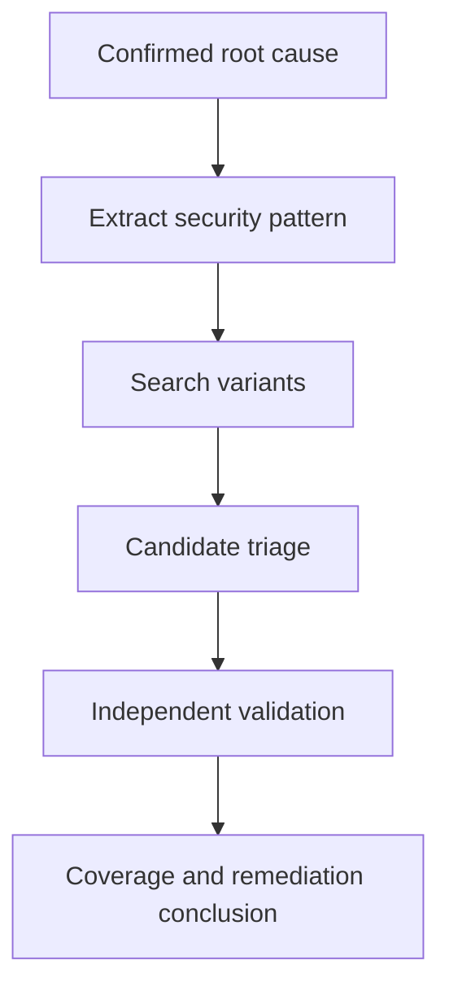

# Variant Analysis for Vulnerability Research

Variant analysis is the process of taking a confirmed vulnerability and systematically searching for other vulnerabilities that share the same or a closely related root cause.

A single confirmed vulnerability can reveal a broader bug class.

```text
Confirmed Vulnerability
          |
          v
Understand Root Cause
          |
          v
Extract Security Invariant
          |
          v
Identify Similar Code
          |
          v
Identify Similar Data Flows
          |
          v
Identify Alternate Entry Points
          |
          v
Test Candidates
          |
          +-------------------+
          |                   |
          v                   v
      Not Affected         Variant
                              |
                              v
                       Root Cause Analysis
                              |
                              v
                       Expand Search Again
```

Variant analysis is especially useful after:

```text
Crash analysis

Patch diffing

Source code review

Fuzzing

CVE research

Regression analysis
```

The objective is not to search randomly for more bugs.

The objective is to transform one confirmed root cause into a structured research hypothesis and test where else the same security assumption exists.

Only perform testing against software and environments you are authorised to analyse.

---

# 1. Why Variant Analysis Matters

Software frequently repeats:

```text
Design patterns

Validation functions

Parser structures

Authentication logic

Authorisation logic

Memory operations

Serialization code

Protocol handlers

Helper functions

Framework conventions
```

If one implementation contains a security mistake, related implementations may contain the same mistake.

For example:

```text
Image Parser
    |
    +---- JPEG Parser
    |
    +---- PNG Parser
    |
    +---- GIF Parser
```

If the PNG parser fails to validate an attacker-controlled length before copying data, similar logic may exist in the JPEG or GIF parser.

---

# 2. One Vulnerability May Represent a Bug Class

Consider a confirmed vulnerability:

```text
Attacker-Controlled Length
          |
          v
Missing Bounds Check
          |
          v
Memory Copy
          |
          v
Heap Buffer Overflow
```

The useful question is not only:

```text
Where else is this exact function called?
```

It is:

```text
Where else does attacker-controlled length influence
a memory operation without equivalent validation?
```

That broader question drives effective variant analysis.

---

# 3. Start With a Confirmed Root Cause

Variant analysis works best when the original vulnerability is well understood.

Before beginning, establish:

```text
Attacker-controlled input

Entry point

Data flow

Transformation

Missing or incorrect validation

Sensitive operation

Security consequence
```

If these are unclear, return to root cause analysis first.

---

# 4. Root Cause Template

Document the original finding:

```text
Vulnerability:

Affected Component:

Entry Point:

Attacker-Controlled Input:

Input Transformation:

Security Check:

Missing / Incorrect Condition:

Sensitive Operation:

Failure:

Security Impact:

Patch:

Security Invariant:
```

Example:

```text
Vulnerability:
Heap-buffer-overflow.

Affected Component:
Document record parser.

Entry Point:
Document import.

Attacker-Controlled Input:
Record length.

Transformation:
32-bit little-endian integer.

Missing Condition:
Declared length is not compared with destination capacity.

Sensitive Operation:
Memory copy.

Failure:
Out-of-bounds write.

Security Invariant:
Copy length must never exceed destination capacity.
```

The final line is especially important.

---

# 5. Extract the Security Invariant

A security invariant describes the condition that must remain true for the operation to be safe.

Examples:

```text
Copy length <= destination capacity

Array index < element count

Resolved path remains inside allowed root

Object access requires ownership

Request requires authenticated identity

Signature must be verified before trust

Object must remain alive while referenced

Integer arithmetic must not overflow allocation size

Untrusted input must not become shell syntax
```

The invariant can often be searched more effectively than the original vulnerability syntax.

---

# 6. Root Cause Versus Symptom

Do not search only for:

```text
SIGSEGV
```

when the root cause is:

```text
Unchecked attacker-controlled length.
```

Do not search only for:

```text
403 bypass
```

when the root cause is:

```text
Authorization is applied to one route representation but
not an equivalent normalized route.
```

Do not search only for:

```text
Path traversal
```

when the root cause is:

```text
Security validation occurs before canonicalisation.
```

Variant analysis should follow the root cause.

---

# 7. Build a Variant Hypothesis

Convert the root cause into a testable hypothesis.

Example:

> Other record parsers may use attacker-controlled length fields in memory operations without enforcing destination-capacity validation.

Another:

> Other object retrieval endpoints may load objects by identifier without applying the ownership check introduced by the patch.

Another:

> Other path-handling functions may validate the path before decoding or canonicalisation.

The hypothesis determines what you search for.

---

# 8. Variant Analysis Dimensions

Search across several dimensions.

```text
                 Original Vulnerability
                          |
          +---------------+---------------+
          |               |               |
          v               v               v
      Same Code       Same Pattern     Same Interface
          |               |               |
          v               v               v
       Callers        Similar Code     Alternate Routes
          |
          +---------------+---------------+
                          |
                          v
                    Same Component
                          |
                          v
                   Related Components
                          |
                          v
                     Other Platforms
```

Useful dimensions include:

```text
Same function

Same helper

Same data structure

Same parser family

Same endpoint family

Same protocol

Same authentication mechanism

Same authorization mechanism

Same library

Same framework

Same platform abstraction

Same developer pattern

Same patch pattern
```

---

# 9. Search the Exact Function

Start with the narrowest search.

Suppose the vulnerable function is:

```text
copy_record()
```

Search:

```bash
rg -n "copy_record" .
```

Determine:

```text
Where is it defined?

Who calls it?

What inputs reach it?

Do all callers perform validation?
```

---

# 10. Search Callers

A shared helper may be safe only when callers enforce preconditions.

Example:

```text
parse_type_a()
       |
       v
validate_length()
       |
       v
copy_record()

parse_type_b()
       |
       v
copy_record()
```

The second caller may represent a variant.

---

# 11. Search Callees

Sometimes the vulnerability exists below the patched function.

```text
Parser A ----\
Parser B -----+--> shared_helper()
Parser C ----/
```

If the patch protects only Parser A, determine whether the shared helper remains unsafe when reached through Parser B or Parser C.

---

# 12. Search the Same Data Structure

Suppose the vulnerability involves:

```c
record->length
```

Search:

```bash
rg -n "record.*length|length.*record" src/
```

Then inspect how the field is used.

Potential sinks include:

```text
Allocation

Copy

Loop bound

Pointer arithmetic

Array access

File read

Network read
```

---

# 13. Search Struct Fields

For C or C++:

```bash
rg -n "\.length|->length" src/
```

This may produce many results.

Reduce the scope:

```bash
rg -n "\.length|->length" src/parser/
```

Then classify each use.

---

# 14. Search Sensitive Operations

For memory-safety research, useful operations may include:

```text
memcpy

memmove

strcpy

strncpy

read

recv

malloc

calloc

realloc

new
```

Example:

```bash
rg -n "memcpy|memmove|malloc|calloc|realloc" src/parser/
```

Do not treat every result as vulnerable.

Trace the sizes and validation.

---

# 15. Search the Validation Pattern

Suppose the patch introduces:

```c
if (length > destination_capacity)
    return ERROR;
```

Search for related variables:

```bash
rg -n "destination_capacity|record_length|payload_length" src/
```

Look for functions that perform the same sensitive operation without an equivalent condition.

---

# 16. Search the New Helper

Suppose the patch introduces:

```text
validate_record_length()
```

Search:

```bash
rg -n "validate_record_length" .
```

Ask:

```text
Which parsers call it?

Which parsers do not?

Are legacy formats excluded?

Are alternate APIs excluded?
```

---

# 17. Search Similar Function Names

Suppose the patched function is:

```text
parse_record_v2()
```

Search:

```bash
rg -n "parse_record" src/
```

Possible candidates:

```text
parse_record_v1()

parse_record_v2()

parse_record_legacy()

parse_record_extension()
```

Naming conventions can expose related implementations quickly.

---

# 18. Search Similar Files

Example:

```text
src/parsers/png.c

src/parsers/jpeg.c

src/parsers/gif.c

src/parsers/webp.c
```

If one parser contains a vulnerability, inspect the others for the same security invariant.

---

# 19. Search Sibling Components

A useful mental model is:

```text
Confirmed:
src/import/document_parser.c

Potential Siblings:
src/import/archive_parser.c
src/import/template_parser.c
src/import/image_parser.c
src/export/document_parser.c
```

Shared design history may produce shared mistakes.

---

# 20. Search Legacy Implementations

Legacy code is particularly important.

Look for names such as:

```text
legacy

old

compat

v1

deprecated

fallback

classic
```

A patch may protect the modern implementation while leaving an older compatibility path unchanged.

---

# 21. Search Alternate Protocol Versions

Example:

```text
Protocol v1

Protocol v2

Protocol v3
```

If the fix is applied only to:

```text
v3
```

inspect equivalent handlers in:

```text
v1

v2
```

---

# 22. Search Alternate Content Types

A web service may expose similar processing through:

```text
application/json

application/xml

multipart/form-data

application/x-www-form-urlencoded
```

Security controls may differ between parsers.

Do not assume one validated representation means all representations are safe.

---

# 23. Search Alternate Endpoints

Suppose the confirmed vulnerability is:

```text
GET /api/v1/documents/{id}
```

Related interfaces might include:

```text
GET /api/v2/documents/{id}

POST /api/documents/search

GET /mobile/documents/{id}

GET /admin/documents/{id}
```

Search for the same underlying object access and authorization invariant.

---

# 24. Search CRUD Operations

If an access-control issue exists in:

```text
Read
```

also review:

```text
Create

Update

Delete

Export

Share

Download
```

Example:

```text
GET    /documents/{id}
PUT    /documents/{id}
DELETE /documents/{id}
GET    /documents/{id}/download
```

Authorization may be implemented independently.

---

# 25. Search Object Relationships

An object authorization issue may have variants through nested resources.

Example:

```text
/projects/{project_id}

/projects/{project_id}/files/{file_id}

/projects/{project_id}/members/{user_id}
```

Check whether each nested object is validated against the correct parent and user context.

---

# 26. Search Authentication Paths

If an authentication issue exists in one login flow, related flows may include:

```text
Password login

SSO

OAuth

OIDC

API token

Mobile login

Password reset

Remember-me token

Device authentication
```

Extract the underlying authentication invariant before testing related flows.

---

# 27. Search Authorization Middleware

A patch may add:

```text
requirePermission()
```

to one route.

Search:

```bash
rg -n "requirePermission|authorize|permission" .
```

Compare route registration.

Conceptually:

```text
Route A -> Auth -> Authorization -> Handler

Route B -> Auth -> Handler
```

Route B may deserve investigation.

---

# 28. Search Route Definitions

Depending on the framework, route definitions may reveal missing middleware.

Conceptually:

```text
/admin/users/:id -> auth, adminOnly, handler

/admin/export    -> auth, handler
```

The difference does not automatically prove a vulnerability.

Determine what the handler itself enforces.

---

# 29. Search Path Handling

If the original vulnerability involves traversal or canonicalisation, search for:

```text
join

resolve

normalize

canonicalize

realpath

filepath

basename

dirname
```

The exact function names depend on language and platform.

---

# 30. Search Validation Order

A particularly useful variant pattern is:

```text
Validate
   |
   v
Transform
   |
   v
Use
```

when the safe order should be:

```text
Transform
   |
   v
Validate
   |
   v
Use
```

Search for equivalent flows involving:

```text
URL decoding

Unicode normalization

Path canonicalisation

Case normalization

Archive extraction
```

---

# 31. Search Command Construction

If a command-injection issue is confirmed, search for:

```text
system

exec

shell

ProcessBuilder

Runtime.exec

subprocess

cmd.exe

powershell
```

Then determine whether untrusted input becomes part of shell or process arguments.

Prefer semantic analysis over simple keyword matching.

---

# 32. Search SQL Construction

If the root cause involves unsafe query construction, search for:

```text
String concatenation

Formatting

Interpolation

Raw query APIs
```

Compare against:

```text
Prepared statements

Parameter binding

ORM-safe query methods
```

Do not classify a query as vulnerable until untrusted input reaches an unsafe query context.

---

# 33. Search Deserialization Paths

If a deserialization vulnerability exists, search for:

```text
Deserialize

Unmarshal

Decode

Load

ObjectInputStream

pickle

yaml.load
```

Then identify:

```text
Input trust

Type restrictions

Callbacks

Object construction

Post-deserialization operations
```

---

# 34. Search File Operations

If the original vulnerability involves unsafe file handling, search for:

```text
open

read

write

create

rename

delete

extract

upload

download
```

Then trace:

```text
Attacker Path
      |
      v
Transformation
      |
      v
Validation
      |
      v
Filesystem Operation
```

---

# 35. Search Memory Allocation Patterns

Suppose the root cause is:

```text
Allocation size derived differently from copy size.
```

Search for patterns where:

```text
malloc(A)

memcpy(..., B)
```

and determine whether:

```text
A >= B
```

is guaranteed.

---

# 36. Search Integer Conversions

Potentially relevant conversions include:

```text
64-bit -> 32-bit

unsigned -> signed

signed -> unsigned

size_t -> int

string -> integer
```

A safe value in one representation may become unsafe after conversion.

---

# 37. Search Loop Bounds

Example:

```c
for (i = 0; i < count; i++) {
    process(items[i]);
}
```

Investigate:

```text
Who controls count?

How many items were allocated?

Is count validated?

Can arithmetic wrap?
```

Similar loops elsewhere may contain variants.

---

# 38. Search Index Validation

Security invariant:

```text
index < element_count
```

Search array or vector accesses that use attacker-derived indexes.

Conceptually:

```text
Input Index
    |
    v
Parse
    |
    v
Array Access
```

Check whether every path validates the index.

---

# 39. Search Ownership Patterns

For object lifetime vulnerabilities, identify:

```text
Allocation

Reference creation

Reference transfer

Free

Reuse
```

Then search for similar ownership models.

A use-after-free variant often results from the same incorrect lifetime assumption repeated across object types.

---

# 40. Search Error Paths

Security bugs frequently hide in error handling.

Example:

```text
Allocate
   |
   v
Operation Fails
   |
   v
Free
   |
   v
Caller Continues Using Pointer
```

Search:

```text
goto cleanup

error labels

exception handlers

early returns

cleanup functions
```

---

# 41. Search Cleanup Functions

If the original issue involves double free or stale state, inspect:

```text
destroy()

cleanup()

release()

free_*()

close()
```

Determine whether multiple execution paths can invoke cleanup on the same object.

---

# 42. Search State Machines

Logic vulnerabilities may depend on invalid state transitions.

Example:

```text
Created
   |
   v
Approved
   |
   v
Executed
```

Potential variant:

```text
Created
   |
   +------------> Executed
```

Search other actions that depend on the same state model.

---

# 43. Search Trust Boundaries

Map trust transitions:

```text
Network -> Parser

User -> API

Plugin -> Host

Worker -> Privileged Service

Container -> Host Service

Client -> Authentication Service
```

Then search other functions crossing the same boundary.

---

# 44. Search Shared Libraries

A vulnerable function may be reused across multiple products or components.

```text
Shared Library
   |
   +---- Product A
   |
   +---- Product B
   |
   +---- Product C
```

Determine:

```text
Which products include the affected code?

Which versions?

Which expose the vulnerable function?

Which configurations enable it?
```

Presence alone does not prove reachability.

---

# 45. Search Vendored Dependencies

Look for:

```text
vendor/

third_party/

external/

deps/

libraries/
```

An application may contain an embedded copy of vulnerable code that does not follow the upstream release schedule.

---

# 46. Search Forks

A project may fork another project and modify it independently.

Questions:

```text
Was the upstream patch merged?

Was the vulnerable code modified?

Does the fork expose the same interface?

Did the fork introduce a different fix?
```

---

# 47. Search Platform-Specific Implementations

Example:

```text
file_windows.cpp

file_linux.cpp

file_macos.cpp
```

A security fix may exist on only one platform.

Compare security invariants across implementations.

---

# 48. Search Client and Server Implementations

Protocols may have separate:

```text
Client parser

Server parser
```

Both may process related attacker-controlled structures.

A bug in one direction may have a counterpart in the other.

---

# 49. Search Import and Export Paths

Example:

```text
Import Parser

Export Parser
```

Although export normally processes trusted internal state, some applications import data before exporting it.

Determine actual data provenance before dismissing a path.

---

# 50. Search Mobile and Desktop Clients

Shared backend logic may have separate client-side implementations.

Example:

```text
Web

Desktop

Android

iOS
```

Do not assume the same validation exists everywhere.

---

# 51. Search API Versions

APIs commonly retain:

```text
/v1/

/v2/

/v3/
```

A security fix in the newest API may not automatically protect legacy versions.

---

# 52. Search Internal APIs

External routes may call internal services.

```text
External API
     |
     v
Gateway
     |
     v
Internal Service
```

The external layer may contain the new validation while internal callers bypass it.

Determine whether internal interfaces are reachable from lower-trust components.

---

# 53. Search Alternative Encodings

When the root cause relates to representation, consider:

```text
URL encoding

Double encoding

Unicode

Case differences

Path separators

Null bytes where relevant

Alternate serialization
```

The goal is not arbitrary bypass experimentation.

The goal is to test whether equivalent representations violate the same security invariant.

---

# 54. Search Parser Disagreement

Different components may interpret the same input differently.

```text
Security Layer
     |
     v
Interpretation A

Backend
     |
     v
Interpretation B
```

This pattern is relevant to vulnerabilities involving:

```text
HTTP parsing

Paths

URLs

Hostnames

Content length

Encoding

File formats
```

Variant analysis should identify where interpretation boundaries differ.

---

# 55. Search Default Configurations

A vulnerability may depend on:

```text
Feature enabled

Legacy mode

Optional parser

Plugin

Compatibility setting
```

Check:

```text
Default installation

Upgrade installation

Enterprise configuration

Legacy configuration
```

Do not generalize from one configuration.

---

# 56. Search Feature Flags

Search:

```bash
rg -n "feature|experimental|legacy|compat" .
```

A security fix may apply only when one feature path is active.

---

# 57. Search Conditional Compilation

C and C++ projects may contain:

```c
#ifdef WINDOWS

#ifdef LEGACY_SUPPORT

#ifdef FEATURE_X
```

A patch may modify one compiled configuration but not another.

Review relevant build combinations.

---

# 58. Search Build Variants

Potential differences include:

```text
Debug

Release

32-bit

64-bit

ARM

x86

Server

Client
```

A vulnerability may behave differently because of:

```text
Integer width

Structure layout

Compiler optimization

Assertions

Memory protections
```

---

# 59. Search the Patch Itself

Patch diffing is one of the strongest inputs for variant analysis.

Suppose the patch changes:

```text
Function A
```

and adds:

```text
validate_size()
```

Search:

```text
Functions structurally similar to A

Functions using the same data type

Functions calling the same sink

Functions lacking validate_size()
```

See [Patch Diffing](patch-diffing.md).

---

# 60. Patch Pattern Extraction

Transform:

```diff
+ if (size > buffer_capacity)
+     return ERROR;
```

into:

```text
Invariant:
size <= buffer_capacity
```

Then search for:

```text
Other attacker-controlled sizes

Other fixed-capacity buffers

Other copy operations
```

This is much more powerful than searching for the exact added code.

---

# 61. Search Regression Tests

A patch may introduce:

```text
test_invalid_length()

test_unauthorized_object()

test_path_escape()

test_expired_token()
```

Search related tests.

Missing sibling tests may identify untested behavior.

---

# 62. Test Names as Clues

Example:

```text
test_reject_oversized_header
```

Related candidates might be:

```text
payload

metadata

footer

extension

legacy header
```

Test structure often mirrors implementation structure.

---

# 63. Search Documentation

Documentation can reveal parallel functionality.

For example:

```text
Supported Import Formats:
A
B
C
D
```

If the vulnerability affects format A, the documentation immediately provides candidates for related parser analysis.

---

# 64. Search API Documentation

API documentation can reveal:

```text
Legacy endpoints

Alternative object operations

Administrative APIs

Mobile APIs

Bulk operations

Export functions
```

These may not be obvious from the original vulnerability.

---

# 65. Search Error Messages

A fixed path may introduce:

```text
"Invalid object owner"
```

Search:

```bash
rg -n "Invalid object owner|owner" .
```

Related error messages can lead to equivalent security decisions.

---

# 66. Search Constants

Suppose a patch introduces:

```text
MAX_RECORD_SIZE
```

Search:

```bash
rg -n "MAX_.*SIZE|RECORD_SIZE|BUFFER_SIZE" .
```

Inspect how similar limits are enforced.

---

# 67. Search Security Helpers

Identify functions such as:

```text
authorize()

validate_path()

check_bounds()

verify_signature()

sanitize_input()

check_owner()
```

Then ask:

```text
Where should this helper logically be used but is not?
```

This is often a productive variant-analysis technique.

---

# 68. Missing Security Control Analysis

Conceptually:

```text
Expected Pattern:

Input
  |
  v
Security Helper
  |
  v
Sensitive Operation
```

Search for:

```text
Input
  |
  v
Sensitive Operation
```

without the helper.

The absence must still be validated because another layer may enforce the same condition.

---

# 69. Source-to-Sink Analysis

Model the original vulnerability:

```text
Source:
request.parameter

Transform:
parseInteger()

Sink:
allocate/copy
```

Then search for equivalent flows:

```text
Source -> Transform -> Sink
```

This can be performed manually or with static-analysis tooling.

---

# 70. Manual Data-Flow Search

Start with the source:

```bash
rg -n "record_length" src/
```

Follow:

```text
Definition

Assignment

Transformation

Function arguments

Sensitive operation
```

Document the chain.

---

# 71. Static Analysis Tools

Depending on language and project, tools may include:

```text
CodeQL

Semgrep

Compiler analyzers

Language-specific linters
```

These can help scale variant searches after the root cause is understood.

The query must model the vulnerability accurately enough to avoid overwhelming false positives.

---

# 72. CodeQL Variant Analysis

CodeQL is particularly suited to queries based on:

```text
Sources

Sinks

Data flow

Control flow

Guards

Types
```

A useful workflow is:

```text
Confirmed Root Cause
       |
       v
Model Source
       |
       v
Model Sink
       |
       v
Model Required Guard
       |
       v
Query Repository
       |
       v
Review Candidates
```

A static-analysis result is a candidate until validated.

---

# 73. Semgrep Variant Analysis

Semgrep can be useful when the vulnerable pattern is syntactically recognizable.

For example:

```text
Unsafe function call

Missing wrapper

Specific API misuse

Repeated framework pattern
```

Avoid overly broad rules that simply search for dangerous function names.

---

# 74. Structural Search Versus Text Search

Text search:

```text
Find "memcpy"
```

Structural search:

```text
Find memory copies where the length is derived from untrusted
input and is not constrained by the destination capacity.
```

The second describes the actual vulnerability class.

---

# 75. Candidate Triage

Maintain a candidate table.

| Candidate | Similarity | Reachable | Validation | Status |
|---|---|---|---|---|
| Parser A | High | Yes | Missing | Investigate |
| Parser B | High | Yes | Present | Closed |
| Parser C | Medium | Unknown | Unknown | Review |
| Legacy parser | High | Yes | Missing | Variant |

This prevents repeated work.

---

# 76. Candidate States

Useful states include:

```text
NEW

REVIEWING

NOT_REACHABLE

CONTROL_PRESENT

FALSE_POSITIVE

VARIANT_CONFIRMED

DUPLICATE_ROOT_CAUSE

NEEDS_MORE_EVIDENCE
```

---

# 77. Similarity Is Not Vulnerability

Suppose two functions both contain:

```c
memcpy()
```

One may safely enforce:

```text
length <= destination capacity
```

through a caller.

The other may not.

Therefore:

```text
Same Sink != Same Vulnerability
```

Trace the complete security condition.

---

# 78. Reachability

Every candidate requires reachability analysis.

```text
Attacker
   |
   v
External Interface
   |
   v
Candidate Function
```

Ask:

```text
Can attacker-controlled input reach it?

Is authentication required?

Is a feature disabled?

Is the code dead?

Is the function used only by tests?

Does another layer validate first?
```

---

# 79. Precondition Analysis

Record:

```text
Required Role

Required Feature

Required File Type

Required Protocol

Required Configuration

Required User Interaction

Required Platform
```

These conditions influence both reproducibility and severity.

---

# 80. Validation Layer Analysis

A candidate may appear unsafe locally but be protected by a caller.

Example:

```text
Caller
   |
   v
Bounds Check
   |
   v
Unsafe-Looking Helper
```

If every reachable caller enforces the invariant, the helper may not be exploitable through the tested interfaces.

Do not report it without establishing a violating path.

---

# 81. Defense-in-Depth Versus Required Validation

Distinguish:

```text
Primary security control

Defense-in-depth control
```

If removing one check still leaves another reliable check, the missing check may represent hardening rather than an exploitable vulnerability.

---

# 82. Reproduce the Original First

Before testing variants, confirm that your methodology reproduces the original vulnerability.

```text
Known Vulnerable Case
        |
        v
Expected Failure
```

If the known case does not behave as expected, investigate:

```text
Build

Configuration

Input

Environment

Patch level

Harness
```

before trusting variant results.

---

# 83. Create a Baseline

For each candidate:

```text
Known Valid Input

Boundary Input

Variant Candidate Input
```

Compare behavior.

This reduces false conclusions.

---

# 84. Change One Variable

Suppose the original bug uses:

```text
record_type = 1
```

and the candidate is:

```text
record_type = 2
```

Keep other input fields as consistent as possible.

This makes behavioral differences easier to interpret.

---

# 85. Boundary Testing

For length-related variants, test meaningful boundaries.

Example:

```text
capacity - 1

capacity

capacity + 1
```

Then consider wider values based on the data type and parser design.

Do not rely only on one crashing value.

---

# 86. Negative Controls

A good candidate test should include an input expected not to trigger the condition.

Example:

```text
Length:
128

Capacity:
128

Expected:
Safe
```

Then:

```text
Length:
129

Capacity:
128

Expected:
Reject safely
```

If the second instead causes memory corruption, the candidate deserves deeper analysis.

---

# 87. Debugger Validation

For a candidate memory-safety variant, verify:

```text
Parsed value

Allocation size

Destination capacity

Copy size

Faulting instruction
```

This demonstrates whether the same invariant is actually violated.

---

# 88. Sanitizer Validation

When source builds are available, sanitizers can help distinguish:

```text
Normal rejection

Crash

Out-of-bounds access

Use-after-free

Double free
```

See [Crash Analysis](crash-analysis.md).

---

# 89. Compare Original and Variant

Build a table:

| Property | Original | Candidate |
|---|---|---|
| Input source | Record length | Extension length |
| Parser | Record parser | Extension parser |
| Missing check | Capacity | Capacity |
| Sink | Memory copy | Memory copy |
| Failure | Heap overflow | Heap overflow |
| Reachable | Yes | Yes |

This supports classification as a true variant.

---

# 90. Same Root Cause

A strong variant often looks like:

```text
Original:

Input A
  |
  v
Missing Check X
  |
  v
Sensitive Operation Y

Variant:

Input B
  |
  v
Missing Check X
  |
  v
Sensitive Operation Y
```

The source may differ while the security failure remains structurally equivalent.

---

# 91. Related Root Cause

Some variants are not identical.

Example:

```text
Original:
Length not checked against destination capacity.

Variant:
Count multiplication overflows before destination capacity
is calculated.
```

Both may belong to a broader:

```text
Unsafe size calculation
```

bug family.

Document the relationship accurately.

---

# 92. Variant Versus Duplicate

Two crashes may represent the same underlying bug.

Example:

```text
Input A -> parse_record() -> overflow

Input B -> parse_record() -> same overflow
```

These may be different triggers for one vulnerability rather than separate variants.

Use root cause analysis and crash deduplication.

---

# 93. Variant Versus Patch Bypass

A patch bypass means:

```text
Original vulnerable operation
        |
        v
Patch intends to protect it
        |
        v
Alternative input avoids protection
        |
        v
Same vulnerable operation
```

A variant means:

```text
Original operation -> fixed

Different operation -> same root cause remains
```

Keep these categories separate.

---

# 94. Variant Versus Incomplete Fix

An incomplete fix may protect:

```text
length > capacity
```

but miss:

```text
integer overflow during capacity calculation
```

Whether this is described as a bypass, incomplete fix or related variant depends on the technical relationship and disclosure context.

Document the facts first.

---

# 95. Variant Analysis After Patch Diffing

A strong workflow is:

```text
Patch Diff
    |
    v
Identify New Check
    |
    v
Extract Invariant
    |
    v
Search Similar Code
    |
    v
Test Missing Checks
```

Example:

```text
Patch:
check_owner(document)

Search:
All document retrieval handlers

Candidate:
export_document() lacks check_owner()
```

Then validate whether another authorization layer protects the export path.

---

# 96. Variant Analysis After Fuzzing

A fuzzer may discover:

```text
Parser Type 4 -> crash
```

After root cause analysis:

```text
Unchecked element count
```

Create targeted seeds for:

```text
Parser Type 1

Parser Type 2

Parser Type 3

Parser Type 5
```

This is more focused than restarting completely unguided fuzzing.

---

# 97. Variant Analysis After Source Review

During source review, a confirmed pattern can become a repository-wide search rule.

Example:

```text
Untrusted path
     |
     v
Filesystem API
```

Search for all equivalent file operations and determine whether each path is canonicalized and constrained appropriately.

---

# 98. Variant Analysis After CVE Research

A public CVE can reveal:

```text
Component

Bug class

Patch

Affected function

Security invariant
```

Use this information to examine related functionality in an authorised research environment.

Do not assume a public CVE automatically proves related products are vulnerable.

---

# 99. Cross-Version Variant Analysis

A vulnerability may be fixed in:

```text
Main branch
```

but remain in:

```text
LTS branch

Legacy release

Enterprise branch

Fork
```

Compare each maintained code line.

---

# 100. Backport Analysis

Suppose:

```text
Main Patch:
Introduces validate_length()

LTS Patch:
Adds inline check to Parser A
```

Search whether the LTS branch contains:

```text
Parser B

Parser C
```

without equivalent protection.

Backports may unintentionally create variant opportunities because the implementation differs.

---

# 101. Cross-Product Variant Analysis

A vendor may reuse a library across:

```text
Product A

Product B

Product C
```

If the root cause exists in the shared library, determine:

```text
Which products include the affected version?

Which expose the affected feature?

Which configuration enables it?
```

Do not equate dependency presence with vulnerability.

---

# 102. Variant Analysis and Reachability

A candidate may contain vulnerable code but be unreachable.

Classify carefully:

```text
Code Pattern Present:
Yes

Attacker Reachability:
Not demonstrated

Runtime Trigger:
Not demonstrated
```

A defensible conclusion might be:

> The candidate component contains code structurally similar to the confirmed vulnerable implementation, but reachability from an attacker-controlled interface has not been established.

---

# 103. Variant Analysis and Exploitability

A confirmed memory-corruption variant does not automatically imply the same exploitability as the original vulnerability.

Differences may include:

```text
Process privilege

Sandbox

Memory layout

Input restrictions

Architecture

Compiler protections

Reachability

Authentication
```

Assess each variant independently.

---

# 104. Variant Prioritisation

Not every candidate deserves equal research time.

Prioritise based on:

```text
Similarity to confirmed root cause

External reachability

Privilege

Authentication requirement

Component exposure

Security boundary

Code reuse

Patch coverage
```

---

# 105. Prioritisation Matrix

Example:

| Candidate | Similarity | Reachability | Exposure | Priority |
|---|---|---|---|---|
| Network parser | High | Remote | High | High |
| Legacy importer | High | Local file | Medium | Medium |
| Test utility | High | Development only | Low | Low |
| Dead function | High | None | None | Close |

This keeps the investigation efficient.

---

# 106. Automating Candidate Discovery

Once the invariant is understood, automate repetitive searching where useful.

Possible approaches:

```text
ripgrep queries

AST queries

Semgrep

CodeQL

Custom scripts

Compiler instrumentation
```

Automation should produce:

```text
Candidates
```

not automatic vulnerability conclusions.

---

# 107. Simple Search Automation

Suppose the investigation concerns length-related memory operations.

A simple discovery workflow might search:

```bash
rg -n "memcpy|memmove" src/ > memory-copy-candidates.txt
```

Then:

```bash
rg -n "length|size|count|capacity" src/ > size-candidates.txt
```

Use these lists to navigate the code.

A semantic static-analysis query is preferable when the repository is large.

---

# 108. Candidate Tracking File

Example:

```text
VAR-001
Function:
parse_extension()

Similarity:
High

Source:
extension_length

Sink:
memcpy()

Capacity Validation:
Unknown

Reachability:
Confirmed

Status:
Review
```

This scales better than keeping all findings in terminal history.

---

# 109. Evidence Directory

Example:

```text
variant-analysis/
├── original/
│   ├── reproducer/
│   ├── debugger/
│   └── root-cause.md
├── candidates/
│   ├── VAR-001/
│   ├── VAR-002/
│   └── VAR-003/
├── queries/
├── diffs/
└── notes/
```

Keep evidence for each candidate separate.

---

# 110. Variant Record Template

```text
Variant ID:

Original Vulnerability:

Candidate Component:

Candidate Function:

Candidate Entry Point:

Similarity:

Attacker-Controlled Source:

Transformations:

Security Invariant:

Observed Validation:

Sensitive Sink:

Reachability:

Authentication Required:

User Interaction:

Configuration:

Platform:

Runtime Result:

Debugger Result:

Sanitizer Result:

Root Cause:

Relationship to Original:

Security Impact:

Affected Versions:

Status:

Evidence:
```

---

# 111. Practical Variant Analysis Scenario

Assume a confirmed vulnerability exists in a fictional document parser.

Root cause:

```text
Record length from attacker-controlled input is used as the
copy length without validating destination capacity.
```

The patch protects:

```text
parse_standard_record()
```

The researcher now wants to determine whether equivalent parsers remain vulnerable.

---

## Step 1 - Extract the Invariant

```text
Copy length must not exceed destination capacity.
```

---

## Step 2 - Identify the Patched Pattern

Conceptually:

```c
if (record_length > destination_capacity) {
    return PARSE_INVALID_LENGTH;
}

copy_record(destination, input, record_length);
```

---

## Step 3 - Search Related Functions

```bash
rg -n "parse_.*record|copy_record" src/
```

Representative results:

```text
parse_standard_record()
parse_extended_record()
parse_legacy_record()
parse_metadata_record()
```

---

## Step 4 - Classify Candidates

```text
parse_standard_record()
Patched.

parse_extended_record()
Uses same validation helper.

parse_legacy_record()
No obvious capacity validation.

parse_metadata_record()
Different destination model.
```

The strongest initial candidate is:

```text
parse_legacy_record()
```

---

## Step 5 - Trace the Candidate

Data flow:

```text
Legacy Record Length
        |
        v
read_u32()
        |
        v
legacy_length
        |
        v
copy_record(..., legacy_length)
```

No local capacity check is visible.

---

## Step 6 - Check Callers

Before concluding vulnerability:

```text
Who calls parse_legacy_record()?
```

Suppose:

```text
parse_document()
       |
       v
record_type == LEGACY
       |
       v
parse_legacy_record()
```

Check whether `parse_document()` validates the legacy length.

Suppose it does not.

The candidate remains viable.

---

## Step 7 - Establish Reachability

Create a valid document using:

```text
Record Type:
LEGACY
```

Confirm:

```text
Application
   |
   v
Document Import
   |
   v
parse_document()
   |
   v
parse_legacy_record()
```

Reachability is established in the authorised test environment.

---

## Step 8 - Establish a Safe Baseline

Suppose the destination capacity is:

```text
256 bytes
```

Test:

```text
Length 255

Length 256
```

Both process normally.

---

## Step 9 - Test the Boundary

Test:

```text
Length 257
```

Suppose AddressSanitizer reports:

```text
heap-buffer-overflow
WRITE of size 257
```

with a stack containing:

```text
copy_record
parse_legacy_record
parse_document
```

This is strong evidence.

---

## Step 10 - Confirm Attacker Control

Debugger inspection shows:

```text
Input field:
257

legacy_length:
257

Destination capacity:
256

Copy length:
257
```

The attacker-controlled value reaches the sensitive operation.

---

## Step 11 - Compare With Original

| Property | Original | Variant |
|---|---|---|
| Parser | Standard | Legacy |
| Source | Record length | Legacy record length |
| Validation | Missing before patch | Missing |
| Destination | Fixed capacity | Fixed capacity |
| Sink | copy_record | copy_record |
| Failure | Heap overflow | Heap overflow |
| Reachable | Yes | Yes |

This supports classification as a variant.

---

## Step 12 - Search Again

Do not stop immediately.

The confirmed variant expands the search:

```text
Standard Parser -> Fixed

Legacy Parser -> Variant

Metadata Parser -> Review

Extension Parser -> Review
```

The same invariant should now be checked across the entire parser family.

---

## Step 13 - Defensible Conclusion

A suitable conclusion could be:

> Variant analysis of the patched record parser identified an equivalent missing destination-capacity validation in the legacy record processing path. A record length controlled by document content reaches the same memory-copy helper without an equivalent bounds check. Controlled testing demonstrated an AddressSanitizer-detected heap-buffer-overflow when the declared legacy record length exceeds the destination capacity. The condition was reproduced through the authorised application import path.

This conclusion connects:

```text
Original Root Cause

Variant Search

Attacker Control

Runtime Evidence

Application Reachability
```

---

# 112. Web Authorization Variant Scenario

Variant analysis is not limited to memory corruption.

Assume a patch adds ownership validation to:

```text
GET /api/documents/{id}
```

The security invariant is:

```text
A user may access a document only when authorized for that object.
```

Search related handlers:

```text
GET    /api/documents/{id}
PUT    /api/documents/{id}
DELETE /api/documents/{id}
GET    /api/documents/{id}/download
POST   /api/documents/{id}/share
```

For each route determine:

```text
Authentication

Object lookup

Ownership validation

Role validation

Tenant validation
```

Do not assume the absence of the exact patched helper proves a vulnerability; authorization may be enforced elsewhere.

---

# 113. Path Handling Variant Scenario

Assume a patch changes:

```text
Validate Path
    |
    v
Canonicalize
```

to:

```text
Canonicalize
    |
    v
Validate Path
```

Extract the invariant:

```text
Security validation must operate on the canonical path representation.
```

Search:

```text
Upload destination

Archive extraction

Template loading

Log download

Backup restore

Plugin loading
```

for equivalent validation-order problems.

---

# 114. Variant Analysis Decision Tree

```text
             CONFIRMED VULNERABILITY
                       |
                       v
                ROOT CAUSE KNOWN?
                  /          \
                No            Yes
                |              |
                v              v
          Analyse Further    Extract
                            Invariant
                               |
                               v
                       Build Hypothesis
                               |
                               v
                       Search Candidates
                               |
                               v
                        Similar Pattern?
                         /          \
                       No            Yes
                       |              |
                       v              v
                     Close        Reachable?
                                  /       \
                                No         Yes
                                |           |
                                v           v
                             Record      Control
                            Limitation    Present?
                                        /       \
                                      Yes        No
                                      |           |
                                      v           v
                                    Close       Test
                                                 |
                                                 v
                                         Invariant Violated?
                                           /          \
                                         No            Yes
                                         |              |
                                         v              v
                                       Close        Confirm
                                                   Root Cause
                                                       |
                                                       v
                                                  VARIANT
                                                       |
                                                       v
                                                Expand Search
```

---

# 115. Common Variant Analysis Failures

## Searching Only for Function Names

Problem:

```text
Search:
memcpy
```

Result:

```text
Thousands of candidates.
```

Improvement:

Search the actual data-flow condition.

---

## Treating Similar Code as Vulnerable

Problem:

```text
Same API call -> same vulnerability
```

Improvement:

Verify:

```text
Source

Validation

Reachability

Sink

Runtime behavior
```

---

## Ignoring Callers

Problem:

A helper appears unsafe locally.

Reality:

```text
Every reachable caller validates the input.
```

Improvement:

Analyse interprocedural context.

---

## Ignoring Alternate Entry Points

Problem:

Only the patched route is reviewed.

Improvement:

Map the complete feature surface.

---

## Ignoring Legacy Code

Problem:

Only the newest parser or API version is reviewed.

Improvement:

Inspect compatibility and fallback implementations.

---

## Ignoring Configuration

Problem:

Candidate code exists but is disabled.

Improvement:

Document configuration and default state.

---

## Confusing Variant With Duplicate

Problem:

Multiple inputs trigger the same root cause and are reported as separate vulnerabilities.

Improvement:

Deduplicate by root cause.

---

## Overstating Exploitability

Problem:

Variant produces memory corruption and is immediately described as RCE.

Improvement:

Perform separate exploitability analysis.

---

# 116. Variant Analysis Checklist

## Original Finding

- [ ] Original vulnerability reproduced
- [ ] Root cause confirmed
- [ ] Attacker-controlled source identified
- [ ] Sensitive operation identified
- [ ] Security invariant documented
- [ ] Patch understood where available

## Search Planning

- [ ] Build variant hypothesis
- [ ] Identify sibling functions
- [ ] Identify shared helpers
- [ ] Identify related data structures
- [ ] Identify related components
- [ ] Identify legacy paths
- [ ] Identify alternate interfaces
- [ ] Identify platform implementations

## Source Search

- [ ] Search exact function
- [ ] Search callers
- [ ] Search callees
- [ ] Search related fields
- [ ] Search sensitive sinks
- [ ] Search security helpers
- [ ] Search similar parsers
- [ ] Search tests
- [ ] Search configuration

## Candidate Triage

- [ ] Candidate recorded
- [ ] Similarity assessed
- [ ] Reachability assessed
- [ ] Existing validation identified
- [ ] Authentication requirements recorded
- [ ] Configuration requirements recorded
- [ ] Platform requirements recorded
- [ ] Candidate prioritized

## Validation

- [ ] Known original still reproduces
- [ ] Valid baseline created
- [ ] Negative control created
- [ ] One variable changed where possible
- [ ] Boundary tested
- [ ] Runtime path confirmed
- [ ] Attacker control confirmed
- [ ] Debugger evidence captured
- [ ] Sanitizer evidence captured where applicable

## Classification

- [ ] Root cause confirmed
- [ ] Compared with original
- [ ] Duplicate excluded
- [ ] Patch bypass distinguished
- [ ] Incomplete fix considered
- [ ] Exploitability assessed independently

## Follow-Up

- [ ] Search expanded after confirmation
- [ ] Related versions reviewed
- [ ] Backports reviewed
- [ ] Forks reviewed where relevant
- [ ] Embedded dependencies reviewed
- [ ] Regression test prepared
- [ ] Evidence preserved
- [ ] Disclosure scope determined

---

# 117. Variant Analysis Record

```text
Research Project:

Original Vulnerability:

Original CVE:

Original Component:

Original Root Cause:

Security Invariant:

Search Hypothesis:

Search Scope:

Repositories:

Versions:

Platforms:

Candidate Count:

Confirmed Variants:

False Positives:

Not Reachable:

Needs Further Analysis:

Queries Used:

Tools Used:

Evidence Location:

Notes:
```

---

# 118. Quick Variant Analysis Workflow

```text
CONFIRMED BUG
     |
     v
ROOT CAUSE
     |
     v
SECURITY INVARIANT
     |
     v
VARIANT HYPOTHESIS
     |
     v
SEARCH
     |
     +-------------------------+
     |                         |
     v                         v
Same Functions            Similar Functions
     |                         |
     v                         v
Same Helpers              Related Components
     |                         |
     +------------+------------+
                  |
                  v
             CANDIDATES
                  |
                  v
              TRIAGE
                  |
                  v
            REACHABILITY
                  |
                  v
             VALIDATION
                  |
             +----+----+
             |         |
             v         v
          CLOSED    CONFIRMED
                       |
                       v
                  ROOT CAUSE
                       |
                       v
                    VARIANT
                       |
                       v
                 SEARCH AGAIN
```

---

# 119. Variant Analysis Mindset

Do not think:

```text
Find Same Function Name

Find Same Dangerous API

Find Same Crash

Find Same Payload
```

Instead think:

```text
Why Was the Original Code Unsafe?
              |
              v
Which Security Invariant Was Violated?
              |
              v
Where Else Is the Same Assumption Made?
              |
              v
Can Attacker-Controlled Data Reach It?
              |
              v
Is Equivalent Validation Present?
              |
              v
Can the Invariant Be Violated?
              |
              v
Does Runtime Evidence Confirm It?
```

The most effective variant analysis is based on security reasoning rather than string matching.

---

# 120. Final Testing Model

A strong variant investigation should be able to demonstrate:

```text
Original Vulnerability
        |
        v
Confirmed Root Cause
        |
        v
Security Invariant
        |
        v
Candidate Selection
        |
        v
Attacker-Controlled Source
        |
        v
Reachable Candidate
        |
        v
Missing / Incorrect Control
        |
        v
Sensitive Operation
        |
        v
Observed Security Failure
        |
        v
Independent Reproduction
        |
        v
Variant Classification
```

If the chain breaks, document where it breaks rather than forcing a vulnerability conclusion.

---



# Related Notes

- [Vulnerability Research](index.md)
- [Vulnerability Research Methodology](methodology.md)
- [Attack Surface Analysis](attack-surface-analysis.md)
- [Debugging and Dynamic Analysis](debugging-dynamic-analysis.md)
- [Fuzzing for Vulnerability Research](fuzzing.md)
- [Crash Analysis](crash-analysis.md)
- [Patch Diffing](patch-diffing.md)
- [CVE Research](cve-research.md)
- [Responsible Disclosure](responsible-disclosure.md)
- [Source Code Review](../source-code-review/index.md)

---

# References

- [Git Documentation](https://git-scm.com/doc){ target="_blank" rel="noopener noreferrer" }
- [GitHub CodeQL Documentation](https://codeql.github.com/docs/){ target="_blank" rel="noopener noreferrer" }
- [CodeQL Query Help](https://codeql.github.com/codeql-query-help/){ target="_blank" rel="noopener noreferrer" }
- [Semgrep Documentation](https://semgrep.dev/docs/){ target="_blank" rel="noopener noreferrer" }
- [MITRE CWE](https://cwe.mitre.org/){ target="_blank" rel="noopener noreferrer" }
- [CVE Program](https://www.cve.org/){ target="_blank" rel="noopener noreferrer" }
- [NIST National Vulnerability Database](https://nvd.nist.gov/){ target="_blank" rel="noopener noreferrer" }
- [GDB Documentation](https://sourceware.org/gdb/documentation/){ target="_blank" rel="noopener noreferrer" }
- [Clang AddressSanitizer](https://clang.llvm.org/docs/AddressSanitizer.html){ target="_blank" rel="noopener noreferrer" }
- [LLVM libFuzzer](https://llvm.org/docs/LibFuzzer.html){ target="_blank" rel="noopener noreferrer" }
- [AFL++ Documentation](https://aflplus.plus/docs/){ target="_blank" rel="noopener noreferrer" }

!!! tip "Search the invariant, not the payload"

    A proof of concept normally demonstrates one path to a vulnerability. The security invariant explains why that path is unsafe and provides a much stronger basis for finding related vulnerabilities.

!!! tip "Start narrow and expand"

    Begin with callers, callees, sibling functions and related data structures. Expand to related components, legacy implementations, alternate interfaces and platforms after understanding the immediate code family.

!!! tip "Treat static-analysis results as candidates"

    CodeQL, Semgrep and search tools can scale discovery, but a match is not automatically a vulnerability. Confirm attacker control, reachability, missing validation and security impact.

!!! tip "Search again after confirming a variant"

    A newly confirmed variant can reveal additional functions, data structures or implementation patterns that were not obvious from the original vulnerability.

!!! warning "Similar code is not sufficient evidence"

    Equivalent-looking code may be protected by callers, middleware, configuration or another validation layer. Establish a complete violating path before reporting a vulnerability.

!!! warning "Do not duplicate one root cause"

    Multiple inputs, crashes or endpoints may expose the same underlying vulnerability. Deduplicate findings based on root cause and affected security boundary rather than the number of triggering inputs.
