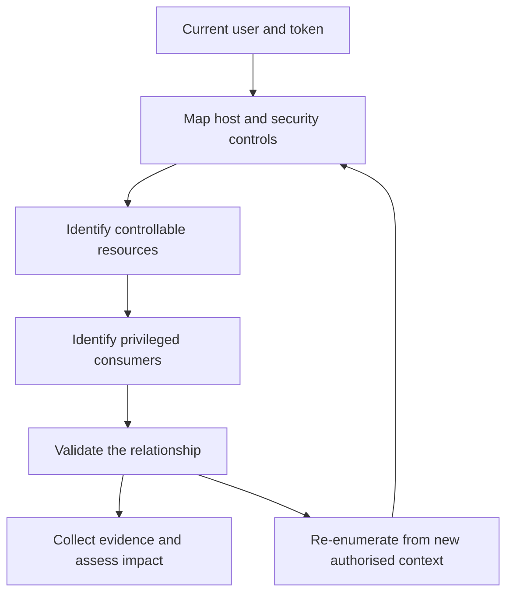
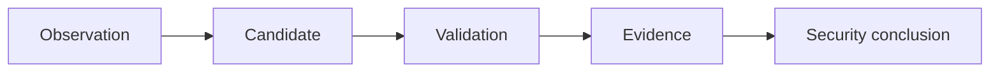

# Windows Security Testing

Windows security testing is not simply a search for outdated software, writable directories or interesting privileges. It is the analysis of relationships between a principal, a controllable resource, a privileged consumer and the security controls that govern the interaction.

A meaningful Windows attack path often follows this model:

```text
Current Principal
       |
       v
Accessible or Controllable Resource
       |
       v
Privileged Consumer or Security Boundary
       |
       v
Controlled Validation
       |
       v
Supported Security Impact
```

The objective is to establish the host context, identify candidate paths, validate them safely and collect enough evidence to reach a defensible security conclusion.

!!! warning "Authorised Security Testing"

    Use these notes only on systems you own or have explicit permission to assess. Prefer read-only enumeration and controlled validation. Confirm the rules of engagement before changing services, tasks, registry values, files, security controls, accounts or production data.

---

## Start Here

<div class="grid cards" markdown>

-   :material-magnify:{ .lg .middle } **Windows Enumeration**

    ---

    Establish the current user, token, operating system, host role, network, users, groups, processes, services and installed software.

    [:octicons-arrow-right-24: Windows Enumeration](enumeration.md)

-   :material-console:{ .lg .middle } **PowerShell**

    ---

    Review the PowerShell execution context, language mode, policy, logging, AMSI-related context and authorised assessment workflows.

    [:octicons-arrow-right-24: PowerShell](powershell.md)

-   :material-cog:{ .lg .middle } **Privileged Execution**

    ---

    Analyse services and scheduled tasks that may consume resources under a higher-privileged identity.

    [:octicons-arrow-right-24: Windows Services](services.md)

-   :material-folder-lock:{ .lg .middle } **Permissions and Configuration**

    ---

    Correlate NTFS and registry permissions with ownership, inheritance, configuration and privileged consumers.

    [:octicons-arrow-right-24: Filesystem Permissions](filesystem-permissions.md)

-   :material-key:{ .lg .middle } **Credential Exposure**

    ---

    Review authorised credential sources in configuration files, scripts, history, deployment artefacts and applications.

    [:octicons-arrow-right-24: Windows Credentials](credentials.md)

-   :material-shield-lock:{ .lg .middle } **Security Controls**

    ---

    Assess Microsoft Defender, ASR, AppLocker, WDAC, UAC, PowerShell controls and Windows Firewall in their effective context.

    [:octicons-arrow-right-24: Application Control](application-control.md)

-   :material-arrow-up-bold-circle:{ .lg .middle } **Privilege Escalation**

    ---

    Combine permissions, execution paths, credentials, privileges and software conditions into validated escalation paths.

    [:octicons-arrow-right-24: Windows Privilege Escalation](privilege-escalation.md)

-   :material-tools:{ .lg .middle } **Tools and Quick Reference**

    ---

    Use focused tools for coverage and prioritisation, then manually validate each candidate condition.

    [:octicons-arrow-right-24: Windows Privilege Escalation Tools](../tools/privilege-escalation/index.md)

</div>

---

# Windows Host Attack-Path Model

The central assessment question is:

> What can the current principal influence that is trusted or consumed by a more privileged security context?

Useful supporting questions are:

- Who is the current user and which token is active?
- Is the account local or domain based?
- Which groups and privileges apply?
- What integrity level is active?
- Which services, tasks, processes and applications run with higher privilege?
- Which files, directories, registry keys or configuration sources do they consume?
- Can the current principal modify any relevant resource?
- Which endpoint controls restrict the action?
- Can the security boundary be crossed safely and reproducibly?



This prevents isolated observations from being reported without showing their security relevance.

---

# Establish the Security Context

Before assessing potential weaknesses, establish the context in which every later observation must be interpreted.

| Context | Why it matters | What follows |
|---|---|---|
| Current user and SID | Identifies the principal being assessed | Correlate the user with groups, rights and object permissions |
| Local or domain identity | Determines whether the path is host-local or connected to AD | Use the [Active Directory methodology](../active-directory/index.md) when domain relationships matter |
| Group membership | May grant local administration or access to protected resources | Verify direct, nested and effective membership |
| Assigned privileges | May enable sensitive operations under specific conditions | Confirm whether the privilege is enabled, usable and relevant |
| Integrity level | Describes the current process trust level | Distinguish filtered administrator tokens from elevated processes |
| UAC state | Affects administrative token use and elevation behaviour | Review [User Account Control](uac.md) in the effective context |
| PowerShell language mode | Describes the current PowerShell capability boundary | Correlate it with application control and policy intent |
| Host role | Workstation, server and administrative host roles carry different risk | Prioritise resources and controls according to business function |
| Domain membership | Connects local access with domain identities and policy | Continue with [Active Directory Enumeration](../active-directory/enumeration.md) where authorised |

Membership in the local Administrators group does not automatically mean that the current process is elevated. A privilege listed in a token is also not automatically exploitable. Context and prerequisites must be validated.

[Open the detailed Windows Enumeration note](enumeration.md)

---

# Practical Assessment Lifecycle

A Windows host assessment should be structured but iterative. New information can change the priority of earlier observations.

| Phase | What to do | What to expect | What it means and what follows |
|---|---|---|---|
| 1. Scope and starting position | Record the authorised host, user, access method, restrictions and evidence requirements | A defined principal and testing context | Select safe enumeration and prohibited actions |
| 2. Identity and token | Review user, SID, groups, privileges, integrity level, UAC and domain context | Effective local and domain security context | Determine which resources and boundaries are relevant |
| 3. System and network mapping | Identify OS, build, architecture, host role, interfaces, routes, listeners, processes and software | A host attack-surface map | Prioritise exposed services, applications and administrative interfaces |
| 4. Security-control review | Assess Defender, ASR, Firewall, AppLocker, WDAC, PowerShell controls and UAC | Effective policy and protection state | Determine which actions are prevented, detected or permitted |
| 5. Privileged execution mapping | Enumerate services, scheduled tasks and startup mechanisms | Higher-privileged consumers and referenced resources | Trace every consumer back to its files, directories, registry values and accounts |
| 6. Permission analysis | Review relevant NTFS, service-object and registry permissions | Candidate controllable resources | Confirm ownership, inheritance and effective rights for the current principal |
| 7. Credential review | Inspect authorised configuration, scripts, history, stores and deployment artefacts | Candidate secrets or authentication material | Establish affected identity, access conditions and actual exposure |
| 8. Path correlation | Connect a controllable resource to a higher-privileged consumer | Candidate attack path | Check prerequisites, controls and alternative explanations |
| 9. Controlled validation | Test the minimum necessary part of the relationship | Confirmed capability or disproved hypothesis | Stop when the security impact is sufficiently demonstrated |
| 10. Evidence and reporting | Preserve the principal, target, permissions, consumer, controls, commands and result | Reproducible evidence | State the supported impact and root cause |
| 11. Remediation and retest | Verify the corrected permissions, configuration or control | Path removed, reduced or still present | Close the finding or document residual risk |

---

# Main Assessment Areas

## System, Network and Process Context

System information is useful only when connected to an applicable condition. An operating-system or application version is not sufficient evidence of vulnerability by itself.

Use this reasoning model:

```text
Version and Architecture
          +
Configuration and Exposure
          +
Applicable Vulnerable Condition
          +
Current Security Context
          +
Controlled Validation
          =
Supported Conclusion
```

Map network interfaces, routes, listeners and active connections to their owning processes. Determine whether a service is locally exposed, remotely reachable, restricted by Windows Firewall or protected by another control.

Continue with:

- [Windows Enumeration](enumeration.md)
- [Networking Cheatsheet](../cheatsheets/networking.md)
- [Windows Cheatsheet](../cheatsheets/windows.md)

## Services and Scheduled Tasks

Services and scheduled tasks are important because they can run automatically under privileged identities while consuming resources from the filesystem or registry.

For each relevant service or task, determine:

- which identity executes it;
- which executable, script, arguments or working directory it uses;
- who controls the service or task definition;
- who can modify the referenced files and parent directories;
- which registry values influence execution;
- whether the trigger or restart condition is realistic;
- which security controls apply;
- whether lower-privileged influence can produce higher-privileged behaviour.

Route into:

- [Windows Services](services.md)
- [Scheduled Tasks](scheduled-tasks.md)

A service running as LocalSystem or a task configured with the highest privileges is not automatically vulnerable. The lower-privileged principal must be able to influence a resource that the privileged component actually consumes.

## Filesystem and Registry Permissions

Writable does not automatically mean vulnerable. Permission analysis must identify the principal, exact effective right, inheritance, affected resource and privileged consumer.

```text
Current Principal
       |
       v
Effective Modify or Control Right
       |
       v
Security-Relevant File, Directory or Registry Value
       |
       v
Privileged Process Consumes the Resource
       |
       v
Validated Security Impact
```

Review both the direct resource and its surrounding context. A protected executable may still rely on a writable parent directory, configuration file, library location or registry value. Conversely, a writable directory with no privileged consumer may have little security impact.

Continue with:

- [Filesystem Permissions](filesystem-permissions.md)
- [Registry Security](registry.md)

## Credential Exposure

Credential review should be targeted, authorised and proportional. Potential sources include application configuration, scripts, deployment artefacts, unattended installation data, PowerShell history and other approved credential stores.

For each candidate, establish:

- who can read it;
- whether it contains real authentication material or only an example;
- which identity and system it affects;
- whether it is current, protected or otherwise constrained;
- what access it would provide;
- whether use of the credential is authorised and necessary to validate impact.

Do not collect unrelated secrets or expose sensitive values unnecessarily in evidence.

[Open Windows Credentials](credentials.md)

## PowerShell Security Context

PowerShell is both an administration platform and a useful source of security context. Assess:

- version and host process;
- language mode;
- execution policy;
- script-block, module and transcription logging;
- AMSI-related protection context;
- application-control integration;
- available modules and remoting configuration;
- the difference between configuration state and enforced security boundary.

Execution policy is not a security boundary by itself. FullLanguage mode is not automatically a vulnerability, and ConstrainedLanguage mode should be interpreted alongside the control responsible for enforcing it.

Continue with:

- [PowerShell](powershell.md)
- [PowerShell Cheatsheet](../cheatsheets/powershell.md)

## Microsoft Defender, ASR and Windows Firewall

Endpoint-control assessment should determine what is enabled, what is enforced and what is observable from the current context.

Review:

- Microsoft Defender service and protection state;
- real-time, behaviour and cloud-delivered protection;
- tamper protection visibility;
- relevant exclusions;
- Attack Surface Reduction rules and modes;
- endpoint telemetry and alerting where in scope;
- Windows Firewall profiles and relevant inbound and outbound rules;
- whether another security product is the primary control.

A disabled feature, inaccessible management interface or missing command output requires context. It may reflect product design, permissions, centralised management or another control rather than a security weakness.

[Open Microsoft Defender](defender.md)

## Application Control

Application control should be assessed from the effective policy and the current principal's perspective.

Important areas include:

- AppLocker rule collections and enforcement modes;
- Windows Defender Application Control or App Control for Business;
- executable, DLL, script, MSI and packaged-app coverage;
- publisher, path and hash rules;
- default-deny behaviour;
- exceptions and user or group scope;
- writable locations trusted by path-based rules;
- policy dependencies such as Application Identity;
- the actual result of safe execution tests.

An allowed Microsoft binary, a broad-looking rule or an unconfigured rule collection is not automatically a finding. Determine the policy objective, applicable principal, trusted path, file type, effective decision and resulting security impact.

[Open Application Control](application-control.md)

## User Account Control

UAC affects the relationship between administrative group membership, process integrity and elevation.

Assess:

- whether the user belongs to a local administrative group;
- whether the current process uses a filtered or elevated token;
- integrity level;
- Admin Approval Mode;
- consent-prompt behaviour;
- secure-desktop configuration;
- installer detection and related policy;
- whether the observed behaviour crosses an intended security boundary.

Do not report ordinary UAC behaviour as privilege escalation without demonstrating a meaningful boundary crossing in the assessed configuration.

[Open User Account Control](uac.md)

## Privilege Escalation

Privilege escalation is the correlation layer for the Windows section. It combines identities, privileges, services, tasks, files, directories, registry settings, credentials, applications and endpoint controls.

Common candidate relationships include:

```text
Lower-Privileged Principal
          |
          +----> Service configuration
          +----> Service executable or directory
          +----> Scheduled-task resource
          +----> Startup resource
          +----> Registry configuration
          +----> Credential material
          +----> Assigned Windows privilege
          +----> Vulnerable privileged software
          |
          v
Higher-Privileged Consumer
          |
          v
Controlled Validation
```

Continue with:

- [Windows Privilege Escalation](privilege-escalation.md)
- [Windows PrivEsc Explorer](../privesc/windows.md)
- [Windows Privilege Escalation Tools](../tools/privilege-escalation/index.md)

---

# Manual and Automated Assessment

Manual analysis and automated enumeration serve different purposes.

| Approach | Purpose | Limitation |
|---|---|---|
| Manual enumeration | Understand identity, configuration, controls and relationships | May miss conditions without a structured process |
| Automated enumeration | Increase coverage and highlight unusual conditions | Produces candidates and false positives |
| Manual validation | Confirm permissions, prerequisites, consumers and impact | Must remain safe and within scope |
| PrivEsc Explorer | Organise host-level investigation and follow-up | Does not replace evidence from the target |

Useful tool notes include:

- [WinPEAS](../tools/privilege-escalation/winpeas.md)
- [PowerUp](../tools/privilege-escalation/powerup.md)
- [PrivescCheck](../tools/privilege-escalation/privesccheck.md)

Tools such as Sysinternals Autoruns, Process Explorer, Process Monitor, AccessChk, TCPView and Sigcheck can also support focused analysis. Tool output should be treated as a lead until the relevant relationship is manually verified.

---

# From Observation to Security Conclusion

Use the same evidence model for every potential issue:



| Observation | Candidate | Required validation | Supported conclusion |
|---|---|---|---|
| A directory is writable | A privileged component may consume modifiable content | Identify relevant files, effective rights, consumer, identity and execution condition | The directory enables a specific privileged influence path or has no demonstrated impact |
| A service runs as LocalSystem | Its configuration or resources may create an escalation path | Verify service control rights, binary path, arguments, ACLs and restart conditions | A lower-privileged principal can or cannot influence privileged service execution |
| A scheduled task runs with highest privileges | Referenced resources may be controllable | Verify the task principal, action, arguments, triggers and resource permissions | The task creates a usable path or remains protected |
| A Windows privilege is assigned | The privilege may enable a sensitive operation | Confirm token state, required target, restrictions and boundary crossed | The privilege has defined impact or is not usable in the current context |
| An AppLocker path rule allows a location | A user-writable trusted path may weaken control | Confirm effective policy, principal, file type, path writability and safe execution result | Application control can be bypassed in a defined way or the candidate is mitigated |
| Defender reports an exclusion | The exclusion may reduce inspection for a relevant path or process | Confirm exact scope, accessibility, primary control and authorised test result | The exclusion creates a specific detection or prevention gap |
| Software appears outdated | A known weakness may apply | Confirm version, configuration, exposure, vulnerable function and safe reproducibility | A specific vulnerability applies or version evidence alone is insufficient |

If validation disproves the candidate, record that result. A disproved hypothesis is useful assessment evidence and should not be forced into a finding.

---

# False Positives and Alternative Explanations

Common misleading observations include:

- a writable directory with no privileged consumer;
- a privileged service whose configuration and resources are protected;
- a scheduled task running as SYSTEM with non-writable referenced resources;
- an administrator account operating with a filtered medium-integrity token;
- FullLanguage PowerShell where ConstrainedLanguage is not an intended control;
- an AppLocker allow rule that is deliberate and does not expose a controllable path;
- a policy interface unavailable to a non-administrator even though policy is enforced;
- an old version where the vulnerable component, configuration or exposure is absent;
- an interesting privilege without a relevant target or usable execution context;
- an automated warning based on incomplete ACL or policy interpretation.

Before reporting, ask:

1. Does the condition apply to the current principal?
2. Can the relevant resource actually be reached or modified?
3. Does a more privileged component consume it?
4. Which controls affect the action?
5. Is the behaviour intentional or required?
6. Can the impact be reproduced safely?

---

# Evidence Collection

For each validated Windows path, record:

- hostname, operating-system version and host role;
- current user, SID, groups, privileges and integrity level;
- affected object and object owner;
- relevant effective permissions and inheritance;
- service, task, process or application consuming the object;
- consumer identity and execution conditions;
- relevant Defender, ASR, Firewall, AppLocker, WDAC, PowerShell and UAC state;
- exact commands or actions used;
- timestamps and relevant output;
- access level before and after validation;
- security impact actually demonstrated;
- cleanup performed;
- remediation and retest criteria.

Evidence should show the complete relationship:

```text
Current Principal
       |
       v
Effective Control
       |
       v
Affected Resource
       |
       v
Privileged Consumer
       |
       v
Validated Impact
```

A screenshot of one ACL entry or one automated-tool warning is rarely sufficient on its own.

---

# Detection and Remediation

Remediation should break the validated relationship rather than only block the proof used during testing.

Common defensive themes include:

- apply least privilege to users, groups and service accounts;
- restrict local administrator membership;
- protect service and scheduled-task definitions and resources;
- remove unnecessary write access from privileged files, directories and registry keys;
- protect application, deployment and credential material;
- use supported software and remove unnecessary services or applications;
- configure Microsoft Defender, ASR and tamper protection according to organisational requirements;
- deploy appropriately scoped application-control policies;
- remove user-writable directories from trusted path rules;
- configure PowerShell logging and application-control integration;
- restrict remote administration and unnecessary network exposure;
- maintain Windows Firewall rules based on required communication paths;
- centralise endpoint, authentication, PowerShell and process telemetry;
- investigate unexpected privileged process creation or configuration changes;
- retest the original condition under the same principal and execution context.

A control is effective when it prevents or detects the relevant attack path under equivalent conditions, not merely when one command or tool behaves differently.

---

# Suggested Reading Routes

## Complete Host Assessment

1. [Windows Enumeration](enumeration.md)
2. [PowerShell](powershell.md)
3. [Windows Services](services.md)
4. [Scheduled Tasks](scheduled-tasks.md)
5. [Filesystem Permissions](filesystem-permissions.md)
6. [Registry Security](registry.md)
7. [Windows Credentials](credentials.md)
8. [Application Control](application-control.md)
9. [Microsoft Defender](defender.md)
10. [User Account Control](uac.md)
11. [Windows Privilege Escalation](privilege-escalation.md)

## Reviewing Privileged Execution Paths

1. [Windows Services](services.md)
2. [Scheduled Tasks](scheduled-tasks.md)
3. [Filesystem Permissions](filesystem-permissions.md)
4. [Registry Security](registry.md)
5. [Windows Privilege Escalation](privilege-escalation.md)

## Reviewing Endpoint Controls

1. [Microsoft Defender](defender.md)
2. [Application Control](application-control.md)
3. [PowerShell](powershell.md)
4. [User Account Control](uac.md)
5. Reassess candidate execution paths against the combined control set

## Domain-Joined Host

1. Complete the relevant [Windows Enumeration](enumeration.md)
2. Establish the local and domain identities separately
3. Continue with [Active Directory](../active-directory/index.md)
4. Use [Active Directory Enumeration](../active-directory/enumeration.md) for domain relationships
5. Correlate local administrative access with domain sessions, credentials and trust

## Need Commands Quickly?

- [Windows Cheatsheet](../cheatsheets/windows.md)
- [PowerShell Cheatsheet](../cheatsheets/powershell.md)
- [Networking Cheatsheet](../cheatsheets/networking.md)

---

# References

- [Microsoft Windows documentation](https://learn.microsoft.com/en-us/windows/){ target="_blank" rel="noopener noreferrer" }
- [Microsoft Windows security documentation](https://learn.microsoft.com/en-us/windows/security/){ target="_blank" rel="noopener noreferrer" }
- [Microsoft Sysinternals](https://learn.microsoft.com/en-us/sysinternals/){ target="_blank" rel="noopener noreferrer" }
- [Microsoft Defender for Endpoint documentation](https://learn.microsoft.com/en-us/defender-endpoint/){ target="_blank" rel="noopener noreferrer" }
- [Microsoft - User Account Control](https://learn.microsoft.com/en-us/windows/security/application-security/application-control/user-account-control/){ target="_blank" rel="noopener noreferrer" }
- [Microsoft - AppLocker](https://learn.microsoft.com/en-us/windows/security/application-security/application-control/app-control-for-business/applocker/applocker-overview){ target="_blank" rel="noopener noreferrer" }
- [Microsoft - App Control for Business](https://learn.microsoft.com/en-us/windows/security/application-security/application-control/app-control-for-business/){ target="_blank" rel="noopener noreferrer" }
- [MITRE ATT&CK - Enterprise matrix](https://attack.mitre.org/matrices/enterprise/){ target="_blank" rel="noopener noreferrer" }
- [GhostPack - Seatbelt](https://github.com/GhostPack/Seatbelt){ target="_blank" rel="noopener noreferrer" }
- [GhostPack - SharpUp](https://github.com/GhostPack/SharpUp){ target="_blank" rel="noopener noreferrer" }
- [PrivescCheck](https://github.com/itm4n/PrivescCheck){ target="_blank" rel="noopener noreferrer" }
- [PEASS-ng](https://github.com/peass-ng/PEASS-ng){ target="_blank" rel="noopener noreferrer" }

---

# Final Model

```text
Scope and Starting Context
          |
          v
Identity, Token and Host Mapping
          |
          v
Security-Control Review
          |
          v
Privileged Consumer Mapping
          |
          v
Permission and Credential Analysis
          |
          v
Candidate Attack Path
          |
          v
Controlled Validation
          |
          v
Evidence and Security Conclusion
          |
          v
Detection, Remediation and Retest
```

The strongest Windows finding demonstrates the complete relationship between a lower-privileged principal, a controllable resource, a higher-privileged consumer and a realistic security impact. The finding should also identify where defenders can break, detect and retest that relationship.
