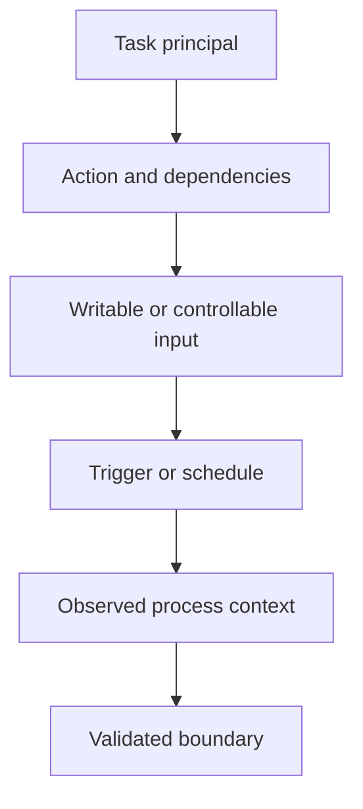

# Windows Scheduled Tasks

Windows Task Scheduler provides a mechanism for executing programs, scripts and system actions automatically based on configured triggers.

Scheduled tasks are commonly used for:

```text
System maintenance
Software updates
Backup operations
Administrative scripts
Monitoring
Log rotation
Application maintenance
User logon actions
Security tooling
```

From a security assessment perspective, scheduled tasks are important because they may execute with privileges different from those of the current user.

A task running as:

```text
SYSTEM
```

or another privileged account can become a privilege escalation path when an unprivileged user can modify something that influences what the task executes.

!!! warning "Authorised Security Testing"

    Perform scheduled task testing only on systems included in the authorised assessment scope. Prefer permission inspection and controlled proof files over modifying production tasks. Do not replace legitimate executables, scripts or task definitions unless the engagement explicitly permits it and the operational impact is understood.


# Security Model

The important relationship is:

```text
Scheduled Task
      |
      v
Security Context
      |
      v
Action
      |
      v
Executable / Script
      |
      v
Supporting Files
      |
      v
Directory Permissions
```

A privileged scheduled task is not a vulnerability by itself.

The security question is:

```text
Can a lower-privileged user influence
what the privileged task executes?
```


# Privilege Escalation Model

```text
Low-Privilege User
        |
        v
Writable Task Dependency
        |
        v
Privileged Scheduled Task
        |
        v
Task Executes Dependency
        |
        v
Higher-Privilege Execution
```

A defensible finding therefore normally requires several conditions:

```text
Privileged execution context
+
Attacker-controlled dependency
+
Task execution path
+
Demonstrable security impact
```


# Task Scheduler Components

Windows Task Scheduler consists of several relevant components:

```text
Task Scheduler service

Task definitions

Triggers

Actions

Principals

Settings

Task folders

Task files
```


# Task Scheduler Service

The service is:

```text
Schedule
```

Check it with:

```powershell
Get-Service Schedule
```

Example:

```text
Status   Name      DisplayName
------   ----      -----------
Running  Schedule  Task Scheduler
```


# Task Definitions

Scheduled tasks are logically organized under:

```text
\
```

and may appear in folders such as:

```text
\Microsoft\Windows\
\Company\
\Maintenance\
\Backup\
```


# Task Files

Task definitions are normally stored under:

```text
C:\Windows\System32\Tasks
```

Do not assume direct filesystem write access to these files merely because the tasks can be enumerated.


# Core Task Properties

For each interesting task, identify:

```text
Task name

Task path

State

Principal

Run level

Logon type

Trigger

Action

Executable

Arguments

Working directory

Last run time

Next run time

Last result
```


# Initial Enumeration

Start with the built-in PowerShell cmdlets.

```powershell
Get-ScheduledTask
```


# Compact View

```powershell
Get-ScheduledTask | Select-Object TaskPath,TaskName,State
```


# Sort by Path

```powershell
Get-ScheduledTask | Sort-Object TaskPath,TaskName | Select-Object TaskPath,TaskName,State
```


# Enabled Tasks

```powershell
Get-ScheduledTask | Where-Object State -ne 'Disabled' | Select-Object TaskPath,TaskName,State
```


# Running Tasks

```powershell
Get-ScheduledTask | Where-Object State -eq 'Running' | Select-Object TaskPath,TaskName
```


# Task Details

For a specific task:

```powershell
Get-ScheduledTask -TaskName 'ExampleTask' | Format-List *
```


# Task Information

Runtime information can be retrieved using:

```powershell
Get-ScheduledTaskInfo -TaskName 'ExampleTask'
```


# Representative Output

```text
LastRunTime        : 07/09/2026 20:00:00
LastTaskResult     : 0
NextRunTime        : 07/09/2026 21:00:00
NumberOfMissedRuns : 0
TaskName           : ExampleTask
TaskPath           : \
```


# Interpretation

Useful fields include:

| Field | Meaning |
|---|---|
| `LastRunTime` | Most recent execution |
| `LastTaskResult` | Result code from last execution |
| `NextRunTime` | Next expected execution |
| `NumberOfMissedRuns` | Missed scheduled executions |


# Task Actions

The action is one of the most important properties.

```powershell
Get-ScheduledTask | ForEach-Object {
    $task = $_
    foreach ($action in $task.Actions) {
        [PSCustomObject]@{
            TaskPath         = $task.TaskPath
            TaskName         = $task.TaskName
            Execute          = $action.Execute
            Arguments        = $action.Arguments
            WorkingDirectory = $action.WorkingDirectory
        }
    }
}
```


# Compact One-Liner

```powershell
Get-ScheduledTask | ForEach-Object { $t=$_; foreach($a in $t.Actions){ [PSCustomObject]@{TaskPath=$t.TaskPath;TaskName=$t.TaskName;Execute=$a.Execute;Arguments=$a.Arguments;WorkingDirectory=$a.WorkingDirectory} } }
```


# Why Actions Matter

An action may execute:

```text
Executable

PowerShell script

Batch file

VBScript

JavaScript

Administrative utility

Application updater

Backup script
```


# Example

```text
TaskName         : BackupJob
Execute          : powershell.exe
Arguments        : -File C:\ProgramData\Company\backup.ps1
WorkingDirectory : C:\ProgramData\Company
```

The important security question becomes:

```text
Can the current user modify backup.ps1?
```


# Task Principals

Enumerate the configured execution identity.

```powershell
Get-ScheduledTask | ForEach-Object {
    [PSCustomObject]@{
        TaskPath = $_.TaskPath
        TaskName = $_.TaskName
        UserId   = $_.Principal.UserId
        RunLevel = $_.Principal.RunLevel
        LogonType = $_.Principal.LogonType
    }
}
```


# Compact One-Liner

```powershell
Get-ScheduledTask | ForEach-Object { [PSCustomObject]@{TaskPath=$_.TaskPath;TaskName=$_.TaskName;UserId=$_.Principal.UserId;RunLevel=$_.Principal.RunLevel;LogonType=$_.Principal.LogonType} }
```


# Interesting Principals

Pay particular attention to:

```text
SYSTEM

Administrators

Administrator

Service accounts

Backup accounts

Deployment accounts

Privileged domain accounts
```


# SYSTEM Tasks

Filter tasks configured for SYSTEM:

```powershell
Get-ScheduledTask | Where-Object { $_.Principal.UserId -match 'SYSTEM' } | Select-Object TaskPath,TaskName,State
```


# Highest Run Level

```powershell
Get-ScheduledTask | Where-Object { $_.Principal.RunLevel -eq 'Highest' } | Select-Object TaskPath,TaskName,@{N='User';E={$_.Principal.UserId}},@{N='RunLevel';E={$_.Principal.RunLevel}}
```


# Important

A task configured as:

```text
SYSTEM
```

or:

```text
RunLevel = Highest
```

is not automatically vulnerable.

It only becomes security-relevant when a lower-privileged user can control a task dependency or task configuration.


# Triggers

Triggers determine when the task executes.

```powershell
Get-ScheduledTask | ForEach-Object {
    $task = $_

    foreach ($trigger in $task.Triggers) {
        [PSCustomObject]@{
            TaskPath = $task.TaskPath
            TaskName = $task.TaskName
            Trigger  = $trigger.CimClass.CimClassName
            Enabled  = $trigger.Enabled
        }
    }
}
```


# Common Trigger Types

Examples include:

```text
Time trigger

Daily trigger

Weekly trigger

Boot trigger

Logon trigger

Event trigger

Registration trigger

Idle trigger
```


# Security Relevance

A vulnerable task triggered:

```text
Every minute
```

may provide a much easier privilege escalation path than one triggered:

```text
Once per month
```

However, frequency affects exploitability rather than determining whether the underlying permissions are insecure.


# schtasks.exe

Windows also provides:

```text
schtasks.exe
```


# List Tasks

```cmd
schtasks /query
```


# Verbose Output

```cmd
schtasks /query /fo LIST /v
```


# CSV Output

```cmd
schtasks /query /fo CSV /v
```


# Specific Task

```cmd
schtasks /query /tn "\ExampleTask" /fo LIST /v
```


# Useful Fields

Look for:

```text
TaskName

Next Run Time

Status

Logon Mode

Last Run Time

Last Result

Author

Task To Run

Start In

Run As User

Schedule Type
```


# Representative Output

```text
TaskName:                             \BackupJob
Status:                               Ready
Task To Run:                          powershell.exe -File C:\ProgramData\Company\backup.ps1
Run As User:                          SYSTEM
Schedule Type:                        Daily
```


# Interpretation

This tells us:

```text
Privileged principal:
SYSTEM

Dependency:
C:\ProgramData\Company\backup.ps1
```

The next step is not to modify the script.

The next step is:

```text
Inspect permissions.
```


# XML Task Definitions

Scheduled tasks can be represented as XML.

Export a task:

```cmd
schtasks /query /tn "\ExampleTask" /xml
```


# PowerShell

```powershell
Export-ScheduledTask -TaskName 'ExampleTask'
```


# XML Components

Relevant XML elements may include:

```xml
<Principals>
<Triggers>
<Actions>
<Exec>
<Command>
<Arguments>
<WorkingDirectory>
```


# Example

```xml
<Actions Context="Author">
  <Exec>
    <Command>powershell.exe</Command>
    <Arguments>-File C:\ProgramData\Company\backup.ps1</Arguments>
  </Exec>
</Actions>
```


# Why XML Helps

XML can expose configuration details that are difficult to interpret from compact command output.


# Enumerating Non-Microsoft Tasks

Windows contains many legitimate Microsoft tasks.

During assessments, custom tasks are often higher-value review targets.

```powershell
Get-ScheduledTask | Where-Object { $_.TaskPath -notlike '\Microsoft\*' } | Select-Object TaskPath,TaskName,State
```


# Why

Custom tasks are more likely to reference:

```text
Custom scripts

Application directories

ProgramData

Vendor software

Deployment tooling

Backup locations

Temporary paths
```


# Do Not Ignore Microsoft Paths Completely

Third-party software or administrators may still create unusual tasks under other locations.

Use filtering for prioritization, not as a security boundary.


# Find PowerShell Actions

```powershell
Get-ScheduledTask | Where-Object {
    $_.Actions.Execute -match 'powershell'
} | Select-Object TaskPath,TaskName,@{N='Execute';E={$_.Actions.Execute}},@{N='Arguments';E={$_.Actions.Arguments}}
```


# Find Script References

```powershell
Get-ScheduledTask | Where-Object {
    $_.Actions.Arguments -match '\.(ps1|bat|cmd|vbs|js)'
} | Select-Object TaskPath,TaskName,@{N='Arguments';E={$_.Actions.Arguments}}
```


# Find ProgramData References

```powershell
Get-ScheduledTask | Where-Object {
    $_.Actions.Execute -match 'ProgramData' -or
    $_.Actions.Arguments -match 'ProgramData'
} | Select-Object TaskPath,TaskName,@{N='Execute';E={$_.Actions.Execute}},@{N='Arguments';E={$_.Actions.Arguments}}
```


# Find Temp References

```powershell
Get-ScheduledTask | Where-Object {
    $_.Actions.Execute -match '\\Temp\\' -or
    $_.Actions.Arguments -match '\\Temp\\'
} | Select-Object TaskPath,TaskName,@{N='Execute';E={$_.Actions.Execute}},@{N='Arguments';E={$_.Actions.Arguments}}
```


# High-Value Paths

Pay attention to dependencies under:

```text
C:\ProgramData\

C:\Users\Public\

C:\Temp\

C:\Windows\Temp\

User profile directories

Application data directories

Custom installation directories
```


# Important

Location alone does not prove writability.

Always inspect the ACL.


# File Permission Review

For a referenced file:

```powershell
Get-Acl -LiteralPath 'C:\ProgramData\Company\backup.ps1' | Format-List Owner,AccessToString
```


# icacls

```cmd
icacls "C:\ProgramData\Company\backup.ps1"
```


# Example

```text
BUILTIN\Administrators:(F)
NT AUTHORITY\SYSTEM:(F)
BUILTIN\Users:(M)
```


# Interpretation

If:

```text
BUILTIN\Users
```

has:

```text
Modify
```

on a script executed by SYSTEM, this may create a privilege boundary violation.


# Common Permission Abbreviations

`icacls` commonly displays:

| Permission | Meaning |
|---|---|
| `F` | Full control |
| `M` | Modify |
| `RX` | Read and execute |
| `R` | Read |
| `W` | Write |


# Directory Permission Review

Even if the target file itself appears protected, inspect the parent directory.

```powershell
Get-Acl -LiteralPath 'C:\ProgramData\Company' | Format-List Owner,AccessToString
```


# icacls

```cmd
icacls "C:\ProgramData\Company"
```


# Why Parent Directories Matter

A user may not be able to directly modify:

```text
backup.ps1
```

but may have directory permissions allowing:

```text
Create files

Delete files

Rename files

Replace files
```


# File vs Directory Permissions

Evaluate both:

```text
Target file ACL

Parent directory ACL
```


# Effective Access

ACL output should be interpreted in the context of the current identity.


# Current Identity

```cmd
whoami
```


# Groups

```cmd
whoami /groups
```


# Privileges

```cmd
whoami /priv
```


# PowerShell Identity

```powershell
[System.Security.Principal.WindowsIdentity]::GetCurrent().Name
```


# Writable Dependency Model

```text
Task
 |
 v
Runs as SYSTEM
 |
 v
Executes backup.ps1
 |
 v
backup.ps1 ACL
 |
 +--> Users Read Only
 |        |
 |        v
 |      Safe from this path
 |
 +--> Users Modify
          |
          v
     Potential PrivEsc
```


# Safe Write Validation

Permission output can sometimes be complicated by:

```text
Inheritance

Deny ACEs

Group membership

Integrity levels

Application control

Filesystem virtualization
```

If the engagement permits a non-destructive write test, use a separate probe file rather than modifying the production dependency.


# Example Directory Write Test

```powershell
$path = 'C:\ProgramData\Company'
$probe = Join-Path $path "write-test-$PID.tmp"

try {
    'test' | Set-Content -LiteralPath $probe -ErrorAction Stop
    Write-Host '[+] Directory is writable'
    Remove-Item -LiteralPath $probe -Force -ErrorAction SilentlyContinue
}
catch {
    Write-Host '[-] Directory write test failed'
}
```


# Important

Creating a harmless temporary file proves:

```text
Directory write capability
```

but does not automatically prove:

```text
Ability to replace the scheduled task dependency
```

Further ACL analysis may still be required.


# Executable Dependencies

A task may execute:

```text
C:\Program Files\Vendor\App\updater.exe
```


# Check File

```cmd
icacls "C:\Program Files\Vendor\App\updater.exe"
```


# Check Directory

```cmd
icacls "C:\Program Files\Vendor\App"
```


# Expected Secure Configuration

Ordinary users should generally not have modification rights over executables launched by privileged tasks.


# Script Dependencies

Common examples:

```text
.ps1

.bat

.cmd

.vbs

.js

.py
```


# Example

```text
powershell.exe -File C:\Scripts\maintenance.ps1
```


# Review

```cmd
icacls "C:\Scripts\maintenance.ps1"
icacls "C:\Scripts"
```


# Interpreter Security

When a task launches an interpreter, review both:

```text
Interpreter

Script
```


# Example

```text
powershell.exe -File backup.ps1
```

The primary controllable dependency may be:

```text
backup.ps1
```

rather than:

```text
powershell.exe
```


# Relative Paths

Relative paths deserve additional review.

Example:

```text
Execute:
backup.exe
```

rather than:

```text
C:\Program Files\Company\backup.exe
```


# Security Question

How does Windows resolve the executable?


# Review

```text
Working directory

PATH

Application search behaviour

Task configuration
```


# Working Directory

Example:

```text
WorkingDirectory:
C:\ProgramData\Company
```


# Relative Script Paths

Example:

```text
powershell.exe -File .\backup.ps1
```


# Security Relevance

The task's working directory becomes important when resolving the script.


# Environment Variables

Task actions may reference:

```text
%ProgramData%

%TEMP%

%USERPROFILE%

%APPDATA%

%PATH%
```


# Example

```text
%ProgramData%\Company\backup.exe
```


# Expand Variables

In PowerShell:

```powershell
[Environment]::ExpandEnvironmentVariables('%ProgramData%\Company\backup.exe')
```


# Environment Differences

Remember that a task running as:

```text
SYSTEM
```

may have different environment values from the current user.


# Quoting

Review paths containing spaces.

Example:

```text
C:\Program Files\Company App\updater.exe
```


# Important

Do not automatically treat an unquoted scheduled task command as equivalent to an unquoted Windows service path vulnerability.

Task Scheduler stores the executable and arguments as structured action fields in many configurations.

Inspect the actual task action before drawing conclusions.


# Action Separation

PowerShell helps show this distinction:

```powershell
$task = Get-ScheduledTask -TaskName 'ExampleTask'
$task.Actions | Format-List Execute,Arguments,WorkingDirectory
```


# Shell Invocation

Different reasoning applies if the task explicitly invokes:

```text
cmd.exe /c ...

powershell.exe ...

wscript.exe ...

cscript.exe ...
```


# Example

```text
cmd.exe /c C:\ProgramData\Company\maintenance.cmd
```


# Review

The security dependency includes:

```text
maintenance.cmd
```

and any files that script subsequently executes.


# Dependency Chains

A task may execute:

```text
Task
 |
 v
backup.ps1
 |
 v
helper.exe
 |
 v
config.json
```


# Review the Entire Chain

Do not stop at the first script.

Inspect whether it loads:

```text
Executables

DLLs

Modules

Configuration files

Scripts

Templates

Plugins

Writable data interpreted as code
```


# PowerShell Script Review

For a task executing:

```text
maintenance.ps1
```

inspect the script:

```powershell
Get-Content -LiteralPath 'C:\ProgramData\Company\maintenance.ps1'
```


# Look For

```text
Invoke-Expression

Start-Process

& operator

Import-Module

Dot sourcing

Relative paths

Environment variables

External executables

Configuration imports
```


# Example Dependency

```powershell
& '.\helper.exe'
```


# Security Question

Can the current user replace:

```text
helper.exe
```

or influence how it is resolved?


# Batch Files

Inspect:

```cmd
type C:\ProgramData\Company\backup.cmd
```


# Look For

```text
Relative executable names

CALL statements

Other scripts

Writable configuration

Environment-variable expansion

Network paths
```


# Network Paths

A scheduled task may execute content from:

```text
\\server\share\script.ps1
```


# Review

```text
Share permissions

NTFS permissions

Authentication

Availability

Who can modify the remote file?
```


# Security Boundary

A SYSTEM task executing a script from a network share can be dangerous if unprivileged users can modify that share.


# UNC Path Example

```text
\\fileserver\automation\maintenance.ps1
```


# Test Share Access

```powershell
Get-Item '\\fileserver\automation\maintenance.ps1'
```


# Review ACL Where Accessible

```powershell
Get-Acl '\\fileserver\automation\maintenance.ps1' | Format-List Owner,AccessToString
```


# Task Credentials

Scheduled tasks may run under:

```text
SYSTEM

Service accounts

Domain accounts

User accounts
```


# Important

Do not attempt to extract stored scheduled-task credentials merely because a task uses a privileged account.

Focus on whether the task configuration or dependencies expose an authorized security weakness.


# Logon Types

Task principals may use different logon types.

Examples include:

```text
InteractiveToken

Password

S4U

ServiceAccount
```


# Enumerate

```powershell
Get-ScheduledTask | Select-Object TaskName,@{N='User';E={$_.Principal.UserId}},@{N='LogonType';E={$_.Principal.LogonType}}
```


# Run Whether User Is Logged On

Tasks may be configured to execute independently of an interactive user session.

This can increase the reliability of a privilege escalation path if a vulnerable dependency exists.


# Boot Tasks

Tasks triggered at startup may execute before normal user interaction.


# Security Relevance

A writable dependency used by a boot-triggered SYSTEM task may create persistent privileged execution after restart.


# Do Not Restart Production Systems

Never reboot a production system solely to trigger a task unless the engagement explicitly permits it.


# Logon Tasks

Tasks may execute:

```text
At logon
```

for specific users or groups.


# Review

Determine:

```text
Which user's logon?

Which execution principal?

Which action?
```


# Event-Based Tasks

Tasks may trigger from Windows Event Log events.


# Review

```text
Event log

Provider

Event ID

Filter

Frequency
```


# Security Question

Can an unprivileged user legitimately generate the triggering event?

Even if yes, this is only relevant when the task executes something the user can improperly influence.


# Manual Task Execution

A user may have permission to start a task manually.

Example:

```cmd
schtasks /run /tn "\ExampleTask"
```


# Important

Being able to start a privileged task is not necessarily a vulnerability.

If the task performs a fixed, safe privileged operation, manual execution may be intentionally permitted.


# Security Question

Can the user:

```text
Modify what the task executes
```

or:

```text
Abuse the fixed privileged action
```

to cross a security boundary?


# Task Modification

Task security descriptors determine who can modify task definitions.


# Safe Approach

Prefer inspection rather than changing a task during discovery.


# Export Definition

```cmd
schtasks /query /tn "\ExampleTask" /xml
```


# Task File ACL

Where permitted:

```cmd
icacls "C:\Windows\System32\Tasks\ExampleTask"
```


# Important

Direct filesystem permissions are not the only relevant authorization layer.

Task Scheduler also applies task security semantics through its APIs and service.


# Existing Task Update Rights

If a lower-privileged user can legitimately modify a task that executes as a more privileged principal, investigate carefully.

The finding should demonstrate the actual permitted modification path rather than relying only on assumptions from task-file ACLs.


# User-Created Tasks

Not every scheduled task is privileged.

Example:

```text
Run As User:
DOMAIN\StandardUser
```

If the current user already controls that identity, modifying its task generally does not create privilege escalation.


# Compare Privileges

```text
Current User
     |
     v
Task Principal
     |
     v
Higher Privilege?
```

If:

```text
No
```

then it may not represent a privilege escalation path.


# Task Scheduler GUI

The graphical interface is available through:

```text
taskschd.msc
```


# Useful GUI Areas

Review:

```text
Task Scheduler Library

Triggers

Actions

Conditions

Settings

History

Security options
```


# Task History

Task history can help determine:

```text
Whether task executes

How frequently

Whether it succeeds

Whether the dependency is active
```


# Event Logs

Task Scheduler operational events are available under:

```text
Microsoft-Windows-TaskScheduler/Operational
```


# PowerShell Event Log Query

```powershell
Get-WinEvent -LogName 'Microsoft-Windows-TaskScheduler/Operational' -ErrorAction SilentlyContinue | Select-Object -First 30 TimeCreated,Id,LevelDisplayName,Message
```


# Filter by Task Name

```powershell
Get-WinEvent -LogName 'Microsoft-Windows-TaskScheduler/Operational' -ErrorAction SilentlyContinue | Where-Object Message -match 'ExampleTask' | Select-Object TimeCreated,Id,Message
```


# Why History Matters

A task definition may exist but:

```text
Never run

Be disabled

Consistently fail

Reference removed software
```

This affects exploitability and severity.


# Last Result

Retrieve:

```powershell
Get-ScheduledTaskInfo -TaskName 'ExampleTask'
```


# Success Code

A last result of:

```text
0
```

commonly indicates successful task execution.


# Do Not Rely on Last Result Alone

Verify:

```text
Actual action

Current task configuration

Relevant event history
```


# Disabled Tasks

Disabled tasks can still be security-relevant as latent configuration, but they generally do not provide immediate scheduled execution.


# Report Carefully

Distinguish:

```text
Active exploitable path
```

from:

```text
Dormant insecure configuration
```


# Missing Dependencies

A task may reference a file that no longer exists.

Example:

```text
C:\ProgramData\OldVendor\update.exe
```


# Check

```powershell
Test-Path -LiteralPath 'C:\ProgramData\OldVendor\update.exe'
```


# Missing File

```text
False
```


# Security Question

Can a lower-privileged user create the missing file at the expected location?


# Check Parent

```cmd
icacls "C:\ProgramData\OldVendor"
```


# Potential Pattern

```text
Privileged Task
     |
     v
Missing Executable
     |
     v
Writable Parent Directory
     |
     v
Potential Privilege Boundary Violation
```


# Important

A missing dependency alone is not a vulnerability.

The user must be able to create or control the expected dependency.


# Writable Working Directory

A task may have a protected executable but a writable working directory.

Review whether the application loads:

```text
DLLs

Configuration

Plugins

Relative files
```

from that location.


# DLL Loading

If a privileged scheduled executable loads DLLs from user-writable locations, this can create another privilege escalation path.


# Separate Analysis

DLL loading behaviour should be validated independently rather than assumed from directory writability.


# Configuration Files

Example:

```text
backup.exe --config C:\ProgramData\Company\backup.ini
```


# Check

```cmd
icacls "C:\ProgramData\Company\backup.ini"
```


# Security Question

Does modifying the configuration allow:

```text
Command execution

Executable path changes

Plugin loading

Script loading
```

or only harmless operational settings?


# Data vs Code

Writable data consumed by a privileged task is not automatically exploitable.

Example:

```text
Writable log file
```

is different from:

```text
Writable script
```


# Establish the Sink

Ask:

```text
How does the privileged process use this file?
```


# Application Control

Even when a user can write an executable or script, controls such as:

```text
AppLocker

Windows Defender Application Control

Constrained Language Mode

Antivirus

EDR
```

may affect whether the modified dependency can execute.


# Important

These controls can reduce exploitability, but they do not necessarily correct the underlying unsafe filesystem permissions.


# AppLocker Policy

Where accessible:

```powershell
Get-AppLockerPolicy -Effective
```


# Test a Specific Existing Path

When evaluating application-control policy, use appropriate policy inspection and harmless test artifacts rather than modifying the scheduled task.


# WDAC

Windows Defender Application Control may enforce code integrity independently of AppLocker.


# Layered Model

```text
Writable Dependency
       |
       v
Task Executes Dependency
       |
       v
Application Control
       |
   +---+---+
   |       |
 Allow    Block
   |       |
   v       v
Impact   Reduced
```


# Important Reporting Distinction

If application control blocks exploitation:

```text
Writable privileged dependency
```

may still represent a hardening or defense-in-depth weakness, depending on architecture.

Do not claim successful privilege escalation unless privileged execution is actually demonstrated or otherwise conclusively established.


# Safe Validation Strategy

Prefer this sequence:

```text
1. Identify privileged task

2. Identify action

3. Identify dependency

4. Inspect ACL

5. Confirm effective write capability safely

6. Confirm task actually executes

7. Evaluate application control

8. Use non-destructive proof if permitted

9. Restore any test artifacts

10. Capture evidence
```


# Non-Destructive Proof

Where permitted, a controlled proof should avoid:

```text
Reverse shells

Persistence

Credential access

Destructive commands

Disabling security controls
```


# Preferred Evidence

For many assessments, sufficient evidence can be:

```text
Task runs as SYSTEM

Task executes file X

Standard user has Modify on X

Task executes regularly

Application control does not prevent the relevant file type
```

Whether actual replacement is required depends on the engagement's evidence standard.


# Marker-Based Validation

If explicit execution proof is required and modification is permitted, use a harmless action such as creating a marker file in an approved test location.

The production dependency should be backed up and restored immediately if modification is authorized.


# Avoid Destructive Validation

Do not use:

```text
Create administrator

Disable Defender

Dump credentials

Install persistence

Delete production data
```

to prove scheduled-task privilege escalation.


# Task Dependency Inventory

A useful assessment table:

| Task | Principal | Action | Dependency | Writable? | Trigger | Risk |
|---|---|---|---|---|---|---|
| BackupJob | SYSTEM | PowerShell | `backup.ps1` | Yes | Hourly | Review |
| VendorUpdate | SYSTEM | EXE | `update.exe` | No | Daily | Low |
| UserCleanup | Standard user | Script | `cleanup.ps1` | Yes | Logon | No privilege boundary |


# Prioritization

Prioritize tasks where:

```text
Principal is privileged
+
Action references non-Windows path
+
Dependency is user-writable
```


# Quick PowerShell Inventory

```powershell
Get-ScheduledTask | ForEach-Object {
    $task = $_

    foreach ($action in $task.Actions) {
        [PSCustomObject]@{
            TaskPath         = $task.TaskPath
            TaskName         = $task.TaskName
            State            = $task.State
            User             = $task.Principal.UserId
            RunLevel         = $task.Principal.RunLevel
            Execute          = $action.Execute
            Arguments        = $action.Arguments
            WorkingDirectory = $action.WorkingDirectory
        }
    }
} | Format-Table -AutoSize
```


# Export Inventory

```powershell
Get-ScheduledTask | ForEach-Object {
    $task = $_

    foreach ($action in $task.Actions) {
        [PSCustomObject]@{
            TaskPath         = $task.TaskPath
            TaskName         = $task.TaskName
            State            = $task.State
            User             = $task.Principal.UserId
            RunLevel         = $task.Principal.RunLevel
            Execute          = $action.Execute
            Arguments        = $action.Arguments
            WorkingDirectory = $action.WorkingDirectory
        }
    }
} | Export-Csv -NoTypeInformation -Path '.\scheduled-tasks.csv'
```


# Filter Interesting Paths

```powershell
Get-ScheduledTask | ForEach-Object {
    $task = $_

    foreach ($action in $task.Actions) {
        if (
            $action.Execute -match 'ProgramData|Users|Temp' -or
            $action.Arguments -match 'ProgramData|Users|Temp'
        ) {
            [PSCustomObject]@{
                TaskPath  = $task.TaskPath
                TaskName  = $task.TaskName
                User      = $task.Principal.UserId
                Execute   = $action.Execute
                Arguments = $action.Arguments
            }
        }
    }
}
```


# Manual Review Beats Blind Automation

Automated enumeration can identify candidates, but final validation requires understanding:

```text
Task principal

Dependency resolution

Filesystem permissions

Trigger behaviour

Application-control policy

Actual security boundary
```


# False Positive - Privileged Task Exists

Observation:

```text
Task runs as SYSTEM
```

Conclusion:

```text
Expected administrative behaviour
```

unless an unprivileged user can influence it.


# False Positive - Writable Directory Nearby

Observation:

```text
C:\ProgramData\Vendor
```

is writable.

But the task executes:

```text
C:\Program Files\Vendor\service.exe
```

and does not load anything from the writable directory.

Conclusion:

```text
No scheduled-task privilege escalation established.
```


# False Positive - Writable Script Runs as Same User

```text
Current user:
DOMAIN\UserA

Task principal:
DOMAIN\UserA
```

A writable script does not create a privilege escalation boundary if the task executes with the same effective privilege.


# False Positive - Disabled Task

A disabled task referencing a writable file may represent poor configuration but does not automatically provide active execution.


# False Positive - Application Does Not Interpret Writable File as Code

Writable:

```text
config.txt
```

does not prove code execution.

Determine how the privileged process consumes it.


# False Positive - ACL Appears Writable

Group membership and deny ACEs may change effective access.

Validate the current user's actual effective capability where necessary.


# Alternative Explanation - Installer Leftovers

An old scheduled task may reference software that has been removed.

Determine whether:

```text
Task is enabled

Trigger remains active

Parent directory exists

User can recreate dependency
```


# Alternative Explanation - Vendor Updater

A task executing from ProgramData may be intentional.

The issue is not:

```text
ProgramData used
```

but:

```text
Unprivileged modification of privileged executable content
```


# Evidence Collection

Capture the complete evidence chain.


# 1. Current Identity

```cmd
whoami
```


# 2. Group Membership

```cmd
whoami /groups
```


# 3. Task Definition

```cmd
schtasks /query /tn "\ExampleTask" /fo LIST /v
```


# 4. Task XML

```cmd
schtasks /query /tn "\ExampleTask" /xml
```


# 5. Dependency ACL

```cmd
icacls "C:\ProgramData\Company\backup.ps1"
```


# 6. Parent ACL

```cmd
icacls "C:\ProgramData\Company"
```


# 7. Task Runtime Information

```powershell
Get-ScheduledTaskInfo -TaskName 'ExampleTask'
```


# 8. Application Control

Where relevant and accessible:

```powershell
Get-AppLockerPolicy -Effective
```


# 9. Safe Validation

Capture only the minimum additional evidence required by the engagement.


# Evidence Chain

```text
Standard User
     |
     v
Writable Dependency
     |
     v
Scheduled Task
     |
     v
SYSTEM Principal
     |
     v
Task Executes
     |
     v
Security Boundary Crossed
```


# Strong Finding

A strong scheduled-task privilege escalation finding demonstrates:

```text
1. Current user is lower privileged.

2. Scheduled task runs under higher privilege.

3. Task executes a specific dependency.

4. Current user can modify that dependency.

5. Task is active or can legitimately be triggered.

6. Privileged execution follows from that dependency.

7. Relevant mitigations do not invalidate the path.
```


# Weak Finding

This is weak:

> A SYSTEM scheduled task was identified.

That is normal Windows behaviour.


# Better Finding

> A scheduled task named `BackupJob` executes `C:\ProgramData\Company\backup.ps1` as `NT AUTHORITY\SYSTEM`. The `BUILTIN\Users` group has Modify permission on the script, allowing a standard local user to alter code that is subsequently executed in the SYSTEM security context.


# Finding Title

A suitable title:

```text
Writable Scheduled Task Dependency Allows Local Privilege Escalation
```


# Alternative Title

```text
Insecure Permissions on Privileged Scheduled Task Script
```


# Short Description

> A scheduled task executes a user-writable script with SYSTEM privileges. A local standard user can modify the script and influence code executed by the privileged task.


# Impact

Potential impact:

```text
Local privilege escalation

SYSTEM-level code execution

Security-control modification

Credential access

Persistence
```

Only include consequences supported by the demonstrated security boundary and assessment context.


# Severity

Severity depends on:

```text
Required local access

Current privilege

Task principal

Dependency permissions

Trigger frequency

Trigger control

Application control

User interaction

Reliability

Operational conditions
```


# Example Severity Reasoning

A task may represent high risk when:

```text
Standard user
+
Writable executable/script
+
SYSTEM task
+
Frequent automatic trigger
+
No effective execution restriction
```


# Lower Risk Example

Risk may be reduced when:

```text
Task disabled
+
Requires administrator to enable
+
Application control prevents modified code
```

although the insecure ACL may still warrant remediation.


# Remediation

The primary remediation is to remove unprivileged write access from all files and directories that influence privileged scheduled tasks.


# Protect Executables

Privileged task executables should generally be writable only by trusted administrative identities.


# Protect Scripts

Scripts executed by privileged tasks should not be modifiable by standard users.


# Protect Parent Directories

Review directory permissions as well as file permissions.


# Use Secure Locations

Prefer protected locations such as appropriately ACLed application directories rather than broadly writable paths.


# Avoid Temporary Locations

Do not execute privileged task dependencies from directories such as:

```text
C:\Temp

C:\Windows\Temp

User-controlled temporary directories
```

unless permissions and execution semantics are deliberately secured.


# Use Absolute Paths

Prefer explicit absolute paths for:

```text
Executables

Scripts

Configuration
```

where appropriate.


# Review Working Directory

Ensure the working directory cannot introduce user-controlled dependencies.


# Least Privilege

Do not run tasks as:

```text
SYSTEM
```

when the operation requires only a less privileged service identity.


# Dedicated Service Accounts

Where appropriate, use a dedicated account with only the permissions required by the task.


# Remove Obsolete Tasks

Delete:

```text
Unused tasks

Legacy updater tasks

Orphaned tasks

References to removed software
```

when no longer required.


# Secure Network Dependencies

If a privileged task uses a UNC path:

```text
Protect share permissions

Protect NTFS permissions

Restrict modification rights

Monitor changes
```


# Application Control

Use application control as an additional layer.

Examples:

```text
Windows Defender Application Control

AppLocker
```

Application control should complement secure filesystem permissions rather than replace them.


# Monitoring

Monitor changes to:

```text
Scheduled task definitions

Privileged scripts

Privileged executables

Task directories
```


# Retesting

After remediation, repeat the original evidence chain.


# 1. Verify Task

```cmd
schtasks /query /tn "\ExampleTask" /fo LIST /v
```


# 2. Verify Dependency

Confirm the task still executes the intended protected dependency.


# 3. Verify File ACL

```cmd
icacls "C:\ProgramData\Company\backup.ps1"
```


# Expected

Standard users should no longer have inappropriate:

```text
Write

Modify

Full Control
```


# 4. Verify Directory ACL

```cmd
icacls "C:\ProgramData\Company"
```


# 5. Repeat Safe Write Test

If permitted, attempt creation of a harmless temporary file in the directory using the original low-privileged identity.


# Expected

```text
Access denied
```

when the user no longer requires write access there.


# 6. Verify Legitimate Operation

Ensure the scheduled task still completes successfully.


# 7. Verify Last Result

```powershell
Get-ScheduledTaskInfo -TaskName 'ExampleTask'
```


# 8. Review Equivalent Tasks

Do not stop after fixing one instance.

Search for other tasks using the same:

```text
Directory

Installer

Vendor

Script pattern

Permission model
```


# Retest Matrix

| Test | Expected After Fix |
|---|---|
| Standard user modifies task script | Denied |
| Standard user replaces executable | Denied |
| Standard user writes parent directory | Denied unless explicitly required |
| Legitimate task executes | Success |
| Task principal unchanged | As intended |
| Application control | Enforced as designed |


# Scheduled Task Assessment Checklist

## Enumeration

- [ ] Current identity recorded
- [ ] Group membership recorded
- [ ] Scheduled tasks enumerated
- [ ] Non-Microsoft tasks prioritized
- [ ] Disabled tasks distinguished
- [ ] Task state recorded
- [ ] Task principal recorded
- [ ] Run level recorded
- [ ] Logon type recorded
- [ ] Trigger recorded
- [ ] Last run time recorded
- [ ] Next run time recorded
- [ ] Last result recorded

## Actions

- [ ] Executable identified
- [ ] Arguments identified
- [ ] Working directory identified
- [ ] Script references identified
- [ ] Relative paths identified
- [ ] Environment variables identified
- [ ] Network paths identified
- [ ] Missing dependencies identified

## Permissions

- [ ] Executable ACL reviewed
- [ ] Script ACL reviewed
- [ ] Parent directory ACL reviewed
- [ ] Configuration ACL reviewed
- [ ] Supporting file ACLs reviewed
- [ ] Effective user write capability validated
- [ ] Share permissions reviewed for UNC paths

## Dependency Analysis

- [ ] Secondary scripts reviewed
- [ ] Helper executables reviewed
- [ ] Relative executable resolution reviewed
- [ ] Configuration loading reviewed
- [ ] Plugin/module loading reviewed
- [ ] DLL loading considered where relevant
- [ ] Data-vs-code distinction established

## Privilege Boundary

- [ ] Current privilege identified
- [ ] Task privilege identified
- [ ] Privilege difference confirmed
- [ ] Attacker-controlled dependency confirmed
- [ ] Task execution confirmed
- [ ] Trigger conditions understood
- [ ] Security impact established

## Application Control

- [ ] AppLocker considered
- [ ] WDAC considered
- [ ] Script restrictions considered
- [ ] EDR/AV considered where relevant
- [ ] Application control not confused with ACL remediation

## Evidence

- [ ] `whoami` captured
- [ ] Task details captured
- [ ] Task XML captured where useful
- [ ] Dependency ACL captured
- [ ] Parent ACL captured
- [ ] Runtime information captured
- [ ] Safe validation used
- [ ] Production files preserved
- [ ] Evidence timestamped

## Reporting

- [ ] Finding describes privilege boundary
- [ ] Exact task identified
- [ ] Exact dependency identified
- [ ] Exact writable permission identified
- [ ] Execution context identified
- [ ] Trigger behaviour explained
- [ ] Impact demonstrated or defensibly established
- [ ] Alternative explanations excluded
- [ ] Application-control context included
- [ ] Remediation targets root cause

## Retesting

- [ ] Original writable path retested
- [ ] File ACL corrected
- [ ] Parent ACL corrected
- [ ] Legitimate task still works
- [ ] Original escalation path closed
- [ ] Equivalent tasks reviewed


# Quick Enumeration Reference

| Goal | Command |
|---|---|
| List tasks | `Get-ScheduledTask` |
| List task names | `Get-ScheduledTask \| Select TaskPath,TaskName,State` |
| Task runtime info | `Get-ScheduledTaskInfo -TaskName 'Task'` |
| Detailed task | `Get-ScheduledTask -TaskName 'Task' \| Format-List *` |
| List with schtasks | `schtasks /query` |
| Verbose schtasks | `schtasks /query /fo LIST /v` |
| Export task XML | `schtasks /query /tn "\Task" /xml` |
| Export via PowerShell | `Export-ScheduledTask -TaskName 'Task'` |
| File ACL | `icacls "C:\Path\File"` |
| PowerShell ACL | `Get-Acl -LiteralPath 'C:\Path\File'` |
| Current identity | `whoami` |
| Current groups | `whoami /groups` |


# Candidate Prioritization Matrix

| Principal | Dependency | User Writable | Priority |
|---|---|---:|---|
| SYSTEM | Script | Yes | Critical review |
| SYSTEM | EXE | Yes | Critical review |
| Administrator | Script | Yes | Critical review |
| Service account | EXE | Yes | High review |
| SYSTEM | Script | No | Lower |
| Standard user | Script | Yes | Usually no privilege escalation |
| SYSTEM | Missing EXE in writable directory | Yes | Critical review |
| SYSTEM | Writable data file only | Yes | Investigate use |


# Interpretation Matrix

| Observation | Meaning |
|---|---|
| Task runs as SYSTEM | Privileged execution, not vulnerability alone |
| Task script writable by Users | Strong privilege escalation candidate |
| Parent directory writable | Replacement path may exist |
| Task disabled | Reduced immediate exploitability |
| Task runs as current user | Usually no privilege boundary |
| Missing executable | Requires parent write validation |
| Relative executable path | Requires resolution analysis |
| Writable config | Requires understanding how config is consumed |
| Writable working directory | Requires dependency-loading analysis |
| AppLocker blocks test | May reduce exploitability, does not fix ACL |


# Evidence Matrix

| Evidence | Supports |
|---|---|
| `whoami` | Current security context |
| Task principal | Privileged execution context |
| Task action | Executed dependency |
| File ACL | Modification capability |
| Parent ACL | Replacement/create capability |
| Task history | Actual execution |
| Last run result | Runtime status |
| Safe write probe | Effective directory write capability |
| Application-control result | Execution constraints |


# Remediation Matrix

| Weakness | Primary Remediation |
|---|---|
| Writable script | Remove unprivileged Modify/Write |
| Writable executable | Correct file ACL |
| Writable parent directory | Correct directory ACL |
| Missing executable in writable path | Remove task or secure path |
| Relative dependency | Use explicit protected path |
| Privileged UNC script | Secure share and NTFS ACLs |
| Excessive task privilege | Use least-privileged identity |
| Obsolete task | Remove it |
| Weak application-control posture | Add defense-in-depth controls |


# Assessment Workflow

```text
ENUMERATE TASKS
      |
      v
IDENTIFY PRIVILEGED PRINCIPALS
      |
      v
IDENTIFY ACTIONS
      |
      v
RESOLVE DEPENDENCIES
      |
      v
CHECK FILE ACLs
      |
      v
CHECK DIRECTORY ACLs
      |
      v
CONFIRM EFFECTIVE WRITE ACCESS
      |
      v
CHECK TRIGGER / RUNTIME
      |
      v
CHECK APPLICATION CONTROL
      |
      v
VALIDATE SECURITY BOUNDARY
      |
      v
CAPTURE EVIDENCE
      |
      v
REPORT
      |
      v
REMEDIATE
      |
      v
RETEST
```


# Dependency Review Model

```text
              SCHEDULED TASK
                    |
                    v
                 ACTION
                    |
        +-----------+-----------+
        |                       |
        v                       v
    EXECUTABLE               SCRIPT
        |                       |
        v                       v
   DEPENDENCIES             DEPENDENCIES
        |                       |
        +-----------+-----------+
                    |
                    v
             FILE / DIRECTORY
                    |
                    v
                  ACL
                    |
             +------+------+
             |             |
         PROTECTED       WRITABLE
             |             |
             v             v
          LOWER RISK     REVIEW
```


# Defensible Conclusion Model

```text
Observation
    |
    v
SYSTEM task exists
    |
    v
Not enough
    |
    v
Identify dependency
    |
    v
Verify user can modify dependency
    |
    v
Confirm task executes dependency
    |
    v
Evaluate mitigations
    |
    v
Demonstrate or establish privilege boundary
    |
    v
Defensible finding
```




# Final Testing Principle

Scheduled task testing is not:

```text
Find SYSTEM task
      |
      v
Report privilege escalation
```

It is:

```text
IDENTIFY TASK
      |
      v
IDENTIFY SECURITY CONTEXT
      |
      v
IDENTIFY ACTION
      |
      v
TRACE DEPENDENCIES
      |
      v
VERIFY USER CONTROL
      |
      v
VERIFY EXECUTION
      |
      v
ESTABLISH PRIVILEGE BOUNDARY
```


# Final Questions

For every interesting scheduled task ask:

```text
Who does the task run as?

Is that identity more privileged than the current user?

What exactly does the task execute?

What arguments are supplied?

What working directory is used?

Does the action use an absolute path?

Does it invoke a script interpreter?

Which script does it execute?

Can the current user modify the script?

Can the current user modify the executable?

Can the current user modify the parent directory?

Can the current user create a missing dependency?

Does the action use relative paths?

Does it rely on PATH resolution?

Does it load configuration from a writable location?

Does it load plugins or modules?

Does it execute another script?

Does it execute helper programs?

Does it use a network share?

Who can modify the network dependency?

When does the task run?

Is it enabled?

Has it executed recently?

Can the current user legitimately trigger it?

Does triggering it alone create a security boundary?

Does AppLocker affect execution?

Does WDAC affect execution?

Does another application-control mechanism apply?

Does the dependency actually execute as code?

Is the finding active or merely dormant?

Can the issue be demonstrated safely?

Can a harmless write probe prove the required permission?

What evidence establishes the complete chain?

What is the least invasive remediation?

Does the remediation protect both the file and parent directory?

Does the legitimate scheduled task still work after remediation?

Were equivalent scheduled tasks reviewed?
```


# Related Windows Notes

- [Windows Overview](index.md)
- [Windows Enumeration](enumeration.md)
- [Windows Privilege Escalation](privilege-escalation.md)
- [Windows PowerShell](powershell.md)
- [Windows Services](services.md)
- [Windows Credentials](credentials.md)


# References

- [Microsoft Learn - Task Scheduler](https://learn.microsoft.com/en-us/windows/win32/taskschd/task-scheduler-start-page){ target="_blank" rel="noopener noreferrer" }
- [Microsoft Learn - Get-ScheduledTask](https://learn.microsoft.com/en-us/powershell/module/scheduledtasks/get-scheduledtask){ target="_blank" rel="noopener noreferrer" }
- [Microsoft Learn - Get-ScheduledTaskInfo](https://learn.microsoft.com/en-us/powershell/module/scheduledtasks/get-scheduledtaskinfo){ target="_blank" rel="noopener noreferrer" }
- [Microsoft Learn - schtasks query](https://learn.microsoft.com/en-us/windows-server/administration/windows-commands/schtasks-query){ target="_blank" rel="noopener noreferrer" }
- [Microsoft Learn - icacls](https://learn.microsoft.com/en-us/windows-server/administration/windows-commands/icacls){ target="_blank" rel="noopener noreferrer" }
- [MITRE ATT&CK - T1053.005 Scheduled Task](https://attack.mitre.org/techniques/T1053/005/){ target="_blank" rel="noopener noreferrer" }


!!! tip "Follow the dependency"

    The scheduled task itself is often only the beginning of the analysis. Follow the action into scripts, executables, configuration files, helper programs, modules and working directories until you understand which resources can actually influence privileged execution.


!!! tip "Check both file and directory permissions"

    A protected script can still be replaceable when an unprivileged user has sufficient rights over its parent directory. Review both ACL layers before reaching a conclusion.


!!! tip "Prioritize custom privileged tasks"

    Third-party and administrator-created tasks running as SYSTEM or privileged service accounts are usually more useful initial review targets than standard Microsoft maintenance tasks.


!!! warning "SYSTEM does not mean vulnerable"

    Windows legitimately contains many scheduled tasks running as SYSTEM. A privilege escalation finding requires an additional attacker-controlled path, such as a modifiable script, executable, task definition or security-sensitive dependency.


!!! warning "Prefer non-destructive validation"

    Do not modify legitimate scheduled-task payloads merely to prove that a directory is writable. Establish the permission chain first and use harmless probe files or other controlled evidence whenever that is sufficient for the assessment.
